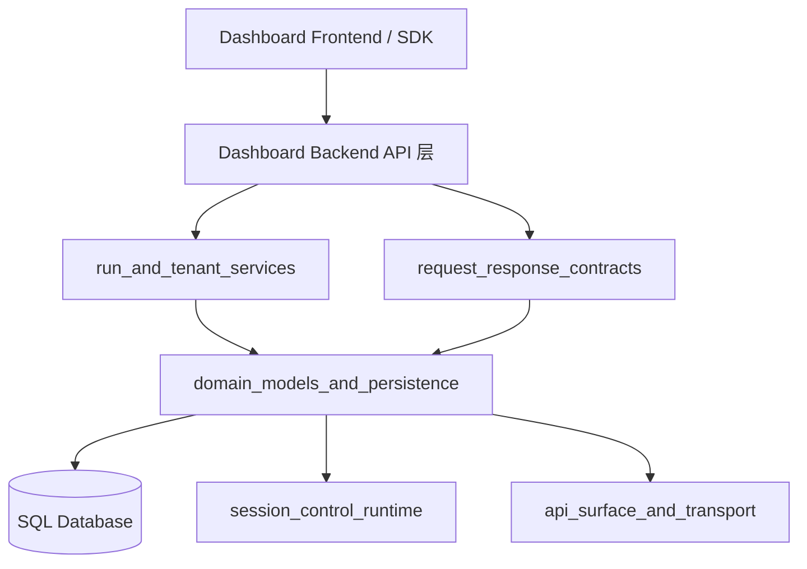
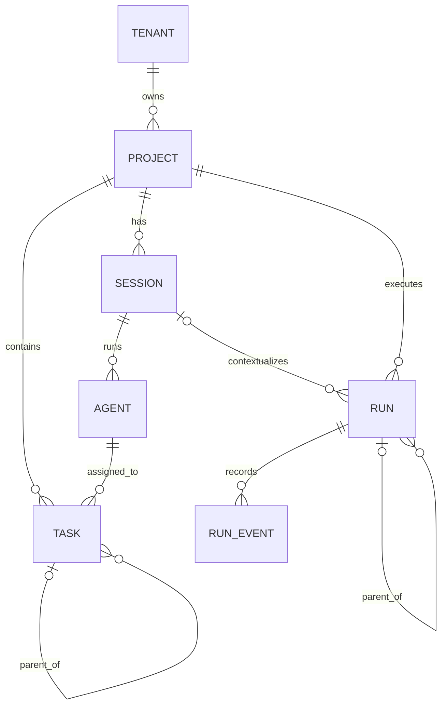
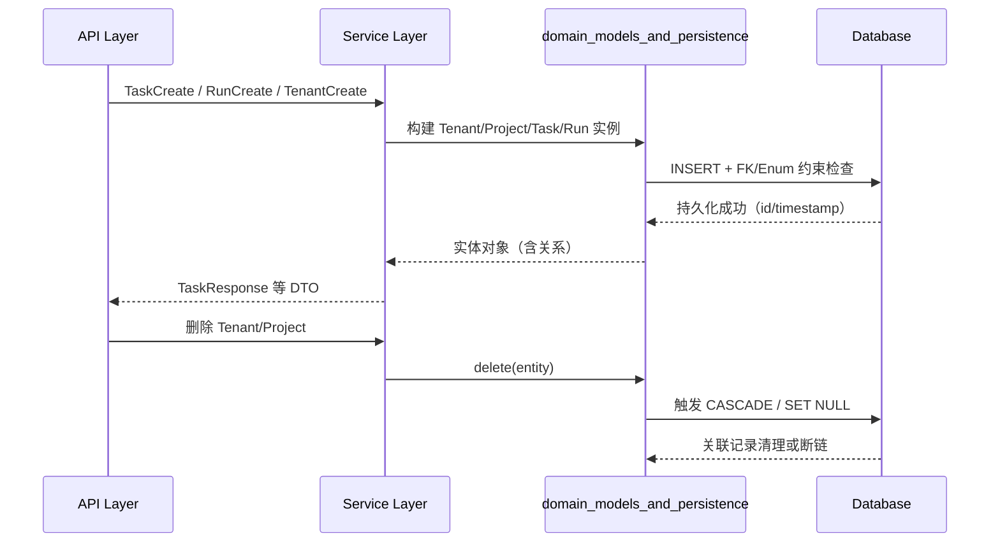
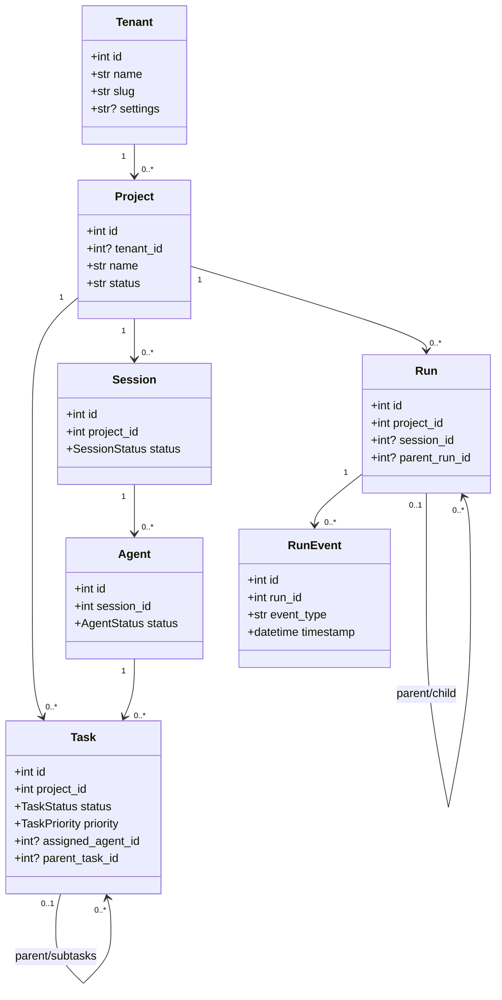
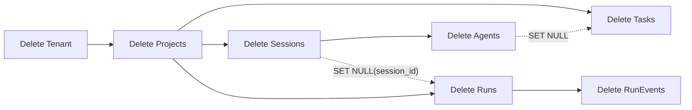

# domain_models_and_persistence 模块文档

## 模块简介

`domain_models_and_persistence` 是 Dashboard Backend 的领域模型核心层，负责把“租户、项目、任务、会话、代理、运行、运行事件”等业务概念映射为可持久化的关系型数据结构。这个模块存在的根本原因，是为上层 API 与服务（例如任务创建、看板拖拽、运行追踪、租户隔离）提供稳定的数据语义边界：上层关心业务流程，这一层关心数据形状、约束、关联和生命周期。

在架构上，它采用 SQLAlchemy 2.0 声明式模型（`DeclarativeBase + Mapped + mapped_column`）并兼容异步数据库访问范式。虽然本文件只定义模型，不直接包含 CRUD 服务逻辑，但几乎所有 Dashboard 后端行为都间接依赖这些模型：你在 API 中看到的 `TaskCreate/TaskUpdate/RunCreate/TenantCreate` 等请求体，最终都要落盘到这些表结构；你在前端看到的任务状态列、代理分配、运行时间线，最终也都从这些模型聚合出来。

从职责上看，该模块聚焦三件事：第一，定义领域实体和枚举；第二，定义实体间关系与删除策略（`CASCADE`、`SET NULL`、`delete-orphan`）；第三，提供审计和追踪所需的时间戳与层次化结构（例如任务父子关系、运行父子关系、按时间排序的运行事件）。

---

## 在整体系统中的位置



该模块位于 API 之下、数据库之上，是典型的“领域数据层”。`request_response_contracts`（例如 `TaskCreate`、`ProjectUpdate`）负责定义入参/出参契约，`run_and_tenant_services` 负责业务流程编排，而真正的数据约束（哪些字段可空、删除是否级联、枚举是否合法）由本模块统一裁决。这样做的好处是：即便 API 形态演进，只要领域模型保持稳定，系统行为就具备可预测性。

相关模块请参考：
- [Dashboard Backend.md](Dashboard Backend.md)
- [api_surface_and_transport.md](api_surface_and_transport.md)
- [Session Control.md](Session Control.md)
- [Migration Engine.md](Migration Engine.md)

---

## 设计原则与持久化策略

本模块遵循“强关系、弱 schema 扩展”的策略。核心业务字段使用强类型列（`Integer/String/Enum/DateTime`）确保可查询与可约束；而可变配置与动态指标（如 `settings`、`metrics`、`config`、`result_summary`）采用 `Text` 保存 JSON 字符串，以换取演进灵活性。这是一个工程上常见折中：结构化字段用于高频过滤与关联，半结构化字段用于减少迁移频率。

删除策略方面，父子关系大量使用数据库外键 `ondelete` 与 ORM 级 `cascade` 组合：

- 对必须随父实体消亡的数据采用 `CASCADE`（例如删除 `Project` 时删除其 `Task`/`Session`）。
- 对保留历史但断开关联的数据采用 `SET NULL`（例如 `Task.assigned_agent_id`、`Run.session_id`）。
- 对 ORM 关系集合采用 `delete-orphan`，避免游离子记录。

这种设计直接影响运维和业务一致性：删除租户不是“软删除语义”，而是会触发项目及其下游实体物理级联删除，必须谨慎操作。

---

## 核心枚举（业务状态机基础）

### `TaskStatus`

`TaskStatus` 定义看板任务生命周期，包含 `BACKLOG`、`PENDING`、`IN_PROGRESS`、`REVIEW`、`DONE`。它不仅是 UI 展示值，也决定了任务流转语义。由于底层是数据库 Enum 列，写入非法字符串会在入库前或入库时失败（取决于校验层是否先拦截）。

### `TaskPriority`

`TaskPriority` 包含 `LOW`、`MEDIUM`、`HIGH`、`CRITICAL`。优先级字段常用于排序和调度策略。默认值是 `MEDIUM`，因此即便上层请求未传该值，落库后也有确定语义。

### `AgentStatus`

`AgentStatus` 表示代理运行态：`IDLE`、`RUNNING`、`PAUSED`、`ERROR`。它是任务分配与运行监控的关键维度，尤其在“分配任务前是否可接单”这类逻辑中非常常见。

### `SessionStatus`

`SessionStatus` 包含 `ACTIVE`、`COMPLETED`、`FAILED`、`PAUSED`，用于表示执行会话生命周期。`Run` 与 `Agent` 都在不同程度上受到会话状态约束，上层服务通常会据此决定是否允许继续写入事件或创建新代理。

---

## 实体模型详解

## `Base`

`Base` 继承 `DeclarativeBase`，是所有模型的根。它本身不包含字段，但承担元数据聚合职责，供建表、迁移、反射等能力统一使用。

### 作用

- 统一 SQLAlchemy metadata；
- 为所有模型提供一致声明入口；
- 便于 Alembic 等迁移工具识别模型全集。

---

## `Tenant`

`Tenant` 是多租户隔离的根实体，对应表 `tenants`。

### 字段

- `id`: 自增主键。
- `name`: 租户名，唯一且非空。
- `slug`: URL/系统标识，唯一且非空。
- `description`: 可选描述。
- `settings`: 可选 JSON 字符串配置。
- `created_at` / `updated_at`: 服务端时间戳，`updated_at` 随更新自动刷新。

### 关系与副作用

`Tenant.projects` 是一对多关系，配置了 `cascade="all, delete-orphan"`。这意味着从 ORM 角度删除租户时，挂在其下的项目会成为孤儿并被删除；同时数据库外键层 `Project.tenant_id` 也配置 `ondelete="CASCADE"`，双重保证级联一致性。

### 典型用途

- 企业/组织级数据隔离；
- 租户维度配置（配额、策略开关等）挂载入口；
- 与 API Key/Policy 管理模块形成隔离边界（详见 [API Keys.md](API Keys.md) 与 Policy 相关文档）。

---

## `Project`

`Project` 对应实际的 Loki Mode 项目，是任务、会话、运行的业务锚点，对应表 `projects`。

### 字段

- `id`, `name`, `description`：基础信息。
- `prd_path`: PRD 文件路径，支持将外部文档与项目绑定。
- `status`: 字符串状态（默认 `active`，非 Enum）。
- `tenant_id`: 可空外键到 `tenants.id`，允许“无租户项目”场景。
- `created_at`, `updated_at`: 时间戳。

### 关系

- `tenant`：多对一到 `Tenant`。
- `tasks`：一对多到 `Task`，`delete-orphan`。
- `sessions`：一对多到 `Session`，`delete-orphan`。

### 设计说明

`status` 采用字符串而非枚举，意味着该字段演进成本低，但也把状态合法性校验推给上层服务。若你计划扩展项目状态机，建议在 API 层加白名单校验，避免数据库出现语义漂移值。

---

## `Task`

`Task` 是看板核心实体，对应表 `tasks`，支持状态、优先级、顺序、父子任务和代理分配。

### 字段

- `project_id`: 所属项目（必填，`CASCADE`）。
- `title`, `description`: 任务内容。
- `status`: `TaskStatus`，默认 `PENDING`。
- `priority`: `TaskPriority`，默认 `MEDIUM`。
- `position`: 列内排序位置（整数，默认 0）。
- `assigned_agent_id`: 可选外键到 `agents.id`，代理删除后设空（`SET NULL`）。
- `parent_task_id`: 可选自关联外键，父任务删除后设空（`SET NULL`）。
- `estimated_duration` / `actual_duration`: 预计/实际耗时。
- `completed_at`: 完成时间。
- `created_at`, `updated_at`: 时间戳。

### 关系

- `project`：多对一到 `Project`。
- `assigned_agent`：多对一到 `Agent`。
- `subtasks` / `parent_task`：自引用树结构关系。

### 内部机制与约束

任务层次关系通过同一个外键 `parent_task_id` 实现。`parent_task` 使用 `remote_side=[id]` 指定“远端主键”来消除自连接歧义。该实现足以支持一层或多层子任务，但**没有内建循环依赖保护**（例如 A 的父是 B，B 的父又回到 A）。如果上层服务不做检测，理论上可写入循环图，导致遍历逻辑出错。

### 与请求/响应契约的映射

- 创建：`dashboard.server.TaskCreate`
- 更新：`dashboard.server.TaskUpdate`
- 拖拽移动：`dashboard.server.TaskMove`
- 返回：`dashboard.server.TaskResponse`

这些契约与模型字段高度对齐，开发者可以把它们视作 Task 的 API 映射层。参考 [Dashboard Backend.md](Dashboard Backend.md) 获取端点层行为。

---

## `Session`（非当前核心清单但与核心实体强耦合）

虽然 `Session` 不在本模块“核心组件列表”中，但它是 `Project`、`Agent`、`Run` 的关键中介实体。它对应表 `sessions`，描述一次执行会话上下文。

### 字段

- `project_id`: 归属项目。
- `status`: `SessionStatus`，默认 `ACTIVE`。
- `provider`, `model`: 执行模型提供方与具体模型。
- `started_at`, `ended_at`: 会话起止时间。
- `logs`: 日志文本。

### 关系

- `project`：多对一到 `Project`。
- `agents`：一对多到 `Agent`，删除会话会级联删除代理。

---

## `Agent`

`Agent` 表示会话中的 AI 代理实例，对应表 `agents`。

### 字段

- `session_id`: 必填外键，删除 session 级联删除 agent。
- `name`, `agent_type`: 名称与类型（默认 `general`）。
- `status`: `AgentStatus`，默认 `IDLE`。
- `model`: 可选模型名。
- `current_task`: 当前执行任务描述。
- `metrics`: JSON 字符串指标。
- `created_at`, `updated_at`: 时间戳。

### 关系与行为

- `session`：归属会话。
- `assigned_tasks`：被分配任务集合。

因为 `Task.assigned_agent_id` 使用 `SET NULL`，删除 Agent 不会删除任务，只会解除分配关系。这对任务历史可追溯性是友好的，也减少“误删代理导致任务消失”的风险。

---

## `Run`

`Run` 是 RARV 执行实例，对应表 `runs`。它与项目绑定，可选绑定 session，并支持父子 run（重试/派生链路）。

### 字段

- `session_id`: 可空，删除 session 后自动置空。
- `project_id`: 必填，删除 project 级联删除 run。
- `status`: 字符串状态，默认 `running`。
- `trigger`: 触发来源，默认 `manual`。
- `config`: JSON 字符串配置。
- `result_summary`: 结果摘要（文本/JSON 字符串）。
- `parent_run_id`: 可选父运行引用，父 run 删除后置空。
- `started_at`, `ended_at`, `created_at`: 时间字段。

### 关系

- `session`: 可选关联会话。
- `project`: 关联项目。
- `parent_run`: 自关联父 run。
- `events`: 一对多 `RunEvent`，`delete-orphan`，并按 `RunEvent.timestamp` 排序。

### 设计价值

`Run` + `RunEvent` 的组合提供了“粗粒度状态 + 细粒度时间线”双层观测。`status` 适合列表过滤，`events` 适合故障诊断、流程回放、前端时间轴展示。

### 与服务契约映射

`dashboard.runs.RunCreate` 与 `Run` 的关键输入一致：`project_id`、`trigger`、`config`。其中 `config` 在 schema 中是 `dict`，落库时应序列化为字符串，读取时反序列化回结构化对象。

---

## `RunEvent`

`RunEvent` 对应表 `run_events`，记录某次 `Run` 的时间线事件。

### 字段

- `run_id`: 所属运行（必填，`CASCADE`）。
- `event_type`: 事件类型（如阶段切换、错误、产物生成）。
- `phase`: 可选流程阶段。
- `details`: 可选细节（通常文本或 JSON 字符串）。
- `timestamp`: 事件时间，默认数据库当前时间。

### 行为特征

由于 `Run.events` 在关系中指定 `order_by="RunEvent.timestamp"`，读取 run.events 时天然时间有序。需要注意的是，若同一秒写入多条事件且数据库时间精度较粗，严格稳定排序可能受限，可在上层额外按 `id` 做次级排序。

---

## 实体关系总览



这个模型图体现了两条主链路：其一是“项目执行链”（Project → Session → Agent / Run），其二是“任务管理链”（Project → Task，Task 自关联，Task ↔ Agent）。租户是项目之上的隔离边界，运行事件是运行之下的追踪边界。

---

## 生命周期与数据流



这条流程强调一点：业务服务层主要负责“何时写”，而模型层/数据库负责“能否写、删除时如何传播副作用”。当你排查数据异常时，要同时检查服务逻辑和外键/级联配置是否符合预期。

---

## 使用示例

### 1) 创建租户与项目

```python
from dashboard.models import Tenant, Project

tenant = Tenant(name="Acme", slug="acme", description="Enterprise tenant")
project = Project(name="Loki Upgrade", tenant=tenant, status="active")

session.add(tenant)
session.add(project)
await session.commit()
```

### 2) 创建任务并设置父子关系

```python
from dashboard.models import Task, TaskStatus, TaskPriority

parent = Task(project_id=1, title="Implement API", status=TaskStatus.IN_PROGRESS)
child = Task(
    project_id=1,
    title="Write validation tests",
    parent_task=parent,
    priority=TaskPriority.HIGH,
)

session.add_all([parent, child])
await session.commit()
```

### 3) 创建运行与事件时间线

```python
from dashboard.models import Run, RunEvent

run = Run(project_id=1, trigger="manual", status="running")
run.events.append(RunEvent(event_type="started", phase="plan", details="{}"))
run.events.append(RunEvent(event_type="completed", phase="execute", details="{}"))

session.add(run)
await session.commit()
```

---

## 扩展与二次开发建议

如果你需要扩展本模块，优先遵循“先契约、后模型、再迁移”的顺序。先在请求/响应层明确字段语义，再在模型中添加列与关系，最后补迁移脚本和历史数据回填。这样可以避免数据库结构先行导致 API 语义不稳定。

新增枚举值时要确认前端和 SDK 是否已经处理该状态，否则会出现“数据库合法、客户端未知”的兼容问题。新增关系时要明确删除策略，尤其是 `CASCADE` 是否会误伤历史数据。

对于 `settings/metrics/config/details` 这类 JSON 字符串字段，建议统一封装序列化/反序列化工具，并约定 schema version，避免长期演进后出现“同列多格式”的读写分叉。

---

## 边界条件、错误与限制
## 组件级“内部工作方式”补充说明

下面从 ORM 行为角度，补充每个核心组件在运行时的工作方式。由于本模块没有显式业务函数，开发者通常通过“构造模型对象 + Session flush/commit”来触发持久化；因此这里把“参数”理解为模型字段输入，把“返回值”理解为 flush/commit 后数据库回填状态。

### `TaskStatus` / `TaskPriority` / `AgentStatus` / `SessionStatus` 的运行时语义

这些枚举本质上是 Python `Enum` + SQLAlchemy `Enum(column)` 的组合。写入时，ORM 会尝试把 Python 枚举成员映射到数据库枚举值；读取时，数据库值会反向还原为枚举成员。它们的副作用是把状态集合固定下来，降低“拼写错误导致脏数据”的概率。

需要注意，本模块中只有 `Task.status`、`Task.priority`、`Agent.status`、`Session.status` 使用了强枚举；`Project.status`、`Run.status`、`Run.trigger` 仍是 `String`，因此状态扩展策略在不同实体上并不一致。这是设计上的“渐进约束”而非绝对约束。

### `Tenant`

在创建 `Tenant(name, slug, ...)` 并提交后，数据库会回填 `id/created_at/updated_at`。其关键副作用是：如果后续通过 ORM 删除该租户，`projects` 关系上的 `delete-orphan` 与外键 `CASCADE` 会共同生效，租户下所有项目会被清理；项目下游数据又会继续触发级联。

### `Project`

`Project` 是多数查询的根过滤维度。创建时最常传入 `name`、可选 `tenant_id`、`status`。提交后的典型返回状态是已分配主键，且可通过 `project.tasks`、`project.sessions` 进行关系导航。其副作用是作为“级联源头”：删除项目会删除其任务、会话、运行等关联数据（取决于外键链路）。

### `Task`

`Task` 的输入参数通常包括 `project_id`、`title`、`status`、`priority`、`position`、`parent_task_id`、`assigned_agent_id`。提交后会回填 `id` 与时间戳。该实体最重要的副作用是两类：第一，`parent_task_id` 形成自引用树；第二，`assigned_agent_id` 把任务挂接到 Agent。当关联 Agent 被删除时，任务不会被删，只会被“解除分配”（`SET NULL`）。

### `Agent`

`Agent` 以 `session_id` 为生存边界。构造时建议至少设置 `name`，其余如 `agent_type/model/current_task/metrics` 按运行时补充。提交后可通过 `agent.assigned_tasks` 反查任务集合。其主要副作用是承接会话生命周期：删除 `Session` 会级联删除 `Agent`。

### `Run`

`Run` 代表一次执行记录，输入核心字段是 `project_id`、可选 `session_id`、`status`、`trigger`、`config`、`parent_run_id`。提交后通常用于驱动时间线 UI 或审计查询。其主要副作用是承载 `RunEvent` 子记录；删除 Run 会删除所有事件。若删除关联 `Session`，Run 仍可保留（`session_id` 置空），这对历史追踪很关键。

### `RunEvent`

`RunEvent` 的输入最关键是 `run_id + event_type`，其余 `phase/details` 可选。提交后会按数据库时间自动填 `timestamp`。在 ORM 读取侧，`Run.events` 因声明了 `order_by="RunEvent.timestamp"`，默认按时间顺序返回，便于前端直接渲染 timeline。

---

## 模型依赖与交互细节



这张图强调了一个关键事实：`Task` 与 `Run` 都有“树化能力”（自关联），而 `Project` 同时承载“协作管理域（Task/Session/Agent）”和“执行追踪域（Run/RunEvent）”。这使得项目既可以作为工作管理容器，也可以作为执行审计容器。



这个删除传播图展示了“硬删除 + 断链保留”混合策略：大多数关系是硬级联；少数历史关系采用 `SET NULL`。实际运维中，这意味着你可以保留任务和运行历史主记录，但会失去某些上下文连接。

### 推荐的 JSON 字段封装模式

```python
import json
from dashboard.models import Run

payload = {"temperature": 0.2, "max_steps": 12, "schema_version": 1}
run = Run(project_id=42, trigger="manual", config=json.dumps(payload, ensure_ascii=False))

session.add(run)
await session.commit()

loaded = json.loads(run.config or "{}")
```

因为 `config/details/metrics/settings` 在数据库里是 `Text`，建议统一序列化策略，并至少包含 `schema_version`，否则随着版本演进会出现同列多结构并存的问题。

### 推荐的查询加载策略

```python
from sqlalchemy import select
from sqlalchemy.orm import selectinload
from dashboard.models import Run

stmt = (
    select(Run)
    .where(Run.project_id == 42)
    .options(selectinload(Run.events))
)
rows = (await session.execute(stmt)).scalars().all()
```

对于 `Run -> RunEvent`、`Project -> Task` 这类父子读取，建议显式使用 `selectinload/joinedload` 避免 N+1 查询。模型本身不强制加载策略，因此性能表现很依赖服务层查询写法。

---


1. **自关联循环风险**：`Task.parent_task_id` 与 `Run.parent_run_id` 均未内建环检测，需要服务层防止环形依赖。
2. **字符串状态漂移**：`Project.status`、`Run.status`、`Run.trigger` 不是 Enum，存在写入脏值风险。
3. **JSON 字符串一致性**：`settings/metrics/config/result_summary/details` 仅是 `Text`，数据库不保证 JSON 合法。
4. **级联删除不可逆**：删除 Tenant/Project 会触发深层级联，务必在生产环境增加确认与审计。
5. **事件排序精度问题**：`RunEvent` 默认按 `timestamp` 排序，极端高并发时同时间戳事件顺序可能不稳定。
6. **完成时间需业务维护**：`Task.completed_at` 不会因 `status=DONE` 自动填充，需上层逻辑显式写入。
7. **可空外键的语义断裂**：`SET NULL` 能保留记录但会失去上下文关联，查询侧需处理 null 分支。

---

## 与其他文档的关系

为了避免重复，本文件重点解释“领域结构与持久化语义”。以下主题请查看对应文档：

- API 路由、鉴权、中间件、WebSocket 传输：[`api_surface_and_transport.md`](api_surface_and_transport.md)
- 后端全景与模块导航：[`Dashboard Backend.md`](Dashboard Backend.md)
- 会话启动/停止与运行时控制：[`Session Control.md`](Session Control.md)
- 迁移任务与成本评估编排：[`Migration Engine.md`](Migration Engine.md)

如果你从 SDK 侧接入本模块的数据，建议同步阅读 Python/TypeScript SDK 文档中 `Tenant/Project/Task/Run/RunEvent` 类型说明，确保跨端字段语义一致。
