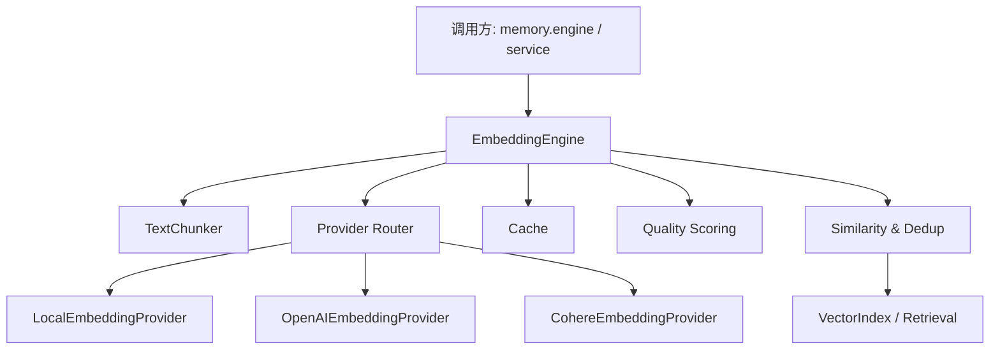
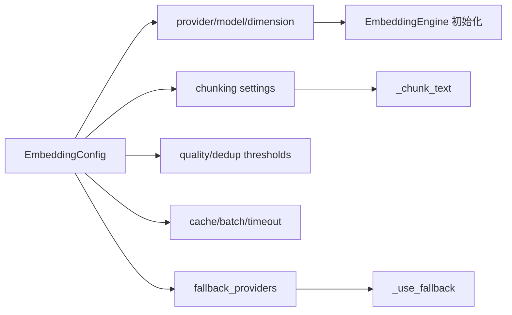
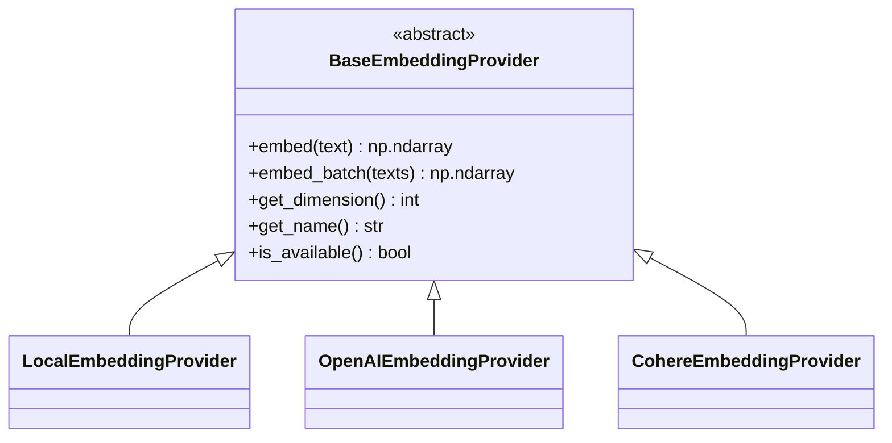
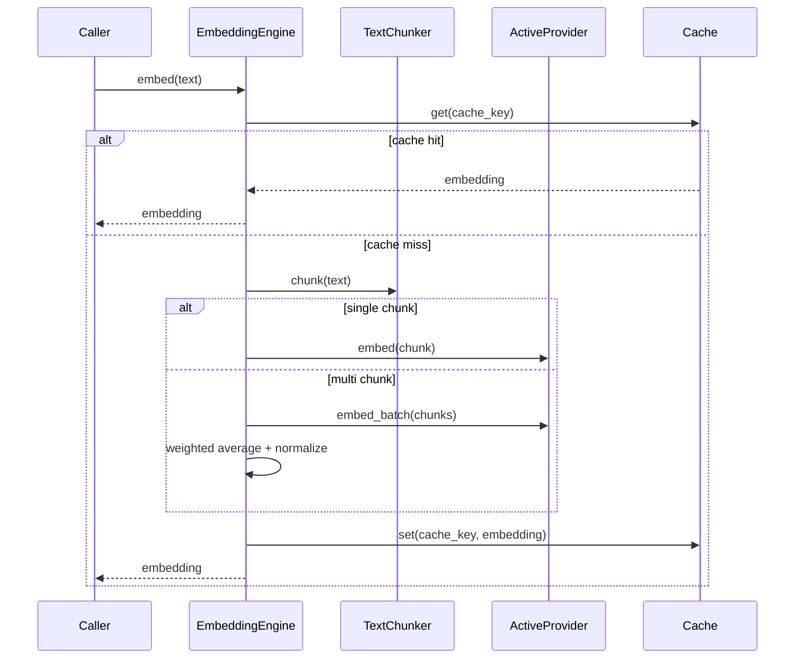

# embedding_and_chunking 模块文档

## 模块概述

`embedding_and_chunking` 是 Memory System 中连接“原始文本”与“向量检索能力”的关键入口层。它的职责并不只是把字符串变成向量，而是提供一条完整、可降级、可观测、可配置的语义表征流水线：先按策略分块（chunking），再选择合适的 embedding provider 生成向量，并通过缓存、质量评估、相似度计算和语义去重来支持上游记忆写入与下游召回。

从系统设计角度看，这个模块存在的核心原因是：在多来源、多规模、多运行环境（本地开发、离线部署、云 API）下，单一 embedding 实现很难同时满足“稳定性、成本、质量、性能”。因此它采用“多 provider + fallback + chunking 策略抽象”的架构，让调用者以统一接口获得可预测行为，而不用关心每个供应商 SDK 的差异。

在整体 Memory System 中，该模块通常位于 `memory.engine.*`（语义/程序/情节记忆）与 `memory.retrieval.*`（向量索引、存储协议）之间，承担“语义编码前处理 + 编码执行”的中间层角色。关于召回索引与存储结构，请参阅 [Retrieval.md](Retrieval.md) 与 [Vector Index.md](Vector%20Index.md)；关于统一记忆访问层，请参阅 [Unified Access.md](Unified%20Access.md)；关于 Memory System 全局关系，请参阅 [Memory System.md](Memory%20System.md)。

---

## 架构与组件关系



上图体现了该模块的核心思想：`EmbeddingEngine` 是统一门面（facade），内部将文本处理、provider 选择、缓存与评估能力聚合起来。`TextChunker` 负责“如何切文本”，provider 层负责“如何转向量”，`Similarity & Dedup` 负责“如何使用向量进行后续语义判断”。这使得调用方只需要处理“输入文本和结果向量”，而无需在业务代码里写大量条件分支。



配置在本模块中是“一等公民”。`EmbeddingConfig` 不仅决定模型参数，也直接决定运行时行为（是否分块、是否拼上下文、是否允许缓存、失败后如何切 provider）。这意味着在生产环境中，配置和代码同样重要；错误配置会直接改变质量、成本与延迟。

---

## 核心类型与实现细节

## `EmbeddingProvider`（Enum）

`EmbeddingProvider` 定义了 provider 标识值：`local`、`openai`、`cohere`。它的价值在于建立稳定的 provider 语义命名，避免在上层业务中散落硬编码字符串。虽然 `EmbeddingConfig.provider` 字段类型是 `str`（兼容性设计），但建议调用方仍按该枚举取值约束输入，减少拼写错误带来的隐式 fallback。

## `ChunkingStrategy`（Enum）

`ChunkingStrategy` 定义可选分块策略：`none`、`fixed`、`sentence`、`semantic`。这四类策略代表了从“最简单截断”到“较语义友好切分”的不同工程权衡。

`none` 适合短文本或由上游已做过切片的场景；`fixed` 适合对吞吐稳定性要求高的离线批处理；`sentence` 在自然语言文本中通常比固定长度更稳；`semantic` 试图利用段落/代码块边界保持语义完整，是默认策略。

## `TextChunker`

`TextChunker` 是纯静态工具类，集中封装分块算法与上下文拼接逻辑。

### `chunk_fixed(text, max_size=512, overlap=50) -> List[str]`

该函数按固定字符窗口切分，并引入重叠区（overlap）以降低边界信息丢失。内部逻辑简单且高性能，适合大规模离线作业。需要注意它以“字符数”而非 token 数做估计，因此面对多字节语言或复杂编码时，分块与真实模型 token 限制可能存在偏差。

### `chunk_sentence(text, max_size=512) -> List[str]`

该函数通过正则 `(?<=[.!?])\s+` 做句子边界切分，再将句子拼到不超过 `max_size` 的 chunk。它对英文常见标点友好，但对中文句号、缩写、代码注释等复杂边界并不完美，属于轻量启发式策略。

### `chunk_semantic(text, max_size=512) -> List[str]`

该函数优先按“双换行段落”和“代码块标记（```...```）”切分，再在超大段时回退到 `chunk_sentence`。从设计意图看，它希望尽量保持结构块完整，尤其适合混合文档（说明文字 + 代码片段）。但当前正则使用 `split` 处理代码块时会丢失分隔匹配体本身，这意味着代码块内容可能被移除，属于一个需要关注的实现风险。

### `add_context(text, full_content, context_lines=3) -> str`

该函数用于给 chunk 添加前后文行。它先用 `find` 定位首次匹配，再截取前后若干行拼接。优点是实现便宜；局限是当 chunk 在全文出现多次时，只会命中第一处，可能导致上下文错位。

---

## Provider 抽象与三种实现



`BaseEmbeddingProvider` 定义统一接口，使 `EmbeddingEngine` 能在不关心实现细节的情况下切换 provider。三个实现都返回 `np.ndarray`，并提供 batch 能力，以便上层统一处理。

`LocalEmbeddingProvider` 优先使用 `sentence-transformers`，失败时退化到 TF-IDF hashing embedding。该 fallback 保证“永远可用”，但语义质量明显低于神经模型。它的 TF-IDF 方案通过 md5 哈希把 token 投影到固定维度，并做 L2 归一化，因此可以稳定输出向量，但不具备跨语义泛化能力。

`OpenAIEmbeddingProvider` 与 `CohereEmbeddingProvider` 都是典型“SDK 包装器”。它们在构造阶段检查依赖和 API key，可用性由 `is_available()` 暴露。批处理时分别采用保守批大小（OpenAI 100、Cohere 96）以降低请求失败概率。

---

## `EmbeddingEngine`：模块主入口

`EmbeddingEngine` 是真正对外使用的核心类。其运行流程可概括为：加载配置 → 初始化 provider 集合 → 选择主 provider → 执行分块/嵌入/归一化 → 缓存与指标记录 → 失败时 fallback。

### 初始化与 provider 选择

如果调用方不传 `config`，引擎会优先读取 `.loki/config/embeddings.json`，否则从环境变量构造默认配置。这种“文件优先、环境兜底”策略便于本地调试与容器化部署兼容。

初始化时，本地 provider 始终被创建，作为最终兜底。若 OpenAI/Cohere key 存在则额外注册对应 provider。主 provider 不可用时，`_use_fallback()` 会按 `fallback_providers` 顺序尝试切换，最后强制回落到 local。

### `embed(text, with_context=False, full_content=None) -> np.ndarray`

单文本嵌入过程包含以下关键步骤：
1. 可选上下文拼接。
2. 可选缓存命中。
3. 按策略分块。
4. 单块直接嵌入；多块执行 batch 嵌入并按 chunk 长度加权平均。
5. L2 归一化。
6. 记录 provider 调用次数与延迟。
7. provider 异常时 fallback 后重试。

这个实现兼顾了正确性和实用性：多块加权平均简单且鲁棒，但它会压平段间结构差异，不适合需要细粒度 passage-level 检索的场景（那应由上游单独存储每个 chunk）。

### `embed_batch(texts, with_context=False, full_contents=None) -> np.ndarray`

批量接口优先复用 provider 的原生批能力，性能优于循环调用 `embed()`。需要注意，当前实现不会对 batch 输入逐条做 chunking；它假设每条 text 已可直接送入 provider。如果传入超长文本，是否截断/报错由 provider 自身行为决定。

### `embed_with_quality(...) -> (embedding, EmbeddingQuality)`

该接口在嵌入后调用 `compute_quality_score` 输出质量指标。质量分由密度、方差、覆盖率加权组成，是启发式评分，用于“健康度监控”比“绝对精度评估”更合适。

### `similarity(a, b)` 与 `similarity_search(query, corpus, top_k)`

二者均基于 cosine similarity。`similarity_search` 采用 `argpartition` 做 Top-K，兼顾效率与排序正确性（最终会对候选重新排序）。空语料或 `top_k<=0` 时返回空列表，行为明确。

### `deduplicate(texts, threshold=None) -> List[int]`

该函数通过 embedding 相似度做近重复删除，返回“保留项索引”。它是 O(n²) 逐步比较实现，适合中小批量数据清洗；大规模数据去重建议引入近邻索引或分桶策略。

### 运维辅助接口

`get_metrics()` 可输出请求量、缓存命中、provider 调用分布、平均时延与 fallback 状态，是排障和容量评估的重要入口。`clear_cache()`、`get_provider_name()`、`is_using_fallback()` 则用于运行期诊断。

---

## 质量评分模型

`compute_quality_score` 产出 `EmbeddingQuality`，包含 `score/coverage/density/variance/provider`。它不是模型质量 benchmark，而是运行时统计信号。

`coverage` 使用“4 字符≈1 token”的粗略估计，意味着该指标对语言和文本类型敏感；`variance` 在某些模型上可能天然较低，不应单独解读。建议把它用于趋势监控，例如比较“同一工作负载在 provider 切换前后”的相对变化。

---

## 配置与使用

### 环境变量

```bash
export LOKI_EMBEDDING_PROVIDER=openai
export LOKI_EMBEDDING_MODEL=text-embedding-3-small
export OPENAI_API_KEY=...
export LOKI_EMBEDDING_CHUNKING=semantic
export LOKI_EMBEDDING_CONTEXT=true
```

### 配置文件示例

```json
{
  "provider": "cohere",
  "model": "embed-english-v3.0",
  "fallback_providers": ["openai", "local"],
  "chunking_strategy": "semantic",
  "max_chunk_size": 512,
  "chunk_overlap": 50,
  "include_context": true,
  "context_lines": 3,
  "dedup_threshold": 0.95,
  "cache_enabled": true,
  "timeout": 30.0
}
```

### 典型调用

```python
from memory.embeddings import EmbeddingEngine, EmbeddingConfig

config = EmbeddingConfig.from_env()
engine = EmbeddingEngine(config=config)

vec = engine.embed("Design a robust fallback strategy for embeddings")
print(engine.get_dimension(), engine.get_provider_name())

batch = engine.embed_batch(["task A", "task B", "task C"])

unique_idx = engine.deduplicate([
    "Add retry logic to API client",
    "Add retries to API client",
    "Implement dark mode"
], threshold=0.92)
```

---

## 关键流程



该流程强调两个现实要点：第一，缓存键包含 provider 与 model，因此模型切换不会污染旧缓存；第二，chunking 仅在单文本接口默认生效，批量接口应由调用方自行保证输入粒度。

---

## 边界条件、错误与限制

本模块在工程上非常实用，但也有若干容易踩坑的点。首先，`EmbeddingConfig.provider` 是字符串；拼写错误不会立刻报错，而是警告后 fallback 到 local，可能导致“质量悄然下降”。其次，`chunk_semantic` 的正则分割策略可能丢失代码块内容，处理技术文档时应重点验证。再次，`embed_batch` 未执行 chunking；超长文本可能触发第三方 API 限制。最后，缓存是进程内字典并非线程安全缓存服务，且淘汰策略近似 FIFO（基于插入顺序），不适合多进程共享或强一致场景。

在性能方面，`deduplicate` 的两两比较复杂度较高；在数据规模上万后会明显变慢。若业务依赖大规模去重，建议将该函数视为基线实现，并结合向量索引模块改造（见 [Vector Index.md](Vector%20Index.md)）。

在可观测性方面，`avg_latency_ms` 使用 `total_requests` 做分母，其中批量请求会按文本条数累加，便于估算单条平均时延，但不代表单次 API round-trip 延迟。

---

## 扩展建议

如果你要新增 provider，建议直接继承 `BaseEmbeddingProvider`，优先确保三件事：`is_available()` 能准确反映依赖/凭证状态、`embed_batch()` 有稳定批处理策略、输出维度与 `get_dimension()` 一致。随后在 `EmbeddingEngine._init_providers()` 注册并在配置中暴露模型映射即可。

如果你要改进 chunking，优先保持 `TextChunker` 的纯函数风格，这样可在不触碰 provider 层的前提下独立演进。对于代码密集文档，建议引入 AST/Markdown-aware splitter，避免正则误切造成语义损耗。

---

## 与其他模块的关系

`embedding_and_chunking` 自身不负责持久化和 ANN 检索，它输出的是“可被检索层消费的向量”。因此在文档和实现边界上，请将“编码问题”与“索引问题”分开处理：

- 编码与分块：本文档（`embedding_and_chunking`）
- 检索与索引：参阅 [Retrieval.md](Retrieval.md)、[Vector Index.md](Vector%20Index.md)
- 统一记忆访问和多域记忆编排：参阅 [Unified Access.md](Unified%20Access.md)、[Memory Engine.md](Memory%20Engine.md)

这种边界划分有助于你在排障时快速定位：如果相似度结果异常，先检查 embedding provider/分块质量；如果召回速度或召回率异常，再进入索引层分析。
