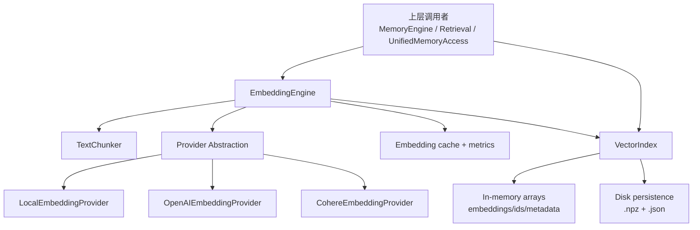
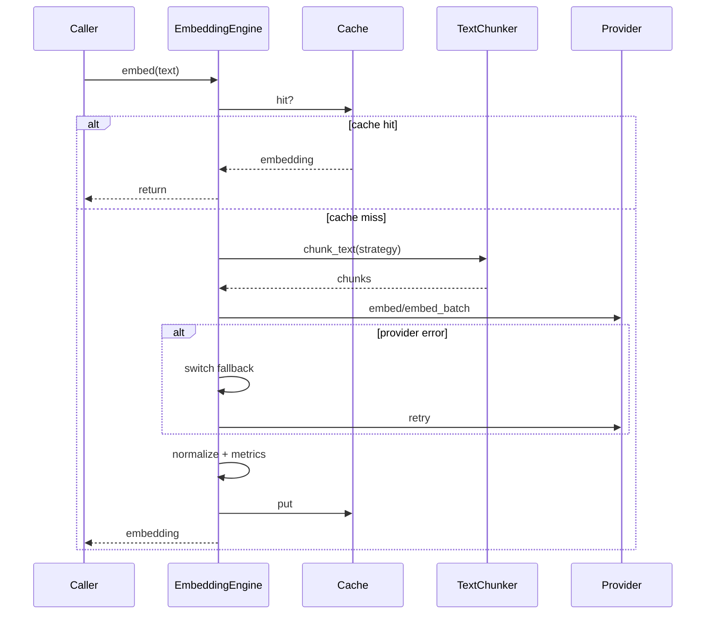
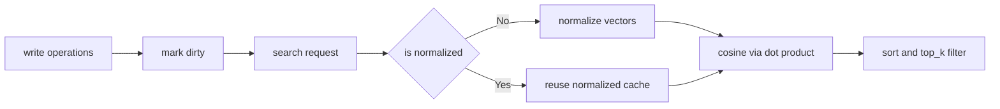

# embedding_and_vector_infra 模块文档

## 引言：为什么这个模块存在

`embedding_and_vector_infra` 是 Memory System 中最底层、也最关键的一组能力：它把“文本”转成“可计算的向量”，再把这些向量组织成可检索的索引结构。前者由 `memory.embeddings` 提供，后者由 `memory.vector_index` 提供。没有这层基础设施，上层的语义记忆、任务上下文召回、学习建议、跨项目检索都只能停留在关键词匹配，无法实现语义级别的理解与相似搜索。

从设计意图看，这个模块要同时满足三个目标。第一，它要在工程上“可落地”，所以内置 `local` provider（并带 TF-IDF 降级），保证即使没有外部 API 也能运行。第二，它要在生产上“可用”，所以有 provider fallback、缓存、批处理、质量评分和持久化索引。第三，它要在架构上“可扩展”，所以 provider 采用抽象基类，索引结构保持纯 `numpy` 实现，便于快速接入和调试。

在模块边界上，建议把它理解为“Memory System 的向量中间件层”：它不直接定义业务记忆类型（episode、pattern、skill），而是为这些上层实体提供向量化和近邻搜索能力。若需 Memory System 全貌，请先阅读 [Memory System.md](Memory System.md)；若需上层检索策略，请参考 [Retrieval.md](Retrieval.md)；若需统一入口语义，请参考 [Unified Access.md](Unified Access.md)。

---

## 模块范围与组件地图

本模块（当前文档范围）核心组件来自两个文件：

- `memory.embeddings.TextChunker`
- `memory.embeddings.ChunkingStrategy`
- `memory.embeddings.EmbeddingProvider`
- `memory.vector_index.VectorIndex`

虽然模块树只把上述 4 个标为核心，但实际运行路径中，`EmbeddingEngine`、`EmbeddingConfig`、`BaseEmbeddingProvider` 及其 provider 实现（Local/OpenAI/Cohere）会直接参与调用链，因此本文会作为“必要上下文”一并说明。



上图体现了一个重要事实：`EmbeddingEngine` 与 `VectorIndex` 是松耦合关系。`EmbeddingEngine` 负责“算向量”，`VectorIndex` 负责“管向量”。这种分离让你可以替换任一侧而不影响另一侧，例如继续使用当前 embedding 流程，但换成 FAISS/pgvector；或者保留 `VectorIndex`，但改用自定义 embedding provider。

---

## 一、Embedding 基础设施

### 1.1 枚举：`EmbeddingProvider`

`EmbeddingProvider` 定义了系统认可的 provider 标识：`local`、`openai`、`cohere`。它本身逻辑很轻，但在配置、缓存键、fallback 路由、指标统计中都被当作“身份主键”使用。实际工程中如果扩展新 provider，建议也扩展该枚举以避免 magic string 扩散。

### 1.2 枚举：`ChunkingStrategy`

`ChunkingStrategy` 定义长文本切分策略：`none`、`fixed`、`sentence`、`semantic`。这不是“优化项”，而是检索质量的重要决定因素：同一段文本，不同分块策略会显著影响 embedding 稳定性与召回粒度。

需要注意，配置字段 `max_chunk_size` 注释写的是“Max tokens”，但当前实现实际按**字符数**切分。这会导致中英文混排、代码文本场景下的“token 预算预估偏差”。如果你在上层按 token 做预算控制，这里要做二次校准。

### 1.3 工具类：`TextChunker`

`TextChunker` 是纯静态方法工具类，负责把输入文本处理成可嵌入片段，并可选拼接上下文。

#### `chunk_fixed(text, max_size=512, overlap=50) -> List[str]`

它按固定长度切块，并在相邻块间保留 overlap。实现简单、可预测，适合日志、长串文本等无明显语义边界的输入。副作用是 chunk 可能截断语义或代码结构。

#### `chunk_sentence(text, max_size=512) -> List[str]`

它通过正则 `(?<=[.!?])\s+` 做句子边界切分，再聚合到 `max_size`。优点是自然语言语义完整性较好；限制是句子识别规则偏英文，遇到缩写、代码注释、中文标点会有误切分。

#### `chunk_semantic(text, max_size=512) -> List[str]`

它尝试按段落（双换行）和代码块边界切分，再在单段过长时退化为 `chunk_sentence`。这是默认策略。

**重要注意**：当前实现使用 `re.split(r'\n\n+|```[\s\S]*?```')`，会把匹配到的 ` ```...``` ` 整段作为分隔符移除，可能导致代码块内容在结果中丢失。这是一个需要重点关注的行为风险。

#### `add_context(text, full_content, context_lines=3) -> str`

该方法根据 `text` 在 `full_content` 中的位置，拼接前后若干行上下文。它有两个工程特性：

1. 如果 `text` 在全文中出现多次，只使用 `find` 命中的**第一处**，上下文可能不是你期望的位置。
2. 如果子串不在全文中，直接返回原文，不抛异常。

### 1.4 配置对象：`EmbeddingConfig`

`EmbeddingConfig` 是整个 embedding 子系统的参数中枢，支持 `from_env()` 与 `from_file()` 两种外部加载方式。

关键行为包括：

- `__post_init__` 会自动从环境变量注入 API Key。
- 当 `model` 为空时，会按 provider 自动选默认模型。
- 若模型命中 `MODEL_DIMENSIONS`，会自动覆盖 `dimension`。
- `to_dict()` 会隐藏敏感信息，只暴露 `has_openai_key`/`has_cohere_key` 布尔状态。

配置示例：

```json
{
  "provider": "openai",
  "model": "text-embedding-3-small",
  "fallback_providers": ["cohere", "local"],
  "chunking_strategy": "semantic",
  "max_chunk_size": 800,
  "chunk_overlap": 80,
  "include_context": true,
  "context_lines": 5,
  "cache_enabled": true,
  "timeout": 20.0
}
```

### 1.5 Provider 抽象与实现

`BaseEmbeddingProvider` 规定统一接口：`embed`、`embed_batch`、`get_dimension`、`get_name`、`is_available`。这使 `EmbeddingEngine` 可以在不关心底层 SDK 差异的前提下做统一编排。

`LocalEmbeddingProvider` 的关键设计是“可用性优先”：

- 若有 `sentence-transformers`，走高质量本地模型。
- 若缺依赖或模型加载失败，自动降级到 `_tfidf_embed`。
- `is_available()` 恒为 `True`，保证 fallback 链最后可落地。

`OpenAIEmbeddingProvider` 与 `CohereEmbeddingProvider` 都做了 SDK 惰性初始化和批量请求封装；不可用时抛 `RuntimeError`，由 `EmbeddingEngine` 接管 fallback。它们都依赖 API key 且各自有批次上限（实现中 OpenAI 100、Cohere 96 为安全分片值）。

### 1.6 核心执行器：`EmbeddingEngine`

`EmbeddingEngine` 是 embedding 子系统的统一入口，负责 provider 生命周期、文本分块、缓存、质量评估、去重、相似度和指标统计。



#### 关键方法行为

`embed(text, with_context=False, full_content=None)`：
先进行可选上下文拼接，再查缓存；缓存未命中则按策略切块，单块走 `embed`、多块走 `embed_batch` 并按 chunk 长度加权平均；最终统一 L2 归一化。失败时触发 fallback 并重试。

`embed_batch(texts, with_context=False, full_contents=None)`：
批量路径会做缓存命中检查和 provider 批量调用，再按原顺序回填结果。它在大量短文本场景比多次 `embed()` 更高效。

`similarity(a, b)` 与 `similarity_search(query_embedding, corpus_embeddings, top_k=5)`：
都基于归一化后的余弦相似度，后者在 top-k 小于总量时使用 `argpartition + argsort`，复杂度更友好。

`deduplicate(texts, threshold=None)`：
先对全部文本生成 embedding，再用增量式两两比较保留“首个代表样本”。这是 O(n²) 逻辑，在大规模文本集合上会明显变慢。

`get_metrics()`：
返回总请求数、缓存命中、provider 调用、fallback 次数、总延迟、平均延迟、当前 provider 等，适合接入可观测系统。

---

## 二、向量索引基础设施：`VectorIndex`

`VectorIndex` 是纯 `numpy` 的内存向量索引实现，负责向量与业务 ID/metadata 的关联管理，以及余弦相似检索。

### 2.1 数据结构与内部状态

它维护四个主数据结构：

- `embeddings: List[np.ndarray]`
- `ids: List[str]`
- `metadata: List[Dict]`
- `_id_to_index: Dict[str, int]`

以及一个查询性能标志位 `_normalized` 和搜索时使用的 `_normalized_embeddings`。这是一种“写时脏标记、查时归一化”的模式：增删改后只标记 dirty，真正搜索时再统一归一化，兼顾写入简洁与查询效率。



### 2.2 核心 API

`add(id, embedding, metadata=None)`：
维度不匹配直接 `ValueError`；若 `id` 已存在，不新增而是转 `update`。这让调用侧天然具备幂等更新语义。

`add_batch(ids, embeddings, metadata=None)`：
先严格校验形状、数量、metadata 对齐，再逐条调用 `add`。好处是复用单条校验逻辑；代价是批量极大时 Python 循环开销较高。

`search(query, top_k=5, filter_fn=None)`：
先做维度校验与归一化，再矩阵点积求相似度；可选 `filter_fn(metadata)` 做后过滤。返回 `(id, score, metadata)`，按分数降序。

`update(id, embedding=None, metadata=None)` 与 `remove(id)`：
都通过 `_id_to_index` 常数时间定位目标。`remove` 后会重建映射，复杂度 O(n)。

`save(path)` / `load(path)`：
采用双文件格式：`{path}.npz` 存向量矩阵与维度，`{path}.json` 存 ids 与 metadata。此设计兼顾数值存储效率和可读元数据。

`get_stats()`：
给出条目数、维度、估算内存。内存估算包含 embedding（float32）+ id 字符串长度 + metadata JSON 序列化长度。

---

## 三、模块在整体系统中的位置

在系统层面，该模块是“检索能力的共用底座”。典型链路如下：上层记忆引擎把文本实体交给 `EmbeddingEngine` 计算向量，再写入 `VectorIndex`；检索时对 query 做 embedding，然后在索引中 top-k 召回，最后交给 Retrieval 层做任务权重重排与 token 预算裁剪。


关于完整检索编排，请参考 [Retrieval.md](Retrieval.md)；关于三类记忆实体如何落库与回放，请参考 [Memory Engine.md](Memory Engine.md)。

---

## 四、使用与配置实践

### 4.1 最小可运行示例

```python
from memory.embeddings import EmbeddingEngine, EmbeddingConfig
from memory.vector_index import VectorIndex

config = EmbeddingConfig(provider="local", chunking_strategy="semantic")
engine = EmbeddingEngine(config=config)
index = VectorIndex(dimension=engine.get_dimension())

texts = [
    "Fix bug in payment retry logic",
    "Implement OAuth callback handler",
    "Refactor vector search pipeline"
]

embs = engine.embed_batch(texts)
for i, emb in enumerate(embs):
    index.add(f"doc-{i}", emb, {"text": texts[i], "type": "task_note"})

q = engine.embed("payment failure retry")
results = index.search(q, top_k=2)
print(results)
```

### 4.2 环境变量建议

```bash
export LOKI_EMBEDDING_PROVIDER=openai
export LOKI_EMBEDDING_MODEL=text-embedding-3-small
export LOKI_EMBEDDING_CHUNKING=semantic
export LOKI_EMBEDDING_CONTEXT=true
export OPENAI_API_KEY=***
```

建议在生产环境中固定 provider 与 model，避免运行时自动 fallback 导致向量维度漂移，进而影响索引兼容性。

### 4.3 索引持久化示例

```python
# save
index.save(".loki/memory/index/main")

# load
restored = VectorIndex.from_file(".loki/memory/index/main")
```

恢复后请确保新的 `EmbeddingEngine` 与历史索引维度一致，否则新增向量会因维度校验失败。

---

## 五、扩展指南

### 5.1 扩展新的 Embedding Provider

你需要实现 `BaseEmbeddingProvider` 的五个方法，并在 `EmbeddingEngine._init_providers()` 注册。实践上建议遵循以下约束：

- `embed` 与 `embed_batch` 输出必须是 `np.float32`。
- `get_dimension()` 必须稳定，不随单次请求变化。
- `is_available()` 应同时检查 SDK 依赖和凭证状态。
- 批量请求要做 provider 限额分片。

### 5.2 替换索引实现

由于 `VectorIndex` 与 `EmbeddingEngine` 通过 `np.ndarray` 解耦，可以平滑迁移到 FAISS/Annoy/pgvector。迁移时只需保证：

1. 维度一致性约束仍成立。
2. 查询接口仍能返回 `id + score + metadata`（或可映射到该结构）。
3. 分数语义最好保持为余弦相似度，避免上层阈值策略失效。

---

## 六、边界条件、错误条件与已知限制

### 6.1 Embedding 侧

- 若 `numpy` 不可用，模块导入即抛 `ImportError`，属于“硬失败”。
- `EmbeddingEngine.embed_batch()` 在 `cache_enabled=False` 时，当前实现因 `zip(texts, cache_keys)` 为空导致不计算新向量并返回零矩阵，这是高优先级缺陷。
- `embed_batch()` 路径不做文本 chunking（与 `embed()` 不一致），长文本在批量场景可能超出 provider 限制或质量下降。
- fallback 后 provider 可能切换为不同维度模型，若与既有索引维度不一致，会在写入索引时触发 `ValueError`。
- `TextChunker.chunk_semantic()` 对代码块的 split 规则可能造成代码内容丢失。
- `add_context()` 对重复子串只取首个位置，可能拼接错误上下文。

### 6.2 VectorIndex 侧

- `search()` 会对候选做全量排序，规模大时性能不如近似检索库。
- `remove()` 后重建 `_id_to_index` 为 O(n)，高频删除场景成本高。
- 不提供并发安全，需调用方自行加锁。
- `save()` 与 `load()` 是双文件协议，若写入中断可能出现 `.npz` 与 `.json` 不一致。
- 文件加载时未做“向量数量与 id 数量强一致”校验，异常文件可能导致运行时行为不可预期。

---

## 七、运维与调优建议

如果你把该模块用于生产，推荐优先关注三类指标：缓存命中率、fallback 次数、平均延迟。缓存命中率低通常意味着输入归一策略不稳定（例如拼接了波动上下文）；fallback 次数高通常意味着外部 API 可靠性或凭证问题；平均延迟上升通常与模型尺寸、批量大小、网络状态相关。

在规模增长路径上，建议把“是否替换索引实现”作为明确里程碑：当你开始接近几十万到百万级向量，`VectorIndex` 的全量精确检索会成为瓶颈，此时应评估 ANN 引擎。当前实现更适合中小规模、可解释性优先、部署简洁优先的场景。

---

## 八、与其他文档的关系

- 本文聚焦 embedding 与 vector 基础设施本身。
- 记忆系统全貌见 [Memory System.md](Memory System.md)。
- 检索策略与任务感知排序见 [Retrieval.md](Retrieval.md)。
- 嵌入模块已有拆分文档见 [Embeddings.md](Embeddings.md)。
- 索引模块已有拆分文档见 [Vector Index.md](Vector Index.md)。

如果你正在做新功能开发，建议先读本文，再按调用链阅读 `Retrieval -> Memory Engine -> Unified Access` 三份文档，以快速建立从底层向量到上层行为的完整心智模型。
