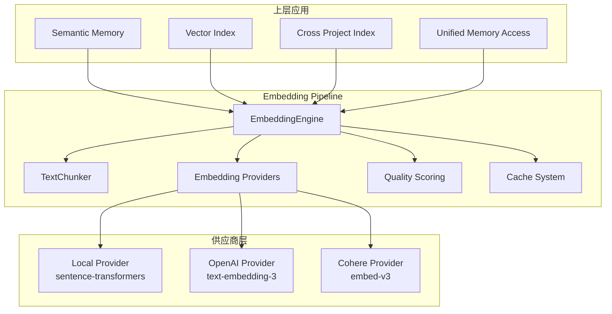
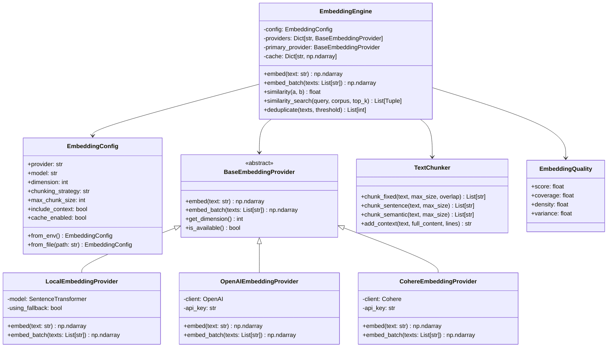
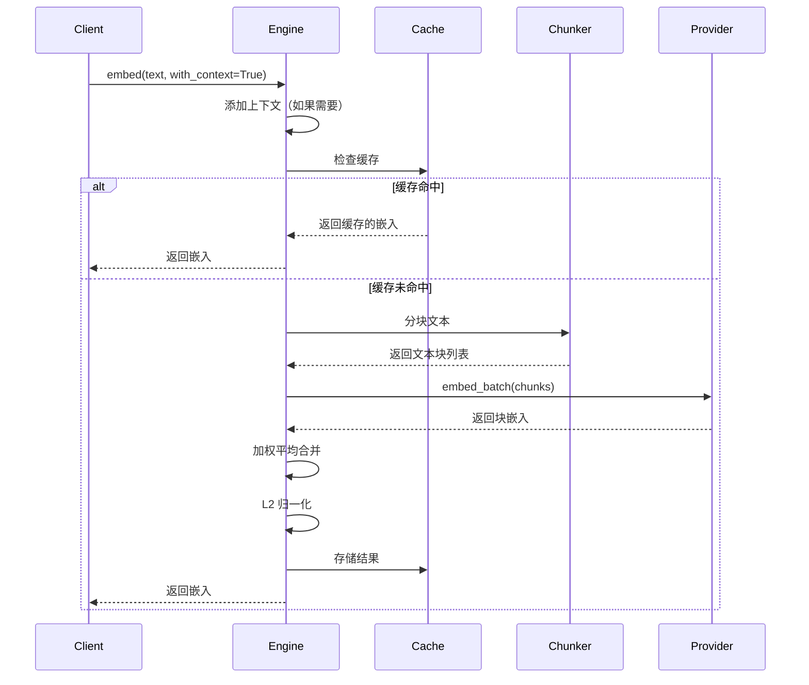
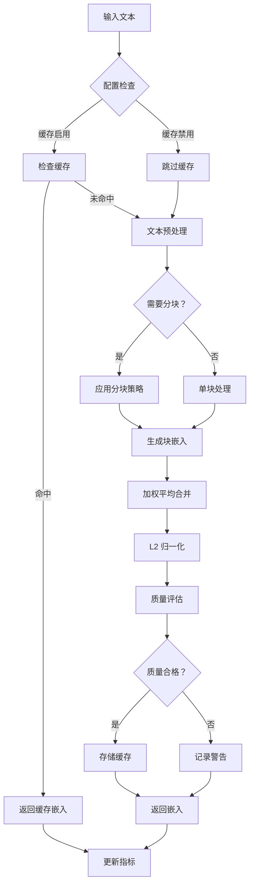
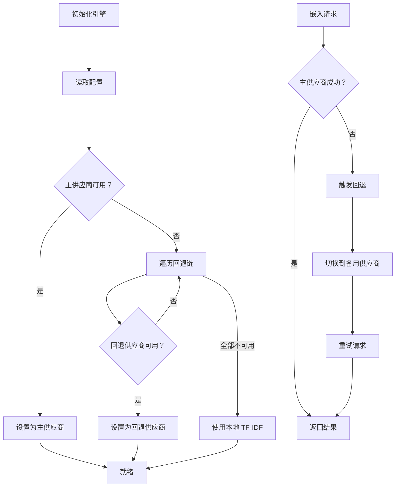

# Embedding Pipeline 模块文档

## 概述

`embedding_pipeline` 模块是 Loki Mode 记忆系统的核心组件之一，负责提供多供应商的文本嵌入（Embedding）生成和语义相似度搜索能力。该模块位于 `memory.embeddings` 包中，为整个记忆系统提供语义理解的基础设施支持。

在现代 AI 系统中，将文本转换为向量表示（嵌入）是实现语义搜索、内容去重、相似性匹配等高级功能的关键。本模块设计了一个灵活、可扩展的嵌入引擎，支持多种嵌入供应商，并具备自动故障转移、智能分块、质量评估等高级特性。

### 设计目标

该模块的设计遵循以下核心原则：

**多供应商支持**：系统支持本地模型（sentence-transformers）、OpenAI 和 Cohere 三种嵌入供应商。这种设计确保了系统在不同环境下的可用性——在开发环境中可以使用免费的本地模型，而在生产环境中可以切换到更高质量的商业 API。

**弹性与容错**：通过供应商回退链（fallback chain）机制，当主供应商不可用时，系统会自动切换到备用供应商，确保服务的连续性。本地供应商始终作为最后的保障，即使在完全离线的情况下也能提供基础功能。

**智能文本处理**：针对长文本场景，模块提供了多种分块策略（固定大小、句子边界、语义边界），并支持上下文增强，确保嵌入质量不受文本长度影响。

**性能优化**：内置缓存机制、批量处理支持和质量评分系统，在保证嵌入质量的同时最大化处理效率。

### 在系统中的位置

`embedding_pipeline` 模块是记忆系统的基础设施层，为以下上层组件提供支持：

- **[Vector Index](vector_index_backend.md)**：使用嵌入引擎生成的向量构建索引，支持语义搜索
- **[Semantic Memory](core_memory_engine.md)**：利用嵌入进行语义记忆的存储和检索
- **[Cross Project Index](cross_project_indexing.md)**：跨项目索引依赖嵌入进行内容关联
- **[Unified Memory Access](unified_memory_access.md)**：统一记忆访问层通过嵌入实现语义查询



## 核心组件架构

### 组件关系图



## 详细组件说明

### EmbeddingEngine（嵌入引擎）

`EmbeddingEngine` 是模块的主要入口点，负责协调所有嵌入相关的操作。它管理多个供应商实例、处理缓存、执行文本分块，并提供统一的 API 接口。

#### 初始化参数

```python
engine = EmbeddingEngine(
    config: Optional[EmbeddingConfig] = None,
    model_name: Optional[str] = None,      # 已弃用
    dimension: Optional[int] = None,        # 已弃用
)
```

**参数说明**：
- `config`：完整的配置对象，推荐使用此方式配置
- `model_name`：遗留参数，用于指定 sentence-transformers 模型名称
- `dimension`：遗留参数，用于指定嵌入维度

**初始化流程**：
1. 如果未提供配置，首先尝试从 `.loki/config/embeddings.json` 加载配置文件
2. 如果配置文件不存在，从环境变量加载配置
3. 根据配置初始化所有可用的供应商
4. 设置主供应商并建立回退链
5. 初始化缓存系统和指标收集器

#### 核心方法

##### embed() - 单文本嵌入

```python
def embed(
    text: str,
    with_context: bool = False,
    full_content: Optional[str] = None
) -> np.ndarray
```

生成单个文本的嵌入向量。

**参数**：
- `text`：要嵌入的输入文本
- `with_context`：是否添加周围上下文（默认 False）
- `full_content`：完整文档内容，用于上下文提取

**返回值**：归一化的嵌入向量，形状为 `(dimension,)`

**工作流程**：


**使用示例**：
```python
from memory.embeddings import EmbeddingEngine

# 使用默认配置
engine = EmbeddingEngine()
embedding = engine.embed("这是一段示例文本")

# 带上下文的嵌入（适用于代码片段）
code_snippet = "def hello(): pass"
full_file = """
import os

def hello():
    print('Hello, World!')

def main():
    hello()
"""
embedding = engine.embed(
    code_snippet,
    with_context=True,
    full_content=full_file
)
```

##### embed_batch() - 批量嵌入

```python
def embed_batch(
    texts: List[str],
    with_context: bool = False,
    full_contents: Optional[List[str]] = None
) -> np.ndarray
```

高效地为多个文本生成嵌入。相比逐个调用 `embed()`，批量处理可以显著提高吞吐量，特别是使用 sentence-transformers 时。

**参数**：
- `texts`：要嵌入的文本列表
- `with_context`：是否为所有文本添加上下文
- `full_contents`：与 texts 对应的完整文档内容列表

**返回值**：归一化的嵌入矩阵，形状为 `(len(texts), dimension)`

**性能优化**：
- 自动检测并复用缓存的嵌入
- 仅对未缓存的文本调用供应商 API
- 使用供应商原生批量接口（OpenAI 支持最多 2048 个，Cohere 支持最多 96 个）

```python
# 批量嵌入示例
texts = ["文本 1", "文本 2", "文本 3"]
embeddings = engine.embed_batch(texts)
print(embeddings.shape)  # (3, 384)
```

##### similarity() - 相似度计算

```python
def similarity(a: np.ndarray, b: np.ndarray) -> float
```

计算两个嵌入向量之间的余弦相似度。假设输入向量已经归一化。

**返回值**：相似度分数，范围 [-1, 1]，值越大表示越相似

```python
emb1 = engine.embed("机器学习")
emb2 = engine.embed("深度学习")
emb3 = engine.embed("烹饪食谱")

sim1 = engine.similarity(emb1, emb2)  # 高相似度（相关概念）
sim2 = engine.similarity(emb1, emb3)  # 低相似度（无关概念）
```

##### similarity_search() - 相似度搜索

```python
def similarity_search(
    query_embedding: np.ndarray,
    corpus_embeddings: np.ndarray,
    top_k: int = 5
) -> List[Tuple[int, float]]
```

在语料库中查找与查询向量最相似的 top-k 个嵌入。

**参数**：
- `query_embedding`：查询向量，形状 `(dimension,)`
- `corpus_embeddings`：语料库嵌入矩阵，形状 `(n, dimension)`
- `top_k`：返回结果数量

**返回值**：`(索引，相似度分数)` 元组列表，按相似度降序排列

```python
# 构建语料库
documents = ["文档 1", "文档 2", "文档 3", "文档 4", "文档 5"]
corpus_embeddings = engine.embed_batch(documents)

# 搜索
query = engine.embed("相关查询")
results = engine.similarity_search(query, corpus_embeddings, top_k=3)

for idx, score in results:
    print(f"文档 {idx}: 相似度 {score:.4f}")
    print(f"内容：{documents[idx]}")
```

##### deduplicate() - 语义去重

```python
def deduplicate(
    texts: List[str],
    threshold: Optional[float] = None
) -> List[int]
```

对文本列表进行语义去重，返回唯一文本的索引。

**参数**：
- `texts`：要处理的文本列表
- `threshold`：相似度阈值，超过此值视为重复（默认使用配置的 `dedup_threshold`）

**返回值**：唯一文本的索引列表

```python
texts = [
    "如何学习 Python",
    "Python 学习指南",  # 语义相似
    "如何做蛋糕",
    "Python 入门教程",  # 语义相似
    "烘焙技巧"
]

unique_indices = engine.deduplicate(texts, threshold=0.85)
unique_texts = [texts[i] for i in unique_indices]
# 结果可能只保留每个语义簇中的一个代表
```

##### 其他实用方法

| 方法 | 说明 |
|------|------|
| `embed_with_quality()` | 生成嵌入并返回质量评估指标 |
| `clear_cache()` | 清空嵌入缓存 |
| `get_dimension()` | 获取当前嵌入维度 |
| `is_using_fallback()` | 检查是否正在使用回退供应商 |
| `get_cache_size()` | 获取缓存中的嵌入数量 |
| `get_provider_name()` | 获取当前使用的供应商名称 |
| `get_metrics()` | 获取性能指标（请求数、缓存命中率、延迟等） |
| `get_config()` | 获取当前配置（不含敏感信息） |

### EmbeddingConfig（嵌入配置）

`EmbeddingConfig` 数据类封装了嵌入引擎的所有配置选项，支持从环境变量、JSON 文件或代码中加载。

#### 配置项详解

```python
@dataclass
class EmbeddingConfig:
    # 供应商设置
    provider: str = "local"                    # 主供应商：local/openai/cohere
    model: Optional[str] = None                # 供应商特定的模型名称
    fallback_providers: List[str] = ["local"]  # 回退供应商列表
    
    # 维度设置
    dimension: int = 384                       # 嵌入维度
    
    # API 密钥
    openai_api_key: Optional[str] = None
    cohere_api_key: Optional[str] = None
    
    # 分块设置
    chunking_strategy: str = "semantic"        # 分块策略
    max_chunk_size: int = 512                  # 每块最大 token 数
    chunk_overlap: int = 50                    # 块间重叠
    
    # 上下文设置
    include_context: bool = True               # 是否包含上下文
    context_lines: int = 3                     # 上下文行数
    
    # 质量设置
    min_quality_score: float = 0.5             # 最低可接受质量分数
    dedup_threshold: float = 0.95              # 去重相似度阈值
    
    # 性能设置
    batch_size: int = 32                       # 批处理大小
    cache_enabled: bool = True                 # 是否启用缓存
    timeout: float = 30.0                      # API 超时时间（秒）
```

#### 配置加载方式

**方式一：从环境变量加载**

```python
# 设置环境变量
export LOKI_EMBEDDING_PROVIDER=openai
export LOKI_EMBEDDING_MODEL=text-embedding-3-small
export OPENAI_API_KEY=sk-xxx
export LOKI_EMBEDDING_CHUNKING=semantic
export LOKI_EMBEDDING_CONTEXT=true

# 加载配置
config = EmbeddingConfig.from_env()
engine = EmbeddingEngine(config=config)
```

**方式二：从 JSON 文件加载**

```python
# embeddings.json
{
    "provider": "openai",
    "model": "text-embedding-3-large",
    "fallback_providers": ["local"],
    "chunking_strategy": "semantic",
    "max_chunk_size": 512,
    "chunk_overlap": 50,
    "include_context": true,
    "context_lines": 3,
    "cache_enabled": true,
    "timeout": 30.0
}

# 加载配置
config = EmbeddingConfig.from_file(".loki/config/embeddings.json")
engine = EmbeddingEngine(config=config)
```

**方式三：直接代码配置**

```python
config = EmbeddingConfig(
    provider="openai",
    model="text-embedding-3-small",
    openai_api_key="sk-xxx",
    chunking_strategy="sentence",
    max_chunk_size=256,
    cache_enabled=True,
)
engine = EmbeddingEngine(config=config)
```

#### 预定义模型

配置类内置了各供应商的推荐模型：

```python
# 本地模型
LOCAL_MODELS = {
    "default": "all-MiniLM-L6-v2",           # 快速，384 维
    "large": "all-mpnet-base-v2",            # 高质量，768 维
    "multilingual": "paraphrase-multilingual-MiniLM-L12-v2",  # 多语言
}

# OpenAI 模型
OPENAI_MODELS = {
    "default": "text-embedding-3-small",     # 性价比高，1536 维
    "large": "text-embedding-3-large",       # 最高质量，3072 维
    "legacy": "text-embedding-ada-002",      # 旧版，1536 维
}

# Cohere 模型
COHERE_MODELS = {
    "default": "embed-english-v3.0",         # 英文，1024 维
    "light": "embed-english-light-v3.0",     # 轻量版，384 维
    "multilingual": "embed-multilingual-v3.0",  # 多语言，1024 维
}
```

### TextChunker（文本分块器）

`TextChunker` 提供多种文本分块策略，用于处理超出模型 token 限制的长文本。

#### 分块策略枚举

```python
class ChunkingStrategy(Enum):
    NONE = "none"      # 不分块，必要时截断
    FIXED = "fixed"    # 固定大小分块，带重叠
    SENTENCE = "sentence"  # 按句子边界分块
    SEMANTIC = "semantic"  # 按语义边界分块（段落、代码块）
```

#### 分块方法

##### chunk_fixed() - 固定大小分块

```python
@staticmethod
def chunk_fixed(
    text: str,
    max_size: int = 512,
    overlap: int = 50
) -> List[str]
```

将文本分割为固定大小的块，块之间有重叠以保持上下文连续性。

**适用场景**：结构化程度低的长文本，如日志文件、连续叙述

```python
chunks = TextChunker.chunk_fixed(long_text, max_size=512, overlap=50)
# 结果：["块 1（0-512）", "块 2（462-974）", "块 3（924-1436）", ...]
```

##### chunk_sentence() - 句子边界分块

```python
@staticmethod
def chunk_sentence(text: str, max_size: int = 512) -> List[str]
```

在句子边界处分割文本，确保每个块包含完整的句子。

**适用场景**：自然语言文档、文章、报告

```python
text = "这是第一句。这是第二句！这是第三句？这是第四句。"
chunks = TextChunker.chunk_sentence(text, max_size=100)
# 结果：["这是第一句。这是第二句！", "这是第三句？这是第四句。"]
```

##### chunk_semantic() - 语义边界分块

```python
@staticmethod
def chunk_semantic(text: str, max_size: int = 512) -> List[str]
```

在语义边界（段落、代码块）处分割文本，是最智能的分块策略。

**适用场景**：代码文件、技术文档、结构化内容

```python
code = """
def function_a():
    # 实现 A
    pass

def function_b():
    # 实现 B
    pass
"""
chunks = TextChunker.chunk_semantic(code, max_size=256)
# 结果：每个函数定义作为一个独立的块
```

##### add_context() - 上下文增强

```python
@staticmethod
def add_context(
    text: str,
    full_content: str,
    context_lines: int = 3
) -> str
```

为文本块添加周围的上下文行，提高嵌入的语义完整性。

**适用场景**：代码片段嵌入、引用文本嵌入

```python
snippet = "return result"
full_code = """
def calculate():
    x = 10
    y = 20
    result = x + y
    return result

def main():
    calculate()
"""
enhanced = TextChunker.add_context(snippet, full_code, context_lines=3)
# 结果：
# x = 10
# y = 20
# result = x + y
# return result
# def main():
```

### 供应商实现

模块实现了三个嵌入供应商，均继承自 `BaseEmbeddingProvider` 抽象基类。

#### BaseEmbeddingProvider（抽象基类）

定义了所有供应商必须实现的接口：

```python
class BaseEmbeddingProvider(ABC):
    @abstractmethod
    def embed(self, text: str) -> np.ndarray:
        """为单个文本生成嵌入"""
        pass
    
    @abstractmethod
    def embed_batch(self, texts: List[str]) -> np.ndarray:
        """为多个文本生成嵌入"""
        pass
    
    @abstractmethod
    def get_dimension(self) -> int:
        """返回嵌入维度"""
        pass
    
    @abstractmethod
    def get_name(self) -> str:
        """返回供应商名称"""
        pass
    
    @abstractmethod
    def is_available(self) -> bool:
        """检查供应商是否可用"""
        pass
```

#### LocalEmbeddingProvider（本地供应商）

使用 sentence-transformers 库在本地运行嵌入模型。

**特点**：
- 无需 API 密钥，完全离线可用
- 首次加载模型需要下载（约 90MB）
- 提供 TF-IDF 回退模式（当 sentence-transformers 不可用时）
- 适合开发和测试环境

**依赖安装**：
```bash
pip install sentence-transformers
```

**模型加载**：
```python
provider = LocalEmbeddingProvider(
    model_name="all-MiniLM-L6-v2",  # 默认模型
    dimension=384
)
```

**TF-IDF 回退**：
当 sentence-transformers 未安装时，自动切换到基于特征哈希的 TF-IDF 实现。虽然质量较低，但保证了基本功能的可用性。

#### OpenAIEmbeddingProvider（OpenAI 供应商）

使用 OpenAI 的 text-embedding-3 系列模型。

**特点**：
- 高质量嵌入，适合生产环境
- 需要有效的 OpenAI API 密钥
- 支持大批量处理（最多 2048 个输入）
- 按 token 计费

**依赖安装**：
```bash
pip install openai
```

**配置**：
```python
provider = OpenAIEmbeddingProvider(
    api_key="sk-xxx",
    model="text-embedding-3-small",  # 或 text-embedding-3-large
    dimension=1536,
    timeout=30.0
)
```

**可用性检查**：
```python
if provider.is_available():
    # API 密钥有效且 openai 包已安装
    embedding = provider.embed("text")
else:
    # 切换到备用供应商
    pass
```

#### CohereEmbeddingProvider（Cohere 供应商）

使用 Cohere 的 embed-v3 系列模型。

**特点**：
- 优秀的多语言支持
- 需要有效的 Cohere API 密钥
- 批量限制为 96 个输入
- 提供不同的输入类型优化（search_document、search_query 等）

**依赖安装**：
```bash
pip install cohere
```

**配置**：
```python
provider = CohereEmbeddingProvider(
    api_key="xxx",
    model="embed-english-v3.0",
    dimension=1024,
    timeout=30.0
)
```

### EmbeddingQuality（质量评分）

`EmbeddingQuality` 数据类提供嵌入质量的多维度评估。

```python
@dataclass
class EmbeddingQuality:
    score: float      # 整体质量分数 (0-1)
    coverage: float   # 文本覆盖度 (0-1)
    density: float    # 非零元素比例 (0-1)
    variance: float   # 嵌入方差（越高表示信息越丰富）
    provider: str     # 生成嵌入的供应商
```

**质量指标说明**：

| 指标 | 含义 | 理想值 |
|------|------|--------|
| score | 综合质量评分 | > 0.7 |
| coverage | 文本被完整嵌入的比例 | 接近 1.0 |
| density | 向量中非零元素的比例 | > 0.3 |
| variance | 向量元素的方差 | 适中（过高或过低都不好） |

**使用示例**：
```python
embedding, quality = engine.embed_with_quality("示例文本")
print(f"质量分数：{quality.score:.2f}")
print(f"覆盖度：{quality.coverage:.2f}")
print(f"密度：{quality.density:.2f}")

if quality.score < engine.config.min_quality_score:
    logger.warning("嵌入质量低于阈值")
```

## 数据流与处理流程

### 完整嵌入流程



### 供应商选择与回退流程



## 使用指南

### 快速开始

```python
from memory.embeddings import EmbeddingEngine, EmbeddingConfig

# 方式 1：使用默认配置（本地模型）
engine = EmbeddingEngine()
embedding = engine.embed("Hello, World!")

# 方式 2：使用 OpenAI
config = EmbeddingConfig(
    provider="openai",
    model="text-embedding-3-small",
    openai_api_key="sk-xxx"
)
engine = EmbeddingEngine(config=config)

# 方式 3：从环境变量加载
# 设置：export LOKI_EMBEDDING_PROVIDER=openai
#      export OPENAI_API_KEY=sk-xxx
engine = EmbeddingEngine()
```

### 高级用法

#### 语义搜索示例

```python
from memory.embeddings import EmbeddingEngine
import numpy as np

engine = EmbeddingEngine()

# 文档库
documents = [
    "Python 是一种高级编程语言",
    "机器学习是人工智能的分支",
    "深度学习使用神经网络",
    "Web 开发涉及 HTML 和 CSS",
    "数据科学需要统计学知识"
]

# 预计算文档嵌入
doc_embeddings = engine.embed_batch(documents)

# 查询
query = "人工智能相关技术"
query_embedding = engine.embed(query)

# 搜索
results = engine.similarity_search(query_embedding, doc_embeddings, top_k=3)

print(f"查询：{query}\n")
for idx, score in results:
    print(f"[{score:.4f}] {documents[idx]}")
```

#### 代码语义索引

```python
from memory.embeddings import EmbeddingEngine, EmbeddingConfig

# 配置：使用语义分块和上下文增强
config = EmbeddingConfig(
    provider="local",
    chunking_strategy="semantic",
    max_chunk_size=256,
    include_context=True,
    context_lines=3
)
engine = EmbeddingEngine(config=config)

# 索引代码文件
def index_code_file(filepath: str) -> list:
    with open(filepath, 'r') as f:
        content = f.read()
    
    # 语义分块
    chunks = TextChunker.chunk_semantic(content, max_size=256)
    
    # 为每个块添加上下文并嵌入
    embeddings = []
    for chunk in chunks:
        enhanced = TextChunker.add_context(chunk, content, context_lines=3)
        emb = engine.embed(enhanced)
        embeddings.append({
            'chunk': chunk,
            'embedding': emb,
            'file': filepath
        })
    
    return embeddings
```

#### 批量去重处理

```python
from memory.embeddings import EmbeddingEngine

engine = EmbeddingEngine()

# 大量文本去重
texts = load_large_text_corpus()  # 假设返回 10000+ 文本

# 分批处理（避免内存溢出）
batch_size = 1000
unique_indices = []

for i in range(0, len(texts), batch_size):
    batch = texts[i:i + batch_size]
    batch_unique = engine.deduplicate(batch, threshold=0.9)
    unique_indices.extend([i + idx for idx in batch_unique])

unique_texts = [texts[i] for i in unique_indices]
print(f"原始：{len(texts)}, 去重后：{len(unique_texts)}")
```

### 配置管理

#### 创建配置文件

```python
from memory.embeddings import create_config_file, EmbeddingConfig

config = EmbeddingConfig(
    provider="openai",
    model="text-embedding-3-large",
    fallback_providers=["local"],
    chunking_strategy="semantic",
    max_chunk_size=512,
    cache_enabled=True,
    timeout=60.0
)

create_config_file(".loki/config/embeddings.json", config)
```

#### 运行时配置切换

```python
# 动态切换供应商
if engine.is_using_fallback():
    print("当前使用回退供应商")
    # 可以尝试重新初始化主供应商
    engine._init_providers()
```

## 性能与监控

### 性能指标

通过 `get_metrics()` 方法可以获取详细的性能统计：

```python
metrics = engine.get_metrics()
print(f"""
总请求数：{metrics['total_requests']}
缓存命中数：{metrics['cache_hits']}
缓存命中率：{metrics['cache_hits'] / metrics['total_requests']:.2%}
回退次数：{metrics['fallback_count']}
平均延迟：{metrics['avg_latency_ms']:.2f}ms
当前供应商：{metrics['current_provider']}
缓存大小：{metrics['cache_size']}
""")
```

### 缓存管理

```python
# 查看缓存状态
print(f"缓存条目数：{engine.get_cache_size()}")

# 清空缓存（释放内存）
engine.clear_cache()

# 禁用缓存（适用于一次性大批量处理）
config = EmbeddingConfig(cache_enabled=False)
engine = EmbeddingEngine(config=config)
```

### 优化建议

| 场景 | 建议配置 |
|------|----------|
| 开发/测试 | 使用 local 供应商，启用缓存 |
| 生产环境 | 使用 openai/cohere，配置回退链 |
| 大批量处理 | 禁用缓存，使用 embed_batch() |
| 代码索引 | 使用 semantic 分块，启用上下文 |
| 多语言支持 | 使用 multilingual 模型 |
| 低延迟要求 | 使用 light 模型，减小 chunk_size |

## 边缘情况与注意事项

### 依赖缺失处理

模块对缺失依赖有优雅的处理：

```python
# sentence-transformers 缺失
# 自动切换到 TF-IDF 回退，记录警告日志
# 功能可用但质量下降

# openai/cohere 包缺失
# is_available() 返回 False
# 自动切换到可用供应商

# numpy 缺失
# 直接抛出 ImportError，明确提示安装命令
```

### 文本长度限制

不同供应商有不同的 token 限制：

| 供应商 | 最大输入 tokens | 处理策略 |
|--------|-----------------|----------|
| Local (MiniLM) | 512 | 自动分块 |
| OpenAI | 8191 | 自动分块 |
| Cohere | 512 | 自动分块 |

**注意**：分块会损失部分全局语义，对于需要完整上下文的任务，建议使用较小的 `max_chunk_size` 并增加 `chunk_overlap`。

### 维度不一致问题

不同模型的嵌入维度不同：

```python
# 错误示例：混用不同维度的嵌入
emb_local = local_engine.embed("text")    # 384 维
emb_openai = openai_engine.embed("text")  # 1536 维
similarity = engine.similarity(emb_local, emb_openai)  # 会报错！

# 正确做法：使用同一引擎/配置生成的嵌入进行比较
```

### API 密钥安全

```python
# 不要硬编码 API 密钥
config = EmbeddingConfig(openai_api_key="sk-xxx")  # 不推荐

# 推荐：从环境变量加载
config = EmbeddingConfig.from_env()

# 或：从安全的配置管理系统加载
config = EmbeddingConfig(
    openai_api_key=os.environ.get("OPENAI_API_KEY")
)
```

### 并发与线程安全

`EmbeddingEngine` 实例不是线程安全的。在多线程环境中使用时：

```python
# 方案 1：每个线程创建独立实例
def worker_thread(texts):
    engine = EmbeddingEngine()  # 每个线程独立实例
    return engine.embed_batch(texts)

# 方案 2：使用锁保护共享实例
from threading import Lock
lock = Lock()
with lock:
    embedding = engine.embed(text)
```

### 内存管理

嵌入缓存可能占用大量内存：

```python
# 监控缓存大小
if engine.get_cache_size() > 5000:
    engine.clear_cache()

# 或限制缓存大小（在配置中）
config = EmbeddingConfig(cache_enabled=True)
# 内部 _max_cache_size = 10000
```

## 与其他模块的集成

### 与 Vector Index 集成

```python
from memory.embeddings import EmbeddingEngine
from memory.vector_index import VectorIndex

# 创建引擎和索引
engine = EmbeddingEngine()
index = VectorIndex(dimension=engine.get_dimension())

# 添加文档
documents = ["doc1", "doc2", "doc3"]
embeddings = engine.embed_batch(documents)
index.add(embeddings, metadata=[{"text": d} for d in documents])

# 搜索
query_emb = engine.embed("query")
results = index.search(query_emb, top_k=5)
```

### 与 Semantic Memory 集成

```python
from memory.engine import SemanticMemory
from memory.embeddings import EmbeddingConfig

# 语义记忆内部使用嵌入引擎
config = EmbeddingConfig(provider="openai")
memory = SemanticMemory(embedding_config=config)

# 存储和检索自动使用嵌入
memory.store("key", "value")
retrieved = memory.retrieve("related query")
```

### 与 Cross Project Index 集成

```python
from memory.cross_project import CrossProjectIndex
from memory.embeddings import EmbeddingEngine

engine = EmbeddingEngine()
index = CrossProjectIndex(embedding_engine=engine)

# 跨项目语义搜索
results = index.search_across_projects("bug fix pattern")
```

## 故障排查

### 常见问题

**问题 1：嵌入质量低**
- 检查是否意外使用了 TF-IDF 回退模式
- 确认 sentence-transformers 已正确安装
- 尝试切换到 OpenAI 或 Cohere 供应商

**问题 2：API 调用失败**
- 验证 API 密钥是否有效
- 检查网络连接
- 确认未超过速率限制
- 查看 `get_metrics()` 中的回退计数

**问题 3：内存占用高**
- 减少缓存大小或禁用缓存
- 使用较小的模型（如 text-embedding-3-small）
- 分批处理大批量文本

**问题 4：维度不匹配错误**
- 确保比较的嵌入来自同一配置的引擎
- 检查配置中的 dimension 设置
- 避免混用不同供应商的嵌入

### 调试技巧

```python
# 启用详细日志
import logging
logging.getLogger("memory.embeddings").setLevel(logging.DEBUG)

# 检查供应商状态
engine = EmbeddingEngine()
print(f"主供应商：{engine.get_provider_name()}")
print(f"使用回退：{engine.is_using_fallback()}")
print(f"嵌入维度：{engine.get_dimension()}")
print(f"配置：{engine.get_config()}")

# 测试嵌入生成
test_text = "测试文本"
embedding = engine.embed(test_text)
print(f"嵌入形状：{embedding.shape}")
print(f"嵌入范数：{np.linalg.norm(embedding):.6f}")  # 应接近 1.0
```

## 总结

`embedding_pipeline` 模块为 Loki Mode 记忆系统提供了强大而灵活的嵌入基础设施。通过多供应商支持、智能分块、质量评估和缓存优化，该模块能够在各种场景下提供高质量的语义表示。

**核心优势**：
- 多供应商支持确保高可用性
- 智能分块处理长文本
- 内置质量评估和去重功能
- 灵活的配置和扩展能力

**适用场景**：
- 语义搜索和检索
- 文档去重和聚类
- 代码语义索引
- 跨项目内容关联

通过合理配置和使用本模块，可以为上层记忆系统提供可靠的语义理解能力支撑。
