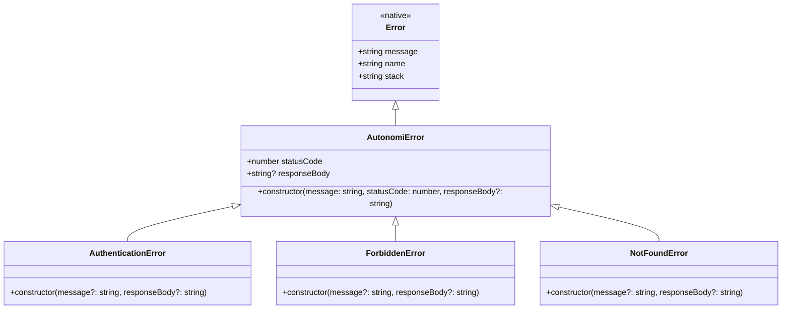
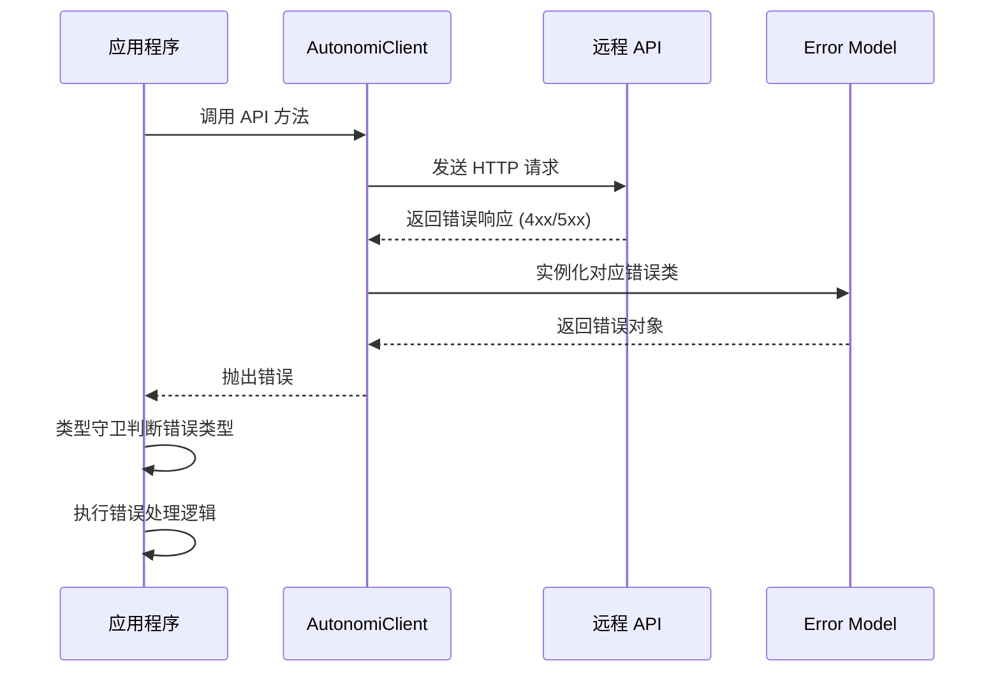

# Error Model 模块文档

## 1. 概述

### 1.1 模块目的

`error_model` 模块是 Autonomi TypeScript SDK 中的错误处理核心组件，提供了一套类型化的错误层次结构，用于统一处理 SDK 与 API 交互过程中可能出现的各种错误情况。该模块的设计目标是为开发者提供清晰、可预测的错误处理机制，使得应用程序能够优雅地处理 API 调用失败、认证问题、权限不足以及资源不存在等常见场景。

在现代分布式系统中，错误处理是构建健壮应用程序的关键环节。本模块通过继承 JavaScript 原生 `Error` 类，扩展了 HTTP 状态码和响应体等关键信息，使得开发者能够在捕获错误时获取完整的上下文信息，从而做出恰当的业务决策。

### 1.2 设计 rationale

本模块采用经典的继承层次结构设计，主要基于以下考虑：

**类型安全**：通过 TypeScript 的类型系统，每个错误类都有明确的类型标识，开发者可以在 `catch` 块中使用类型守卫精确识别错误类型，避免使用脆弱的字符串匹配或状态码硬编码。

**信息完整性**：基类 `AutonomiError` 保留了原始 HTTP 响应的状态码和响应体，这对于调试、日志记录和用户友好的错误提示至关重要。开发者可以访问完整的错误上下文，而不仅仅是简单的错误消息。

**扩展性**：层次化设计允许未来轻松添加新的错误类型（如 `RateLimitError`、`ServerError` 等），而不会破坏现有代码。所有新错误类只需继承 `AutonomiError` 即可保持一致的接口。

**与 HTTP 语义对齐**：预定义的三个子类分别对应最常见的 HTTP 错误状态码（401、403、404），这些是 RESTful API 交互中最常遇到的客户端错误，覆盖了认证、授权和资源存在性检查三大核心场景。

### 1.3 解决的问题

在 SDK 开发中，错误处理常常面临以下挑战：

1. **信息丢失**：原生 `Error` 对象不包含 HTTP 状态码，开发者需要额外传递这些信息
2. **类型模糊**：使用字符串或状态码判断错误类型容易出错且难以维护
3. **响应体不可达**：API 返回的详细错误信息（如验证失败字段）难以访问
4. **不一致的处理模式**：不同模块可能采用不同的错误表示方式

本模块通过统一的错误类层次结构解决了上述所有问题，为整个 SDK 提供了标准化的错误处理范式。

## 2. 架构设计

### 2.1 错误层次结构



上图展示了错误类的继承关系。`AutonomiError` 作为所有 SDK 错误的基类，扩展了 JavaScript 原生的 `Error` 对象，添加了 `statusCode` 和 `responseBody` 两个关键属性。三个子类分别针对特定的 HTTP 错误场景进行了专门化，预设了对应的状态码和默认错误消息。

### 2.2 错误流转图



当 API 调用失败时，SDK 会根据 HTTP 响应状态码创建相应的错误实例并抛出。应用程序捕获错误后，可以使用 TypeScript 的类型守卫（如 `instanceof`）精确识别错误类型，并执行针对性的处理逻辑。

### 2.3 状态码映射关系

| 错误类 | HTTP 状态码 | 触发场景 |
|--------|------------|----------|
| `AuthenticationError` | 401 | 未提供认证凭据、Token 过期、Token 无效 |
| `ForbiddenError` | 403 | 认证成功但权限不足、资源访问被拒绝 |
| `NotFoundError` | 404 | 请求的资源不存在、端点不存在 |
| `AutonomiError` | 其他 | 所有其他 HTTP 错误（400、429、500 等） |

## 3. 核心组件详解

### 3.1 AutonomiError（基类）

`AutonomiError` 是所有 SDK 错误的根类，继承自 JavaScript 原生的 `Error` 类，提供了错误处理所需的基础设施。

#### 3.1.1 属性说明

**`statusCode: number`**

HTTP 响应状态码，表示请求的处理结果。这是区分错误类型的关键标识，也是错误分类和处理的依据。常见值包括：
- 400 系列：客户端错误（认证、授权、资源不存在等）
- 500 系列：服务器错误（内部错误、服务不可用等）

**`responseBody?: string`**

可选属性，包含 API 返回的原始响应体。当 API 返回详细的错误信息（如 JSON 格式的错误详情、验证失败字段列表）时，可以通过解析此字段获取更丰富的上下文。响应体可能为 `undefined`，特别是在网络层错误或服务完全不可用时。

#### 3.1.2 构造函数

```typescript
constructor(message: string, statusCode: number, responseBody?: string)
```

**参数说明：**

| 参数 | 类型 | 必填 | 说明 |
|------|------|------|------|
| `message` | `string` | 是 | 人类可读的错误描述，通常来自 API 响应或 SDK 内部生成 |
| `statusCode` | `number` | 是 | HTTP 状态码，用于标识错误类型 |
| `responseBody` | `string` | 否 | 原始响应体，包含 API 返回的详细错误信息 |

**使用示例：**

```typescript
// 直接实例化基类（通常用于未知错误类型）
const error = new AutonomiError('Unknown error occurred', 500, '{"code":"INTERNAL_ERROR"}');
console.log(error.statusCode);      // 500
console.log(error.responseBody);    // '{"code":"INTERNAL_ERROR"}'
console.log(error.name);            // 'AutonomiError'
```

#### 3.1.3 内部工作机制

当 `AutonomiError` 被实例化时，执行以下操作：

1. 调用父类 `Error` 的构造函数，设置错误消息
2. 将 `name` 属性设置为 `'AutonomiError'`，便于调试和日志识别
3. 存储 `statusCode` 和 `responseBody` 到实例属性
4. 捕获调用栈信息（由 JavaScript 引擎自动完成）

这种设计确保了错误对象既保留了原生 `Error` 的所有特性（如堆栈跟踪），又扩展了 HTTP 特定的上下文信息。

### 3.2 AuthenticationError

`AuthenticationError` 专门用于表示认证失败的场景，当客户端未能提供有效的认证凭据时抛出。

#### 3.2.1 触发场景

- 请求未包含 `Authorization` 头
- 提供的 API Key 无效或已过期
- JWT Token 签名验证失败
- Token 已过期且未刷新
- 认证服务不可用

#### 3.2.2 构造函数

```typescript
constructor(message?: string, responseBody?: string)
```

**参数说明：**

| 参数 | 类型 | 必填 | 默认值 | 说明 |
|------|------|------|--------|------|
| `message` | `string` | 否 | `'Authentication required'` | 错误描述消息 |
| `responseBody` | `string` | 否 | `undefined` | API 返回的响应体 |

**特点：**

- 状态码固定为 `401`，无需在构造时指定
- 提供有意义的默认消息，减少样板代码
- 继承 `AutonomiError` 的所有属性和方法

**使用示例：**

```typescript
// SDK 内部使用
if (response.status === 401) {
  throw new AuthenticationError('Token has expired', response.body);
}

// 应用程序捕获处理
try {
  await client.tasks.list();
} catch (error) {
  if (error instanceof AuthenticationError) {
    console.log('需要重新认证');
    await refreshToken();
    // 重试请求
  }
}
```

### 3.3 ForbiddenError

`ForbiddenError` 表示认证成功但授权失败的场景，即用户已认证但无权执行请求的操作或访问请求的资源。

#### 3.3.1 触发场景

- 用户角色无权访问特定资源
- API Key 权限范围不足（Scope 限制）
- 租户隔离策略阻止跨租户访问
- 资源被策略引擎拒绝（如成本限制、审批门控）
- IP 白名单限制

#### 3.3.2 构造函数

```typescript
constructor(message?: string, responseBody?: string)
```

**参数说明：**

| 参数 | 类型 | 必填 | 默认值 | 说明 |
|------|------|------|--------|------|
| `message` | `string` | 否 | `'Access forbidden'` | 错误描述消息 |
| `responseBody` | `string` | 否 | `undefined` | API 返回的响应体 |

**特点：**

- 状态码固定为 `403`
- 通常与 [Policy Engine](policy_engine.md) 模块的审批门控和成本控制器相关
- 响应体可能包含详细的权限拒绝原因

**使用示例：**

```typescript
try {
  await client.projects.delete(projectId);
} catch (error) {
  if (error instanceof ForbiddenError) {
    // 解析响应体获取详细原因
    const details = JSON.parse(error.responseBody || '{}');
    console.log(`权限不足：${details.reason}`);
    // 提示用户联系管理员
  }
}
```

### 3.4 NotFoundError

`NotFoundError` 表示请求的资源不存在，通常用于处理无效的资源标识符或已删除的资源。

#### 3.4.1 触发场景

- 请求的 Task、Run、Project 等资源 ID 不存在
- 资源已被删除
- API 端点不存在（404）
- 租户上下文中资源不可见

#### 3.4.2 构造函数

```typescript
constructor(message?: string, responseBody?: string)
```

**参数说明：**

| 参数 | 类型 | 必填 | 默认值 | 说明 |
|------|------|------|--------|------|
| `message` | `string` | 否 | `'Resource not found'` | 错误描述消息 |
| `responseBody` | `string` | 否 | `undefined` | API 返回的响应体 |

**特点：**

- 状态码固定为 `404`
- 常用于优雅处理资源不存在的情况（如创建不存在的资源或提示用户）
- 可区分"资源从未存在"和"资源已被删除"（通过响应体）

**使用示例：**

```typescript
async function getTaskOrCreate(taskId: string) {
  try {
    return await client.tasks.get(taskId);
  } catch (error) {
    if (error instanceof NotFoundError) {
      console.log(`Task ${taskId} 不存在，正在创建...`);
      return await client.tasks.create({ id: taskId, ... });
    }
    throw error; // 其他错误继续抛出
  }
}
```

## 4. 使用指南

### 4.1 基本错误处理模式

#### 4.1.1 Try-Catch 模式

最基础的错误处理方式是使用 `try-catch` 块捕获异常：

```typescript
import { AutonomiClient } from '@autonomi/sdk';
import { AuthenticationError, ForbiddenError, NotFoundError } from '@autonomi/sdk/errors';

const client = new AutonomiClient({ apiKey: 'your-api-key' });

async function fetchTask(taskId: string) {
  try {
    const task = await client.tasks.get(taskId);
    return task;
  } catch (error) {
    if (error instanceof AuthenticationError) {
      console.error('认证失败，请检查 API Key');
      throw error;
    }
    
    if (error instanceof ForbiddenError) {
      console.error('无权访问此任务');
      throw error;
    }
    
    if (error instanceof NotFoundError) {
      console.error(`任务 ${taskId} 不存在`);
      return null; // 优雅降级
    }
    
    if (error instanceof AutonomiError) {
      console.error(`API 错误：${error.statusCode} - ${error.message}`);
      throw error;
    }
    
    // 非 SDK 错误（如网络错误）
    console.error('未知错误:', error);
    throw error;
  }
}
```

#### 4.1.2 类型守卫模式

TypeScript 的类型守卫允许在 `catch` 块中精确识别错误类型：

```typescript
function isAutonomiError(error: unknown): error is AutonomiError {
  return error instanceof AutonomiError;
}

async function safeApiCall<T>(fn: () => Promise<T>): Promise<T | null> {
  try {
    return await fn();
  } catch (error) {
    if (isAutonomiError(error)) {
      // 根据状态码分类处理
      switch (error.statusCode) {
        case 401:
          // 处理认证错误
          break;
        case 403:
          // 处理授权错误
          break;
        case 404:
          // 处理资源不存在
          return null;
        default:
          // 其他错误
          console.error(`错误 ${error.statusCode}: ${error.message}`);
      }
    }
    throw error;
  }
}
```

### 4.2 错误信息解析

API 返回的响应体通常包含结构化的错误信息，可以解析后用于更精确的错误处理：

```typescript
interface ApiErrorDetail {
  code: string;
  message: string;
  fields?: Record<string, string[]>;
}

async function handleValidationError(error: AutonomiError) {
  if (error.responseBody) {
    try {
      const details: ApiErrorDetail = JSON.parse(error.responseBody);
      console.log(`错误代码：${details.code}`);
      console.log(`错误消息：${details.message}`);
      
      if (details.fields) {
        // 表单验证失败时，显示每个字段的错误
        Object.entries(details.fields).forEach(([field, errors]) => {
          console.log(`${field}: ${errors.join(', ')}`);
        });
      }
    } catch (parseError) {
      // 响应体不是有效 JSON，使用原始消息
      console.log(error.message);
    }
  }
}
```

### 4.3 重试策略集成

结合错误类型实现智能重试逻辑：

```typescript
async function retryWithBackoff<T>(
  fn: () => Promise<T>,
  maxRetries: number = 3
): Promise<T> {
  let lastError: Error | undefined;
  
  for (let attempt = 1; attempt <= maxRetries; attempt++) {
    try {
      return await fn();
    } catch (error) {
      lastError = error as Error;
      
      // 认证错误不应重试，需要重新认证
      if (error instanceof AuthenticationError) {
        throw error;
      }
      
      // 404 错误重试无意义
      if (error instanceof NotFoundError) {
        throw error;
      }
      
      // 403 错误通常不应重试（权限问题不会自动解决）
      if (error instanceof ForbiddenError) {
        throw error;
      }
      
      // 服务器错误（5xx）可以重试
      if (error instanceof AutonomiError && error.statusCode >= 500) {
        const delay = Math.pow(2, attempt) * 1000; // 指数退避
        console.log(`尝试 ${attempt}/${maxRetries} 失败，${delay}ms 后重试`);
        await new Promise(resolve => setTimeout(resolve, delay));
        continue;
      }
      
      // 其他错误不重试
      throw error;
    }
  }
  
  throw lastError;
}
```

### 4.4 与 SDK 其他模块的集成

`error_model` 模块与 SDK 的其他模块紧密协作：

#### 4.4.1 与 Client Orchestration 集成

[TypeScript SDK - Client Orchestration](typescript_sdk.md) 模块中的 `AutonomiClient` 在发起 HTTP 请求时，会根据响应状态码创建相应的错误实例：

```typescript
// AutonomiClient 内部逻辑示意
async request<T>(endpoint: string, options: RequestInit): Promise<T> {
  const response = await fetch(`${this.baseUrl}${endpoint}`, {
    ...options,
    headers: { ...this.headers, ...options.headers }
  });
  
  if (!response.ok) {
    const body = await response.text();
    
    switch (response.status) {
      case 401:
        throw new AuthenticationError(body);
      case 403:
        throw new ForbiddenError(body);
      case 404:
        throw new NotFoundError(body);
      default:
        throw new AutonomiError(`HTTP ${response.status}`, response.status, body);
    }
  }
  
  return response.json();
}
```

#### 4.4.2 与 Type Contracts 集成

[TypeScript SDK - Type Contracts](typescript_sdk.md) 中定义的类型与错误模型配合使用，确保类型安全：

```typescript
// 类型定义中包含错误场景
interface TaskResponse {
  task: Task;
  error?: AutonomiError;  // 可选错误字段
}

// 使用联合类型表示成功或失败
type TaskResult = 
  | { success: true; data: Task }
  | { success: false; error: AutonomiError };
```

## 5. 高级用法

### 5.1 自定义错误子类

虽然 SDK 提供了三个常用错误子类，但应用程序可以根据业务需求创建自定义子类：

```typescript
import { AutonomiError } from '@autonomi/sdk/errors';

// 速率限制错误
export class RateLimitError extends AutonomiError {
  public retryAfter?: number;
  
  constructor(message: string, retryAfter?: number, responseBody?: string) {
    super(message, 429, responseBody);
    this.name = 'RateLimitError';
    this.retryAfter = retryAfter;
  }
}

// 服务器错误
export class ServerError extends AutonomiError {
  constructor(message: string, responseBody?: string) {
    super(message, 500, responseBody);
    this.name = 'ServerError';
  }
}

// 使用示例
try {
  await client.tasks.list();
} catch (error) {
  if (error instanceof RateLimitError) {
    const waitTime = error.retryAfter || 60;
    console.log(`速率限制，请等待 ${waitTime} 秒`);
    await new Promise(r => setTimeout(r, waitTime * 1000));
    // 重试
  }
}
```

### 5.2 错误日志记录

在生产环境中，完整的错误日志对于问题诊断至关重要：

```typescript
import { AutonomiError } from '@autonomi/sdk/errors';

function logError(error: unknown, context: Record<string, unknown>) {
  if (error instanceof AutonomiError) {
    console.error({
      timestamp: new Date().toISOString(),
      errorType: error.name,
      message: error.message,
      statusCode: error.statusCode,
      responseBody: error.responseBody,
      stack: error.stack,
      context
    });
    
    // 发送到错误追踪服务（如 Sentry）
    // Sentry.captureException(error, { extra: context });
  } else {
    console.error({
      timestamp: new Date().toISOString(),
      errorType: 'UnknownError',
      error,
      context
    });
  }
}
```

### 5.3 用户友好的错误消息

将技术错误转换为用户友好的提示：

```typescript
function getUserFriendlyMessage(error: AutonomiError): string {
  if (error instanceof AuthenticationError) {
    return '您的登录已过期，请重新登录。';
  }
  
  if (error instanceof ForbiddenError) {
    return '您没有权限执行此操作，请联系管理员。';
  }
  
  if (error instanceof NotFoundError) {
    return '请求的资源不存在。';
  }
  
  if (error.statusCode >= 500) {
    return '服务器暂时不可用，请稍后重试。';
  }
  
  if (error.statusCode >= 400) {
    return `请求失败：${error.message}`;
  }
  
  return '发生未知错误，请稍后重试。';
}
```

## 6. 边缘情况与注意事项

### 6.1 响应体解析失败

`responseBody` 可能不是有效的 JSON，解析前应进行错误处理：

```typescript
function parseErrorBody(error: AutonomiError): Record<string, unknown> | null {
  if (!error.responseBody) {
    return null;
  }
  
  try {
    return JSON.parse(error.responseBody);
  } catch {
    // 响应体不是 JSON，返回 null
    return null;
  }
}
```

### 6.2 网络错误与 SDK 错误的区分

网络层错误（如 DNS 解析失败、连接超时）不会触发 SDK 错误类，而是抛出原生 `Error` 或 `TypeError`：

```typescript
try {
  await client.tasks.list();
} catch (error) {
  if (error instanceof AutonomiError) {
    // SDK 已收到响应，但状态码表示错误
    handleApiError(error);
  } else if (error instanceof TypeError && error.message.includes('fetch')) {
    // 网络层错误
    console.error('网络连接失败，请检查网络');
  } else {
    // 其他未知错误
    console.error('未知错误:', error);
  }
}
```

### 6.3 错误链与堆栈跟踪

在包装或重新抛出错误时，应保留原始堆栈跟踪：

```typescript
// 不推荐：丢失原始堆栈
try {
  await apiCall();
} catch (error) {
  throw new Error('操作失败');
}

// 推荐：保留原始错误信息
try {
  await apiCall();
} catch (error) {
  if (error instanceof AutonomiError) {
    // 添加上下文后重新抛出
    error.message = `获取任务失败：${error.message}`;
    throw error;
  }
  throw error;
}
```

### 6.4 空响应体处理

某些错误响应可能没有响应体，访问 `responseBody` 前应检查：

```typescript
if (error.responseBody) {
  const details = JSON.parse(error.responseBody);
  // 处理详细信息
} else {
  // 使用默认消息或状态码
  console.log(`错误 ${error.statusCode}: ${error.message}`);
}
```

### 6.5 并发错误处理

在并发请求中，应分别处理每个请求的错误：

```typescript
const results = await Promise.allSettled([
  client.tasks.get(id1),
  client.tasks.get(id2),
  client.tasks.get(id3)
]);

results.forEach((result, index) => {
  if (result.status === 'rejected') {
    if (result.reason instanceof NotFoundError) {
      console.log(`任务 ${index + 1} 不存在`);
    } else {
      console.error(`任务 ${index + 1} 获取失败:`, result.reason);
    }
  } else {
    console.log(`任务 ${index + 1}:`, result.value);
  }
});
```

## 7. 限制与已知问题

### 7.1 预定义错误类型有限

当前模块仅预定义了三种常见错误类型（401、403、404）。其他状态码（如 400、429、500 等）需要使用基类 `AutonomiError` 处理。未来版本可能会扩展更多预定义类型。

### 7.2 响应体大小限制

对于大型错误响应，`responseBody` 可能包含大量数据。在生产环境中，应考虑截断或采样日志记录，避免日志系统过载。

### 7.3 浏览器与 Node.js 差异

在浏览器环境中，某些网络错误可能被浏览器安全策略拦截（如 CORS 错误），这些错误不会包含完整的 `statusCode` 和 `responseBody` 信息。

### 7.4 错误消息国际化

当前错误消息为英文，如需支持多语言，应用程序需要自行实现错误消息的本地化映射。

## 8. 相关模块

- [TypeScript SDK - Client Orchestration](typescript_sdk.md)：`AutonomiClient` 使用本模块抛出 API 错误
- [TypeScript SDK - Type Contracts](typescript_sdk.md)：类型定义与错误模型配合使用
- [Dashboard Backend - API Surface](dashboard_backend.md)：Dashboard 后端 API 返回的错误格式
- [Policy Engine](policy_engine.md)：策略引擎可能触发 `ForbiddenError`

## 9. 总结

`error_model` 模块为 Autonomi TypeScript SDK 提供了统一、类型安全的错误处理机制。通过层次化的错误类设计，开发者可以：

- 精确识别不同类型的 API 错误
- 访问完整的错误上下文（状态码、响应体）
- 实现智能的重试和降级策略
- 提供用户友好的错误提示

正确使用本模块是构建健壮、可维护的 Autonomi 应用程序的关键。建议开发者熟悉每种错误类型的触发场景，并在应用程序中实现全面的错误处理策略。
