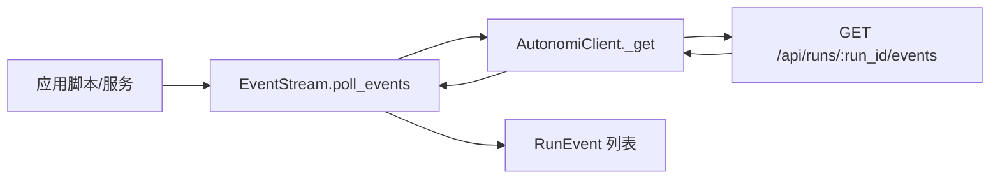
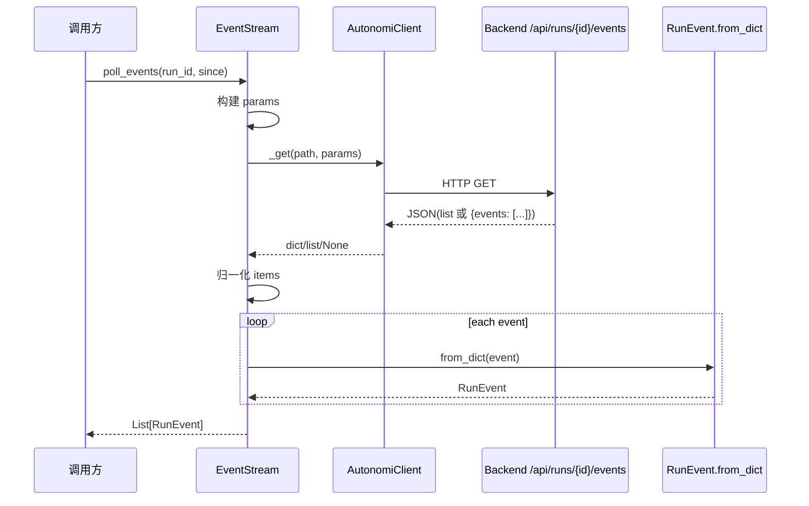
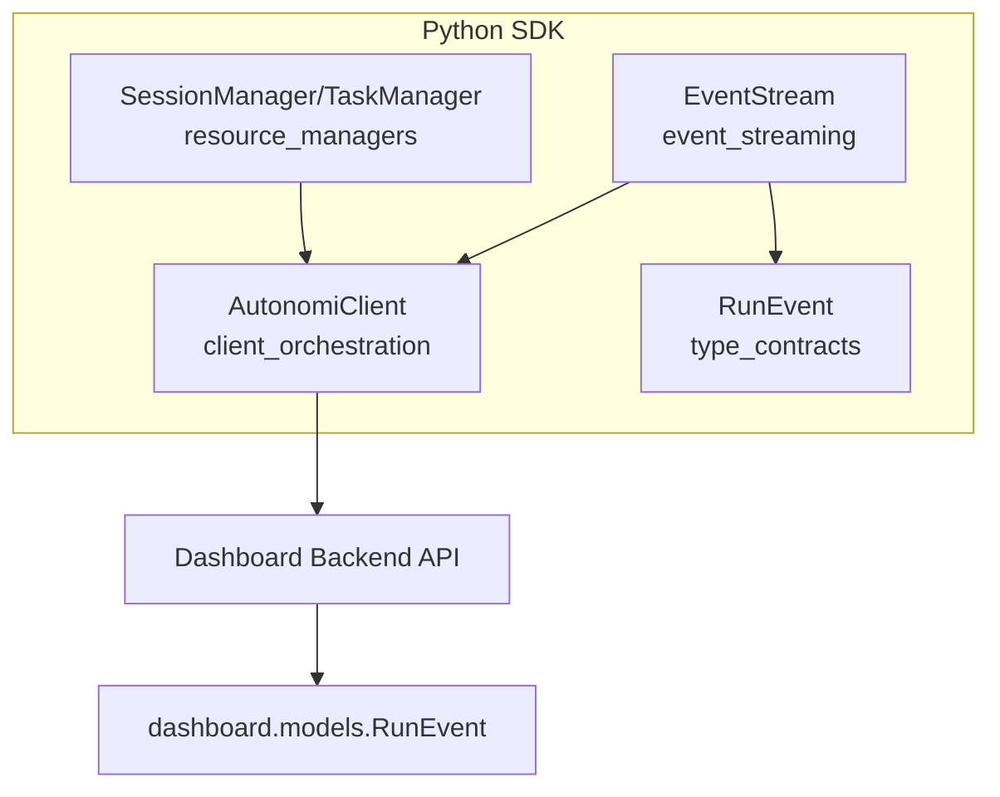
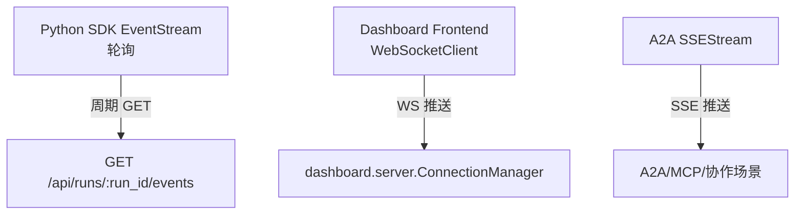

# event_streaming 模块文档

## 模块概述

`event_streaming` 是 Python SDK 中负责“运行事件增量读取”的模块，核心组件为 `sdk.python.loki_mode_sdk.events.EventStream`。它的目标非常明确：在不引入 WebSocket、SSE 客户端等外部依赖的前提下，用最小成本为调用方提供可持续消费运行状态变化（`RunEvent`）的能力。

这个模块存在的原因并不是“再造一个网络层”，而是补齐 `AutonomiClient` 的业务语义空白。`AutonomiClient` 提供的是通用 REST 请求与对象映射能力，而 `EventStream` 把它组织成“按 run 轮询事件流”这一高频场景能力，使脚本和自动化程序可以像消费日志流一样读取执行过程。对于离线环境、企业受限环境或仅允许运行标准库依赖的系统，这种轮询设计比长连接协议更容易部署与审计。

从系统边界上看，它位于 Python SDK 的中间层：向下复用 `client_orchestration` 中的 `AutonomiClient._get` 与错误处理模型，向上为任务编排脚本、监控作业、CLI 自动化和二次开发框架提供统一事件入口。若你需要了解底层 HTTP 异常映射、认证头注入与传输细节，请参考 [client_orchestration.md](client_orchestration.md)；若需要查看 `RunEvent` 字段契约，请参考 [Python SDK - 类型定义.md](Python SDK - 类型定义.md)。

---

## 设计动机与取舍

`event_streaming` 的设计是典型的“轻封装、强兼容”。它只做四件事：构造查询参数、调用事件接口、兼容后端不同响应形态、把字典映射为 `RunEvent`。它不维护本地游标、不做重试、不做持久化，也不保证 exactly-once 语义。这些能力被有意留给调用方，以保持 SDK 内核简单透明。

这种设计意味着模块非常易于理解和扩展，但也意味着消费语义（去重、断点续拉、回压控制）需要在业务侧显式实现。对于 SDK 来说，这是一种合理的分层：通用库负责“获取正确数据”，应用层负责“按业务规则处理数据”。



上图展示了模块最小闭环：`EventStream` 不直接处理鉴权、HTTP 错误码、JSON 解析，而是复用客户端能力，只负责事件语义封装和输出类型化列表。

---

## 核心组件：`EventStream`

### 组件职责

`EventStream` 是一个无状态（除了持有 client 引用）的同步轮询器，用于读取指定 `run_id` 的新事件。它通过 `since` 参数支持增量拉取，因此可以作为“准实时流”的基础构件。

### 类签名与构造

```python
class EventStream:
    def __init__(self, client: AutonomiClient) -> None:
        self._client = client
```

构造函数只接收一个 `AutonomiClient` 实例并保存，不发起任何网络请求。这样做的好处是生命周期可控：你可以在多个 `EventStream` 之间共享同一个认证与超时配置。

### 方法详解：`poll_events`

```python
poll_events(run_id: str, since: Optional[str] = None) -> List[RunEvent]
```

该方法行为流程如下：

1. 初始化空参数字典 `params`。
2. 如果传入 `since`，则附加查询参数 `{"since": since}`。
3. 调用 `self._client._get(f"/api/runs/{run_id}/events", params=params or None)`。
4. 若返回结果为空（`None`、空 body、其他假值），直接返回 `[]`。
5. 兼容两类响应：
   - 直接数组：`[{...}, {...}]`
   - 包装对象：`{"events": [{...}]}`
6. 对每个事件字典调用 `RunEvent.from_dict` 并返回对象列表。

### 处理流程图



这个流程的关键价值在于“结果归一化”：上游代码只看到 `List[RunEvent]`，不需要感知后端响应包装差异。

---

## 输入、输出与参数语义

`poll_events` 的输入参数非常少，但语义上有一些关键点。`run_id` 是必填且直接进入 URL 路径，不会在本模块做格式校验，所以如果传入空字符串或非法 ID，通常会在服务端层面触发 4xx。`since` 是可选字符串，模块不会解析或验证时间格式，而是原样透传给后端；因此你应遵守服务端期望（通常是 ISO8601 时间戳）。

输出类型固定为 `List[RunEvent]`，空响应统一折叠为 `[]`。这让调用方循环处理代码更简洁，但也会让“真的没有新事件”和“请求返回空 body”在返回值层面不可区分。若你需要区分它们，应在外层增加日志与请求级可观测性。

---

## 与其他模块的关系



`event_streaming` 与 `resource_managers` 共享同一个客户端底座，但关注点不同：`resource_managers` 主要处理任务和会话资源 CRUD，而 `event_streaming` 聚焦运行事件的连续消费。它最终对接 Dashboard Backend 的运行事件接口，并通过 `RunEvent` 类型与 SDK 内部数据契约保持一致。

---

## 实际使用模式

### 最小用法

```python
from loki_mode_sdk.client import AutonomiClient
from loki_mode_sdk.events import EventStream

client = AutonomiClient(
    base_url="http://localhost:57374",
    token="loki_xxx",
    timeout=30,
)
stream = EventStream(client)

events = stream.poll_events(run_id="run_123")
for ev in events:
    print(ev.id, ev.event_type, ev.phase, ev.timestamp)
```

### 增量轮询（推荐）

```python
import time
from loki_mode_sdk.events import EventStream

stream = EventStream(client)
last_ts = None

while True:
    batch = stream.poll_events(run_id="run_123", since=last_ts)
    for ev in batch:
        # 业务处理
        if ev.timestamp and (last_ts is None or ev.timestamp > last_ts):
            last_ts = ev.timestamp

    time.sleep(1.5)
```

该模式的核心是维护“上次已处理时间戳”。在生产环境中，建议将 `last_ts` 持久化到外部存储（例如文件或数据库），以支持进程重启后断点续拉。

### 容错包装示例

```python
import time
from loki_mode_sdk.errors import AutonomiError

def consume_events(stream, run_id):
    cursor = None
    while True:
        try:
            for ev in stream.poll_events(run_id, since=cursor):
                handle_event(ev)
                if ev.timestamp:
                    cursor = ev.timestamp
        except AutonomiError as e:
            # 例如 401/403/404/5xx
            print(f"poll failed: {e}")
            time.sleep(3)
        except Exception as e:
            # 反序列化错误或业务处理错误
            print(f"unexpected error: {e}")
            time.sleep(1)
```

---

## 配置项与可调行为

`EventStream` 本身几乎没有配置项，可调行为来自注入的 `AutonomiClient`：

- `base_url`：决定事件接口目标地址。
- `token`：决定是否携带鉴权头，影响是否能读取受保护运行事件。
- `timeout`：控制每次轮询请求超时。

轮询间隔、重试策略、终止条件都不在模块内部定义，应由调用方控制。一个常见实践是在“事件处理耗时 > 轮询间隔”时动态拉大 sleep，避免请求堆积。

---

## 边界条件、错误与限制

### 1) 响应形态兼容的边界

模块只兼容“数组”与“含 `events` 键的对象”两种形态。如果后端改为其他字段名（例如 `items`），当前实现会返回空列表而非报错，这可能导致静默数据丢失感知。升级后端契约时应同步检查此处。

### 2) `RunEvent.from_dict` 的字段严格性

`RunEvent.from_dict` 依赖 `id` 字段（以 `data["id"]` 读取）。若事件缺失该字段，会抛出 `KeyError`。这通常意味着后端契约异常或中间代理篡改响应，需要优先修复数据源而不是在 SDK 吞错。

### 3) “空列表”语义重叠

`[]` 可能表示：

- 当前确实没有新事件；
- 后端返回空 body/`None`；
- 兼容分支未命中（如键名变化）。

如果你的业务对“无事件”和“异常空响应”敏感，建议在外层记录原始响应长度、HTTP 状态与轮询延迟指标。

### 4) 重复消费与时间戳比较

模块不做去重。若 `since` 采用“闭区间”语义，服务端可能返回与上次最后一条相同 timestamp 的事件。建议调用方使用 `(event.id, timestamp)` 或仅 `event.id` 做幂等去重。

### 5) 非实时保证

这是轮询模型，不是推送模型。事件可见性延迟取决于轮询间隔、网络延迟和后端写入延迟。对毫秒级实时性有要求的场景应评估其他协议（例如系统中的 SSE/WebSocket 能力，见 [sse_event_streaming.md](sse_event_streaming.md) 作为相关参考）。

---

## 与实时通道能力的边界说明（Polling vs Push）

在整体系统中，后端与前端存在 WebSocket/SSE 等推送式通道能力（例如 `dashboard.server.ConnectionManager` 与 `src.protocols.a2a.streaming.SSEStream`）。`event_streaming` 则明确选择了客户端轮询模式。这个差异不是“能力缺失”，而是 SDK 分层上的有意设计：Python SDK 以标准库可用性和部署确定性为优先，不把长连接状态管理、心跳保活与重连抖动控制硬编码到基础客户端。



这意味着如果你在 Python 侧需要接近“流式”的体验，推荐做法不是改造 `EventStream` 为复杂长连接客户端，而是在业务层封装轮询循环、游标与退避策略。这样可以保持基础 SDK 简洁，并避免在企业网络限制下引入额外连接稳定性问题。

## 版本与路由契约注意事项

当前 `EventStream` 访问的路径是 `/api/runs/{run_id}/events`，而 `AutonomiClient` 的另一路运行历史接口是 `/api/v2/runs/{run_id}/timeline`。这两个端点面向的语义和版本演进节奏可能不同：前者用于增量事件拉取，后者常用于完整时间线读取。维护与扩展时请避免把两者混为同一接口。

如果后端未来统一到 `v2` 路径，建议以“新增兼容逻辑 + 保留旧行为一段时间”的方式演进，例如先在 `EventStream` 增加可选路径配置或自动探测，而不是直接替换硬编码路径，以减少升级期对现有脚本的破坏。

---


## 扩展建议

如果你计划扩展 `event_streaming`，建议优先保持“向后兼容 + 简单默认”原则。例如可以新增一个高级包装器（而非修改 `EventStream` 现有签名）来支持自动游标管理、指数退避和本地 checkpoint 文件。这样可以在不破坏现有调用方的情况下提供更强能力。

一个可行方向是新增 `PollingConsumer`（示意）：

```python
class PollingConsumer:
    def __init__(self, stream, interval=1.0, store=None):
        self.stream = stream
        self.interval = interval
        self.store = store

    def run_forever(self, run_id, handler):
        ...
```

将状态管理与事件抓取分离，可以继续保持 `EventStream` 的纯净职责。

---

## 维护者检查清单

- 当后端事件接口响应结构变化时，先验证 `list` 与 `{"events": ...}` 兼容逻辑是否仍成立。
- 当 `RunEvent` 类型字段变化时，同步检查 `from_dict` 的必填字段和默认值策略。
- 若新增认证机制（例如多租户上下文头），确保 `AutonomiClient` 层先完成注入，再由 `EventStream` 透明复用。
- 在高频轮询部署中，确认调用方已有超时、重试、去重和持久游标策略。

以上检查可以显著降低“事件流看似可用但存在静默丢读/重复读”的运维风险。
