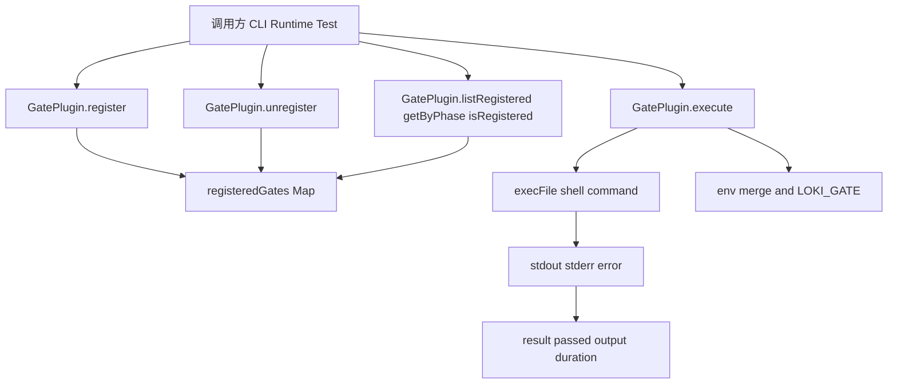
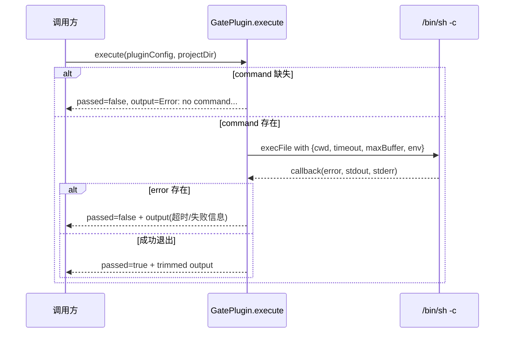
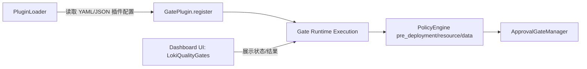

# gate_plugin 模块文档

## 模块定位与设计目标

`gate_plugin`（实现位于 `src/plugins/gate-plugin.js`）是插件系统中专门负责“质量门禁（quality gate）”扩展能力的运行时模块。它的核心价值不在于定义具体的质量规则，而在于提供一套统一的、可动态注册的门禁执行机制：外部可以把任意 Shell 命令封装成一个 gate，通过统一接口注册、查询、执行和卸载。这种设计将“质量检查逻辑”从核心流程中解耦出来，使系统可以在不改动主代码的情况下快速接入 ESLint、测试套件、安全扫描、合规脚本等检查能力。

从系统分层看，它属于 [Plugin System](Plugin%20System.md) 的具体插件类型实现，与 [AgentPlugin](AgentPlugin.md)、[IntegrationPlugin](IntegrationPlugin.md)、[MCPPlugin](MCPPlugin.md) 处于同一层级：都负责“某类插件的生命周期管理”，而不是负责业务编排本身。`gate_plugin` 只维护 gate 元数据与命令执行，不直接做策略判定；策略判定通常由 [Policy Engine](Policy%20Engine.md) 系列模块负责，尤其是 pre-deployment / approval 相关逻辑可与 gate 结果组合使用。

## 核心架构与职责边界

`GatePlugin` 是一个纯静态类（static-only class），内部依赖一个模块级 `Map`（`_registeredGates`）作为内存注册中心。由于不依赖实例，调用方可以在任意位置直接 `GatePlugin.register(...)` 或 `GatePlugin.execute(...)`。这一模式降低了接入成本，但也带来状态生命周期与并发语义上的约束（详见“边界条件与限制”章节）。



上图体现了模块的两个核心平面：第一是“注册中心平面”（`register/unregister/query`），第二是“执行平面”（`execute` 拉起子进程执行命令）。两者弱耦合：`execute` 并不强制要求命令来自 `_registeredGates`，它只消费传入的 `pluginConfig`。这意味着你可以把它当成“通用 gate 执行器”，也意味着调用方需要自行保证配置来源可信。

## 组件详解：`src.plugins.gate-plugin.GatePlugin`

### 1) `register(pluginConfig)`

`register` 用于向内存注册表增加一个自定义质量门禁定义。它首先校验 `pluginConfig.type === 'quality_gate'`，然后按 `name` 做唯一性检查，最后构建标准化的 gate 定义对象并写入 `_registeredGates`。

方法签名语义如下：

```js
GatePlugin.register(pluginConfig) => { success: boolean, error?: string }
```

输入配置支持的关键字段包括：`name`、`description`、`phase`、`command`、`timeout_ms`、`blocking`、`severity`。其中默认值行为非常关键：`phase` 默认 `pre-commit`，`timeout_ms` 默认 `30000`，`blocking` 默认 `true`，`severity` 默认 `high`。此外模块会在注册时自动写入 `registered_at`（ISO 时间戳），方便后续审计或展示。

需要注意，`register` 当前只对 `type` 与“重名”做强校验。它不会验证 `name` 是否为空字符串、`command` 是否存在或是否为字符串，也不会检查 `timeout_ms` 是否正数。因此“注册成功”不代表“可成功执行”，执行阶段仍可能失败。

### 2) `unregister(pluginName)`

`unregister` 根据名称删除注册项。如果目标 gate 不存在则返回失败；存在则删除并返回成功。该操作是幂等语义中的“显式失败”风格（即重复删除同一 gate 会报错而不是静默成功），调用方在批处理时应先 `isRegistered` 或忽略该错误分支。

```js
GatePlugin.unregister(pluginName) => { success: boolean, error?: string }
```

### 3) `execute(pluginConfig, projectDir)`

`execute` 是模块最关键的运行时能力：它将 gate 配置里的 `command` 交给 `/bin/sh -c` 执行，并以 Promise 返回统一结构的结果对象。

```js
GatePlugin.execute(pluginConfig, projectDir)
// => Promise<{ passed: boolean, output: string, duration_ms: number }>
```

执行机制分为四步：

1. 读取命令与超时配置，记录开始时间。
2. 若无 `command`，立即返回失败结果（非抛异常）。
3. 使用 `execFile('/bin/sh', ['-c', command], options, callback)` 拉起子进程。
4. 在回调中汇总 `stdout/stderr/error`，生成标准返回体。



#### 参数与执行上下文

`projectDir` 决定命令执行目录；若未提供则回退到 `process.cwd()`。环境变量采用“继承 + 注入”策略：`env: { ...process.env, LOKI_GATE: pluginConfig.name || 'unknown' }`。这意味着你可以在脚本中读取 `LOKI_GATE` 做按 gate 名称分支处理。

#### 返回值语义

返回对象是“业务结果对象”，不是异常流。即便命令失败、超时或缓冲区问题，也通常 resolve 为 `{ passed: false, ... }`，而不是 reject。调用方应始终检查 `passed` 字段，而不是仅依赖 `try/catch`。

#### 关于错误分类的实现细节

当前实现将两类错误合并到了同一提示文案：

- `error.killed === true`（常见于超时被杀进程）
- `error.code === 'ERR_CHILD_PROCESS_STDIO_MAXBUFFER'`（输出超过 `maxBuffer`）

这两种情况都会返回 `Timeout: command exceeded ...`。也就是说，**缓冲区溢出会被误报为超时**。这是一个现实中的可观测性陷阱，排障时应结合命令输出规模和运行时长判断根因。

### 4) `getByPhase(phase)`

该方法从注册表中过滤 `g.phase === phase` 的门禁列表，使用严格相等匹配，因此区分大小写，不做标准化处理。不同团队若未统一 phase 命名（如 `pre-commit` vs `pre_commit`），会出现“已注册但查不到”的现象。

### 5) `listRegistered()`

返回当前所有注册 gate 的快照数组（`Array.from(_registeredGates.values())`）。这是值拷贝数组，但数组元素对象本身并非深拷贝；调用方若直接修改对象字段，不会自动写回 Map，但如果保留同一对象引用进行共享，也可能造成认知混乱。建议把返回结果视作只读。

### 6) `isRegistered(name)`

仅做存在性判断，适合在注册前做快速防重，或在卸载前做显式校验。

### 7) `_clearAll()`

测试辅助接口，用于清空内存注册表。生产路径通常不应调用该方法，否则会导致所有动态 gate 丢失。

## 与其他模块的关系

`gate_plugin` 本身聚焦“执行”与“注册”。当系统要形成完整治理闭环时，通常会与以下模块协作：



在工程实践中，一条常见链路是：`PluginLoader` 从 `.loki/plugins` 发现配置文件并校验，然后把合法的 `quality_gate` 配置交给 `GatePlugin.register`。运行时按 phase 拉取 gate 并执行，结果再进入策略与审批系统。关于插件发现和校验细节，建议阅读 [PluginLoader](PluginLoader.md)；关于策略决策与审批流，建议阅读 [Policy Engine](Policy%20Engine.md) 与 [Policy Engine - Approval Gate](Policy%20Engine%20-%20Approval%20Gate.md)。

## 典型使用方式

### 示例一：注册并按阶段执行

```js
const { GatePlugin } = require('./src/plugins/gate-plugin');

GatePlugin.register({
  type: 'quality_gate',
  name: 'eslint-check',
  description: 'Run ESLint before commit',
  phase: 'pre-commit',
  command: 'npm run lint',
  timeout_ms: 60000,
  blocking: true,
  severity: 'high'
});

async function runPhaseGates(phase, projectDir) {
  const gates = GatePlugin.getByPhase(phase);

  for (const gate of gates) {
    const result = await GatePlugin.execute(gate, projectDir);
    console.log(`[${gate.name}] passed=${result.passed} duration=${result.duration_ms}ms`);

    if (!result.passed && gate.blocking) {
      throw new Error(`Blocking gate failed: ${gate.name}\n${result.output}`);
    }
  }
}
```

这个模式体现了 `blocking` 字段的真实语义：`GatePlugin` 自身不拦截流程，**是否阻断流程由调用方决定**。如果你忽略 `blocking`，那它只是个元数据标签。

### 示例二：与插件加载器联动

```js
const { PluginLoader } = require('./src/plugins/loader');
const { GatePlugin } = require('./src/plugins/gate-plugin');

const loader = new PluginLoader('.loki/plugins');
const { loaded, failed } = loader.loadAll();

for (const item of loaded) {
  if (item.config.type === 'quality_gate') {
    const r = GatePlugin.register(item.config);
    if (!r.success) {
      console.warn(`register failed: ${item.path} -> ${r.error}`);
    }
  }
}

if (failed.length > 0) {
  console.warn('Some plugin files are invalid:', failed);
}
```

### 示例三：门禁脚本读取 `LOKI_GATE`

```bash
#!/usr/bin/env bash
set -euo pipefail

echo "current gate: ${LOKI_GATE:-unknown}"
if [[ "${LOKI_GATE:-}" == "security-scan" ]]; then
  npm run scan:security
else
  npm test
fi
```

## 配置建议与运维注意事项

在真实项目中，建议为不同类型的检查设置不同超时。静态检查（lint/format）通常几十秒以内，集成测试或安全扫描可能需要数分钟；过小的 `timeout_ms` 会制造大量误报，过大则拖慢流水线反馈。你还应避免让命令产生超大输出，因为模块 `maxBuffer` 固定为 1MB，超过会失败且可能误判为超时。

命令执行使用 `/bin/sh`，这在 Unix-like 环境通常可用，但在非 POSIX 环境（例如某些 Windows 部署场景）可能缺失或行为差异明显。因此跨平台项目通常会把 gate 命令写成 `node scripts/...` 或容器内执行，以降低 shell 差异。

从安全角度，`command` 是可执行字符串，若配置来源不可信就等同于远程命令执行入口。应当把 gate 配置纳入受控仓库与代码评审流程，限制谁可以注册/修改插件，并避免把未清洗的用户输入直接拼接进命令。

## 边界条件、错误条件与已知限制

```mermaid
flowchart TD
    A[register 输入] --> B{type==quality_gate?}
    B -- 否 --> C[返回错误]
    B -- 是 --> D{name 冲突?}
    D -- 是 --> E[返回重复注册错误]
    D -- 否 --> F[写入内存 Map]

    G[execute] --> H{command 存在?}
    H -- 否 --> I[passed=false: no command]
    H -- 是 --> J[/bin/sh -c 执行]
    J --> K{error?}
    K -- 否 --> L[passed=true]
    K -- 是 --> M[passed=false]
    M --> N[超时与 maxBuffer 可能同文案]
```

当前版本最重要的限制是“仅内存注册，不持久化”。进程重启后所有动态注册 gate 都会丢失，通常需要在启动阶段重新加载（例如通过 `PluginLoader`）。同时它也没有并发锁和分布式一致性机制，因此多进程/多实例部署时，每个进程维护自己的 gate 视图，不会自动同步。

另一个常见误区是把 `severity`、`blocking` 当成内建执行策略。实际上本模块不会根据这两个字段自动改变执行行为；它们只是附带元数据，需由上层 orchestration 或策略引擎消费。

## 可扩展性建议

如果你计划扩展 `gate_plugin`，优先考虑三类增强。第一类是“配置校验增强”：在 `register` 增加字段类型、取值范围、必填项校验，尽早失败。第二类是“执行可观测性增强”：区分 timeout、non-zero exit、maxBuffer overflow，并输出结构化错误码。第三类是“状态管理增强”：支持持久化注册表或集中式注册中心，以适应多实例场景。

如果扩展涉及统一插件治理（热加载、schema 校验、回滚），建议将能力放在 [PluginLoader](PluginLoader.md) 或其上层编排中，而不是让 `GatePlugin` 变成“全能管理器”。保持其“轻量执行器 + 注册表”的边界，有利于长期维护。

## 参考文档

- [Plugin System](Plugin%20System.md)
- [PluginLoader](PluginLoader.md)
- [AgentPlugin](AgentPlugin.md)
- [IntegrationPlugin](IntegrationPlugin.md)
- [MCPPlugin](MCPPlugin.md)
- [Policy Engine](Policy%20Engine.md)
- [Policy Engine - Approval Gate](Policy%20Engine%20-%20Approval%20Gate.md)
