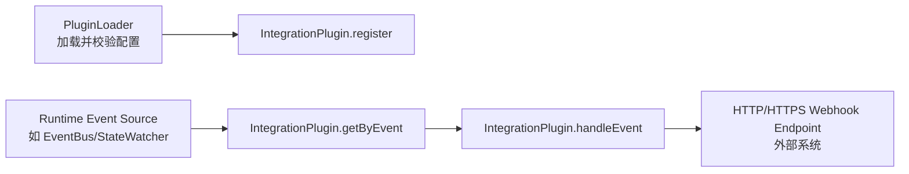
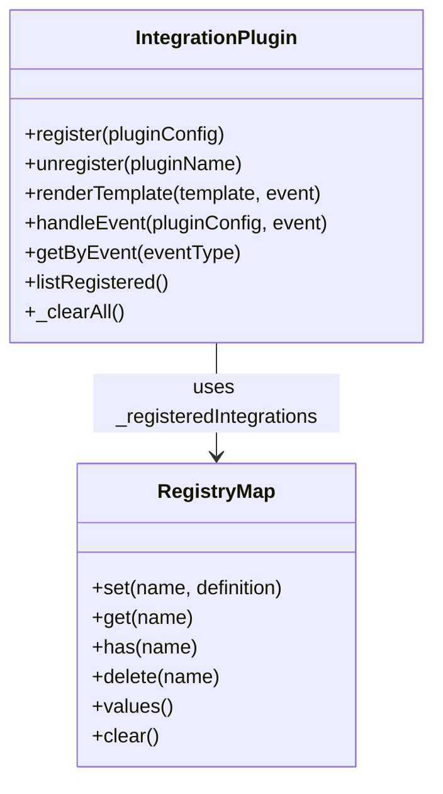
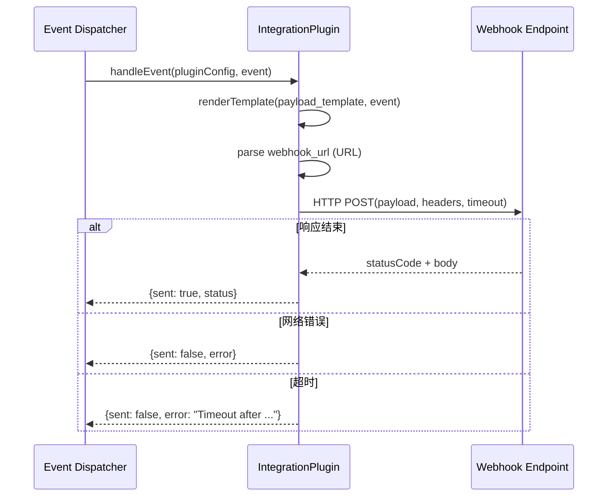
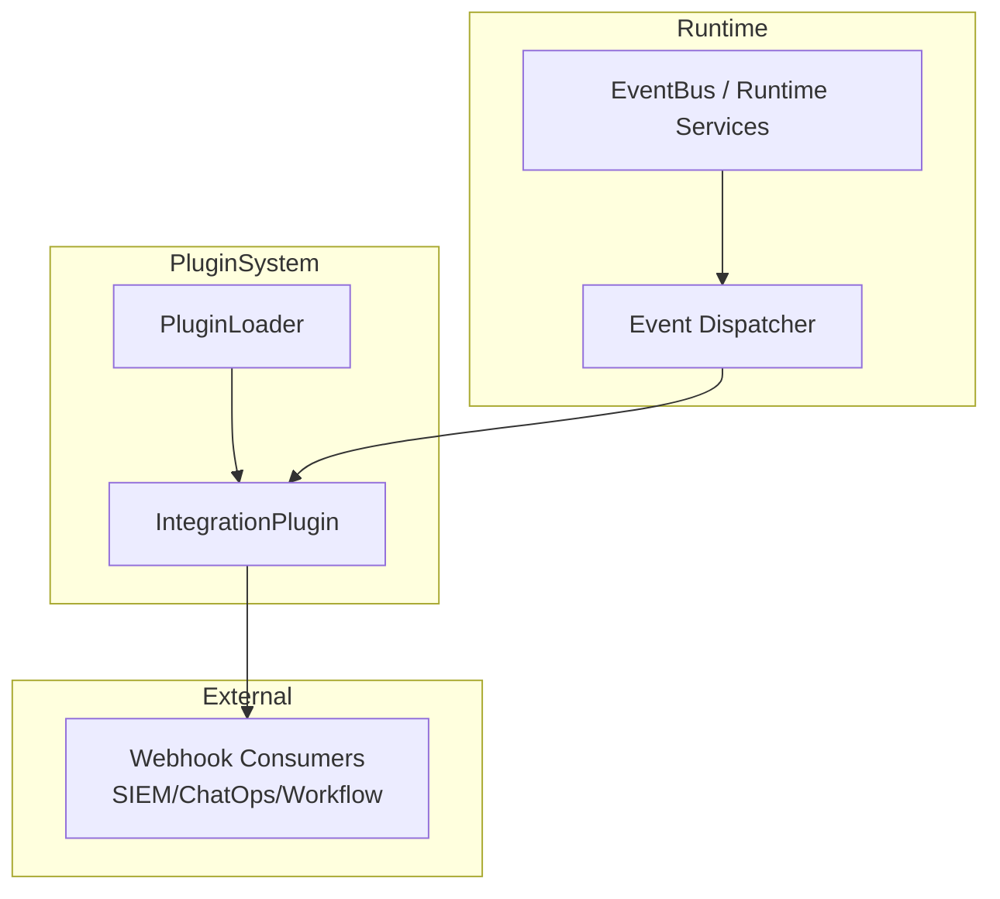

# integration_plugin 模块文档

## 概述

`integration_plugin` 模块（核心类：`src.plugins.integration-plugin.IntegrationPlugin`）是插件系统中用于“外部系统事件分发”的轻量桥接层。它的目标不是实现某个特定 SaaS 的完整 API 客户端（例如 Jira、Linear、Slack、Teams 这些已由 `Integrations` 模块提供），而是提供一种**通用 webhook 出口**：当系统内部发生事件时，可以按插件配置把事件以 HTTP POST 的方式发送到任意第三方服务。

这个模块存在的核心价值在于解耦。业务侧或平台侧不需要为每个外部系统都编写内置适配器，只需注册一个 `type = "integration"` 的插件配置，就可以将事件转发给外部自动化平台、告警系统、审计系统或自定义工作流引擎。对于希望快速接入企业内部系统（尤其是私有平台）的团队，这种模型比新增一套内置集成更低成本。

从设计上看，它强调三个特性：第一，配置驱动（注册后即可工作）；第二，事件选择性订阅（通过 `events` 精确匹配或 `*` 通配）；第三，模板化载荷（`payload_template` 中可引用 `{{event.xxx}}` 路径）。同时，它刻意保持实现简洁：仅依赖 Node.js `http/https` 标准库与内存注册表，不引入额外消息中间件或复杂执行引擎。

---

## 在整体系统中的位置

`integration_plugin` 隶属于 Plugin System，与 `AgentPlugin`、`GatePlugin`、`MCPPlugin` 并列。典型路径是：`PluginLoader` 负责发现并校验插件配置，运行时事件源（常见是 API/EventBus 或其他运行时服务）触发事件后，调度层根据事件类型查询匹配的 Integration 插件，并调用 `IntegrationPlugin.handleEvent(...)` 执行实际 webhook 分发。



上图强调了模块边界：`IntegrationPlugin` 本身不负责“监听事件总线”，也不负责“插件文件发现与 schema 校验”，它只负责**注册表管理 + 模板渲染 + 网络投递**。这与 `PluginLoader` 的职责分离可参考 [plugin_discovery_and_loading.md](plugin_discovery_and_loading.md) 与 [Plugin System.md](Plugin%20System.md)。

---

## 核心架构与内部状态

模块内部只有一个全局（模块级）状态：

- `_registeredIntegrations: Map<string, object>`：保存所有已注册 integration 定义，key 为插件名。

这意味着注册结果是“进程内共享”的。只要 Node 进程存活，注册数据就可复用；进程重启后会全部丢失（除非上层重新加载配置并重新注册）。



这个设计非常直接，但也带来运维语义：在多实例部署时，每个实例都有自己的注册表副本，天然不具备跨实例一致性，需要上层统一装载策略。

---

## 组件详解：`IntegrationPlugin`

### 1) `register(pluginConfig)`

`register` 用于把一个已通过上层校验的 integration 配置放入内存注册表。该方法会首先检查 `pluginConfig.type` 是否为 `integration`，其次检查同名插件是否已存在，最后构造标准化定义对象 `intDef` 并写入 `_registeredIntegrations`。

方法签名：

```js
static register(pluginConfig)
// => { success: boolean, error?: string }
```

关键输入字段（来自 `pluginConfig`）：

- `name`：插件唯一名称（Map 的 key）
- `description`：描述
- `webhook_url`：目标 webhook 地址
- `events`：订阅事件列表，默认 `[]`
- `payload_template`：请求体模板，默认 `{"event": "{{event.type}}", "message": "{{event.message}}"}`
- `headers`：自定义请求头，默认 `{}`
- `timeout_ms`：请求超时，默认 `5000`
- `retry_count`：重试次数，默认 `1`（注意：当前版本仅存储，不执行自动重试）

返回行为：

- 成功：`{ success: true }`
- 失败：`{ success: false, error: "..." }`，失败原因主要是类型不对或名称重复。

副作用：

- 向全局内存 Map 新增一条注册记录。
- 自动写入 `registered_at`（ISO 时间字符串）。

---

### 2) `unregister(pluginName)`

`unregister` 从注册表移除指定插件名。如果插件不存在，会返回错误；存在则删除并返回成功。

```js
static unregister(pluginName)
// => { success: boolean, error?: string }
```

副作用是直接修改全局 Map。因为没有引用计数或状态机，该操作是立即生效的：后续事件路由不再命中该插件。

---

### 3) `renderTemplate(template, event)`

这是模块中最关键的“内容生成”能力。模板语法是 `{{event.xxx}}` 风格，支持嵌套路径（例如 `{{event.data.user.id}}`）。底层通过正则扫描模板并替换占位符。

```js
static renderTemplate(template, event)
// => string
```

替换规则细节：

1. 若 `template` 非字符串，则返回 `template || ''`。
2. 正则匹配 `{{event.<path>}}`，其中 `<path>` 支持 `a.b.c`。
3. 路径取值过程中任一层为 `null/undefined`，替换为空字符串。
4. 若命中值为对象，则 `JSON.stringify(value)`。
5. 若命中值为原始类型，则先转字符串再做 JSON-safe escape（通过 `JSON.stringify(String(value)).slice(1,-1)` 处理引号、反斜杠和控制字符）。

这一实现有两个重要结果：

- 在 JSON 模板字符串中嵌入文本时，通常能避免破坏 JSON 结构。
- 如果模板本身不是合法 JSON，或你把对象值放在带引号的位置，仍可能生成语义不符合预期的 payload（见后文“边界与陷阱”）。

---

### 4) `handleEvent(pluginConfig, event)`

`handleEvent` 负责把事件发送到 `pluginConfig.webhook_url`。它会自动识别 `http`/`https` 协议并选择对应请求函数；方法为 `POST`，默认 `Content-Type: application/json`，并设置 `Content-Length`。

```js
static async handleEvent(pluginConfig, event)
// => Promise<{ sent: boolean, status?: number, error?: string }>
```

执行过程如下：



返回语义：

- `sent: true` 仅表示请求已收到响应并结束，附带 `status`。
- 不会基于 `status` 自动判定业务成功或失败（例如 500 也可能返回 `sent: true`）。
- 出现异常、请求错误或超时时返回 `sent: false` 和 `error`。

实现备注：源码注释写了“Fire-and-forget with timeout”，但当前方法仍是 `await` 一个 Promise 的模式；“fire-and-forget”更准确地说是没有内置重试、回执持久化或阻塞性事务语义。

---

### 5) `getByEvent(eventType)`

该方法用于事件路由筛选：返回所有订阅了该 `eventType` 的 integration，或者订阅了 `*` 的 integration。

```js
static getByEvent(eventType)
// => object[]
```

筛选规则非常直接：

- `i.events.includes(eventType)` 命中精确事件；
- `i.events.includes('*')` 命中全量事件。

这也是上层调度器将一个内部事件扇出到多个 webhook 的关键入口。

---

### 6) `listRegistered()` 与 `_clearAll()`

`listRegistered()` 返回当前内存中所有 integration 定义快照；`_clearAll()` 清空注册表，主要用于测试隔离。

```js
static listRegistered() // => object[]
static _clearAll() // => void
```

`_clearAll()` 不应在生产业务流程中调用，因为它会全局撤销全部注册。

---

## 与其他模块的协作关系

`integration_plugin` 主要依赖和协作的模块如下：

1. **Plugin Loader / 校验链路**：`PluginLoader` 负责从 `.loki/plugins` 发现 YAML/JSON 并校验，再把合法配置交给 `IntegrationPlugin.register`。详细可见 [PluginLoader.md](PluginLoader.md)。
2. **事件源模块**：常见是 API 服务侧事件系统（例如 `api.services.event-bus.EventBus`），由它产生事件并触发路由。事件总线机制见 [Event Bus.md](Event%20Bus.md)。
3. **内置集成模块（可替代关系）**：如果你需要深度 API 读写与双向同步，应考虑 `Integrations` 模块（Jira/Linear/Slack/Teams）；如果只需通用事件转发，`integration_plugin` 更轻量。可参考 [Integrations.md](Integrations.md)。



---

## 配置与使用示例

### 最小可用配置示例

```json
{
  "type": "integration",
  "name": "ops-webhook",
  "description": "Forward runtime alerts to Ops platform",
  "webhook_url": "https://ops.example.com/hooks/loki",
  "events": ["run.failed", "gate.blocked"],
  "payload_template": "{\"type\":\"{{event.type}}\",\"session\":\"{{event.sessionId}}\",\"data\":{{event.data}}}",
  "headers": {
    "Authorization": "Bearer ${OPS_WEBHOOK_TOKEN}",
    "X-Source": "loki"
  },
  "timeout_ms": 4000,
  "retry_count": 2
}
```

### 注册与分发示例

```js
const { IntegrationPlugin } = require('./src/plugins/integration-plugin');

const config = {
  type: 'integration',
  name: 'security-audit-hook',
  webhook_url: 'https://audit.example.com/webhook',
  events: ['audit.created', '*'],
  payload_template: '{"event":"{{event.type}}","payload":{{event.data}}}',
  headers: { 'X-App': 'autonomi' },
  timeout_ms: 5000,
};

const reg = IntegrationPlugin.register(config);
if (!reg.success) {
  throw new Error(reg.error);
}

async function dispatch(event) {
  const targets = IntegrationPlugin.getByEvent(event.type);
  for (const plugin of targets) {
    const result = await IntegrationPlugin.handleEvent(plugin, event);
    console.log(plugin.name, result);
  }
}
```

### 模板渲染示例

```js
const tpl = '{"msg":"{{event.message}}","meta":{{event.meta}},"missing":"{{event.notExist}}"}';
const event = {
  message: 'quote: "hello"',
  meta: { level: 'warn' },
};

const payload = IntegrationPlugin.renderTemplate(tpl, event);
// payload => {"msg":"quote: \"hello\"","meta":{"level":"warn"},"missing":""}
```

---

## 边界条件、错误处理与已知限制

`integration_plugin` 的实现足够轻便，但在生产场景需要明确其边界。

首先，它是**纯内存注册**，没有持久化和分布式同步。服务重启后注册会丢失；多副本部署时各副本状态可能不一致。通常应由启动流程统一调用加载器进行重建，或由控制面统一下发。

其次，配置字段 `retry_count` 当前仅被保存，不参与 `handleEvent` 重试逻辑。也就是说一次请求失败后不会自动重发。如果你依赖至少一次投递语义，需要在上层调度器实现重试/退避，或让外部 webhook 网关承担重试。

再次，`handleEvent` 对 HTTP 状态码没有成功阈值判断。只要收到了响应并触发 `end`，就会返回 `sent: true`。因此业务层应自行检查 `status`（例如把 `>= 400` 视为失败并记录审计/告警）。

此外，模板引擎是“字符串替换”级别，不是完整 JSON 模板语言。若模板写法不当，可能得到非法 JSON 或语义错误的 payload。尤其要注意对象占位符应放在不带引号的位置，例如 `"data": {{event.data}}`，而不是 `"data": "{{event.data}}"`。

最后，安全方面仅支持静态 `headers` 注入，不含签名算法、OAuth 刷新、重放保护或证书钉扎等高级能力。如果你对外发送敏感事件，建议通过受控网关统一鉴权与审计，并结合 [Audit.md](Audit.md) 与 [Observability.md](Observability.md) 建立追踪。

---

## 扩展与演进建议

如果你准备扩展该模块，建议优先考虑以下方向：

- 将 `retry_count` 真正接入发送流程，支持指数退避与可配置重试条件（网络错误、5xx、429 等）。
- 支持 `success_status_range` 或 `success_status_codes`，让“成功判定”可配置。
- 增加可选签名（如 HMAC）以便 webhook 接收方验签。
- 提供可插拔 payload renderer（例如 Handlebars/JSONata），替代当前正则替换。
- 引入注册表持久化后端（文件、数据库、控制面 API），解决重启丢失与多实例一致性问题。

这些演进应保持与现有 Plugin System 的一致注册生命周期，避免破坏 `PluginLoader -> register` 的基本契约。

---

## 测试与运维建议

在单元测试中可使用 `_clearAll()` 保证用例隔离，并通过本地 HTTP mock server 验证 `timeout`、`error`、`status` 分支。集成测试中建议覆盖以下场景：非法 URL、连接拒绝、TLS 错误、慢响应超时、4xx/5xx 状态码、模板缺失字段、`*` 通配订阅。

在生产运维中，应记录每次分发的目标插件名、事件类型、状态码和错误信息，必要时将结果写入审计流。若系统已有事件总线/通知中心，可把 webhook 分发结果反向发布为内部事件，便于统一可观测。

---

## 相关文档

- 插件系统全景：[`Plugin System.md`](Plugin%20System.md)
- 插件发现与加载：[`plugin_discovery_and_loading.md`](plugin_discovery_and_loading.md)
- `PluginLoader` 细节：[`PluginLoader.md`](PluginLoader.md)
- 事件总线机制：[`Event Bus.md`](Event%20Bus.md)
- 内置集成能力：[`Integrations.md`](Integrations.md)
- 审计与合规：[`Audit.md`](Audit.md)
- 可观测性：[`Observability.md`](Observability.md)
