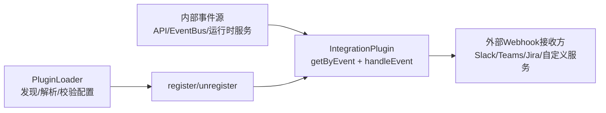
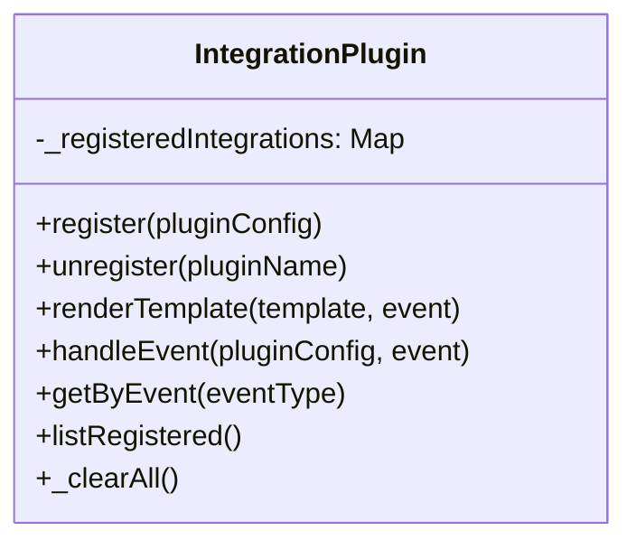
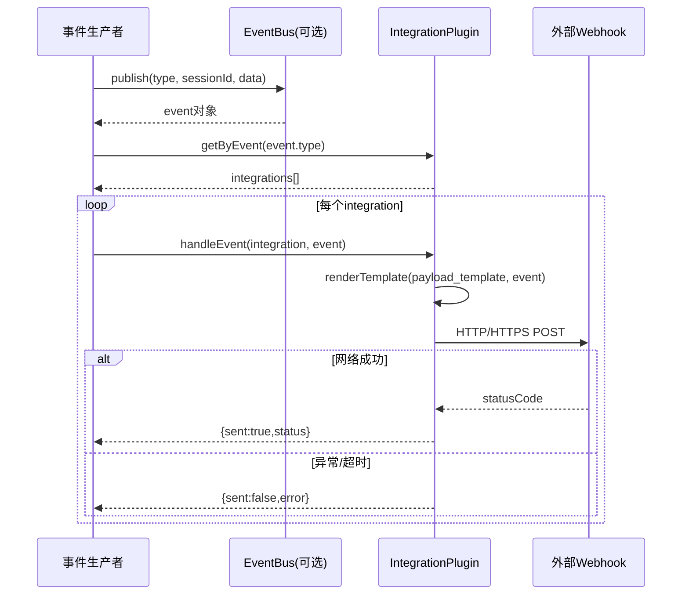

# integration_webhook_dispatch 模块文档

## 模块定位与设计目标

`integration_webhook_dispatch` 是插件系统中负责“把内部事件转发到外部系统”的核心模块，对应实现为 `src/plugins/integration-plugin.js` 中的 `IntegrationPlugin`。它存在的原因非常直接：系统内部已经有大量状态变化、任务流转、审计信号与运行事件，但这些事件如果不能被可靠、低耦合地分发到企业已有的通知与自动化平台（如 Slack、Teams、Jira Automation、CI/CD Webhook 接收器），就无法形成完整的集成闭环。

该模块选择了一个非常轻量的设计：使用进程内 `Map` 维护注册表，使用静态方法暴露生命周期管理与事件投递能力，再通过模板渲染将统一事件对象转成目标系统需要的 JSON 负载。这种设计牺牲了部分“分布式/持久化能力”，换来极低接入成本和较高可读性，适合在插件生态中作为默认的 webhook 分发基础设施。

从系统边界看，它并不负责“事件产生”，也不负责“插件配置文件发现与校验”。事件通常来自 API 层或运行时服务（例如 EventBus 发布的事件），插件配置通常由 `PluginLoader` 发现、解析、校验后再调用本模块完成注册。因此，这个模块的职责非常聚焦：**管理 integration 类型插件 + 按事件过滤 + 模板渲染 + HTTP/HTTPS POST 分发**。

---

## 在整体系统中的位置

在模块树中，它位于 `Plugin System -> integration_webhook_dispatch`，核心组件只有一个：`src.plugins.integration-plugin.IntegrationPlugin`。虽然实现单一，但它是连接“内部事件总线”和“外部系统 webhook 入口”的关键桥梁。



上图反映了典型集成链路：`PluginLoader` 管理配置生命周期，`IntegrationPlugin` 管理运行期分发，外部系统只需实现标准 HTTP 接口即可接收事件。若你需要了解插件文件加载与 schema 校验细节，请参考 [PluginLoader](PluginLoader.md)；若你需要了解系统事件如何被发布和订阅，请参考 [Event Bus](Event Bus.md)；若你关注“外部系统回调进入本系统”的反向路径，可参考 [Integrations-Jira](Integrations-Jira.md) 中 webhook 处理器思路。

---

## 核心组件：IntegrationPlugin

`IntegrationPlugin` 是纯静态类（无实例化语义），内部维护一个私有注册表：

- `_registeredIntegrations: Map<string, IntegrationDefinition>`

这意味着任何调用方都共享同一份进程内状态。它简化了调用方式（随处可用），也带来重要约束：状态不持久、跨进程不共享、测试之间可能污染（因此提供 `_clearAll`）。

### 组件结构图



`IntegrationPlugin` 的公共方法可以分成三组：第一组是注册表管理（`register`/`unregister`/`listRegistered`/`_clearAll`）；第二组是事件路由（`getByEvent`）；第三组是消息构建与发送（`renderTemplate`/`handleEvent`）。这种分组与调用时序基本一致，便于扩展时定位责任边界。

---

## 关键数据模型与字段语义

注册成功后，模块会把外部传入配置标准化为内部定义对象（`intDef`），主要字段如下：

```js
{
  name,
  description,
  webhook_url,
  events,
  payload_template,
  headers,
  timeout_ms,
  retry_count,
  registered_at
}
```

其中有几个字段需要特别说明。`events` 支持精确事件名和 `*` 全量订阅；`payload_template` 是字符串模板而不是对象；`headers` 会被直接并入请求头；`retry_count` 当前仅被存储，尚未参与发送重试逻辑；`registered_at` 是注册时间戳，可用于可观测和审计展示。

---

## 方法级深度说明

### 1) `register(pluginConfig)`

该方法用于注册一个 integration 插件。它首先检查配置存在且 `type === "integration"`，然后以 `name` 为唯一键执行去重，最后写入注册表。若未显式传入可选项，会填充默认值，包括默认模板、默认超时（5000ms）、默认重试次数（1）与空头部对象。

**参数**

- `pluginConfig: object`：通常来自 `PluginLoader` 校验后的配置对象。

**返回值**

- 成功：`{ success: true }`
- 失败：`{ success: false, error: string }`

**副作用**

- 修改进程内 `_registeredIntegrations`。

**行为注意**

- 如果 `name` 冲突会拒绝注册。
- 方法本身不验证 `webhook_url` 的可达性与协议合法性（只有在发送阶段才会暴露 URL 错误）。

### 2) `unregister(pluginName)`

该方法按名称移除注册项，适合热更新、灰度下线或测试清理场景。若目标名称不存在，返回失败而不是静默忽略，这有利于调用侧发现状态漂移。

**参数**

- `pluginName: string`

**返回值**

- 成功：`{ success: true }`
- 失败：`{ success: false, error: string }`

**副作用**

- 删除注册表项。

### 3) `renderTemplate(template, event)`

该方法执行模板替换，识别模式 `{{event.path.to.field}}`。内部会按点号逐级访问 `event` 对象，访问中遇到 `null/undefined` 时回退为空字符串。若最终值是对象，则 `JSON.stringify`；若是标量，则先转字符串再做 JSON-safe 转义（通过 `JSON.stringify(...).slice(1, -1)`）。

这种实现对“在 JSON 字符串上下文插值”非常实用，可避免引号、反斜杠和控制字符破坏 JSON 结构。

**参数**

- `template: string`
- `event: object`

**返回值**

- `string`

**副作用**

- 无外部副作用。

**边界行为**

- 非字符串模板会原样返回（`null/undefined` 会转为空字符串）。
- 仅支持 `\w` 路径片段，不支持数组索引语法（例如 `items[0]`）。

### 4) `handleEvent(pluginConfig, event)`

该方法是 webhook 分发主流程。它会渲染 payload，解析 URL 协议后选择 `https.request` 或 `http.request`，然后以 `POST` 发送 JSON 负载。请求设置了超时，且统一以 Promise 结果返回，不向上抛异常。

**参数**

- `pluginConfig: object`
- `event: object`

**返回值**

- `Promise<{ sent: boolean, status?: number, error?: string }>`

**副作用**

- 发起外部网络请求。

**实现细节**

- 自动附加 `Content-Type: application/json`。
- 自动计算 `Content-Length`。
- 超时会 `req.destroy()` 并返回错误。
- 响应体会被读取但当前未用于返回判定，仅返回 HTTP 状态码。

### 5) `getByEvent(eventType)`

该方法根据事件类型筛选集成，条件是 `events` 包含目标事件，或包含 `*` 通配符。它不做复杂模式匹配（如前缀、正则）。

### 6) `listRegistered()`

返回当前注册表快照数组，常用于管理端展示与调试。

### 7) `_clearAll()`

清空注册表，主要用于测试隔离。生产代码应避免滥用。

---

## 端到端处理流程



这里需要强调一个设计取舍：模块注释写有 “Fire-and-forget with timeout”，但函数签名仍然返回 Promise 结果，因此调用方可以选择“等待结果并记录”或“仅触发不等待”。是否真正 fire-and-forget，取决于上层调度逻辑。

---

## 依赖关系与协作模块

### 与 PluginLoader 的关系

`PluginLoader` 负责从文件系统发现 `.yaml/.yml/.json` 插件配置并校验合法性，`IntegrationPlugin` 不处理文件读取和 schema 校验。推荐流程是：`PluginLoader.loadAll()` 得到已校验配置，再逐个调用 `IntegrationPlugin.register`。这样能把“配置问题”与“运行时网络问题”分层处理。

### 与 EventBus 的关系

`EventBus` 负责内部发布/订阅和历史缓存，`IntegrationPlugin` 负责对外投递。常见模式是在某个订阅回调中将事件交给 `IntegrationPlugin`：先 `getByEvent(event.type)`，再并发调用 `handleEvent`。这样不会把外部 I/O 引入 EventBus 内核。

### 与集成适配器/处理器的关系

以 Jira 为例，`WebhookHandler` 处理的是“入站 webhook（外部 -> 本系统）”，而 `IntegrationPlugin` 处理的是“出站 webhook（本系统 -> 外部）”。两者方向相反但可组合：入站事件触发内部流程，内部流程再通过本模块向其他平台广播。

---

## 使用与配置实践

### 最小可用示例

```js
const { IntegrationPlugin } = require('./src/plugins/integration-plugin');

IntegrationPlugin.register({
  type: 'integration',
  name: 'ops-webhook',
  description: 'Send task lifecycle to Ops',
  webhook_url: 'https://example.com/webhooks/ops',
  events: ['task.created', 'task.completed']
});

async function dispatch(event) {
  const targets = IntegrationPlugin.getByEvent(event.type);
  const results = await Promise.all(
    targets.map(t => IntegrationPlugin.handleEvent(t, event))
  );
  return results;
}
```

### 推荐配置片段（YAML）

```yaml
type: integration
name: slack-alerts
description: Send high-value alerts to Slack
webhook_url: https://hooks.slack.com/services/xxx/yyy/zzz
events:
  - run.failed
  - policy.violation
payload_template: '{"text":"[{{event.type}}] {{event.message}}","session":"{{event.sessionId}}"}'
headers:
  X-Source: loki
  Authorization: Bearer ${SLACK_WEBHOOK_TOKEN}
timeout_ms: 8000
retry_count: 3
```

即使你配置了 `retry_count: 3`，当前实现也不会自动重试。若你需要真实重试，应在上层调度器中基于 `handleEvent` 返回值自行实现指数退避。

### 扩展建议

如果你计划扩展本模块，可以优先考虑三类增强：第一，真正实现 `retry_count` 并区分可重试错误（超时/5xx）与不可重试错误（4xx）；第二，增加签名机制（例如 HMAC）保护出站请求防伪；第三，引入可选持久化注册表，支持进程重启恢复。扩展时建议保持 `register/getByEvent/handleEvent` API 稳定，减少对现有调用方影响。

---

## 错误处理、边界条件与限制

本模块在错误处理上采用“捕获并返回”的风格，几乎不向外抛出异常，这会让调用链更稳定，但也要求调用方显式检查返回值。需要特别关注以下情况：

- 注册阶段
  - `type` 不是 `integration` 会失败。
  - 重名注册会失败。
- 发送阶段
  - 非法 URL、DNS/网络错误、连接超时都会返回 `{ sent:false, error }`。
  - HTTP 4xx/5xx 仍会被标记为 `sent:true`（因为请求已发出并收到响应），调用方应结合 `status` 判断业务是否成功。
- 模板阶段
  - 缺失字段会渲染为空串，可能导致目标端字段语义缺失。
  - 对象字段会被 JSON 序列化，若模板位置不当可能形成双重引号或结构不符合目标 API。

此外还有几个运行约束不能忽视。其一，注册表是内存态，服务重启后配置丢失；其二，事件匹配仅支持精确值和 `*`，不支持前缀/正则；其三，请求方法固定为 `POST`，不支持 PUT/PATCH 等；其四，未内建并发节流，高吞吐场景需上层限流或队列化。

---

## 可观测性与运维建议

虽然本模块本身不直接接入 OTEL 指标，但你可以在调用层补齐三类观测：发送成功率（`sent` 比例）、按状态码分布（2xx/4xx/5xx）、端到端延迟（`handleEvent` 耗时）。若系统已采用 Observability 组件（见 [Observability](Observability.md)），建议将这些指标纳入统一监控面板并设置超时/失败告警阈值。

---

## 测试策略建议

单元测试应覆盖注册/反注册幂等行为、模板渲染特殊字符转义、超时与网络错误路径、`*` 事件匹配路径。由于内部状态为静态 `Map`，每个测试用例前后应调用 `_clearAll()`，避免用例互相污染。

```js
beforeEach(() => IntegrationPlugin._clearAll());
afterEach(() => IntegrationPlugin._clearAll());
```

---

## 参考文档

- [PluginLoader](PluginLoader.md)：插件配置发现、解析与校验
- [Plugin System](Plugin System.md)：整体插件体系
- [Event Bus](Event Bus.md)：内部事件发布订阅机制
- [Integrations-Jira](Integrations-Jira.md)：入站 webhook 处理示例（对比理解出站分发）
- [Observability](Observability.md)：监控指标与追踪体系
