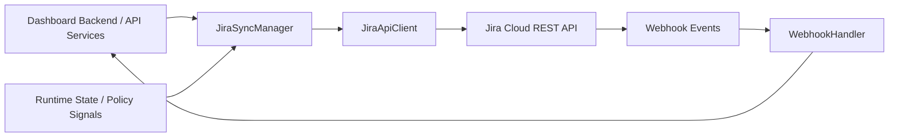
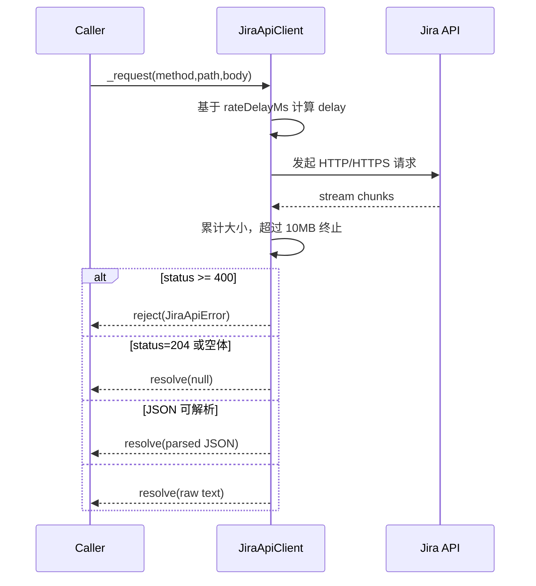
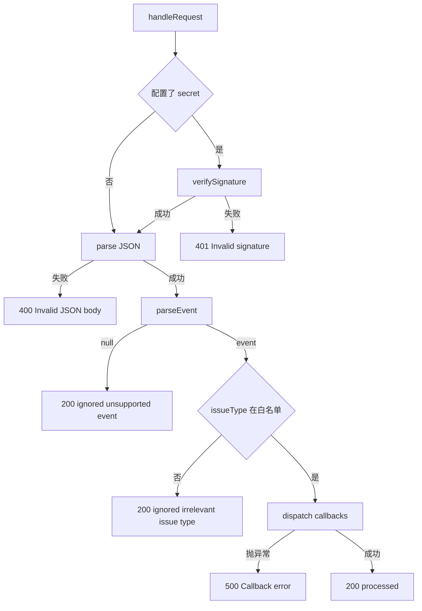
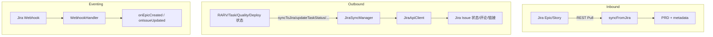

# jira_integration 模块文档

## 1. 模块定位与设计目标

`jira_integration` 是 `Integrations` 体系下用于对接 Jira Cloud 的专用适配模块，核心职责是把系统内部任务生命周期（尤其是 Epic/Story 相关流转）与 Jira 的 Issue 体系连接起来。它存在的原因并不只是“调用 Jira API”这么简单，而是要在两个模型之间建立稳定的语义桥梁：一方面把 Jira 的 Epic 与子任务结构拉取进系统并转换为内部可消费的 PRD 语义；另一方面把系统运行阶段、质量信号、部署产物等状态回写到 Jira，确保项目管理与执行现实保持一致。

该模块采用了非常典型的“三件套”设计：`JiraApiClient` 负责网络通信与协议细节，`JiraSyncManager` 负责业务语义同步，`WebhookHandler` 负责 Jira 侧事件入口。这样的分层让模块具备两个优势：第一，网络层和业务层解耦，便于替换、测试与扩展；第二，入站（Webhook）与出站（REST 回写）路径独立，降低了回路耦合风险。

---

## 2. 在整体系统中的位置

从模块树看，`jira_integration` 是 `Integrations` 的一个子模块，与 `linear_integration`、`chat_notification_integrations` 同级。它通常和以下系统模块协作：

- 任务/运行态来源通常来自 `Dashboard Backend`（可参考 [Dashboard Backend.md](Dashboard Backend.md)）或 `API Server & Services`（可参考 [API Server & Services.md](API Server & Services.md)）。
- 状态回写内容（如 phase、quality、deployment）常来自运行编排与策略执行链路（可参考 [Swarm Multi-Agent.md](Swarm Multi-Agent.md)、[Policy Engine.md](Policy Engine.md)）。
- 若以插件方式加载集成能力，可结合 [Plugin System.md](Plugin System.md)。



上图表达了一个闭环：系统将状态推送到 Jira，Jira 事件再回流系统形成触发器。`JiraSyncManager` 和 `WebhookHandler` 分别承担“出站语义适配”和“入站事件筛选”的角色。

---

## 3. 核心组件详解

## 3.1 `JiraApiClient`

`JiraApiClient` 是 Jira Cloud REST API v3 的薄封装客户端。它在实现上非常直接：使用 Node.js 原生 `http/https` 发请求，统一注入 `Authorization`、JSON Header，执行基础的请求节流、响应大小限制、超时与错误封装。

### 构造参数与内部状态

```js
new JiraApiClient({
  baseUrl: 'https://company.atlassian.net',
  email: 'user@example.com',
  apiToken: '***',
  rateDelayMs: 100,
})
```

- `baseUrl`：会被去掉末尾 `/`，避免路径拼接出现双斜杠。
- `email + apiToken`：拼成 Basic Auth，缓存为 `_authHeader`。
- `rateDelayMs`：最小请求间隔，默认 100ms。
- `_lastRequestTime`：用于简单节流的时间戳。

如果缺少 `baseUrl/email/apiToken`，构造函数直接抛错。

### 公开方法行为

- `getIssue(issueKey)`：读取单个 Issue。
- `searchIssues(jql, fields)`：POST `/search`，`maxResults` 固定为 `100`。
- `getEpicChildren(epicKey)`：先校验 key 格式（`^[A-Z][A-Z0-9_]+-\d+$`），再用 `"Epic Link" = "KEY"` 搜索。
- `createIssue(fields)` / `updateIssue(issueKey, fields)`：分别创建和更新。
- `addComment(issueKey, body)`：如果 `body` 是字符串，会自动包装为 Jira ADF 文档。
- `getTransitions(issueKey)` / `transitionIssue(issueKey, transitionId)`：查询并执行状态迁移。
- `addRemoteLink(issueKey, linkUrl, title)`：添加 Jira 远程链接。

### `_request` 内部流程



关键约束：

- 单次响应大小上限 10MB，超限会 `res.destroy(new Error(...))`。
- 请求超时 30 秒，触发 `Request timeout`。
- 对 `>=400` 的响应抛 `JiraApiError(status, message, response)`，其中 `message` 取原始响应前 300 字符。

### 错误模型

`JiraApiError` 是该客户端特有错误类型，字段包括：

- `name = 'JiraApiError'`
- `status`：HTTP 状态码
- `response`：完整原始响应（字符串）

这让上层可以按 `status` 做分支处理，而不是只依赖字符串匹配。

---

## 3.2 `JiraSyncManager`

`JiraSyncManager` 是该模块的业务中枢，负责“把 Jira 结构转内部语义”和“把内部状态转 Jira 操作”。它依赖注入 `apiClient`，因此可以和任意兼容接口的客户端实现配合。

### 构造参数

- `apiClient`：必填，通常为 `JiraApiClient`。
- `projectKey`：可选，创建子任务时用于补充 `fields.project`。

### 同步入口

#### 1) `syncFromJira(epicKey)`（入站拉取）

执行流程：

1. `getIssue(epicKey)` 拉取 Epic；
2. `getEpicChildren(epicKey)` 拉取子项；
3. 调用 `convertEpicToPrd(epic, children)` 生成 PRD 文本；
4. 调用 `generatePrdMetadata(epic)` 生成元数据；
5. 返回 `{ prd, metadata }`。

`convertEpicToPrd` 与 `generatePrdMetadata` 来自 `./epic-converter`，属于本模块外部依赖。文档中不重复其转换规则，建议在该组件文档中维护详细映射策略。

#### 2) `syncToJira(epicKey, rarvState)`（出站回写）

它把内部 `rarvState`（`phase/details/progress`）映射到 Jira：

- 若无 `rarvState.phase`，直接返回（无操作）。
- 通过 `mapLokiStatusToJira` 映射目标 Jira 状态。
- 状态可映射时执行 `_transitionToStatus`。
- 存在 `details` 时追加评论，评论包含 phase 与可选 progress。

### 其他业务方法

- `updateTaskStatus(issueKey, status, details)`：与 `syncToJira` 类似，但用于任意 Issue。
- `postQualityReport(issueKey, report)`：把质量报告以纯文本评论形式回写。
- `addDeploymentLink(issueKey, deployUrl, env)`：添加部署链接，标题形如 `Deployment (prod)`。
- `createSubTasks(parentKey, tasks)`：顺序创建 Jira Sub-task，返回创建出的 key 数组。

### 状态映射机制

```js
planning/building   -> In Progress
testing/reviewing   -> In Review
deployed/completed  -> Done
failed/blocked      -> Blocked
```

映射函数 `mapLokiStatusToJira` 会将输入转小写后查 `STATUS_MAP`。未命中返回 `null`，上层逻辑随即跳过状态迁移。

### `_transitionToStatus` 的行为细节

该方法先读取当前可用 transitions，再按以下条件匹配：

- `transition.name === targetStatus` 或
- `transition.to.name === targetStatus`

一旦命中，调用 `transitionIssue` 并返回。若没有任何可用迁移匹配，它会“静默结束”（不抛错、不返回错误码）。这在工程上很实用，但也意味着“同步成功”不一定代表状态已变更，建议上层增加审计日志或二次校验。

---

## 3.3 `WebhookHandler`

`WebhookHandler` 提供 Jira Webhook 的轻量处理入口，包含签名校验、事件解析、类型过滤和回调分发。

### 可配置项

```js
new WebhookHandler({
  secret: 'webhook-secret',
  onEpicCreated: (issue) => {},
  onIssueUpdated: (issue, changelog) => {},
  issueTypes: ['Epic', 'Story'],
})
```

- `secret`：配置后启用 HMAC-SHA256 校验。
- `onEpicCreated`：仅在 `jira:issue_created` 且类型 `Epic` 时触发。
- `onIssueUpdated`：在 `jira:issue_updated` 时触发。
- `issueTypes`：事件 issue type 白名单，默认 `Epic/Story`。

### 事件支持范围

`SUPPORTED_EVENTS = ['jira:issue_created', 'jira:issue_updated', 'sprint_started']`

`parseEvent` 只接受 `webhookEvent` 在上述列表内的 payload。

### 请求处理流程



### 签名校验实现细节

- Header 支持读取 `x-hub-signature` 或 `X-Hub-Signature`。
- 期望签名格式：`sha256=<hex>`。
- 比较时使用 `crypto.timingSafeEqual` 防止时序攻击。
- 若签名长度不同，直接判定失败。

---

## 4. 关键交互与数据流

## 4.1 双向同步总览



这张图强调了三条链路并行存在：拉取链路（Pull）、回写链路（Push）、事件链路（Webhook）。在实际部署中，通常会由调度任务触发 Pull，由运行时事件触发 Push，由 HTTP 入口处理 Webhook。

---

## 5. 使用与集成示例

## 5.1 基础初始化

```js
const { JiraApiClient } = require('./src/integrations/jira/api-client');
const { JiraSyncManager } = require('./src/integrations/jira/sync-manager');
const { WebhookHandler } = require('./src/integrations/jira/webhook-handler');

const jiraClient = new JiraApiClient({
  baseUrl: process.env.JIRA_BASE_URL,
  email: process.env.JIRA_EMAIL,
  apiToken: process.env.JIRA_API_TOKEN,
  rateDelayMs: 150,
});

const syncManager = new JiraSyncManager({
  apiClient: jiraClient,
  projectKey: process.env.JIRA_PROJECT_KEY,
});

const webhookHandler = new WebhookHandler({
  secret: process.env.JIRA_WEBHOOK_SECRET,
  onEpicCreated: (issue) => {
    // 建议将耗时任务入队，而不是阻塞 webhook 响应
    console.log('[jira] epic created', issue && issue.key);
  },
  onIssueUpdated: (issue, changelog) => {
    console.log('[jira] issue updated', issue && issue.key, !!changelog);
  },
});
```

## 5.2 在 HTTP 框架中处理 Webhook（保留 raw body）

```js
app.post('/webhooks/jira', rawBodyMiddleware, (req, res) => {
  // 注意：签名校验依赖“原始 body 字符串/字节”
  const { status, response } = webhookHandler.handleRequest(req.headers, req.rawBody);
  res.status(status).json(response);
});
```

如果你在中间件中先把 JSON 解析后再 stringify，签名可能不匹配（字段顺序/空白差异）。这是最常见集成坑之一。

## 5.3 状态回写示例

```js
await syncManager.syncToJira('PROJ-123', {
  phase: 'testing',
  progress: 80,
  details: 'E2E 测试完成，等待 Code Review',
});

await syncManager.postQualityReport('PROJ-123', {
  type: 'CI',
  summary: '主干构建通过，单测稳定',
  passed: 132,
  failed: 0,
  coverage: 87.5,
});

await syncManager.addDeploymentLink('PROJ-123', 'https://deploy.example.com/r/abc', 'staging');
```

---

## 6. 扩展点与二次开发建议

`jira_integration` 的扩展主要集中在三个方向。

第一，状态映射扩展。你可以在不改调用层的情况下扩充 `STATUS_MAP`，让内部更多 phase 与 Jira workflow 对齐。若组织里不同项目 workflow 差异明显，建议把映射抽成配置层（例如项目级映射）。

第二，Webhook 事件扩展。当前 `SUPPORTED_EVENTS` 很保守，可以按业务需要加入更多 Jira 事件（如 comment、issue deleted 等），并在 `handleRequest` 中增加对应分发。

第三，同步语义扩展。`syncFromJira` 依赖 `epic-converter`，你可以在该转换器中引入更丰富字段（components、labels、assignee、custom fields）并落到 PRD metadata。若涉及跨系统统一语义，可与 `Memory System` 文档中的结构约定保持一致（见 [Memory System.md](Memory System.md)）。

---

## 7. 边界条件、错误场景与限制

## 7.1 API 与网络层限制

- 客户端无自动重试机制。遇到 429/5xx 需要上层自行退避重试。
- `searchIssues` 固定 `maxResults=100`，不会自动翻页，数据量大时会截断。
- 响应体超过 10MB 会主动中断；超大查询需拆分。
- 超时固定 30s，慢网或大型实例可能频繁超时。

## 7.2 同步语义限制

- `getEpicChildren` 强制 Epic Key 正则大写格式，小写 key 会被提前拒绝。
- `_transitionToStatus` 找不到目标迁移时静默跳过，不抛错。
- `createSubTasks` 串行创建，任务多时吞吐较低但更稳。
- `syncToJira` 在没有 `phase` 时不做任何操作（包含不会写 comment）。

## 7.3 Webhook 处理限制

- 仅支持 `SUPPORTED_EVENTS` 中事件。
- `onEpicCreated` 只在 issue type 为 `Epic` 时调用。
- 回调是同步调用；如果回调是 async 且内部 Promise reject，当前 `try/catch` 可能捕获不到异步拒绝，建议回调内部自行 `.catch(...)` 或统一封装异步执行器。
- 签名头键名仅兼容 `x-hub-signature`/`X-Hub-Signature`；若 Jira 侧配置不同头，需扩展读取逻辑。

---

## 8. 运维与安全建议

生产环境建议把 `baseUrl/email/apiToken/webhook secret` 全部放入密钥管理系统，不写入仓库。对于 Webhook，必须启用签名验证并记录失败审计日志。对于高频同步场景，建议在上层增加队列与限流器，而不是并发直接打 Jira API，以免触发租户级 rate limit。

此外，建议配合 `Audit` 模块记录“谁在何时把什么状态同步到哪个 Issue”（见 [Audit.md](Audit.md)），并配合 `Observability` 模块打点请求耗时与失败率（见 [Observability.md](Observability.md)）。

---

## 9. 与其他文档的关系

本文仅覆盖 `jira_integration` 三个核心组件，不重复以下内容：

- 平台级集成总览见 [Integrations.md](Integrations.md)
- 插件化扩展机制见 [Plugin System.md](Plugin System.md)
- 任务与运行数据来源见 [Dashboard Backend.md](Dashboard Backend.md)、[API Server & Services.md](API Server & Services.md)

如果你正在做“从 Jira 触发自动运行，再回写结果”的全链路实现，建议按上述文档顺序阅读。
