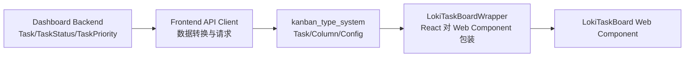
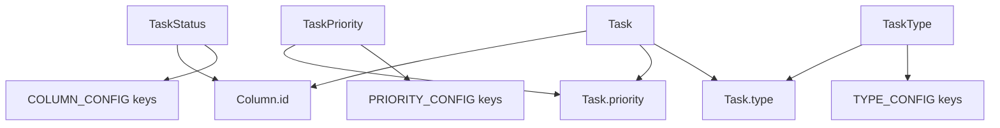
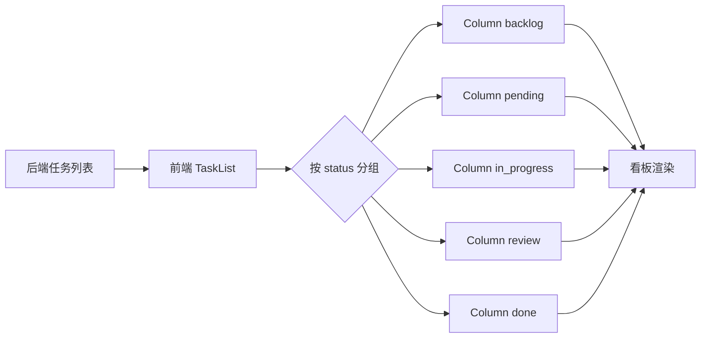

# kanban_type_system 模块文档

## 1. 模块简介与设计动机

`kanban_type_system` 对应 `dashboard/frontend/src/components/types.ts`，是 Dashboard Frontend 中任务看板（Kanban board）的**核心类型契约层**。它的职责不是发请求、也不是渲染 UI，而是用一组稳定且可组合的 TypeScript 类型与配置对象，把“任务是什么、任务如何流转、任务如何呈现”统一起来。

这个模块存在的根本原因，是在多层系统（Dashboard Backend、Frontend API 客户端、Web Component 包装器、UI 组件）之间建立一个前端侧的“共享语义中心”。如果没有这层类型系统，任务状态值、优先级值、颜色映射、列结构很容易在不同组件中被重复定义，最终导致字段命名漂移、状态不一致、拖拽后分组错误、UI 显示与业务状态脱节等问题。

从设计上看，该模块采用了“**离散枚举语义 + 结构化实体 + 显示配置映射**”三段式方案：

1. 使用字符串联合类型（`TaskStatus` / `TaskPriority` / `TaskType`）锁定合法值集合；
2. 使用实体接口（`Task` / `Column`）定义业务对象结构；
3. 使用 `Record<Union, Config>`（`COLUMN_CONFIG` / `PRIORITY_CONFIG` / `TYPE_CONFIG`）把业务值映射到显示文案和样式。

这一方案的优势是：编译期类型安全、运行时结构清晰、扩展点集中、UI 显示一致性强。

---

## 2. 在整体系统中的位置

`kanban_type_system` 位于 **Dashboard Frontend** 的组件类型层，向上支撑 React/Wrapper 组件，向下承接 API 返回的任务数据。



上图反映了典型链路：后端返回任务数据，经 API 客户端进入前端，前端使用 `kanban_type_system` 做统一建模，再由 `LokiTaskBoardWrapper` 和 UI 组件消费。模块本身不直接依赖网络层，但它决定了上层渲染和交互逻辑是否稳定。

若想了解上下游细节，可参考：
- [Dashboard Frontend.md](Dashboard Frontend.md)
- [API 客户端.md](API 客户端.md)
- [Web Component 包装器.md](Web Component 包装器.md)
- [Dashboard Backend.md](Dashboard Backend.md)

---

## 3. 核心组件详解

> 本模块在模块树里标注的核心组件是 `Column`，但其行为依赖于同文件中的类型和配置，因此这里一并说明。

### 3.1 `TaskStatus`

```ts
export type TaskStatus = 'backlog' | 'pending' | 'in_progress' | 'review' | 'done';
```

`TaskStatus` 定义了任务在 Kanban 流程中的合法状态集合。该集合与后端 `dashboard.models.TaskStatus` 的值保持一致（`backlog/pending/in_progress/review/done`），是前后端状态协同的关键。

设计上使用字符串联合类型而不是 `enum`，可以获得更轻量的 TS 推断与更直观的 JSON 兼容性；代价是运行时没有自动枚举对象，需要开发者自己管理常量来源（通常由配置对象承担）。

### 3.2 `TaskPriority`

```ts
export type TaskPriority = 'critical' | 'high' | 'medium' | 'low';
```

该类型定义任务紧急程度。前端渲染中通常通过 `PRIORITY_CONFIG` 映射到 badge 文案与配色，后端也有同语义值（`dashboard.models.TaskPriority`），因此它兼具业务意义和显示意义。

### 3.3 `TaskType`

```ts
export type TaskType = 'feature' | 'bug' | 'chore' | 'docs' | 'test';
```

`TaskType` 用于描述任务性质，主要用于分类显示、筛选、统计和标记。它是 UI 分类的稳定锚点，也可作为后续策略扩展（比如不同类型默认 SLA）的输入字段。

### 3.4 `Task` 接口

```ts
export interface Task {
  id: string;
  title: string;
  description: string;
  status: TaskStatus;
  priority: TaskPriority;
  type: TaskType;
  assignee?: string;
  createdAt: string;
  updatedAt: string;
  tags?: string[];
  estimatedHours?: number;
  completedAt?: string;
}
```

`Task` 是前端看板的核心实体模型。必填字段覆盖任务最小闭环（标识、标题、状态、优先级、类型、时间戳），可选字段支持增强能力（负责人、标签、预估时长、完成时间）。

注意这里的时间字段是字符串（通常 ISO 8601），而不是 `Date`。这是为了保持与 API 传输格式一致，避免序列化歧义。显示层如果要格式化，应在消费时再转换。

### 3.5 `Column` 接口（核心组件）

```ts
export interface Column {
  id: TaskStatus;
  title: string;
  tasks: Task[];
}
```

`Column` 定义了看板列的结构，是任务分组后的直接渲染输入。其关键点在于 `id: TaskStatus`，这保证了“列标识”与“任务状态”是一一对应的，不会出现任意字符串列名导致的分组错位。

`Column` 的典型使用方式是：
1. 根据固定状态集合初始化空列；
2. 按 `task.status` 把任务放入对应列；
3. 渲染列标题与列内任务卡片。

### 3.6 `COLUMN_CONFIG`

```ts
export const COLUMN_CONFIG: Record<TaskStatus, { title: string; color: string }> = { ... }
```

`COLUMN_CONFIG` 是列级显示配置。`Record<TaskStatus, ...>` 强制每个合法状态都必须有配置项，编译期即可发现遗漏。`color` 采用 Tailwind class（含 dark mode），保证浅色/深色主题下的看板列视觉统一。

### 3.7 `PRIORITY_CONFIG`

```ts
export const PRIORITY_CONFIG: Record<TaskPriority, { label: string; color: string; bgColor: string }> = { ... }
```

优先级配置负责把业务等级映射到展示标签与样式，典型用于任务卡片右上角或列表标签。`label` 便于 UI 文案统一，`color/bgColor` 可直接拼接到 className。

### 3.8 `TYPE_CONFIG`

```ts
export const TYPE_CONFIG: Record<TaskType, { label: string; color: string; bgColor: string }> = { ... }
```

与优先级配置类似，但面向任务类型维度。它使“类型语义”与“颜色体系”保持稳定关系，避免在多个组件里散落 `if/else` 的样式判断逻辑。

---

## 4. 组件关系与内部工作机制

### 4.1 类型与配置之间的约束关系



该关系图体现了本模块的核心机制：联合类型定义“值域”，接口定义“对象结构”，配置对象定义“显示映射”。三者互相约束，形成一个闭环。开发者一旦修改联合类型，相关接口和配置会被 TS 编译器连锁校验，从而降低隐藏不一致风险。

### 4.2 任务分列流程（渲染前数据准备）



在实际流程中，`Column` 不是持久化实体，而是“渲染前聚合视图模型”。它通常由 `Task[]` 动态计算得出。这样做避免了状态双写（既改任务又改列）带来的不一致。

---

## 5. 与其他模块的语义对齐

该模块虽然位于前端，但与后端数据契约紧密相关：

- 后端 `dashboard.models.TaskStatus` 与这里的 `TaskStatus` 值必须一致；
- 后端 `dashboard.models.TaskPriority` 与这里的 `TaskPriority` 值必须一致；
- 后端 `dashboard.server.TaskResponse` 使用 snake_case 与数值 `id`，前端 `Task` 使用 camelCase 与字符串 `id`，中间通常由 API 客户端做转换。

也就是说，`kanban_type_system` 是“前端内部统一模型”，而不是后端 DTO 的原样拷贝。这种设计有利于前端组件简化，但要求 API 层承担格式适配责任。

---

## 6. 使用与实践示例

### 6.1 初始化列（推荐写法）

```ts
import { Column, TaskStatus, COLUMN_CONFIG } from './components/types';

const STATUS_ORDER: TaskStatus[] = ['backlog', 'pending', 'in_progress', 'review', 'done'];

export function createEmptyColumns(): Column[] {
  return STATUS_ORDER.map((status) => ({
    id: status,
    title: COLUMN_CONFIG[status].title,
    tasks: [],
  }));
}
```

这里显式定义 `STATUS_ORDER`，可避免 `Object.keys()` 的键顺序和类型断言问题。

### 6.2 按状态分组任务

```ts
import { Task, Column, TaskStatus, COLUMN_CONFIG } from './components/types';

const STATUS_ORDER: TaskStatus[] = ['backlog', 'pending', 'in_progress', 'review', 'done'];

export function groupTasks(tasks: Task[]): Column[] {
  const bucket: Record<TaskStatus, Task[]> = {
    backlog: [],
    pending: [],
    in_progress: [],
    review: [],
    done: [],
  };

  for (const task of tasks) {
    bucket[task.status].push(task);
  }

  return STATUS_ORDER.map((status) => ({
    id: status,
    title: COLUMN_CONFIG[status].title,
    tasks: bucket[status],
  }));
}
```

### 6.3 渲染优先级与类型标签

```tsx
import { PRIORITY_CONFIG, TYPE_CONFIG, Task } from './components/types';

function TaskBadges({ task }: { task: Task }) {
  const priority = PRIORITY_CONFIG[task.priority];
  const type = TYPE_CONFIG[task.type];

  return (
    <>
      <span className={`${priority.color} ${priority.bgColor} px-2 py-0.5 rounded`}>{priority.label}</span>
      <span className={`${type.color} ${type.bgColor} px-2 py-0.5 rounded ml-2`}>{type.label}</span>
    </>
  );
}
```

### 6.4 API 返回到前端模型的转换（示意）

```ts
// 后端 TaskResponse（示意）-> 前端 Task
function fromTaskResponse(dto: any): Task {
  return {
    id: String(dto.id),
    title: dto.title,
    description: dto.description ?? '',
    status: dto.status,
    priority: dto.priority,
    type: inferTaskType(dto), // 若后端暂未提供 type，可在前端做回退策略
    assignee: dto.assigned_agent_id ? String(dto.assigned_agent_id) : undefined,
    createdAt: dto.created_at,
    updatedAt: dto.updated_at,
    completedAt: dto.completed_at ?? undefined,
  };
}
```

---

## 7. 扩展与演进指南

### 7.1 扩展任务状态

新增状态（例如 `blocked`）时，需要同时更新：

1. `TaskStatus` 联合类型；
2. `COLUMN_CONFIG`（必须新增键）；
3. 所有状态顺序数组（如 `STATUS_ORDER`）；
4. 分组初始化逻辑（`Record<TaskStatus, Task[]>` 初值）；
5. 与后端 `TaskStatus` 的枚举对齐；
6. 涉及状态机流转的 UI/交互规则。

如果只改了类型没改配置，TS 会在 `Record` 处直接报错；如果只改了前端没改后端，会在 API 数据交互阶段出现非法值或状态丢失。

### 7.2 扩展优先级或任务类型

优先级和类型扩展也应遵循“联合类型 + 配置对象 + 过滤器/统计逻辑同步更新”的三步策略。尤其是统计组件和筛选器，常常会硬编码旧值列表，是最容易漏改的地方。

### 7.3 国际化与主题化建议

当前 `label/title` 为英文。若系统要 i18n，建议把配置对象从静态文案改为 i18n key（如 `task.priority.critical`），在渲染层再调用翻译函数。主题方面可以保留语义 token（如 `priority-critical-bg`）再由设计系统映射为 Tailwind 类，减少跨组件散落的 class 字符串。

---

## 8. 边界条件、错误场景与已知限制

### 8.1 编译期安全不等于运行时安全

该模块的类型约束仅在 TS 编译阶段生效。运行时若后端返回非法字符串（例如 `status: "archived"`），代码仍可能进入异常路径。建议在 API 层做运行时校验（如 zod/io-ts）后再注入 `Task`。

### 8.2 字段语义差异风险

前端 `Task.id` 是 `string`，后端常为 `number`；前端是 `createdAt`，后端是 `created_at`。若转换层缺失或不一致，会出现：

- React key 不稳定（数字/字符串混用）；
- 更新时间显示异常（字段名不匹配导致空值）；
- 拖拽提交时 ID 类型不符合接口预期。

### 8.3 `TaskType` 可能无后端强约束

从已知后端 `TaskResponse` 看，并不总是包含 `type` 字段。因此前端可能需要默认推断或回退值（例如统一设为 `chore`）。若不处理，UI 渲染 `TYPE_CONFIG[task.type]` 时会出现 `undefined` 访问。

### 8.4 样式依赖 Tailwind

配置对象中的 `color/bgColor` 是 Tailwind class。若构建链未启用对应 safelist 或 class 生成策略，动态 class 可能被 tree-shaking，导致线上样式丢失。

### 8.5 列顺序不可仅依赖对象遍历

`COLUMN_CONFIG` 是对象映射，不应天然作为“显示顺序来源”。建议显式维护顺序数组（`STATUS_ORDER`），确保不同运行环境与重构过程中顺序稳定。

---

## 9. 可维护性建议

为了让 `kanban_type_system` 在多人协作中保持稳定，建议把下面几条作为团队约定：

- 任何新增/删除状态、优先级、类型都必须附带配置更新与 API 对齐说明；
- 在 CI 增加“后端枚举与前端联合类型一致性”测试（可通过契约快照或共享 schema）；
- 在 API 层引入运行时校验，避免脏数据直接进入组件层；
- 为分组函数和配置覆盖率添加单元测试，确保每个合法值都有可渲染路径。

---

## 10. 参考文档

- [Dashboard Frontend.md](Dashboard Frontend.md)：前端整体架构与模块分层
- [API 客户端.md](API 客户端.md)：后端 DTO 到前端模型的转换位置
- [Web Component 包装器.md](Web Component 包装器.md)：`LokiTaskBoardWrapper` 等消费方式
- [Dashboard Backend.md](Dashboard Backend.md)：`TaskStatus/TaskPriority/TaskResponse` 来源
- [Dashboard UI Components.md](Dashboard UI Components.md)：`loki-task-board` 的渲染与交互上下文
