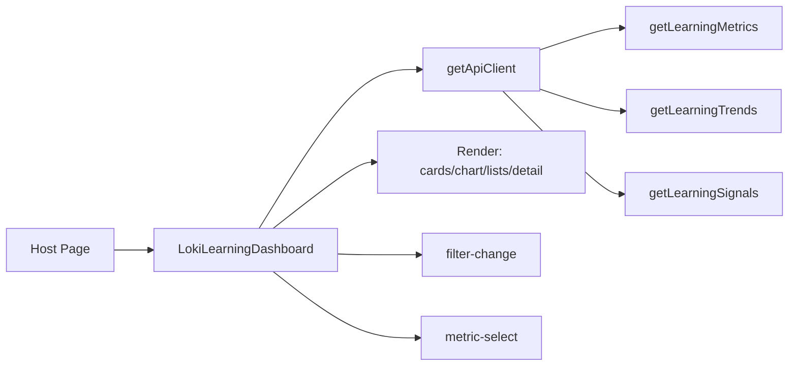

# learning_dashboard 模块深度解析

`learning_dashboard`（实现类：`LokiLearningDashboard`）的存在意义，可以用一句话概括：**把分散的 learning API 结果，压缩成一个可以“看趋势、看结构、看细节”的统一观察面**。如果没有它，调用方需要自己拼接 `metrics`、`trends`、`signals` 三类接口，还要处理筛选联动、局部失败、列表到详情的下钻逻辑。这个模块把这些“胶水层复杂度”内聚在一个 Web Component 里，让上层只需放一个 `<loki-learning-dashboard>` 就能消费学习系统的核心洞察。

## 架构角色与心智模型

从架构角色看，它是一个**前端编排器（orchestrator）+ 领域可视化器**，而不是纯展示组件。你可以把它想象成“塔台”：

- `getLearningMetrics` 像全局雷达（总体态势）
- `getLearningTrends` 像时间轴雷达（变化趋势）
- `getLearningSignals` 像事件流监控（近期动态）

组件把这三路信号合成一个可操作的控制面板，再把用户动作通过 `CustomEvent` 往外广播。



这里最关键的设计点是：**组件内部维护筛选状态和数据状态，上层只负责声明属性或监听事件**。这使它在不同宿主里可复用，不需要宿主理解 learning 数据拼装细节。

## 数据如何流动（端到端）

启动链路从 `connectedCallback()` 开始：组件读取 `time-range`、`signal-type`、`source` 属性，调用 `_setupApi()` 创建客户端，然后 `_loadData()` 拉数据。

`_loadData()` 会并行发起三个请求（`Promise.all`）：

- `this._api.getLearningMetrics(params)`
- `this._api.getLearningTrends(params)`
- `this._api.getLearningSignals({ ...params, limit: 50 })`

并且每个子请求都有 `.catch()` 兜底，这意味着“部分失败不致命”：例如趋势失败时，摘要和近期信号仍可渲染。成功后写入 `_metrics/_trends/_signals`，再 `render()`。

用户交互链路有两条：

第一条是筛选变化。`_attachEventListeners()` 给三个 `<select>` 绑定 `change`，进入 `_setFilter()`。`_setFilter()` 更新内部状态与 attribute，触发 `filter-change` 事件，再 `_loadData()` 刷新。

第二条是指标下钻。用户点击 `.list-item`，组件用 `data-type + data-id` 调 `_findItemData()` 从聚合数组里找原始对象，然后 `_selectMetric()` 打开详情面板并触发 `metric-select`。

## 组件深潜：关键函数为什么这样写

`observedAttributes()` 监听 `api-url/theme/time-range/signal-type/source`，核心意图是让组件支持“声明式外部驱动”。也就是宿主可以只改 DOM 属性，不需要调用组件私有 API。

`_setupApi()` 通过 `getApiClient({ baseUrl })` 初始化访问层，默认 `window.location.origin`。这是一种典型“本地默认 + 可覆盖”的部署友好策略，开发/嵌入场景都可用。

`_loadData()` 是模块的主编排函数。它先置 `_loading` 并立即渲染 loading 态，完成后再渲染结果。这个“双 render”做法牺牲了一些重绘成本，换来更直接的用户反馈与状态可读性。

`_renderTrendChart()` 选择原生 SVG 而不是图表库，体现了“轻依赖”取舍：逻辑更可控、包体更轻，但图表交互能力有限（目前只有静态折线/面积/点）。另外它通过 `(maxValue || 1)` 和 `(dataPoints.length - 1 || 1)` 防止除零，是对小数据集的鲁棒处理。

`_escapeHtml()` 在列表与详情里统一处理文本字段，避免把后端字符串直接注入 HTML。对于这个模块很重要，因为展示的数据包含 `common_messages`、`resolutions`、`pattern_name` 等可变文本。

`_findItemData(type, id)` 明确绑定四种类型与对应主键：

- `preference` -> `preference_key`
- `error_pattern` -> `error_type`
- `success_pattern` -> `pattern_name`
- `tool_efficiency` -> `tool_name`

这使“列表项点击”到“详情对象”之间有稳定映射，但也隐含前提：这些字段在各自数组内应唯一。

## 依赖关系与契约分析

这个模块直接依赖两块能力：

一块是 UI 基类 `LokiElement`（来自 `../core/loki-theme.js`），提供主题体系和基础样式能力。模块通过 `getBaseStyles()` 与 `theme` 属性联动继承这套视觉契约。

另一块是 `getApiClient`（来自 `../core/loki-api-client.js`），并通过返回对象调用 `getLearningMetrics/getLearningTrends/getLearningSignals`。这三者构成模块最重要的数据契约：

- `metrics` 里至少要有 `totalSignals/signalsByType/signalsBySource/avgConfidence/aggregation`
- `trends` 里要有 `dataPoints/maxValue/period`
- `signals` 每项至少可回退出 `type/action/source/outcome/timestamp`

这个模块对“谁调用它”耦合非常低：任何页面只要能插入自定义元素即可。但它对“learning API 字段结构”耦合较高，字段语义变化会直接影响展示正确性。

## 设计取舍与非显式决策

最明显的取舍是**正确性与可用性的平衡**：请求层采取“局部容错”，优先保持页面可用，而不是全有或全无。好处是稳定，代价是有时用户看到的是部分数据且没有细粒度错误提示。

第二个取舍是**简单状态机 vs 强一致并发控制**。当前没有 request cancellation 或 request versioning；多次快速筛选时，旧请求晚到可能覆盖新状态。这让实现简单，但在高延迟环境下可能出现“数据回跳”。

第三个取舍是**纯字符串模板渲染 vs 组件化拆分**。全部 UI 在单类内完成，读起来集中、迁移方便；但随着视图继续扩展，单文件复杂度会快速上升，测试粒度也更粗。

## 新贡献者最该注意的坑

首先是重复加载风险。`_setFilter()` 里会 `setAttribute(...)`，而 attribute 变化又会触发 `attributeChangedCallback()`，该回调也会 `_loadData()`。再加上 `_setFilter()` 自己也调用 `_loadData()`，一次筛选可能触发两轮请求。

其次是竞态覆盖。`_loadData()` 无“latest-wins”保护，旧请求慢返回时可能覆盖新筛选数据。如果你要优化稳定性，优先考虑引入请求序号或 `AbortController`。

再者是详情面板一致性。筛选变更后 `_selectedMetric` 不会自动清空，可能短暂展示与当前列表不一致的旧对象。

最后是事件监听生命周期。组件每次 `render()` 后都会重新绑定监听；因为 DOM 整体重建，旧监听会随旧节点释放，通常不会泄漏。但如果将来改为局部 patch 渲染，需要重新审视监听去重策略。

## 使用方式与扩展示例

基础用法：

```html
<loki-learning-dashboard
  api-url="http://localhost:57374"
  theme="dark"
  time-range="7d"
  signal-type="all"
  source="all">
</loki-learning-dashboard>
```

监听组件事件：

```javascript
const el = document.querySelector('loki-learning-dashboard');

el.addEventListener('filter-change', (e) => {
  console.log('filters changed:', e.detail);
});

el.addEventListener('metric-select', (e) => {
  console.log('selected metric:', e.detail.type, e.detail.item);
});
```

如果你要新增一种聚合类型（例如新的 signal family），当前代码需要同步改动 `SIGNAL_TYPES`、`_renderTopLists()`、`_renderDetailPanel()`、`_findItemData()` 四处。这是明确的扩展点，也是当前实现的维护成本来源。

## 已知边界与运行约束

- 空数据可渲染：没有 `metrics/trends/signals` 时会显示对应 empty state。
- 百分比字段假设是 0~1 小数（`_formatPercent(num * 100)`）。如果后端改为 0~100，显示会失真。
- `toLocaleTimeString()/toLocaleDateString()` 受运行环境 locale 影响，跨时区/跨语言展示不完全一致。
- `getLearningSignals` 固定 `limit: 50`，UI 仅展示前 10 条，这是刻意“近期窗口”而非完整历史浏览。

## 参考文档

- [Memory and Learning Components](Memory and Learning Components.md)
- [Dashboard UI Components](Dashboard UI Components.md)
- [Core Theme](Core Theme.md)
- [Unified Styles](Unified Styles.md)
- [API 客户端](API 客户端.md)
