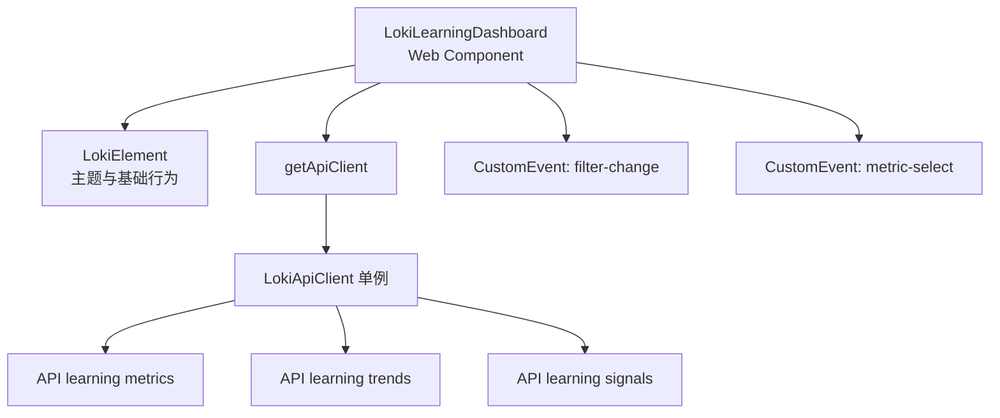
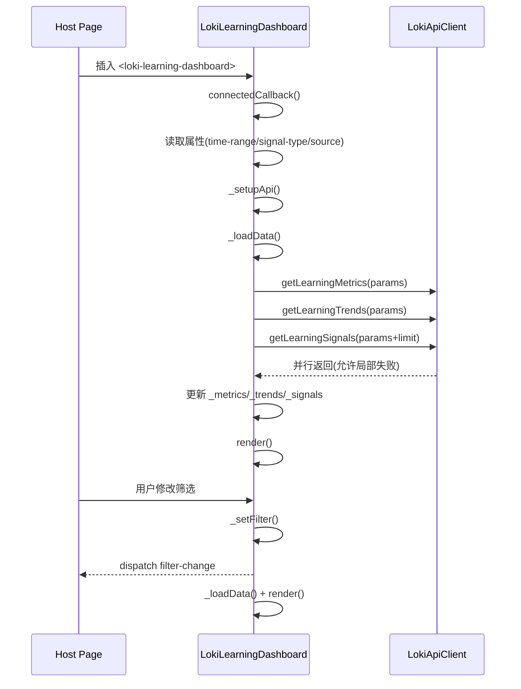
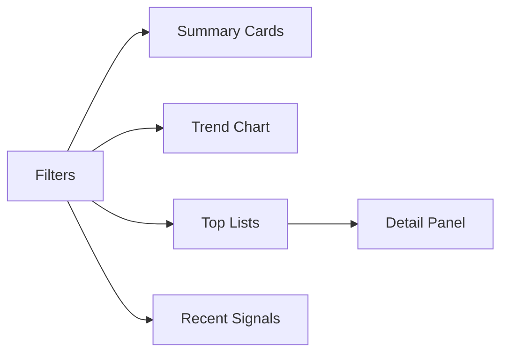
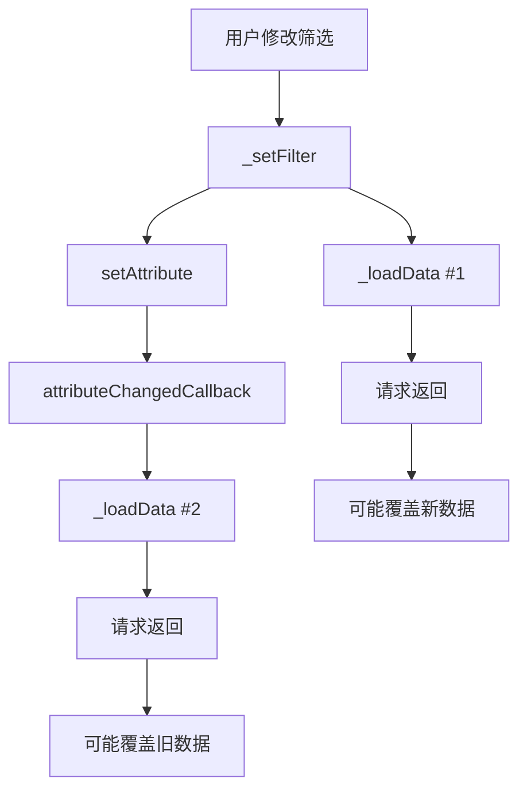
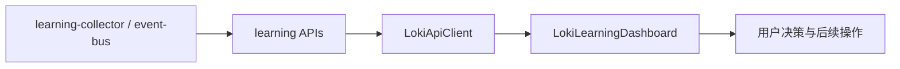

# learning_dashboard_component 模块文档

## 概述

`learning_dashboard_component` 对应的核心实现是 Web Component：`<loki-learning-dashboard>`（类名 `LokiLearningDashboard`）。它的职责是把跨工具学习系统产生的学习信号（learning signals）转换成可读、可筛选、可钻取的可视化面板，帮助开发者快速回答三个问题：**最近系统学到了什么、这些学习是否可靠、以及哪些模式值得进一步行动**。

从设计上看，这个组件不是“通用图表容器”，而是一个带有领域语义的仪表盘。它将后端学习聚合结果分成四层视图：摘要卡片、趋势图、模式排行榜和近期信号流，并且通过右侧详情面板支持从“统计”下钻到“具体模式对象”。这种结构让使用者在同一个组件内完成从宏观观测到微观分析的闭环，而不需要频繁切换页面。

在系统定位上，它属于 `Dashboard UI Components -> Memory and Learning Components -> learning_dashboard_component`，并与 `memory_browser_component`、`prompt_optimizer_component` 形成互补：前者偏“记忆内容浏览”，后者偏“提示词优化执行”，而当前组件偏“学习信号可观测性与聚合洞察”。

---

## 模块目标与存在价值

`LokiLearningDashboard` 存在的直接原因，是将后端 `/api/learning/*` 的多类接口统一编排为一个业务视图。后端接口本身提供了指标、趋势与信号列表，但如果调用方自己拼接，会面临三类成本：筛选参数联动、并行请求容错、以及多种聚合对象的 UI 呈现规则。该组件将这些成本内聚在前端层，输出标准化体验。

更深层的价值是，它把“学习系统是否在进化”这个抽象问题变成可验证信号：总量、来源分布、成功/错误模式、工具效率、置信度、时序变化等。这些指标不仅用于观察，也可以作为后续策略引擎、人工审查或提示优化的输入依据。

---

## 组件关系与架构



该架构体现了三个关键分层。第一层是 UI 组件自身，负责状态管理和渲染。第二层是基础设施继承链，`LokiElement` 提供主题、基础样式和键盘处理能力。第三层是数据访问层，组件通过 `getApiClient` 获取 `LokiApiClient` 实例，并调用 learning API。组件对外通过 DOM 事件暴露交互结果，而不是直接耦合上层业务逻辑，这使得它能在纯 HTML、Dashboard 前端壳、甚至 WebView 场景中复用。

---

## 生命周期与内部工作流



组件在 `connectedCallback` 中立即拉取数据，且每次筛选变化都会重新加载。数据加载采用 `Promise.all` 并行请求，同时对子请求使用 `.catch(() => fallback)`，这意味着某个接口失败不会拖垮整体展示，例如趋势接口失败时仍可显示摘要卡与近期信号。

---

## 核心类：`LokiLearningDashboard`

### 类职责

`LokiLearningDashboard` 是一个基于 Shadow DOM 的自定义元素，负责：

- 管理筛选状态（时间范围、信号类型、来源）
- 请求学习指标、趋势与近期信号
- 渲染统计卡片、SVG 趋势图、Top 列表、详情面板
- 通过 `filter-change` 和 `metric-select` 事件向外广播用户行为

### 继承行为（来自 `LokiElement`）

组件继承的能力主要包括主题应用与基础样式注入。`LokiElement` 会在连接时自动调用 `_applyTheme()` 并执行 `render()`。这对当前组件有两个影响：一是主题切换可即时反映；二是组件自己的 `render()` 必须是幂等的（可反复执行且不依赖旧 DOM 引用）。

可参考：[`Core Theme.md`](Core Theme.md)、[`Unified Styles.md`](Unified Styles.md)

---

## 属性、状态与事件契约

### 可观察属性（observedAttributes）

组件监听以下属性：`api-url`、`theme`、`time-range`、`signal-type`、`source`。

其中 `api-url` 变更时会重设客户端 baseUrl 并重新加载数据；`theme` 变更仅触发主题应用；其余筛选属性变更会直接触发数据刷新。这种实现让组件可被外部容器“声明式驱动”，例如通过设置 DOM 属性来远程控制筛选条件。

### 内部状态

- `_loading`：请求中标志
- `_error`：错误消息（字符串）
- `_api`：`LokiApiClient` 实例
- `_timeRange/_signalType/_source`：筛选状态
- `_metrics/_trends/_signals`：数据载荷
- `_selectedMetric`：详情面板当前对象

### 自定义事件

- `filter-change`：当筛选变化时触发，`detail` 含 `timeRange`、`signalType`、`source`
- `metric-select`：当用户点击列表项时触发，`detail` 含 `type` 与完整 `item`

事件采用 `dispatchEvent(new CustomEvent(...))`，默认未设置 `bubbles/composed`，因此监听方通常应直接绑定在组件实例本身。

---

## 数据接口与隐式数据模型

组件通过 `LokiApiClient` 使用以下接口：

- `getLearningMetrics(params)` -> `/api/learning/metrics`
- `getLearningTrends(params)` -> `/api/learning/trends`
- `getLearningSignals({ ...params, limit: 50 })` -> `/api/learning/signals`

虽然没有在此文件里定义 TypeScript 类型，但渲染逻辑隐含了字段契约。

### `metrics` 结构（关键字段）

- `totalSignals`
- `signalsByType: Record<string, number>`
- `signalsBySource: Record<string, number>`
- `avgConfidence: number`（0~1）
- `aggregation`：
  - `preferences[]`（如 `preference_key`, `preferred_value`, `frequency`, `confidence`）
  - `error_patterns[]`（如 `error_type`, `resolution_rate`, `common_messages`）
  - `success_patterns[]`（如 `pattern_name`, `avg_duration_seconds`）
  - `tool_efficiencies[]`（如 `tool_name`, `efficiency_score`, `success_rate`, `avg_execution_time_ms`）

### `trends` 结构（关键字段）

- `dataPoints[]`：每个点含 `count`, `label`
- `maxValue`
- `period`

### `signals` 结构（关键字段）

每个信号对象优先取 `s.data` 子对象，兼容扁平字段回退：`type`, `action`, `source`, `outcome`, `timestamp`。

> 说明：这是“宽松读取”策略，能够兼容后端字段演进，但也意味着如果字段命名变化过大，UI 会降级到 `-` 或 `unknown`，不会抛出硬错误。

可参考 API 细节：[`API 客户端.md`](API 客户端.md)

---

## 渲染分区与交互细节



该组件的布局是“筛选驱动 + 内容主区 + 可选详情侧栏”。主区始终由四块组成，详情面板只有在用户选择某个 top list 条目时出现。

### 1) Filters

过滤器由三个 `<select>` 与一个刷新按钮组成，选项来源于常量：`TIME_RANGES`、`SIGNAL_TYPES`、`SIGNAL_SOURCES`。`_setFilter()` 会同时更新内部状态和对应 DOM attribute，再触发事件与加载数据。这里的实现使“内部交互”与“外部属性驱动”保持一致。

### 2) Summary Cards

摘要卡聚焦总体观测：信号总量、来源分布、模式数量、平均置信度。卡片支持空数据回退（`No metrics available`），并尽可能使用 `||` 默认值避免渲染异常。

### 3) Trend Chart（SVG）

趋势图使用原生 SVG 动态计算折线点位与面积填充，避免依赖外部图表库。实现中通过 `(maxValue || 1)` 和 `(dataPoints.length - 1 || 1)` 防止除零。该策略在单点数据或空值场景下能保持稳定。

### 4) Top Lists

四个列表分别展示偏好、错误模式、成功模式、工具效率，默认只显示前 5 项（`slice(0, 5)`）。每项都带 `data-type` 和 `data-id`，点击后通过 `_findItemData()` 回查原对象并打开详情。

### 5) Recent Signals

近期信号默认展示前 10 条。字段解析支持多层回退，时间通过 `toLocaleTimeString()` 本地化显示。此区强调“最近发生了什么”，不是完整历史分页视图。

### 6) Detail Panel

详情面板根据 `type` 分支渲染不同字段，包含来源标签、首次/最近出现时间。内容文本统一经过 `_escapeHtml`，降低 XSS 风险。

---

## 方法级说明（重点）

### `_loadData(): Promise<void>`

这是组件数据编排中心。它先置 `_loading=true` 并渲染 loading，再并行拉取三组数据。每个请求都带局部兜底，使得最终页面可以“部分可用”。如果外围 `try` 捕获异常，会在 `_error` 中显示错误信息。完成后统一关闭 loading 并重渲染。

副作用包括：触发两次 `render()`、覆盖 `_metrics/_trends/_signals`、可能更新 `_error`。

### `_setFilter(filterType, value)`

用于把 UI 交互转化为组件状态变化。它会更新内部字段、同步 attribute、派发 `filter-change`，并主动调用 `_loadData()`。由于 `setAttribute` 也会触发 `attributeChangedCallback`，这里存在**重复加载风险**（见后文“已知限制”）。

### `_selectMetric(type, item)` 与 `_closeDetail()`

前者设置 `_selectedMetric` 并派发 `metric-select`；后者清空选择。两者都只做本地渲染，不触发网络请求。

### `_findItemData(type, id)`

根据列表项 `data-type/data-id` 回查聚合对象，支持四类类型。它要求 `id` 在各类型内是可唯一定位的键（如 `preference_key`、`tool_name`）。若后端返回重复键，详情面板可能匹配到首个对象。

### 格式化与安全辅助方法

`_formatNumber`、`_formatPercent`、`_formatDuration` 用于统一展示格式。`_escapeHtml` 使用 DOM textContent 转义，适合用户可控文本场景，降低注入风险。

---

## 并发行为、状态一致性与请求竞态

这个组件采用“属性驱动 + 主动触发加载”的混合模式，带来了一个典型前端竞态问题：当用户连续快速切换筛选器时，前一次 `_loadData()` 尚未完成，后一次请求已经发出。当前实现没有 request id 或 abort 机制，因此较慢返回的旧请求理论上可能覆盖较新筛选条件下的数据。这一行为在高延迟网络、后端缓存 miss 或跨地域部署时更容易出现。

从维护角度看，建议在后续版本中为 `_loadData()` 引入“最后请求优先（latest-wins）”策略。常见做法是在组件内维护递增序号 `this._requestSeq`，每次请求记录本地 seq，回包后先比较 seq 是否仍是最新，再决定是否写入 `_metrics/_trends/_signals`。如果 API 客户端支持 `AbortController`，也可以在新请求发起前主动取消旧请求。

另一个一致性细节是 `_selectedMetric` 与 `_metrics` 的耦合：筛选变化后，旧的 `_selectedMetric` 可能不再存在于新数据集中，但当前实现不会自动关闭详情面板。这不是错误，但会出现“详情展示对象与当前列表不一致”的短暂体验。若你希望更严格一致，可在 `_loadData()` 成功后校验 `_selectedMetric` 是否仍能通过 `_findItemData()` 命中，不命中则自动 `_closeDetail()`。



上图展示的是“重复触发 + 回包无序”组合风险。它不会导致运行时崩溃，但会影响数据新鲜度和请求成本。

---

## 扩展接口建议：当你需要新增信号类型

该组件目前通过 `SIGNAL_TYPES` 常量和若干 `switch(type)` 分支完成类型分发，因此新增一种学习信号通常需要修改四处：筛选选项、列表渲染、详情渲染、以及 `_findItemData()` 回查逻辑。为了减少未来演进成本，建议将其抽象为配置驱动结构，例如：

```javascript
const METRIC_RENDERERS = {
  preference: {
    idField: 'preference_key',
    renderListItem: (item) => `...`,
    renderDetail: (item) => `...`
  },
  // ...
};
```

这样做的价值是把“类型分支”从多处分散代码收敛到单一注册中心，后续扩展只需新增配置，不必改动多个 `switch`。如果模块将来要支持插件化信号来源（例如来自 `MCP Protocol` 或第三方 Integrations），这种结构会更稳定。

---


## 事件监听策略与可访问性

组件每次 `render()` 后调用 `_attachEventListeners()`，为当前 DOM 重新绑定事件。由于旧 DOM 已被 `innerHTML` 整体替换，旧监听器会随节点销毁，不会长期累积。

键盘可访问性方面，列表项设置了 `tabindex="0"` 和 `role="listitem"`，并支持 Enter/空格触发点击，保证非鼠标用户可打开详情。不过它尚未实现更完整的 roving tabindex 与 focus return 机制；如果你对可访问性要求较高，可参考 `LokiMemoryBrowser` 的焦点管理实现。

可参考：[`memory_browser_component.md`](memory_browser_component.md)

---

## 使用方式

### 基础嵌入

```html
<loki-learning-dashboard
  api-url="http://localhost:57374"
  theme="dark"
  time-range="7d"
  signal-type="all"
  source="all">
</loki-learning-dashboard>
```

### 监听组件事件

```javascript
const el = document.querySelector('loki-learning-dashboard');

el.addEventListener('filter-change', (e) => {
  console.log('filters:', e.detail);
});

el.addEventListener('metric-select', (e) => {
  console.log('selected metric:', e.detail.type, e.detail.item);
});
```

### 外部驱动筛选

```javascript
el.setAttribute('time-range', '24h');
el.setAttribute('signal-type', 'error_pattern');
el.setAttribute('source', 'cli');
```

这种方式适合与外部 URL Query、全局筛选器或父组件状态联动。

---

## 与其他模块的协作关系

`learning_dashboard_component` 的上游是学习数据采集与聚合链路（API Server 与 runtime services），下游是 Dashboard 页面容器或前端壳。



如果你需要理解学习信号如何被收集，可查看 [`runtime_services.md`](runtime_services.md) 与 `Learning Collector` 文档；如果你需要理解 API 面契约，可查看 [`API Server & Services.md`](API Server & Services.md) 与 [`Dashboard Backend.md`](Dashboard Backend.md)。

---

## 边界条件、错误处理与已知限制

该组件采用“尽量展示”的容错策略，但仍有一些需要注意的点：

- 局部接口失败不会抛全局错误。`metrics` 或 `trends` 失败时页面仍可能显示其他区块，这对可用性友好，但也可能掩盖后端异常，需要结合日志排查。
- `_setFilter()` 内显式 `_loadData()`，同时 `setAttribute()` 会触发 `attributeChangedCallback` 再次 `_loadData()`，在某些浏览器时序下可能导致重复请求。
- `metric-select`/`filter-change` 事件默认不 `bubbles`，跨 Shadow DOM 边界的全局监听会失效。
- `source-badge` 和 `signal-type` 的样式只覆盖预设值；未知来源/类型虽能显示文本，但不会有专属配色。
- 时间显示使用本地时区的 `toLocaleTimeString()/toLocaleDateString()`，跨地区协作时可能造成“同一事件显示时间不一致”的认知偏差。
- 列表项 ID 匹配依赖业务字段唯一性；重复 key 会导致详情回查歧义。

---

## 扩展与定制建议

如果你要扩展该模块，推荐遵循当前设计风格：

1. 在数据层优先扩展 `LokiApiClient` 的显式方法，而不是在组件里直接拼 `_get('/api/...')`。
2. 新增筛选项时，保持“attribute + internal state + event detail”三者一致，避免外部集成混乱。
3. 新增榜单时复用 `data-type/data-id + _findItemData()` 的交互模式，可最小化事件绑定改动。
4. 若要引入实时刷新，优先考虑与 `LokiApiClient` 的事件流或 polling 能力结合，而不是组件内硬编码短周期轮询。

对于通用主题、键盘和无障碍增强，建议直接在继承层复用 `LokiElement` 能力，避免每个组件重复实现。

---

## API 响应示例与字段说明

下面给出一个最小可用响应样例，便于联调时快速校验后端返回结构是否满足组件渲染需求。

```json
{
  "totalSignals": 1240,
  "signalsByType": {
    "user_preference": 320,
    "error_pattern": 280,
    "success_pattern": 410,
    "tool_efficiency": 230
  },
  "signalsBySource": {
    "cli": 500,
    "api": 300,
    "vscode": 220,
    "mcp": 120,
    "dashboard": 100
  },
  "avgConfidence": 0.84,
  "aggregation": {
    "preferences": [
      {
        "preference_key": "response_style",
        "preferred_value": "concise",
        "frequency": 66,
        "confidence": 0.91,
        "sources": ["cli", "dashboard"],
        "first_seen": "2026-01-10T10:11:12.000Z",
        "last_seen": "2026-02-11T08:20:10.000Z"
      }
    ],
    "error_patterns": [],
    "success_patterns": [],
    "tool_efficiencies": []
  }
}
```

如果你发现 UI 中某个区块始终空白，最先检查的通常是字段命名是否与组件代码一致。例如偏好列表强依赖 `preference_key`，工具效率列表强依赖 `tool_name`，如果后端改为 `name`、`key` 等别名而未做兼容，组件不会报错但会“无数据显示”。

---

## 故障排查建议

当页面出现“能打开组件但没有数据”时，建议按以下顺序排查：

1. 先确认 `api-url` 是否可达，并检查浏览器 Network 中 `/api/learning/metrics`、`/api/learning/trends`、`/api/learning/signals` 是否返回 2xx。
2. 如果只有部分区块无数据，重点看对应接口返回体字段是否符合本模块隐式契约，而不仅是 HTTP 状态码。
3. 如果筛选切换后数据闪烁或回退，优先怀疑并发请求覆盖（竞态问题），可在 `_loadData()` 中临时打印请求序号验证。
4. 如果事件监听不到，确认监听目标是组件实例本身，而不是外层容器（默认事件不冒泡）。
5. 如果样式异常，检查 `LokiTheme` 变量是否在宿主环境正确注入。

---

## 维护者速查

- 入口文件：`dashboard-ui/components/loki-learning-dashboard.js`
- 自定义元素名：`loki-learning-dashboard`
- 继承基类：`LokiElement`
- 数据访问：`getApiClient({ baseUrl }) -> LokiApiClient`
- 关键接口：`/api/learning/metrics`、`/api/learning/trends`、`/api/learning/signals`
- 对外事件：`filter-change`、`metric-select`

如果你第一次接手这个模块，建议先从 `_loadData()`、`render()`、`_attachEventListeners()` 三个函数阅读，基本就能掌握整个组件的运行机制。
