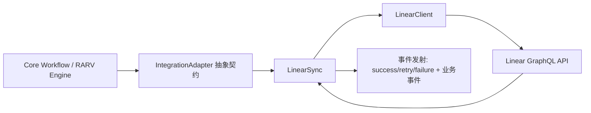
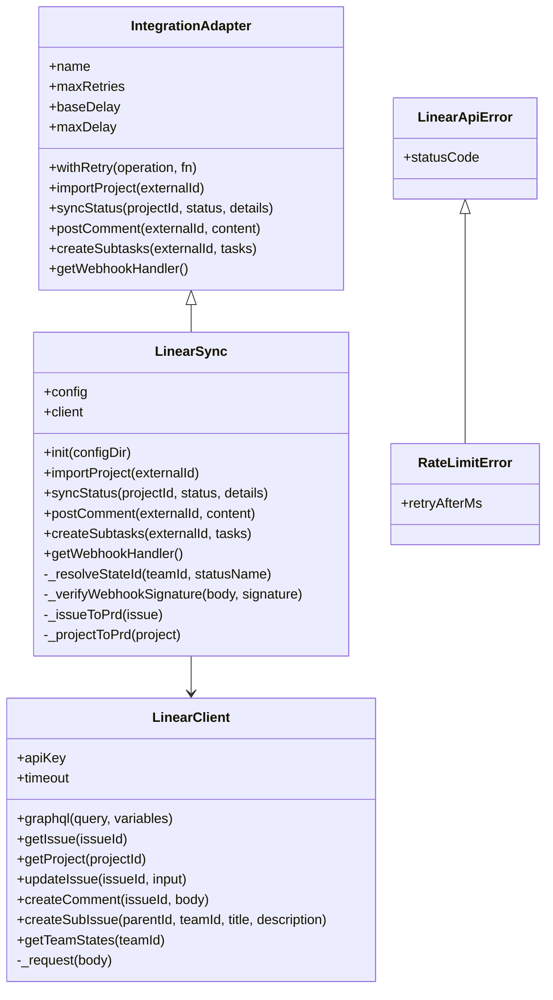
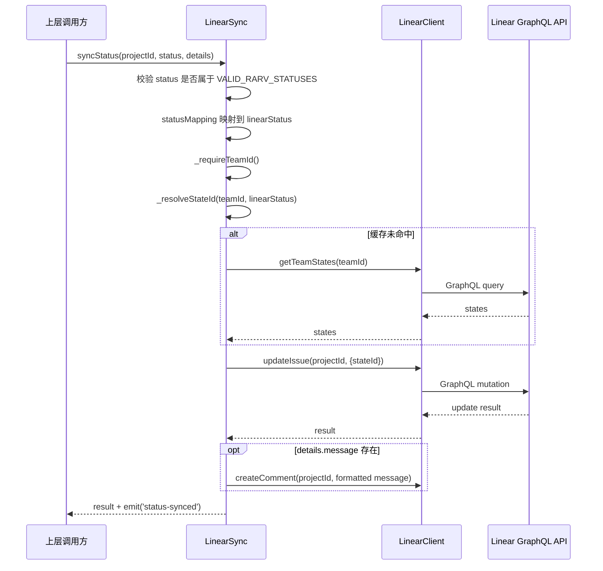
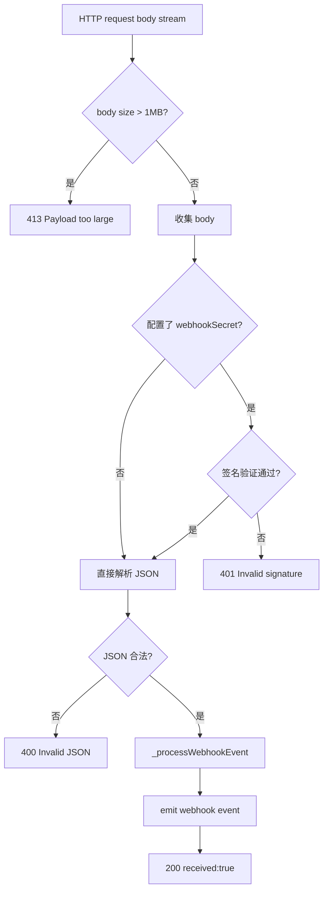

# linear_integration 模块文档

## 模块简介

`linear_integration` 模块位于 `Integrations` 子系统下，核心由 `src.integrations.linear.client.LinearClient` 与 `src.integrations.linear.sync.LinearSync` 组成。它的职责是把系统内部的任务生命周期（尤其是 RARV 阶段）与 Linear 的 Issue/Project 数据模型打通，实现“导入—转换—回写—事件接收”的完整闭环。

这个模块存在的原因很直接：系统内部关注的是自动化执行流程、质量门控和运行时状态，而 Linear 关注的是团队协作中的任务管理与看板状态。两者的数据结构和语义不一致，因此需要一层明确的适配器，把内部流程语言翻译为外部协作平台语言，并且在网络抖动、限流、Webhook 安全等实际生产条件下保持稳定。

从设计上看，该模块分成两层：`LinearClient` 处理“如何安全地调用 Linear GraphQL API”，`LinearSync` 处理“如何把业务动作映射到 Linear 操作”。这种分层让 HTTP/GraphQL 细节与业务编排解耦，后续替换底层调用方式（例如更换 transport）或扩展业务语义（例如新增状态映射策略）都更容易。

---

## 在整体系统中的位置

`linear_integration` 属于 `Integrations` 目录中的一个实现，与 Jira/Slack/Teams 等并列。它通过 `IntegrationAdapter` 约定统一接口，因此可以被上层编排逻辑以一致方式调用。



上图表示：上层不直接操作 GraphQL，而是调用统一适配器接口；`LinearSync` 负责业务语义，`LinearClient` 负责 API 通信与错误归一化。这样做的价值是减少上层对外部平台细节的耦合，同时复用适配器层的重试与事件机制。

可参考：`[Integrations.md](Integrations.md)`、`[Integrations-Jira.md](Integrations-Jira.md)`、`[Plugin System.md](Plugin System.md)`。

---

## 架构与组件关系

### 1) 组件分层



`LinearSync` 继承 `IntegrationAdapter`，所以天然获得指数退避重试能力（`withRetry`）和通用生命周期事件（`retry`/`success`/`failure`）；`LinearClient` 则把所有 API 异常统一为 `LinearApiError` 家族，避免业务层面对原始网络错误做分散处理。

### 2) 关键流程：状态同步



这个流程强调两个优化点：其一是状态 ID 的缓存（减少重复查询 team states），其二是状态更新与评论写入串行执行，确保评论语义与刚刚同步的状态一致。

### 3) 关键流程：Webhook 接入



Webhook 路径里最关键的是“先限流大小，再验签，再解析”。这样可以避免大包攻击和无效请求在 JSON parse 阶段消耗过多资源。

---

## 核心组件详解

## `LinearClient`

`LinearClient` 是一个“纯 Node.js 内置依赖”的 GraphQL 客户端实现，使用 `https.request` 直接发起请求。它没有引入第三方 HTTP 库，降低了部署面复杂度，但也意味着重试、连接池等高级能力需在上层（`IntegrationAdapter`）和本类中手动维护。

### 构造函数

```js
new LinearClient(apiKey, { timeout })
```

`apiKey` 必须是非空字符串，否则立即抛错。`timeout` 默认 15000ms。实例内维护两个速率限制状态字段：`_rateLimitRemaining` 与 `_rateLimitReset`，用于请求前快速失败（fail fast）。

### `graphql(query, variables = {})`

这是所有高阶 API 方法的统一入口。执行步骤如下：

1. 请求前检查本地缓存的 rate limit，如果确定还未 reset 且 remaining<=0，直接抛 `RateLimitError`。
2. 调用 `_request` 发起 HTTPS POST。
3. 从响应头更新 `x-ratelimit-remaining` / `x-ratelimit-reset` 本地状态。
4. 对 HTTP 状态码分类处理：`429` 抛 `RateLimitError`，非 2xx 抛 `LinearApiError`（并截断 body，最多 256 字符）。
5. JSON 解析失败抛 `LinearApiError(statusCode=0)`。
6. GraphQL `errors` 非空时拼接 message 抛 `LinearApiError`。
7. 返回 `data.data`（GraphQL data payload）。

副作用主要是更新 rate limit 缓存；这会影响后续请求的预判行为。

### 高阶 API 方法

`getIssue(issueId)` 查询 Issue 详情，字段覆盖 parent/children/relations，足够支撑 PRD 转换和子任务去重。`getProject(projectId)` 查询项目基础信息及 issue 列表，作为 Issue fallback 的输入。`updateIssue(issueId, input)` 执行 `issueUpdate` mutation，常用于状态迁移。`createComment(issueId, body)` 写入 markdown 评论。`createSubIssue(parentId, teamId, title, description)` 创建子任务。`getTeamStates(teamId)` 获取状态名与状态 ID 映射基础数据。

### `_request(body)`

该方法封装低层 `https.request`。它处理了三类异常出口：网络错误（`error` 事件）、超时（`timeout` 事件 + `req.destroy()`）和正常返回。返回结构统一为 `{statusCode, headers, body}`，给 `graphql` 做上层判定。

### 错误类型

- `LinearApiError(message, statusCode)`：通用 API/网络错误。
- `RateLimitError(message, retryAfterMs)`：限流专用错误，`statusCode` 固定 429。

`RateLimitError.retryAfterMs` 对调用方很重要，可用于调度层延迟重试策略。

---

## `LinearSync`

`LinearSync` 是业务语义层，继承 `IntegrationAdapter`。它将“导入、同步、评论、子任务、Webhook”统一在一个适配器对象上，并通过 `withRetry` 获得指数退避能力。

### 构造与初始化

```js
const sync = new LinearSync(config?, options?)
sync.init(configDir?)
```

- `config` 可直接注入；若未注入，`init` 会调用 `loadConfig(configDir)` 自动加载。
- `validateConfig` 不通过时抛异常。
- 初始化成功后创建 `LinearClient` 并返回 `true`；未找到配置返回 `false`（表示集成未启用）。

这意味着调用方应显式处理 `init()` 的布尔返回值，而不是假设一定可用。

### `importProject(externalId)`

该方法以“先 Issue 后 Project”的策略识别 `externalId` 类型：先执行 `client.getIssue`，若遇到 404 或 message 中含“not found”，再回退 `getProject`。最终分别通过 `_issueToPrd` 或 `_projectToPrd` 输出统一 PRD 结构。

这里的设计动机是兼容调用方只传一个 ID，而不强制其声明类型。代价是一次潜在的额外 API 请求。

### `syncStatus(projectId, status, details)`

该方法用于把内部 RARV 状态回写 Linear：

1. 校验 `status` 必须属于 `VALID_RARV_STATUSES`。
2. 用 `config.statusMapping || DEFAULT_STATUS_MAPPING` 映射得到 Linear 状态名。
3. 要求存在 `teamId`（通过 `_requireTeamId`），否则抛错。
4. `_resolveStateId` 将状态名解析为 Linear state ID（带缓存）。
5. 调 `updateIssue(projectId, { stateId })`。
6. 如果 `details.message` 存在，追加自动评论 `**Loki Mode [STATUS]**: ...`。
7. 发射 `status-synced` 业务事件。

返回值为 `issueUpdate` mutation 的结果对象。

### `postComment(externalId, content)`

简单代理 `client.createComment`，成功后发射 `comment-posted` 事件（包含 commentId）。该事件可用于上层审计或 UI 通知。

### `createSubtasks(externalId, tasks)`

该方法先查询父 Issue 的现有 children，按标题去重后逐个创建子 Issue。注意当前去重规则仅基于 `title` 全等匹配，大小写差异或前后空格差异不去重。成功后发射 `subtasks-created`（含创建数量）。

### `getWebhookHandler()`

返回 `(req, res)` 风格 HTTP 处理器，适合直接挂到 Node 原生服务或轻量框架适配层。逻辑包括：

- 限制请求体不超过 `MAX_WEBHOOK_BODY_BYTES`（1MB）；超限立即 413。
- 若配置 `webhookSecret`，要求 `linear-signature` 通过 HMAC-SHA256 校验。
- JSON 非法返回 400。
- 合法事件经 `_processWebhookEvent` 归一化后 `emit('webhook', event)`。
- 最终返回 200 `{received:true}`。

### 内部转换与辅助方法

`_issueToPrd` 把 Issue 转换为统一对象，包含 labels/priority/dependencies/subtasks 与 `prd` 子结构。`_projectToPrd` 则把 Project + issues 转为项目级 PRD。`_extractRequirements` 从 description 中抽取列表项（支持 `-`、`*`、`1.` 风格）。`_resolveStateId` 使用 teamId 缓存状态列表并按名称（不区分大小写）匹配。`_verifyWebhookSignature` 使用 `crypto.timingSafeEqual` 避免时序攻击。`_processWebhookEvent` 输出统一事件形态（包含 timestamp/processed 标记）。

---

## 配置与运行时行为

该模块依赖 `src/integrations/linear/config.js` 提供配置加载与验证。默认从 `.loki/config.yaml` 或 `.loki/config.json` 读取 `integrations.linear` 节点。

### 推荐 YAML 配置

```yaml
integrations:
  linear:
    api_key: "lin_api_xxx"
    team_id: "team_xxx"
    webhook_secret: "whsec_xxx"
    status_mapping:
      REASON: "In Progress"
      ACT: "In Progress"
      REFLECT: "In Review"
      VERIFY: "Done"
      DONE: "Done"
```

`api_key` 是必填；`team_id` 对 `syncStatus`/`createSubtasks` 等写操作非常关键。`status_mapping` 会与 `DEFAULT_STATUS_MAPPING` 合并，允许只覆盖部分状态。

### 默认常量

- `DEFAULT_STATUS_MAPPING`: `REASON/ACT -> In Progress`, `REFLECT -> In Review`, `VERIFY/DONE -> Done`
- `MAX_WEBHOOK_BODY_BYTES`: 1MB
- `DEFAULT_RATE_LIMIT_RETRY_MS`: 60000
- `MAX_ERROR_BODY_LENGTH`: 256

---

## 使用示例

### 1) 初始化并导入 Issue/Project

```js
const { LinearSync } = require('./src/integrations/linear/sync');

const linear = new LinearSync(null, { maxRetries: 3, baseDelay: 1000 });
const enabled = linear.init();
if (!enabled) {
  console.log('Linear integration not configured');
  process.exit(0);
}

const prd = await linear.importProject('LIN-123-or-project-id');
console.log(prd.title, prd.prd?.requirements);
```

### 2) 同步 RARV 状态并附带评论

```js
await linear.syncStatus('issue_id', 'REFLECT', {
  message: '已完成实现，进入评审阶段。'
});
```

### 3) 注册事件监听（重试/失败/业务事件）

```js
linear.on('retry', (e) => console.warn('[retry]', e));
linear.on('failure', (e) => console.error('[failure]', e));
linear.on('status-synced', (e) => console.log('[status-synced]', e));
linear.on('webhook', (e) => console.log('[webhook]', e.type, e.action));
```

### 4) 挂载 Webhook 处理器

```js
const http = require('http');
const handler = linear.getWebhookHandler();

http.createServer((req, res) => {
  if (req.method === 'POST' && req.url === '/webhooks/linear') {
    return handler(req, res);
  }
  res.writeHead(404); res.end();
}).listen(8080);
```

---

## 错误处理、边界条件与限制

该模块在工程上较稳健，但有几个必须知晓的行为约束。

首先，`LinearClient` 并不自动重试；真正的重试发生在 `LinearSync.withRetry` 层。所以如果你直接使用 `LinearClient`，需要自己实现重试与节流。其次，限流有两层表现：请求前本地缓存预判（可能提前失败），以及服务端 429 响应（含 `retry-after` 或默认 60s）。调用方应该识别 `RateLimitError.retryAfterMs`。

在 `syncStatus` 中，状态映射按“名称”匹配 team states。如果 Linear 工作流名称改了（例如 `In Review` 改成 `Reviewing`），会触发 “State not found” 错误。此时应更新 `status_mapping`，并注意 `_stateCache` 是进程内缓存，运行中不会自动失效。

`createSubtasks` 的幂等策略是“标题去重”，这很实用但不完全可靠：同名不同内容会被跳过，近似标题会重复创建。若你有更严格的去重要求，建议扩展为基于外部 ID 或自定义标记（例如在描述里嵌入 trace token）。

Webhook 方面，若配置了 `webhook_secret`，但上游未传 `linear-signature`，会直接 401。签名比较使用了 timing-safe 方式，但它假设签名是 hex 串；非 hex 输入会导致 buffer 长度不一致并返回 false。另一个注意点是处理器没有实现事件去重（如 delivery id 去重），因此上层消费 `webhook` 事件时应考虑幂等。

最后，`importProject` 的 Issue→Project 回退逻辑依赖错误文本里 “not found” 的启发式判断；如果未来 API 错误文案变化，可能影响识别准确性。这属于目前实现的已知折中。

---

## 可扩展点与二次开发建议

如果你要扩展本模块，建议优先沿着当前分层模型进行。

在 API 层，可为 `LinearClient` 增加更多 GraphQL 方法（如 batch 查询、cycle/milestone 查询），保持“一个业务动作一个方法”的可读性。在业务层，可在 `LinearSync` 新增更细粒度的同步策略（例如只在特定状态写评论，或根据标签路由到不同 team）。

若需要更高吞吐，建议在 `LinearSync` 里引入并发控制（当前 `createSubtasks` 是串行创建），并在缓存层增加 TTL 或主动失效机制，避免 team 状态变更后长时间陈旧。

对于企业级部署，可把 `withRetry` 事件接入 Observability（参考 `[Observability.md](Observability.md)`）并写入 Audit 流（参考 `[Audit.md](Audit.md)`），形成可追踪的集成操作链路。

---

## 与其他文档的关系

- 集成总体设计：[`Integrations.md`](Integrations.md)
- Jira 对照实现：[`Integrations-Jira.md`](Integrations-Jira.md)
- 通知型集成参考：[`Integrations-Slack.md`](Integrations-Slack.md)、[`Integrations-Teams.md`](Integrations-Teams.md)
- 插件化装载与生命周期：[`Plugin System.md`](Plugin System.md)
- 审计与观测：[`Audit.md`](Audit.md)、[`Observability.md`](Observability.md)

本文件聚焦 Linear 适配器实现细节，不重复展开其他模块的通用机制。
