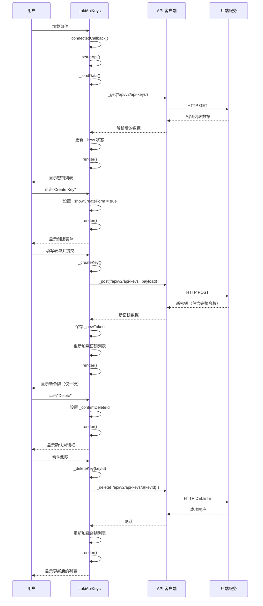
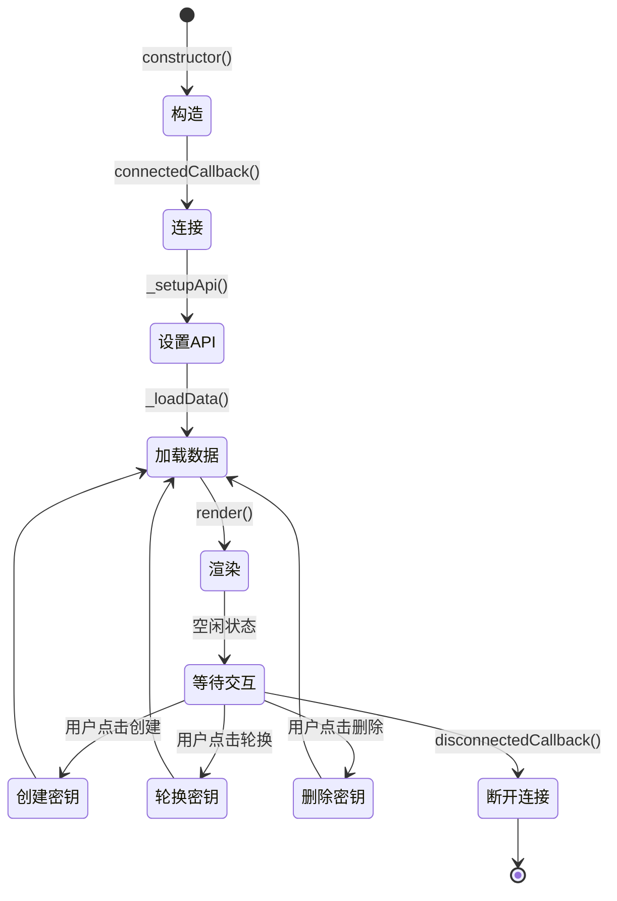

# Loki API Keys 模块文档

## 目录

- [模块概述](#模块概述)
- [核心组件](#核心组件)
- [架构与数据流](#架构与数据流)
- [API 参考](#api-参考)
- [使用指南](#使用指南)
- [配置与主题](#配置与主题)
- [安全注意事项](#安全注意事项)
- [错误处理与边界情况](#错误处理与边界情况)

---

## 模块概述

### 目的与设计理念

Loki API Keys 模块是一个功能完整的 Web 组件，专为管理 API 密钥而设计。该组件提供了直观的用户界面，允许用户创建、查看、轮换和删除 API 密钥，同时遵循安全最佳实践。

该模块的设计核心理念包括：

- **安全性优先**：密钥仅在创建时显示一次，之后始终保持掩码状态
- **用户体验**：提供清晰的操作流程和确认机制，防止误操作
- **可访问性**：支持明暗主题，并遵循现代 UI/UX 设计原则
- **模块化**：作为独立的 Web 组件，可以轻松集成到任何应用中

### 主要功能

- 显示 API 密钥列表，包含名称、角色、创建时间、最后使用时间和状态
- 创建新的 API 密钥，支持自定义名称、角色和可选的过期时间
- 密钥轮换功能，支持配置宽限期（grace period）
- 删除 API 密钥，带有确认机制防止误操作
- 新创建的密钥仅显示一次，并提供明确的复制提示
- 支持浅色和深色主题
- 完整的错误处理和加载状态

---

## 核心组件

### LokiApiKeys 类

`LokiApiKeys` 是该模块的主要类，继承自 `LokiElement`，实现了完整的 API 密钥管理功能。

#### 类定义

```javascript
export class LokiApiKeys extends LokiElement {
  static get observedAttributes() {
    return ['api-url', 'theme'];
  }

  constructor() {
    super();
    // 初始化内部状态
  }
}
```

#### 属性

| 属性名 | 类型 | 默认值 | 描述 |
|--------|------|--------|------|
| `api-url` | string | 当前页面 origin | API 基础 URL |
| `theme` | string | - | 主题设置，可选值 'light' 或 'dark' |

#### 内部状态

`LokiApiKeys` 维护以下内部状态：

| 状态变量 | 类型 | 描述 |
|----------|------|------|
| `_loading` | boolean | 数据加载状态 |
| `_error` | string \| null | 错误消息 |
| `_api` | object | API 客户端实例 |
| `_keys` | Array | API 密钥列表 |
| `_showCreateForm` | boolean | 是否显示创建表单 |
| `_newToken` | string \| null | 新创建的令牌（仅显示一次） |
| `_confirmDeleteId` | string \| null | 待确认删除的密钥 ID |
| `_rotateKeyId` | string \| null | 待轮换的密钥 ID |
| `_rotateGracePeriod` | string | 轮换宽限期（小时） |
| `_createName` | string | 创建表单中的名称输入 |
| `_createRole` | string | 创建表单中的角色选择 |
| `_createExpiration` | string | 创建表单中的过期时间 |

### 辅助函数

#### formatKeyTime

格式化时间戳用于显示。

```javascript
export function formatKeyTime(timestamp) {
  if (!timestamp) return 'Never';
  try {
    const d = new Date(timestamp);
    return d.toLocaleString([], {
      month: 'short',
      day: 'numeric',
      year: 'numeric',
      hour: '2-digit',
      minute: '2-digit',
    });
  } catch {
    return String(timestamp);
  }
}
```

**参数**:
- `timestamp` (string|null): ISO 格式的时间戳

**返回值**:
- 格式化的时间字符串，无效输入返回 'Never'

#### maskToken

掩码处理令牌字符串，仅显示首尾 4 个字符。

```javascript
export function maskToken(token) {
  if (!token || token.length < 12) return '****';
  return token.slice(0, 4) + '****' + token.slice(-4);
}
```

**参数**:
- `token` (string): 原始令牌字符串

**返回值**:
- 掩码后的令牌字符串

---

## 架构与数据流

### 组件架构

LokiApiKeys 组件采用自包含的 Web 组件架构，具有以下特点：

- **Shadow DOM**: 使用 Shadow DOM 封装样式和结构，避免样式冲突
- **状态驱动渲染**: 内部状态变化触发重新渲染
- **事件委托**: 使用事件委托模式处理用户交互
- **API 集成**: 通过 API 客户端与后端服务通信

### 数据流图



### 组件生命周期



---

## API 参考

### 公共方法

#### connectedCallback

组件连接到 DOM 时调用，设置 API 客户端并加载初始数据。

```javascript
connectedCallback() {
  super.connectedCallback();
  this._setupApi();
  this._loadData();
}
```

#### disconnectedCallback

组件从 DOM 断开时调用，执行清理工作。

```javascript
disconnectedCallback() {
  super.disconnectedCallback();
}
```

#### attributeChangedCallback

监听属性变化并响应。

```javascript
attributeChangedCallback(name, oldValue, newValue) {
  if (oldValue === newValue) return;
  if (name === 'api-url' && this._api) {
    this._api.baseUrl = newValue;
    this._loadData();
  }
  if (name === 'theme') {
    this._applyTheme();
  }
}
```

**参数**:
- `name` (string): 变化的属性名
- `oldValue` (any): 旧属性值
- `newValue` (any): 新属性值

### 私有方法

#### _setupApi

设置 API 客户端实例。

```javascript
_setupApi() {
  const apiUrl = this.getAttribute('api-url') || window.location.origin;
  this._api = getApiClient({ baseUrl: apiUrl });
}
```

#### _loadData

从 API 加载 API 密钥列表。

```javascript
async _loadData() {
  try {
    this._loading = true;
    this.render();

    const data = await this._api._get('/api/v2/api-keys');
    this._keys = Array.isArray(data) ? data : (data?.keys || []);
    this._error = null;
  } catch (err) {
    this._error = `Failed to load API keys: ${err.message}`;
  } finally {
    this._loading = false;
  }

  this.render();
}
```

#### _createKey

创建新的 API 密钥。

```javascript
async _createKey() {
  if (!this._createName.trim()) {
    this._error = 'Key name is required.';
    this.render();
    return;
  }

  try {
    const payload = {
      name: this._createName.trim(),
      role: this._createRole,
    };
    if (this._createExpiration) {
      payload.expiration = this._createExpiration;
    }

    const result = await this._api._post('/api/v2/api-keys', payload);
    this._newToken = result?.token || result?.key || null;
    this._showCreateForm = false;
    this._createName = '';
    this._createRole = 'read';
    this._createExpiration = '';
    this._error = null;
    await this._loadData();
  } catch (err) {
    this._error = `Create failed: ${err.message}`;
    this.render();
  }
}
```

#### _rotateKey

轮换 API 密钥。

```javascript
async _rotateKey(keyId) {
  try {
    const payload = {
      grace_period_hours: parseInt(this._rotateGracePeriod, 10) || 24,
    };
    const result = await this._api._post(`/api/v2/api-keys/${keyId}/rotate`, payload);
    this._newToken = result?.token || result?.key || null;
    this._rotateKeyId = null;
    this._error = null;
    await this._loadData();
  } catch (err) {
    this._error = `Rotate failed: ${err.message}`;
    this.render();
  }
}
```

**参数**:
- `keyId` (string): 要轮换的密钥 ID

#### _deleteKey

删除 API 密钥。

```javascript
async _deleteKey(keyId) {
  try {
    await this._api._delete(`/api/v2/api-keys/${keyId}`);
    this._confirmDeleteId = null;
    this._error = null;
    await this._loadData();
  } catch (err) {
    this._error = `Delete failed: ${err.message}`;
    this._confirmDeleteId = null;
    this.render();
  }
}
```

**参数**:
- `keyId` (string): 要删除的密钥 ID

#### render

渲染组件 UI。

```javascript
render() {
  const s = this.shadowRoot;
  if (!s) return;

  // 构建 HTML 内容
  // ...

  s.innerHTML = `
    <style>${this.getBaseStyles()}${this._getStyles()}</style>
    <div class="api-keys">
      <!-- 组件内容 -->
    </div>
  `;

  this._attachEventListeners();
}
```

#### _attachEventListeners

附加事件监听器到渲染后的 DOM 元素。

```javascript
_attachEventListeners() {
  const s = this.shadowRoot;
  if (!s) return;

  // 处理各种用户交互事件
  // ...
}
```

---

## 使用指南

### 基本使用

将 `loki-api-keys` 组件添加到 HTML 页面中：

```html
<!DOCTYPE html>
<html lang="zh-CN">
<head>
  <meta charset="UTF-8">
  <title>API 密钥管理</title>
</head>
<body>
  <loki-api-keys 
    api-url="https://api.example.com" 
    theme="light">
  </loki-api-keys>

  <script type="module">
    import './dashboard-ui/components/loki-api-keys.js';
  </script>
</body>
</html>
```

### 在框架中使用

#### React

```jsx
import React, { useEffect, useRef } from 'react';
import './dashboard-ui/components/loki-api-keys.js';

function ApiKeysManager() {
  const apiKeysRef = useRef(null);

  useEffect(() => {
    if (apiKeysRef.current) {
      apiKeysRef.current.setAttribute('api-url', process.env.REACT_APP_API_URL);
      apiKeysRef.current.setAttribute('theme', 'dark');
    }
  }, []);

  return (
    <div className="api-keys-container">
      <loki-api-keys ref={apiKeysRef}></loki-api-keys>
    </div>
  );
}

export default ApiKeysManager;
```

#### Vue

```vue
<template>
  <div class="api-keys-container">
    <loki-api-keys 
      :api-url="apiUrl" 
      :theme="theme">
    </loki-api-keys>
  </div>
</template>

<script>
import { ref, onMounted } from 'vue';
import './dashboard-ui/components/loki-api-keys.js';

export default {
  name: 'ApiKeysManager',
  setup() {
    const apiUrl = ref(process.env.VUE_APP_API_URL);
    const theme = ref('light');

    return {
      apiUrl,
      theme
    };
  }
};
</script>
```

### 程序化操作

虽然 `LokiApiKeys` 主要设计为通过 UI 交互，但你也可以通过访问其内部状态和方法来进行程序化操作：

```javascript
// 获取组件实例
const apiKeysComponent = document.querySelector('loki-api-keys');

// 强制刷新数据
if (apiKeysComponent) {
  await apiKeysComponent._loadData();
  
  // 访问当前密钥列表
  console.log('当前密钥:', apiKeysComponent._keys);
}
```

---

## 配置与主题

### 属性配置

#### api-url

指定 API 服务的基础 URL。如果未设置，组件将使用当前页面的 origin。

```html
<loki-api-keys api-url="https://api.example.com"></loki-api-keys>
```

#### theme

设置组件的主题，支持 'light' 和 'dark' 两种主题。

```html
<loki-api-keys theme="dark"></loki-api-keys>
```

### CSS 变量

`LokiApiKeys` 组件使用 CSS 变量来支持主题定制。你可以通过设置以下 CSS 变量来自定义组件外观：

| 变量名 | 描述 | 默认值 |
|--------|------|--------|
| `--loki-font-family` | 字体族 | 'Inter', -apple-system, sans-serif |
| `--loki-text-primary` | 主要文本颜色 | #201515 |
| `--loki-text-secondary` | 次要文本颜色 | #36342E |
| `--loki-text-muted` | 静音文本颜色 | #939084 |
| `--loki-bg-tertiary` | 第三级背景色 | #ECEAE3 |
| `--loki-bg-card` | 卡片背景色 | #ffffff |
| `--loki-bg-hover` | 悬停背景色 | #1f1f23 |
| `--loki-border` | 边框颜色 | #ECEAE3 |
| `--loki-border-light` | 浅边框颜色 | #C5C0B1 |
| `--loki-accent` | 强调色 | #553DE9 |
| `--loki-accent-muted` | 淡化强调色 | rgba(139, 92, 246, 0.15) |
| `--loki-red` | 红色（错误、危险） | #ef4444 |
| `--loki-red-muted` | 淡化红色 | rgba(239, 68, 68, 0.15) |
| `--loki-yellow` | 黄色（警告） | #eab308 |
| `--loki-yellow-muted` | 淡化黄色 | rgba(234, 179, 8, 0.15) |
| `--loki-green` | 绿色（成功） | #22c55e |
| `--loki-green-muted` | 淡化绿色 | rgba(34, 197, 94, 0.15) |

#### 自定义主题示例

```css
/* 自定义蓝色主题 */
.custom-theme {
  --loki-accent: #3b82f6;
  --loki-accent-muted: rgba(59, 130, 246, 0.15);
  --loki-bg-tertiary: #f1f5f9;
  --loki-border: #e2e8f0;
}

/* 应用到组件容器 */
.api-keys-container {
  display: block;
}

.api-keys-container loki-api-keys {
  /* 自定义样式会通过 CSS 变量应用到组件内部 */
}
```

---

## 安全注意事项

### 密钥安全最佳实践

`LokiApiKeys` 组件已经实现了多项安全措施，但在使用时仍需注意以下事项：

1. **密钥仅显示一次**：新创建的密钥令牌仅在创建后立即显示一次，刷新页面或关闭提示后将不再可见。确保在创建后立即复制并安全存储。

2. **密钥掩码**：已存在的密钥在列表中始终以掩码形式显示，仅暴露首尾 4 个字符，防止 shoulder surfing 攻击。

3. **确认机制**：删除和轮换操作都需要二次确认，防止误操作导致服务中断。

4. **轮换宽限期**：密钥轮换时支持配置宽限期，让旧密钥在一定时间内仍然有效，确保平滑过渡。

### 部署安全建议

1. **HTTPS 通信**：确保组件与 API 服务器之间的通信使用 HTTPS，防止令牌在传输过程中被窃取。

2. **适当的访问控制**：API 密钥管理功能应该只对授权用户开放，实施适当的身份验证和授权机制。

3. **审计日志**：记录所有 API 密钥的创建、轮换和删除操作，便于安全审计和事件响应。

4. **密钥过期策略**：建议为 API 密钥设置合理的过期时间，并建立定期轮换机制。

### 敏感信息处理

- 避免在浏览器控制台中记录或输出完整的 API 密钥
- 不要将 API 密钥存储在 localStorage 或其他客户端持久化存储中
- 实现会话超时和自动登出功能，减少密钥暴露窗口

---

## 错误处理与边界情况

### 错误处理机制

`LokiApiKeys` 组件实现了全面的错误处理机制：

1. **网络错误**：当 API 请求失败时，组件会显示友好的错误消息，并保持当前状态，允许用户重试。

2. **数据验证**：在创建密钥前会验证必填字段（如名称），提供即时的用户反馈。

3. **状态一致性**：所有操作执行后都会重新加载密钥列表，确保 UI 与后端状态保持一致。

### 常见错误场景

| 错误场景 | 错误消息 | 处理方式 |
|----------|----------|----------|
| API 服务不可用 | Failed to load API keys: [错误详情] | 显示错误消息，保持当前数据 |
| 创建密钥时名称为空 | Key name is required. | 阻止提交，提示用户输入 |
| 创建密钥失败 | Create failed: [错误详情] | 显示错误消息，保留表单内容 |
| 轮换密钥失败 | Rotate failed: [错误详情] | 显示错误消息，取消轮换状态 |
| 删除密钥失败 | Delete failed: [错误详情] | 显示错误消息，取消删除状态 |

### 边界情况

#### 空密钥列表

当没有配置任何 API 密钥时，组件会显示友好的空状态提示，并引导用户创建第一个密钥。

#### 加载状态

在数据加载过程中，组件会显示加载指示器，防止用户在数据未完全加载时进行操作。

#### 超长密钥名称

组件会自动处理超长的密钥名称，通过 CSS 确保布局不会被破坏。

#### 无效时间戳

`formatKeyTime` 函数能够处理无效的时间戳，返回合理的默认值（"Never"）。

#### 短令牌

`maskToken` 函数对长度不足 12 个字符的令牌进行特殊处理，返回通用的掩码 "****"。

### 恢复机制

组件提供多种方式从错误状态中恢复：

1. 页面刷新会重置组件状态并重新加载数据
2. 所有错误状态都可以通过重新发起相应操作来恢复
3. 组件不会因为单次操作失败而进入不可用状态

---

## 与其他模块的关系

`LokiApiKeys` 组件与以下模块有依赖关系：

- [Loki Theme](dashboard-ui-core-loki-theme.md) - 提供基础主题系统和 `LokiElement` 基类
- [Loki API Client](dashboard-ui-core-loki-api-client.md) - 提供 API 通信功能

在整体系统架构中，API 密钥管理通常与以下功能配合使用：

- 认证与授权系统
- API 访问控制
- 审计日志系统

---

## 更新日志

### 当前版本

- 完整的 API 密钥 CRUD 功能
- 密钥轮换支持
- 明暗主题支持
- 安全的密钥显示机制

---

## 参考资料

- [Web Components 规范](https://developer.mozilla.org/en-US/docs/Web/Web_Components)
- [Shadow DOM API](https://developer.mozilla.org/en-US/docs/Web/Web_Components/Using_shadow_DOM)
- [REST API 安全最佳实践](https://owasp.org/www-project-rest-security/)
