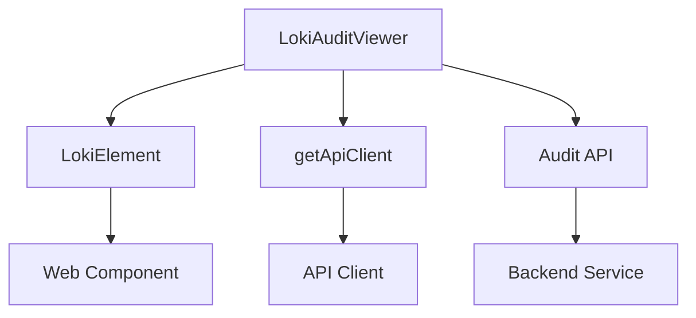
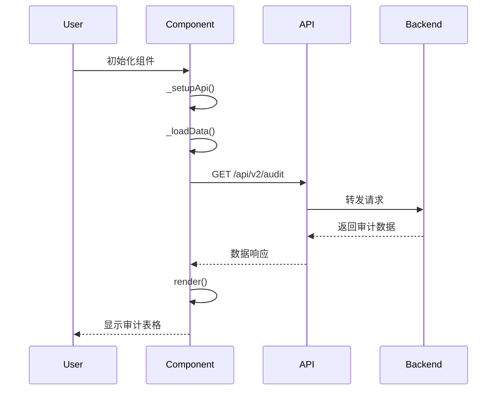
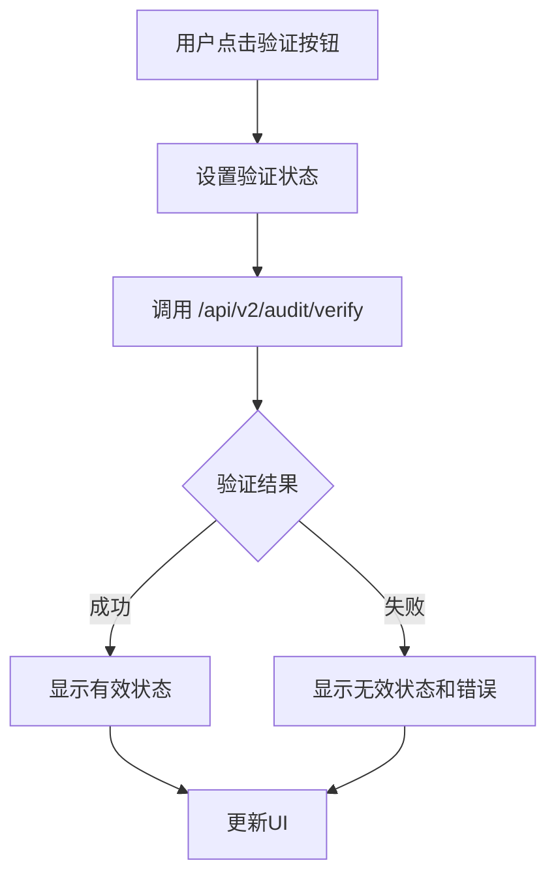

# Loki Audit Viewer 组件文档

## 1. 概述

Loki Audit Viewer 是一个用于审计日志查看和完整性验证的 Web 组件。它提供了一个可过滤的表格界面，用于显示审计条目，并包含完整性验证功能，用于检查审计日志的安全性和完整性。该组件设计为独立的 Web Component，可以轻松集成到任何前端应用中，支持浅色和深色主题，并提供灵活的配置选项。

### 主要功能
- 审计日志的表格化展示
- 多维度过滤（动作类型、资源类型、日期范围）
- 审计链完整性验证
- 实时数据刷新
- 主题切换支持
- 响应式设计

## 2. 架构与组件关系

Loki Audit Viewer 是 Loki Dashboard UI 组件库的一部分，属于管理和基础设施组件类别。它基于 LokiElement 基类构建，使用 Loki API 客户端与后端服务通信。



### 组件依赖关系
- **LokiElement**: 提供基础的 Web Component 功能和主题支持
- **getApiClient**: 用于创建与后端通信的 API 客户端实例
- **后端 API**: 依赖 `/api/v2/audit` 和 `/api/v2/audit/verify` 端点

## 3. 核心功能模块

### 3.1 审计日志展示

Loki Audit Viewer 使用表格形式展示审计日志条目，包含时间戳、动作类型、资源类型、用户和状态等关键信息。



### 3.2 过滤器系统

组件提供了四个过滤维度：
- **动作类型**: 过滤特定的操作类型（如 create、delete）
- **资源类型**: 过滤特定的资源类型（如 run、project）
- **日期范围**: 通过开始和结束日期过滤审计条目

过滤器变更时会自动触发数据重新加载，确保显示的内容始终与当前筛选条件匹配。

### 3.3 完整性验证

完整性验证功能允许用户检查审计日志的完整性，确保没有被篡改。该功能调用 `/api/v2/audit/verify` 端点，并显示验证结果。



## 4. API 参考

### 4.1 LokiAuditViewer 类

#### 属性
| 属性名 | 类型 | 默认值 | 描述 |
|--------|------|--------|------|
| api-url | string | window.location.origin | API 基础 URL |
| limit | number | 50 | 获取的最大条目数 |
| theme | string | - | 主题设置（'light' 或 'dark'） |

#### 方法

##### `connectedCallback()`
组件挂载到 DOM 时调用，初始化 API 并加载数据。

##### `disconnectedCallback()`
组件从 DOM 卸载时调用。

##### `attributeChangedCallback(name, oldValue, newValue)`
监听属性变化并响应：
- `api-url`: 更新 API 基础 URL 并重新加载数据
- `limit`: 重新加载数据
- `theme`: 应用新主题

##### `_setupApi()`
设置 API 客户端实例。

##### `async _loadData()`
加载审计日志数据，应用当前过滤器，并更新组件状态。

##### `async _verifyIntegrity()`
执行审计链完整性验证并显示结果。

##### `_onFilterChange(field, value)`
更新过滤器状态并重新加载数据。

##### `render()`
渲染组件 UI。

### 4.2 辅助函数

#### `formatAuditTimestamp(timestamp)`
将 ISO 时间戳格式化为本地化显示字符串。

**参数:**
- `timestamp` (string|null): ISO 格式的时间戳

**返回值:**
- 格式化的时间字符串

#### `buildAuditQuery(filters)`
从过滤器参数构建查询字符串，排除空值。

**参数:**
- `filters` (Object): 过滤器键值对

**返回值:**
- 带前导问号的查询字符串

## 5. 使用示例

### 5.1 基本使用

```html
<!-- 使用默认配置 -->
<loki-audit-viewer></loki-audit-viewer>

<!-- 自定义 API URL 和限制 -->
<loki-audit-viewer api-url="http://localhost:57374" limit="100"></loki-audit-viewer>

<!-- 深色主题 -->
<loki-audit-viewer theme="dark"></loki-audit-viewer>
```

### 5.2 JavaScript 集成

```javascript
// 动态创建组件
const auditViewer = document.createElement('loki-audit-viewer');
auditViewer.setAttribute('api-url', 'https://api.example.com');
auditViewer.setAttribute('limit', '200');
auditViewer.setAttribute('theme', 'light');
document.body.appendChild(auditViewer);

// 程序方式修改属性
auditViewer.limit = 150; // 这会触发数据重新加载
```

### 5.3 与框架集成

#### React
```jsx
function AuditLogPage() {
  return (
    <div>
      <loki-audit-viewer 
        api-url={process.env.REACT_APP_API_URL}
        limit="100"
        theme="dark"
      />
    </div>
  );
}
```

#### Vue
```vue
<template>
  <div>
    <loki-audit-viewer 
      :api-url="apiUrl"
      :limit="limit"
      :theme="theme"
    />
  </div>
</template>

<script>
export default {
  data() {
    return {
      apiUrl: process.env.VUE_APP_API_URL,
      limit: 100,
      theme: 'dark'
    };
  }
};
</script>
```

## 6. 配置与部署

### 6.1 主题配置

组件使用 CSS 变量进行主题配置，可以通过全局 CSS 或组件属性设置：

```css
/* 全局主题配置 */
:root {
  --loki-font-family: 'Inter', -apple-system, sans-serif;
  --loki-text-primary: #201515;
  --loki-text-muted: #939084;
  --loki-border: #ECEAE3;
  --loki-bg-tertiary: #ECEAE3;
  --loki-bg-card: #ffffff;
  --loki-accent: #553DE9;
  --loki-green: #22c55e;
  --loki-green-muted: rgba(34, 197, 94, 0.15);
  --loki-red: #ef4444;
  --loki-red-muted: rgba(239, 68, 68, 0.15);
  --loki-yellow: #eab308;
  --loki-yellow-muted: rgba(234, 179, 8, 0.15);
  --loki-bg-hover: #1f1f23;
}
```

### 6.2 后端 API 要求

组件依赖以下后端 API 端点：

1. **GET /api/v2/audit**
   - 查询参数：
     - `limit`: 最大条目数
     - `action`: 动作类型过滤器
     - `resource`: 资源类型过滤器
     - `date_from`: 开始日期
     - `date_to`: 结束日期
   - 响应格式：
     ```json
     {
       "entries": [
         {
           "timestamp": "2023-01-01T00:00:00Z",
           "action": "create",
           "resource": "project",
           "user": "admin",
           "status": "success"
         }
       ]
     }
     ```

2. **GET /api/v2/audit/verify**
   - 响应格式：
     ```json
     {
       "valid": true,
       "error": null
     }
     ```

## 7. 注意事项与限制

### 7.1 常见问题

1. **CORS 错误**
   - 确保后端 API 正确配置了 CORS 头
   - 或者使用代理服务器转发请求

2. **数据加载失败**
   - 检查 `api-url` 属性是否正确设置
   - 验证后端服务是否正常运行
   - 查看浏览器控制台的详细错误信息

3. **过滤器不生效**
   - 确保后端 API 支持相应的查询参数
   - 检查日期格式是否正确（YYYY-MM-DD）

### 7.2 性能考虑

- 对于大型审计日志，建议设置合理的 `limit` 值
- 考虑在后端实现分页功能，当前组件仅支持简单的限制
- 频繁的过滤器变更可能导致多个 API 请求，可以考虑添加防抖功能

### 7.3 安全注意事项

- 确保审计日志 API 受到适当的身份验证保护
- 完整性验证功能应该仅对授权用户可用
- 考虑在生产环境中禁用详细的错误信息显示

## 8. 扩展与自定义

### 8.1 扩展组件功能

可以通过继承 `LokiAuditViewer` 类来扩展功能：

```javascript
class CustomAuditViewer extends LokiAuditViewer {
  constructor() {
    super();
    // 添加自定义初始化逻辑
  }

  // 重写或添加自定义方法
  async _loadData() {
    // 自定义数据加载逻辑
    await super._loadData();
    // 后处理逻辑
  }
}

customElements.define('custom-audit-viewer', CustomAuditViewer);
```

### 8.2 自定义样式

组件使用 Shadow DOM 封装样式，但可以通过 CSS 变量自定义外观：

```css
/* 自定义组件样式 */
loki-audit-viewer {
  --loki-accent: #ff6b6b;
  --loki-bg-card: #f8f9fa;
}
```

### 8.3 添加自定义过滤器

要添加额外的过滤器，需要修改 `_filters` 对象、过滤器 UI 和 `_loadData` 方法中的查询参数构建逻辑。

## 9. 相关模块

- [LokiTheme](loki-theme.md): 主题系统
- [LokiApiKeys](loki-api-keys.md): API 密钥管理
- [LokiTenantSwitcher](loki-tenant-switcher.md): 租户切换器
- [Dashboard Backend](dashboard-backend.md): 后端 API 实现

## 10. 更新日志

### v1.0.0
- 初始版本发布
- 支持审计日志查看和过滤
- 添加完整性验证功能
- 支持主题切换
