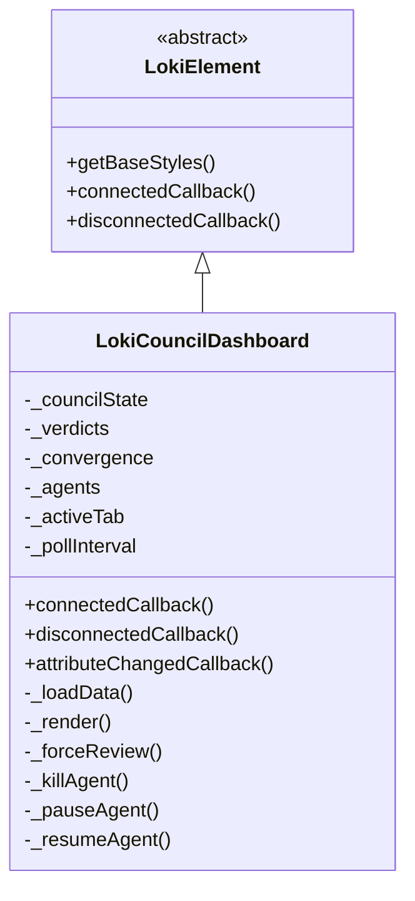
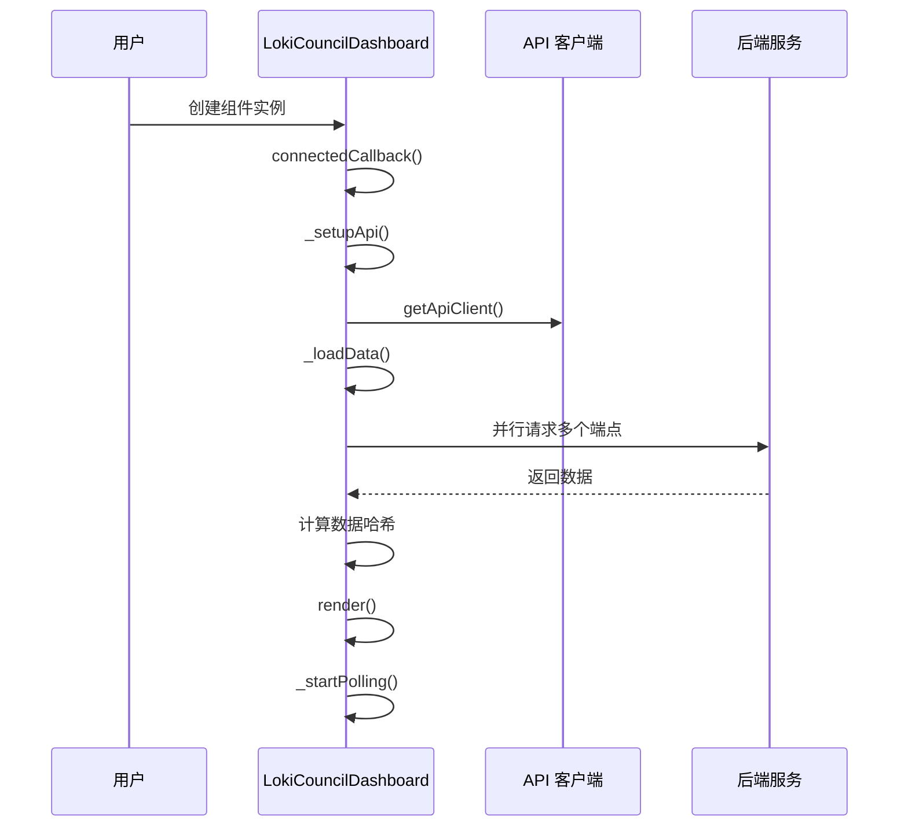
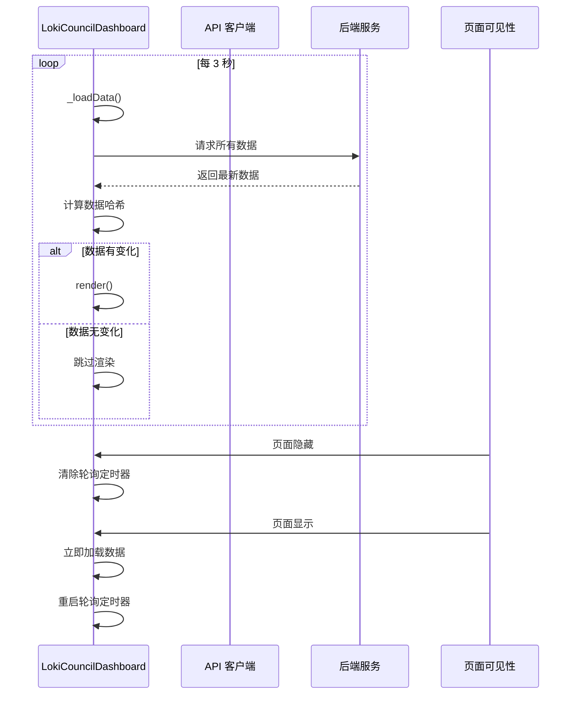
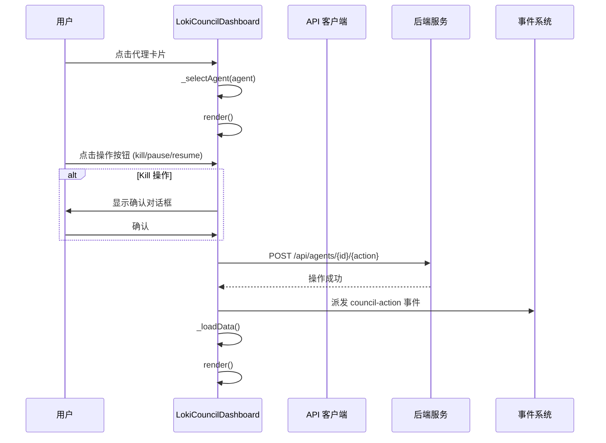

# Loki Council Dashboard 模块文档

## 目录
- [模块概述](#模块概述)
- [架构设计](#架构设计)
- [核心组件](#核心组件)
- [数据流程](#数据流程)
- [使用指南](#使用指南)
- [API 参考](#api-参考)
- [样式与主题](#样式与主题)
- [注意事项与限制](#注意事项与限制)

## 模块概述

Loki Council Dashboard 是一个用于监控和管理 Completion Council（完成委员会）的 Web 组件，它提供了四个核心功能区域：概览、决策日志、收敛追踪和代理管理。该组件定期轮询 API 以获取最新状态，并具备页面可见性感知能力，在页面隐藏时会暂停轮询以优化性能。

### 主要功能

- **实时监控**：每 3 秒自动刷新委员会状态、投票历史、收敛数据和代理信息
- **多标签视图**：
  - **Overview**：显示关键统计数据和收敛趋势概览
  - **Decision Log**：记录委员会的历史决策和投票详情
  - **Convergence**：展示迭代过程中的文件变更和停滞情况
  - **Agents**：管理参与委员会的代理实例
- **代理控制**：支持暂停、恢复和终止代理操作
- **手动干预**：提供"Force Review"按钮触发强制审查
- **主题支持**：兼容明暗两种主题模式
- **可见性优化**：页面隐藏时自动暂停轮询，显示时恢复

### 设计理念

该组件采用了现代化的 Web Components 架构，基于 Shadow DOM 实现样式隔离，确保组件在不同环境中都能保持一致的外观和行为。数据更新采用了智能哈希比较机制，只有在数据实际发生变化时才会重新渲染，避免了不必要的 DOM 操作和用户体验中断。

## 架构设计

### 组件层次结构

LokiCouncilDashboard 组件继承自 LokiElement，这是整个 Dashboard UI Components 库的基础元素类，提供了主题管理和基础样式支持。



### 数据模型

组件维护以下核心数据状态：

- **_councilState**：委员会的整体状态，包括启用状态、投票计数等
- **_verdicts**：委员会的历史决策记录数组
- **_convergence**：收敛数据点数组，包含每次迭代的文件变更信息
- **_agents**：参与委员会的代理列表
- **_selectedAgent**：当前选中的代理对象
- **_activeTab**：当前激活的标签页 ID
- **_error**：错误信息（如有）
- **_lastDataHash**：上一次渲染的数据哈希值，用于避免不必要的重渲染

### 通信架构

组件通过 API 客户端与后端服务通信，主要访问以下端点：

- `/api/council/state`：获取委员会状态
- `/api/council/verdicts`：获取决策历史
- `/api/council/convergence`：获取收敛数据
- `/api/agents`：获取代理列表
- `/api/council/force-review`：触发强制审查（POST）
- `/api/agents/{agentId}/kill`：终止代理（POST）
- `/api/agents/{agentId}/pause`：暂停代理（POST）
- `/api/agents/{agentId}/resume`：恢复代理（POST）

## 核心组件

### LokiCouncilDashboard 类

这是模块的核心组件，负责整个委员会仪表盘的渲染和交互。

#### 属性

| 属性名 | 类型 | 默认值 | 描述 |
|--------|------|--------|------|
| api-url | string | window.location.origin | API 基础 URL |
| theme | string | auto-detect | 主题模式，可选 'light' 或 'dark' |

#### 事件

| 事件名 | 详细信息 | 描述 |
|--------|----------|------|
| council-action | { action: string, agentId?: string } | 当执行委员会操作时触发（如 force-review、kill-agent 等） |

#### 生命周期方法

**connectedCallback()**

组件挂载到 DOM 时调用，执行以下操作：
1. 调用父类的 connectedCallback
2. 设置 API 客户端
3. 加载初始数据
4. 启动轮询机制

**disconnectedCallback()**

组件从 DOM 移除时调用，执行清理操作：
1. 停止轮询
2. 移除可见性事件监听器
3. 取消待处理的动画帧

**attributeChangedCallback(name, oldValue, newValue)**

监听属性变化，当 `api-url` 或 `theme` 属性改变时做出响应。

#### 核心方法

**_setupApi()**

初始化 API 客户端，使用组件的 `api-url` 属性或当前页面的 origin 作为默认值。

**_startPolling()**

启动数据轮询机制，每 3 秒调用一次 `_loadData()`。同时设置页面可见性变化监听器，实现智能暂停/恢复轮询。

**_stopPolling()**

停止轮询，清理所有定时器和事件监听器，防止内存泄漏。

**_loadData()**

异步加载所有必要数据的核心方法：
1. 使用 Promise.allSettled 并行请求所有 API 端点
2. 处理每个请求的结果，更新对应的数据状态
3. 计算当前数据的哈希值，与上一次比较
4. 只有在数据实际变化时才触发重新渲染

**_forceReview()**

触发委员会的强制审查操作，调用对应的 API 端点，并派发 `council-action` 事件。

**_killAgent(agentId)**

终止指定的代理，会先显示确认对话框，成功后刷新数据并派发事件。

**_pauseAgent(agentId)** / **_resumeAgent(agentId)**

暂停或恢复指定代理的执行，操作成功后自动刷新数据。

**_setTab(tabId)**

切换当前激活的标签页，触发重新渲染以显示对应内容。

**_selectAgent(agent)**

选中或取消选中代理卡片，用于展开显示代理的详细信息和操作按钮。

**render()**

渲染组件的主方法，构建 Shadow DOM 内容并附加事件监听器。包含完整的 HTML 结构和样式注入。

**_attachEventListeners()**

为主渲染内容中的交互元素附加事件监听器，包括：
- Force Review 按钮点击事件
- 标签页切换事件
- （代理卡片事件通过 deferred rAF 单独绑定）

**_renderTabContent()**

根据当前激活的标签页返回对应内容的渲染方法，是四个标签页内容渲染的分发点。

**_renderOverview()**

渲染概览标签页内容，包括：
- 委员会状态统计卡片
- 投票计数展示
- 停滞 streak 显示
- 完成信号计数
- 活跃代理数量
- 最后一次决策结果
- 收敛趋势迷你图表

**_renderConvergenceBar()**

渲染收敛趋势的柱状图，支持显示最近 20 个数据点，通过颜色区分活跃和停滞状态。

**_renderDecisions()**

渲染决策日志标签页，按时间倒序显示所有委员会决策，包括：
- 决策结果（批准/拒绝）
- 迭代编号
- 时间戳
- 赞成和反对票数

**_renderConvergence()**

渲染收敛标签页，包含：
- 完整的收敛趋势图表
- 收敛数据表格，显示每次迭代的详细信息
- 对连续无变更迭代的高亮警告

**_renderAgents()**

渲染代理管理标签页，使用 requestAnimationFrame 延迟绑定事件监听器以优化性能。每个代理卡片显示：
- 代理名称和状态
- 代理类型、PID 和任务信息
- 选中后的操作按钮（暂停/恢复/终止）

**_formatTime(timestamp)**

辅助方法，将时间戳格式化为可读的时间字符串。

**_getStyles()**

返回组件的自定义 CSS 样式，包含完整的组件样式定义，使用 CSS 变量实现主题支持。

## 数据流程

### 初始化流程



### 数据轮询流程



### 代理操作流程



## 使用指南

### 基本使用

在 HTML 中直接使用自定义元素：

```html
<loki-council-dashboard></loki-council-dashboard>
```

### 配置 API URL

指定自定义的 API 后端地址：

```html
<loki-council-dashboard api-url="http://localhost:57374"></loki-council-dashboard>
```

### 设置主题

强制使用特定主题：

```html
<!-- 暗色主题 -->
<loki-council-dashboard theme="dark"></loki-council-dashboard>

<!-- 亮色主题 -->
<loki-council-dashboard theme="light"></loki-council-dashboard>
```

### 事件监听

监听组件的操作事件：

```javascript
const dashboard = document.querySelector('loki-council-dashboard');
dashboard.addEventListener('council-action', (event) => {
  console.log('Council action:', event.detail);
  // event.detail 可能是：
  // { action: 'force-review' }
  // { action: 'kill-agent', agentId: 'agent-123' }
});
```

### 程序化操作

通过 JavaScript 动态创建和配置组件：

```javascript
// 创建组件实例
const dashboard = document.createElement('loki-council-dashboard');

// 设置属性
dashboard.setAttribute('api-url', 'https://api.example.com');
dashboard.setAttribute('theme', 'dark');

// 添加到文档
document.body.appendChild(dashboard);
```

## API 参考

### 自定义元素属性

#### api-url
- **类型**: string
- **默认值**: window.location.origin
- **描述**: API 服务的基础 URL，所有请求都会基于此 URL 构建

#### theme
- **类型**: string
- **可选值**: 'light', 'dark'
- **默认值**: 自动检测系统主题
- **描述**: 组件的视觉主题模式

### CSS 自定义属性

组件使用以下 CSS 变量实现主题化，可通过全局样式覆盖：

| 变量名 | 描述 |
|--------|------|
| --loki-text-primary | 主要文本颜色 |
| --loki-text-secondary | 次要文本颜色 |
| --loki-text-muted | 弱化文本颜色 |
| --loki-bg-secondary | 次要背景色 |
| --loki-bg-tertiary | 第三级背景色 |
| --loki-bg-card | 卡片背景色 |
| --loki-bg-hover | 悬停背景色 |
| --loki-accent | 主强调色 |
| --loki-accent-hover | 强调色悬停状态 |
| --loki-accent-muted | 弱化强调色 |
| --loki-border | 边框颜色 |
| --loki-border-light | 浅色边框 |
| --loki-success | 成功状态色 |
| --loki-success-muted | 弱化成功色 |
| --loki-warning | 警告状态色 |
| --loki-warning-muted | 弱化警告色 |
| --loki-error | 错误状态色 |
| --loki-error-muted | 弱化错误色 |

### 预期的 API 响应格式

#### /api/council/state
```json
{
  "enabled": true,
  "consecutive_no_change": 2,
  "done_signals": 1,
  "total_votes": 15,
  "approve_votes": 10,
  "check_interval": 5
}
```

#### /api/council/verdicts
```json
{
  "verdicts": [
    {
      "result": "APPROVED",
      "iteration": 10,
      "timestamp": "2024-01-15T10:30:00Z",
      "approve": 3,
      "reject": 1
    }
  ]
}
```

#### /api/council/convergence
```json
{
  "dataPoints": [
    {
      "iteration": 1,
      "files_changed": 5,
      "no_change_streak": 0,
      "done_signals": 0
    }
  ]
}
```

#### /api/agents
```json
[
  {
    "id": "agent-1",
    "name": "Primary Agent",
    "type": "worker",
    "pid": 12345,
    "task": "Implement feature X",
    "alive": true
  }
]
```

## 样式与主题

### 主题系统

LokiCouncilDashboard 继承自 LokiElement，使用统一的主题系统。主题通过 CSS 变量实现，可以在全局或组件级别进行定制。

### 自定义样式示例

```css
/* 全局主题定制 */
:root {
  --loki-accent: #4f46e5;
  --loki-accent-hover: #4338ca;
  --loki-success: #10b981;
  --loki-warning: #f59e0b;
  --loki-error: #ef4444;
}

/* 深色主题 */
@media (prefers-color-scheme: dark) {
  :root {
    --loki-text-primary: #f3f4f6;
    --loki-text-secondary: #d1d5db;
    --loki-text-muted: #9ca3af;
    --loki-bg-secondary: #1f2937;
    --loki-bg-card: #111827;
    --loki-border: #374151;
  }
}
```

### 组件特定样式覆盖

由于组件使用 Shadow DOM，样式隔离，需要通过特定方式覆盖样式：

```javascript
const dashboard = document.querySelector('loki-council-dashboard');
const style = document.createElement('style');
style.textContent = `
  /* 这里的样式会应用到 Shadow DOM 中 */
  .stat-value {
    font-size: 28px !important;
  }
`;
dashboard.shadowRoot.appendChild(style);
```

## 注意事项与限制

### 性能考虑

1. **轮询频率**：组件默认每 3 秒轮询一次 API，对于高流量场景可能需要调整。虽然有页面可见性检测，但在长时运行的监控面板中仍需注意资源消耗。

2. **数据哈希比较**：组件使用 JSON.stringify 计算数据哈希，对于非常大的数据集可能会有性能影响。在极端情况下可考虑更高效的哈希算法。

3. **渲染优化**：虽然有数据变化检测，但每次 render() 仍会完全重写 Shadow DOM 的 innerHTML，这可能导致复杂交互状态的丢失。

### API 依赖

1. **端点可用性**：组件依赖多个 API 端点，单个端点失败不会阻止其他数据的显示，但会影响对应功能。

2. **数据格式**：组件对 API 响应格式有特定预期，格式不匹配可能导致显示异常或错误。

3. **CORS 要求**：如果 API 在不同域上，需要正确配置 CORS 头。

### 浏览器兼容性

1. **Web Components**：组件依赖 Custom Elements 和 Shadow DOM API，需要现代浏览器支持。对于不支持的浏览器需要使用 polyfills。

2. **CSS 变量**：主题系统依赖 CSS 自定义属性，IE11 及以下版本不支持。

3. **requestAnimationFrame**：代理卡片的事件绑定使用此 API，旧浏览器可能需要 polyfill。

### 安全考虑

1. **API 密钥**：组件本身不处理认证，API 客户端需要在外部配置认证信息。

2. **XSS 防护**：组件直接渲染 API 返回的数据，确保后端对数据进行适当的转义，防止 XSS 攻击。

3. **代理操作**：kill、pause、resume 等操作具有破坏性，虽然有确认对话框，但建议在生产环境中添加额外的权限控制。

### 使用限制

1. **单例使用**：虽然技术上可以在同一页面使用多个实例，但它们会独立轮询，可能导致 API 压力过大。

2. **状态持久性**：组件的内部状态（如选中的代理、活动标签）在组件重新挂载时会重置，不会持久化。

3. **移动端适配**：组件主要为桌面端设计，在小屏幕设备上可能需要额外的响应式优化。

### 错误处理

1. **网络错误**：网络请求失败会在组件底部显示错误横幅，但不会自动重试，需要等待下一次轮询。

2. **部分失败**：使用 Promise.allSettled 确保单个 API 失败不会影响其他数据的加载。

3. **错误状态清除**：后续成功的请求会清除错误状态，无需手动干预。
