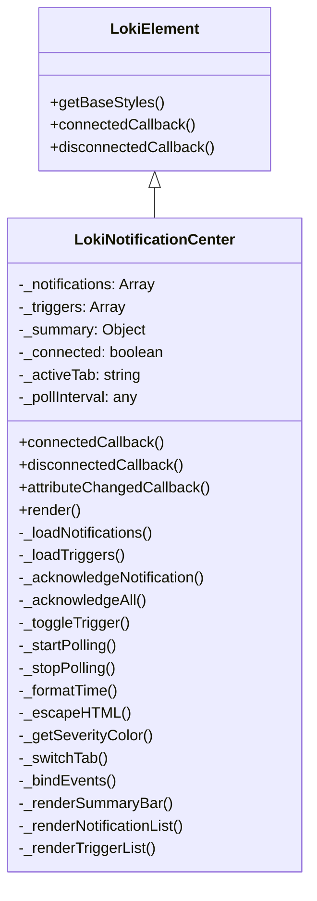

# Loki Notification Center 组件文档

## 目录

1. [概述](#概述)
2. [组件架构](#组件架构)
3. [核心功能](#核心功能)
4. [使用指南](#使用指南)
5. [API 参考](#api-参考)
6. [配置与扩展](#配置与扩展)
7. [注意事项与限制](#注意事项与限制)

---

## 概述

Loki Notification Center 是一个用于展示和管理系统通知的 Web 组件。它提供了通知警报展示、严重程度标识、确认控制以及触发器配置功能。该组件通过每 5 秒轮询 `/api/notifications` 接口来获取最新通知，并提供两个主要标签页：Feed（通知列表）和 Triggers（启用/禁用警报规则）。

### 设计理念

该组件采用模块化设计，基于 LokiElement 基类构建，实现了通知管理的核心功能。它注重用户体验，提供了直观的通知展示、快速确认操作以及灵活的触发器配置界面。

---

## 组件架构

### 类继承关系



### 组件结构

Loki Notification Center 组件主要由以下几个部分组成：

1. **数据获取层**：负责从 API 获取通知和触发器数据
2. **状态管理层**：管理组件内部状态，如通知列表、触发器状态等
3. **渲染层**：负责将数据渲染成可视化界面
4. **事件处理层**：处理用户交互事件
5. **轮询机制**：定期更新数据

---

## 核心功能

### 1. 通知展示

组件以时间倒序展示通知列表，每个通知包含：
- 严重程度标识（颜色编码的圆点）
- 时间戳（相对时间格式）
- 通知消息
- 迭代信息（如适用）
- 确认按钮（未确认通知）

### 2. 通知确认

用户可以：
- 确认单个通知
- 批量确认所有未读通知
- 查看已确认通知（半透明显示）

### 3. 通知摘要

组件顶部显示摘要信息：
- 总通知数
- 未读通知数
- 严重通知数

### 4. 触发器管理

用户可以：
- 查看所有可用的触发器
- 启用/禁用特定触发器
- 查看触发器详细信息，如类型、严重程度、阈值等

### 5. 主题支持

组件支持明暗主题，并能自动检测系统主题设置。

---

## 使用指南

### 基本使用

```html
<loki-notification-center api-url="http://localhost:57374" theme="dark"></loki-notification-center>
```

### 属性说明

| 属性名 | 类型 | 默认值 | 说明 |
|--------|------|--------|------|
| api-url | string | window.location.origin | API 基础 URL |
| theme | string | 自动检测 | 主题设置，可选值为 'light' 或 'dark' |

### API 接口要求

组件需要以下 API 接口：

1. **获取通知列表**
   - 端点：`GET /api/notifications`
   - 响应格式：
     ```json
     {
       "notifications": [
         {
           "id": "通知 ID",
           "timestamp": "ISO 8601 时间戳",
           "message": "通知消息",
           "severity": "严重程度 (critical/warning/info)",
           "acknowledged": false,
           "iteration": 1
         }
       ],
       "summary": {
         "total": 10,
         "unacknowledged": 5,
         "critical": 2
       }
     }
     ```

2. **获取触发器列表**
   - 端点：`GET /api/notifications/triggers`
   - 响应格式：
     ```json
     {
       "triggers": [
         {
           "id": "触发器 ID",
           "enabled": true,
           "type": "触发器类型",
           "severity": "严重程度",
           "threshold_pct": 80,
           "pattern": "模式"
         }
       ]
     }
     ```

3. **确认通知**
   - 端点：`POST /api/notifications/:id/acknowledge`
   - 响应：无内容或成功状态码

4. **更新触发器**
   - 端点：`PUT /api/notifications/triggers`
   - 请求体：
     ```json
     {
       "triggers": [
         {
           "id": "触发器 ID",
           "enabled": true,
           "type": "触发器类型",
           "severity": "严重程度",
           "threshold_pct": 80,
           "pattern": "模式"
         }
       ]
     }
     ```

---

## API 参考

### 类方法

#### connectedCallback()

组件挂载到 DOM 时调用，初始化数据加载和轮询机制。

#### disconnectedCallback()

组件从 DOM 移除时调用，停止轮询机制。

#### attributeChangedCallback(name, oldValue, newValue)

监听属性变化，更新组件状态。

#### render()

渲染组件界面。

### 私有方法

#### _loadNotifications()

异步加载通知数据。

#### _loadTriggers()

异步加载触发器数据。

#### _acknowledgeNotification(id)

确认单个通知。

#### _acknowledgeAll()

确认所有未读通知。

#### _toggleTrigger(triggerId, enabled)

切换触发器启用状态。

#### _startPolling()

启动数据轮询机制，每 5 秒更新一次数据。

#### _stopPolling()

停止数据轮询机制。

#### _formatTime(timestamp)

格式化时间戳为相对时间格式。

#### _escapeHTML(str)

转义 HTML 特殊字符，防止 XSS 攻击。

#### _getSeverityColor(severity)

获取严重程度对应的颜色。

#### _switchTab(tab)

切换标签页。

#### _bindEvents()

绑定事件处理器。

#### _renderSummaryBar()

渲染摘要栏。

#### _renderNotificationList()

渲染通知列表。

#### _renderTriggerList()

渲染触发器列表。

---

## 配置与扩展

### 主题定制

组件使用 CSS 变量来定义样式，您可以通过覆盖这些变量来自定义主题：

```css
loki-notification-center {
  --loki-red: #ef4444;
  --loki-yellow: #eab308;
  --loki-blue: #3b82f6;
  --loki-bg-tertiary: #1f2937;
  --loki-text-muted: #9ca3af;
  --loki-text-secondary: #d1d5db;
  --loki-accent: #3b82f6;
  --loki-bg-card: #111827;
  --loki-border: #374151;
  --loki-transition: 0.2s;
  --loki-border-light: #4b5563;
  --loki-text-primary: #f9fafb;
  --loki-bg-hover: #1f2937;
}
```

### 扩展组件

您可以通过继承 LokiNotificationCenter 类来扩展组件功能：

```javascript
import { LokiNotificationCenter } from './loki-notification-center.js';

class CustomNotificationCenter extends LokiNotificationCenter {
  // 重写或添加新方法
  _loadNotifications() {
    // 自定义加载逻辑
    super._loadNotifications();
  }
  
  // 添加新功能
  _filterNotificationsBySeverity(severity) {
    return this._notifications.filter(n => n.severity === severity);
  }
}

customElements.define('custom-notification-center', CustomNotificationCenter);
```

---

## 注意事项与限制

### 错误处理

- 组件在 API 调用失败时会保持现有数据不变
- 连接状态会通过 `_connected` 属性跟踪，并在界面上显示连接状态

### 性能考虑

- 组件每 5 秒轮询一次 API，可能会产生一定的网络流量
- 大量通知可能会影响渲染性能，建议在 API 端实现分页

### 安全注意事项

- 组件对显示的通知消息进行了 HTML 转义，防止 XSS 攻击
- 建议在 API 端验证和过滤通知内容

### 浏览器兼容性

- 组件使用 Web Components 技术，需要现代浏览器支持
- 建议使用 Chrome、Firefox、Safari 或 Edge 浏览器

### 已知限制

- 组件不支持通知过滤功能
- 组件不支持通知搜索功能
- 组件不支持通知导出功能
