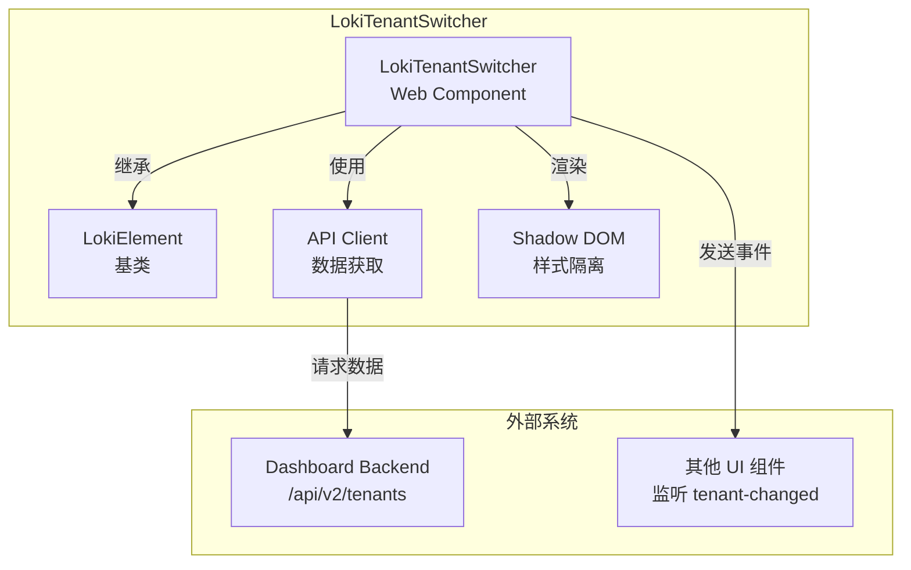
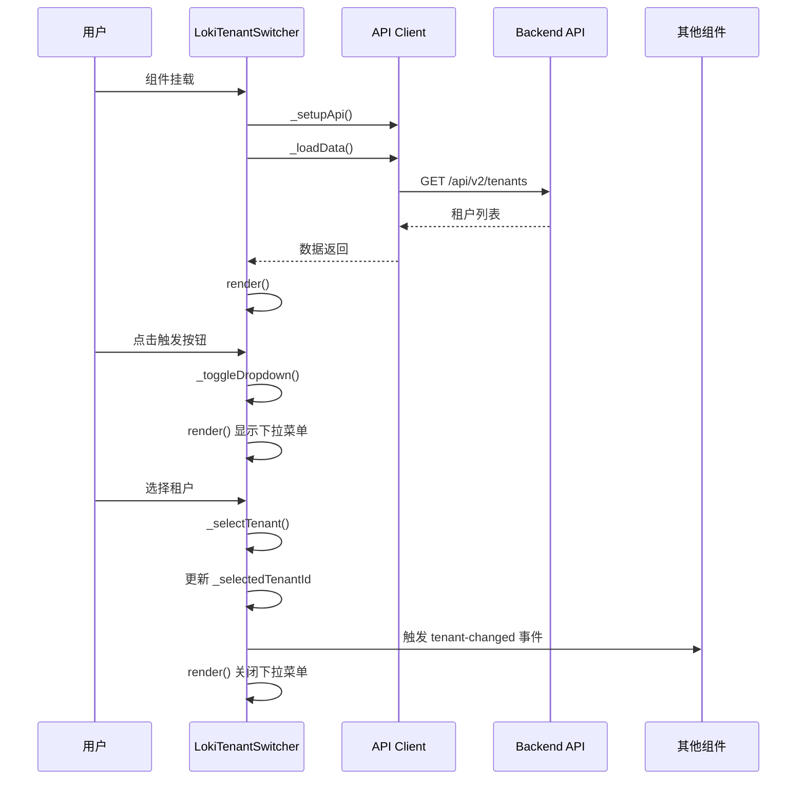

# Loki Tenant Switcher 模块文档

## 概述

Loki Tenant Switcher 是一个 Web Component 下拉组件，专为多租户系统设计，允许用户在不同租户之间快速切换。该组件提供直观的用户界面，支持查看所有租户数据或筛选特定租户数据，并在租户切换时通过自定义事件通知其他组件。

### 主要功能特性

- **租户切换**：提供下拉菜单，允许用户在可用租户之间切换
- **全租户视图**：包含"All Tenants"选项，用于查看无过滤的数据
- **主题支持**：支持亮色和暗色主题
- **事件驱动**：租户切换时触发自定义事件，便于与其他组件集成
- **错误处理**：优雅处理加载失败和错误状态
- **可访问性**：设计考虑了基本的用户体验和视觉反馈

### 设计理念

该组件遵循现代 Web Component 标准，使用 Shadow DOM 实现样式隔离，确保在不同环境中都能保持一致的外观和行为。组件设计注重解耦，通过属性配置和自定义事件与外部系统通信，使其具有高度的可复用性。

## 核心组件详解

### LokiTenantSwitcher 类

`LokiTenantSwitcher` 是该模块的核心类，继承自 `LokiElement`，实现了租户切换的完整功能。

#### 类属性和状态

| 属性 | 类型 | 描述 |
|------|------|------|
| `_loading` | boolean | 标识是否正在加载租户数据 |
| `_error` | string \| null | 存储加载过程中发生的错误信息 |
| `_api` | Object | API 客户端实例，用于与后端通信 |
| `_tenants` | Array | 存储从 API 获取的租户列表 |
| `_selectedTenantId` | string \| null | 当前选中的租户 ID，null 表示"All Tenants" |
| `_dropdownOpen` | boolean | 标识下拉菜单是否打开 |

#### 关键方法

##### `connectedCallback()`

生命周期方法，在组件插入 DOM 时调用。负责设置 API 客户端、加载初始数据，并添加外部点击事件监听器以关闭下拉菜单。

```javascript
connectedCallback() {
  super.connectedCallback();
  this._setupApi();
  this._loadData();

  // 监听外部点击，用于关闭下拉菜单
  this._outsideClickHandler = (e) => {
    if (this._dropdownOpen && !this.contains(e.target)) {
      this._dropdownOpen = false;
      this.render();
    }
  };
  document.addEventListener('click', this._outsideClickHandler);
}
```

##### `disconnectedCallback()`

生命周期方法，在组件从 DOM 移除时调用，清理外部事件监听器防止内存泄漏。

##### `_setupApi()`

初始化 API 客户端，使用 `api-url` 属性指定的地址或当前页面的源地址。

##### `async _loadData()`

从后端 API 异步加载租户列表数据，并更新组件状态。

```javascript
async _loadData() {
  try {
    this._loading = true;
    const data = await this._api._get('/api/v2/tenants');
    this._tenants = Array.isArray(data) ? data : (data?.tenants || []);
    this._error = null;
  } catch (err) {
    this._error = `Failed to load tenants: ${err.message}`;
  } finally {
    this._loading = false;
  }
  this.render();
}
```

##### `_selectTenant(tenantId, tenantName)`

处理租户选择逻辑，更新选中状态，关闭下拉菜单，并触发 `tenant-changed` 自定义事件。

```javascript
_selectTenant(tenantId, tenantName) {
  this._selectedTenantId = tenantId;
  this._dropdownOpen = false;
  this.render();

  this.dispatchEvent(new CustomEvent('tenant-changed', {
    detail: { tenantId, tenantName },
    bubbles: true,
    composed: true,
  }));
}
```

##### `render()`

负责组件的渲染工作，根据当前状态生成相应的 HTML 并附加到 Shadow DOM。

#### 组件属性

| 属性名 | 类型 | 默认值 | 描述 |
|--------|------|--------|------|
| `api-url` | string | 当前页面源地址 | 后端 API 的基础 URL |
| `theme` | string | - | 主题设置，支持 'light' 或 'dark' |

### formatTenantLabel 函数

工具函数，用于格式化租户显示标签。

```javascript
export function formatTenantLabel(tenant) {
  if (!tenant) return 'Unknown';
  if (tenant.slug && tenant.name) {
    return `${tenant.name} (${tenant.slug})`;
  }
  return tenant.name || tenant.slug || 'Unknown';
}
```

**参数**：
- `tenant` (Object)：包含 `name` 和 `slug` 属性的租户对象

**返回值**：
- (string)：格式化后的显示字符串

## 架构与组件关系

### 组件架构图



### 数据流与交互

Loki Tenant Switcher 的工作流程如下：



## 使用指南

### 基本使用

作为 Web Component，Loki Tenant Switcher 可以直接在 HTML 中使用：

```html
<loki-tenant-switcher api-url="http://localhost:57374" theme="dark"></loki-tenant-switcher>
```

### 在 JavaScript 中使用

也可以通过 JavaScript 动态创建和配置：

```javascript
// 创建元素
const tenantSwitcher = document.createElement('loki-tenant-switcher');

// 设置属性
tenantSwitcher.setAttribute('api-url', 'https://api.example.com');
tenantSwitcher.setAttribute('theme', 'light');

// 添加到 DOM
document.body.appendChild(tenantSwitcher);
```

### 监听租户变更事件

要响应租户切换，需要监听 `tenant-changed` 事件：

```javascript
const switcher = document.querySelector('loki-tenant-switcher');

switcher.addEventListener('tenant-changed', (event) => {
  const { tenantId, tenantName } = event.detail;
  
  if (tenantId === null) {
    console.log('已切换到所有租户视图');
  } else {
    console.log(`已切换到租户: ${tenantName} (ID: ${tenantId})`);
  }
  
  // 根据选中的租户更新应用状态或刷新数据
  updateApplicationState(tenantId);
});
```

### 模块导入使用

如果在模块化环境中使用，可以直接导入组件：

```javascript
import { LokiTenantSwitcher, formatTenantLabel } from 'dashboard-ui/components/loki-tenant-switcher.js';

// 使用 formatTenantLabel 工具函数
const tenant = { name: 'Acme Corp', slug: 'acme-corp' };
console.log(formatTenantLabel(tenant)); // "Acme Corp (acme-corp)"
```

## 配置与自定义

### 主题配置

组件支持通过 CSS 变量进行主题自定义。以下是可用的 CSS 变量：

```css
:root {
  /* 基础样式变量 */
  --loki-font-family: 'Inter', -apple-system, sans-serif;
  --loki-text-primary: #201515;
  --loki-text-muted: #939084;
  --loki-bg-card: #ffffff;
  --loki-bg-hover: #1f1f23;
  --loki-border: #ECEAE3;
  --loki-border-light: #C5C0B1;
  --loki-accent: #553DE9;
  --loki-accent-muted: rgba(139, 92, 246, 0.15);
  --loki-red: #ef4444;
}
```

### 数据格式要求

组件期望从 `/api/v2/tenants` 端点接收的数据格式：

```javascript
// 格式 1：直接返回租户数组
[
  { id: 'tenant-1', name: 'Tenant One', slug: 'tenant-one' },
  { id: 'tenant-2', name: 'Tenant Two', slug: 'tenant-two' }
]

// 格式 2：返回包含 tenants 属性的对象
{
  tenants: [
    { id: 'tenant-1', name: 'Tenant One', slug: 'tenant-one' },
    { id: 'tenant-2', name: 'Tenant Two', slug: 'tenant-two' }
  ]
}
```

每个租户对象应该包含：
- `id` (推荐) 或 `slug`：唯一标识符
- `name`：显示名称
- `slug` (可选)：简短标识符，用于显示

## 边缘情况与注意事项

### 错误处理

组件内置了基本的错误处理机制：

1. **API 请求失败**：显示友好的错误信息而不是静默失败
2. **无效数据格式**：安全地处理各种数据格式，避免渲染错误
3. **租户对象不完整**：对缺少必要属性的租户有默认处理逻辑

### 注意事项

1. **事件冒泡**：`tenant-changed` 事件设置为 `bubbles: true` 和 `composed: true`，可以穿过 Shadow DOM 边界冒泡
2. **内存管理**：组件在 `disconnectedCallback` 中清理事件监听器，确保不会造成内存泄漏
3. **租户标识**：组件优先使用 `id` 作为租户标识符，如果没有则回退到 `slug`
4. **样式隔离**：组件使用 Shadow DOM 确保样式不会污染全局，也不会被全局样式影响

### 限制

1. 组件没有提供编程方式设置当前选中租户，只能通过用户交互或扩展组件实现
2. 目前不支持搜索或过滤长租户列表
3. 组件没有提供键盘导航支持，主要依赖鼠标操作
4. 没有租户权限控制逻辑，假设 API 返回的所有租户都是用户可访问的

## 与其他模块的关系

Loki Tenant Switcher 作为 Dashboard UI Components 的一部分，与以下模块有紧密关系：

- **[LokiTheme](loki-theme.md)**：组件继承自 `LokiElement`，共享主题系统
- **[Dashboard Backend](dashboard-backend.md)**：通过 `/api/v2/tenants` API 接口获取租户数据
- **其他 Dashboard UI 组件**：作为多租户系统的基础组件，为其他组件提供租户上下文

更详细的信息请参考相关模块的文档。
