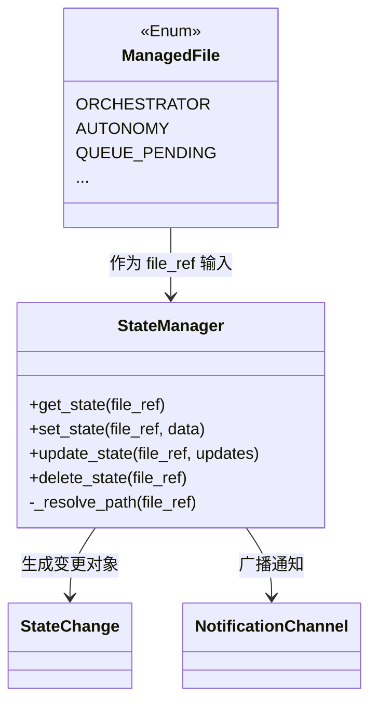
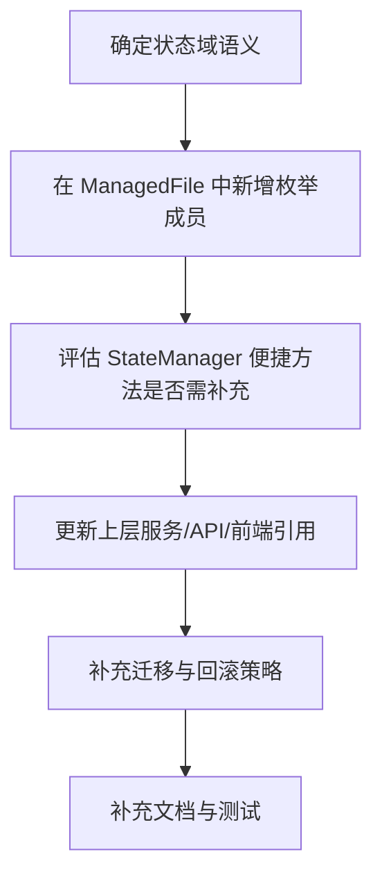
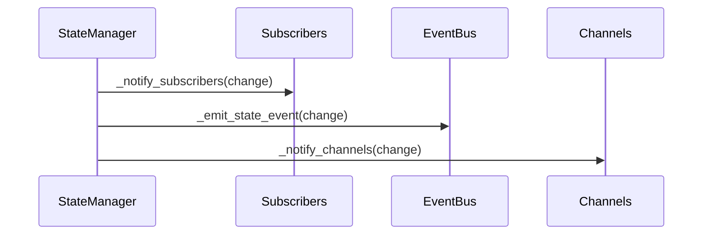

# managed_state_file_contract 模块文档

## 模块概述

`managed_state_file_contract` 对应 `state.manager.ManagedFile` 这一核心契约枚举。它的职责并不是执行状态读写本身，而是**定义“哪些状态文件被系统正式托管”**，并为 `StateManager`、通知通道、事件系统以及上层 API/UI 组件提供一个统一、稳定、可静态检查的文件标识层。

在 Loki Mode 体系中，状态以 JSON 文件形式落盘在 `.loki/` 目录。随着系统演进，如果每个调用方都直接写字符串路径（例如 `"state/orchestrator.json"`），会迅速出现路径拼写错误、目录漂移、语义不一致和升级成本高的问题。`ManagedFile` 的存在本质上是把“字符串常量”升级为“可枚举的系统契约”，让状态管理从“约定”变成“代码级规范”。

从设计角度看，`ManagedFile` 是一个轻量但关键的“边界对象”：

- 它对下游屏蔽了路径细节（统一通过枚举值映射到相对路径）。
- 它让 IDE 自动补全、类型检查和重构工具可以发挥作用。
- 它使 `StateManager` 的批量操作（如 `get_all_states`）具备可预期行为，因为枚举自身就是“托管文件清单”。

---

## 核心组件：`state.manager.ManagedFile`

### 定义

`ManagedFile` 是一个 `str, Enum` 混合枚举，每个成员值均为相对于 `.loki/` 根目录的路径。

```python
class ManagedFile(str, Enum):
    ORCHESTRATOR = "state/orchestrator.json"
    AUTONOMY = "autonomy-state.json"
    QUEUE_PENDING = "queue/pending.json"
    QUEUE_IN_PROGRESS = "queue/in-progress.json"
    QUEUE_COMPLETED = "queue/completed.json"
    QUEUE_FAILED = "queue/failed.json"
    QUEUE_CURRENT = "queue/current-task.json"
    MEMORY_INDEX = "memory/index.json"
    MEMORY_TIMELINE = "memory/timeline.json"
    DASHBOARD = "dashboard-state.json"
    AGENTS = "state/agents.json"
    RESOURCES = "state/resources.json"
```

### 为什么使用 `str, Enum`

选择 `str, Enum`（而不是纯 `Enum`）有两个实际收益。第一，枚举成员可在需要字符串的上下文中自然使用（日志、序列化、比较）。第二，仍然保留枚举语义，调用者不会误传任意字符串。

这使得状态接口普遍支持 `Union[str, ManagedFile]`：既可保留扩展弹性（支持自定义路径），又给核心路径提供强约束。

---

## 托管文件语义目录

下表说明每个枚举成员在系统中的职责边界（语义是架构约定，具体字段结构由对应模块定义）：

| 枚举成员 | 路径 | 主要语义 |
|---|---|---|
| `ORCHESTRATOR` | `state/orchestrator.json` | 编排器运行阶段、流程状态 |
| `AUTONOMY` | `autonomy-state.json` | 自主执行状态、最近执行信息 |
| `QUEUE_PENDING` | `queue/pending.json` | 待处理任务队列 |
| `QUEUE_IN_PROGRESS` | `queue/in-progress.json` | 执行中任务队列 |
| `QUEUE_COMPLETED` | `queue/completed.json` | 已完成任务记录 |
| `QUEUE_FAILED` | `queue/failed.json` | 失败任务记录 |
| `QUEUE_CURRENT` | `queue/current-task.json` | 当前活跃任务快照 |
| `MEMORY_INDEX` | `memory/index.json` | Memory 索引层状态 |
| `MEMORY_TIMELINE` | `memory/timeline.json` | Memory 时间线状态 |
| `DASHBOARD` | `dashboard-state.json` | Dashboard 聚合/展示态 |
| `AGENTS` | `state/agents.json` | Agent 注册与运行概况 |
| `RESOURCES` | `state/resources.json` | 资源占用、容量与分配信息 |

> 说明：字段 schema 并不由 `ManagedFile` 本身定义；它只定义“文件身份”和“位置契约”。

---

## 与 `StateManager` 的关系

`ManagedFile` 的实际价值主要体现在 `StateManager` 的调用链中。



`StateManager` 通过 `_resolve_path(file_ref)` 统一处理 `ManagedFile | str`。当传入 `ManagedFile` 时，使用 `member.value` 作为相对路径拼接 `.loki/` 根目录。这一转换是所有读写、订阅、版本化、冲突解决能力的入口，因此 `ManagedFile` 实际上是这些高级能力的“定位键”。

---

## 运行时数据流（基于 `ManagedFile`）


这个流说明：业务模块不应关心绝对路径和目录组织，而应只关心“我要操作哪个托管状态域”。路径标准化后，才能可靠触发缓存、文件锁、版本历史、事件广播等横切能力。

---

## 典型用法

### 1) 推荐：类型安全的读写

```python
from state.manager import StateManager, ManagedFile

manager = StateManager()

state = manager.get_state(ManagedFile.ORCHESTRATOR, default={})
manager.set_state(ManagedFile.ORCHESTRATOR, {
    **state,
    "currentPhase": "planning"
}, source="orchestrator")
```

这种写法具有最强可维护性：重构时由枚举集中变更，调用方无需散落修改路径字符串。

### 2) 在订阅中过滤特定托管文件

```python
from state.manager import ManagedFile

unsubscribe = manager.subscribe(
    callback=lambda ch: print(ch.file_path, ch.change_type),
    file_filter=[ManagedFile.QUEUE_PENDING, ManagedFile.QUEUE_FAILED],
    change_types=["update", "create"]
)
```

### 3) 兼容扩展路径（慎用）

```python
# 允许，但不属于托管契约范围
manager.set_state("custom/experiment.json", {"enabled": True}, source="lab")
```

这种方式适用于实验功能，但不应替代核心状态域。若某路径进入长期使用，应升级为 `ManagedFile` 成员。

---

## 扩展指南：如何新增一个托管状态文件

新增托管文件不只是加一个枚举值，还涉及契约演进。推荐流程：



实践中应确保以下一致性：

1. 路径位于 `.loki/` 预期目录层级（例如 `state/`、`queue/`、`memory/`）。
2. 命名表达业务语义而非实现细节。
3. 若 UI、API、SDK 会直接消费该状态，需同步更新对应文档与类型契约。

---

## 关键行为约束与边界情况

`ManagedFile` 虽简单，但在系统层面有若干容易忽视的约束：

第一，`ManagedFile` 只定义路径，不定义 JSON 结构。错误字段、字段漂移、跨版本 schema 不兼容，不会在枚举层被发现。

第二，`StateManager.get_all_states()` 仅遍历 `ManagedFile` 成员，因此未纳入枚举的自定义文件不会出现在该聚合结果中。这通常会导致“文件存在但监控面板看不到”的认知偏差。

第三，`AUTONOMY` 与 `DASHBOARD` 位于根级文件，而多数其他状态在子目录中。新增成员时若目录策略不一致，可能影响运维脚本的 glob 规则与备份策略。

第四，枚举成员的值是历史兼容点。直接修改既有路径值会导致旧状态读取失败、版本历史目录错位、外部 watcher 路径断裂。对已发布成员，应优先使用迁移方案而非原地改名。

---

## 与系统其他模块的衔接

在模块树里，`managed_state_file_contract` 属于 **State Management** 的契约层，直接服务 `StateManager`，并间接影响以下模块：

- API Server & Services：通过状态变更驱动运行态可见性与通知。
- Dashboard Backend / Frontend / UI Components：消费状态文件形成任务板、会话控制、监控视图。
- Memory System：`MEMORY_INDEX` / `MEMORY_TIMELINE` 作为内存子系统的文件化接口之一。

建议阅读以下文档以获取完整上下文，而不是在本文件重复细节：

- [State Management.md](State%20Management.md)
- [notification_channels.md](notification_channels.md)
- [state_file_contracts.md](state_file_contracts.md)
- [Memory System.md](Memory%20System.md)
- [api_surface_and_transport.md](api_surface_and_transport.md)

---

## 维护建议

`ManagedFile` 的维护原则可以概括为一句话：**把它当作公共 API，而不是内部常量列表**。任何新增、改名、删除都应视为契约变更，需要评估兼容性、迁移成本和观测面影响。对于跨团队协作场景，优先通过新增成员和双写迁移来演进，避免直接替换已有路径。


## 附录 A：`ManagedFile` 在 `StateManager` 内部如何生效（实现级说明）

虽然本模块的核心契约是 `ManagedFile`，但维护者通常需要理解它在 `state.manager.StateManager` 内部被消费的完整链路。这里给出实现级解释，帮助你在排查问题时快速定位。

### A.1 路径解析与目录保障

`StateManager` 的 `_resolve_path(file_ref)` 会将 `ManagedFile` 的枚举值（相对路径）拼接到 `loki_dir`。这意味着 `ManagedFile.ORCHESTRATOR` 最终落盘路径通常是 `./.loki/state/orchestrator.json`。初始化时 `_ensure_directories()` 会确保 `state/`、`queue/`、`memory/`、`events/` 以及 `state/history/` 存在，避免首次写入失败。


### A.2 读写行为与返回值语义

`get_state(file_ref, default=None)` 先查缓存，再读磁盘。若文件不存在或 JSON 损坏，返回 `default`。这对上层调用方是一个重要语义：**“读不到”不一定是异常，也可能是状态尚未初始化**。

`set_state(file_ref, data, source="state-manager", save_version=True)` 返回 `StateChange` 对象，包含旧值、新值、变更类型和来源。注意 `change_type` 仅按“是否存在旧值”区分 `create/update`，不会根据字段粒度区分复杂操作。

### A.3 广播扇出机制

状态更新完成后，`_broadcast(change)` 会按固定顺序执行三路广播：先通知内部回调订阅者，再向事件总线发送状态事件，最后发送到通知通道（文件/内存等）。任一路失败都不会中断其他路径，这是“可观测性失败不影响主链路”的设计选择。



### A.4 与版本历史的关系

当 `enable_versioning=True` 且 `save_version=True` 时，`set_state` 在写新数据前会将旧状态保存到 `state/history/<file_key>/<version>.json`。`file_key` 来自路径归一化（斜杠替换为下划线），因此 `ManagedFile` 的路径命名会直接影响历史目录名。也就是说，**枚举路径一旦改名，会改变历史定位键**，需要迁移策略。

### A.5 乐观更新为什么依赖枚举稳定性

`optimistic_update()`、`detect_conflicts()`、`sync_with_remote()` 的内部索引键是“解析后的绝对路径字符串”。`ManagedFile` 作为统一入口可以保证所有组件操作同一个逻辑文件；若某些组件绕过枚举传入不同别名路径，会造成“看似同域、实则不同键”的并发追踪分裂。

---

## 附录 B：错误条件、限制与运维注意事项（补充）

第一类高频问题是“外部工具写入了非法 JSON”。`_read_file()` 捕获 `JSONDecodeError` 并返回 `None`，系统不会抛出硬错误，但调用方可能把它当作“文件不存在”。因此在运维上要区分“缺失”和“损坏”，建议结合通知通道或审计日志做告警。

第二类问题是文件监听能力依赖 `watchdog`。当环境未安装依赖时，`enable_watch` 即便传 `True` 也会降级为关闭。表现为：外部直接改文件后，内部缓存可能要等到下一次主动读盘失效检查才体现变化。对一致性敏感场景建议显式检查依赖并在启动日志打印 `HAS_WATCHDOG`。

第三类问题是跨平台锁语义。当前实现使用 `fcntl`，在 POSIX 环境下可靠；在非 POSIX（尤其某些 Windows 环境）可能需要替代锁实现。若你在多平台产品化环境扩展本模块，应优先抽象锁后端。

第四类是历史膨胀。版本历史按完整快照保存，状态体积大且更新频繁时磁盘增长很快。`version_retention` 不是审计策略本身，只是保留上限。合规场景通常还需要外部归档或按周期导出。

---

## 附录 C：面向扩展开发者的最小检查清单

当你准备新增一个受管状态文件时，建议至少完成以下检查：

1. 在 `ManagedFile` 新增成员前，先确认该状态是否会被多个模块共享；若仅局部使用，优先本地文件避免污染全局契约。
2. 若确定纳入契约，评估是否需要在 `StateManager` 增加对应便捷方法（例如 `get_xxx_state` / `set_xxx_state`），避免调用方散落重复逻辑。
3. 为 Dashboard 或 API 消费链路补充字段约定文档，避免“路径稳定但 schema 漂移”。
4. 为迁移版本提供兼容窗口（双写/回填），不要直接修改既有枚举值。
5. 为订阅方补充变更样例，确认 `StateChange.get_diff()` 的输出能支撑下游逻辑。

如果你只记住一句话：**`ManagedFile` 不是常量容器，而是系统状态边界的正式合同。**
