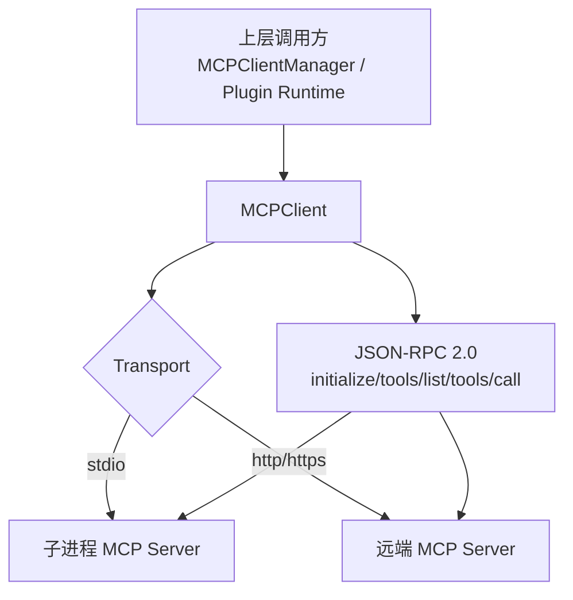
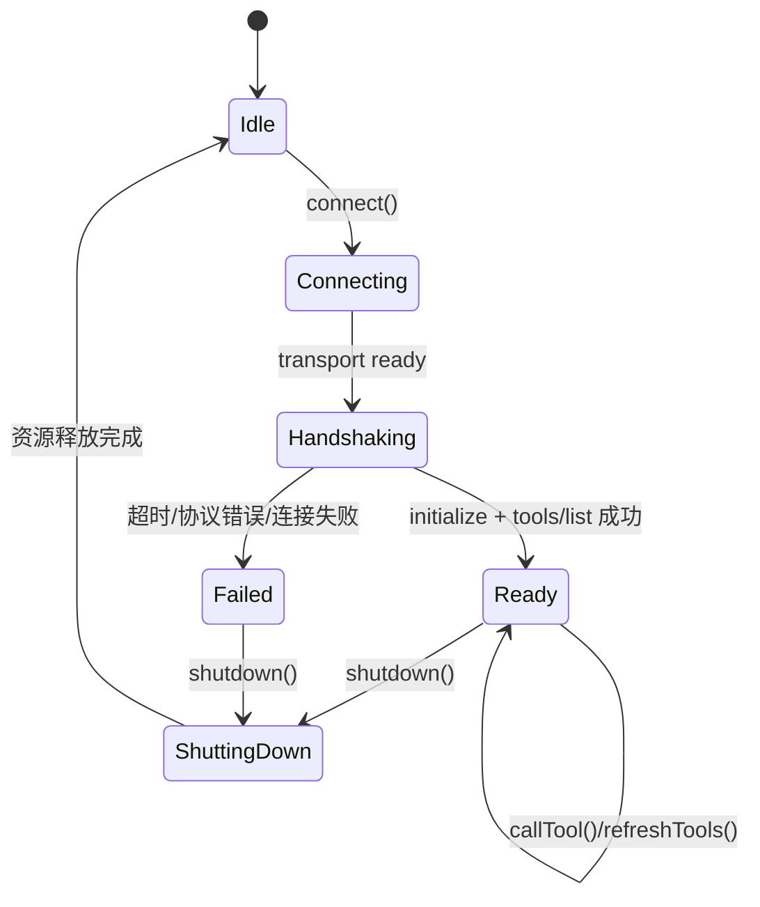
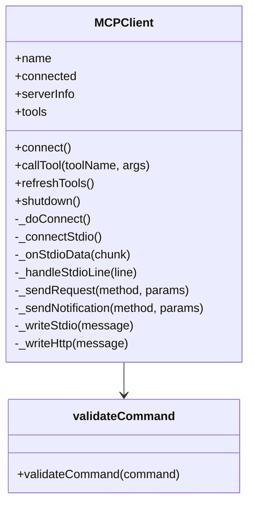
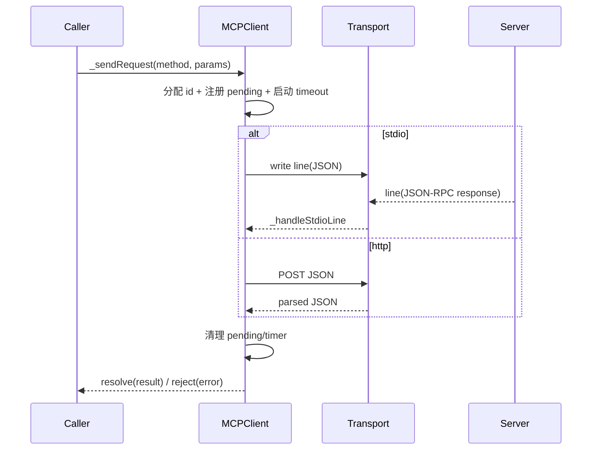

# mcp_client_lifecycle_and_transport 模块文档

## 模块简介与设计动机

`mcp_client_lifecycle_and_transport` 模块的核心是 `src.protocols.mcp-client.MCPClient`。它负责**连接单个 MCP Server**、完成 MCP 协议握手、发现工具、发起工具调用，并在异常或退出时执行资源清理。这个模块存在的根本原因是把“协议语义（initialize / tools/list / tools/call）”与“传输细节（stdio / HTTP）”统一到一个客户端抽象中，避免上层调用方在不同运行环境里重复实现通信逻辑。

从系统分层看，它位于 MCP 客户端侧最底层运行时：上层（如 `MCPClientManager`）负责多实例管理、路由和熔断；本模块负责单连接生命周期与请求收发。建议结合 [MCPClientManager.md](MCPClientManager.md) 与 [transport_adapters.md](transport_adapters.md) 阅读：前者解释“多客户端编排”，后者解释“服务端传输适配”。

---

## 在整体系统中的位置



`MCPClient` 的职责边界非常明确：它不做多服务器路由，不做策略治理，不实现熔断状态机；它只保证“当前这个 server 连接可用且协议正确执行”。这种“单职责 + 可组合”设计让它非常适合被管理器封装。

---

## 核心能力概览

模块支持两种传输模式：

- `stdio`：通过 `child_process.spawn` 启动 MCP server 子进程，使用 NDJSON（每行一条 JSON-RPC 消息）通信。
- `http`：向配置中的完整 endpoint URL 发起 JSON-RPC POST。

除此之外，模块内置了几个关键安全/稳定性机制：

- 阻止 shell 解释器作为 `command`（降低命令注入和误配置风险）。
- stdio 输出缓冲上限 `MAX_BUFFER_BYTES = 10MB`。
- HTTP 响应体上限 `MAX_RESPONSE_BYTES = 50MB`。
- 请求级超时机制（默认 `30s`）。
- 并发 connect 合并（避免重复握手和竞态）。

---

## 生命周期与状态流转



`connect()` 并不是“仅建立 socket/进程连接”，而是完整执行 MCP 客户端启动流程：

1. 若为 stdio，先启动子进程并绑定 stdout/stderr/exit/error。
2. 发送 `initialize` 请求并保存 `serverInfo` / `capabilities`。
3. 发送 `initialized` notification。
4. 发送 `tools/list` 请求并缓存工具列表。
5. 标记 `connected = true` 并发出 `connected` 事件。

这意味着：上层在 `connect()` resolve 后即可直接调用 `callTool()`。

---

## 组件与内部结构



### 外部可见常量与工具函数

#### `BLOCKED_COMMANDS`
用于禁止将 shell/脚本解释器直接作为 server command（如 `bash`、`cmd.exe`、`powershell` 等）。这是一个“默认拒绝高风险入口”的安全策略。

#### `validateCommand(command)`
在构造阶段执行。若 `command` 非字符串、为空，或命中 `BLOCKED_COMMANDS`（基于 basename 和原始小写值，忽略 `.exe`），立即抛错。

**行为影响**：
- 防止把“通用解释器”误当作 MCP server 可执行文件。
- 不能完全替代系统级安全控制，但能显著减少常见误用。

---

## `MCPClient` 详解

### 构造函数

```js
const client = new MCPClient({
  name: 'my-server',
  command: 'node',
  args: ['server.js'],
  // 或者 url: 'https://mcp.example.com/rpc'
  auth: 'bearer',
  token_env: 'MCP_TOKEN',
  timeout: 30000,
});
```

#### 参数

- `name`（必填）：客户端实例名，用于事件与错误消息标识。
- `command` / `args`：stdio 模式下的进程启动参数。
- `url`：HTTP 模式下的完整 endpoint（不会自动拼接路径）。
- `auth`、`token_env`：HTTP Bearer Token 认证配置。
- `timeout`：单次 RPC 请求超时时间（毫秒），默认 `30000`。

#### 初始化副作用

构造函数会：

- 根据 `url` 是否存在决定 `_transport` 为 `http` 或 `stdio`。
- 初始化请求跟踪结构 `_pendingRequests: Map`。
- 安装默认 no-op `error` listener，避免未监听 `error` 导致进程崩溃。

---

### 只读属性（getter）

- `name`：实例名。
- `connected`：是否完成握手并可调用工具。
- `serverInfo`：`initialize` 返回的服务端元信息。
- `tools`：最近一次 `tools/list` 结果缓存。

---

### `connect()` 与 `_doConnect()`

`connect()` 的关键是“幂等 + 并发合并”：

- 若已连接，直接返回缓存的 `tools`。
- 若正在连接，返回同一个 `_connectingPromise`。
- 否则创建新的连接流程，结束后清空 `_connectingPromise`。

这避免了并发场景下重复初始化、重复 `tools/list` 的竞态问题。

---

### `callTool(toolName, args)`

发起 `tools/call` 请求，参数封装为：

```json
{ "name": "toolName", "arguments": { ... } }
```

若未连接会抛错。返回值为对应 JSON-RPC `result`。

**注意**：本模块不做参数 schema 校验；应由上层或 server 端负责。

---

### `refreshTools()`

重新请求 `tools/list` 并覆盖本地缓存 `_tools`。适用于服务端热更新工具列表后的刷新场景。

---

### `shutdown()`

`shutdown()` 是资源回收与一致性保障的关键步骤。它会：

1. 尝试发送 `shutdown` notification（失败忽略）。
2. 将连接状态重置（`_connected = false`，清空工具和服务端信息）。
3. 逐个拒绝所有 pending 请求（错误为 `Client shutting down`）。
4. 若存在子进程：先 `stdin.end()`，500ms 后尝试 `SIGTERM`。
5. 发出 `disconnected` 事件。

这保证调用方不会无限等待“悬挂请求”。

---

## 请求/响应处理机制

### `_sendRequest(method, params)`

这是统一 RPC 发起入口，核心流程：



#### 错误语义

- 超时：`code = 'TIMEOUT'`。
- 远端 RPC error：会转成 `Error`，并附加 `code`、`data`。
- 写入失败/网络错误：直接 reject 底层错误。

---

### `_sendNotification(method, params)`

发送无 `id` 的 JSON-RPC notification。stdio 下同步写入；HTTP 下 fire-and-forget（异常被吞掉）。适合 `initialized`、`shutdown` 这类“尽力发送”消息。

---

## stdio 传输细节

### `_connectStdio()`

- 使用 `spawn(command, args, {stdio: ['pipe','pipe','pipe']})`。
- `stdout` 绑定到 `_onStdioData()`。
- `stderr` 原样透出为 `stderr` 事件。
- `exit` 事件会将 `_connected` 置为 false 并发出 `exit` 事件。

它通过“`error` vs `setImmediate` 竞速”处理 spawn 失败：如果 `ENOENT` 等启动错误先发生，会立即 reject，而不是假连接成功后再超时。

### `_onStdioData(chunk)` 与 `_handleStdioLine(line)`

- 采用行分隔协议（按 `\n` 切割）。
- 缓冲区超限（>10MB）会触发 `error` 并主动 `shutdown()`。
- 解析失败行会被静默忽略。
- 仅处理带 `id` 的响应消息；通知消息不在此层消费。

**隐含约束**：服务端必须按“单行一个 JSON”输出，否则会导致消息拆包失败或丢弃。

---

## HTTP 传输细节

### `_writeHttp(message)`

- 使用 Node `http/https` 原生请求。
- `url` 必须是完整 endpoint；模块不会自动加 `/mcp`。
- 可选 Bearer：当 `auth === 'bearer' && token_env` 时，从 `process.env[token_env]` 取 token。
- 响应体累计超过 50MB 会主动销毁请求并报错。
- 响应结束后做 JSON.parse；失败时返回截断的响应前 200 字符用于诊断。

**限制说明**：

- 不内置重试、退避、代理、TLS 高级配置。
- notification 在 HTTP 模式下仍通过 POST 发送，属于“无结果但有请求成本”的实现。

---

## 事件模型

`MCPClient` 继承 `EventEmitter`，常用事件如下：

- `connected`：握手与工具发现成功。
- `disconnected`：主动关闭后发出。
- `stderr`：stdio 子进程标准错误输出。
- `exit`：子进程退出。
- `error`：内部错误（含缓冲溢出等）。

建议上层总是显式监听 `error`，即便模块内部已注册 no-op listener。

---

## 使用示例

### 1) stdio 模式

```js
const { MCPClient } = require('./src/protocols/mcp-client');

async function main() {
  const client = new MCPClient({
    name: 'local-mcp',
    command: 'node',
    args: ['mcp-server.js'],
    timeout: 20000,
  });

  client.on('stderr', ({ data }) => console.error('[mcp stderr]', data));
  client.on('exit', (e) => console.log('server exited', e));

  await client.connect();
  const result = await client.callTool('search_docs', { query: 'MCP' });
  console.log(result);

  await client.shutdown();
}

main().catch(console.error);
```

### 2) HTTP 模式

```js
const client = new MCPClient({
  name: 'remote-mcp',
  url: 'https://mcp.example.com/rpc',
  auth: 'bearer',
  token_env: 'MCP_API_TOKEN',
  timeout: 30000,
});

await client.connect();
const tools = client.tools;
```

---

## 扩展与定制建议

如果你要扩展该模块，优先遵循“保留对外 API、替换内部策略”的方式。例如增加新传输（WebSocket）时，可复用 `_sendRequest` 的 pending/timeout 框架，只替换 `_write*` 与响应分发逻辑。

在工程实践中，更推荐把横切能力放到上层：

- 熔断与重试：放在 [circuit_breaker_resilience.md](circuit_breaker_resilience.md) + `MCPClientManager` 层。
- 统一路由：放在 [client_manager_and_routing.md](client_manager_and_routing.md)。
- 服务端多传输暴露：放在 [transport_adapters.md](transport_adapters.md)。

这样可以保持 `MCPClient` 轻量、可预测。

---

## 边界条件、错误场景与运维注意事项

1. **命令校验并非沙箱**：`validateCommand` 只拦截高风险解释器名称，不等于对可执行文件做完整安全审计。
2. **stdio 协议格式严格**：服务端输出必须是 NDJSON；混入非 JSON 日志到 stdout 会被忽略或扰乱响应匹配。建议日志走 stderr。
3. **pending 请求可能在进程 exit 前悬挂**：若 server 异常退出，依赖超时或 `shutdown()` 才会全部 reject。上层可在 `exit` 事件里主动触发恢复流程。
4. **HTTP 模式无状态连接**：每个请求独立 POST，不复用会话语义；高频场景需关注性能与服务端限流。
5. **大响应保护可能截断合法业务**：若工具结果天然很大，需在协议层分页或压缩，而不是调高上限后忽略风险。
6. **connect 失败后重连**：当前无自动重连；调用方应捕获异常并按策略重试。

---

## 快速检查清单（实践建议）

- 生产环境务必监听：`error`、`exit`、`stderr`。
- 在上层统一封装重试与熔断，不要在业务代码分散处理。
- 对 `callTool` 参数进行 schema 校验，避免把无效输入推给远端。
- 使用 HTTP 模式时明确配置完整 URL，并保证 token 环境变量存在。
- 退出流程中始终调用 `shutdown()`，避免悬挂子进程和未决 Promise。

---

## 导出项

模块导出如下对象：

- `MCPClient`
- `MAX_BUFFER_BYTES`
- `MAX_RESPONSE_BYTES`
- `BLOCKED_COMMANDS`
- `validateCommand`

这些导出允许上层在单元测试、策略审计或自定义包装器中复用同一套常量与校验行为。