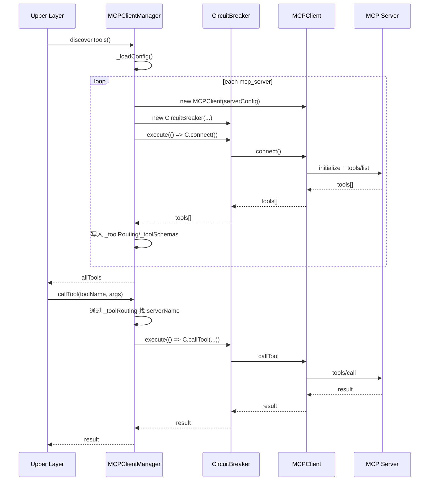
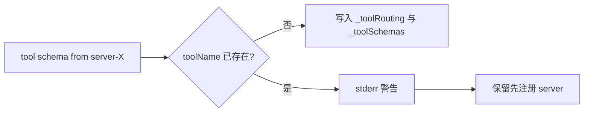

# mcp_client_manager_and_tool_routing 模块文档

## 模块概述

`mcp_client_manager_and_tool_routing` 模块对应 `src/protocols/mcp-client-manager.js`，其核心职责是把“多 MCP Server 连接管理”和“工具调用路由”统一封装在 `MCPClientManager` 中。它存在的根本原因是：在一个运行时中，系统往往需要同时接入多个 MCP 服务端（例如本地 `stdio` 进程型 server 与远端 HTTP server 混合部署），而上层调用方不应该关心某个工具究竟来自哪个 server，也不应该重复实现连接初始化、失败隔离、配置加载和资源回收逻辑。

这个模块通过读取 `.loki/config.json` 或 `.loki/config.yaml` 来发现可用的 MCP 服务器，随后为每个服务器创建一个 `MCPClient` 与 `CircuitBreaker`。`MCPClient` 负责协议通信、工具发现与调用；`CircuitBreaker` 负责在服务抖动时进行失败熔断和恢复尝试；`MCPClientManager` 则建立“toolName -> serverName”的路由表，形成统一入口 `callTool(toolName, args)`。这让上层只需按工具名调用，而不必显式绑定 server。

从系统分层看，该模块位于 MCP Protocol 子树中的 `client_management_and_routing` 层，向下依赖 `mcp_client_lifecycle_and_transport`（`MCPClient`）与 `circuit_breaker_resilience`（`CircuitBreaker`），向上可被插件系统、策略引擎、运行时服务等消费，作为跨 server 工具编排的基础设施。

---

## 设计目标与关键原则

该实现体现了几个明确的工程目标。第一，**配置驱动**：所有 server 连接来源于项目内配置文件，而非硬编码。第二，**调用透明**：调用者只提供工具名和参数，模块内部自动路由。第三，**故障隔离**：每个 server 挂一个独立熔断器，单点异常不会拖垮全部调用路径。第四，**安全优先**：配置目录必须位于 `process.cwd()` 内，且 YAML 解析时屏蔽原型污染关键键。第五，**幂等初始化**：`discoverTools()` 在已初始化后重复调用不会重连 server，而是直接返回缓存工具清单。

这种设计非常适合“工具数量多、来源多、稳定性不均匀”的场景。你可以把它理解为 MCP 版本的“轻量服务注册中心 + 网关路由器”，但它并不做复杂负载均衡，而是采用“首次注册优先”的冲突策略来保持确定性。

---

## 架构与组件关系

```mermaid
flowchart TB
    A[调用方/上层模块] --> B[MCPClientManager]
    B --> C[配置加载 _loadConfig]
    B --> D[路由表 _toolRouting]
    B --> E[工具元数据 _toolSchemas]
    B --> F[客户端池 _clients]
    B --> G[熔断器池 _breakers]

    F --> H[MCPClient(server-A)]
    F --> I[MCPClient(server-B)]

    G --> J[CircuitBreaker(server-A)]
    G --> K[CircuitBreaker(server-B)]

    H --> L[MCP Server A]
    I --> M[MCP Server B]
```

上图展示了模块的控制面与数据面关系。`MCPClientManager` 位于中心：它先从配置加载 server 定义，然后按 server 维度构建两张核心池（客户端池与熔断器池），并在工具发现阶段写入路由表与工具 schema 缓存。运行时调用 `callTool` 时，会先查路由表定位 server，再通过该 server 的熔断器包装调用，最终由 `MCPClient` 发起 JSON-RPC 请求。

---

## 生命周期与处理流程



这个流程说明了两个关键阶段：初始化阶段完成连接和工具注册，运行阶段只做快速路由与执行。模块不会在每次调用时重新发现工具，因此性能开销主要集中在首次 `discoverTools()`。

---

## 核心 API 详解

## `validateConfigDir(configDir)`

`validateConfigDir` 是一个独立导出的安全辅助函数，用于确保配置目录不会越界到项目根目录之外。它通过 `path.resolve(configDir)` 得到绝对路径，再与 `process.cwd()` 进行前缀校验；若目录既不等于项目根，也不在其子路径下，则抛出异常。

- **参数**：`configDir: string`，用户传入的配置目录（默认 `.loki`）。
- **返回值**：`string`，经过校验后的绝对路径。
- **异常**：当路径越界时抛出 `Error`，消息中包含输入路径、解析结果和项目根路径。
- **副作用**：无状态副作用，仅执行路径计算和校验。

这层校验阻断了典型的路径穿越误用（例如通过 `../../` 指向任意目录读取配置）。

## `class MCPClientManager`

### 构造函数 `new MCPClientManager(options)`

构造器接收可选参数并初始化内部状态池。

- **参数**：
  - `configDir`：配置目录，默认 `.loki`，会经过 `validateConfigDir`。
  - `timeout`：默认 RPC 超时（毫秒），默认 `30000`。
  - `failureThreshold`：熔断阈值（连续失败次数），默认 `3`。
  - `resetTimeout`：熔断恢复尝试窗口（毫秒），默认 `30000`。
- **内部状态**：
  - `_clients: Map<serverName, MCPClient>`
  - `_breakers: Map<serverName, CircuitBreaker>`
  - `_toolRouting: Map<toolName, serverName>`
  - `_toolSchemas: Map<toolName, toolSchema>`
  - `_initialized: boolean`

### 只读属性

- `initialized`：当前是否已完成一次工具发现流程。
- `serverCount`：已注册客户端数量（`_clients.size`）。

### `async discoverTools()`

该方法是模块入口中的“初始化 + 注册”核心动作。

它先检查 `_initialized`。若为 `true`，直接返回 `getAllTools()`，实现幂等。若未初始化，则调用 `_loadConfig()` 读取配置；当配置不存在或未定义 `mcp_servers` 时，会把 `_initialized` 置为 `true` 并返回空数组。

有配置时，它会逐个 server：创建 `MCPClient`、创建 `CircuitBreaker`、写入池、通过 `breaker.execute(() => client.connect())` 连接并拉取工具。成功后逐条工具写路由：若同名工具已存在，则输出冲突警告并保留“先注册者”；否则建立新映射并记录 schema。任一 server 连接失败只会写 stderr，不会中断整个发现流程。

- **返回值**：`Promise<Array<ToolSchema>>`，聚合的工具列表。
- **异常行为**：方法本身对单 server 失败进行吞吐处理（日志警告后继续），通常不会因某一 server 失败而 reject。
- **副作用**：建立连接、填充缓存、更新 `_initialized`、向 stderr 输出告警。

### `getToolsByServer(serverName)`

按 server 名取该客户端缓存的工具列表，返回副本（`slice()`），避免调用方直接修改内部数组。

- **参数**：`serverName: string`
- **返回值**：`Array`，若 server 不存在或 tools 为空则返回 `[]`。

### `getAllTools()`

从 `_toolSchemas` 中按插入顺序导出工具 schema 列表。

- **返回值**：`Array<ToolSchema>`
- **注意**：工具冲突情况下只包含“首个注册成功”的 schema。

### `async callTool(toolName, args)`

运行时路由调用。它先查 `_toolRouting`，找不到直接抛错；再取 client 与 breaker，任何一项缺失都抛错；最后通过 breaker 执行 `client.callTool`。

- **参数**：
  - `toolName: string`
  - `args: object`
- **返回值**：`Promise<any>`（由具体 MCP 工具决定）
- **异常**：
  - `No server found for tool`
  - `Client not found for server`
  - `Circuit breaker not found for server`
  - 熔断打开时来自 `CircuitBreaker` 的 `CIRCUIT_OPEN`
  - 下游 RPC/超时异常（来自 `MCPClient`）

### `getServerState(serverName)`

读取某 server 对应熔断器状态，便于观测与健康页展示。

- **返回值**：`'CLOSED' | 'OPEN' | 'HALF_OPEN' | null`（具体字符串取决于实现常量）

### `async shutdown()`

统一关闭资源。它并发调用所有 `client.shutdown()`，然后 `breaker.destroy()`，最后清空全部 Map 并将 `_initialized` 复位为 `false`。

- **副作用**：释放子进程/连接、清理定时器、丢弃路由与 schema 缓存。
- **注意**：调用后若想再次使用，需要重新执行 `discoverTools()`。

### `_loadConfig()`

私有方法，加载配置文件。

优先读取 `config.json`，解析失败记 stderr 并返回 `null`；若 JSON 不存在再尝试 `config.yaml` 并调用 `_parseMinimalYaml`。两者都不存在返回 `null`。

这代表 **JSON 优先于 YAML**。如果两个文件同时存在，YAML 会被忽略。

### `_parseMinimalYaml(raw)` 与 `_parseYamlValue(val)`

实现了一个受限 YAML 解析器，仅支持当前模块所需结构（顶层键、列表项对象、简单标量、内联数组）。它显式跳过 `__proto__` / `constructor` / `prototype`，防止原型污染。

该解析器不是完整 YAML 实现，不支持复杂嵌套、锚点、多行块等高级特性。若配置需要高级语法，建议改用 `config.json`。

---

## 配置格式与示例

## 推荐 JSON 配置（更稳健）

```json
{
  "mcp_servers": [
    {
      "name": "local-tools",
      "command": "node",
      "args": ["./servers/local-mcp.js"],
      "timeout": 15000
    },
    {
      "name": "remote-tools",
      "url": "https://mcp.example.com/rpc",
      "auth": "bearer",
      "token_env": "MCP_REMOTE_TOKEN",
      "timeout": 20000
    }
  ]
}
```

## 最小 YAML 配置（受限子集）

```yaml
mcp_servers:
  - name: local-tools
    command: node
    args: ["./servers/local-mcp.js"]
    timeout: 15000
  - name: remote-tools
    url: "https://mcp.example.com/rpc"
    auth: bearer
    token_env: MCP_REMOTE_TOKEN
```

---

## 使用方式

```javascript
const { MCPClientManager } = require('./src/protocols/mcp-client-manager');

async function main() {
  const manager = new MCPClientManager({
    configDir: '.loki',
    timeout: 30000,
    failureThreshold: 3,
    resetTimeout: 30000
  });

  const tools = await manager.discoverTools();
  console.log('discovered tools:', tools.map(t => t.name));

  const result = await manager.callTool('search_codebase', { query: 'CircuitBreaker' });
  console.log(result);

  console.log('remote-tools breaker state:', manager.getServerState('remote-tools'));

  await manager.shutdown();
}

main().catch(console.error);
```

在生产中通常会将 `discoverTools()` 放在应用启动阶段，把 `callTool()` 用于请求处理路径。若采用长生命周期进程，务必在退出钩子中执行 `shutdown()`，避免子进程或计时器残留。

---

## 工具路由与冲突行为



该模块采用“先到先得”的同名工具策略。也就是说，如果 `server-A` 与 `server-B` 都声明了 `tool.name = "analyze"`，第一个被发现的 server 会占用该名称，后续冲突只记录警告，不覆盖既有路由。

这保证了行为确定性，但也带来限制：你无法在当前实现中按 server 显式选择同名工具。若业务确有多版本共存需求，建议在 server 侧使用命名空间前缀（例如 `repoA.analyze`、`repoB.analyze`）。

---

## 错误处理、边界条件与已知限制

本模块对失败采取“部分可用优先”策略：单个 server 连接失败不会让 `discoverTools()` 整体失败，但后续涉及该 server 工具时会出现路由缺失或调用错误。由于错误主要通过 stderr 输出，若你需要结构化日志，请在宿主层捕获并转发这些信息。

重要边界与限制包括：

- `discoverTools()` 幂等但不自动刷新：初始化后新增配置不会自动生效，除非先 `shutdown()` 再重新发现，或扩展管理器增加热重载逻辑。
- `_parseMinimalYaml` 能力有限：复杂 YAML 可能被忽略或误解析，建议优先 JSON。
- `config.json` 与 `config.yaml` 同时存在时，JSON 覆盖 YAML。
- 同名工具冲突不会报错终止，只发警告。
- `callTool` 依赖预先发现；若未执行 `discoverTools`，路由表为空，会抛出 “No server found for tool”。
- 熔断器按 server 维度生效，不能对单工具单独熔断。

---

## 可扩展性建议

如果你计划扩展该模块，建议沿当前抽象边界演进：

1. 在管理器层新增“路由策略接口”，支持按租户、优先级、版本选择 server，而不仅是固定 toolName 映射。
2. 将冲突策略参数化（例如 `first-win`、`last-win`、`error-on-collision`）。
3. 增加配置热加载与增量更新能力，避免全量 `shutdown()`。
4. 把 stderr 文本日志替换为可注入 logger，便于 observability 统一接入。
5. 若保留 YAML，可换成成熟解析器并继续保留 forbidden key 防护。

---

## 与其他模块的关系

`MCPClientManager` 并不实现底层协议细节，也不直接处理传输、请求超时、进程 I/O 缓冲等问题，这些由 `MCPClient` 负责。同样，它不实现熔断状态机细节，而是委托给 `CircuitBreaker`。因此阅读本模块时应结合以下文档：

- [`mcp_client_lifecycle_and_transport.md`](mcp_client_lifecycle_and_transport.md)：了解 `MCPClient.connect/callTool/shutdown`、stdio/HTTP 传输行为、超时与缓冲限制。
- [`circuit_breaker_resilience.md`](circuit_breaker_resilience.md)：了解 `OPEN/HALF_OPEN/CLOSED` 状态转换、失败阈值和恢复窗口。
- [`transport_adapters.md`](transport_adapters.md)：了解传输层适配器在更广义 MCP 协议栈中的定位。

通过这三层（Manager / Client / Breaker）组合，系统获得了“多端接入 + 稳定调用 + 可观测状态”的 MCP 工具执行基础能力。
