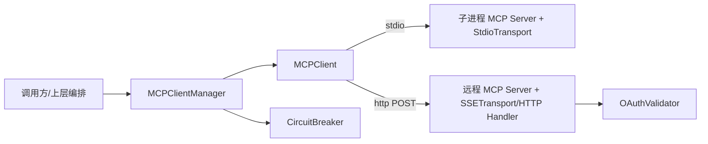
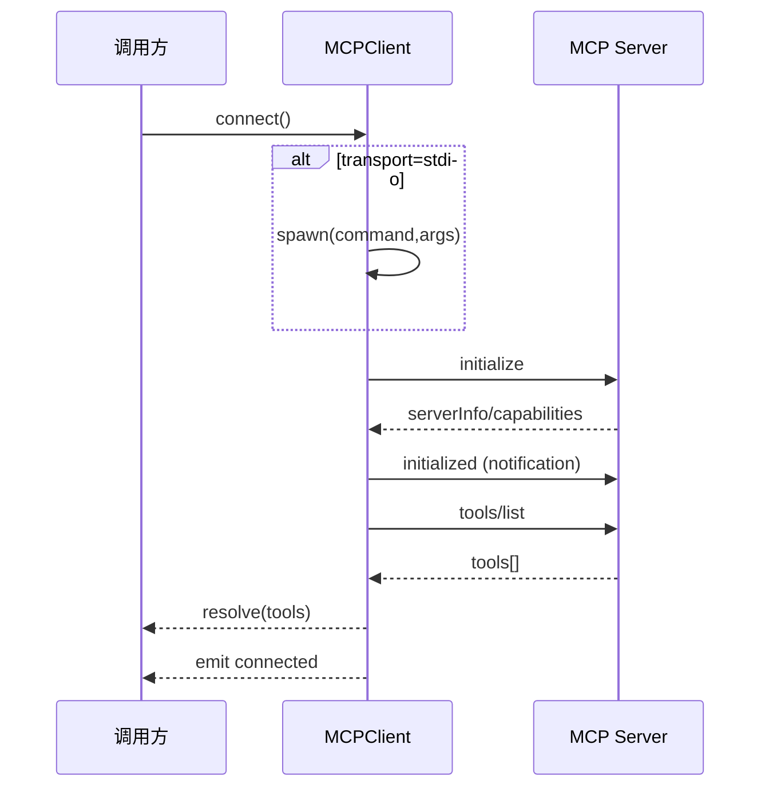
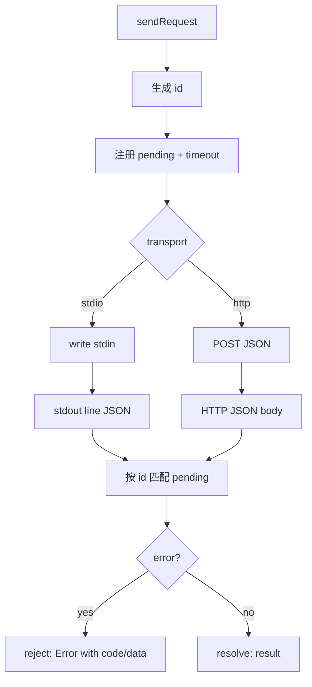

# mcp_client_protocol_runtime 模块文档

## 概述与设计目标

`mcp_client_protocol_runtime` 模块的核心是 `src.protocols.mcp-client.MCPClient`，它实现了 MCP（Model Context Protocol）客户端侧的运行时能力：连接 MCP Server、完成 JSON-RPC 2.0 协议握手、发现工具（`tools/list`）、调用工具（`tools/call`）并在退出时执行优雅关闭。这个模块存在的主要原因，是把“协议细节 + 连接细节 + 安全与健壮性控制”集中到一个可复用组件中，让上层编排器（例如 `MCPClientManager`）可以更专注于多服务路由、熔断与治理，而不必重复处理底层传输和超时控制。

从设计上看，`MCPClient` 兼容两种传输模式：`stdio`（子进程通信）和 `http`（JSON-RPC POST）。这使它既能连接本地命令启动的 MCP 服务，也能连接远程 HTTP 暴露的 MCP endpoint。在可靠性上，它通过请求超时、pending 请求表、连接并发去重（in-flight promise 共享）等机制避免常见运行时问题；在安全上，它通过命令拦截、缓冲区大小限制、HTTP 响应大小上限等机制减少误配置和资源耗尽风险。

## 模块在系统中的位置

在整个 “MCP Protocol” 子系统中，本模块属于**单连接客户端运行时**。它通常被 `MCPClientManager` 聚合管理，并由后者与 `CircuitBreaker` 协同做跨服务容错和工具路由。传输层方面，本客户端会与服务端 `StdioTransport` / `SSETransport` 对接；鉴权方面，HTTP 场景可通过 Bearer Token 与服务端 `OAuthValidator` 策略配合。



上图表示职责分层：`MCPClient` 负责“和一个 server 说话”，`MCPClientManager` 负责“和多个 server 协作并路由工具”，`CircuitBreaker` 负责“失败治理”，`OAuthValidator` 负责“服务端 token 校验”。

> 相关参考：
> - [MCPClientManager.md](MCPClientManager.md)
> - [CircuitBreaker.md](CircuitBreaker.md)
> - [Transport.md](Transport.md)
> - [OAuthValidator.md](OAuthValidator.md)
> - [MCP Protocol.md](MCP Protocol.md)

---

## 核心组件：`MCPClient`

### 类职责

`MCPClient` 是一个继承 `EventEmitter` 的协议客户端。它封装了以下完整生命周期：

1. 基于配置选择传输（stdio/http）
2. 建立连接（stdio 下启动子进程）
3. 发送 `initialize` 请求并缓存服务端能力
4. 发送 `initialized` 通知
5. 获取工具列表并标记 `connected`
6. 对外提供工具调用、工具刷新
7. 执行 shutdown 并清理所有挂起请求与进程资源

### 构造参数与配置字段

构造函数签名：`new MCPClient(config)`

`config` 的关键字段如下（其中 `name` 必填）：

- `name: string`：客户端实例名称，用于事件与错误标识。
- `command?: string`：stdio 模式下要启动的可执行文件。
- `args?: string[]`：stdio 命令参数。
- `url?: string`：HTTP 模式 endpoint 完整 URL（不做路径自动拼接）。
- `auth?: string`：鉴权类型，目前代码中识别 `bearer`。
- `token_env?: string`：Bearer Token 所在环境变量名。
- `timeout?: number`：单次 RPC 请求超时时间（ms），默认 30000。

传输模式选择规则是：`url` 存在则使用 `http`，否则使用 `stdio`。

### 公开属性（getter）

- `name`：实例名。
- `connected`：当前是否已完成握手和工具发现。
- `serverInfo`：初始化结果中的服务端信息。
- `tools`：最近一次工具发现结果。

### 公开方法

#### `connect(): Promise<Array>`

`connect` 会做并发去重：如果已经连接直接返回工具列表；如果正在连接，返回同一个 `_connectingPromise`。这避免多处并发调用导致重复握手或重复进程拉起。

内部流程如下：



#### `callTool(toolName, args): Promise<any>`

该方法要求 `connected=true`，否则抛错。调用时发送 `tools/call`，参数结构为：

```json
{ "name": "<toolName>", "arguments": { ... } }
```

返回值是服务端 JSON-RPC 响应的 `result` 字段（透传）。服务端返回 `error` 时会构造 `Error`，并挂载 `code` 和 `data`。

#### `refreshTools(): Promise<Array>`

已连接状态下重新请求 `tools/list`，并覆盖本地 `this._tools` 缓存，适合服务端工具动态变更后刷新。

#### `shutdown(): Promise<void>`

执行顺序是先通知（`shutdown` notification），再本地清状态，再拒绝所有 pending 请求，再收尾 stdio 进程（`stdin.end` + 延迟 `SIGTERM`）。它会发出 `disconnected` 事件。

注意：如果既没连接也没有进程，`shutdown` 直接返回。

---

## 内部机制详解

### 1) 安全控制：`validateCommand` 与命令拦截

模块导出 `validateCommand(command)` 和 `BLOCKED_COMMANDS`。初始化时如果配置了 `command`，会执行校验。其核心是拒绝 shell 解释器（如 `bash`、`cmd.exe`、`powershell`、`perl`、`ruby` 等），避免“通过 shell 间接执行复杂命令串”的注入风险。推荐直接指定 MCP server 可执行文件。

这一策略不阻止 `node`、`npx`、`python3` 这类常见 runtime launcher（代码注释明确鼓励此类直接执行）。

### 2) stdio 收包与内存上限

`_onStdioData` 把 stdout 拼接到 `_buffer`，按换行分帧（每行一条 JSON-RPC 消息）。为了防止异常服务端持续输出导致内存膨胀，缓冲区有硬上限：

- `MAX_BUFFER_BYTES = 10MB`

超过后会触发 error 事件并调用 `shutdown`。

### 3) HTTP 响应体大小上限

`_writeHttp` 对响应体累计字节数做限制：

- `MAX_RESPONSE_BYTES = 50MB`

超限时通过 `req.destroy(new Error(...))` 终止请求，防止过大响应耗尽内存。

### 4) 请求-响应关联：`_pendingRequests`

每个 `_sendRequest` 都生成递增 id，并写入 `_pendingRequests: Map<id, {resolve,reject,timer}>`。收到响应后按 id 匹配并清理定时器。超时时会删除 pending 并返回 `TIMEOUT` 错误码。



### 5) 连接竞争条件处理

`_connectStdio` 通过 `once('error')` 与 `setImmediate(resolve)` 做竞态控制：如果 spawn 失败（如 ENOENT），通常会先触发 `error`，从而及时 reject，而不是“错误地先 resolve 然后等超时”。这显著改善了错误可观测性。

---

## 事件模型与副作用

`MCPClient` 通过 `EventEmitter` 发出运行时事件，调用方可订阅用于日志、监控与故障处理。

- `connected`：连接成功并完成工具发现后触发，payload 包含 `name` 和 `tools`。
- `disconnected`：shutdown 完成后触发。
- `stderr`：stdio 子进程 stderr 输出透传。
- `exit`：子进程退出时触发，含 `code/signal`。
- `error`：内部错误事件（含缓冲区溢出、spawn 后续错误等）。

一个重要实现细节是：构造函数里注册了默认 no-op `error` listener，避免 Node.js 中“未监听 error 事件导致进程崩溃”的默认行为。上层仍可追加自己的 `on('error', ...)` 实现。

---

## 导出项说明

模块导出：

- `MCPClient`
- `MAX_BUFFER_BYTES`
- `MAX_RESPONSE_BYTES`
- `BLOCKED_COMMANDS`
- `validateCommand`

这让调用方既可直接使用默认类，也可基于常量做策略对齐（例如统一运维告警阈值），或在更高层先行执行命令合法性校验。

---

## 使用示例

### 示例 1：stdio 模式

```javascript
const { MCPClient } = require('./src/protocols/mcp-client');

async function main() {
  const client = new MCPClient({
    name: 'local-mcp',
    command: 'node',
    args: ['server.js'],
    timeout: 20000
  });

  client.on('stderr', (e) => process.stderr.write(`[${e.name}] ${e.data}`));
  client.on('error', (err) => console.error('mcp error:', err.message));

  const tools = await client.connect();
  console.log('tools:', tools.map(t => t.name));

  const result = await client.callTool('search_docs', { query: 'MCP' });
  console.log(result);

  await client.shutdown();
}

main().catch(console.error);
```

### 示例 2：HTTP + Bearer

```javascript
const client = new MCPClient({
  name: 'remote-mcp',
  url: 'https://mcp.example.com/mcp',
  auth: 'bearer',
  token_env: 'MCP_ACCESS_TOKEN',
  timeout: 30000
});

await client.connect();
const out = await client.callTool('summarize', { text: '...' });
```

在这个模式下，`Authorization: Bearer <token>` 会在 `process.env[token_env]` 存在时自动附加。

### 示例 3：与 `MCPClientManager` 协同

如果你的场景是多 MCP server + 工具路由 + 熔断，建议不要直接维护多个 `MCPClient`，而是使用管理器：

```javascript
// 伪代码
const manager = new MCPClientManager({ configDir: '.loki' });
await manager.discoverTools();
const result = await manager.callTool('jira_create_issue', { title: 'Bug' });
```

详细见 [MCPClientManager.md](MCPClientManager.md)。

---

## 配置建议与最佳实践

在工程实践中，建议优先明确以下配置策略：

- 对本地可信服务使用 `stdio`，减少网络暴露面。
- 对远程服务使用 `https` URL，并设置 `auth='bearer'` + `token_env`。
- 为高延迟工具调用提高 `timeout`，但避免无限大。
- 将 `stderr`/`exit`/`error` 事件接入日志系统，便于问题定位。
- 若是多服务场景，把失败治理交给 `CircuitBreaker`（通过 `MCPClientManager` 统一实现）。

---

## 边界条件、错误语义与限制

### 常见错误条件

- 未提供 `config.name`：构造时报错。
- `stdio` 模式缺少 `command`：连接时报错。
- 调用了 `callTool`/`refreshTools` 但未 `connect`：直接抛错。
- 请求超时：错误对象 `code='TIMEOUT'`。
- 服务端 JSON-RPC error：错误对象包含 `code` 和 `data`。
- HTTP 返回非 JSON：报 `Invalid JSON response`。
- stdio 缓冲区或 HTTP 响应体超限：触发错误并中断流程。

### 行为约束与已知限制

- stdio 协议以“每行一条 JSON”为前提，不适合多行 JSON 分帧。
- `shutdown` 通知是尽力而为（异常被吞掉），不保证服务端一定处理。
- HTTP 传输下对 notification 的发送不等待结果（失败被忽略）。
- 客户端不处理服务端主动推送（除非它以请求/响应模型返回可解析结果）。
- URL 必须是完整 endpoint，模块不会自动补 `/mcp` 路径。

### 操作层 gotchas

如果你遇到“连接成功但一直无响应”，应优先检查三件事：其一，stdio server 是否按换行输出 JSON-RPC；其二，HTTP endpoint 是否与 `url` 完全匹配；其三，请求是否因超时被提前 reject（尤其是工具执行时间较长时）。

---

## 可扩展性建议

如果要扩展本模块，建议遵循当前结构边界：

1. **新增鉴权方式**：可在 `_writeHttp` 中扩展 header 注入策略，但避免把完整 OAuth 流程放进客户端，OAuth 生命周期更适合在服务端或独立 auth 模块（参见 [OAuthValidator.md](OAuthValidator.md)）。
2. **新增传输协议**：可保持 `_sendRequest` 的 pending/timer 机制不变，只替换 `_writeXxx` 与回包解析层。
3. **增强观测**：可在 `_sendRequest` 周围添加耗时统计与 trace id 注入，并上报到 observability 模块。

---

## 结论

`mcp_client_protocol_runtime` 提供了一个面向生产可用的 MCP 单客户端实现：它在接口上保持简洁（`connect/callTool/refreshTools/shutdown`），在内部实现上兼顾安全（命令拦截、大小限制）、可靠性（超时与 pending 管理）和工程可维护性（事件模型、传输抽象）。对于单服务场景它可直接使用；对于多服务与治理场景，它是 `MCPClientManager + CircuitBreaker` 组合中的关键基础构件。