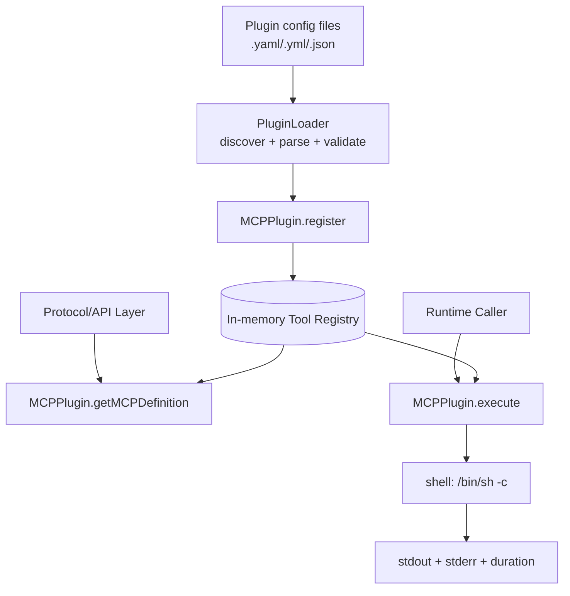
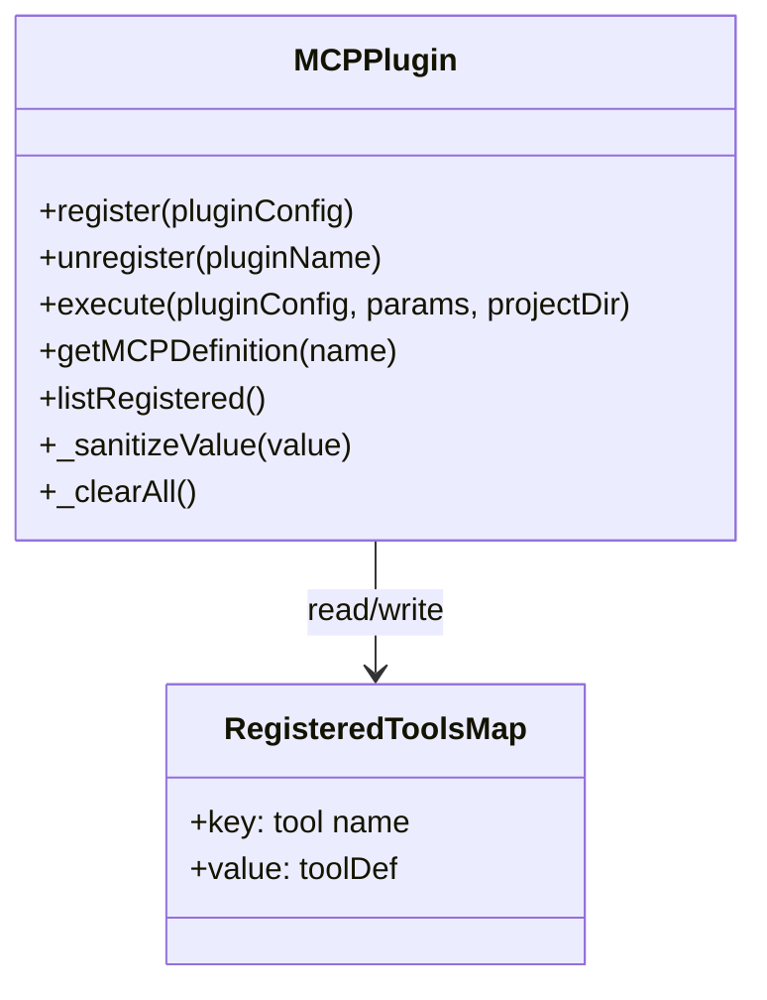
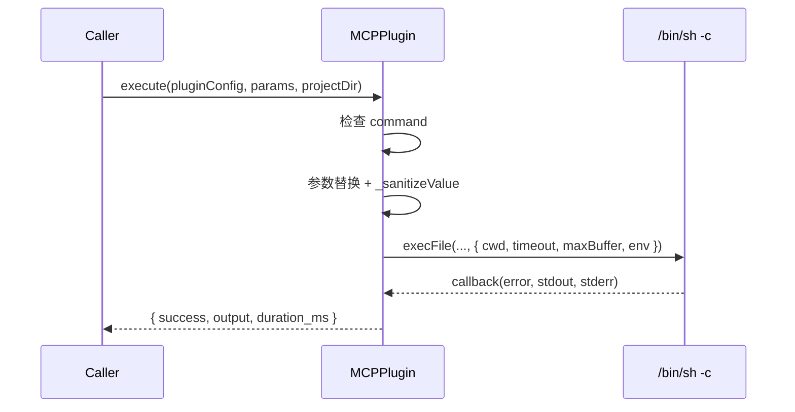
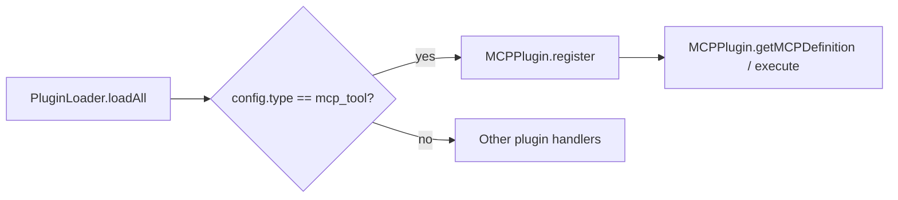
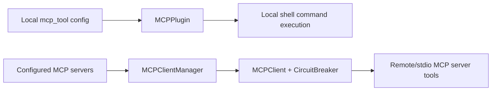

# mcp_plugin 模块文档

## 概述：这个模块解决了什么问题，为什么存在

`mcp_plugin`（核心实现为 `src/plugins/mcp-plugin.js` 中的 `MCPPlugin`）是 Plugin System 中专门面向 **`type: "mcp_tool"` 工具插件** 的运行时模块。它的目标非常明确：把“配置化定义的命令行工具”转成系统可管理、可发现、可执行的 MCP 工具能力。

在实际系统里，很多团队希望快速接入已有 CLI 工具（例如扫描器、格式化器、查询脚本、部署辅助命令），但又不希望每个工具都单独开发一个服务。`MCPPlugin` 通过注册表 + 参数模板替换 + shell 执行的模式，让这类工具以统一抽象接入。它本质上是一个“轻量运行时适配层”，而不是完整的插件治理平台。

这个模块被刻意设计得非常薄：它不负责插件文件发现与 schema 校验（参考 [PluginLoader](PluginLoader.md)），不负责远端 MCP server 的连接与熔断治理（参考 [MCPClientManager](MCPClientManager.md)、[CircuitBreaker](CircuitBreaker.md)），也不负责协议传输层（参考 [MCP Protocol](MCP Protocol.md)）。这种分层让职责更清晰，也让 `MCPPlugin` 在单元测试和嵌入式调用场景中更容易复用。

---

## 模块定位与系统关系

从模块树来看，`mcp_plugin` 位于 `Plugin System` 内部，和 `agent_plugin`、`gate_plugin`、`integration_plugin` 同级。它主要承担本地工具插件（非远程 MCP server）的注册与执行能力。



这张图体现了一个关键事实：`MCPPlugin` 本身并不“发现插件”，它只消费已通过上游校验的配置，并将其运行时化。也就是说，它更像 `registry + executor`，而不是完整生命周期管理器。

---

## 架构设计与内部状态模型

`MCPPlugin` 采用纯静态类实现，依赖模块级私有变量 `_registeredTools: Map` 保存当前进程内的工具注册信息。由于是进程内内存状态，它天然具备高访问速度和低实现复杂度，但不具备跨进程共享和持久化能力。



`toolDef` 在注册时会被标准化，包含 `name`、`description`、`command`、`parameters`、`timeout_ms`、`working_directory`、`registered_at` 等字段。这里的 `working_directory` 目前仅保存，不在 `execute` 中直接决定 `cwd`，实际执行目录优先使用调用时传入的 `projectDir`，否则退回 `process.cwd()`。

---

## 核心组件详解：`src.plugins.mcp-plugin.MCPPlugin`

## 1. `register(pluginConfig)`

`register` 用于接收并登记一个 MCP 工具配置。它进行的是“最小防线”校验：`pluginConfig` 必须存在、`type` 必须是 `mcp_tool`，并且 `name` 不能重复。通过校验后，它会生成标准化工具定义并放入内存注册表。

方法签名（语义）：

```javascript
MCPPlugin.register(pluginConfig)
// => { success: boolean, error?: string }
```

示例：

```javascript
const result = MCPPlugin.register({
  type: 'mcp_tool',
  name: 'grep_todo',
  description: 'Search TODO comments',
  command: "grep -R {{params.keyword}} src",
  parameters: [
    { name: 'keyword', type: 'string', required: true, description: 'keyword to search' }
  ],
  timeout_ms: 5000,
  working_directory: 'project'
});
```

如果同名工具已存在，返回失败对象而不是抛异常，这使上层可按统一的“结果对象”模式处理状态。

---

## 2. `unregister(pluginName)`

`unregister` 从注册表删除指定工具。若工具不存在，返回失败信息；若存在，则删除并返回成功。

```javascript
MCPPlugin.unregister('grep_todo');
// { success: true }
```

这个 API 的语义非常直接，适合配置热更新场景（文件变化后先卸载旧定义再注册新定义）。

---

## 3. `execute(pluginConfig, params, projectDir)`

`execute` 是模块最核心的运行路径。它会读取 `pluginConfig.command`，把模板变量 `{{params.xxx}}` 替换为经过 shell-safe 处理的值，然后通过 `execFile('/bin/sh', ['-c', resolvedCommand], ...)` 执行命令，并返回统一结果。

返回值结构：

```ts
{
  success: boolean;
  output: string;
  duration_ms: number;
}
```

执行流程如下：



关键行为说明：

- 超时控制由 `timeout_ms` 决定，默认 `30000`。
- 缓冲区上限固定为 `1MB`（`maxBuffer: 1024 * 1024`），命令输出过大可能走错误路径。
- `env` 在继承 `process.env` 的基础上追加 `LOKI_MCP_TOOL`，便于日志与观测系统关联工具来源。
- `output` 是 `stdout` 与 `stderr` 的拼接结果（`stderr` 会追加在后）。

调用示例：

```javascript
const result = await MCPPlugin.execute(
  {
    name: 'grep_todo',
    command: "grep -R {{params.keyword}} src",
    timeout_ms: 5000
  },
  { keyword: 'TODO' },
  '/workspace/projectA'
);

if (!result.success) {
  console.error(result.output);
}
```

---

## 4. `getMCPDefinition(name)`

该方法将内部工具定义转换为 MCP 兼容结构，供协议层进行工具发现与输入契约暴露。输出对象包含 `name`、`description` 和 `inputSchema`。

```javascript
const schema = MCPPlugin.getMCPDefinition('grep_todo');
/*
{
  name: 'grep_todo',
  description: 'Search TODO comments',
  inputSchema: {
    type: 'object',
    properties: {
      keyword: { type: 'string', description: 'keyword to search' }
    },
    required: ['keyword']
  }
}
*/
```

这里的 `inputSchema` 是由 `tool.parameters` 线性映射而来，模块本身不做深度语义校验。

---

## 5. `listRegistered()`

返回当前进程内注册表的工具定义数组快照，常用于管理页展示、调试端点、启动后审计输出等场景。

```javascript
const tools = MCPPlugin.listRegistered();
```

---

## 6. `_sanitizeValue(value)` 与 `_clearAll()`

`_sanitizeValue` 是安全关键函数。它把输入值转换为字符串后，采用 POSIX 单引号转义策略，避免参数值直接破坏 shell 语句结构。比如 `a'b` 会转义为 `'a'\''b'` 形式。

`_clearAll` 主要用于测试隔离，会清空注册表。在生产路径中应谨慎暴露。

---

## 配置与使用模式

下面给出一个典型插件配置示例（通常由上游 Loader 读取并校验）：

```yaml
type: mcp_tool
name: run_eslint
description: Run eslint on target path
command: "npx eslint {{params.target}}"
timeout_ms: 20000
working_directory: project
parameters:
  - name: target
    type: string
    required: true
    description: file or directory path
    default: src
```

运行时常见流程：先用 [PluginLoader](PluginLoader.md) 加载配置，再将 `type: mcp_tool` 的条目交给 `MCPPlugin.register`，最后在调用链上按需执行。



---

## 与 MCP Protocol 的关系（避免概念混淆）

很多开发者会把 `MCPPlugin` 和 MCP 客户端管理模块混为一谈。二者职责不同：

- `MCPPlugin`：把本地命令包装成“工具插件”，在本进程执行 shell 命令。
- `MCPClient` / `MCPClientManager`：连接远端或子进程 MCP Server，通过 JSON-RPC 协议调用其工具。

可以把它们理解为两条工具接入路径：



如果你需要远程 server 的连接治理、熔断、协议初始化，请参考 [MCP Protocol](MCP Protocol.md) 与 [MCPClientManager](MCPClientManager.md)；`mcp_plugin` 不是这条链路的替代品。

---

## 数据与控制流细节

`execute` 的控制流可拆成四个阶段：前置检查、模板替换、子进程执行、结果归一化。这个拆分有助于定位问题：

1. 前置检查失败（如缺少 `command`）会直接返回 `success: false`。
2. 模板替换只处理传入 `params` 中存在的键，不会自动校验“必填参数是否真的给了值”。
3. 子进程执行阶段可能出现超时、输出过大、命令不可执行等错误。
4. 结果归一化阶段将 stderr 合并到 output，调用方要自行解析文本语义。

---

## 边界条件、错误行为与已知限制

以下是维护和扩展时最需要关注的点：

- **内存态注册表**：进程重启后注册信息丢失；多实例部署下实例间状态不共享。
- **并发语义**：`Map` 操作在单线程事件循环内通常安全，但不提供分布式一致性。
- **命令模板信任边界**：参数值会转义，但命令模板本身若来自不可信来源仍可能执行危险操作。
- **占位符残留**：若命令包含 `{{params.xxx}}` 而 params 未提供 `xxx`，占位符会原样保留，最终由 shell 解释，可能导致不可预期结果。
- **`working_directory` 字段未强制生效**：当前执行目录来自 `projectDir || process.cwd()`，并不会自动读取配置中的 `working_directory`。
- **默认值逻辑使用 `||`**：例如 `timeout_ms || 30000` 会使 `0` 无法作为有效配置值。
- **平台兼容性**：固定依赖 `/bin/sh`，在非 POSIX 环境需要额外适配。
- **输出截断风险**：`maxBuffer` 为 1MB，超限会触发错误；大输出命令应改为文件落盘或流式处理方案。

---

## 可扩展建议（给维护者）

如果后续需要提升生产可用性，优先可以考虑以下方向：

1. 在 `register` 增加更严格的字段校验（name/command 非空、参数定义合法性、timeout 范围）。
2. 为 `execute` 增加“未替换占位符检测”，提前返回明确错误。
3. 引入可选的允许命令白名单或沙箱策略，降低模板级风险。
4. 支持 `working_directory` 策略真正落地（如 `project`、`repo`、绝对路径策略）。
5. 增加结构化执行结果（分离 stdout/stderr/exitCode），减少上层文本解析负担。
6. 若需要高可用，结合外部存储实现注册表持久化与多实例同步。

---

## 最小集成示例

```javascript
const { PluginLoader } = require('./src/plugins/loader');
const { MCPPlugin } = require('./src/plugins/mcp-plugin');

const loader = new PluginLoader('.loki/plugins');
const { loaded, failed } = loader.loadAll();

for (const item of loaded) {
  if (item.config.type === 'mcp_tool') {
    const r = MCPPlugin.register(item.config);
    if (!r.success) {
      console.error('register failed:', item.path, r.error);
    }
  }
}

console.log('failed plugin files:', failed);
console.log('registered tools:', MCPPlugin.listRegistered().map(t => t.name));

(async () => {
  const result = await MCPPlugin.execute(
    MCPPlugin.listRegistered()[0],
    { target: 'src' },
    process.cwd()
  );
  console.log(result);
})();
```

---

## 相关文档

- 插件发现与校验： [PluginLoader](PluginLoader.md)
- 插件系统总览： [Plugin System](Plugin System.md)
- MCP 协议总览： [MCP Protocol](MCP Protocol.md)
- MCP 客户端编排： [MCPClientManager](MCPClientManager.md)
- 熔断机制： [CircuitBreaker](CircuitBreaker.md)

如果你正在做“本地工具接入”，优先阅读本文 + PluginLoader；如果你在做“远程 MCP server 接入”，优先阅读 MCP Protocol / MCPClientManager 文档。
