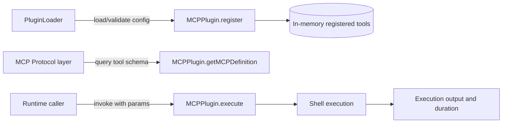
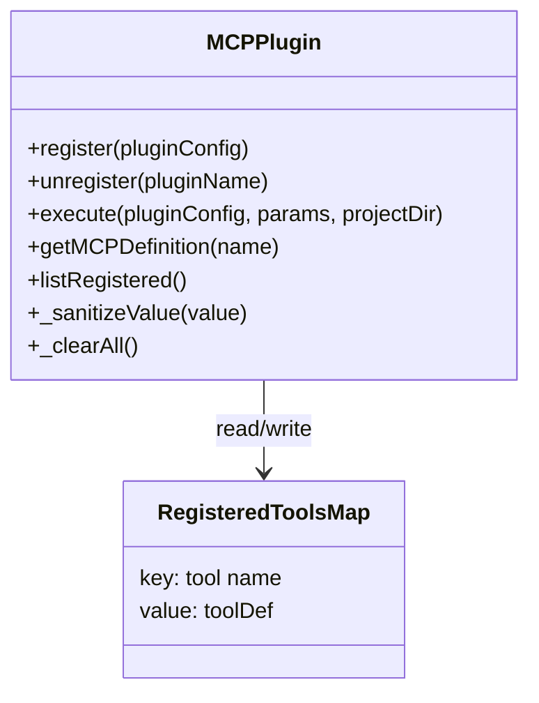
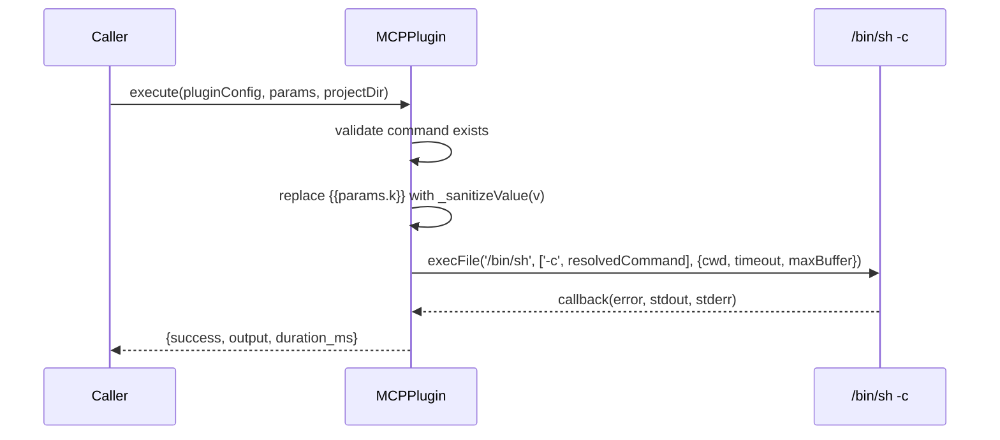
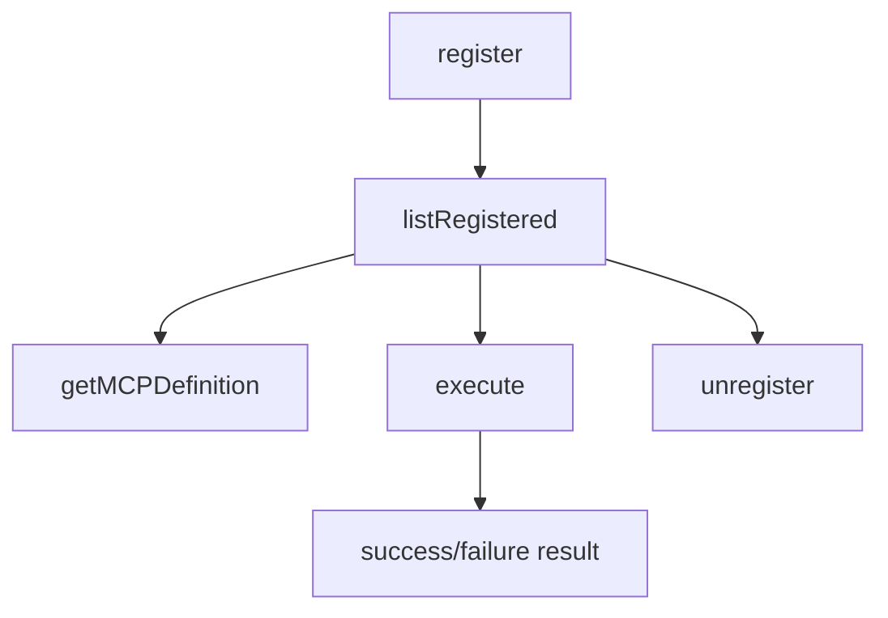

# mcp_tool_plugins 模块文档

## 模块简介

`mcp_tool_plugins` 是 Plugin System 中负责 **MCP 工具型插件（`type: "mcp_tool"`）** 的执行与暴露层，核心实现是 `src/plugins/mcp-plugin.js` 里的 `MCPPlugin` 类。这个模块存在的主要原因，是把“外部命令行能力”以统一插件形式接入系统：上层可以动态注册工具、按 MCP 协议查询工具定义、在运行时执行命令模板，而不需要为每个工具写一套新的服务代码。

从设计上看，这个模块刻意保持了很小的职责边界。它不负责插件文件发现与 schema 校验（这些由 [PluginLoader](PluginLoader.md) 及其相关验证链路负责），也不负责远程 MCP 连接编排（这些由 [MCP Protocol](MCP Protocol.md) 负责）。它只做三件事：**注册表管理、参数替换后执行命令、生成 MCP-compatible tool definition**。这种拆分带来的好处是实现简单、调用直观、可测试性高；代价是它把很多“策略层能力”（权限控制、并发治理、持久化、复杂参数校验）留给了上层系统。

---

## 在整体系统中的定位

在模块树中，该模块位于：

- `Plugin System`
  - `mcp_tool_plugins (current module)`
    - `src.plugins.mcp-plugin.MCPPlugin`

它与周边模块的关系可以理解为：PluginLoader 负责“把配置带进来”，MCPPlugin 负责“把工具记下来并能执行”，MCP Protocol 负责“把工具通过协议暴露/调用”。



上图体现了本模块的核心价值：它把配置驱动的工具转成可执行行为，同时向协议层提供可发现的输入 schema。

---

## 核心架构与内部状态

`MCPPlugin` 采用纯静态类设计，内部状态只有一个模块级变量：`_registeredTools: Map`。因此它更像一个进程内单例服务。



这种架构意味着两个关键运行时特征：第一，注册信息只存在于当前 Node.js 进程内存中；第二，所有调用方共享同一份工具表。

---

## 组件详解：`src.plugins.mcp-plugin.MCPPlugin`

### 1) `register(pluginConfig)`

该方法用于注册一个 MCP 工具插件。它只做了最小验证：`pluginConfig` 必须存在且 `type === "mcp_tool"`，并且 `name` 不能和现有条目重复。验证通过后会构造标准化 `toolDef` 写入 `_registeredTools`。

```javascript
const toolDef = {
  name,
  description,
  command,
  parameters: pluginConfig.parameters || [],
  timeout_ms: pluginConfig.timeout_ms || 30000,
  working_directory: pluginConfig.working_directory || 'project',
  registered_at: new Date().toISOString(),
};
```

**输入参数**
- `pluginConfig: object`，预期来自上游已校验配置。

**返回值**
- 成功：`{ success: true }`
- 失败：`{ success: false, error: string }`

**副作用**
- 修改进程内 `Map`。
- 记录 `registered_at` 时间戳。

**实现注意点**
- 该方法不检查 `name` 是否为空字符串，也不检查 `command` 是否为空；这会把完整性约束转移给上游校验器。
- `timeout_ms || 30000` 会把 `0` 视为 falsy 并回退到 30000，意味着无法通过 `0` 表达“立即超时”语义。

---

### 2) `unregister(pluginName)`

该方法按名称删除工具。若名称不存在会返回失败信息，不抛异常。

**输入参数**
- `pluginName: string`

**返回值**
- 成功：`{ success: true }`
- 失败：`{ success: false, error: string }`

**副作用**
- 从 `_registeredTools` 删除记录。

这个 API 的风格和 `register` 一致：显式成功/失败对象，便于上层统一处理。

---

### 3) `execute(pluginConfig, params, projectDir)`

这是模块最关键的方法。它接收插件配置和入参，完成模板替换后通过 `execFile('/bin/sh', ['-c', resolvedCommand], ...)` 执行命令，并返回标准化执行结果。

**输入参数**
- `pluginConfig: object`
  - 读取 `command`、`timeout_ms`、`name`
- `params: object`
  - 用于替换模板 `{{params.xxx}}`
- `projectDir?: string`
  - 作为进程工作目录 `cwd`

**返回值（Promise）**
```ts
{
  success: boolean,
  output: string,
  duration_ms: number
}
```

**执行流程**



**输出拼装规则**
- `output = stdout + (stderr ? '\n' + stderr : '')`
- 成功时 `output.trim()`
- 失败时优先返回 `output.trim()`，否则 `error.message`，再否则 `'Command failed'`
- 超时时固定返回：`Timeout: command exceeded ${timeoutMs}ms limit`

**副作用**
- 启动子进程。
- 继承环境变量并额外注入 `LOKI_MCP_TOOL=<pluginName|unknown>`。

**关键实现细节**
- 使用 `/bin/sh`，因此是典型 POSIX shell 语义，平台兼容性依赖运行环境。
- `maxBuffer` 固定为 1MB；超过限制时会触发错误路径。
- 仅对传入 `params` 中出现的键做替换；命令中的未匹配占位符会保留原样。

---

### 4) `getMCPDefinition(name)`

该方法把内部工具定义转换成 MCP 常见的工具描述结构：`name`、`description`、`inputSchema`。`inputSchema` 是一个 JSON Schema 风格对象。

**输入参数**
- `name: string`

**返回值**
- 找到：
```json
{
  "name": "toolName",
  "description": "...",
  "inputSchema": {
    "type": "object",
    "properties": {},
    "required": []
  }
}
```
- 未找到：`null`

**schema 构建行为**
- 每个 `parameters[]` 元素映射为 `properties[param.name]`
- 默认 `type` 为 `string`
- `default` 存在时会写入
- `required: true` 时把参数名加入 `required[]`

该方法只做结构映射，不做 schema 语义校验。

---

### 5) `listRegistered()`

返回当前注册表全部工具定义数组（`Array.from(_registeredTools.values())`）。这是一个“快照读取”API，常用于管理面板、调试端点或协议层批量暴露。

---

### 6) `_sanitizeValue(value)`（内部安全关键点）

这个方法将任意值转为字符串后，使用 POSIX 单引号策略进行 shell-safe 包裹：

- 外层加 `'...'`
- 内部 `'` 替换为 `'''\'''`（代码等价表达为 `"'\\''"`）

因此输入 `hello'world` 会转义为 `'hello'\''world'`，可显著降低模板参数注入风险。

> 注意：该方法保护的是“参数值插入点”，并不约束命令模板本身的危险语义。若模板来自不可信来源，仍可能执行高危命令。

---

### 7) `_clearAll()`

清空注册表，主要用于测试隔离。生产路径通常不应直接暴露该能力。

---

## 数据结构与配置约定

一个典型 `mcp_tool` 配置如下：

```json
{
  "type": "mcp_tool",
  "name": "grep_logs",
  "description": "Search logs by keyword",
  "command": "grep -R {{params.keyword}} {{params.path}}",
  "parameters": [
    { "name": "keyword", "type": "string", "required": true, "description": "keyword to search" },
    { "name": "path", "type": "string", "required": true, "default": "./logs" }
  ],
  "timeout_ms": 5000,
  "working_directory": "project"
}
```

需要特别说明的是：`working_directory` 会在注册结果里保存，但当前 `execute()` 并不会读取该字段自动决定 `cwd`，真正生效的是调用时传入的 `projectDir`（或 `process.cwd()`）。这是一处常见误解点。

---

## 典型使用方式

### 注册 + 通过注册表读取执行

```javascript
const { MCPPlugin } = require('./src/plugins/mcp-plugin');

MCPPlugin.register({
  type: 'mcp_tool',
  name: 'echo_tool',
  description: 'Echo input',
  command: 'echo {{params.text}}',
  parameters: [{ name: 'text', type: 'string', required: true }],
  timeout_ms: 3000,
});

const tool = MCPPlugin.listRegistered().find(t => t.name === 'echo_tool');
const result = await MCPPlugin.execute(tool, { text: "hello 'mcp'" }, '/workspace/project');
console.log(result);
```

### 向 MCP 协议层暴露工具定义

```javascript
const def = MCPPlugin.getMCPDefinition('echo_tool');
// 交由 MCP 协议层注册（示意）
// mcpServer.registerTool(def, handler)
```

### 生命周期图



---

## 错误处理、边界条件与限制

本模块整体采用“返回对象而非抛异常”的失败表达方式，但依赖的子进程执行仍可能暴露运行时边界。

### 常见失败场景

- 注册时 `type !== "mcp_tool"`：立即失败。
- 重复注册同名工具：立即失败。
- 执行时无 `command`：返回 `success:false` + 明确错误文本。
- 命令超时：返回超时错误文本。
- 命令执行错误（exit code 非零、buffer 超限等）：走 error 分支，返回拼装输出或错误消息。

### 行为约束与 gotchas

- 注册表是进程内存，重启丢失。
- 未内建并发/速率限制，高并发执行可能压垮宿主机资源。
- `stderr` 会被拼接到 `output`，即使命令成功也可能含“警告输出”。
- 参数占位符替换基于简单正则，未提供参数不会报错，可能把 `{{params.x}}` 原样传给 shell。
- 仅参数值被转义，模板文本不受保护。
- `/bin/sh` 路径在非 Unix 环境（如原生 Windows）通常不可用。
- `working_directory` 当前只记录不执行。

---

## 安全与运维建议

在生产环境中，建议把本模块视为“受控执行器”而不是“安全沙箱”。实践上应在上层增加策略：

- 在加载阶段使用严格 schema 校验与命令白名单。
- 对 `command` 模板来源做可信边界隔离（禁止租户任意自定义高危命令）。
- 为执行增加资源配额（并发数、CPU/内存、IO）与审计日志。
- 结合审计与策略模块进行调用前审批/拦截（可参考 [Policy Engine](Policy Engine.md)、[Audit](Audit.md)）。

---

## 可扩展性与二次开发建议

如果你准备扩展本模块，通常有三条高价值路径：

1. **持久化注册表**：把 `_registeredTools` 从内存 Map 抽象为存储接口（文件/数据库），解决重启丢失问题。
2. **执行后端抽象**：把 `/bin/sh` 执行器替换为可插拔运行器（容器、隔离 worker、远端执行服务）。
3. **参数与 schema 强校验**：执行前基于 `inputSchema` 自动验证 `params`，并在缺参/类型不匹配时提前失败。

这些改造都可在不破坏当前 API 风格的前提下逐步引入。

---

## 与其他文档的关系（避免重复阅读）

- 插件系统全景与其他插件类型：见 [Plugin System.md](Plugin System.md)
- 插件发现与配置加载机制：见 [PluginLoader.md](PluginLoader.md)
- MCP 客户端/服务端编排与协议通信：见 [MCP Protocol.md](MCP Protocol.md)
- 质量门与治理策略（调用前后策略控制）：见 [Policy Engine.md](Policy Engine.md)
- 执行审计与合规留痕：见 [Audit.md](Audit.md)
