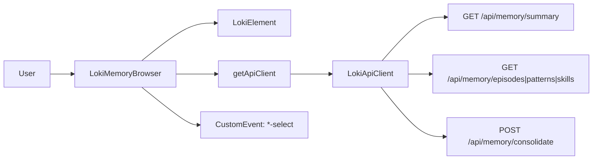

# memory_browser 深度技术解析

`memory_browser` 模块（核心类是 `LokiMemoryBrowser`）本质上是一个“记忆系统观察与操作终端”：它把后端分散的记忆接口（summary、episodes、patterns、skills、economics、consolidate）收敛成一个统一的可视化入口。为什么需要它？因为如果只给工程师一组 API，你能“查到数据”，但很难形成“系统记忆正在如何演化”的整体感。这个组件的设计重点不是炫 UI，而是把**分层记忆模型**（episodic / semantic / procedural）和**实际操作路径**（浏览、钻取、刷新、合并）放到一个连续交互中。

## 这个模块解决了什么问题

在 Loki 的记忆体系里，信息天然是分层、异构且粒度不同的：摘要是统计视角，episode 是时间线事件，pattern 是抽象归纳，skill 是程序化经验。朴素方案是每类数据做一个独立页面，用户在多个页面之间跳转并手动对齐上下文。这种方案的代价很高：上下文切换频繁、细节与总览割裂、操作（比如 consolidation）难以和结果观察形成闭环。

`LokiMemoryBrowser` 选择“单组件多视图”策略：顶部 tab 负责切换数据域，右侧 detail panel 负责当前项深钻，summary 视图承担全局状态与动作入口（`Consolidate Memory` / `Refresh`）。它更像“控制塔”而不是“报表页”：先看全局，再按需下钻，最后可直接触发维护动作。

## 心智模型：它像一个分层档案馆的前台

可以把这个模块想象成“档案馆前台系统”：

- `summary` 是前台大屏，告诉你各库房库存和运行成本。
- `episodes / patterns / skills` 是三类档案目录。
- 点击条目后 detail panel 是“调阅室”，展示该档案完整内容。
- `consolidateMemory` 是“馆内归档整理流程”，会把近期原始记录进一步沉淀为可复用结构。

代码层面，它并不尝试成为状态管理中心，而是一个**轻量 orchestration UI**：内部维护最小状态，真正的数据权威在 API 服务端。

## 架构与数据流



`LokiMemoryBrowser` 的架构角色是前端“聚合网关 + 交互编排器”。它上接用户交互，下接 `LokiApiClient` 的 memory API。基础能力（主题、Shadow DOM、键盘处理骨架）继承自 `LokiElement`，因此这个组件可以专注在 memory 领域逻辑。

启动时，`connectedCallback()` 会做三件事：读取初始 tab、`_setupApi()` 建立 API 客户端、`_loadData()` 触发首屏加载。`_loadData()` 的策略是先拉 `getMemorySummary()` 和 `getTokenEconomics()`，再按当前 tab 执行 `_loadTabData()`。这意味着首屏优先保证“全局可见性”，列表数据按当前上下文懒加载。

用户切换 tab 时走 `_setTab(tab)`：重置 `_selectedItem`，加载对应列表，然后重渲染。用户点击列表项走 `_handleItemClick()`，再分发到 `_selectEpisode()` / `_selectPattern()` / `_selectSkill()` 获取详情，并通过 `dispatchEvent(new CustomEvent(...))` 把选择事件暴露给宿主。

## 核心组件深挖（`LokiMemoryBrowser`）

### 生命周期与配置入口

`observedAttributes()` 监听 `api-url`、`theme`、`tab`。这是该组件的外部控制面。

`attributeChangedCallback()` 的设计很实用：

- `api-url` 变化时更新 `this._api.baseUrl` 并重新加载数据。
- `theme` 变化时调用继承自 `LokiElement` 的 `_applyTheme()`。
- `tab` 变化时调用 `_setTab()`。

这使它既可 declarative（HTML 属性驱动），也可 imperative（运行时动态调整）。但也意味着调用方要意识到：改 `api-url` 是“有副作用”的，会触发网络请求。

### 数据加载编排：`_loadData()` 与 `_loadTabData()`

`_loadData()` 采用“容错优先”的写法：`getMemorySummary()` 和 `getTokenEconomics()` 分别 `.catch(() => null)`，tab 数据列表也用空数组兜底。这样做牺牲了一部分错误可观测性，但换来更高 UI 可用性——某个子接口失败，不会让整个组件崩掉。

`_loadTabData()` 按 `_activeTab` 精确拉取：

- `episodes` -> `listEpisodes({ limit: 50 })`
- `patterns` -> `listPatterns()`
- `skills` -> `listSkills()`

这里隐含了一个性能/一致性权衡：列表默认不分页状态同步，只做一次性拉取（episodes 固定 50 条）。简单、响应快，但在高数据量场景会遇到“可见数据窗口受限”问题。

### 详情选择与事件外发

`_selectEpisode()` / `_selectPattern()` / `_selectSkill()` 的结构一致：记录焦点、拉详情、发事件、渲染、聚焦 detail close 按钮。这个模式体现了两个设计意图：

1. 组件内部完成交互闭环（显示详情）；
2. 同时允许外部系统监听 `episode-select` / `pattern-select` / `skill-select` 做联动。

这是一种“内聚 UI + 外放信号”的典型 Web Component 边界设计。

### 渲染策略：全量重绘 + 事件重绑定

`render()` 每次都重写 `shadowRoot.innerHTML`，然后 `_attachEventListeners()` 重新绑定事件。它没有采用增量 diff（如 React/Vue 虚拟 DOM），而是选择更直接的 template 重建。

为什么在这里是可接受的？因为这个组件的 DOM 规模中等、交互频率低于实时图表类组件，实现复杂度和可维护性优先于极致性能。代价是：如果未来 item 数量级显著增长，需要关注重绘成本与事件绑定成本。

### 明细视图类型识别：`_renderDetail()`

`_renderDetail()` 通过结构特征判断类型：

- `actionLog !== undefined` 视为 Episode
- `conditions !== undefined` 视为 Pattern
- `steps !== undefined` 视为 Skill

这是“鸭子类型”方案，避免了后端额外传 `type` 字段，前端可快速实现。但它依赖响应结构稳定；如果 API 字段演进，这里会静默失配。对新贡献者来说，这是一个重要隐式契约。

### 可访问性与交互细节

这个模块在 a11y 上做得比一般内部工具更细：tablist/tabpanel、list/listitem、键盘方向键切 tab、Enter/Space 激活卡片、ArrowUp/ArrowDown 逐项导航、detail 关闭后焦点回退到来源元素。`_lastFocusedElement` 和 `_focusDetailPanel()` 共同保证了键盘用户不会“迷路”。

## 依赖关系与契约分析

从代码可确认，`LokiMemoryBrowser` 直接依赖：

- `LokiElement`：主题应用、基础样式注入、生命周期基类能力。
- `getApiClient`（返回 `LokiApiClient` 单例）：承载所有 HTTP 调用。
- 浏览器运行时：`CustomEvent`、`requestAnimationFrame`、`alert`、`shadowRoot`。

在 memory API 侧，它调用的方法来自 `LokiApiClient`：
`getMemorySummary`、`getTokenEconomics`、`listEpisodes`、`getEpisode`、`listPatterns`、`getPattern`、`listSkills`、`getSkill`、`consolidateMemory`。

调用方（上游）通常是页面或其他容器组件，以 `<loki-memory-browser ...>` 方式嵌入。它们对该模块的主要契约是：

- 可通过属性控制初始状态（`tab`、`api-url`、`theme`）；
- 可监听 `episode-select` / `pattern-select` / `skill-select` 获取用户选择。

如果后端 API 返回 schema 变化，最先受影响的是 `_renderSummary()`、列表渲染方法和 `_renderDetail()` 的字段访问逻辑。

## 关键设计取舍

这个模块在多处明确偏向“产品可用性与实现简洁”而非“框架化泛化能力”。比如统一组件承载四类视图，避免了跨组件状态同步；再比如数据加载普遍使用失败兜底，优先保证页面可开；再比如 detail 类型靠字段推断，减少协议负担。

对应的代价也很清楚：

- 灵活性：字段推断使前后端耦合在隐式结构上；
- 性能：全量 innerHTML 重绘在大规模列表下扩展性有限；
- 可观测性：局部 `.catch(() => [])` 会吞掉错误细节，不利于问题定位。

在当前“内部运维/观测型”组件定位下，这组权衡是合理的；如果要产品化为高频重度场景，建议逐步引入分页、显式类型字段和更细粒度错误展示。

## 使用方式与示例

最小嵌入：

```html
<loki-memory-browser
  api-url="http://localhost:57374"
  theme="dark"
  tab="summary">
</loki-memory-browser>
```

监听选择事件：

```javascript
const browser = document.querySelector('loki-memory-browser');

browser.addEventListener('episode-select', (e) => {
  console.log('selected episode', e.detail);
});

browser.addEventListener('pattern-select', (e) => {
  console.log('selected pattern', e.detail);
});

browser.addEventListener('skill-select', (e) => {
  console.log('selected skill', e.detail);
});
```

动态切换 API 端点：

```javascript
browser.setAttribute('api-url', 'https://new-host.example.com');
// 这会触发内部重新加载
```

## 新贡献者最该注意的坑

首先，`_setTab()` 不校验 tab 合法性；传入未知值会导致 `_loadTabData()` 不请求任何数据，而 `render()` 默认回退到 summary。表现上“看起来还能用”，但状态其实不一致，调试时容易误判。

其次，`_loadData()` 与 `_setTab()` 都是异步，且没有请求竞态控制（如 request token/abort）。快速切 tab 或快速刷新时，旧请求可能晚到并覆盖新状态。当前数据规模下问题不大，但在慢网路/高延迟下会出现“闪回”。

再次，`_triggerConsolidation()` 使用 `alert` 做反馈，属于阻塞式 UI；如果要接入统一通知中心，需要替换为非阻塞提示并处理并发点击保护。

最后，`_renderDetail()` 的类型判定是隐式契约，修改 API schema 时必须同步更新这里，否则会出现“点击有数据但详情空白”的软故障。

## 参考文档

- [Memory and Learning Components](Memory and Learning Components.md)
- [LokiMemoryBrowser](LokiMemoryBrowser.md)
- [API 客户端](API 客户端.md)
- [Core Theme](Core Theme.md)
- [Memory System](Memory System.md)
- [API Server & Services](API Server & Services.md)
