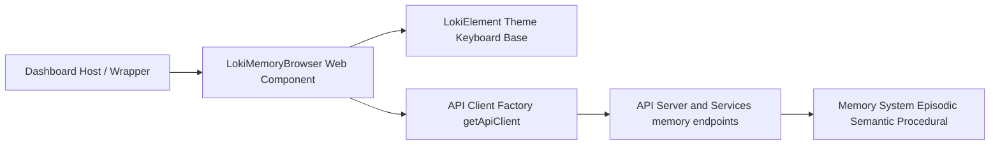
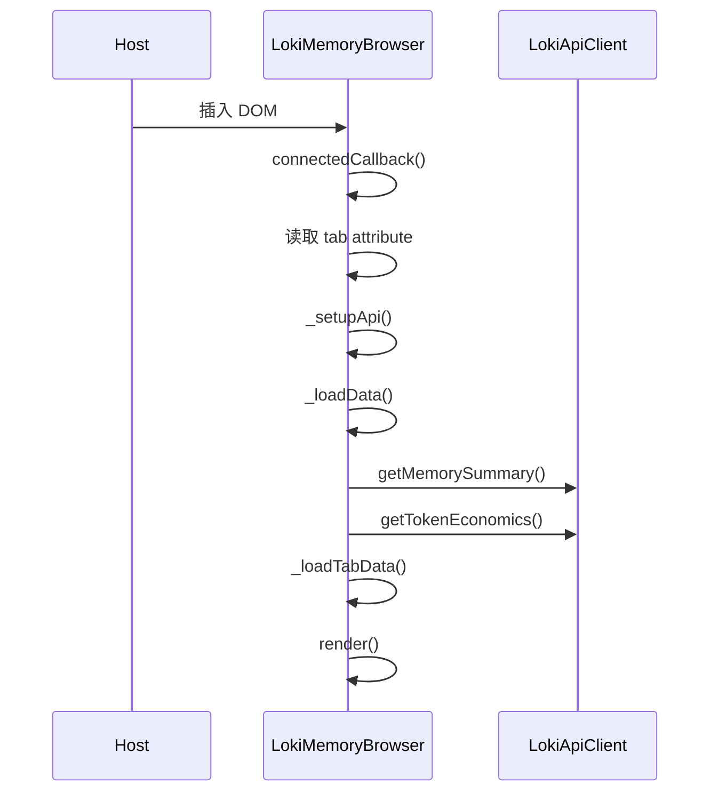
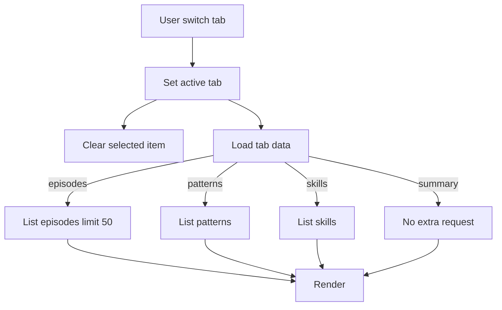
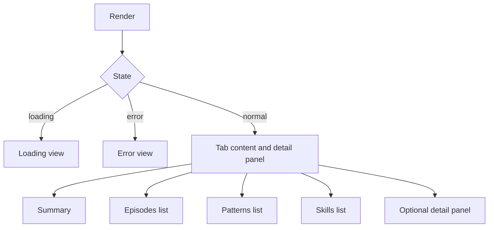

# memory_browser_component 模块文档

## 概述与设计目标

`memory_browser_component` 对应 `dashboard-ui/components/loki-memory-browser.js` 中的 `LokiMemoryBrowser` Web Component（标签名：`<loki-memory-browser>`）。它是 Loki Dashboard 在“Memory and Learning Components”分组下的核心浏览器组件，专门用于可视化 Memory System 的三层记忆能力：episodic（情节记忆）、semantic（语义模式）、procedural（技能流程），并通过统一的标签页交互把“摘要总览 + 明细钻取 + 手动 consolidation 控制”整合在同一个面板中。

这个模块存在的核心原因，是把原本分散在后端多个 memory API 端点的数据整合成一个“低认知负担”的操作界面。对于运维与开发者来说，它不仅展示状态（summary、token economics），还支持动作（refresh、consolidate）与深度检查（episode/pattern/skill 详情），因此它既是可观测面板，也是轻量控制台。

从架构上看，该组件刻意保持“前端薄逻辑”：不在浏览器侧做复杂建模，而是依赖 `LokiApiClient` 提供的数据契约，配合 `LokiElement` 提供主题与可访问性基础能力。这样的设计让组件扩展成本低：新增 memory 维度时可以沿着“新增 tab + 新增 API 方法 + 新增 detail 渲染分支”的路径演进，而不需要改动全局框架。

---

## 模块定位与系统关系

`memory_browser_component` 位于 Dashboard UI Components 层，向上被前端 wrapper 或宿主页面使用，向下依赖统一 API Client 调用 API Server 的 memory 端点，再由后端连接 Memory System（`SemanticMemory`、`EpisodicMemory`、`ProceduralMemory`、`UnifiedMemoryAccess` 等）。



上图强调了组件的“桥接角色”：它不直接操作 memory 引擎，而是通过 API 合约进行读写。这样可以把 UI 迭代与 memory 内核迭代解耦。关于 API 客户端与主题体系的细节，建议分别参考 [API 客户端.md](API%20客户端.md) 与 [Core Theme.md](Core%20Theme.md)。

---

## 核心组件：`LokiMemoryBrowser`

### 类职责

`LokiMemoryBrowser extends LokiElement`，主要负责四类职责：

1. 生命周期内的数据拉取与状态管理（loading/error/data）。
2. Tab 切换与按需加载（summary/episodes/patterns/skills）。
3. 列表项钻取与 detail 面板展示。
4. 用户动作触发（refresh/consolidate）与外部事件派发。

### 对外属性（Attributes）

- `api-url`：API 基地址。默认 `window.location.origin`。
- `theme`：`light` / `dark`（以及继承自 `LokiElement` 的扩展主题机制）。
- `tab`：初始 tab，支持 `summary | episodes | patterns | skills`。

组件通过 `observedAttributes` 监听上述属性变化，变化后执行对应副作用（例如重载数据、应用主题、切换 tab）。

### 对外事件（Custom Events）

- `episode-select`：选中某 episode 明细后触发，`detail` 为 episode 对象。
- `pattern-select`：选中某 pattern 明细后触发，`detail` 为 pattern 对象。
- `skill-select`：选中某 skill 明细后触发，`detail` 为 skill 对象。

这些事件让父级容器可以在“不侵入组件内部状态”的前提下，响应用户选择（例如联动日志面板、埋点分析或打开侧边抽屉）。

---

## 内部状态模型

组件使用一组私有字段维护 UI 状态与数据缓存：

- 视图状态：`_activeTab`、`_loading`、`_error`、`_selectedItem`。
- API 依赖：`_api`。
- 数据集合：`_summary`、`_episodes`、`_patterns`、`_skills`、`_tokenEconomics`。
- 可访问性/焦点：`_lastFocusedElement`。

这些状态都采用“渲染即覆盖”的方式驱动 `shadowRoot.innerHTML`，即每次 `render()` 会重建 DOM 并重新绑定监听器。该策略简单直接，但意味着开发扩展时要注意 listener 重绑与临时状态丢失问题。

---

## 生命周期与主流程

### 启动流程



`connectedCallback()` 先调用父类逻辑（主题、键盘基础处理、初始 render），然后执行组件自己的 API 初始化与数据加载。由于父类和子类都会触发 render，初始化阶段会有多次渲染，这是预期行为，不影响正确性。

### Tab 数据按需加载流程



这里采用“summary 全局预加载 + 其他 tab 按需拉取”的折中方案：首屏更快展示关键指标，详细列表在真正访问时再取。

---

## 关键方法详解

### 1) `_setupApi()`

该方法读取 `api-url` attribute（缺省为当前 origin）并通过 `getApiClient({ baseUrl })` 获取客户端实例。由于 `LokiApiClient` 采用按 `baseUrl` 复用实例的单例缓存策略，同 URL 下多个组件会复用同一个客户端对象。

副作用是设置 `this._api`，后续所有数据调用都经由它完成。

### 2) `_loadData()`

这是组件总加载入口。执行顺序是：

1. 设置 `_loading=true`、清空 `_error`，立即 render。
2. 请求 `getMemorySummary()` 与 `getTokenEconomics()`（两者都带降级 `catch`，失败时返回 `null`）。
3. 调用 `_loadTabData()` 拉取当前 tab 数据。
4. 外层 `catch` 捕获异常写入 `_error`。
5. 最后 `_loading=false` 并 render。

它的设计重点是“容错优先”：summary 和 economics 失败不会直接中断主流程，因此页面尽可能可用。

### 3) `_loadTabData()`

按 `_activeTab` 分派 API：

- `episodes` → `listEpisodes({ limit: 50 })`
- `patterns` → `listPatterns()`
- `skills` → `listSkills()`

每个分支都有本地 `.catch(() => [])` 降级，避免单个列表异常把组件打入 error 态。这个策略提升了稳健性，但也会“静默吞错”，如果需要强诊断，可在扩展时增加可观测日志上报。

### 4) `_setTab(tab)`

变更激活 tab 后重置 `_selectedItem`，并异步加载 tab 数据后 render。它不会校验 tab 是否属于已知集合，因此传入未知值时会进入 default 渲染 summary；这是一种宽容行为，但可能掩盖调用方配置错误。

### 5) `_selectEpisode/_selectPattern/_selectSkill`

三者结构一致：记录当前焦点 → 拉取明细 → 派发 `*-select` 事件 → render → 焦点移动到 detail close 按钮。该流程体现了良好的键盘可访问性：用户在关闭 detail 后还能回到先前卡片。

### 6) `_triggerConsolidation()`

调用 `consolidateMemory(24)` 触发过去 24 小时的 consolidation，并通过 `alert` 回显结果统计（`patternsCreated/patternsMerged/episodesProcessed`），然后重新 `_loadData()`。失败则 `alert` 报错。

这是一个“运维动作入口”，但目前 UX 仍偏基础（浏览器 alert）。若要企业化，可替换为统一通知中心组件并支持二次确认。

### 7) `_renderSummary/_renderEpisodes/_renderPatterns/_renderSkills/_renderDetail`

这些方法输出 HTML 字符串并由主 `render()` 拼装。`_renderDetail()` 通过“字段存在性”判断类型：

- `actionLog !== undefined` 视为 Episode
- `conditions !== undefined` 视为 Pattern
- `steps !== undefined` 视为 Skill

这种鸭子类型判断简洁，但要求后端返回结构稳定且不同类型关键字段不冲突。

### 8) `_attachEventListeners()`

每次 render 后重新挂载事件，覆盖：

- tab click + 左右箭头切换
- item card click + Enter/Space 激活 + 上下箭头导航
- close detail
- consolidate
- refresh

由于 DOM 每次重建，旧监听器会随旧节点回收，整体可控。

### 9) `_escapeHtml(text)`

使用 `textContent` 转义防止 XSS 注入，是该组件最关键的安全兜底之一。凡展示外部字符串（任务名、pattern 文本、skill 描述等）都应保持经过此方法处理。

---

## 关键方法签名速查（参数、返回值、副作用）

为了便于维护时快速定位接口行为，下面给出核心方法的签名级说明。这里不重复实现细节，而强调调用契约与状态影响。

| 方法 | 参数 | 返回值 | 主要副作用 |
|---|---|---|---|
| `_setupApi()` | 无 | `void` | 初始化 `this._api`，读取 `api-url` 或当前 `origin` |
| `_loadData()` | 无 | `Promise<void>` | 设置 loading/error、请求 summary/economics、按 tab 拉数据、触发两次 render |
| `_loadTabData()` | 无（依赖 `_activeTab`） | `Promise<void>` | 写入 `_episodes/_patterns/_skills` 中的一个集合 |
| `_setTab(tab)` | `tab: string` | `void` | 更新 `_activeTab`、清空 `_selectedItem`、异步加载 tab 数据并 render |
| `_selectEpisode(episodeId)` | `episodeId: string` | `Promise<void>` | 拉取 episode 明细、派发 `episode-select`、打开 detail、管理焦点 |
| `_selectPattern(patternId)` | `patternId: string` | `Promise<void>` | 拉取 pattern 明细、派发 `pattern-select`、打开 detail、管理焦点 |
| `_selectSkill(skillId)` | `skillId: string` | `Promise<void>` | 拉取 skill 明细、派发 `skill-select`、打开 detail、管理焦点 |
| `_closeDetail()` | 无 | `void` | 关闭 detail、恢复上一次焦点元素 |
| `_triggerConsolidation()` | 无（内部固定 `24` 小时） | `Promise<void>` | 调用 consolidation API、弹窗提示结果、重新加载数据 |
| `_renderSummary()` | 无 | `string`（HTML） | 读取 `_summary/_tokenEconomics` 生成摘要视图 |
| `_renderEpisodes()` | 无 | `string`（HTML） | 读取 `_episodes` 生成列表视图 |
| `_renderPatterns()` | 无 | `string`（HTML） | 读取 `_patterns` 生成列表视图 |
| `_renderSkills()` | 无 | `string`（HTML） | 读取 `_skills` 生成列表视图 |
| `_renderDetail()` | 无 | `string`（HTML） | 读取 `_selectedItem` 并按类型渲染右侧明细面板 |
| `_attachEventListeners()` | 无 | `void` | 为 tabs、cards、close/consolidate/refresh 绑定事件 |
| `_handleItemClick(card)` | `card: HTMLElement` | `void` | 根据 `data-type` 分发到不同 `_select*` |
| `_navigateItemCards(currentCard, direction)` | `currentCard: HTMLElement`, `direction: 'next'|'prev'` | `void` | 在条目列表内移动键盘焦点 |
| `_escapeHtml(text)` | `text: string` | `string` | 文本转义，降低 XSS 风险 |


## 渲染结构与交互说明



在正常态下，组件主区是 `content-main`，右侧可追加 `detail-panel`。这种双栏布局可以保持列表上下文不丢失，适合“浏览-钻取-返回”的高频操作。

---

## API 依赖与数据契约（组件视角）

组件直接使用的 API client 方法如下：

- `getMemorySummary()`
- `getTokenEconomics()`
- `listEpisodes({ limit: 50 })`
- `getEpisode(id)`
- `listPatterns()`
- `getPattern(id)`
- `listSkills()`
- `getSkill(id)`
- `consolidateMemory(sinceHours)`

这些方法来自 `LokiApiClient` 的 Memory API 区域。更完整的请求/响应契约可参考 `api.types.memory.*` 所在文档（如 [api_type_contracts.md](api_type_contracts.md)）以及 memory 后端实现文档（如 [Memory System.md](Memory%20System.md)）。

---

## 可访问性（A11y）与键盘行为

该组件在可访问性方面做了较完整的基础实现：

- Tabs 使用 `role="tablist"` / `role="tab"` / `aria-selected` / `aria-controls`。
- 内容区使用 `role="tabpanel"` 并关联 active tab。
- 列表容器使用 `role="list"`，条目使用 `role="listitem"`。
- Item 卡片可通过 `tabindex="0"` 聚焦，并支持 Enter/Space 激活。
- 上下箭头可在 item card 间移动；左右箭头可在 tab 间移动。
- 明细打开后焦点落到关闭按钮，关闭后返回之前焦点。

对于键盘密集用户（尤其审计/运维场景），这套行为显著降低了鼠标依赖。

---

## 使用方式与集成示例

### 基础用法

```html
<loki-memory-browser
  api-url="http://localhost:57374"
  theme="dark"
  tab="summary">
</loki-memory-browser>
```

### 监听选择事件

```javascript
const el = document.querySelector('loki-memory-browser');

el.addEventListener('episode-select', (e) => {
  console.log('Episode selected:', e.detail);
});

el.addEventListener('pattern-select', (e) => {
  console.log('Pattern selected:', e.detail);
});

el.addEventListener('skill-select', (e) => {
  console.log('Skill selected:', e.detail);
});
```

### 动态切换 API 地址

```javascript
el.setAttribute('api-url', 'https://your-api.example.com');
// 组件会更新 this._api.baseUrl 并自动重新加载数据
```

---

## 扩展指南

如果要新增一个 memory 视图（例如 `insights` tab），推荐按以下路径扩展：

1. 在 `TABS` 常量增加 tab 元数据（id/label/icon）。
2. 在 `_loadTabData()` 增加新分支与 API 调用。
3. 新增 `_renderInsights()` 并在 `render()` 的 tab switch 中接入。
4. 若有明细页，在 `_handleItemClick()` 与 `_renderDetail()` 中增加类型分支。
5. 为外部联动增加 `dispatchEvent(new CustomEvent(...))`。

建议保持现有模式：列表字段统一做 `_escapeHtml`，并给 item-card 补全 `aria-label`，确保安全与无障碍一致性不退化。

---

## 边界条件、错误处理与已知限制

该组件已经处理了不少失败场景，但仍有一些需要开发者留意的行为约束：

- **静默降级**：summary/economics/list 接口在局部失败时会回退为 `null` 或 `[]`，用户看到的是空态而非错误细节。对排障友好度有限。
- **unknown tab 宽容策略**：`tab` 属性若写入未知值，不会抛错，而是默认渲染 summary。配置错误可能被隐藏。
- **类型识别依赖字段存在性**：`_renderDetail()` 基于 `actionLog/conditions/steps` 判断类型，若后端响应结构变化可能导致 detail 不展示。
- **alert 交互较原始**：consolidation 的成功/失败反馈采用浏览器 `alert`，不适合复杂产品通知体验。
- **重复渲染与监听重绑**：每次 render 都重建 Shadow DOM 并重绑监听，虽然简单但在超大列表时可能有性能压力。
- **仅 limit=50 episodes**：当前固定拉取 50 条，未提供分页 UI。长历史回溯能力有限。
- **未显式取消并发请求**：快速切 tab 时旧请求可能晚于新请求返回，理论上存在“后返回覆盖新状态”的竞态窗口。

---

## 运维与调试建议

当你看到“空白列表”或“偶发闪烁”时，建议按以下顺序定位：

1. 在 Network 面板确认 `/api/memory/*` 端点返回码与 payload。
2. 检查 `api-url` 是否与当前部署环境一致（尤其反向代理路径）。
3. 观察是否是局部接口失败被降级为空态（组件默认不强提示）。
4. 若在 VS Code WebView 场景，确认 `LokiApiClient` context 与 bridge 行为是否符合预期。

---

## 与其他模块文档的关系

为了避免重复，这里不展开以下主题细节，请直接查看对应文档：

- API 客户端能力、缓存、轮询、WebSocket： [API 客户端.md](API%20客户端.md)
- 主题系统与基础样式令牌： [Core Theme.md](Core%20Theme.md)、[Unified Styles.md](Unified%20Styles.md)
- Memory 后端引擎与检索体系： [Memory System.md](Memory%20System.md)、[Memory Engine.md](Memory%20Engine.md)
- Memory API 类型契约： [api_type_contracts.md](api_type_contracts.md)
- 同层组件对比（学习与优化面板）： [LokiLearningDashboard.md](LokiLearningDashboard.md)、[LokiPromptOptimizer.md](LokiPromptOptimizer.md)

---

## 总结

`memory_browser_component` 是一个设计清晰、低耦合、可扩展的 memory 可视化组件：它用最小前端状态机组织多类记忆数据，通过 tab + detail 的交互模型覆盖从总览到细查的路径，并提供了 consolidation 这种有价值的“操作闭环”。在继续演进时，最值得优先优化的是错误可观测性、分页与并发请求一致性，以及更统一的通知交互体验。


---

## 附录：维护者快速检查清单

在日常维护中，最容易引发回归的区域通常不是样式，而是异步状态与键盘可访问性。建议在每次改动后，至少手工验证四条主链路：初始化是否先展示 loading 再进入对应 tab；切换 `api-url` 后是否立即触发重载；选择任意条目后是否稳定打开 detail 并派发对应事件；关闭 detail 后焦点是否返回到原卡片。

如果你准备进行结构性重构（例如改为局部渲染而不是整棵 `innerHTML` 覆盖），请优先保持现有行为契约不变：`episode-select/pattern-select/skill-select` 的事件语义、`tab` 属性驱动切换、`consolidateMemory(24)` 的默认窗口、以及 `_escapeHtml` 的文本转义路径。这些都是当前宿主集成代码最可能依赖的“隐式接口”。

最后，建议将该组件的后续演进与以下文档协同推进，以避免前后端契约脱节：内存后端能力以 [Memory System.md](Memory%20System.md) 为准，API 字段定义以 [api_type_contracts.md](api_type_contracts.md) 为准，前端通用主题与交互约束以 [Core Theme.md](Core%20Theme.md) 和 [Unified Styles.md](Unified%20Styles.md) 为准。
