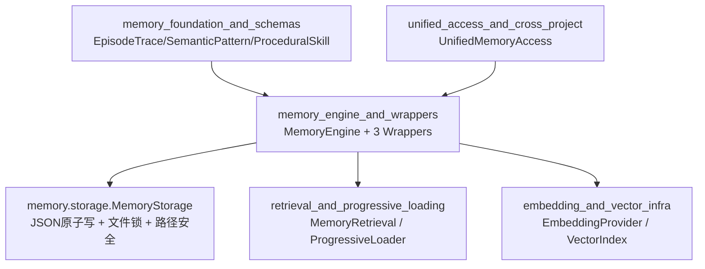
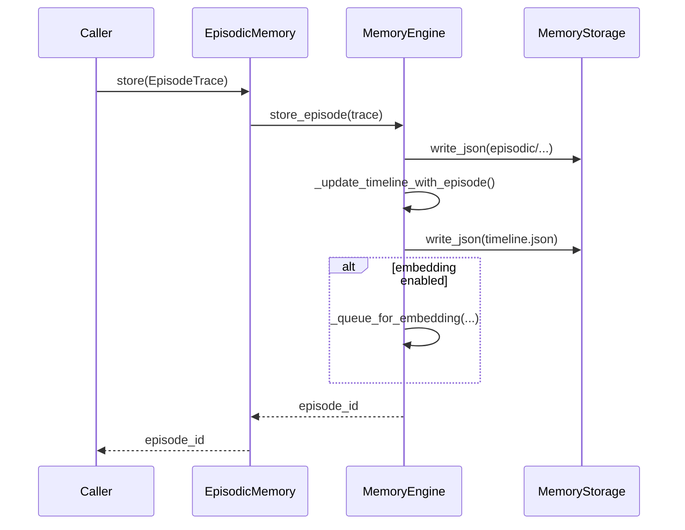
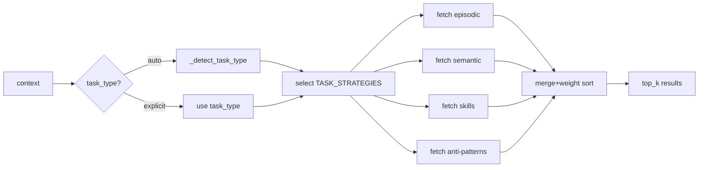

# memory_engine_and_wrappers 模块文档

## 模块简介

`memory_engine_and_wrappers` 是 Memory System 中面向“记忆读写与检索编排”的核心执行层。它对外暴露三个窄接口包装器（`EpisodicMemory`、`SemanticMemory`、`ProceduralMemory`），对内由 `MemoryEngine` 统一协调存储、索引、时间线、检索策略以及（可选的）向量检索能力。这个设计的关键价值在于：上层系统可以按记忆类型调用简单 API，而无需直接处理底层目录结构、JSON 序列化、索引更新和多源检索权重。

从系统定位上看，该模块位于 `memory_foundation_and_schemas`（数据模型）与 `retrieval_and_progressive_loading`（高级检索与分层加载）之间。它不是纯粹的数据结构层，也不是完全独立的向量检索层，而是“可落地、可持久化、可被业务调用”的中间编排层。对于 API 服务、Agent Runtime 或 Dashboard 的后端能力来说，这一层是最常直接集成的记忆入口。

---

## 在整体系统中的位置



`memory_engine_and_wrappers` 的职责边界非常清晰：它直接负责“写入与读取记忆实体、维护索引和时间线、执行基础检索策略”。而更复杂的上下文预算控制、跨层按需加载、跨项目联合访问，则由 `UnifiedMemoryAccess` 和 `ProgressiveLoader` 等模块承接（可参考 [Unified Access.md](Unified%20Access.md)、[Progressive Loader.md](Progressive%20Loader.md)）。

---

## 核心设计与数据组织

### 1) 三类记忆统一编排

模块围绕三类长期记忆：

- `Episodic`：具体任务执行轨迹（事件性）
- `Semantic`：抽象出的模式与规律（语义性）
- `Procedural`：可复用步骤和技巧（程序性）

`MemoryEngine` 将它们统一在一套目录、索引、时间线和检索协议之下，避免上层分别维护三套逻辑。

### 2) 文件系统存储布局

默认基路径 `base_path=.loki/memory`。典型结构：

```text
.loki/memory/
  episodic/YYYY-MM-DD/task-ep-xxxx.json
  semantic/patterns.json
  semantic/anti-patterns.json
  skills/<skill-name>.md
  skills/<skill-name>.json
  index.json
  timeline.json
```

### 3) 任务类型感知检索（Task-aware weighting）

`retrieve_relevant` 通过 `TASK_STRATEGIES` 对不同任务类型设置不同权重。例如 `debugging` 会提高 `episodic` 与 `anti_patterns` 的占比，`implementation` 会更偏向 `semantic + skills`。这让同样的 `top_k` 在不同场景下返回不同结构的上下文集合。

---

## 组件详解

## MemoryEngine（编排内核）

虽然当前模块树“核心组件”列出的是三个 Wrapper，但它们全部代理到 `MemoryEngine`，因此真正行为语义由 `MemoryEngine` 决定。

### 初始化与生命周期

`initialize()` 会确保目录和基础文件存在，并创建初始版本的 `index.json`、`timeline.json`、`semantic/patterns.json`、`semantic/anti-patterns.json`。该方法是幂等的，重复调用不会破坏已有数据。

`cleanup_old(days=30)` 清理超过阈值的旧 episodic 文件，但会保留被语义模式 `source_episodes` 引用的条目，避免知识溯源断裂。

### Episode 操作

`store_episode(trace)` 接收 `EpisodeTrace`（或兼容对象），自动推导日期目录并写入 `task-{episode_id}.json`。写入后会触发：

1. 更新时间线 `timeline.recent_actions`
2. 若配置了 embedding 函数，则进入 embedding 队列（当前为占位实现）

`get_episode(episode_id)` 优先通过 ID 中的日期片段定位路径，无法解析时执行全目录搜索。

`get_recent_episodes(limit)` 逆序读取日期目录和文件名，返回最近轨迹。

### Pattern 操作

`store_pattern(pattern)` 将模式 upsert 到 `semantic/patterns.json`，并调用 `_update_index_with_pattern` 更新主题索引。若 ID 已存在则覆盖。

`find_patterns(category, min_confidence)` 支持按类别和置信度过滤。

`increment_pattern_usage(pattern_id)` 仅更新 `usage_count` 与 `last_used`，适合在上层推理命中后回写使用信号。

### Skill 操作

`store_skill(skill)` 同时保存 Markdown（便于人工浏览）与 JSON（便于机器查询）。文件名由 `name` slug 化而来。

`get_skill(skill_id)` 和 `list_skills()` 基于 `skills/*.json` 扫描。

### 检索操作

`retrieve_relevant(context, top_k)` 是跨记忆类型的统一入口。它先确定任务类型（可 `task_type=auto` 自动检测），再按权重从各集合抓取候选，最终按 `_weight` 排序截断。

`retrieve_by_similarity(query, collection, top_k)`：

- 有 embedding 函数时走 `_vector_search`（当前内部仍是占位）
- 无 embedding 时回退 `_keyword_search`

`retrieve_by_temporal(since, until)` 执行按日期目录过滤的时间范围检索（目前针对 episodic）。

### 索引与时间线

`rebuild_index()` 会全量扫描 episodic + semantic，重建主题、总记忆数、token 粗略估算。

`_update_timeline_with_episode()` 在 episode 写入后插入“动作摘要”，最多保留 50 条。

---

## Wrapper 组件

## EpisodicMemory

`EpisodicMemory` 是 `MemoryEngine` 的薄包装，提供：

- `store(trace)`
- `get(episode_id)`
- `get_recent(limit)`
- `search(query, top_k)`
- `get_by_date_range(since, until)`

它适合让调用方只暴露“事件轨迹能力”，避免误用其他记忆集合 API。

## SemanticMemory

`SemanticMemory` 聚焦模式管理：

- `store(pattern)`
- `get(pattern_id)`
- `find(category, min_confidence)`
- `search(query, top_k)`
- `increment_usage(pattern_id)`

典型场景是从复盘或评审中沉淀模式，并在命中后更新 usage 信号。

## ProceduralMemory

`ProceduralMemory` 聚焦技能沉淀：

- `store(skill)`
- `get(skill_id)`
- `list_all()`
- `search(query, top_k)`

其重要特点是双格式持久化（`.md + .json`），既能给人看，也便于程序索引。

---

## 关键流程

### 写入 Episode 到索引/时间线



该流程体现了 wrapper 的价值：上层拿到单一 API，但底层自动完成多步副作用（落盘、时间线更新、可选向量化入队）。

### 任务类型感知检索



---

## 配置与使用示例

### 基础初始化

```python
from memory.engine import MemoryEngine, EpisodicMemory, SemanticMemory, ProceduralMemory

engine = MemoryEngine(base_path=".loki/memory")
engine.initialize()

episodic = EpisodicMemory(engine)
semantic = SemanticMemory(engine)
procedural = ProceduralMemory(engine)
```

### 写入并读取 Episode

```python
from memory.schemas import EpisodeTrace

trace = EpisodeTrace.create(
    task_id="task-123",
    agent="coder-agent",
    goal="实现搜索接口",
    phase="ACT",
)

episode_id = episodic.store(trace)
loaded = episodic.get(episode_id)
recent = episodic.get_recent(limit=5)
```

### 模式与技能检索

```python
patterns = semantic.find(category="error-handling", min_confidence=0.7)
skills = procedural.search("retry with backoff", top_k=3)

context = engine.retrieve_relevant(
    {"goal": "修复生产报错", "task_type": "debugging"},
    top_k=6,
)
```

---

## 参数、返回值与副作用速览

- `store_*` 方法普遍返回实体 ID；副作用是写文件，并可能触发索引或时间线更新。
- `get_*` / `find_*` / `list_*` 返回 schema 对象列表或 `None`。
- `retrieve_*` 返回字典列表，附加 `_source`、`_weight` 或 `_score` 等检索元信息（调用方应避免将这些字段直接回写覆盖原对象）。
- `rebuild_index()` 为全量重算，适合迁移后、批量导入后执行，不适合高频请求路径。

---

## 重要边界条件与限制

1. **ID 与日期耦合**：`get_episode` 依赖 `ep-YYYY-MM-DD-*` 约定进行快速定位。若 ID 不符合格式，会退化为全目录扫描，性能较差。

2. **检索排序较粗粒度**：`retrieve_relevant` 当前按权重排序，而非真实混合相关性分数。高权重集合可能压过高语义相似但低权重集合。

3. **向量检索尚未完全落地**：`_vector_search` 和 `_queue_for_embedding` 是占位实现；即使配置 embedding 函数，也未与真实向量库联动。生产环境应结合 [Vector Index.md](Vector%20Index.md) 与检索模块扩展。

4. **并发与一致性语义依赖 Storage**：引擎层直接读写 JSON；原子性与锁机制主要由 `MemoryStorage` 保证。若绕过 storage 接口直接操作文件，可能破坏一致性。

5. **部分元数据未自动维护**：例如 schema 中的 `importance/access_count` 在本引擎路径下不会全面更新；若需要“使用即增强、时间衰减”等机制，请结合 `MemoryStorage` 的 `boost_on_retrieval` / `apply_decay` 能力。

6. **token 统计为估算**：`rebuild_index` 用 `len(json)//4` 粗估 token，仅用于趋势视图，不适合作为精确计费依据。

---

## 扩展建议

当你需要扩展该模块时，推荐遵循以下路径：

- 若新增记忆类型（例如策略记忆），先在 schema 与 storage 层定义稳定持久化格式，再在 `MemoryEngine` 增加对应 store/get/retrieve 分支。
- 若要改进相关性，优先替换 `_vector_search`，并将 `_queue_for_embedding` 接入异步任务队列。
- 若要引入跨项目检索，不建议直接改引擎，优先在 `UnifiedMemoryAccess` 或 `CrossProjectIndex` 做聚合（参考 [Cross Project Index.md](Cross%20Project%20Index.md)）。
- 若要优化上下文窗口成本，推荐让上层走 `ProgressiveLoader`，把 `MemoryEngine` 作为 Layer-3 的全量内容来源。

---

## 与其他文档的关系

- 数据模型字段定义与校验：见 [Schemas.md](Schemas.md)
- 存储原子性、锁、命名空间与衰减策略：见 [Memory System.md](Memory%20System.md) 与 [Memory Engine.md](Memory%20Engine.md)
- 统一入口与 token 经济模型：见 [Unified Access.md](Unified%20Access.md)
- 分层加载策略：见 [Progressive Loader.md](Progressive%20Loader.md)
- 向量索引实现细节：见 [Vector Index.md](Vector%20Index.md)

本文件聚焦 `memory_engine_and_wrappers` 的内部编排和 wrapper API，不重复展开上述模块的全部细节。
