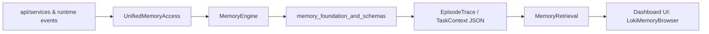
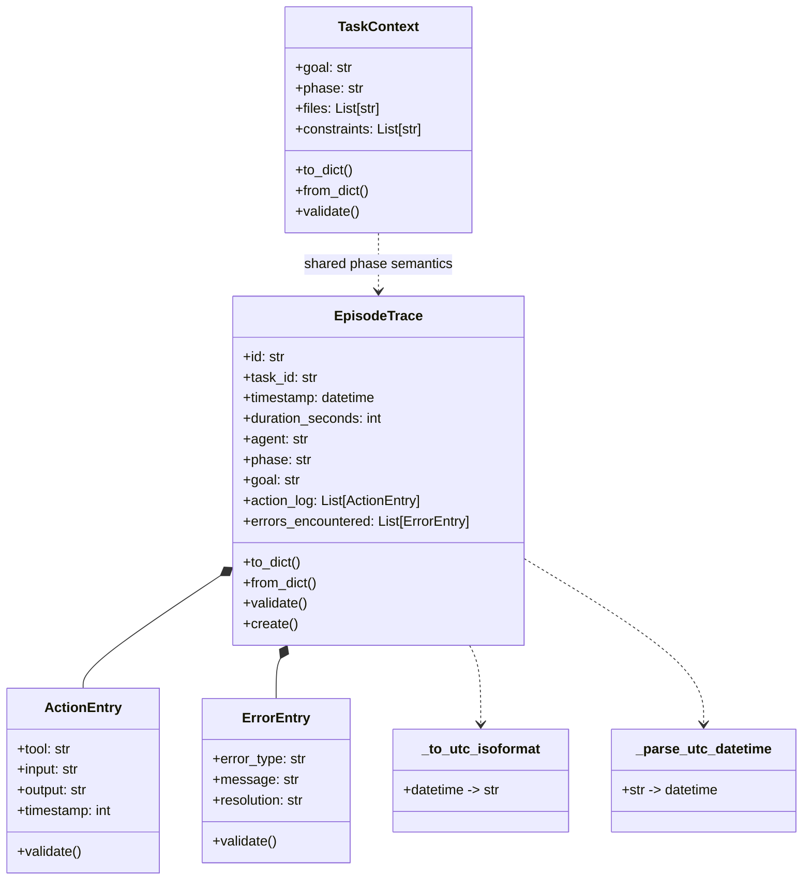
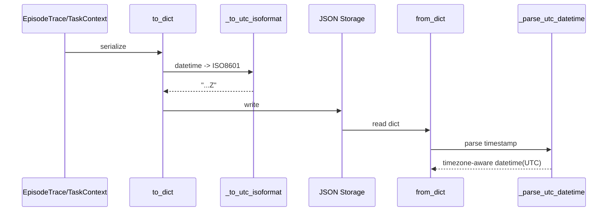

# memory_foundation_and_schemas 模块文档

## 模块定位与设计动机

`memory_foundation_and_schemas` 是 Memory System 的“数据语义地基”模块，源码位于 `memory/schemas.py`。在整个系统里，它不负责检索算法、向量计算或存储编排，而是负责定义这些能力要读写的“标准记忆对象”。如果没有这一层，`memory.engine`、`memory.retrieval`、`memory.unified_access` 等上层模块就会在字段命名、时间格式、校验规则上产生漂移，最终导致跨模块数据不一致。

这个模块存在的根本原因是：将“记忆是什么”与“如何处理记忆”分离。前者由 schema 稳定建模，后者由引擎、检索和 UI 持续演进。这样做能让系统在扩展记忆能力（例如新增索引策略或跨项目聚合）时，保持核心数据契约稳定，降低迁移成本。

从当前模块树看，本模块属于 **Memory System → memory_foundation_and_schemas**，核心对外组件是 `memory.schemas.EpisodeTrace` 和 `memory.schemas.TaskContext`。不过这两个核心对象依赖多个支持类型（如 `ActionEntry`、`ErrorEntry`）和时间解析函数，因此在维护和扩展时需要整体理解。

---

## 在系统中的角色



上图展示了典型路径：运行时事件先进入 `UnifiedMemoryAccess`，由 `MemoryEngine` 落地为 `EpisodeTrace`，并在后续被 `MemoryRetrieval` 消费，再输送给 Dashboard 端展示。`TaskContext` 则在执行链路中扮演上下文标准件，使任务目标、阶段、涉及文件在多个子系统间有统一语义。

如果你需要了解“这些 schema 如何被检索和预算机制消费”，请参考 [Retrieval.md](Retrieval.md)。如果你关注“谁负责创建和存储这些对象”，请参考 [Memory Engine.md](Memory Engine.md)。如果你要看应用侧入口，请参考 [Unified Access.md](Unified Access.md)。

---

## 模块架构与组件关系



`EpisodeTrace` 是可审计、可回放的执行轨迹实体；`TaskContext` 是轻量任务上下文实体。`ActionEntry` 和 `ErrorEntry` 是 `EpisodeTrace` 的嵌套组成。两个时间工具函数保证序列化/反序列化时区行为一致，这是跨 API、存储、UI 的关键兼容点。

---

## 核心组件一：EpisodeTrace

### 它解决什么问题

`EpisodeTrace` 用于表达“一次任务执行到底发生了什么”。它不仅包含结果（success/failure/partial），还记录了动作序列、错误处理、读写文件、token 消耗、访问统计等信息，属于 Memory System 中最“原始且可追溯”的情景记忆载体。

### 字段语义（关键字段）

- 标识与关联：`id`、`task_id`
- 时间与成本：`timestamp`、`duration_seconds`、`tokens_used`
- 执行上下文：`agent`、`phase`、`goal`
- 行为与问题：`action_log`（`ActionEntry` 列表）、`errors_encountered`（`ErrorEntry` 列表）
- 产物与文件：`artifacts_produced`、`files_read`、`files_modified`、`git_commit`
- 记忆生命周期：`importance`、`last_accessed`、`access_count`

### 内部工作机制

`to_dict()` 会把对象压平为可 JSON 化结构，并把 `phase/goal/files_involved` 组装进 `context` 子对象。这里有一个值得注意的行为：`files_involved` 由 `files_read + files_modified` 去重合并而来。

`from_dict()` 兼容多种输入形态：

1. `timestamp` 既可传 ISO 字符串，也可传 `datetime`。
2. `phase/goal` 优先读 `context`，其次回退到顶层字段。
3. 若缺失时间字段，会用 `datetime.now(timezone.utc)` 兜底。
4. `last_accessed` 支持字符串和 `datetime` 双输入。

`validate()` 会进行完整约束检查，包括：必填字段、枚举合法性、数值边界、嵌套条目校验。它返回错误列表而不是直接抛异常，这意味着调用方可以选择“聚合后一次性处理错误”。

`create()` 是便捷工厂：自动生成 `ep-YYYY-MM-DD-xxxxxxxx` 形式 ID，填充 UTC 时间戳和默认值，便于调用层快速落盘。

### 典型用法

```python
from memory.schemas import EpisodeTrace, ActionEntry, ErrorEntry

trace = EpisodeTrace.create(
    task_id="task-42",
    agent="code-agent",
    goal="实现 API 限流中间件",
    phase="ACT"
)

trace.action_log.append(ActionEntry(
    tool="write_file",
    input="middleware/rate_limit.py",
    output="created",
    timestamp=12,
))

trace.errors_encountered.append(ErrorEntry(
    error_type="test_failure",
    message="429 assertion mismatch",
    resolution="update expected response schema",
))

errors = trace.validate()
if errors:
    raise ValueError("; ".join(errors))

payload = trace.to_dict()  # 可直接写入 JSON
```

---

## 核心组件二：TaskContext

### 它解决什么问题

`TaskContext` 用于携带任务执行时的最小必需语义：目标、阶段、相关文件、约束条件。相比 `EpisodeTrace`，它更轻量，适合在检索前置、决策推理、上下文拼接时频繁传递。

### 核心规则

`phase` 受限于 `VALID_PHASES = ["REASON", "ACT", "REFLECT", "VERIFY"]`。`validate()` 中对 `phase` 的校验是“有值才校验”，意味着空 phase 可被允许，但传入非法值会被报错。`goal` 是硬性必填。

`to_dict()` 会输出 `files_involved` 键名，而 `from_dict()` 同时兼容 `files_involved` 与 `files`，体现了对历史数据/外部调用的兼容设计。

### 典型用法

```python
from memory.schemas import TaskContext

ctx = TaskContext(
    goal="修复鉴权回归",
    phase="VERIFY",
    files=["auth/service.py", "tests/test_auth.py"],
    constraints=["不得修改对外 API", "需保持向后兼容"]
)

if ctx.validate():
    print("context invalid")

ctx_json = ctx.to_dict()
restored = TaskContext.from_dict(ctx_json)
```

---

## 序列化与时间处理细节



该流程强调一个关键目标：**尽量保证 UTC 一致性并兼容历史数据格式**。

- `_to_utc_isoformat(dt)` 会把 `+00:00` 归一成 `Z`。
- 若输入是 naive datetime（无 tzinfo），代码按 UTC 假设处理。
- `_parse_utc_datetime(s)` 支持 `Z`、`+00:00`、naive 字符串。

这套策略在分布式场景很实用，但也带来约束：如果上游把 naive 时间当“本地时区”传入，会被视为 UTC，可能产生偏移理解错误。

---

## 校验、错误条件与边界行为

### EpisodeTrace 常见失败条件

- 缺失 `id/task_id/agent/goal`
- `phase` 不在 RARV 四阶段内
- `outcome` 不在 `success/failure/partial`
- `duration_seconds/tokens_used/access_count` 为负值
- `importance` 不在 `[0.0, 1.0]`
- 任一 `ActionEntry` 或 `ErrorEntry` 校验失败

### TaskContext 常见失败条件

- `goal` 为空
- `phase` 非法

### 容易忽略的行为（Gotchas）

1. `EpisodeTrace.to_dict()` 不直接输出顶层 `phase/goal`，而是放在 `context` 中；反序列化虽兼容两种位置，但自定义消费者如果只读顶层字段会踩坑。
2. `files_involved` 是 `files_read + files_modified` 去重后的集合语义，顺序不保证稳定（`set` 去重）。如果你在测试里断言顺序，可能出现脆弱测试。
3. `validate()` 采用“收集错误返回列表”而非异常流；如果调用层忘记显式处理，脏数据仍可能进入存储。
4. naive datetime 会被当 UTC。跨时区系统集成时建议统一传 timezone-aware `datetime`。

---

## 扩展与定制建议

扩展此模块时，优先遵守“向后兼容反序列化”原则：新增字段应在 `from_dict()` 中提供默认值和多键兼容，而不是直接改写旧键语义。对于枚举字段（如 `phase`、`outcome`），建议先在 `validate()` 扩容，再逐步在上游调用链启用，避免一次性变更造成大量历史数据失效。

如果你要新增一种与 `EpisodeTrace` 并列的基础记忆对象，推荐复制以下模式：

- dataclass + default_factory
- `to_dict()/from_dict()` 双向转换
- `validate()` 返回错误列表
- `create()` 工厂（可选）
- 时间字段统一走 `_to_utc_isoformat/_parse_utc_datetime`

---

## 与其他模块的依赖关系（引用）

本模块是契约层，建议把行为逻辑放在下列文档对应模块中，不在此重复：

- 存储编排、生命周期、统计：见 [Memory Engine.md](Memory Engine.md)
- 任务感知检索、权重策略、命名空间：见 [Retrieval.md](Retrieval.md)
- 应用统一入口、token 预算：见 [Unified Access.md](Unified Access.md)
- 整体内存系统总览：见 [Memory System.md](Memory System.md)

---

## 维护者速查清单

- 当你修改字段名时，同时更新 `to_dict()` 与 `from_dict()` 的兼容映射。
- 当你新增枚举值时，同时更新 `VALID_*` 和相关上游逻辑（检索、UI 展示、API 类型契约）。
- 当你新增时间字段时，确保序列化/反序列化均按 UTC 处理。
- 在写入存储前，调用方必须显式执行 `validate()` 并处理返回错误。
