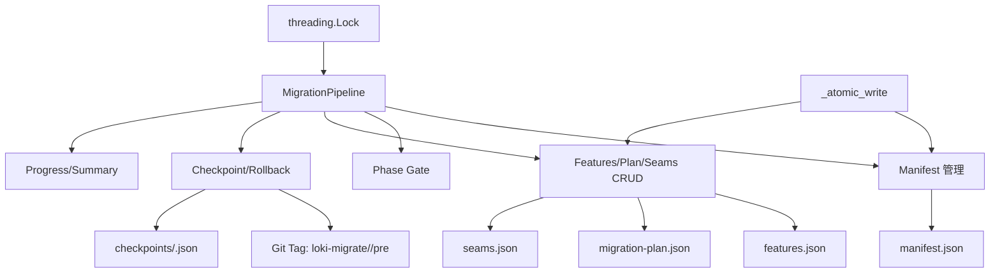
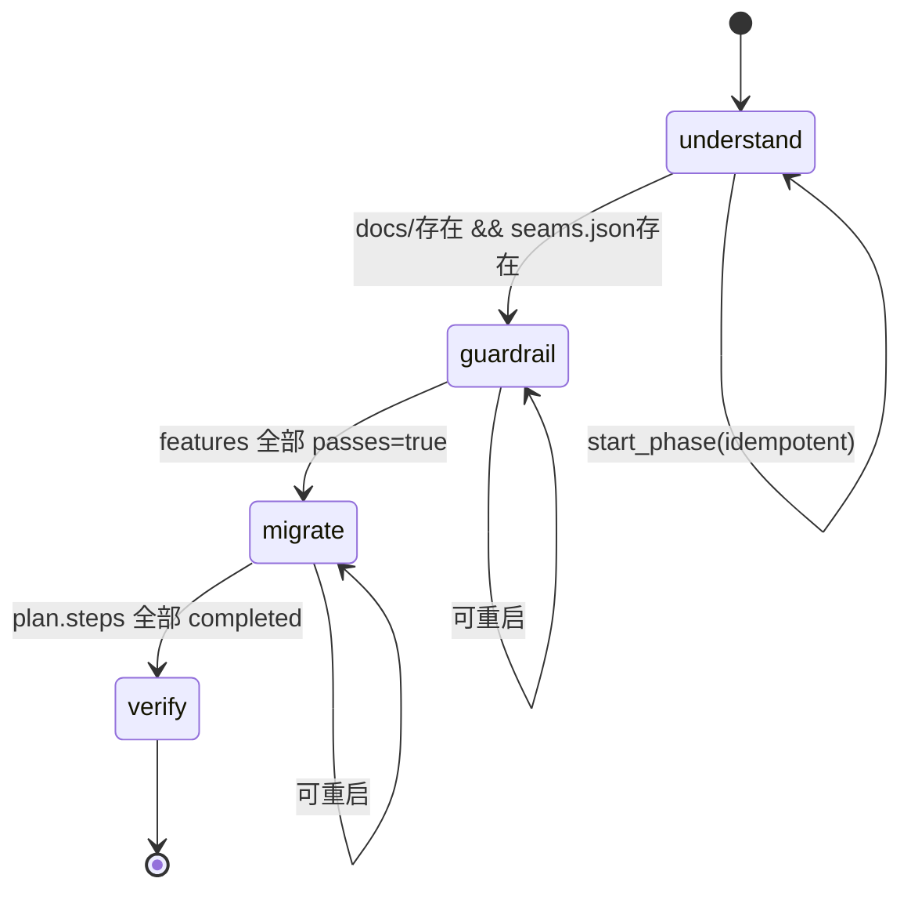
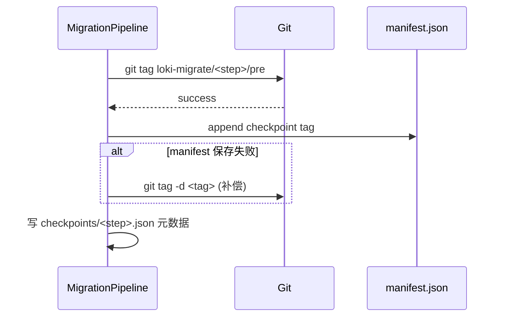

# migration_engine 模块文档

## 引言：模块定位与设计动机

`dashboard/migration_engine.py` 是 Loki Mode 在 Dashboard Backend 中用于“企业级代码迁移/改造”的核心编排模块。它的目标并不是直接执行所有代码变换，而是提供一套**可审计、可恢复、可渐进推进**的迁移执行框架：把迁移过程拆分为固定阶段（`understand -> guardrail -> migrate -> verify`），通过阶段门禁（phase gate）约束质量，再借助 Git checkpoint 保证失败后可回滚。

这个模块存在的核心原因是：真实代码库迁移通常跨多个提交、多个参与者、多个自动化代理步骤，且失败成本高。相比“一次性重写”，`migration_engine` 采用可持久化的 manifest + 计划 + 特性清单 + seam 信息的组合，让迁移过程具备工程可操作性。

在系统层面，它属于 Dashboard Backend 的“迁移编排内核”，通常会被 CLI 流程与 Dashboard UI（如迁移看板）共同消费；它与数据库 ORM（`dashboard.models.*`）不同，主要把状态落盘到 `~/.loki/migrations`，侧重文件型状态机与 Git 原子操作。

---

## 架构总览



这个架构体现了三件事：第一，`MigrationPipeline` 是唯一编排入口；第二，状态持久化是“文件 + 原子写入”而非数据库事务；第三，推进阶段时会做门禁检查，避免“带病进入下一阶段”。

---

## 模块内核心数据模型

虽然模块树将 `CostEstimate` 标记为 core component，但在理解该模块时必须把它放回完整数据模型体系中看。

### `CostEstimate`

`CostEstimate` 是 token 维度的成本估算模型：

```python
@dataclass
class CostEstimate:
    total_tokens: int = 0
    estimated_cost_usd: float = 0.0
    by_phase: dict[str, int] = field(default_factory=dict)
```

它是一个轻量 DTO，典型用途是：

1. 向 UI（如成本可视化组件）返回“总 token + 分阶段 token”；
2. 与策略层（例如成本控制或预算检查）对接；
3. 作为迁移计划评审时的预算输入。

当前文件中没有直接内建计算逻辑，它更像标准化数据载体，计算责任通常在上层服务或策略模块。

### 其他关键 dataclass（上下文必需）

- `Feature`：表征特性与 characterization test 是否通过（`passes`）。
- `MigrationStep`：迁移步骤颗粒，带状态、风险、依赖、回滚点信息。
- `MigrationPlan`：步骤集合 + 策略 + 退出条件。
- `SeamInfo`：代码边界/缝合点（API、模块、数据库、配置等）识别结果。
- `MigrationManifest`：全局迁移状态总账。
- `PhaseResult`：阶段推进结果。

这些模型一起构成文件型状态机的数据平面。

---

## 生命周期与阶段门禁



`advance_phase()` 不只是“改状态”，而是先做 `_check_phase_gate_unlocked()`：

- `understand -> guardrail`：必须已有文档产物（`docs/` 非空）且存在 `seams.json`；
- `guardrail -> migrate`：`features.json` 中全部特性 `passes=True`；
- `migrate -> verify`：`migration-plan.json` 中全部步骤 `status=completed`；
- 严格禁止跳级（只能相邻阶段）。

这套约束体现了“质量先行”的设计：先理解系统，再建立护栏，再实施迁移，最后验证收口。

---

## `MigrationPipeline` 深入解析

### 初始化与目录结构

构造函数会规范化 `codebase_path`，生成 `migration_id`，并创建目录：

- `<LOKI_DATA_DIR>/migrations/<migration_id>/docs`
- `<LOKI_DATA_DIR>/migrations/<migration_id>/checkpoints`

默认 `LOKI_DATA_DIR=~/.loki`，可通过环境变量覆盖。`migration_id` 格式为：

`mig_YYYYMMDD_HHMMSS_<safe_dirname>`

目录名会经过正则清洗（仅允许字母、数字、`_`、`-`），保证可用于路径与校验。

### Manifest 读写与线程安全

- `load_manifest()/save_manifest()` 对外线程安全。
- 内部 `_load_manifest_unlocked()` 会过滤未知字段（前向兼容旧/新版本 manifest）。
- `_save_manifest_unlocked()` 通过 `_atomic_write()` 落盘：临时文件写入 + `fsync` + `os.replace`，避免部分写入损坏。

### Phase API

- `start_phase(phase)`：把阶段标记为 `in_progress`，对已 in_progress 的阶段幂等；支持重启已完成或失败阶段。
- `check_phase_gate(from_phase, to_phase)`：返回 `(allowed, reason)`，便于 UI/CLI 先检查再推进。
- `advance_phase(phase)`：强制当前阶段必须已 `in_progress`；门禁通过后将当前阶段设为 `completed` 并自动启动下一阶段。

### Features / Plan / Seams 的 CRUD

三组 load/save 行为风格一致：

- 读取时容忍包裹格式（例如 `{"features": [...]}` 或平铺数组）；
- 读取时过滤未知字段，降低 schema 变更破坏性；
- 写入时统一 JSON pretty-print + 原子写入。

### Checkpoint 与回滚



`create_checkpoint(step_id)` 的关键点：

1. `step_id` 先做正则校验（仅安全字符）；
2. 先打 Git tag，再更新 manifest；
3. 若 manifest 更新失败，会删除刚创建的 tag，避免“孤儿标签”；
4. 写入 checkpoint 元数据文件用于 UI 展示。

`rollback_to_checkpoint(step_id)` 通过 `git reset --hard loki-migrate/<step>/pre` 回滚到该步前状态。

### 进度汇总与展示

- `get_progress()` 返回前端友好的聚合状态：阶段、步骤、特性通过率、最后 checkpoint、seams 统计等。
- `generate_plan_summary()` 返回 `--show-plan` 人类可读文本（含状态标记 `[ ] [>] [x] [!]`）。

---

## 文件与数据契约

```mermaid
flowchart LR
    A[manifest.json] --> B[phases/status/source/target/checkpoints]
    C[features.json] --> D[Feature[]]
    E[migration-plan.json] --> F[MigrationPlan + MigrationStep[]]
    G[seams.json] --> H[SeamInfo[]]
    I[checkpoints/<step>.json] --> J[tag/step_id/created_at]
```

建议在扩展时保持这些文件名稳定，因为 phase gate 与 progress 汇总依赖固定路径。

---

## 使用方式与示例

### 基本编排示例

```python
from dashboard.migration_engine import MigrationPipeline, Feature

pipeline = MigrationPipeline(codebase_path="./my-repo", target="typescript")
manifest = pipeline.create_manifest()

# understand 阶段产物写入后（docs/ 与 seams.json）
pipeline.advance_phase("understand")

features = pipeline.load_features()
for f in features:
    f.passes = True
pipeline.save_features(features)

pipeline.advance_phase("guardrail")
```

### 单例访问模式

```python
from dashboard.migration_engine import get_migration_pipeline, reset_migration_pipeline

pipeline = get_migration_pipeline(codebase_path="./repo", target="go")
# ... 复用同一实例
reset_migration_pipeline()  # 测试或新会话切换时使用
```

单例模式适合单进程会话，但不适合多租户并行迁移隔离（详见限制章节）。

### 环境变量配置

```bash
export LOKI_DATA_DIR=/data/loki
```

未配置时默认写入 `~/.loki/migrations`。

---

## 与其他模块的关系

在 Dashboard Backend 里，`migration_engine` 是“迁移状态机 + Git 回滚控制”模块，不直接承担 WebSocket 推送或数据库持久化职责。

- 如果你关注后端整体 API 与服务装配，可参考 [Dashboard Backend.md](Dashboard%20Backend.md)。
- 如果你关注迁移可视化看板与运营视角，可参考 [migration_observability_dashboard.md](migration_observability_dashboard.md)。
- 如果你关注运行态广播机制，可参考 `ConnectionManager` 相关文档（见 [runtime_services.md](runtime_services.md)）。

---

## 扩展建议

扩展该模块时，优先遵循“门禁先于推进”的原则：

1. 新增 phase 时，同时更新 `PHASE_ORDER` 与 `_check_phase_gate_unlocked()`；
2. 新增 manifest 字段尽量保持向后兼容（读取时已有字段过滤机制）；
3. 对外 JSON 契约变更时，优先保持 wrapper/flat 双格式兼容。

对于 `CostEstimate`，可以在上层新增估算器服务，将结果写入 plan 或单独产物文件，再由 UI 读取，避免把复杂计费逻辑塞入 `MigrationPipeline`。

---

## 边界条件、错误与限制

### 常见错误条件

- 非法 `migration_id`：`load()` 会直接 `ValueError`。
- 阶段跳转非法或门禁未过：`advance_phase()` 抛 `RuntimeError`。
- 当前阶段不是 `in_progress` 却调用推进：抛 `RuntimeError`。
- `features.json` / `migration-plan.json` / `seams.json` 缺失或损坏：load 抛 `FileNotFoundError` / JSON 解析异常。
- Git 命令失败：封装为 `RuntimeError` 并附 stderr。

### 操作性注意事项

- `rollback_to_checkpoint()` 使用 `git reset --hard`，会丢弃工作区未提交更改。
- checkpoint 依赖 Git 仓库上下文；非 Git 目录会失败。
- `migration_id` 时间粒度是秒，同秒高并发初始化理论上有冲突可能（目录名重复风险）。
- 单例 pipeline 在长生命周期服务中可能持有过期上下文，切换项目前应显式 reset。

### 已知设计限制

- 目前状态主要是文件系统持久化，跨机器协作需要共享存储或额外同步层。
- `CostEstimate` 仅数据结构，不含计费策略、模型单价、汇率等业务规则。
- gate 规则为硬编码逻辑，若迁移流程多样化，建议抽象策略接口。

---

## 维护者速查

`migration_engine` 的本质是一个“带门禁的文件型迁移状态机”。你在维护时可优先检查三条主线：

1. **状态一致性**：所有落盘是否经过 `_atomic_write`；
2. **阶段正确性**：`start_phase/advance_phase/check_phase_gate` 是否保持单向、可解释；
3. **回滚可靠性**：Git 标签创建、manifest 更新、补偿删除三者是否仍保持原子语义。

只要这三条主线不被破坏，模块就能持续提供可恢复、可审计的迁移编排能力。