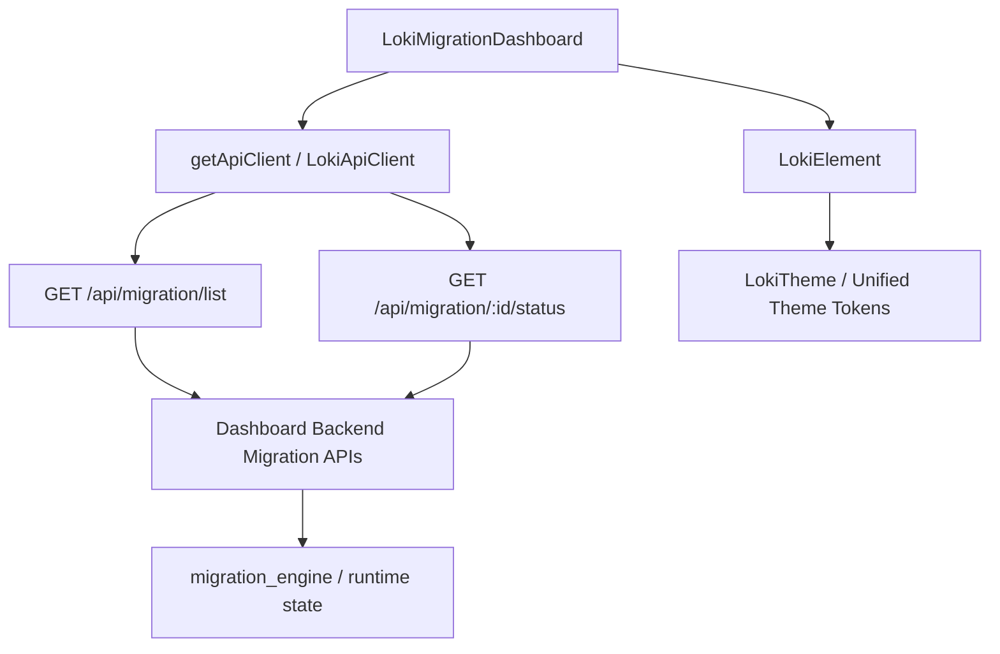
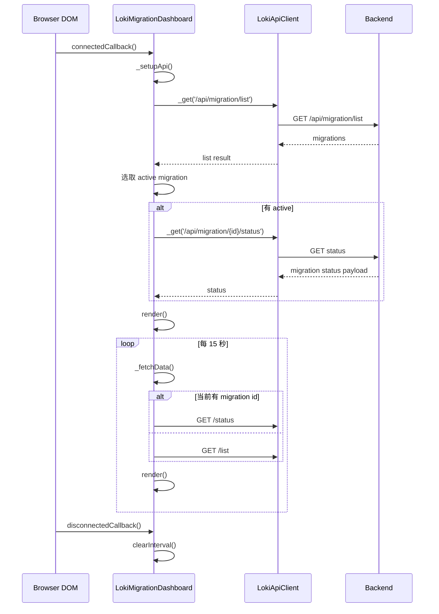
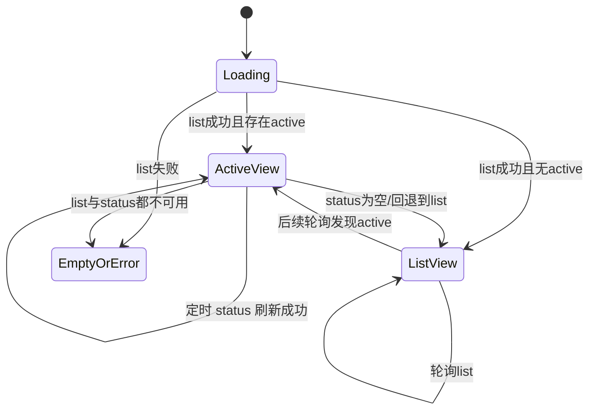
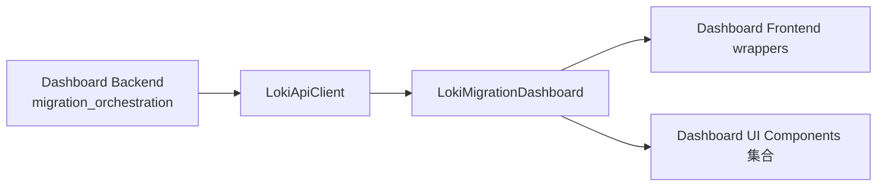

# migration_observability_dashboard 模块文档

## 模块概述

`migration_observability_dashboard` 对应的核心实现是 Web Component `dashboard-ui.components.loki-migration-dashboard.LokiMigrationDashboard`，它在 Dashboard UI 的“Administration and Infrastructure Components”分类下承担**迁移可观测性视图**职责。这个组件的设计目标并不是执行迁移本身，而是把后端迁移引擎暴露的状态数据组织成可读性更高的仪表盘，包括当前阶段（phase）进度、功能通过率、步骤推进、风险 seam 汇总、最近 checkpoint，以及无活跃任务时的历史迁移列表。

从系统分层上看，它位于展示层（Dashboard UI Components），依赖 `LokiElement` 提供的主题系统和生命周期基类能力，依赖 `LokiApiClient` 提供 HTTP 访问；而其数据源来自 Dashboard Backend 中迁移相关 API（例如 `/api/migration/list`、`/api/migration/{id}/status`）。因此它是“迁移编排（backend）-> 可观测性呈现（UI）”链路中的前端端点，典型使用场景是运维、平台管理员或迁移负责人在不中断会话的情况下持续观察迁移进展。

---

## 设计动机与职责边界

该模块存在的核心原因是：迁移过程天然是多阶段、长时运行、且伴随风险的操作，用户需要一个低成本、实时性足够、可在嵌入式面板中复用的组件来查看状态。`LokiMigrationDashboard` 通过“初次拉取 + 周期轮询”模型在实现复杂度与可用性之间做了平衡：它不要求后端提供长连接推送即可工作，同时又能在 15 秒周期内刷新活跃任务状态。

职责边界上，这个组件只负责：

- 数据拉取与状态管理（前端本地状态）。
- 数据到 UI 的映射（phase bar、统计卡片、列表）。
- 安全展示（基础 HTML 转义，避免直接插入未转义文本）。

它**不负责**迁移任务创建、暂停/恢复、重试，也不处理复杂权限模型和租户策略；这些能力应分别由后端控制层与治理模块承担。可参考：

- 迁移编排后端文档：[migration_orchestration.md](migration_orchestration.md)
- 后端 API 面与传输层：[api_surface_and_transport.md](api_surface_and_transport.md)
- Dashboard UI 组件总体架构：[Dashboard UI Components.md](Dashboard%20UI%20Components.md)

---

## 架构与依赖关系



该图表示组件运行时的最小依赖路径。`LokiMigrationDashboard` 继承 `LokiElement`，因此自动接入主题变化监听、基础样式 token、键盘处理挂载；同时通过 `getApiClient({ baseUrl })` 获取 `LokiApiClient` 实例来执行 HTTP 请求。后端返回的数据被转换为两种主视图：活跃迁移详情视图和迁移列表视图。

---

## 生命周期与数据刷新流程



该流程强调两个关键点。第一，组件首次加载时先拿列表，再决定是否拉取某个 active 任务的详情，这避免了盲猜 migration id。第二，轮询逻辑对“当前是否存在 `_migration`”做了分支：若有活动详情就持续刷新详情，否则回到列表扫描。这种策略对后端负载是友好的，但也意味着在“活跃任务切换”场景中可能有一个轮询周期的可见延迟。

---

## 关键状态模型

组件内部维护以下状态字段：

- `_loading: boolean`：首次加载中的占位态控制。
- `_error: string | null`：最近错误信息（只在特定条件下影响 UI）。
- `_migrations: Array`：迁移列表数据。
- `_migration: object | null`：当前活跃迁移详情。
- `_api: LokiApiClient | null`：API 客户端实例。
- `_pollInterval: number | null`：`setInterval` 句柄，卸载时必须清理。



注意这里的 `EmptyOrError` 在 UI 上被弱化处理：组件在“无 migration 且列表为空且存在错误”时显示 `No migration data available`，不会直接显示后端错误详情。

---

## 核心组件详解：LokiMigrationDashboard

### 类定义与继承

`LokiMigrationDashboard extends LokiElement`。继承关系意味着它自动拥有主题切换响应、基础 CSS token 注入、`shadowRoot` 生命周期管理等能力。关于基类行为可查看：[Core Theme.md](Core%20Theme.md) 与 [Unified Styles.md](Unified%20Styles.md)。

### `observedAttributes()`

组件监听 `api-url` 与 `theme` 两个属性：

- `api-url` 变化时，会更新已有 API 客户端的 `baseUrl` 并重新拉取列表。
- `theme` 变化时调用 `_applyTheme()`，依赖 `LokiElement` 统一主题机制。

这使组件可在多环境（本地开发、代理环境、嵌入式 host）中动态切换 API 目标，不需要重新挂载组件。

### `connectedCallback()`

该方法串联了初始化路径：执行父类逻辑、构造 API 客户端、首轮拉取数据、启动 15 秒轮询。副作用是创建了一个长期定时器，因此它要求匹配的 `disconnectedCallback()` 做资源清理。

### `disconnectedCallback()`

负责停止轮询，防止组件卸载后继续请求 API（内存泄漏与冗余网络请求）。如果你在容器页面做频繁路由切换，这个清理逻辑是组件稳定运行的关键。

### `attributeChangedCallback(name, oldValue, newValue)`

当 `api-url` 在运行期变化时，组件复用已有 `_api` 实例并直接改写 `baseUrl`。这在实践中很方便，但要注意 `LokiApiClient` 是按 baseUrl 缓存实例的；当前组件通过 setter 更新 URL，不会强制重建实例，属于“同实例重配置”模式。

### `_setupApi()`

从 `api-url` 属性读取 base URL，若缺省则退回 `window.location.origin`，随后调用 `getApiClient({ baseUrl })`。该行为降低了嵌入成本：默认同源部署可零配置工作。

### `_fetchMigrations()`

这是列表入口方法：

1. 调用 `GET /api/migration/list`。
2. 兼容两种响应结构：数组本身，或 `{ migrations: [...] }`。
3. 从列表中查找 `status` 为 `in_progress` 或 `active` 的任务。
4. 若存在 active，立即继续拉取其 status；否则将 `_migration` 置空。
5. 捕获错误后清空列表与详情状态，保存错误消息。
6. 结束时取消 loading 并渲染。

这个方法是“视图模式决策器”：是否展示活跃面板，取决于它对列表的判定结果。

### `_fetchStatus(id)`

调用 `GET /api/migration/{id}/status` 获取详情。对 `id` 使用 `encodeURIComponent`，可避免路径注入与特殊字符问题。失败时只更新 `_error`，不会自动清空旧 `_migration`，因此在瞬态失败下用户可能短时间看到旧数据，这是一种偏可用性的选择。

### `_fetchData()`

轮询回调：若当前已有 migration id，则更新详情；否则刷新列表并重新判定 active。该方法是运行期的“路由器”。

### `_escapeHtml(str)`

对 `& < > " '` 做实体替换，避免后端返回内容直接插入 HTML 时触发 XSS。组件在 ID、source、target、status、checkpoint step 等字段上都使用了这个方法，是一个正确且必要的防御措施。

### 阶段与统计渲染方法

- `_renderPhaseBar(currentPhase, completedPhases)`：按固定阶段序列渲染四段进度条，使用 `PHASE_COLORS` + 透明度表达完成/激活/未开始状态。
- `_renderFeatureStats(features)`：渲染 `passing/total` 与百分比，按阈值（>=80 success, >=50 warning, else error）变色。
- `_renderStepProgress(steps)`：渲染步骤完成率。
- `_renderSeamSummary(seams)`：渲染高/中/低风险 seam 数量。
- `_renderCheckpoint(checkpoint)`：展示最近 checkpoint 时间与 step id。
- `_renderMigrationList()`：在无 active 时展示迁移历史表格。

这些方法都采用“输入为空则返回空字符串”的容错策略，避免字段缺失导致整页渲染失败。

### `render()`

`render()` 决定最终 UI 分支，主要有四类：

1. `_loading === true`：显示 spinner。
2. 错误且无任何数据：显示 `No migration data available`。
3. 有 `_migration`：展示活跃迁移详情面板。
4. 否则：展示迁移列表。

样式全部封装在 shadow DOM 内，基于 `getBaseStyles()` 注入主题 token，保证组件可嵌入到不同宿主页面而不受全局 CSS 污染。

---

## 数据契约与字段语义

组件对后端响应采用“弱契约 + 多字段兼容”策略。也就是说它不强依赖严格 TypeScript 类型，而是通过回退字段名提高兼容性。

### 列表接口：`GET /api/migration/list`

支持两种响应形态：

```json
[
  {
    "migration_id": "mig-001",
    "source": "legacy-system",
    "target": "new-platform",
    "status": "in_progress"
  }
]
```

或：

```json
{
  "migrations": [
    {
      "id": "mig-001",
      "source": "legacy-system",
      "target": "new-platform",
      "status": "completed"
    }
  ]
}
```

### 详情接口：`GET /api/migration/{id}/status`

组件可消费的关键字段包括：

- 标识：`migration_id` 或 `id`
- 阶段：`current_phase` 或 `phase`
- 完成阶段：`completed_phases: string[]`
- 统计：`features`, `steps`, `seams`
- 检查点：`last_checkpoint` 或 `checkpoint`

示例：

```json
{
  "migration_id": "mig-001",
  "source": "legacy-system",
  "target": "new-platform",
  "current_phase": "migrate",
  "completed_phases": ["understand", "guardrail"],
  "features": { "passing": 42, "total": 55 },
  "steps": { "current": 18, "total": 30 },
  "seams": { "total": 12, "high": 2, "medium": 4, "low": 6 },
  "last_checkpoint": {
    "timestamp": "2026-02-10T12:34:56Z",
    "step_id": "step-18"
  }
}
```

---

## 使用方式

最简单用法如下：

```html
<loki-migration-dashboard></loki-migration-dashboard>
```

如果后端不在同源地址，传入 `api-url`：

```html
<loki-migration-dashboard api-url="http://localhost:57374"></loki-migration-dashboard>
```

在运行时动态切换 API 目标：

```javascript
const el = document.querySelector('loki-migration-dashboard');
el.setAttribute('api-url', 'https://staging.example.com');
```

切换主题（依赖 `LokiElement` 机制）：

```javascript
el.setAttribute('theme', 'dark');
```

---

## 与系统其他模块的关系

`LokiMigrationDashboard` 不是孤立组件，它在模块树中的位置如下：



它通常通过前端 wrapper 或页面布局被组合到管理类面板中。若你要扩展迁移可观测性，建议优先在后端迁移状态 API 上增加字段，再在该组件里增量渲染，而不是在前端拼接多接口聚合逻辑。

相关参考文档：

- [migration_orchestration.md](migration_orchestration.md)
- [api_client_layer.md](api_client_layer.md)
- [Administration and Infrastructure Components.md](Administration%20and%20Infrastructure%20Components.md)

---

## 扩展与二次开发建议

如果需要新增指标（如“回滚次数”“预计剩余时间 ETA”），推荐沿用当前渲染模式：新增一个 `_renderXxxCard()` 私有方法，并在 `stats-grid` 中拼接输出。这样能够保持结构一致，也便于未来拆分为子组件。

若要支持“点击列表项查看历史详情”，当前实现没有行点击事件；你可以在 `_renderMigrationList()` 中给 `<tr>` 增加 `data-id` 并绑定委托事件，再复用 `_fetchStatus(id)`。同时请确保交互元素的键盘可达性（可参考 `LokiElement` 的键盘处理能力）。

如果你的环境已经有 WebSocket 事件流（见 frontend `WebSocketClient` 或 `LokiApiClient` 的事件能力），可以将轮询改为“推送优先、轮询兜底”，以降低延迟与请求量。

---

## 边界条件、错误处理与限制

该组件在稳定性上做了基础处理，但仍有一些需要注意的行为特征：

1. **错误信息不外显细节**：当无数据且错误时只显示通用文案，便于用户体验，但不利于排障。生产上可考虑在开发模式附带错误摘要。
2. **固定 15 秒轮询**：未根据页面可见性或网络状态自适应，可能导致后台标签页也持续请求。
3. **只跟踪首个 active migration**：列表中若存在多个 active，仅展示 `find()` 命中的第一个。
4. **状态切换存在窗口期**：active 任务完成后，界面可能要到下一次轮询才切换为列表视图。
5. **阶段集合固定**：`PHASES` 写死为 `understand/guardrail/migrate/verify`，新增后端 phase 时不会自动呈现为新段，只会在文本中回退显示原值。
6. **时间本地化显示**：checkpoint 时间用 `toLocaleString()`，跨时区对比时需注意一致性。
7. **空字段容错但语义可能弱化**：大量 `|| '--'` 回退保证不崩溃，但会掩盖后端字段缺失问题。

---

## 测试与验证建议

建议最少覆盖以下测试路径：

- 首次加载：列表成功、有 active、无 active 三种分支。
- 接口异常：`/list` 失败、`/status` 失败、超时。
- 属性变更：`api-url` 热更新后是否正确请求新地址。
- 生命周期：卸载后定时器是否被清理。
- 安全性：恶意字符串在 source/target/id 中是否被正确转义。

手工验收可使用浏览器 DevTools Network 面板确认轮询节奏和请求路径，确保不会出现卸载后残留请求。

---

## 总结

`migration_observability_dashboard` 的实现简洁但实用，核心价值在于将迁移状态结构化为“阶段 + 指标 + 检查点 + 历史列表”的统一视觉模型，并通过低耦合 API 拉取方式适配多部署环境。它适合作为迁移场景的默认观察面板，也适合作为后续增强（多活跃任务、事件推送、交互 drill-down）的基础骨架。
