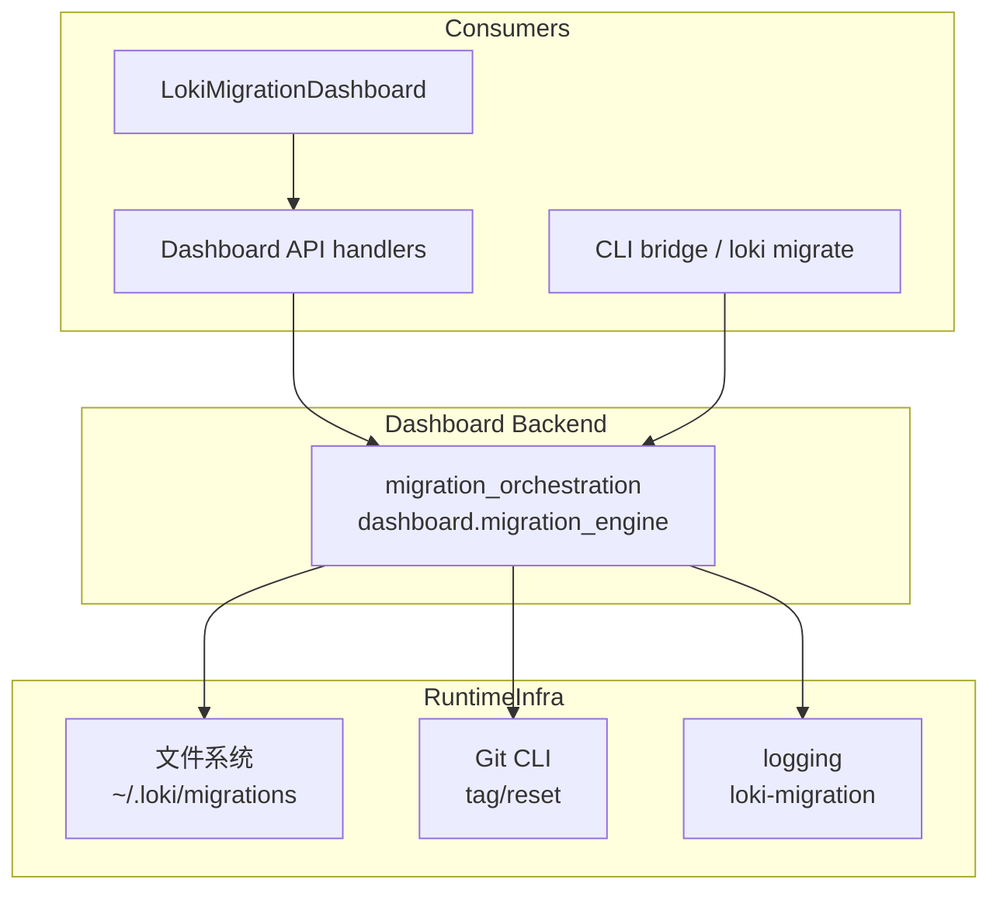
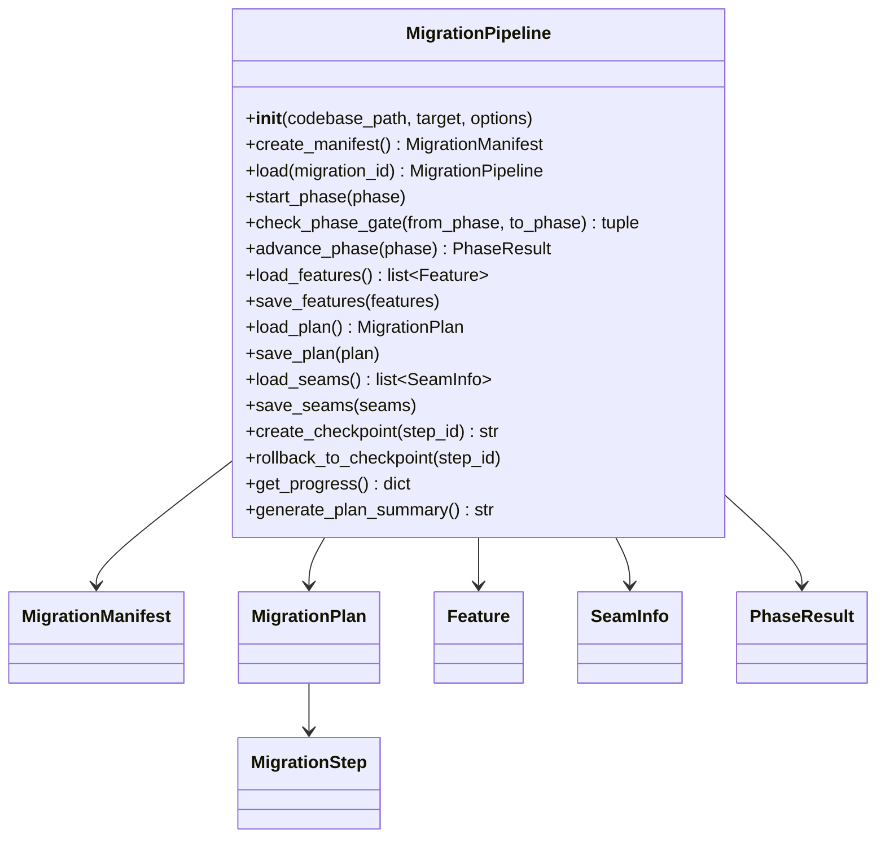
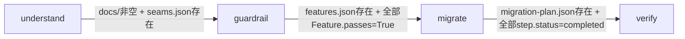
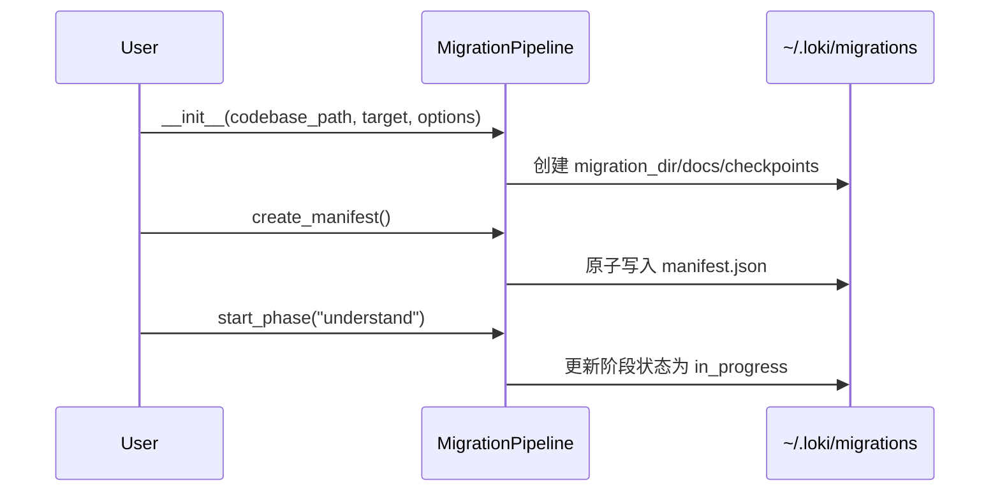
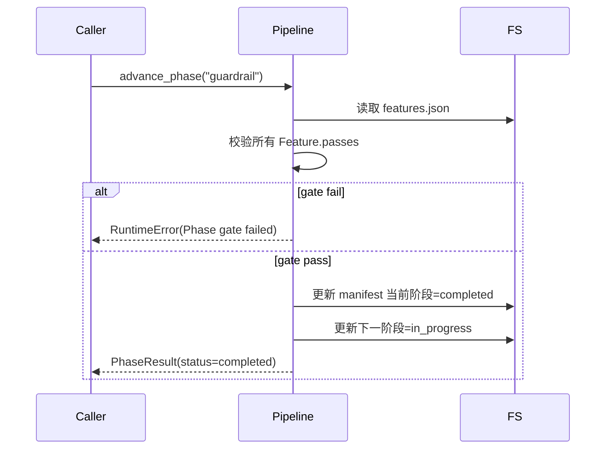
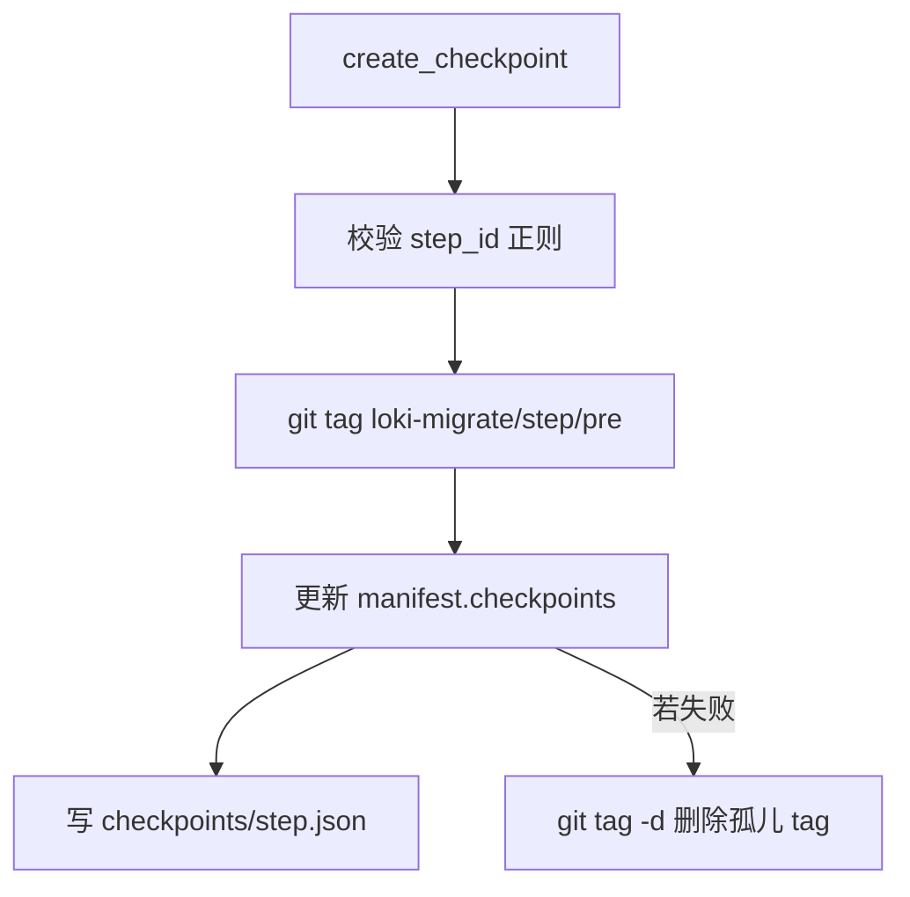
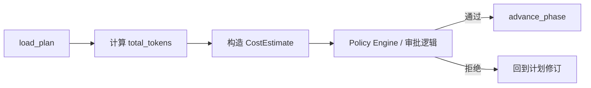
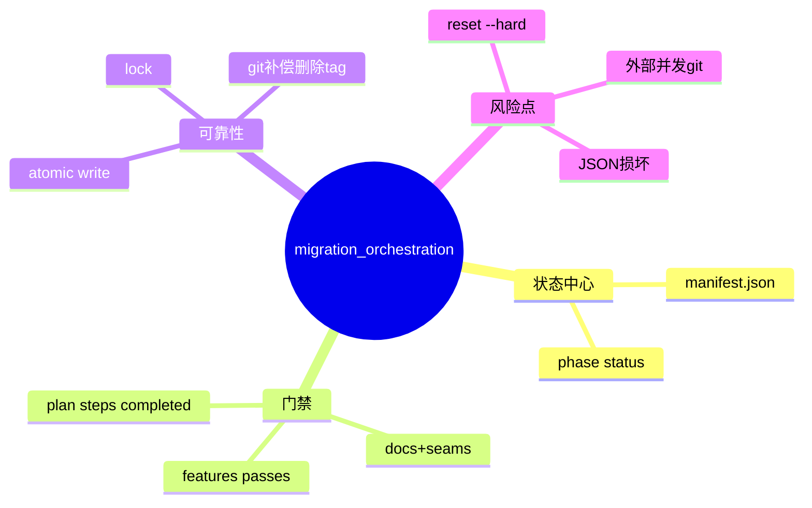

# migration_orchestration 模块文档

## 模块简介与设计动机

`migration_orchestration`（代码文件为 `dashboard/migration_engine.py`）是 Dashboard Backend 中负责“代码迁移编排（migration orchestration）”的核心后端模块。它服务于企业级 `loki migrate` 场景，目标不是简单执行一次性脚本转换，而是把高风险的代码库迁移拆解成**可分阶段推进、可中断恢复、可检查点回滚、可持续观测进度**的工程化流程。

这个模块存在的根本原因，是现实中的代码迁移往往具有以下特征：变更面大、持续时间长、涉及多人协作、失败成本高、并且需要可审计的过程记录。`MigrationPipeline` 通过 manifest + phase gate + 文件持久化 + Git checkpoint 的组合，将迁移过程显式建模为状态机，从而将“隐式经验驱动的迁移”转化为“显式约束驱动的迁移”。

从架构位置上看，它属于 **Dashboard Backend** 的一个子模块，既可以被后端 API 服务层调用，也可以间接被 CLI 工作流使用；同时它输出的状态、计划摘要、进度统计能够直接支撑前端迁移看板类组件（如 `LokiMigrationDashboard`）进行可视化展示。换句话说，`migration_orchestration` 不是一个“纯算法模块”，而是一个面向生产运维与工程治理的“流程内核模块”。

---

## 在系统中的位置与依赖关系



上图体现了这个模块的三个关键耦合面。第一，它向上被 API/CLI 作为编排能力调用；第二，它向下强依赖文件系统（持久化迁移状态）与 Git 命令（检查点与回滚）；第三，它通过统一日志器输出运行信息，便于后端诊断。该模块本身不负责 HTTP 路由、鉴权、WebSocket 推送，这些由 Dashboard Backend 其他部分承担，可参考 [Dashboard Backend](Dashboard Backend.md) 与 [api_surface_and_transport](api_surface_and_transport.md)。

---

## 核心数据模型（Dataclass）

虽然模块树中将 `dashboard.migration_engine.CostEstimate` 标记为核心组件，但实际代码中数据模型是一个完整族群，它们共同构成迁移编排的领域语言。

### 1) `CostEstimate`

`CostEstimate` 用于描述迁移执行的 Token 成本估算，包含总体与分阶段两个维度。

```python
@dataclass
class CostEstimate:
    total_tokens: int = 0
    estimated_cost_usd: float = 0.0
    by_phase: dict[str, int] = field(default_factory=dict)
```

它的价值在于把“迁移风险”中的经济成本显式化，便于上层策略（例如预算控制、审批门）进行判断。当前模块中它是纯数据容器，暂未内置自动估算逻辑，通常由上游流程填充后用于展示或策略决策。

### 2) `Feature`

`Feature` 用于表示被迁移系统中的可验证能力点（例如认证流程、订单闭环等）。其中 `passes` 字段是 `guardrail -> migrate` 阶段门的硬条件之一。

### 3) `MigrationStep`

`MigrationStep` 描述计划中的具体执行步骤，包含风险、依赖关系、涉及文件、回滚点标记、状态等信息。`status` 字段对阶段门（`migrate -> verify`）起决定作用：所有步骤必须是 `completed`。

### 4) `MigrationPlan`

`MigrationPlan` 封装迁移策略、步骤集合、约束和退出标准，是迁移执行层面的“作战计划”。

### 5) `SeamInfo`

`SeamInfo` 抽象代码中的“缝（seam）”，即 API/模块/数据库/config 等边界，主要为 understand 阶段产出服务，并作为阶段门校验依据（`seams.json` 必须存在）。

### 6) `MigrationManifest`

`MigrationManifest` 是全流程的状态主索引，记录迁移 ID、源/目标信息、阶段状态、关键文件路径、检查点列表等。它是最核心的持久化对象。

### 7) `PhaseResult`

`PhaseResult` 作为 `advance_phase` 的返回结构，表示阶段推进的结果与时间戳。

---

## 核心类：`MigrationPipeline`

`MigrationPipeline` 是模块的执行核心，负责生命周期管理、阶段推进、门禁校验、数据读写、检查点与回滚、进度聚合等全部编排职责。



### 初始化与实例化语义

构造函数会规范化 `codebase_path`、生成迁移 ID、初始化迁移目录、创建线程锁。需要注意它会对路径 basename 做强校验：如果无法推导项目名会抛 `ValueError`。迁移目录结构固定落在 `${LOKI_DATA_DIR:-~/.loki}/migrations/<migration_id>/` 下。

`MigrationPipeline.load(migration_id)` 则用于从现有迁移恢复实例，带有严格正则校验（`^mig_YYYYMMDD_HHMMSS_<name>$`）。这保证了目录扫描与加载行为的可预测性，也降低了路径注入风险。

### Manifest 读写与线程安全

`load_manifest/save_manifest` 对外提供线程安全包装；真正 I/O 逻辑在 `_load_manifest_unlocked/_save_manifest_unlocked`，并通过 `_lock` 保证读改写一致性。对于 manifest 的持久化采用 `_atomic_write`，实现“临时文件 + fsync + replace”的原子替换模式，降低崩溃中断导致 JSON 半写入损坏的概率。

### Phase Gate：迁移流程门禁

模块定义固定阶段顺序：

```python
PHASE_ORDER = ["understand", "guardrail", "migrate", "verify"]
```

`_check_phase_gate_unlocked` 实现了严格的相邻阶段校验：不允许跳阶段；每次推进都必须满足当前阶段到下一阶段的门禁条件。



这套门禁机制的设计理念是“先证明可理解，再证明可保护，再执行迁移，最后验证结果”，避免在证据不足时盲目前进。

### 阶段推进：`start_phase` 与 `advance_phase`

`start_phase` 是幂等的：当阶段已是 `in_progress` 时直接返回，不重复写入。它也允许重启已完成/失败阶段（适用于 resume 场景）。

`advance_phase` 在同一锁内完成门禁校验、当前阶段状态检查、阶段状态更新与下一阶段启动，确保时序一致。若当前阶段不处于 `in_progress`，会抛 `RuntimeError`，防止外部调用越权推进。

### 业务对象 CRUD

`load/save_features`、`load/save_plan`、`load/save_seams` 分别管理三个核心 JSON 文件。共同特征是：

- 读取时允许“容错字段”：只提取 dataclass 已知字段，忽略扩展字段；
- 读取时支持两种 JSON 形态（如列表或 `{"features": [...]}` 包裹）；
- 写入时统一原子落盘；
- 出现文件缺失、JSON 结构错误时抛出标准异常并记录日志。

这种“读兼容、写规范”的策略使模块在版本演进中更稳健。

### 检查点与回滚

`create_checkpoint(step_id)` 使用 Git tag（`loki-migrate/<step_id>/pre`）创建检查点，随后把 tag 记录到 manifest，并写 `checkpoints/<step_id>.json` 元数据。实现上有一个重要的补偿逻辑：如果 git tag 成功但 manifest 保存失败，会尝试删除刚创建的 tag，避免出现“孤儿标签”。

`rollback_to_checkpoint(step_id)` 执行 `git reset --hard <tag>`。这意味着它是**破坏性操作**，会直接重置工作区与索引到标签快照。

### 进度聚合与计划摘要

`get_progress` 返回面向 UI/API 的聚合视图，包含当前阶段、完成阶段列表、特性通过率、步骤完成度、最后检查点、seam 优先级统计等。它对缺失文件有容错处理，尽可能返回部分可用信息。

`generate_plan_summary` 生成纯文本计划摘要，适配 CLI `--show-plan` 场景。它会把步骤状态渲染为 `[ ]/[>]/[x]/[!]`，具备可读性和终端友好性。

---

## 关键流程详解

### 流程一：创建并启动迁移



这个流程强调初始化最小可运行状态：目录先建好，manifest 先落盘，阶段再启动。这样即便后续流程中断，也能通过 `load` 恢复。

### 流程二：阶段门校验与推进



这保证了阶段推进不是“命令式跳转”，而是“证据驱动推进”。

### 流程三：检查点创建与补偿



这个补偿分支是生产级可靠性设计的体现：外部副作用（Git）与内部状态（manifest）尽量保持一致。

---

## 持久化布局与文件约定

典型目录如下：

```text
~/.loki/migrations/
└── mig_20260223_143052_projectA/
    ├── manifest.json
    ├── features.json
    ├── migration-plan.json
    ├── seams.json
    ├── docs/
    └── checkpoints/
        └── step_001.json
```

其中：

- `manifest.json`：单一事实来源（SSOT）
- `features.json`：guardrail 阶段关键输入
- `migration-plan.json`：migrate 阶段关键输入
- `seams.json`：understand 阶段关键产物
- `docs/`：understand 阶段文档产物目录（非空即视为有产物）
- `checkpoints/*.json`：checkpoint 元数据

---

## 对外 API 与参数行为说明

### `MigrationPipeline.__init__(codebase_path, target, options=None)`

- `codebase_path`：待迁移仓库路径，会被转为绝对路径。
- `target`：迁移目标标识（语言、框架、版本或平台均可）。
- `options`：补充配置，`create_manifest` 时会写入 `target_info.options`。

副作用是立即创建迁移目录骨架。

### `MigrationPipeline.load(migration_id)`

从历史迁移目录恢复实例。若 ID 格式不合法、目录不存在或缺失 manifest，会抛出对应异常。

### `create_manifest()`

写入初始清单，并将 `understand` 标记为 `in_progress`，其他阶段为 `pending`。这是迁移生命周期的起点。

### `start_phase(phase)` / `advance_phase(phase)`

前者用于显式启动阶段，后者用于在门禁通过后推进阶段并切换下阶段。`advance_phase` 必须在当前阶段处于 `in_progress` 时调用。

### `check_phase_gate(from_phase, to_phase)`

返回 `(allowed, reason)`，适合 UI 或 API 在实际推进前做预检查。

### `load/save_features`, `load/save_plan`, `load/save_seams`

对三个核心业务文件进行对象化读写，写入采用原子更新。

### `create_checkpoint(step_id)` / `rollback_to_checkpoint(step_id)`

创建/回滚 Git 检查点。`step_id` 必须匹配 `^[a-zA-Z0-9_-]+$`。

### `get_progress()`

返回聚合进度字典，适合看板与 API 输出。

### `generate_plan_summary()`

返回 CLI 友好的计划摘要文本；若计划不存在，返回提示字符串。

### 单例工具

- `get_migration_pipeline(...)`：首次调用必须带 `codebase_path` 与 `target`。
- `reset_migration_pipeline()`：重置单例，常用于测试场景。

### 扫描工具

- `list_migrations()`：遍历 `${MIGRATIONS_DIR}`，读取 manifest 计算总体状态并汇总列表。

---

## 使用示例

### 示例 1：最小可用迁移流程

```python
from dashboard.migration_engine import MigrationPipeline

pipeline = MigrationPipeline(
    codebase_path="/repo/my-service",
    target="python3.12",
    options={"source_type": "python", "mode": "incremental"}
)

manifest = pipeline.create_manifest()
print(manifest.id)

# understand 阶段产物（示意）
pipeline.save_seams([])  # 实际应为识别到的 seam 列表
# 需要确保 docs/ 目录非空，否则 gate 不通过
(pipeline.migration_dir / "docs" / "overview.md").write_text("# docs", encoding="utf-8")

allowed, reason = pipeline.check_phase_gate("understand", "guardrail")
print(allowed, reason)
if allowed:
    pipeline.advance_phase("understand")
```

### 示例 2：写入计划并推进 migrate

```python
from dashboard.migration_engine import MigrationPlan, MigrationStep

plan = MigrationPlan(
    version=1,
    strategy="incremental",
    steps=[
        MigrationStep(id="step_1", description="update deps", status="completed"),
        MigrationStep(id="step_2", description="refactor auth", status="completed"),
    ],
)
pipeline.save_plan(plan)

# 前提：当前已在 migrate 阶段 in_progress
pipeline.advance_phase("migrate")
```

### 示例 3：检查点与回滚

```python
tag = pipeline.create_checkpoint("step_2")
print("checkpoint:", tag)

# 出现问题时回滚
pipeline.rollback_to_checkpoint("step_2")
```

---

## 配置项与运行时环境

模块当前核心配置来自环境变量：

```bash
export LOKI_DATA_DIR=/data/loki
```

若未设置，默认使用 `~/.loki`。最终迁移目录为 `${LOKI_DATA_DIR}/migrations`。

运行时外部依赖包括：

- 可执行 `git` 命令（用于 tag/reset）；
- 目标代码库是有效 Git 仓库；
- 进程有足够文件权限与磁盘空间。

---

## 异常、边界条件与常见陷阱

### 参数与输入校验

`migration_id` 与 `step_id` 都有严格正则。任何不符合规范的输入会触发 `ValueError`，这是预期行为。请勿把用户原始输入直接透传到这些接口，应先做前端/服务端双重校验。

### 阶段推进顺序错误

`advance_phase` 不允许跨阶段，也不允许在非 `in_progress` 状态下推进当前阶段。典型错误是调用者只改业务文件却忘记 `start_phase`。

### gate 条件“看起来满足但实际失败”

- `understand -> guardrail` 要求 `docs/` **非空**，仅目录存在不够；
- `guardrail -> migrate` 要求所有 feature `passes=True`；
- `migrate -> verify` 要求所有 step `status="completed"`。

### Git 操作风险

`rollback_to_checkpoint` 使用 `git reset --hard`，会覆盖本地未提交变更。在线上自动化时应配套防护，例如先做 dirty working tree 检测与显式确认。

### 并发与一致性边界

模块对自身状态文件读写有锁保护，但它不管理外部进程对同一仓库的并发 Git 操作。如果多个执行器同时改同一仓库，仍可能产生竞态。

### JSON 兼容与容错

读取时会过滤未知字段，这对向前兼容友好；但如果关键字段类型错误，仍会抛 `TypeError/JSONDecodeError`。建议上游写入前做 schema 校验。

---

## 可扩展性建议

扩展该模块时，建议遵循“状态先行、门禁驱动、可补偿副作用”原则。

如果你希望加入新阶段，例如 `"dry_run"`，不应只改 `PHASE_ORDER`，还需要同步更新 gate 逻辑、进度聚合、UI 展示语义与测试用例。若引入新的持久化文件，建议继续复用 dataclass + 原子写模式，保持恢复能力与一致性。

如果要扩展成本控制能力，可围绕 `CostEstimate` 新增估算器与预算门禁，将 `by_phase` 与计划步骤绑定，再在 `advance_phase` 前注入“预算是否超限”的判定。

---

## `CostEstimate` 的落地用法与扩展模式

虽然 `CostEstimate` 在当前实现中是一个轻量 dataclass，但在实际系统里它通常会成为迁移治理的一个“前置决策输入”。一个典型模式是：在 `understand` 或 `guardrail` 阶段，根据 `MigrationPlan.steps[].estimated_tokens` 汇总 token 预算，换算为美元区间，然后将结果发送给 Dashboard 或策略层进行审批。如果审批未通过，调用方不执行 `advance_phase`，而是停留在当前阶段进行计划重整。



在实现上，推荐将成本估算逻辑放在上层服务，而不是直接塞入 `MigrationPipeline`。这样可以保持 `migration_orchestration` 的职责单一：它只负责流程状态与门禁，不直接承担组织策略。若你需要预算门禁，建议通过外层 orchestration service 在调用 `advance_phase` 之前做“软拦截”。这与模块当前设计高度一致，也更利于测试隔离。

你也可以采用以下最小示例来填充 `CostEstimate`：

```python
from dashboard.migration_engine import CostEstimate

def estimate_cost_from_plan(plan, unit_price_per_1k_tokens=0.01):
    total = sum(step.estimated_tokens for step in plan.steps)
    return CostEstimate(
        total_tokens=total,
        estimated_cost_usd=(total / 1000.0) * unit_price_per_1k_tokens,
        by_phase={"migrate": total}
    )
```

这个模式的关键不在计算公式本身，而在“将成本对象化并进入流程决策链”。只要 `CostEstimate` 被稳定地作为 API 返回或审计记录的一部分，它就能与 [Policy Engine](Policy Engine.md)、成本看板组件（如 `LokiCostDashboard`）以及治理 API（如 `v2_admin_and_governance_api.md`）形成可追踪闭环。

---


## 与其他模块的协作（避免重复）

本模块只负责迁移编排内核，不覆盖 API 传输、前端展现或策略引擎细节。建议结合下列文档阅读：

- [Dashboard Backend](Dashboard Backend.md)：理解后端整体分层与服务入口。
- [api_surface_and_transport](api_surface_and_transport.md)：理解 HTTP/WebSocket 侧如何暴露编排能力。
- [session_control_runtime](session_control_runtime.md)：理解运行时会话/任务控制模型。
- [API Server & Services](API Server & Services.md)：理解服务总线与事件驱动基础设施。
- [Policy Engine](Policy Engine.md)：若你计划把预算/审批门禁接入迁移流程，可参考策略引擎机制。

---

## 维护者速查



该模块的维护重点不在“算法复杂度”，而在**状态一致性、流程正确性、异常可恢复性**。如果你在排障，建议优先检查 `manifest.json`、阶段状态与门禁输入文件三者是否一致，再看 Git tag 与 checkpoint 元数据是否匹配。
