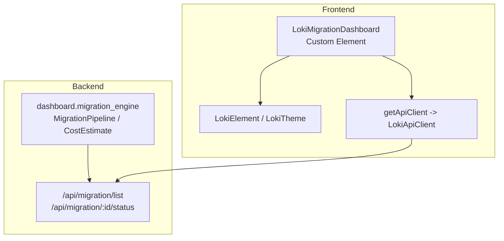
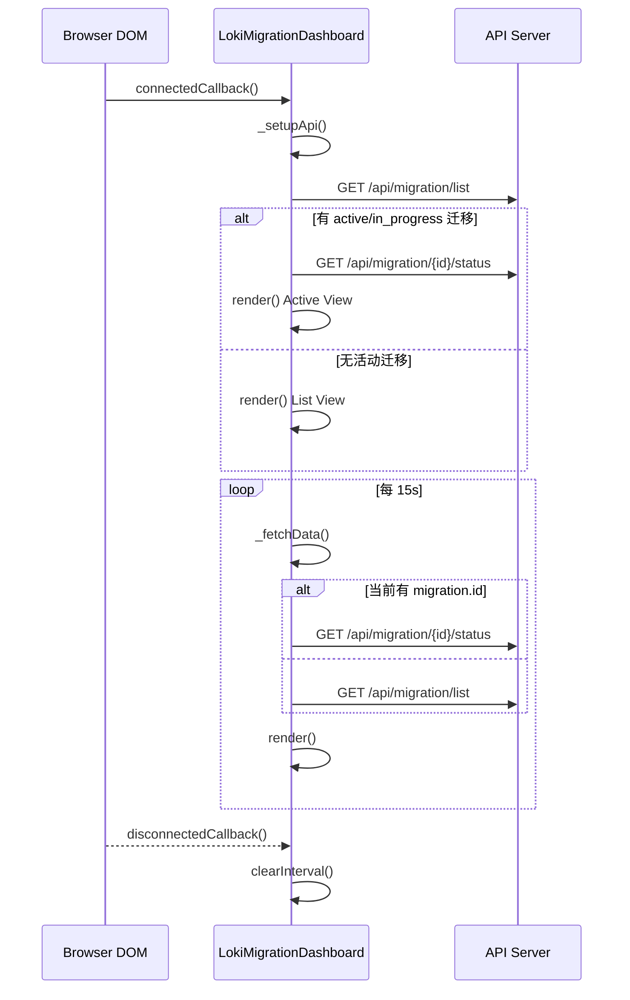
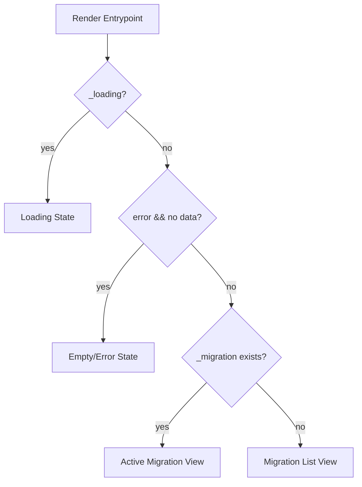
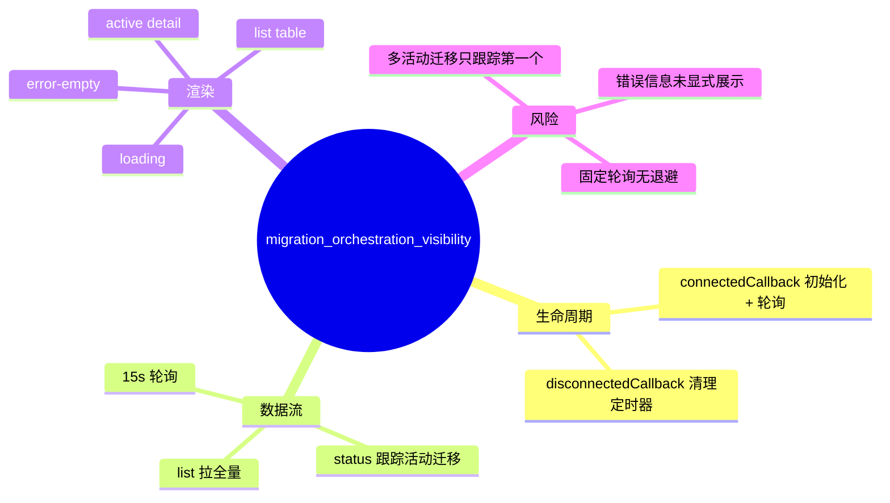

# migration_orchestration_visibility 模块文档

## 模块定位与设计目标

`migration_orchestration_visibility` 是 Dashboard UI Components 中面向“迁移编排可视化”的前端模块，核心组件为 `dashboard-ui.components.loki-migration-dashboard.LokiMigrationDashboard`（文件：`dashboard-ui/components/loki-migration-dashboard.js`）。这个模块的职责不是执行迁移，也不做后端编排决策，而是把后端迁移状态转换成可理解、可追踪、可操作的可视化信息面板。

在系统整体中，它承担“最后一公里可观测性”的角色：后端 `migration_orchestration` 负责状态机、阶段门禁、检查点与回滚，而该模块负责周期性拉取状态并用统一的 Loki 主题风格呈现给用户。这样做的设计收益是将“编排逻辑”和“可视化逻辑”解耦，后端可以保持流程正确性，前端可以独立迭代交互体验与信息密度。

如果你想先理解迁移编排本体，请先阅读 [migration_orchestration.md](migration_orchestration.md)；本文聚焦 UI 可视化层与其运行行为。

---

## 在系统中的架构位置



上图显示了该模块的关键边界：它依赖 API 获取数据，依赖 `LokiElement` 提供主题与基础样式能力，但不依赖后端实现细节。换句话说，它只约束“接口契约与展示语义”，而不关心迁移是如何在后端执行的。

---

## 组件关系与生命周期



这个流程体现了组件的核心策略：**初始拉全量列表，运行期优先跟踪单个活动迁移**。这样可以减少重复数据处理，同时确保活跃任务获得更高刷新优先级。

---

## 核心组件详解：`LokiMigrationDashboard`

### 1) 继承与职责

`LokiMigrationDashboard` 继承 `LokiElement`，因此天然具备 Shadow DOM、主题切换事件监听、基础令牌样式注入等能力。该组件自身增加了三类职责：

- 迁移数据拉取与轮询调度
- 迁移状态到视图模型的转换
- 卡片、阶段条、列表、检查点等 UI 片段渲染

### 2) 可观察属性

```javascript
static get observedAttributes() {
  return ['api-url', 'theme'];
}
```

组件观察两个属性：

- `api-url`：后端 API 基地址。若变化且 `_api` 已初始化，则即时更新 `baseUrl` 并重新拉取迁移列表。
- `theme`：触发 `_applyTheme()` 以应用主题。

这保证了组件可在运行时动态切环境（例如从本地 API 切到代理 API）并同步主题。

### 3) 内部状态字段

组件通过以下字段维护运行状态：

- `_migration`: 当前被追踪的活动迁移详情（来自 `/status`）。
- `_migrations`: 迁移列表（来自 `/list`）。
- `_loading`: 首屏加载状态。
- `_error`: 最近一次请求错误信息。
- `_api`: API 客户端实例（`getApiClient` 返回）。
- `_pollInterval`: 轮询定时器句柄。

这些状态共同决定 `render()` 的三种模式：Loading、Active Migration、List/Empty。

---

## 方法级行为说明（含参数、返回值、副作用）

### `connectedCallback()`

该方法先调用 `super.connectedCallback()`，注册主题监听并做初始渲染；随后初始化 API、触发首次数据拉取，并注册 15 秒轮询。

- 参数：无
- 返回值：无
- 副作用：创建定时器、发起网络请求、触发 UI 重绘

### `disconnectedCallback()`

该方法负责清理轮询定时器，避免组件从 DOM 卸载后仍继续请求。

- 参数：无
- 返回值：无
- 副作用：`clearInterval`

### `attributeChangedCallback(name, oldValue, newValue)`

属性变化处理函数。它有两个关键分支：

- `api-url` 变更：更新 `_api.baseUrl`，重新加载迁移列表。
- `theme` 变更：应用新主题。

- 参数：`name`, `oldValue`, `newValue`
- 返回值：无
- 副作用：可能触发网络请求与重绘

### `_setupApi()`

从 `api-url` 属性读取基地址，若缺失则回退到 `window.location.origin`，并调用 `getApiClient({ baseUrl })`。

- 参数：无
- 返回值：无
- 副作用：初始化 `_api`

### `_fetchMigrations()`

请求 `/api/migration/list` 并写入 `_migrations`。接口兼容两种返回形态：数组或 `{ migrations: [...] }`。随后自动查找第一个活动迁移（`status === 'in_progress' || 'active'`），若找到则进一步拉取详情状态。

- 参数：无
- 返回值：`Promise<void>`
- 副作用：更新 `_migrations`、`_migration`、`_error`、`_loading` 并触发 `render()`

### `_fetchStatus(id)`

请求 `/api/migration/{id}/status`，内部使用 `encodeURIComponent(id)` 防止路径字符问题。

- 参数：`id: string`
- 返回值：`Promise<void>`
- 副作用：更新 `_migration` 或 `_error`

### `_fetchData()`

轮询入口。若已有 `_migration` 且可解析到 id，则只拉取单任务状态；否则回退拉取列表。

- 参数：无
- 返回值：`Promise<void>`
- 副作用：网络请求与重绘

### `_escapeHtml(str)`

对渲染文本做 HTML 转义，覆盖 `& < > " '` 五类字符，降低 XSS 风险。

- 参数：`str: any`
- 返回值：`string`
- 副作用：无

### `_getPhaseIcon(phase, currentPhase, completedPhases)`

返回阶段图标语义：`[x]`（已完成）/`[>]`（当前）/`[ ]`（未开始）。

- 参数：`phase`, `currentPhase`, `completedPhases`
- 返回值：`string`
- 副作用：无

### `_getPhaseIndex(phase)`

计算阶段序号（基于常量 `PHASES`），未知值回退为 `0`。当前版本未在渲染中直接使用，但可作为后续排序/进度增强预留。

- 参数：`phase: string`
- 返回值：`number`
- 副作用：无

### `_renderPhaseBar(currentPhase, completedPhases)`

按固定阶段顺序渲染进度条片段，使用 `PHASE_COLORS` + opacity 表示状态强度。

- 参数：`currentPhase`, `completedPhases`
- 返回值：`string`（HTML 片段）
- 副作用：无

### `_renderFeatureStats(features)`

展示 Feature 通过率：`passing / total` 与百分比。色彩阈值是：

- `>= 80%` 使用成功色
- `>= 50%` 使用警告色
- `< 50%` 使用错误色

- 参数：`features: { passing?: number, total?: number }`
- 返回值：`string`
- 副作用：无

### `_renderStepProgress(steps)`

展示步骤完成率 `current / total`。

- 参数：`steps: { current?: number, total?: number }`
- 返回值：`string`
- 副作用：无

### `_renderSeamSummary(seams)`

展示 seam 风险分层汇总（`high/medium/low`）。

- 参数：`seams: { total?: number, high?: number, medium?: number, low?: number }`
- 返回值：`string`
- 副作用：无

### `_renderCheckpoint(checkpoint)`

展示最后检查点时间与 step id，兼容 `step_id` 与 `stepId` 两种字段命名。

- 参数：`checkpoint: { timestamp?: string, step_id?: string, stepId?: string }`
- 返回值：`string`
- 副作用：无

### `_renderMigrationList()`

无活动迁移时渲染表格。状态 badge 规则：`completed`、`failed`、其余归 `status-pending`。

- 参数：无
- 返回值：`string`
- 副作用：无

### `render()`

主渲染函数，输出三种 UI 模式：

1. `_loading === true`：显示 spinner。
2. `_error && 无任何数据`：显示 `No migration data available`。
3. 有 `_migration`：显示活动迁移详情（阶段条、统计卡片、checkpoint）。
4. 否则：显示迁移列表。

- 参数：无
- 返回值：无
- 副作用：覆盖 `shadowRoot.innerHTML`

---

## 数据契约与字段兼容策略

### 列表接口（`/api/migration/list`）

组件接受以下任一形态：

```json
[
  { "migration_id": "mig_001", "source": "repo-a", "target": "repo-b", "status": "in_progress" }
]
```

或：

```json
{
  "migrations": [
    { "id": "mig_001", "source": "repo-a", "target": "repo-b", "status": "active" }
  ]
}
```

### 状态接口（`/api/migration/{id}/status`）

建议返回字段（可部分缺省）：

```json
{
  "migration_id": "mig_001",
  "source": "python-service",
  "target": "python3.12",
  "current_phase": "guardrail",
  "completed_phases": ["understand"],
  "features": { "passing": 42, "total": 50 },
  "steps": { "current": 7, "total": 20 },
  "seams": { "total": 33, "high": 4, "medium": 10, "low": 19 },
  "last_checkpoint": { "timestamp": "2026-02-26T08:15:00Z", "step_id": "step_07" }
}
```

组件做了字段别名兼容：`migration_id|id`、`current_phase|phase`、`last_checkpoint|checkpoint`、`step_id|stepId`，从而降低前后端版本小幅错配时的中断风险。

---

## 交互与渲染语义



这个渲染分支的含义是：组件优先保证“页面可用”，即便状态请求失败，也尽量降级到空态而不是抛出异常中断 UI。

---

## 使用方式与配置示例

### 基础用法

```html
<loki-migration-dashboard api-url="http://localhost:57374"></loki-migration-dashboard>
```

### 主题切换

```html
<loki-migration-dashboard
  api-url="/"
  theme="dark">
</loki-migration-dashboard>
```

`theme` 由 `LokiElement` 负责应用，支持的主题细节请参考 [Core Theme.md](Core Theme.md) 与 [Unified Styles.md](Unified Styles.md)。

### 在应用中动态切换 API 地址

```javascript
const el = document.querySelector('loki-migration-dashboard');
el.setAttribute('api-url', 'https://staging.example.com');
// 组件会自动重新拉取 /api/migration/list
```

---

## 扩展建议（如何安全演进）

如果你计划扩展该模块，建议优先遵循以下方向：

- 在不破坏现有字段兼容的前提下新增可视化卡片，例如成本卡片（可接入后端 `CostEstimate`）。
- 如果需要展示多个活动迁移，不应直接复用 `_migration` 单实例模型，而应引入“活动集合 + 选中项”状态结构。
- 如果打算从轮询升级为 WebSocket/SSE，请保留 `_fetchData()` 作为降级路径，确保网络受限环境仍可用。

下面是“成本可视化”的扩展示意：

```javascript
_renderCostEstimate(cost) {
  if (!cost) return '';
  const tokens = cost.total_tokens || 0;
  const usd = Number(cost.estimated_cost_usd || 0).toFixed(4);
  return `
    <div class="stat-card">
      <div class="stat-header">Estimated Cost</div>
      <div class="stat-value">$${usd}</div>
      <div class="stat-pct">${tokens} tokens</div>
    </div>
  `;
}
```

对应后端对象可参考 `dashboard.migration_engine.CostEstimate`（详见 [migration_orchestration.md](migration_orchestration.md) 与 [Migration Engine.md](Migration Engine.md)）。

---

## 边界条件、错误处理与已知限制

### 1) 轮询与资源消耗

当前固定每 15 秒轮询一次，不区分标签页可见性，也没有退避策略。在大量面板并发打开时，会增加 API 压力。建议后续结合 `document.visibilityState` 或指数退避策略优化。

### 2) 错误可见性较弱

当出现错误且无数据时，UI 只显示 `No migration data available`，不会直接展示 `_error` 具体内容。这样对最终用户友好，但对排障不友好。若用于内部平台，建议增加 debug 模式显示错误详情。

### 3) 仅追踪第一个活动迁移

`_fetchMigrations()` 使用 `find` 选取第一个 `in_progress/active` 迁移作为 `_migration`。若后端允许并行迁移，其他活动任务不会在详情模式显示，只能在列表中看到。

### 4) 时间本地化差异

检查点时间使用 `new Date(...).toLocaleString()`，显示格式受浏览器语言与时区影响，不保证跨地区一致。若审计要求严格，建议增加 UTC 明文展示。

### 5) 字段契约松耦合但非强校验

组件对缺失字段做容错（默认值或空字符串），这能提高健壮性，但也可能掩盖后端契约偏移。建议在集成测试中加入 schema 断言。

### 6) 安全性注意点

文本字段都经过 `_escapeHtml()`，可以防止常见 HTML 注入，但仍需后端保证数据可信来源，并在 API 层做输入清洗与鉴权。

---

## 与其他模块的协作关系（避免重复说明）

- 迁移编排核心逻辑与阶段门禁：见 [migration_orchestration.md](migration_orchestration.md)
- Dashboard Backend API 面与传输层：见 [api_surface_and_transport.md](api_surface_and_transport.md)
- UI 基础主题与样式系统：见 [Core Theme.md](Core Theme.md)、[Unified Styles.md](Unified Styles.md)
- 管理与基础设施组件集合上下文：见 [Administration and Infrastructure Components.md](Administration and Infrastructure Components.md)

---

## 维护者快速检查清单



如果你在排查“看板没数据”的问题，建议按这个顺序检查：API 地址是否正确、`/api/migration/list` 是否返回可解析结构、是否存在活动迁移、组件是否被频繁卸载导致轮询中断。