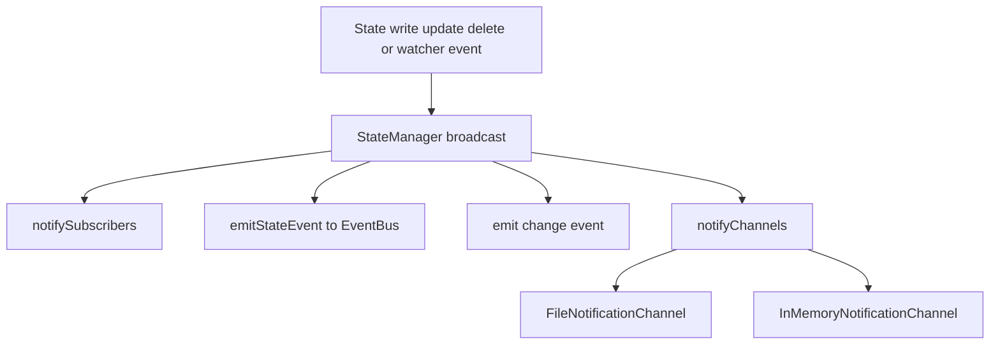
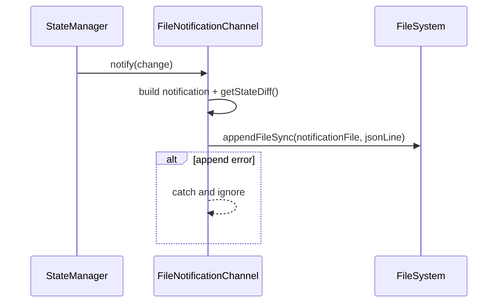
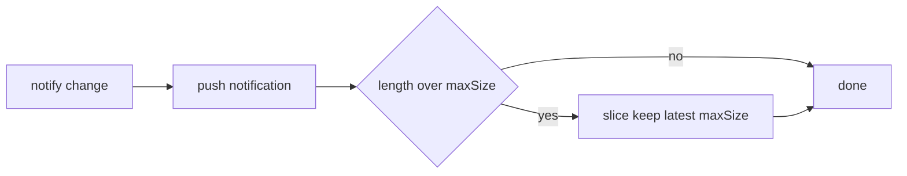
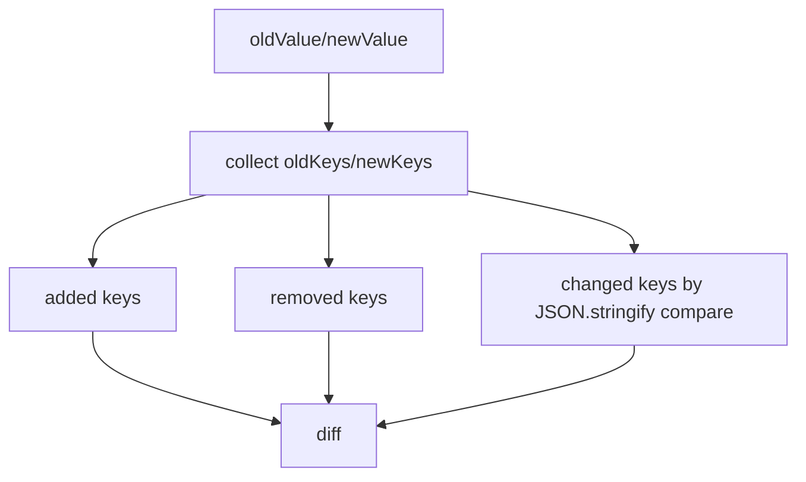
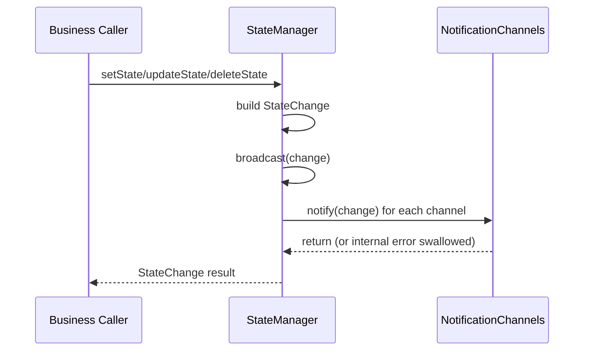

# notification_channels 模块文档

## 模块概述

`notification_channels` 是 `State Management` 子系统中的“状态变更输出层”，位于 `state/manager.ts` 内，核心组件是 `InMemoryNotificationChannel` 与 `FileNotificationChannel`。这个模块的存在目的不是管理状态本身，而是把已经发生的 `StateChange` 事件，以统一契约投递到不同介质中。换句话说，`StateManager` 负责“状态正确写入与变更广播”，而 `notification_channels` 负责“把广播落到具体渠道”。

这种设计的价值在于解耦。业务方不需要改 `StateManager` 的核心逻辑，就可以追加新的通知目标（例如 Webhook、消息队列、实时推送服务），同时保持同一套变更语义。对于测试、CLI 观测、离线审计和调试回放，这个模块提供了开箱即用的两种实现：基于文件持久化的通道，以及基于内存缓冲的通道。

如果你希望先理解完整状态管理机制（缓存、文件监听、事件总线、版本化与回滚），建议先阅读 [state_management](state_management.md)。本文聚焦 `notification_channels` 的职责、行为和扩展方法。

---

## 在系统架构中的位置

在运行链路中，通知通道挂载于 `StateManager.broadcast(change)` 的末端阶段。一次变更由 `setState/updateState/deleteState/onFileChanged` 触发后，会依次经过内部订阅回调、EventBus 事件发射、`EventEmitter` 事件发射，最后才进入通知通道。因此通知通道是“旁路输出”，不参与状态一致性决策。



从职责分层看，这个模块与上层展示组件（如 `loki-notification-center`）并不直连，通常由后端 API / WebSocket 层做二次封装后再传递给 UI。相关系统上下文可参考 [notification_operations](notification_operations.md) 与 [api_surface_and_transport](api_surface_and_transport.md)。

---

## 设计契约与数据模型

### `NotificationChannel` 接口

`notification_channels` 的可扩展性来自一个非常小的接口：

```typescript
export interface NotificationChannel {
  notify(change: StateChange): void;
  close(): void;
}
```

`notify` 表示接收一条状态变更；`close` 用于释放资源。接口是同步签名，意味着 `StateManager` 会在广播路径中同步调用各通道。实现方应该把 `notify` 设计为快速、可容错、非阻塞优先。

### `StateChange` 输入语义

两个核心通道都消费同一结构：

```typescript
interface StateChange {
  filePath: string;
  oldValue: Record<string, unknown> | null;
  newValue: Record<string, unknown>;
  timestamp: string;
  changeType: "create" | "update" | "delete";
  source: string;
}
```

这里的 `oldValue/newValue` 是完整对象快照而不是 patch。为了产出可消费的差异摘要，两个通道都会调用 `getStateDiff(oldValue, newValue)`，生成 `added/removed/changed` 三段式结构。

---

## 核心组件一：`FileNotificationChannel`

### 功能定位

`FileNotificationChannel` 将每次变更转换为一行 JSON 并追加写入到指定文件（JSONL）。它适用于脚本消费、`tail -f` 实时观察、轻量审计、故障回放线索保留等场景。该实现强调“失败隔离”：通道失败不影响状态主流程。

### 内部工作流程

构造函数会检查目标路径的目录是否存在，不存在则递归创建。`notify` 调用时会先构建标准通知对象，其中 `diff` 由 `getStateDiff` 计算得到，然后执行同步追加写入。若写入过程中发生异常，代码会吞掉错误并返回，避免对 `StateManager` 主路径造成级联影响。



### 构造参数、方法、返回值与副作用

`constructor(notificationFile: string)` 的输入是通知文件路径。该构造过程的副作用是可能创建目录（`fs.mkdirSync(..., { recursive: true })`）。

`notify(change: StateChange): void` 无返回值。副作用是一次同步文件 I/O，以及将 `StateChange` 精简为带 `diff` 的可序列化结构。注意它不会写入完整 `oldValue/newValue`，而是写入差异摘要，这有利于减小日志体积。

`close(): void` 当前为空实现，因为文件追加模式不持有常驻句柄，也没有内部线程或定时器需要释放。

### 写入格式示例

```json
{
  "timestamp": "2026-01-01T10:00:00.000Z",
  "filePath": "state/orchestrator.json",
  "changeType": "update",
  "source": "orchestrator",
  "diff": {
    "added": {},
    "removed": {},
    "changed": {
      "currentPhase": { "old": "plan", "new": "execute" }
    }
  }
}
```

---

## 核心组件二：`InMemoryNotificationChannel`

### 功能定位

`InMemoryNotificationChannel` 主要服务于测试与调试。它把通知保存在内存数组中，便于在测试用例里直接断言事件内容，也适用于短生命周期诊断场景。

### 内部工作流程

该类维护 `notifications` 缓冲区和 `maxSize` 上限。每次 `notify` 都会构造一个包含 `oldValue/newValue/diff` 的完整通知对象并推入数组。若数组长度超过上限，执行切片保留最新 N 条，实现“滑动窗口”行为。



### 构造参数、方法、返回值与副作用

`constructor(maxSize: number = 1000)` 用于限制缓冲区条数。它限制的是“记录数量”，不是字节大小。

`notify(change: StateChange): void` 无返回值。副作用是更新内存数组，并在必要时触发裁剪。

`getNotifications()` 返回通知数组的浅拷贝（`[...this.notifications]`），避免调用方直接替换内部数组引用。

`clear(): void` 清空缓冲区，常见于测试用例前置清理。

`close(): void` 也会清空缓冲区，符合通道生命周期结束时释放内存的语义。

---

## 关键辅助逻辑：`getStateDiff` 的行为边界

虽然它不属于“通道类”，但两种通道都依赖它，因此是理解通知内容的关键。该函数在顶层 key 维度计算差异：新键进入 `added`，缺失键进入 `removed`，同名键值变化进入 `changed`。变化判定基于 `JSON.stringify(old) !== JSON.stringify(new)`。



这意味着它不是 RFC 6902 JSON Patch，也不是深路径级别增量。若顶层字段是大对象，任何内部变化都会以该字段整体变化呈现。

---

## 组件关系与依赖说明

### 代码级依赖

- 直接依赖 Node.js 内建模块：`fs`、`path`。
- 通过 `StateManager.addNotificationChannel()` 被注入到状态广播流程。
- 输入类型依赖 `StateChange` 与 `getStateDiff`。

### 与其他模块的协作边界

`notification_channels` 不负责事件总线协议、HTTP 推送、WebSocket 会话管理或 UI 呈现。它仅作为本地状态层的通知抽象。若你需要跨进程分发，请结合 [Event Bus](Event Bus.md) 或 API 服务层文档 [runtime_services](runtime_services.md) 进行桥接；若你关注状态文件范围与语义，请参考 [state_file_contracts](state_file_contracts.md)。

---

## 典型使用方式

### 生产环境：文件通知落盘

```typescript
import { getStateManager, FileNotificationChannel, ManagedFile } from "./state/manager";

const manager = getStateManager({
  lokiDir: ".loki",
  enableWatch: true,
  enableEvents: true,
});

const fileChannel = new FileNotificationChannel(".loki/events/state-changes.jsonl");
const disposable = manager.addNotificationChannel(fileChannel);

manager.setState(ManagedFile.ORCHESTRATOR, { currentPhase: "planning" }, "orchestrator");

// 结束时释放
// disposable.dispose();
```

### 测试环境：内存通知断言

```typescript
import { getStateManager, resetStateManager, InMemoryNotificationChannel, ManagedFile } from "./state/manager";

beforeEach(() => resetStateManager());

test("autonomy state create should be captured", () => {
  const manager = getStateManager({ enableWatch: false, enableEvents: false });
  const channel = new InMemoryNotificationChannel(100);
  manager.addNotificationChannel(channel);

  manager.setState(ManagedFile.AUTONOMY, { status: "active" }, "test");

  const events = channel.getNotifications();
  expect(events).toHaveLength(1);
  expect(events[0].changeType).toBe("create");
  expect(events[0].diff.added).toMatchObject({ status: "active" });
});
```

### 运维观察：实时读取 JSONL

```bash
tail -f .loki/events/state-changes.jsonl
```

可搭配 `jq` 做筛选，例如只看某个文件：

```bash
tail -f .loki/events/state-changes.jsonl | jq 'select(.filePath=="state/orchestrator.json")'
```

---

## 扩展指南：实现自定义通知通道

新增通道只需实现 `NotificationChannel`。推荐把网络 I/O、重试、批处理放到内部队列，避免 `notify` 长时间阻塞。下面是最小骨架：

```typescript
import { NotificationChannel, StateChange } from "./state/manager";

export class WebhookNotificationChannel implements NotificationChannel {
  constructor(private endpoint: string) {}

  notify(change: StateChange): void {
    try {
      // 建议替换为内部异步队列 + 重试策略
      void fetch(this.endpoint, {
        method: "POST",
        headers: { "content-type": "application/json" },
        body: JSON.stringify(change),
      });
    } catch {
      // 保持失败隔离
    }
  }

  close(): void {
    // 释放队列、timer、连接等资源
  }
}
```

### 扩展实现建议

- `notify` 应尽量快返回，避免拖慢 `StateManager.broadcast`。
- `close` 应设计为幂等，多次调用不抛错。
- 对失败重试设置上限，避免无界积压。
- 若通道需要可靠投递，应引入外部持久队列，而不是依赖内存暂存。

---

## 边界条件、错误处理与已知限制

本模块采用显式的“best effort”语义。`StateManager` 在调用通知通道时统一 `try/catch`，因此通道错误不会阻断状态写入，也不会触发自动回滚。这一策略提升了主流程可用性，但也意味着通知并非强一致确认机制。

`FileNotificationChannel` 使用同步 `appendFileSync`。在变更频率高、通道数量多或磁盘性能差时，广播路径延迟会增长。若系统处于高吞吐场景，应优先采用异步批量通道或将通知逻辑外移到独立消费者。

`InMemoryNotificationChannel` 的容量控制基于条数而非体积。若单条 `newValue` 很大，即使 `maxSize` 较小仍可能占用大量内存。此外，超过上限后的 `slice` 会带来数组复制成本。

`getStateDiff` 依赖 `JSON.stringify` 对比，存在对象键序差异导致“语义相同但判定 changed”的可能。对于审计严谨场景，建议上游先做字段规范化或引入稳定序列化策略。

在删除事件中，`newValue` 被设为 `{}`。若下游消费方把空对象误认为“合法空状态”，可能导致语义混淆。建议严格结合 `changeType === "delete"` 判定。

---

## 过程流总览：从状态写入到通知落地



这个流程强调了一个事实：调用方拿到 `StateChange` 返回值并不代表“所有通知外发成功”，而只代表“状态层主操作完成且通知已尝试执行”。

---

## 总结

`notification_channels` 模块以极简接口提供了高可插拔的状态通知能力，是 `StateManager` 连接外部观察与集成系统的关键扩展点。`FileNotificationChannel` 适合落盘和脚本生态，`InMemoryNotificationChannel` 适合测试与调试。理解它的同步调用、失败隔离与 best-effort 特性后，你就可以在不破坏状态核心逻辑的前提下，安全地扩展更多通知通道。
