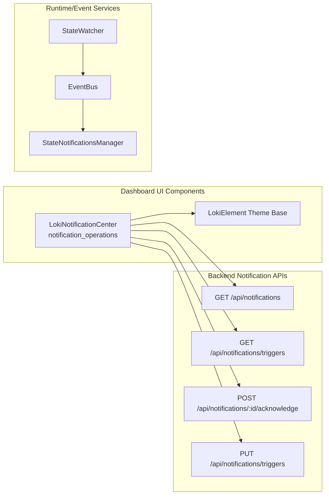
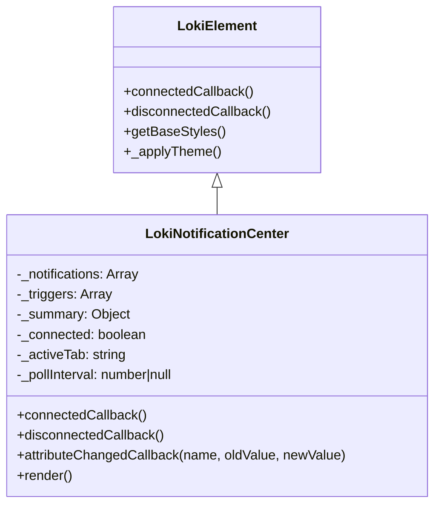
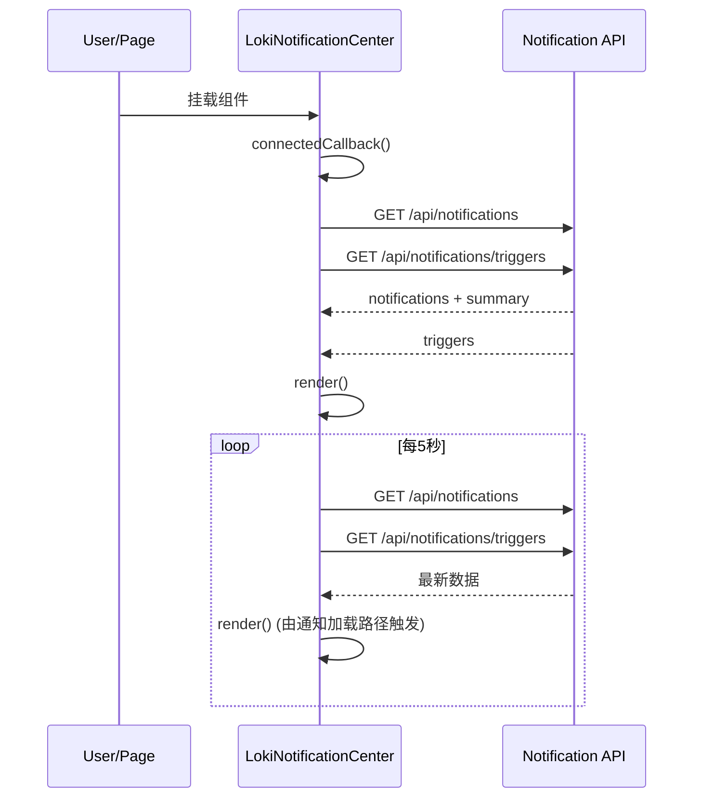
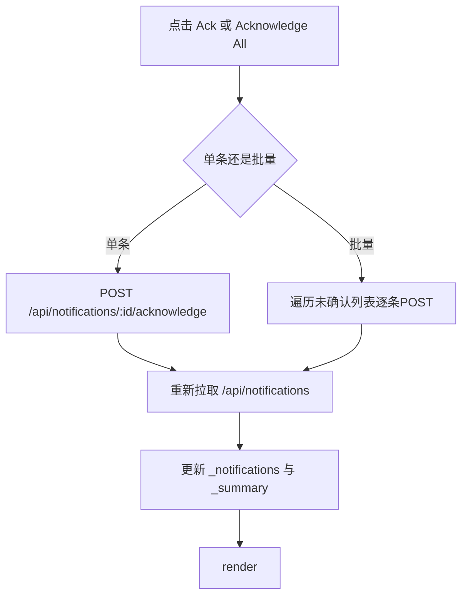
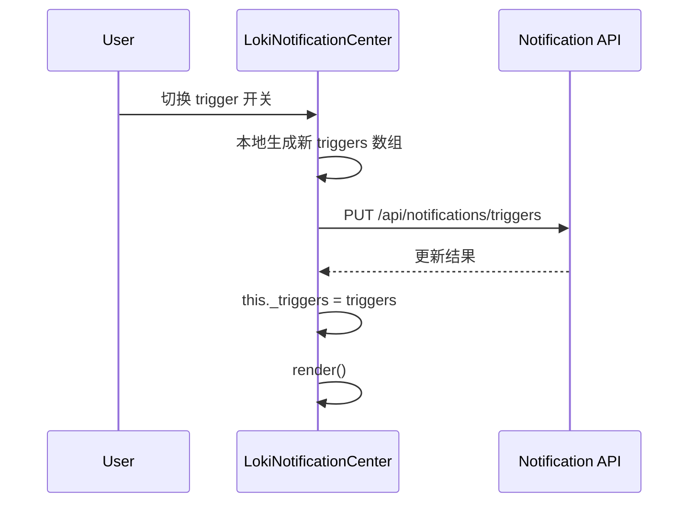

# notification_operations 模块文档

## 模块简介与设计目标

`notification_operations` 是 **Administration and Infrastructure Components** 子域中的通知操作模块，当前核心实现为 `dashboard-ui.components.loki-notification-center.LokiNotificationCenter`。这个模块存在的核心目的，是把“系统状态变化、告警触发、人工确认”这三类本来分散在后端事件流中的信息，聚合成一个可操作、可观察的统一入口。对于运维、平台管理员、以及需要追踪运行健康状态的开发者来说，它提供了最短路径来回答三个关键问题：系统发生了什么、哪些告警还未处理、哪些告警规则应该暂时关闭或恢复。

从实现策略看，该模块选择了“**Web Component + 周期轮询 API**”的方式，而不是强依赖 WebSocket。这样的取舍让组件更容易嵌入现有页面、跨框架复用（React/Vue/原生都可用），并在部署上只依赖标准 HTTP 接口。代价是存在轮询延迟（默认 5 秒）与额外网络请求，但实现复杂度更低、兼容性更强。

在系统层面，`notification_operations` 不负责通知生成，它专注于通知展示与操作。通知来源通常由运行时服务侧（例如状态监听、事件总线）产生并沉淀到通知 API，再由该组件拉取并渲染。因此它是一个“**消费层 + 操作层**”组件，而不是“生产层”组件。

---

## 在整体系统中的位置

`notification_operations` 位于 Dashboard UI 侧，但数据依赖跨越 Dashboard Backend 与 API 服务运行时。可以把它理解为“管理控制台中通知能力的前端终端”。



上图强调了两条线：第一条是 UI 到 API 的操作链路，负责读写通知数据；第二条是运行时事件链路，负责产生可被通知系统消费的状态变化。`LokiNotificationCenter` 只处于第一条线上，但理解第二条线有助于定位“为什么会出现某条通知”。如需深入事件来源和广播机制，请参考 [State Notifications.md](State Notifications.md) 与 [State Watcher.md](State Watcher.md)。

---

## 核心组件详解：LokiNotificationCenter

### 类职责

`LokiNotificationCenter` 继承自 `LokiElement`，承担五类职责：

1. 拉取通知和触发器数据。
2. 在 Feed/Triggers 两个视图间切换并渲染。
3. 提供单条确认与批量确认能力。
4. 提供触发器启停开关。
5. 管理轮询生命周期（挂载启动，卸载停止）。

其实现遵循“**内部状态驱动渲染**”：数据变化后调用 `render()`，重建 Shadow DOM，并重新绑定事件。

### 继承与生命周期



`LokiElement` 提供了主题体系、基础样式 token 与键盘处理挂载逻辑，这使通知中心无需重复实现主题能力。`LokiNotificationCenter` 仅需在 `connectedCallback()` 中调用 `super.connectedCallback()`，即可获得主题初始化和基础渲染环境。

### 内部状态字段

- `_notifications`: 当前通知列表，来自 `GET /api/notifications`。
- `_triggers`: 当前触发器配置，来自 `GET /api/notifications/triggers`。
- `_summary`: 摘要统计（total / unacknowledged / critical）。
- `_connected`: 与通知 API 的连接可用性标记（严格说是最近一次请求成功状态）。
- `_activeTab`: 当前标签页（`feed` 或 `triggers`）。
- `_pollInterval`: `setInterval` 句柄，用于组件卸载时清理。

这些状态不暴露为 public API，模块采用“封装式内部状态 + DOM 事件交互”的风格。

---

## 关键方法与内部机制

### 1) `connectedCallback()` / `disconnectedCallback()`

组件挂载后立刻执行首次加载：`_loadNotifications()`、`_loadTriggers()`，并启动 `_startPolling()`。组件卸载时执行 `_stopPolling()`，避免内存泄漏和后台无效请求。

这是一种典型的“组件生命周期绑定资源”策略：凡是建立在组件存在基础上的外部副作用（定时器、监听器）都必须在 `disconnectedCallback()` 中回收。

### 2) `attributeChangedCallback(name, oldValue, newValue)`

组件监听 `api-url` 和 `theme`。当 `api-url` 变化时会立刻重新拉取通知与触发器；当 `theme` 变化时调用 `_applyTheme()`。

这意味着 `api-url` 可以在运行期动态切换（例如从本地后端切到远程网关），而不需要重建组件实例。

### 3) `_loadNotifications()`

该方法请求 `/api/notifications`，在响应 `resp.ok` 时更新 `_notifications` 与 `_summary`，并将 `_connected` 标记为 `true`。若抛异常则将 `_connected` 置为 `false`。无论成功失败，最终都会 `render()`。

要注意两个行为细节。第一，HTTP 非 2xx 时并未显式把 `_connected` 置为 `false`，因此 `_connected` 更接近“网络异常标记”而非“严格 API 健康标记”。第二，失败时组件保持旧数据不清空，这在 UX 上可避免界面抖动，但可能短时间展示陈旧信息。

### 4) `_loadTriggers()`

该方法请求 `/api/notifications/triggers` 并更新 `_triggers`。失败时静默处理，保留旧触发器数据。它本身不主动 `render()`，通常依赖其他路径触发重渲染（例如通知刷新后的 `render()` 或用户切 tab）。

这减少了重复渲染次数，但也意味着“仅触发器数据变化”时可能有轻微可见延迟。

### 5) `_acknowledgeNotification(id)` 与 `_acknowledgeAll()`

单条确认对目标 ID 发起 `POST /api/notifications/:id/acknowledge`，成功后重新加载通知。

批量确认会先从本地 `_notifications` 过滤未确认项，然后串行逐条 `POST`。这种实现简单可靠，但在未确认项很多时会产生 N 次网络请求，总耗时线性增长。若后端支持批量确认接口，建议升级为一次请求完成。

### 6) `_toggleTrigger(triggerId, enabled)`

该方法先在前端构造新的 `triggers` 全量数组，再 `PUT /api/notifications/triggers` 提交，然后把本地 `_triggers` 直接替换并立即 `render()`。这是一种“前端准乐观更新”模式：并未检查返回体是否与本地一致，也没有失败回滚。

如果后端更新失败但请求未抛异常（例如返回 400/500 且未处理），界面可能显示与服务端不一致的状态。实践中建议在扩展版本里增加 `resp.ok` 校验与回滚策略。

### 7) `_startPolling()` / `_stopPolling()`

模块默认每 5000ms 拉取一次通知和触发器。轮询是该组件“准实时感知”的基础机制，简单但有效。`_stopPolling()` 保证多实例或页面切换时不会遗留定时任务。

### 8) UI 与安全辅助函数

`_formatTime(timestamp)` 输出相对时间（秒/分/小时/天），超过 7 天回退到 `toLocaleDateString()`。`_escapeHTML(str)` 对 `& < > "` 做实体转义，用于消息、severity、id 等动态文本渲染，可降低 XSS 风险。`_getSeverityColor(severity)` 做严重级别颜色映射，未知级别回退 `info` 颜色。

---

## 组件交互流程

### 首次加载与轮询



该流程说明组件并不依赖后端主动推送，因此只要 API 可达就可以工作。缺点是通知到达到可见存在最多一个轮询周期的延迟。

### 通知确认流程



批量确认是顺序请求，保证操作顺序清晰，但吞吐较低。若你在高频告警场景下使用，建议结合后端新增 bulk endpoint。

### 触发器启停流程



当前实现没有显式失败回滚；如需更强一致性，请在二次开发中使用“请求成功再提交本地状态”或“失败恢复旧值 + toast 错误提示”。

---

## API 合约与数据结构约定

组件期望的后端数据结构如下，字段不完整时会走默认值。

```json
{
  "notifications": [
    {
      "id": "notif-123",
      "timestamp": "2026-02-27T10:20:00.000Z",
      "message": "Session failed on quality gate",
      "severity": "critical",
      "acknowledged": false,
      "iteration": 4
    }
  ],
  "summary": {
    "total": 25,
    "unacknowledged": 5,
    "critical": 2
  }
}
```

```json
{
  "triggers": [
    {
      "id": "cost-threshold",
      "enabled": true,
      "type": "threshold",
      "severity": "warning",
      "threshold_pct": 80,
      "pattern": ""
    }
  ]
}
```

字段容错策略体现在实现中：不存在时回退为空数组或空对象；severity 未匹配时采用 `info` 配色。这使组件对后端演进有一定韧性，但也会掩盖契约漂移问题，建议在测试环境加 schema 校验。

---

## 使用与配置

### 最小接入示例

```html
<loki-notification-center
  api-url="http://localhost:57374"
  theme="dark">
</loki-notification-center>
```

如果不传 `api-url`，组件默认使用 `window.location.origin`。当页面与 API 不同源部署时，请确保后端配置了 CORS、认证头（或 cookie）策略。

### 动态切换 API 地址

```javascript
const nc = document.querySelector('loki-notification-center');

// 运行时切换目标后端，组件会自动重新拉取
nc.setAttribute('api-url', 'https://api.example.com');
```

### 样式与主题覆盖

组件基于 `LokiElement.getBaseStyles()` 注入主题 token，可在宿主上覆盖变量：

```css
loki-notification-center {
  --loki-accent: #7c3aed;
  --loki-red: #ef4444;
  --loki-yellow: #eab308;
  --loki-blue: #3b82f6;
}
```

更完整的主题体系请参考 [Core Theme.md](Core Theme.md) 与 [Unified Styles.md](Unified Styles.md)。

---

## 可扩展性与二次开发建议

这个模块目前实现紧凑，扩展成本较低。常见扩展方向如下。

第一，接入推送机制。可增加 WebSocket/SSE 订阅模式，在收到事件时触发增量更新，轮询作为降级兜底。你可以参考状态通知服务端能力（`StateNotificationsManager`）设计订阅协议，再在前端加“推送优先、轮询回退”的策略。

第二，增强操作可靠性。对 `_acknowledgeNotification`、`_acknowledgeAll`、`_toggleTrigger` 增加 `resp.ok` 检查、错误 toast、重试和回滚，减少静默失败。

第三，提升大数据量性能。当前通知列表每次全量排序+全量重绘，适合中小规模；在高吞吐场景可引入分页、虚拟列表、增量 diff 渲染。

第四，补充筛选能力。组件现阶段无关键字、severity、时间窗口筛选，若你在审计场景下使用，可增加过滤栏并将条件透传到 API。

示例：扩展一个带错误提示的 trigger 切换。

```javascript
class ReliableNotificationCenter extends LokiNotificationCenter {
  async _toggleTrigger(triggerId, enabled) {
    const apiUrl = this.getAttribute('api-url') || window.location.origin;
    const prev = this._triggers;
    const next = this._triggers.map(t => t.id === triggerId ? { ...t, enabled } : t);

    try {
      const resp = await fetch(apiUrl + '/api/notifications/triggers', {
        method: 'PUT',
        headers: { 'Content-Type': 'application/json' },
        body: JSON.stringify({ triggers: next })
      });

      if (!resp.ok) throw new Error(`HTTP ${resp.status}`);
      this._triggers = next;
    } catch (e) {
      this._triggers = prev; // rollback
      console.error('toggle trigger failed', e);
    }

    this.render();
  }
}
```

---

## 边界条件、错误场景与已知限制

本节是维护人员最常踩坑的部分。

`_connected` 状态仅在 `_loadNotifications` 的异常路径下置为 `false`。如果服务返回非 2xx 但未抛异常，界面可能仍不显示离线提示。换言之，“离线提示”是网络异常语义，不是完整健康检查语义。

`_acknowledgeAll()` 采用串行请求。通知量大时用户点击后会有明显等待；中途中断会导致部分确认成功、部分失败，属于最终一致而非原子操作。

`_toggleTrigger()` 默认“先改本地再渲染”，且未检查响应状态，存在前后端状态短暂不一致风险。

`render()` 每次都会重建整棵 Shadow DOM，再 `_bindEvents()` 重新绑定事件。这样实现简单，但在高频更新下会放大重排与重绘成本。

`_loadTriggers()` 失败时不触发错误提示，用户可能误以为当前触发器列表是最新数据。若你的业务强调配置准确性，建议明确展示“触发器数据更新时间/错误状态”。

组件已做基础 HTML 转义，但它不是完整安全边界。后端仍需对通知内容来源做可信度治理与审计，避免恶意 payload 进入系统。

---

## 测试与运维建议

在集成测试中，建议至少覆盖以下路径：首次加载成功、API 不可达时离线提示、单条确认、批量确认部分失败、触发器切换失败回滚、`api-url` 动态切换后数据源变化、组件卸载后轮询停止。

在生产运维中，建议监控 `/api/notifications` 与 `/api/notifications/triggers` 的 P95 延迟和错误率，因为它们直接决定通知中心可用性与“新鲜度”。如果你发现页面请求压力偏高，可以先把轮询间隔参数化，再按租户规模分级配置。

---

## 与相关模块文档的关系（避免重复）

为了避免重复描述，这里给出建议阅读路径：

- 通知中心组件基础说明： [loki-notification-center.md](loki-notification-center.md)
- 管理基础设施模块总览： [Administration and Infrastructure Components.md](Administration and Infrastructure Components.md)
- 主题与基类机制： [Core Theme.md](Core Theme.md), [Unified Styles.md](Unified Styles.md)
- 后端与 API 面： [Dashboard Backend.md](Dashboard Backend.md), [API Server & Services.md](API Server & Services.md)
- 状态事件来源： [State Notifications.md](State Notifications.md), [State Watcher.md](State Watcher.md)

本文件聚焦 `notification_operations` 的职责边界、实现细节和扩展策略；更通用的 UI 主题、后台模型、事件总线细节请移步以上文档。
