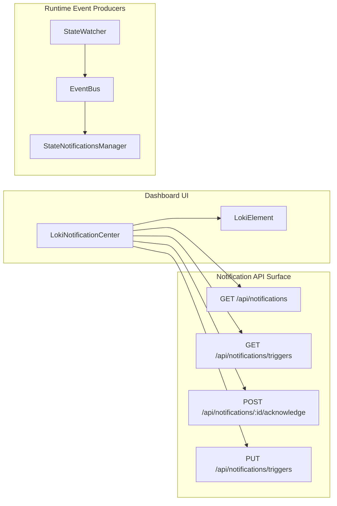
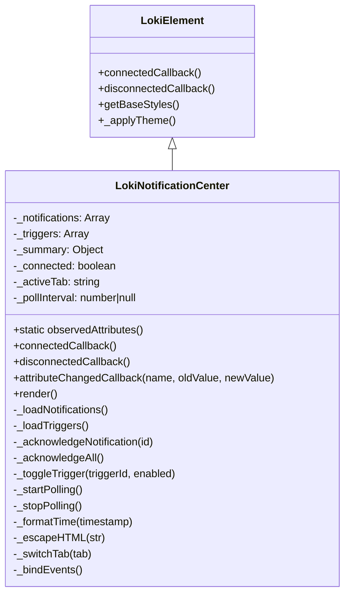
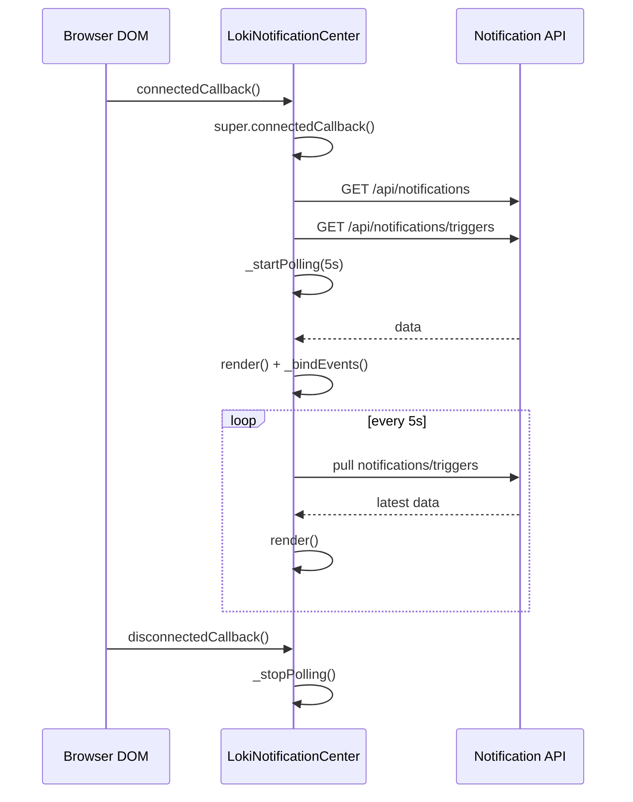
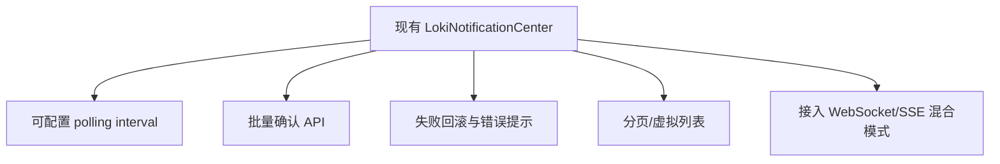

# notification_operations_center 模块文档

## 模块定位与设计背景

`notification_operations_center` 是 Administration and Infrastructure Components 领域下的通知运营中枢模块，当前核心实现是 Web Component：`dashboard-ui.components.loki-notification-center.LokiNotificationCenter`。这个模块的主要价值不是“产生通知”，而是把后端已经产生的通知能力以统一、可操作、可嵌入的前端界面提供出来：一方面让操作者快速看到告警流（Feed），另一方面允许在 UI 中直接管理触发规则（Triggers）。

从设计取舍看，该模块采用 **轮询 HTTP API（5 秒周期）**，而非强依赖实时推送（WebSocket/SSE）。这种设计在部署上更稳健，跨框架集成成本更低，也更适合“嵌入式管理组件”场景；代价是通知显示存在最多一个轮询周期的延迟，并在高并发场景下带来额外请求负载。

此外，组件继承 `LokiElement`，复用了主题系统、基础设计 token 与 Shadow DOM 模式，这使它在 Dashboard UI 组件体系中保持一致视觉和隔离性。关于主题与基础能力，请参考 [Core Theme.md](Core Theme.md) 与 [Unified Styles.md](Unified Styles.md)。

---

## 在整体系统中的角色

从系统视角看，`LokiNotificationCenter` 位于“通知消费和运维操作”层，它向后端读写通知状态，但不负责事件采集与通知生成。生成链路通常来自状态监控与事件总线，例如 `StateWatcher`、`EventBus`、`StateNotificationsManager` 等。



这张图体现了模块边界：通知中心只与 Notification API 直接交互，运行时事件链是它的上游来源。若需要追踪通知“为何出现”，建议联动阅读 [State Watcher.md](State Watcher.md)、[Event Bus.md](Event Bus.md)、[State Notifications.md](State Notifications.md)。

---

## 核心组件：`LokiNotificationCenter`

### 类结构与职责分层



`LokiNotificationCenter` 的实现可以分成四层：

1. **数据访问层**：`_loadNotifications`、`_loadTriggers`、`_acknowledge*`、`_toggleTrigger`。
2. **状态层**：通过 `_notifications/_triggers/_summary/_connected/_activeTab` 维护 UI 状态。
3. **渲染层**：`render` 与 `_renderSummaryBar/_renderNotificationList/_renderTriggerList`。
4. **交互层**：`_bindEvents` 把 DOM 事件绑定到状态变更和 API 调用。

这种分层使组件具备较好的可维护性：数据变化统一回流到状态，再驱动重渲染。

---

## 生命周期与主流程

### 组件生命周期



组件挂载后会立即拉取数据并启动轮询，卸载时停止定时器。由于它每次 `render()` 后都会重新绑定事件，因此不会依赖旧 DOM 引用。

### Tabs 交互与 UI 切换

`_activeTab` 只允许 `feed` 或 `triggers`。`_switchTab(tab)` 会更新状态并触发重渲染。渲染逻辑中用条件模板决定展示 feed 列表还是 trigger 列表，因此结构简洁，但每次切换都会重建当前 Shadow DOM 子树。

---

## 关键方法详解（内部机制、参数、返回与副作用）

### `static observedAttributes()`

该静态方法声明组件监听 `api-url` 和 `theme`。返回值是属性名数组。副作用不在该方法本身，而在 `attributeChangedCallback` 触发后产生。

### `connectedCallback()`

组件挂载入口。无参数、无返回值。它依次调用：`super.connectedCallback()`、`_loadNotifications()`、`_loadTriggers()`、`_startPolling()`。主要副作用是发起网络请求和注册轮询。

### `disconnectedCallback()`

组件卸载入口。无参数、无返回值。它调用 `super.disconnectedCallback()` 与 `_stopPolling()`。主要副作用是清理定时器，避免页面离开后继续请求。

### `attributeChangedCallback(name, oldValue, newValue)`

用于响应运行时属性变更：

- 当 `name === 'api-url'` 时，重新拉取通知与触发器。
- 当 `name === 'theme'` 时，调用 `_applyTheme()`。

返回值为空，副作用是触发请求或主题刷新。该方法先判断新旧值是否相等，避免无意义更新。

### `_loadNotifications()`

请求 `GET {api-url}/api/notifications`，成功时更新 `_notifications`、`_summary`、`_connected=true`；异常时 `_connected=false`。无论成功失败都会 `render()`。

- 参数：无。
- 返回：`Promise<void>`。
- 副作用：网络调用、状态更新、重渲染。

实现细节上，它对异常做了捕获，但对非 2xx 且不抛异常的情况没有显式下线标记，属于“宽松可用性判断”。

### `_loadTriggers()`

请求 `GET {api-url}/api/notifications/triggers`。成功时更新 `_triggers`；失败时保留原有触发器数据，不抛错。

- 参数：无。
- 返回：`Promise<void>`。
- 副作用：网络调用、状态更新（通常不立即 render）。

### `_acknowledgeNotification(id)`

对单条通知发送 `POST /api/notifications/{id}/acknowledge`，随后刷新通知列表。

- 参数：`id: string`。
- 返回：`Promise<void>`。
- 副作用：写操作 API 调用，导致通知状态变化。

### `_acknowledgeAll()`

先在本地筛选未确认通知，然后逐条串行确认，最后刷新通知。

- 参数：无。
- 返回：`Promise<void>`。
- 副作用：N 次写 API 调用，潜在较高延迟。

这是实现上最直观但扩展性一般的点：未确认通知数量大时会放大请求量。

### `_toggleTrigger(triggerId, enabled)`

先基于本地 `_triggers` 构造全量新数组，再 `PUT /api/notifications/triggers`，随后直接替换本地状态并渲染。

- 参数：`triggerId: string`, `enabled: boolean`。
- 返回：`Promise<void>`。
- 副作用：更新后端触发器配置，立即更新前端显示。

它是“准乐观更新”策略：未做失败回滚，也未验证响应内容与本地状态一致。

### `_startPolling()` / `_stopPolling()`

管理 5 秒轮询。`_startPolling()` 内部用 `setInterval` 同时触发通知和触发器拉取。`_stopPolling()` 在存在 interval 时清理并置空句柄。

### `_formatTime(timestamp)`

把时间格式化为相对时间（`s/m/h/d ago`），超过 7 天退化为 `toLocaleDateString()`。异常时回退字符串化原值。该方法提升可读性但输出为英文单位。

### `_escapeHTML(str)`

进行基础 HTML 转义（`& < > "`），降低插值渲染时的注入风险。它是组件重要的安全兜底。

### `render()`

核心渲染方法，写入 `shadowRoot.innerHTML` 并在末尾调用 `_bindEvents()`。无参数、无返回值。

其副作用是：

- 旧 DOM 节点被替换。
- 已绑定事件监听会随旧节点销毁，随后对新节点重新绑定。

---

## API 合约与数据模型约定

组件对后端响应结构存在隐式约定。建议后端遵循以下契约。

### `GET /api/notifications`

```json
{
  "notifications": [
    {
      "id": "n_001",
      "timestamp": "2026-01-01T10:00:00Z",
      "message": "Phase timeout exceeded",
      "severity": "critical",
      "acknowledged": false,
      "iteration": 12
    }
  ],
  "summary": {
    "total": 10,
    "unacknowledged": 3,
    "critical": 1
  }
}
```

### `GET /api/notifications/triggers`

```json
{
  "triggers": [
    {
      "id": "cost.threshold",
      "enabled": true,
      "type": "threshold",
      "severity": "warning",
      "threshold_pct": 85,
      "pattern": ""
    }
  ]
}
```

### `POST /api/notifications/:id/acknowledge`

无需返回特定结构，建议至少返回 2xx/4xx/5xx 明确语义。

### `PUT /api/notifications/triggers`

请求体采用全量触发器数组：

```json
{
  "triggers": [
    { "id": "cost.threshold", "enabled": false, "type": "threshold", "severity": "warning" }
  ]
}
```

---

## 使用与配置

### 最小嵌入示例

```html
<loki-notification-center
  api-url="http://localhost:57374"
  theme="dark">
</loki-notification-center>
```

### 属性配置

- `api-url`：通知 API 基地址，默认 `window.location.origin`。
- `theme`：可选 `light` / `dark`（以及继承基类支持的其他主题值）。

### 运行时切换 API 地址

```javascript
const el = document.querySelector('loki-notification-center');
el.setAttribute('api-url', 'https://ops.example.com');
```

设置后组件会自动重新拉取通知与触发器，无需重建实例。

---

## 扩展与二次开发建议

如果你需要把该模块用于更大规模通知场景，建议优先扩展以下能力。



推荐的扩展方向如下：

- 把轮询周期做成属性（如 `poll-interval-ms`），兼顾实时性与成本。
- 新增后端 bulk acknowledge 接口，替代当前串行逐条确认。
- 在 `_toggleTrigger` 和确认操作中补充 `resp.ok` 校验、错误 toast、状态回滚。
- 当通知量大时增加分页或虚拟滚动，避免 Shadow DOM 重渲染过重。
- 将 `_formatTime` 本地化（中文“刚刚/分钟前”）并支持时区配置。

---

## 边界条件、错误场景与限制

### 1) 连接状态语义较弱

`_connected` 主要在异常 catch 时置为 `false`，对 HTTP 非 2xx 的语义覆盖不足，可能导致“接口报错但仍显示已连接”的感知偏差。

### 2) 触发器列表刷新时机

`_loadTriggers()` 成功后不总是立即 `render()`，在某些场景下 UI 更新会依赖下一次通知渲染或用户交互触发。

### 3) 批量确认效率

`_acknowledgeAll()` 为串行 N 请求，实现简单但吞吐有限。大批量未读通知时性能会明显下降。

### 4) 一致性风险

`_toggleTrigger()` 在请求后直接覆盖本地状态，若后端拒绝或部分应用，前后端可能短暂不一致。

### 5) 轮询模型的天然延迟

默认 5 秒轮询意味着“通知可见性”存在延时窗口，不适用于严格实时告警界面。

### 6) 未使用导入项

代码中导入了 `getApiClient` 但未使用，这不是功能错误，但会增加维护噪音并可能触发 lint 警告。

---

## 与其他模块文档的关系（避免重复阅读）

本模块文档聚焦前端通知运营中心本体，以下主题请跳转对应文档：

- 通知事件如何在运行时产生与广播： [State Notifications.md](State Notifications.md)
- 文件状态监听与事件发射： [State Watcher.md](State Watcher.md)
- 事件订阅、过滤与历史： [Event Bus.md](Event Bus.md)
- Dashboard 管理面 API 面向与传输约定： [api_surface_and_transport.md](api_surface_and_transport.md)
- UI 主题与基类能力： [Core Theme.md](Core Theme.md)、[Unified Styles.md](Unified Styles.md)

---

## 维护者检查清单

在修改 `LokiNotificationCenter` 时，建议至少验证以下内容：

- 生命周期是否完整清理定时器与监听器。
- 所有动态文本是否经过 `_escapeHTML`。
- API 写操作失败时是否给出反馈或回滚。
- 轮询频率变更是否影响后端负载与前端渲染成本。
- `Feed` 与 `Triggers` 两个视图切换后事件绑定是否正常。

这份检查清单可以显著降低“看起来能用但线上不稳”的回归风险。
