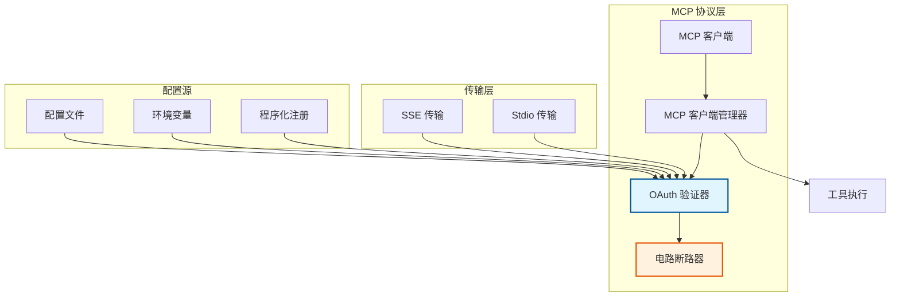
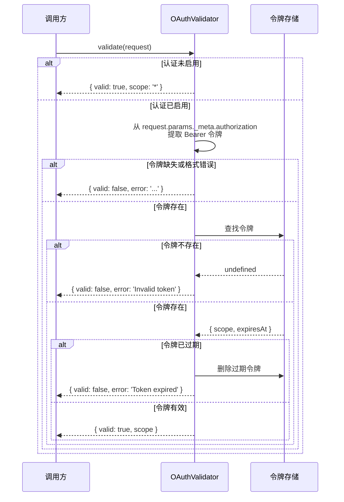
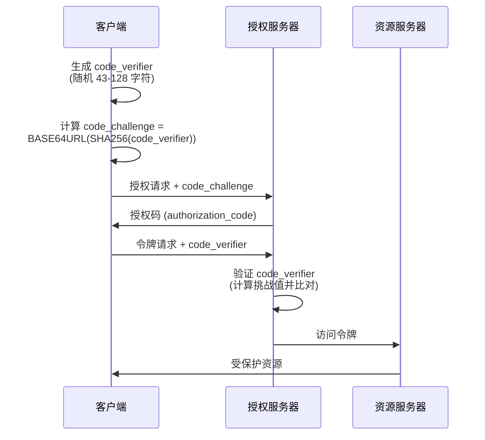
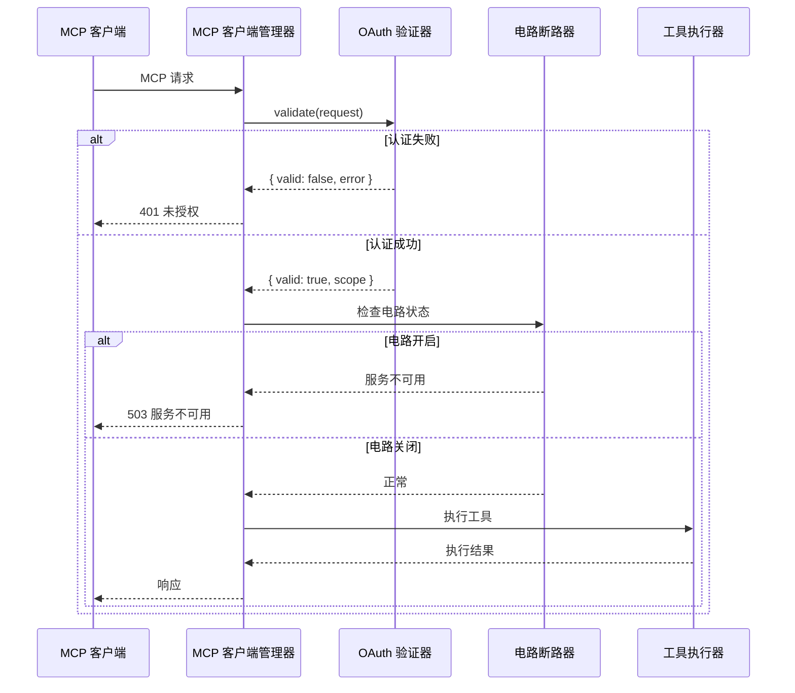

# OAuth 验证模块 (oauth_validation)

## 概述

OAuth 验证模块是 MCP (Model Context Protocol) 协议中的核心安全组件，为 MCP 服务器提供 OAuth 2.1 + PKCE (Proof Key for Code Exchange) 身份验证能力。该模块确保所有工具调用在配置了认证的情况下必须提供有效的 Bearer 令牌，同时在未配置认证时保持向后兼容性，允许无认证访问。

### 设计目标

该模块的设计遵循以下核心原则：

**安全性优先**：实现 OAuth 2.1 最新规范，强制使用 PKCE 防止授权码拦截攻击。所有令牌验证都经过严格的过期检查和作用域验证。

**灵活配置**：支持多种配置方式，包括配置文件、环境变量和程序化注册。这使得模块可以适应从本地开发到生产部署的各种场景。

**向后兼容**：当未检测到任何认证配置时，模块自动禁用认证功能，确保现有无认证系统可以无缝升级。

**传输层无关**：验证逻辑独立于具体的传输协议，同时支持 SSE (Server-Sent Events) 和 stdio 传输方式，通过统一的验证接口处理不同来源的认证信息。

### 在系统中的位置

OAuth 验证模块位于 MCP 协议层的安全子系统中，与以下模块紧密协作：

- **MCP 客户端管理器** ([mcp_client_manager](mcp_client_manager.md))：在路由请求到具体 MCP 客户端之前，通过 OAuthValidator 验证请求的合法性
- **传输层** ([transport_stdio_and_sse](transport_stdio_and_sse.md))：SSE 和 Stdio 传输层将 Authorization 头或元数据传递给验证器
- **电路断路器** ([circuit_breaker_resilience](circuit_breaker_resilience.md))：在认证服务不可用时提供降级保护



## 核心组件

### OAuthValidator 类

`OAuthValidator` 是整个模块的唯一核心类，封装了所有 OAuth 2.1 + PKCE 验证逻辑。

#### 构造函数

```javascript
constructor(options)
```

**参数说明：**

| 参数 | 类型 | 必填 | 说明 |
|------|------|------|------|
| options | `Object` | 否 | 配置选项对象 |
| options.configPath | `string` | 否 | 认证配置文件的绝对或相对路径 |

**初始化行为：**

构造函数执行以下初始化流程：

1. 将 `_enabled` 标志初始化为 `false`
2. 创建三个内部 Map 用于存储状态：
   - `_tokens`：存储有效令牌及其元数据（作用域、过期时间）
   - `_clients`：存储注册的 OAuth 客户端信息
   - `_codeVerifiers`：存储 PKCE 授权码及其验证器
3. 根据传入参数加载配置：
   - 如果提供了 `configPath`，从指定文件加载
   - 否则从环境变量和默认位置加载

**示例：**

```javascript
// 使用配置文件路径
const validator = new OAuthValidator({ 
  configPath: './config/mcp-auth.json' 
});

// 使用默认配置加载（环境变量 + 项目根目录）
const validator = new OAuthValidator();
```

#### 属性

##### enabled

```javascript
get enabled()
```

**返回类型：** `boolean`

**说明：** 只读属性，返回认证功能是否已启用。当成功加载任何认证配置（客户端、令牌或环境变量）时，该属性返回 `true`。

**使用示例：**

```javascript
if (validator.enabled) {
  console.log('认证已启用，所有请求需要令牌');
} else {
  console.log('认证已禁用，请求无需令牌');
}
```

#### 核心方法

##### validate(request)

验证请求的认证信息。

**参数：**

| 参数 | 类型 | 说明 |
|------|------|------|
| request | `Object` | MCP 请求对象，包含 params 和元数据 |

**返回类型：** `Object`

**返回值结构：**

| 字段 | 类型 | 说明 |
|------|------|------|
| valid | `boolean` | 验证是否通过 |
| error | `string` | 验证失败时的错误信息（可选） |
| scope | `string` | 令牌的作用域，默认为 `'*'` |

**验证逻辑流程：**



**代码示例：**

```javascript
const request = {
  params: {
    _meta: {
      authorization: 'Bearer abc123...'
    }
  }
};

const result = validator.validate(request);
if (!result.valid) {
  throw new Error(`认证失败：${result.error}`);
}
console.log(`请求作用域：${result.scope}`);
```

##### validateToken(token)

直接验证 Bearer 令牌字符串。

**参数：**

| 参数 | 类型 | 说明 |
|------|------|------|
| token | `string` | 要验证的令牌字符串（不含 "Bearer " 前缀） |

**返回类型：** `Object`（结构同 `validate` 方法）

**与 validate 方法的区别：**

- `validate` 从完整的 MCP 请求对象中提取令牌
- `validateToken` 直接接收令牌字符串，适用于已提取令牌的场景

**示例：**

```javascript
// 从 HTTP 头中提取令牌
const authHeader = req.headers.authorization; // "Bearer abc123..."
const token = authHeader.slice(7);
const result = validator.validateToken(token);
```

##### validateHeader(authorizationHeader)

验证 HTTP Authorization 头（专为 SSE 传输设计）。

**参数：**

| 参数 | 类型 | 说明 |
|------|------|------|
| authorizationHeader | `string` | 完整的 Authorization 头值 |

**返回类型：** `Object`（结构同 `validate` 方法）

**使用场景：**

SSE 传输层在建立连接时通过 HTTP 头传递认证信息，此方法专门处理该场景。

```javascript
// SSE 连接建立时
const authHeader = ws.handshake.headers.authorization;
const result = validator.validateHeader(authHeader);
if (!result.valid) {
  ws.close(401, result.error);
  return;
}
```

##### issueToken(scope, ttlMs)

程序化颁发令牌（主要用于测试和内部使用）。

**参数：**

| 参数 | 类型 | 说明 |
|------|------|------|
| scope | `string` | 令牌作用域，默认为 `'*'` |
| ttlMs | `number` | 令牌有效期（毫秒），`null` 表示永不过期 |

**返回类型：** `Object`

**返回值结构：**

| 字段 | 类型 | 说明 |
|------|------|------|
| token | `string` | 生成的令牌（64 字符十六进制字符串） |
| expiresAt | `number` | 过期时间戳（毫秒），`null` 表示永不过期 |

**示例：**

```javascript
// 颁发一个有效期为 1 小时的令牌
const { token, expiresAt } = validator.issueToken('read:tasks', 3600000);
console.log(`令牌：${token}, 过期时间：${new Date(expiresAt)}`);

// 颁发永久令牌
const { token } = validator.issueToken('*', null);
```

**安全说明：** 在生产环境中，令牌应由外部 OAuth 提供商颁发。此方法主要用于开发测试或受信任的内部服务。

##### revokeToken(token)

撤销指定令牌。

**参数：**

| 参数 | 类型 | 说明 |
|------|------|------|
| token | `string` | 要撤销的令牌 |

**返回类型：** `boolean`

**返回值：** `true` 表示令牌存在并已成功撤销，`false` 表示令牌不存在。

**示例：**

```javascript
// 用户登出时撤销令牌
const revoked = validator.revokeToken(userToken);
if (revoked) {
  console.log('令牌已撤销');
}
```

##### validatePKCE(codeVerifier, codeChallenge)

验证 PKCE 代码挑战（OAuth 2.1 规范要求）。

**参数：**

| 参数 | 类型 | 说明 |
|------|------|------|
| codeVerifier | `string` | 客户端生成的随机验证器 |
| codeChallenge | `string` | 由 codeVerifier 经 SHA-256 哈希后 Base64URL 编码的挑战值 |

**返回类型：** `boolean`

**验证算法：**

```
computed = base64url(SHA256(codeVerifier))
return computed === codeChallenge
```

**PKCE 流程说明：**



**示例：**

```javascript
// 客户端生成 PKCE 参数
const crypto = require('crypto');
const codeVerifier = crypto.randomBytes(32).toString('base64url');
const codeChallenge = crypto
  .createHash('sha256')
  .update(codeVerifier)
  .digest('base64url');

// 服务器端验证
const isValid = validator.validatePKCE(codeVerifier, codeChallenge);
if (!isValid) {
  throw new Error('PKCE 验证失败');
}
```

##### registerClient(clientId, clientConfig)

注册 OAuth 客户端（用于配置或测试）。

**参数：**

| 参数 | 类型 | 说明 |
|------|------|------|
| clientId | `string` | 客户端唯一标识符 |
| clientConfig | `Object` | 客户端配置 |
| clientConfig.secret | `string` | 客户端密钥 |
| clientConfig.redirectUri | `string` | 授权回调 URI |
| clientConfig.scopes | `string[]` | 允许的作用域列表 |

**副作用：** 调用此方法会自动将 `_enabled` 设置为 `true`。

**示例：**

```javascript
validator.registerClient('my-app', {
  secret: 'client-secret-123',
  redirectUri: 'https://myapp.com/callback',
  scopes: ['read:tasks', 'write:tasks']
});
```

#### 内部方法

##### _loadConfig(configPath)

从指定路径加载 JSON 配置文件。

**错误处理：** 如果文件不存在或解析失败，将认证设置为禁用状态并输出错误日志到 stderr。

##### _loadConfigFromEnv()

从环境变量和默认位置加载配置。

**加载优先级：**

1. 项目根目录的 `.loki/mcp-auth.json` 文件
2. `MCP_AUTH_TOKEN` 环境变量
3. 无配置（认证禁用）

##### _applyConfig(config)

应用解析后的配置对象到内部状态。

**配置结构：**

```json
{
  "enabled": true,
  "clients": [
    {
      "id": "client-1",
      "secret": "secret-123",
      "redirectUri": "https://app.com/callback",
      "scopes": ["read:*", "write:tasks"]
    }
  ],
  "tokens": [
    {
      "value": "token-abc123",
      "scope": "read:tasks",
      "expiresAt": "2025-12-31T23:59:59Z"
    }
  ]
}
```

## 配置指南

### 配置文件方式

在项目根目录创建 `.loki/mcp-auth.json` 文件：

```json
{
  "enabled": true,
  "clients": [
    {
      "id": "dashboard-app",
      "secret": "your-client-secret-here",
      "redirectUri": "https://dashboard.example.com/oauth/callback",
      "scopes": ["read:tasks", "write:tasks", "read:sessions"]
    },
    {
      "id": "cli-tool",
      "secret": "cli-secret",
      "redirectUri": "http://localhost:8080/callback",
      "scopes": ["*"]
    }
  ],
  "tokens": [
    {
      "value": "static-token-for-testing",
      "scope": "read:*",
      "expiresAt": null
    },
    {
      "value": "expiring-token",
      "scope": "write:tasks",
      "expiresAt": "2025-06-01T00:00:00Z"
    }
  ]
}
```

### 环境变量方式

适用于容器化部署和 CI/CD 环境：

```bash
# 启用单令牌认证
export MCP_AUTH_TOKEN="your-secure-token-here"
export MCP_AUTH_SCOPE="read:tasks,write:tasks"

# 启动应用
node server.js
```

### 程序化配置

适用于动态配置场景：

```javascript
const { OAuthValidator } = require('./src/protocols/auth/oauth');

const validator = new OAuthValidator();

// 动态注册客户端
validator.registerClient('dynamic-client', {
  secret: generateSecureSecret(),
  redirectUri: getRedirectUriFromRequest(),
  scopes: ['read:*']
});

// 动态颁发令牌
const { token } = validator.issueToken('write:sessions', 7200000);
```

## 使用场景

### 场景一：MCP 请求验证

在 MCP 服务器中间件中集成 OAuth 验证：

```javascript
const { OAuthValidator } = require('./src/protocols/auth/oauth');
const validator = new OAuthValidator();

async function handleMCPRequest(request) {
  // 验证请求认证
  const authResult = validator.validate(request);
  
  if (!authResult.valid) {
    return {
      error: {
        code: 'UNAUTHORIZED',
        message: authResult.error
      }
    };
  }
  
  // 检查作用域权限
  if (!authResult.scope.includes('write:') && request.method === 'tools/write') {
    return {
      error: {
        code: 'FORBIDDEN',
        message: 'Insufficient scope'
      }
    };
  }
  
  // 执行工具调用
  return await executeTool(request);
}
```

### 场景二：SSE 连接认证

在 SSE 传输层建立连接时验证：

```javascript
const http = require('http');
const { OAuthValidator } = require('./src/protocols/auth/oauth');
const validator = new OAuthValidator();

const server = http.createServer((req, res) => {
  if (req.url === '/sse') {
    const authResult = validator.validateHeader(req.headers.authorization);
    
    if (!authResult.valid) {
      res.writeHead(401);
      res.end(authResult.error);
      return;
    }
    
    // 建立 SSE 连接
    setupSSEConnection(res, authResult.scope);
  }
});
```

### 场景三：令牌生命周期管理

实现完整的令牌颁发、刷新和撤销流程：

```javascript
class TokenService {
  constructor(validator) {
    this.validator = validator;
    this.refreshTokens = new Map();
  }
  
  // 颁发访问令牌和刷新令牌
  issueTokenPair(clientId, scopes) {
    const accessToken = this.validator.issueToken(scopes.join(' '), 3600000);
    const refreshToken = crypto.randomBytes(32).toString('hex');
    
    this.refreshTokens.set(refreshToken, {
      clientId,
      scopes,
      expiresAt: Date.now() + 604800000 // 7 天
    });
    
    return {
      access_token: accessToken.token,
      refresh_token: refreshToken,
      expires_in: 3600,
      token_type: 'Bearer'
    };
  }
  
  // 刷新令牌
  refreshToken(refreshToken) {
    const entry = this.refreshTokens.get(refreshToken);
    if (!entry || entry.expiresAt < Date.now()) {
      throw new Error('Invalid or expired refresh token');
    }
    
    // 撤销旧刷新令牌（刷新令牌一次性使用）
    this.refreshTokens.delete(refreshToken);
    
    return this.issueTokenPair(entry.clientId, entry.scopes);
  }
  
  // 撤销令牌
  revokeToken(token, isRefreshToken = false) {
    if (isRefreshToken) {
      return this.refreshTokens.delete(token);
    }
    return this.validator.revokeToken(token);
  }
}
```

## 与其他模块的集成

### 与 MCP 客户端管理器的集成



详细集成方式参考 [MCP 客户端管理器文档](mcp_client_manager.md)。

### 与传输层的集成

SSE 和 Stdio 传输层将认证信息传递给验证器：

```javascript
// SSE 传输层
class SSETransport {
  constructor(validator) {
    this.validator = validator;
  }
  
  async handleConnection(req, res) {
    const authResult = this.validator.validateHeader(
      req.headers.authorization
    );
    
    if (!authResult.valid) {
      res.writeHead(401, { 'Content-Type': 'application/json' });
      res.end(JSON.stringify({ error: authResult.error }));
      return;
    }
    
    // 继续建立 SSE 连接
    this.establishSSE(res, authResult.scope);
  }
}
```

详细传输层实现参考 [传输层文档](transport_stdio_and_sse.md)。

## 边缘情况和注意事项

### 1. 认证禁用时的行为

当未配置任何认证信息时，`validate` 方法无条件返回 `{ valid: true, scope: '*' }`。这确保了：

- 开发环境无需配置即可快速启动
- 现有无认证系统可平滑升级
- 但需注意：**生产环境应始终配置认证**

**最佳实践：**

```javascript
const validator = new OAuthValidator();
if (!validator.enabled && process.env.NODE_ENV === 'production') {
  console.warn('警告：生产环境未配置认证！');
  // 可选择抛出错误或采取其他措施
}
```

### 2. 令牌过期处理

令牌过期后会自动从 `_tokens` Map 中删除，但存在以下边界情况：

- **时钟漂移**：服务器时钟不准确可能导致令牌提前或延迟过期
- **并发访问**：多个请求同时验证同一即将过期的令牌可能导致竞争条件

**建议：** 在分布式部署中，使用外部令牌存储（如 Redis）替代内存 Map。

### 3. PKCE 方法限制

当前实现仅支持 `S256` (SHA-256) 方法，这是 OAuth 2.1 规范推荐的方法。如果客户端发送 `plain` 方法或其他方法，验证将失败。

**客户端兼容性检查：**

```javascript
// 确保客户端使用 S256 方法
const authRequest = {
  code_challenge_method: 'S256', // 必须
  code_challenge: '...'
};
```

### 4. 内存泄漏风险

`_tokens` 和 `_codeVerifiers` Map 会持续增长，如果令牌和授权码不被及时清理：

- 过期令牌在下次验证时清理（被动清理）
- 授权码没有自动过期机制

**缓解措施：**

```javascript
// 定期清理过期条目
setInterval(() => {
  const now = Date.now();
  for (const [token, entry] of validator._tokens.entries()) {
    if (entry.expiresAt !== null && entry.expiresAt < now) {
      validator._tokens.delete(token);
    }
  }
}, 300000); // 每 5 分钟清理一次
```

### 5. 配置文件安全

认证配置文件包含敏感信息（客户端密钥、令牌），需注意：

- **文件权限**：确保配置文件仅应用用户可读（`chmod 600`）
- **版本控制**：将 `.loki/mcp-auth.json` 添加到 `.gitignore`
- **加密存储**：生产环境使用加密的密钥管理服务

### 6. 作用域验证

当前实现中的作用域验证较为基础，仅存储和返回作用域字符串，不进行细粒度权限检查。

**扩展建议：**

```javascript
function checkScope(requiredScope, tokenScope) {
  if (tokenScope === '*') return true;
  
  const requiredParts = requiredScope.split(':');
  const tokenParts = tokenScope.split(':');
  
  // 支持通配符匹配，如 'read:*' 匹配 'read:tasks'
  if (tokenParts[1] === '*') {
    return tokenParts[0] === requiredParts[0];
  }
  
  return tokenScope === requiredScope;
}
```

## 安全建议

### 生产环境部署清单

- [ ] 配置外部 OAuth 提供商（而非使用 `issueToken` 方法）
- [ ] 启用 HTTPS 传输
- [ ] 设置合理的令牌过期时间（建议 1-4 小时）
- [ ] 实现刷新令牌机制
- [ ] 配置审计日志记录所有认证事件
- [ ] 定期轮换客户端密钥
- [ ] 监控认证失败率（可能的攻击信号）

### 令牌安全最佳实践

```javascript
// 推荐配置
const tokenConfig = {
  scope: 'read:tasks write:tasks', // 最小权限原则
  ttlMs: 7200000, // 2 小时
  // 避免使用永久令牌
};

const { token } = validator.issueToken(
  tokenConfig.scope,
  tokenConfig.ttlMs
);
```

## 故障排除

### 常见问题

| 问题 | 可能原因 | 解决方案 |
|------|----------|----------|
| 认证始终失败 | 配置文件路径错误 | 检查 `configPath` 或使用绝对路径 |
| 令牌验证通过但作用域不对 | 作用域配置错误 | 检查配置文件中令牌的 `scope` 字段 |
| PKCE 验证失败 | 哈希方法不匹配 | 确保客户端使用 S256 方法 |
| 认证意外启用 | 存在未预期的配置文件 | 检查项目根目录的 `.loki/mcp-auth.json` |

### 调试模式

启用详细日志输出：

```javascript
const originalValidate = validator.validateToken.bind(validator);
validator.validateToken = function(token) {
  console.log('[DEBUG] 验证令牌:', token.substring(0, 8) + '...');
  const result = originalValidate(token);
  console.log('[DEBUG] 验证结果:', result);
  return result;
};
```

## 参考文档

- [MCP 客户端管理器](mcp_client_manager.md) - 请求路由和验证集成
- [传输层](transport_stdio_and_sse.md) - SSE 和 Stdio 认证处理
- [电路断路器](circuit_breaker_resilience.md) - 认证服务降级保护
- [API 密钥管理](api_key_management.md) - Dashboard 层的 API 密钥管理（与 OAuth 互补）

## 版本历史

| 版本 | 日期 | 变更 |
|------|------|------|
| 1.0.0 | 2024-01 | 初始版本，支持 OAuth 2.1 + PKCE |
| 1.1.0 | 2024-03 | 添加环境变量配置支持 |
| 1.2.0 | 2024-06 | 改进令牌过期清理机制 |
