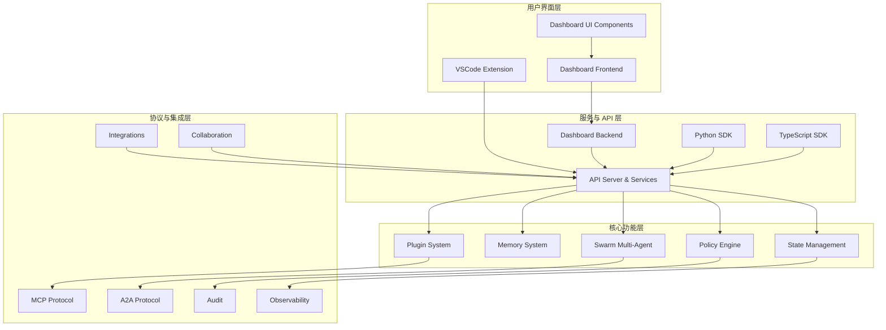

# Loki Mode 仓库概述

## 1. 仓库简介

Loki Mode 是一个功能完整的 AI 驱动型软件开发与自动化平台，提供从需求分析到代码部署的全流程智能化支持。该仓库包含了一套完整的工具链，涵盖多代理协作、记忆管理、状态同步、策略控制、可观测性等核心功能，旨在通过 AI 技术提升软件开发效率和质量。

### 核心价值
- **AI 驱动开发**：通过智能代理自动化软件开发各个阶段
- **多代理协作**：支持动态组建专业代理团队处理复杂项目
- **记忆系统**：实现跨项目的知识积累与复用
- **可扩展架构**：插件化设计，支持自定义扩展与第三方集成

## 2. 系统架构

Loki Mode 采用分层模块化架构设计，从底层基础设施到上层应用形成完整的技术栈：

### 架构特点
1. **前后端分离**：清晰的前后端分离架构，支持多种客户端（Web、VSCode、CLI）
2. **模块化设计**：各功能模块高度内聚，通过标准化接口通信
3. **协议驱动**：基于 MCP 和 A2A 等标准化协议实现组件间交互
4. **可观测性优先**：内置完整的审计、日志和指标体系

## 3. 核心功能模块

### 3.1 API Server & Services
- **路径**：`api/`
- **功能**：提供 RESTful API 和 SSE 实时事件流，是系统的核心通信层
- **核心组件**：`api.server.EventBus`、`api.server.ProcessManager`、`api.services.state-watcher.StateWatcher` 等
- **文档参考**：[API Server & Services 模块文档](API Server & Services.md)

### 3.2 Dashboard 系统
- **Dashboard Backend**：`dashboard/`，提供完整的项目管理、任务跟踪、会话控制和数据分析功能
- **Dashboard Frontend**：`dashboard/frontend/src/`，React 前端应用，提供直观的用户界面
- **Dashboard UI Components**：`dashboard-ui/`，现代化 Web Components 组件库
- **文档参考**：[Dashboard Backend 文档](Dashboard Backend.md)、[Dashboard Frontend 文档](Dashboard Frontend.md)、[Dashboard UI Components 文档](Dashboard UI Components.md)

### 3.3 Swarm Multi-Agent
- **路径**：`swarm/`
- **功能**：智能多代理协作系统，动态组建、协调和优化代理团队
- **核心组件**：`swarm.composer.SwarmComposer`、`swarm.bft.ByzantineFaultTolerance`、`swarm.performance.AgentPerformanceTracker` 等
- **文档参考**：[Swarm Multi-Agent 模块文档](Swarm Multi-Agent.md)

### 3.4 Memory System
- **路径**：`memory/`
- **功能**：多类型、多层次的记忆管理系统，支持情景、语义和程序记忆
- **核心组件**：`memory.engine.SemanticMemory`、`memory.retrieval.VectorIndex`、`memory.unified_access.UnifiedMemoryAccess` 等
- **文档参考**：[Memory System 模块文档](Memory System.md)

### 3.5 State Management
- **路径**：`state/`
- **功能**：统一的状态管理系统，支持文件监控、事件通知和版本控制
- **核心组件**：`state.manager.ManagedFile`、`state.manager.InMemoryNotificationChannel`、`state.manager.FileNotificationChannel`
- **文档参考**：[State Management 模块文档](State Management.md)

### 3.6 Policy Engine
- **路径**：`src/policies/`
- **功能**：核心策略执行引擎，在各执行点进行策略评估和控制
- **核心组件**：`src.policies.engine.PolicyEngine`、`src.policies.approval.ApprovalGateManager`、`src.policies.cost.CostController`
- **文档参考**：[Policy Engine 模块文档](Policy Engine.md)

### 3.7 Plugin System
- **路径**：`src/plugins/`
- **功能**：灵活的插件架构，支持自定义代理、质量门、集成和 MCP 工具
- **核心组件**：`src.plugins.agent-plugin.AgentPlugin`、`src.plugins.mcp-plugin.MCPPlugin`、`src.plugins.loader.PluginLoader` 等
- **文档参考**：[Plugin System 模块文档](Plugin System.md)

### 3.8 协议系统
- **MCP Protocol**：`src/protocols/`，Model Context Protocol 客户端和服务器实现
- **A2A Protocol**：`src/protocols/a2a/`，Agent-to-Agent 标准化通信协议
- **文档参考**：[MCP Protocol 文档](MCP Protocol.md)、[A2A Protocol 文档](A2A Protocol.md)

### 3.9 集成与扩展
- **Integrations**：`src/integrations/`，与 Jira、Linear、Slack、Teams 等外部工具的集成
- **SDK**：Python SDK（`sdk/python/`）和 TypeScript SDK（`sdk/typescript/`）
- **文档参考**：[Integrations 文档](Integrations.md)、[Python SDK 文档](Python SDK.md)、[TypeScript SDK 文档](TypeScript SDK.md)

## 4. 技术栈

Loki Mode 采用多语言技术栈，支持多种部署环境：

| 层级 | 技术选型 |
|------|----------|
| 前端 | React + TypeScript + Web Components |
| 后端核心 | Python 3.7+ + FastAPI |
| 协议层 | Node.js 18+ + TypeScript |
| 存储 | 文件系统 + 向量索引（numpy） |
| 集成支持 | Jira, Linear, Slack, Microsoft Teams |
| 开发工具 | VS Code Extension |

## 5. 快速开始

### 5.1 基本使用流程
1. **初始化项目**：在项目目录中运行 `loki init` 初始化环境
2. **启动服务**：通过 `loki serve` 或 `loki dashboard start` 启动后端服务
3. **访问界面**：打开浏览器访问 `http://localhost:57374` 访问 Dashboard
4. **创建项目**：通过界面或 API 创建新项目并导入需求
5. **启动代理**：配置并启动 AI 代理团队开始自动化开发

### 5.2 核心配置
- **环境变量**：`LOKI_DIR`、`LOKI_DASHBOARD_PORT`、`LOKI_DASHBOARD_HOST` 等
- **配置文件**：`.loki/config.json` 或 `.loki/config.yaml`
- **策略文件**：`.loki/policies.json` 或 `.loki/policies.yaml`（可选）

## 6. 核心文档参考

仓库包含详细的模块文档，建议按以下顺序阅读：

1. **架构概览**：了解整体系统设计
2. **API Server & Services**：核心通信层文档
3. **Dashboard 系统**：用户界面与后端服务文档
4. **Swarm Multi-Agent**：多代理协作系统文档
5. **Memory System**：记忆管理系统文档
6. **其他模块**：根据需求阅读相关模块文档

## 7. 扩展与开发

Loki Mode 设计为高度可扩展的系统，支持以下扩展方式：

- **自定义代理**：通过 `AgentPlugin` 注册自定义代理类型
- **自定义工具**：通过 `MCPPlugin` 注册自定义 MCP 工具
- **外部集成**：通过 `IntegrationPlugin` 或 `Integrations` 模块集成外部服务
- **自定义策略**：通过策略文件配置或扩展 `PolicyEngine`
- **自定义组件**：通过 `Dashboard UI Components` 扩展 UI

## 8. 注意事项

- **安全性**：生产环境部署时请配置适当的认证、授权和 TLS
- **状态管理**：状态文件存储在 `.loki/` 目录，请确保适当的备份策略
- **成本控制**：建议配置 `CostController` 预算告警避免意外支出
- **兼容性**：不同版本间可能存在 API 变化，请参考版本更新文档

Loki Mode 旨在通过 AI 技术革新软件开发流程，提供从需求到部署的全流程智能化支持。通过模块化设计和标准化协议，该系统既可以作为独立工具使用，也可以轻松集成到现有开发流程中。