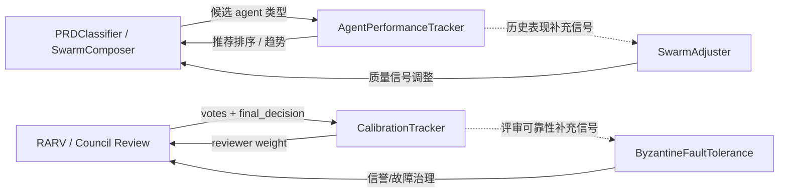
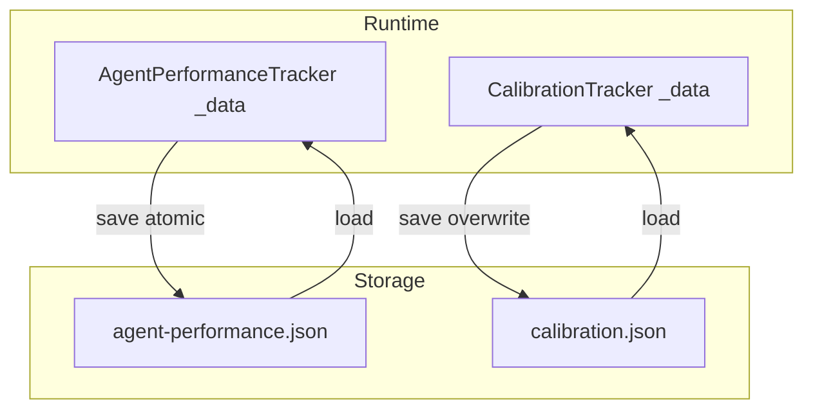
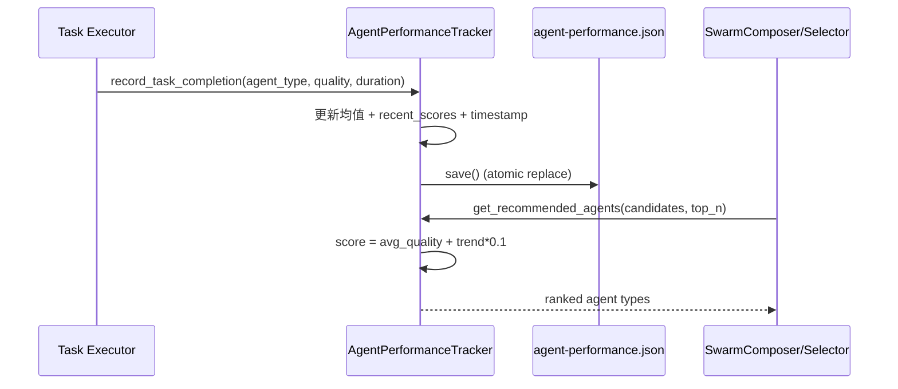
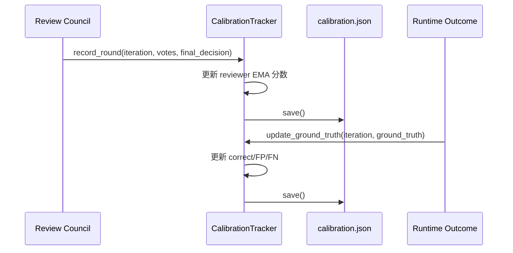

# performance_and_calibration 模块文档

`performance_and_calibration` 是 Swarm Multi-Agent 子系统中的一个“反馈学习层”，由 `swarm.performance.AgentPerformanceTracker` 与 `swarm.calibration.CalibrationTracker` 两个组件构成。它的核心目标并不是直接完成任务，而是持续积累“谁做得更好、谁判断更可靠”的历史证据，然后把这些证据反向作用到后续编排、评审和治理流程中。简单来说，这个模块负责把系统从“静态规则驱动”推进到“经验数据驱动”。

在一个多智能体系统里，若没有这一层，编排器（如 `SwarmComposer`）通常只能依靠规则、特征映射或固定优先级做决策；评审机制也只能默认每个 reviewer 的权重一致。随着任务复杂度和组织规模上升，这种方式会出现明显瓶颈：优质 agent 无法得到更多机会，低质量输出无法被系统性抑制，评审意见的可靠性也无法量化。`performance_and_calibration` 的存在，就是为了解决这些结构性问题。

---

## 模块定位与系统关系

从职责边界看，本模块属于 **Swarm 的历史反馈与可信度评估层**。它不负责实时共识、不负责 agent 拓扑组建、不负责任务分派执行，而是负责沉淀跨运行（cross-run）的统计状态，并在需要时输出可消费的排序、趋势和权重信号。



上图体现了该模块与其它 Swarm 组件的协作关系。`AgentPerformanceTracker` 更偏向“执行侧表现统计”，与 `swarm_topology_and_composition.md` 和 `swarm_adaptation_and_feedback.md` 中的编排/调整逻辑互补；`CalibrationTracker` 更偏向“评审侧可靠性统计”，与 `consensus_and_fault_tolerance.md`、`council_runtime_governance.md` 形成治理闭环。

---

## 架构设计与数据持久化

两个 tracker 都采用“内存态 + JSON 文件持久化”的轻量设计。这样做的优点是部署简单、无外部依赖，适合本地或单节点运行；代价是缺乏并发写入仲裁、缺少强 schema 约束、跨进程一致性依赖调用方约定。



在持久化策略上，两者有一个关键差异：

- `AgentPerformanceTracker.save()` 使用 `tempfile.mkstemp + os.replace`，是原子替换写入，抗中断能力更强。
- `CalibrationTracker.save()` 直接覆盖写入，逻辑更简单，但在异常中断场景下更容易留下部分写入风险。

---

## 核心组件详解

## `swarm.performance.AgentPerformanceTracker`

`AgentPerformanceTracker` 负责按 `agent_type` 维度记录任务完成质量和耗时，并对每种 agent 维护增量平均值与近期趋势。它是“推荐更优 agent 类型”的主要数据来源。

### 初始化与状态装载

构造函数签名：

```python
AgentPerformanceTracker(storage_path: Optional[str] = None)
```

当 `storage_path` 为空时，默认路径为 `.loki/memory/agent-performance.json`。初始化后会立即调用 `load()` 尝试加载历史数据；若文件不存在或 JSON 损坏，则自动回退为 `{}`。这意味着模块对冷启动和损坏文件是“容错启动”，但也意味着损坏时会静默丢弃历史数据。

### `record_task_completion(...)`

```python
record_task_completion(agent_type: str, quality_score: float, duration_seconds: float) -> None
```

该方法是 tracker 的核心写入口。它内部做了三类操作：输入归一化、聚合统计更新、最近窗口维护。

第一步会对输入做边界处理：`quality_score` 被夹紧到 `[0.0, 1.0]`，`duration_seconds` 最低为 `0.0`。这个设计避免了上游异常数据污染统计值，但也会掩盖调用方错误（例如把 100 当作 1.0 传入时会被直接压到 1.0）。

第二步用在线均值公式更新 `avg_quality` 与 `avg_duration`，避免回放全部历史。写入后分别四舍五入到 4 位和 2 位小数，以降低 JSON 噪声。

第三步维护固定窗口 `MAX_RECENT_SCORES = 20`：新分数 append 后仅保留最后 20 条。该窗口被后续趋势算法 `_compute_trend` 消费。

### `get_performance_scores()`

```python
get_performance_scores() -> Dict[str, Dict[str, Any]]
```

该方法返回适合外部消费的汇总结构，而不是原始内部结构。每个 `agent_type` 会得到：

- `avg_quality`
- `avg_duration`
- `task_count`
- `trend`

这里的 `trend` 不是回归斜率，而是“新旧半窗均值差”，语义直观但较粗粒度。适合做排序加权，不适合精细时序分析。

### `get_recommended_agents(...)`

```python
get_recommended_agents(candidate_types: List[str], top_n: int = 5) -> List[str]
```

该方法将候选 agent 类型打分后排序输出。已观测 agent 的分数计算为：

`score = avg_quality + trend * 0.1`

也就是以质量均值为主，趋势作小幅奖励/惩罚。无历史数据的 agent 使用中性分 `0.5`。这是一种“探索友好”的默认值，避免新 agent 因无数据长期被饿死。

需要注意：`top_n` 未做下界约束，如果传入负数，Python 切片语义会返回“去掉末尾 N 个”的非直观结果，调用方应自行校验。

### `_compute_trend(recent_scores)`

趋势算法把最近分数序列一分为二，比较后半段均值减前半段均值，结果四舍五入到 4 位并夹紧到 `[-1, 1]`。当样本少于 2 或某半段为空时返回 `0.0`。

这种算法的优点是稳定、可解释、计算成本低；限制在于它对短期抖动敏感，且不考虑样本时间间隔（默认等间隔）。

### `save()/load()/clear()/get_agent_data()`

`save()` 采用原子写，适合在任务批次结束时调用；`load()` 负责重启恢复；`clear()` 仅清空内存，不自动删除磁盘文件；`get_agent_data()` 返回某 agent 类型的原始条目，可用于调试与审计。

---

## `swarm.calibration.CalibrationTracker`

`CalibrationTracker` 用于追踪 reviewer 在多轮评审中的一致性与预测准确性，目标是让投票权重能够反映历史可靠性，而不是简单“每票等权”。

### 初始化与默认结构

构造函数签名：

```python
CalibrationTracker(calibration_file=None)
```

默认路径为 `.loki/council/calibration.json`。`_load()` 在读取失败时返回：

```python
{'reviewers': {}, 'rounds': []}
```

这表明数据模型天然分两层：

- `reviewers`：按 reviewer 聚合的长期统计
- `rounds`：最近轮次明细（最多保留 100 条）

### `record_round(...)`

```python
record_round(iteration, votes, final_decision, ground_truth=None)
```

该方法记录一轮评审并更新 reviewer 统计。`votes` 期望元素至少包含 `reviewer_id` 与 `verdict`，`verdict` 会统一转小写。

方法执行时，若 reviewer 首次出现，会以 `calibration_score=0.5` 初始化。之后根据其与 `final_decision` 是否一致更新计数，同时用指数移动平均更新校准分：

`new_score = (1 - alpha) * old_score + alpha * match_score`，其中 `alpha=0.1`。

这意味着分数对近期行为有持续响应，但不会被单次波动剧烈拉动。最后，本轮会 append 到 `rounds`，并截断为最近 100 条。

### `update_ground_truth(iteration, ground_truth)`

很多场景下 `final_decision` 并不等于真实结果，因此模块支持事后回填 `ground_truth`。该方法会从后往前查找指定 `iteration` 的轮次，命中后更新每位 reviewer 的：

- `correct_predictions`
- `false_positives`（approve 但真值 reject）
- `false_negatives`（reject 但真值 approve）

这里的更新是累加式的，没有“去重防重放”机制；同一 `iteration` 若被重复回填，计数会重复增加，调用方应确保幂等。

### 查询与权重输出

`get_reviewer_stats(reviewer_id)` 返回单 reviewer 统计；`get_all_stats()` 返回全部 reviewer 统计副本。`get_weighted_vote(reviewer_id)` 用于输出投票权重：若 reviewer 总评审数小于 5，返回默认 `1.0`；否则返回其 `calibration_score`。

这个策略将“冷启动 reviewer”设为中性且不受惩罚，但也带来一段“未校准窗口”，在高风险场景可考虑外层叠加最小/最大权重约束。

---

## 关键流程

## 流程一：执行表现采集与推荐



这个流程对应“任务执行后反哺下一次编排”。若系统把调用点放在每次任务结束，就能形成持续自优化回路。

## 流程二：评审校准与真值回填



这个流程强调了“决策时信号”和“真实结果信号”的区分：前者用于短期一致性，后者用于长期预测可靠性。

---

## 使用示例

### 1) 记录 agent 表现并获取推荐

```python
from swarm.performance import AgentPerformanceTracker

tracker = AgentPerformanceTracker()

tracker.record_task_completion("eng-frontend", quality_score=0.92, duration_seconds=480)
tracker.record_task_completion("eng-qa", quality_score=0.81, duration_seconds=300)
tracker.record_task_completion("eng-frontend", quality_score=0.88, duration_seconds=520)

tracker.save()

candidates = ["eng-frontend", "eng-qa", "eng-api", "ops-devops"]
recommended = tracker.get_recommended_agents(candidates, top_n=3)
print(recommended)
```

### 2) 记录评审轮次并计算 reviewer 权重

```python
from swarm.calibration import CalibrationTracker

cal = CalibrationTracker()

votes = [
    {"reviewer_id": "r1", "verdict": "approve"},
    {"reviewer_id": "r2", "verdict": "reject"},
]

cal.record_round(iteration=7, votes=votes, final_decision="approve")
cal.save()

# 若后续观测到真实结果
cal.update_ground_truth(iteration=7, ground_truth="reject")
cal.save()

print(cal.get_weighted_vote("r1"))
```

---

## 配置与可调参数

虽然模块没有集中配置对象，但以下参数是实际行为的关键开关：

- `AgentPerformanceTracker`
  - `storage_path`：性能文件路径
  - `MAX_RECENT_SCORES=20`：趋势窗口长度
  - 推荐公式中的趋势系数 `0.1`
- `CalibrationTracker`
  - `calibration_file`：校准文件路径
  - EMA 学习率 `alpha=0.1`
  - `rounds` 保留上限 `100`
  - 新 reviewer 最小样本阈值 `total_reviews < 5`

在扩展时，建议先明确目标是“更快响应变化”还是“更稳健抗噪声”，再调窗口和学习率。通常窗口越短、alpha 越大，系统越灵敏但也越抖动。

---

## 边界条件、错误处理与限制

`AgentPerformanceTracker` 对非法分值和负耗时采用自动夹紧，不抛错。这提高了鲁棒性，但可能隐藏上游数据质量问题。若你在生产中依赖强数据质量，建议在调用前增加显式校验与告警。

`load()` / `_load()` 在 JSON 解析失败时会静默回退空数据。系统可继续运行，但历史统计会丢失。推荐在外层监控文件损坏率，并在启动时输出 checksum 或审计日志。

`CalibrationTracker.update_ground_truth()` 不是幂等更新。重复调用同一 `iteration` 会重复累加准确率计数，这是目前最需要注意的操作陷阱之一。

在并发场景下，两个 tracker 都没有加锁与版本控制。多进程同时写可能造成最后写入覆盖。`AgentPerformanceTracker` 的原子替换只能保证单次写入完整性，不能解决写入竞争。

此外，`CalibrationTracker` 中时间戳通过 `isoformat() + 'Z'` 生成，若 `isoformat()` 已包含时区偏移，可能形成类似 `+00:00Z` 的格式；而 `AgentPerformanceTracker` 使用 `replace('+00:00', 'Z')` 更规范。若你依赖严格时间格式，建议统一封装时间序列化。

---

## 扩展建议

如果你计划扩展该模块，可以优先考虑三个方向。第一，给 `CalibrationTracker.save()` 增加原子写和异常回滚，使其与 performance tracker 的可靠性一致。第二，引入 schema 校验（如 pydantic 或 json schema）并加版本号，避免数据结构演进导致的兼容问题。第三，把推荐公式与校准权重策略参数化，允许按项目或租户定制不同学习速度与风险偏好。

对于跨模块集成，建议避免在本文档重复展开基础机制，直接参考：`swarm_topology_and_composition.md`、`swarm_adaptation_and_feedback.md`、`consensus_and_fault_tolerance.md`、`council_runtime_governance.md`。

---

## 总结

`performance_and_calibration` 模块的价值在于让 Swarm 系统具备“经验记忆”和“可靠性分层”能力。`AgentPerformanceTracker` 面向执行表现，帮助系统选更合适的 agent 类型；`CalibrationTracker` 面向评审可靠性，帮助系统给更可信的 reviewer 更合理的权重。两者结合后，Swarm 就不仅是一次性规则引擎，而是一个会随着运行数据逐步校准、逐步改进的自适应系统。
