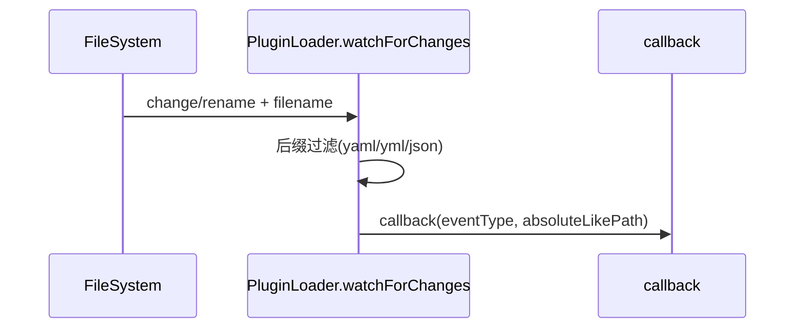

# plugin_discovery_and_loading 模块文档

## 模块简介与设计目标

`plugin_discovery_and_loading` 模块是插件系统的入口装配层，核心实现是 `src.plugins.loader.PluginLoader`。它的职责不是“执行插件逻辑”，而是把磁盘上的插件声明文件稳定地转化为“可被系统接纳的配置对象”，并在这个过程中完成发现、解析、校验分流和变更监听。换句话说，这个模块将“静态文件”转换为“运行时可消费的数据”，是插件生命周期中最先被调用、也是最容易成为故障前哨的位置。

该模块采用了非常务实的设计：通过 Node.js 标准库（`fs`/`path`）完成文件系统操作，YAML 解析使用内置轻量实现（`parseSimpleYAML`），并将结构与安全约束交给 `PluginValidator`。这种设计减少了外部依赖复杂度，适合对部署可控性要求高的环境；代价是 YAML 能力被刻意限制，必须通过文档和约束来避免“看起来合法但解析结果不符合预期”的配置。

在整个 `Plugin System` 中，本模块与 `agent_extension`、`quality_gate_execution`、`integration_webhook_dispatch`、`mcp_tool_plugins` 等子模块形成“前置供给”关系：它负责把候选插件配置整理好，后续模块再决定如何注册、执行或对外暴露。插件系统总览建议结合 [Plugin System.md](Plugin System.md) 阅读。

---

## 在系统中的位置


上图体现了一个明确分层：`PluginLoader` 负责 I/O 和格式转换，`PluginValidator` 负责规则判断，具体插件管理器负责运行时行为。这样可以避免“加载器知道太多业务语义”，也便于未来替换校验器或增加新的插件类型。

---

## 核心组件：`PluginLoader`

### 构造函数

```javascript
new PluginLoader(pluginsDir, schemasDir)
```

构造时会完成三件事：确定插件目录、实例化 `PluginValidator`、初始化 watcher 容器。

- `pluginsDir: string`：插件目录路径，未传时默认 `.loki/plugins`
- `schemasDir?: string`：Schema 目录，透传给 `PluginValidator`

内部状态：

- `this.pluginsDir`：发现/监听的目标目录
- `this.validator`：校验器实例（依赖 `src.plugins.validator.PluginValidator`）
- `this._watchers`：已创建的文件监听器集合，供统一清理

---

### `discover()`：插件文件发现

```javascript
discover(): string[]
```

`discover()` 只负责“找文件”，不负责内容正确性。它会执行以下流程：先判断路径存在，再确认该路径是目录，然后扫描目录条目，仅保留扩展名为 `.yaml`、`.yml`、`.json` 的文件，最后按路径排序返回。

关键行为特点：

- 任一阶段出错（路径不可访问、读取失败等）都会**吞掉异常并返回空数组**。
- 这是一个“安全降级”策略：加载器不会因单点 I/O 异常中断主流程，但调用方必须自行识别“无插件”到底是“真的没有”还是“发现失败”。

---

### `_parseFile(filePath)`：单文件解析

```javascript
_parseFile(filePath): object | null
```

该方法根据扩展名分流：

- `.json` 使用 `JSON.parse`
- 其他受支持扩展名（yaml/yml）走 `parseSimpleYAML`

任何异常（文件读取失败、JSON 语法错误等）都会返回 `null`。这意味着“解析错误”不会抛出到上层，而是被 `loadAll()/loadOne()` 转换成统一错误结构。

---

### `loadAll()`：批量加载与分流

```javascript
loadAll(): {
  loaded: Array<{ path: string, config: object }>,
  failed: Array<{ path: string, errors: string[] }>
}
```

`loadAll()` 是最常用入口。它先调用 `discover()` 获取候选文件，然后对每个文件执行“解析 -> 校验 -> 分类”。

- 解析成功且校验通过：进入 `loaded`
- 解析失败：进入 `failed`，错误为 `Failed to parse plugin file`
- 校验失败：进入 `failed`，错误来自 `validator.validate(...).errors`
- 单文件处理中的异常：进入 `failed`，错误为异常消息或 `Unknown error`

这种“双数组返回”模型非常适合启动阶段与审计场景，因为它能保留部分成功结果，不会因一个坏文件阻塞全部插件可用性。

---

### `loadOne(filePath)`：单文件加载

```javascript
loadOne(filePath): { config: object | null, errors: string[] }
```

适用于编辑器保存后增量重载、手工调试或 API 触发式重载。行为与 `loadAll()` 一致，但返回更轻量：成功给 `config`，失败给 `errors`。

---

### `watchForChanges(callback)`：目录变更监听

```javascript
watchForChanges(callback): () => void
```

该方法使用 `fs.watch` 监听插件目录，过滤后缀为 `.yaml/.yml/.json` 的文件，并把 `(eventType, filePath)` 交给回调。返回值是清理函数，用于关闭当前 watcher。

监听流程可抽象为：



注意这里使用的是目录级监听，不是单文件监听。调用方通常会在回调里触发 `loadOne()` 或 `loadAll()`，并自行实现去抖、重试与注册层同步。

---

### `stopWatching()`：统一释放监听器

```javascript
stopWatching(): void
```

关闭 `this._watchers` 中的全部 watcher，并重置为空数组。方法内部对 `watcher.close()` 的异常做了保护性吞并，确保“尽最大努力清理”。这在服务退出、测试 teardown、热重启时很实用。

---

## 内置 YAML 解析能力

`PluginLoader` 没有引入 `js-yaml`，而是依赖以下两个工具函数：

### `parseSimpleYAML(content)`

支持的语法子集包括：

- 顶层 key-value
- 简单数组（`key:` 后接缩进 `- item`）
- 多行字符串（`|` / `>`，按实现保留换行拼接）
- 布尔值、数字、`null/~`
- 注释与空行跳过

它是面向插件配置场景的“够用解析器”，不是完整 YAML 解释器。

### `parseYAMLValue(raw)`

负责把字符串字面量转换为 JS 值：

- `''` / `null` / `~` -> `null`
- `true` / `false` -> 布尔
- 引号包裹值 -> 去引号字符串
- 整数/浮点数字面量 -> `number`
- 其他 -> 原始字符串

---

## 与 `PluginValidator` 的协作关系

虽然本模块核心类只有 `PluginLoader`，但其行为正确性高度依赖 `PluginValidator.validate()`。当前实现中，校验器负责以下维度：

1. 基础结构检查（必须是对象，必须有 `type`/`name`）
2. 插件类型合法性检查
3. 基于 JSON Schema 的字段约束（required/type/enum/pattern 等）
4. 安全策略检查（命令注入模式、模板变量限制、`webhook_url` 协议限制等）
5. 与内置能力冲突检查（如内置 agent 名称）

因此，从工程职责上看，`PluginLoader` 是“输入管道”，`PluginValidator` 是“准入门禁”。校验细节建议阅读独立文档 [PluginValidator.md](PluginValidator.md)（如该文档尚未生成，可参考 [Plugin System.md](Plugin System.md) 的相关章节）。

---

## 使用方式与集成示例

### 启动时全量加载

```javascript
const { PluginLoader } = require('./src/plugins/loader');

const loader = new PluginLoader('.loki/plugins');
const { loaded, failed } = loader.loadAll();

for (const item of loaded) {
  // 交给对应插件管理器注册
  // registerByType(item.config)
}

if (failed.length > 0) {
  console.warn('Some plugins failed:', failed);
}
```

### 运行时监听 + 增量重载

```javascript
const cleanup = loader.watchForChanges((eventType, filePath) => {
  const result = loader.loadOne(filePath);

  if (result.config) {
    // upsert plugin config in registry
  } else {
    // mark plugin invalid / keep previous stable version
    console.error(`[${eventType}] invalid plugin`, filePath, result.errors);
  }
});

// 服务退出时
// cleanup();
// loader.stopWatching();
```

---

## 配置约定与扩展建议

默认目录是 `.loki/plugins`。如果你的部署环境有多租户或多项目隔离需求，建议显式传入 `pluginsDir`，避免共享目录带来的可见性和权限问题。Schema 目录建议固定版本并随发布打包，防止“运行代码版本”和“schema 版本”漂移导致校验结果不一致。

当你需要扩展新插件类型时，推荐路径是：先在 `PluginValidator` 增加类型与 schema，再由注册/执行层接入该类型。`PluginLoader` 本身通常不需要改动，因为它对类型是透明的，只处理文件与对象。

---

## 边界条件、错误与已知限制

### 1) YAML 能力不是完整规范

`parseSimpleYAML` 不支持复杂嵌套对象、锚点别名、复杂缩进语义等高级特性。对于复杂配置，建议使用 JSON，或将复杂结构拆分为更扁平字段。

### 2) 解析失败信息粒度有限

当前 `_parseFile()` 解析失败统一返回 `null`，`loadAll/loadOne` 只能给出通用错误文案（例如 `Failed to parse plugin file`）。这提升了稳定性，但降低了故障定位效率。

### 3) `discover()` 与 `watchForChanges()` 的“静默降级”

目录不存在、权限异常、`fs.watch` 初始化失败时，方法不会抛异常，而是返回空结果或 no-op 清理函数。调用方必须通过日志和健康检查补足可观测性。

### 4) 文件系统事件语义受平台影响

`fs.watch` 在不同 OS/文件系统上的事件行为可能不同，常见现象包括重复触发、只收到 `rename`、文件名偶发缺失。代码中已处理 `filename` 缺失直接忽略，但业务层仍应做去抖与幂等。

### 5) 仅按扩展名过滤

加载器通过后缀筛选候选文件，不会进一步识别 MIME 或内容类型。恶意或误命名文件仍可能进入解析流程，最终由解析/校验环节拦截。

---

## 运维与实践建议

生产环境建议把 `loadAll()` 结果（特别是 `failed`）接入审计日志与告警系统，避免插件加载失败悄无声息。对于热更新，建议采用“先校验、后替换”的策略：新配置无效时保留旧的稳定版本，避免因为一次错误提交导致能力瞬时消失。

如果你同时使用外部插件仓库同步（例如通过 Integrations 或 CI 分发配置文件），建议在写入插件目录前做原子落盘（临时文件 + rename），降低监听回调读取到半写入文件的概率。

---

## 相关文档

- 插件系统总览： [Plugin System.md](Plugin System.md)
- 插件类型管理： [AgentPlugin.md](AgentPlugin.md)、[GatePlugin.md](GatePlugin.md)、[IntegrationPlugin.md](IntegrationPlugin.md)、[MCPPlugin.md](MCPPlugin.md)
- 相关运行时治理： [Policy Engine.md](Policy Engine.md)（质量门策略接入）、[MCP Protocol.md](MCP Protocol.md)（工具协议侧）
