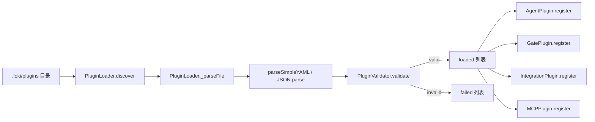
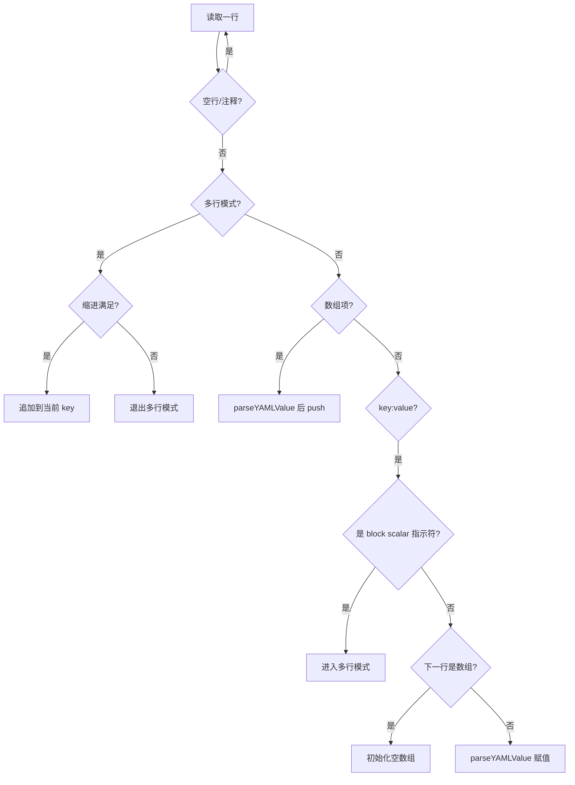
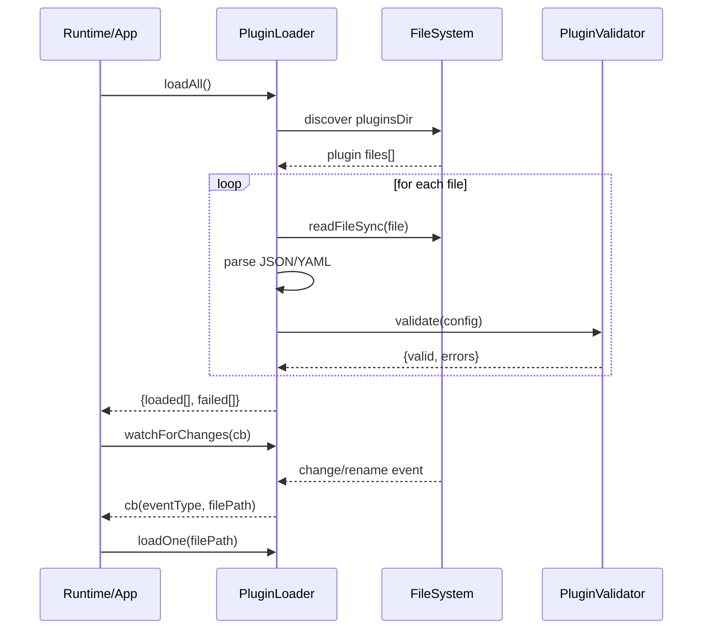

# plugin_loader 模块文档

## 模块概述

`plugin_loader` 模块（核心类：`src.plugins.loader.PluginLoader`）是插件系统的“入口装配层”。它不负责真正执行插件能力（例如执行质量门命令、发送 webhook、注册 MCP tool），而是负责把磁盘上的插件配置文件可靠地转换为**可被系统信任的插件配置对象**。从职责上看，它解决了三件基础问题：第一，发现插件文件；第二，解析配置格式（JSON / 简化 YAML）；第三，对解析结果进行结构与安全校验，并输出可加载与失败结果。

这个模块存在的根本原因是把“配置输入的不确定性”隔离在系统边缘。插件文件来自用户维护目录（默认 `.loki/plugins`），天然存在格式错误、字段缺失、恶意命令注入、非法 URL 等风险。`PluginLoader` 通过与 `PluginValidator` 配合，将这些风险在运行前显式化，并以结构化错误列表返回给调用方，从而避免错误配置直接流入执行层。

在整个 Plugin System 中，`PluginLoader` 是上游；`AgentPlugin`、`GatePlugin`、`IntegrationPlugin`、`MCPPlugin` 等是下游执行/注册模块。建议先阅读本页，再结合 [Plugin System.md](Plugin%20System.md)、[AgentPlugin.md](AgentPlugin.md)、[GatePlugin.md](GatePlugin.md)、[IntegrationPlugin.md](IntegrationPlugin.md)、[MCPPlugin.md](MCPPlugin.md) 理解完整生命周期。

---

## 设计目标与边界

`PluginLoader` 的设计偏向“轻量与稳健优先”：它使用 Node.js 内置 `fs` / `path` API，不引入重量依赖；YAML 解析只实现插件配置场景必需子集（键值、数组、布尔/数字、多行文本），减少依赖面与供应链风险；并通过“异常吞掉 + 明确失败结果”的方式保证上层业务在插件目录异常时仍可继续运行。

同样重要的是它的边界：它**不做插件注册**、**不做插件执行**、**不做 schema 定义**，这些职责分别在具体插件模块和 `PluginValidator` 中。`PluginLoader` 只交付“已验证配置”或“可诊断错误”。

---

## 模块在系统中的位置



上图展示了插件配置从文件系统到运行态注册的主路径：`PluginLoader` 负责前半段（发现、解析、校验、分流），后半段由不同插件类型模块接管。这样的分层让“输入可信化”和“业务执行”解耦，提升了可测试性与故障隔离能力。

---

## 核心组件详解

## `PluginLoader` 类

### 构造函数：`new PluginLoader(pluginsDir, schemasDir)`

构造函数接收插件目录和 schema 目录。`pluginsDir` 默认值为 `.loki/plugins`；`schemasDir` 透传给 `PluginValidator`，用于覆盖默认 schema 路径（默认在 `src/plugins/schemas`）。实例内部会创建：

- `this.pluginsDir`：当前 loader 的文件发现根目录。
- `this.validator`：`PluginValidator` 实例，负责结构/安全校验。
- `this._watchers`：当前实例创建的文件监听器集合，用于统一回收。

此设计意味着一个进程可以并存多个 loader，分别管理不同插件目录与 schema 版本（例如多租户或测试环境并行）。

### `discover()`

`discover()` 扫描 `pluginsDir`，返回目录下扩展名为 `.yaml`、`.yml`、`.json` 的文件绝对/拼接路径数组（按字典序排序）。它在多个阶段都做了容错：目录不存在、路径不可 stat、目录读取失败都会返回空数组而非抛异常。

这种行为对运行系统很关键：插件是“可选扩展能力”，不是“主流程阻断点”。因此当目录被误删、权限波动或网络文件系统短暂不可达时，系统仍能继续启动，只是没有新插件被加载。

**返回值**：`string[]`，稳定排序结果。排序可帮助上层实现可重复加载顺序。

### `_parseFile(filePath)`

该私有方法读取文件并根据后缀解析：

- `.json` 使用 `JSON.parse`
- `.yaml` / `.yml` 使用 `parseSimpleYAML`

解析失败时返回 `null`。注意这里不会携带解析错误上下文（例如具体第几行语法错误），上层只收到通用失败信息，这是一种“简化 API，牺牲调试细节”的取舍。

**副作用**：同步 I/O（`readFileSync`），适合启动时加载；若在请求热路径大量调用需谨慎。

### `loadAll()`

`loadAll()` 是批量加载主入口。它先 `discover()`，再对每个文件执行“解析 → 校验 → 分流”：

- 解析失败：写入 `failed[]`
- 校验通过：写入 `loaded[]`（携带 `path + config`）
- 校验失败：写入 `failed[]`（携带 validator 错误数组）

即使单个文件异常，也不会中断整个批次；每个文件独立 try/catch。这种“局部失败不扩散”非常适合插件生态。

**返回结构**：

```js
{
  loaded: Array<{ path: string, config: object }>,
  failed: Array<{ path: string, errors: string[] }>
}
```

### `loadOne(filePath)`

针对单文件校验，便于增量更新或监听回调中按文件重载。其逻辑与 `loadAll` 单文件分支一致，返回值更扁平：

```js
{ config: object | null, errors: string[] }
```

### `watchForChanges(callback)`

该方法基于 `fs.watch` 监听 `pluginsDir` 变化，并只对 `.yaml` / `.yml` / `.json` 文件触发回调 `callback(eventType, filePath)`。它把 watcher 存入 `_watchers`，并返回一个**取消监听函数**，调用后会关闭 watcher 并从数组中移除。

如果目录不存在或监听创建失败，返回一个 no-op 清理函数，保证调用方始终可以安全调用 cleanup。

### `stopWatching()`

关闭当前 loader 创建的全部 watcher，并清空 `_watchers`。这是进程退出、模块热重载或测试 teardown 的必要步骤，避免句柄泄漏。

---

## 解析子系统：`parseSimpleYAML` 与 `parseYAMLValue`

`parseSimpleYAML(content)` 是一个简化 YAML 解析器，支持插件配置常用子集：

- 顶层 key-value（key 使用正则 `^[a-z_][a-z0-9_]*$`，不区分大小写）
- 数组项（`- item`）
- 多行文本（`|` 或 `>` 指示符，基于缩进拼接）
- 基础标量类型（布尔、整数、浮点、null、引号字符串）

`parseYAMLValue(raw)` 负责单值转换：

- `''` / `null` / `~` → `null`
- `true` / `false` → 布尔
- `"..."` / `'...'` → 去引号字符串
- 正负整数/浮点 → `number`
- 其他 → 原始字符串

这个实现的优势是轻量和可控，但它**不是完整 YAML 解析器**。例如嵌套对象、复杂缩进语义、锚点/引用等特性不支持（详见“限制与坑点”章节）。



上图展示了解析状态机。理解这个状态切换有助于解释为什么某些“看起来合法的 YAML”在这里会被误解析或静默降级成字符串。

---

## 与 `PluginValidator` 的协作关系

`PluginLoader` 的校验能力完全委托给 `PluginValidator.validate(config)`。validator 负责：

1. 基础字段检查（`type` / `name`）
2. 插件类型合法性检查（如 `agent`、`quality_gate`、`integration`、`mcp_tool`）
3. 按插件类型加载 JSON Schema 并执行简化 schema 校验
4. 安全检查（command 注入字符、payload template 变量白名单、webhook URL 协议限制等）
5. 内置 agent 名称冲突检查

因此，`PluginLoader` 的“成功加载”语义并非“能解析就行”，而是“**解析 + 合规 + 安全检查通过**”。如果你扩展了新插件类型，通常要同步扩展 validator 的类型枚举和 schema 文件，否则 loader 只能把该配置归为失败项。

可参考：[plugin_discovery_and_loading.md](plugin_discovery_and_loading.md)、[integration_plugin.md](integration_plugin.md)、[mcp_plugin.md](mcp_plugin.md)。

---

## 典型调用流程



实际工程里，`watchForChanges` 通常与 `loadOne` 配对使用：当收到变更事件时增量重载该文件，而不是每次全量 `loadAll`。

---

## 使用示例

## 1) 启动时全量加载

```js
const { PluginLoader } = require('./src/plugins/loader');

const loader = new PluginLoader('.loki/plugins');
const result = loader.loadAll();

for (const item of result.loaded) {
  console.log('Loaded:', item.path, item.config.type, item.config.name);
}

for (const item of result.failed) {
  console.error('Failed:', item.path, item.errors);
}
```

## 2) 监听目录并增量重载

```js
const cleanup = loader.watchForChanges((eventType, filePath) => {
  const { config, errors } = loader.loadOne(filePath);
  if (config) {
    console.log(`[${eventType}] reloaded`, config.name);
  } else {
    console.error(`[${eventType}] invalid plugin`, filePath, errors);
  }
});

// 进程退出时
process.on('SIGINT', () => {
  cleanup();
  loader.stopWatching();
  process.exit(0);
});
```

## 3) 可维护的插件目录约定

```text
.loki/plugins/
  agent.code-reviewer.yaml
  gate.unit-tests.yaml
  integration.slack-alerts.json
  mcp.git-inspect.yaml
```

建议通过文件名前缀表达类型，便于排障与审计。`discover()` 只看扩展名，不看前缀。

---

## 配置与扩展说明

`PluginLoader` 可通过两个维度配置：插件目录与 schema 目录。前者决定输入来源，后者决定“什么叫合法插件”。在 CI 场景中，你可以把 `schemasDir` 指向版本固定目录，以保证团队在不同机器上得到一致校验结果。

扩展新插件类型时，推荐流程是：先在 `PluginValidator` 增加类型与 schema，再在对应插件执行模块实现 `register/execute`，最后由应用层把 `loadAll().loaded` 按 `config.type` 分发。也就是说，`PluginLoader` 本身通常无需修改。

---

## 错误处理与可观测性建议

当前实现倾向“静默失败 + 结构化结果”，不会抛出太多异常。这有利于稳定性，但也会减少现场信息。生产实践中建议在调用层补充以下观测：

- 对 `failed[]` 做结构化日志落盘（至少含 path、errors、时间戳）
- 在 watch 模式中记录事件风暴（频繁 rename/change）
- 区分“解析失败”和“安全校验失败”告警级别

如需指标体系，可接入 [Observability.md](Observability.md) 的计数器/直方图模式（例如 `plugins_loaded_total`、`plugins_failed_total`、`plugin_reload_latency_ms`）。

---

## 边界条件、限制与坑点

### YAML 解析能力是“子集”而非标准完整实现

`parseSimpleYAML` 不支持复杂对象嵌套、锚点、别名等高级 YAML 特性。若用户直接复制复杂 Helm/K8s 风格 YAML，可能被错误解析或解析为字符串。对于复杂配置，优先使用 JSON 文件更稳妥。

### 键名正则较严格

key 需要匹配 `^[a-z_][a-z0-9_]*$`（大小写不敏感），这意味着带 `-`、`.` 的键在 YAML 下可能无法按预期解析。建议统一使用 snake_case。

### 同步 I/O 的性能取舍

`discover()` / `_parseFile()` 采用同步文件 API，更适合启动阶段或低频操作。在高并发请求路径频繁调用会阻塞事件循环，建议改为缓存 + 变更触发重载模式。

### `fs.watch` 的平台差异

不同操作系统上 `eventType` 与 `filename` 行为不完全一致，且可能出现重复事件或丢事件。当前实现在 `filename` 为空时直接忽略，调用方应设计幂等重载逻辑（例如事件后延迟 50~200ms 再 `loadOne`，或兜底周期性 `loadAll`）。

### 错误信息粒度有限

`_parseFile()` 捕获后统一返回 `null`，导致调用方无法直接知道 JSON 语法错误位置。若你在开发工具链中需要更强诊断，可在外围预解析文件并输出详细错误。

### 监听器生命周期管理

`watchForChanges` 每调用一次都会创建 watcher。若忘记调用 cleanup 或 `stopWatching()`，可能造成句柄泄漏并阻止进程退出。

---

## 安全语义说明

虽然 `PluginLoader` 不直接执行命令，但它通过 validator 把安全前置。典型策略包括：阻止明显 shell 注入元字符、限制 webhook URL 到 HTTPS/localhost、限制 payload 模板变量来源。对于安全敏感环境，这是一道必要但不充分的防线，执行模块（如 `GatePlugin.execute`、`MCPPlugin.execute`）仍需要沙箱、最小权限与超时控制。

---

## 测试建议

建议把测试分三层：

1. **发现层测试**：目录不存在、文件后缀过滤、排序稳定性。
2. **解析层测试**：JSON 语法错误、YAML 数组/多行文本/类型转换。
3. **集成层测试**：`loadAll` 对混合成功与失败文件的分流准确性，以及 watch 回调后 `loadOne` 增量重载路径。

测试 teardown 必须调用 `stopWatching()`，避免测试进程悬挂。

---

## 维护者速查（API 摘要）

```js
class PluginLoader {
  constructor(pluginsDir?: string, schemasDir?: string)
  discover(): string[]
  _parseFile(filePath: string): object | null
  loadAll(): {
    loaded: Array<{ path: string, config: object }>,
    failed: Array<{ path: string, errors: string[] }>
  }
  loadOne(filePath: string): { config: object | null, errors: string[] }
  watchForChanges(callback: (eventType: string, filePath: string) => void): () => void
  stopWatching(): void
}

function parseSimpleYAML(content: string): object
function parseYAMLValue(raw: string): any
```

如果你只记住一句话：`PluginLoader` 是插件系统的“输入网关”，把磁盘配置转换为可验证、可追踪、可分流的运行态输入。
