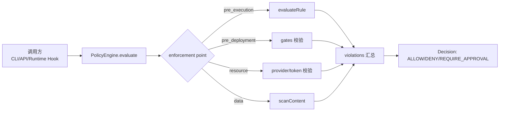
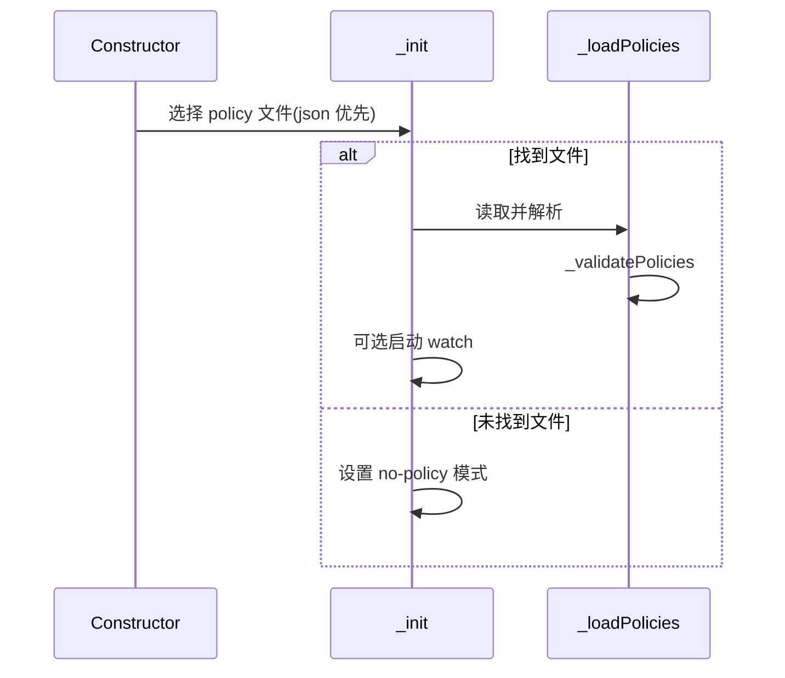
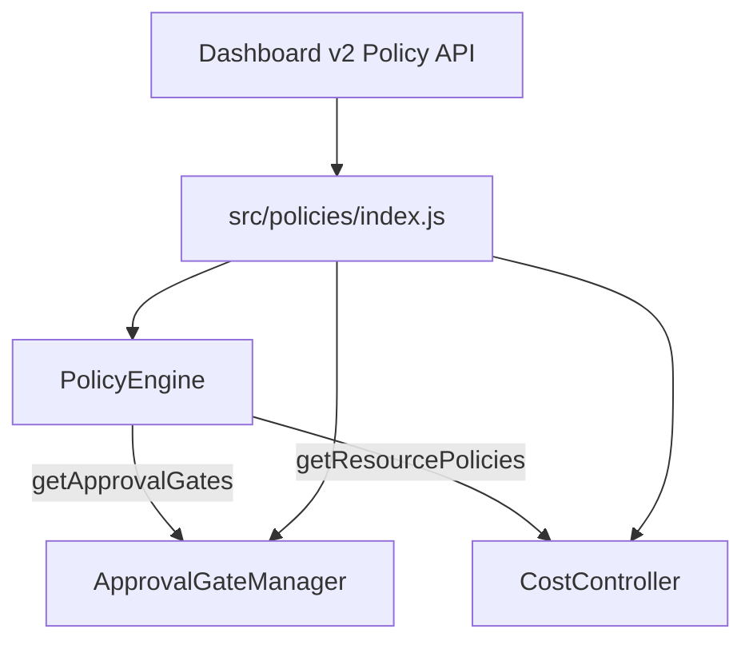

# policy_evaluation_engine 模块文档

## 模块定位与设计目标

`policy_evaluation_engine` 是 Policy Engine 子系统中的“同步策略判定核心”，其核心实现为 `src.policies.engine.PolicyEngine`。这个模块存在的主要原因，是把“策略定义（Policy-as-Code）”与“执行点决策（enforcement point decision）”解耦，让系统在关键动作发生前（如执行前、部署前、资源消耗、数据外发）进行**低延迟、可预测、无外部依赖**的安全与治理判定。

该模块采用了非常明确的设计取向：**评估阶段不做 I/O**，所有文件读写发生在初始化和重载阶段，正常 `evaluate()` 调用只读取内存缓存。因此它可以在高频调用路径中使用，目标是将单次评估控制在毫秒级。与此同时，它支持“无策略文件时默认放行”的零开销模式，避免对未启用治理能力的项目造成性能和复杂性负担。

从系统分层上看，这个模块是 `Policy Engine` 的基础判断层，上层由 `src/policies/index.js` 组合 `ApprovalGateManager` 与 `CostController` 形成完整治理能力。若你需要审批流行为细节，请参见 [Policy Engine - Approval Gate.md](Policy%20Engine%20-%20Approval%20Gate.md)；若你关注 token 预算治理与告警，请参见 [Policy Engine.md](Policy%20Engine.md) 与成本相关文档。

---

## 在整体系统中的角色

`PolicyEngine` 本身只做“策略加载 + 校验 +同步评估”，不负责审批状态持久化、异步 webhook、成本事件流。它是一个纯判定器，向上暴露统一决策结构：`ALLOW`、`DENY`、`REQUIRE_APPROVAL`。



上图体现了该模块的关键价值：把不同策略域（执行、部署、资源、数据）统一成同一个决策输出，方便上层框架在 enforcement hook 中一致处理。

---

## 核心组件详解

## 1) `PolicyEngine` 类

### 构造函数

```js
new PolicyEngine(projectDir, options)
```

构造时会立即执行 `_init()`。

- `projectDir: string`：项目根目录，模块会在 `${projectDir}/.loki/` 下寻找策略文件。
- `options.watch?: boolean`：是否开启文件变更监听（基于 `fs.watchFile` 轮询）。

内部状态：

- `_policies`：内存中的已解析策略对象（可能为 `null`）。
- `_policyPath`：当前选中的策略文件路径。
- `_validationErrors`：最近一次加载时的结构校验错误/警告列表。
- `_watcher`：监听开关标记。
- `_loaded`：是否完成初始化加载。

### 初始化与加载策略

初始化优先读取：

1. `.loki/policies.json`
2. `.loki/policies.yaml`

若两者都不存在，则进入“无策略模式”：`_policies = null`，后续 `evaluate()` 直接 `ALLOW`。



### `evaluate(enforcementPoint, context)`

这是模块最核心的公共接口。返回固定结构：

```ts
{
  allowed: boolean,
  decision: 'ALLOW' | 'DENY' | 'REQUIRE_APPROVAL',
  reason: string,
  requiresApproval: boolean,
  violations: Array
}
```

其执行策略是先收集 `violations`，再按优先级决策：

1. 只要存在 `action === 'deny'` 的违规项，直接 `DENY`。
2. 否则若存在 `action === 'require_approval'`，返回 `REQUIRE_APPROVAL`。
3. 否则 `ALLOW`。

这是一个“拒绝优先”的 fail-closed 语义，保证 deny 不会被 approval 覆盖。

---

## 2) enforcement point 评估器

### `pre_execution`：`_evaluatePreExecution(entries, context, violations)`

逐条调用 `evaluateRule(entry.rule, context)`。当返回 `false` 时记录违规；返回 `true` 视为通过；返回 `null` 代表未知规则，当前实现默认放行（仅在加载时给 warning）。

这意味着该模块支持前向兼容策略字符串，但也引入“拼写错误被放过”的风险，需要结合 `getValidationErrors()` 做上线前检查。

### `pre_deployment`：`_evaluatePreDeployment(entries, context, violations)`

检查 `entry.gates` 是否都在 `context.passed_gates` 中，缺失任何 gate 即记违规。适合在发布前强制质量门，例如 checklist、security review、manual signoff。

### `resource`：`_evaluateResource(entries, context, violations)`

包含两类同步检查：

- `providers` 白名单：`context.provider` 不在允许列表则违规。
- `max_tokens` 预算：当 `tokens_consumed >= max_tokens` 违规。

超过预算时 action 由 `on_exceed` 决定：

- `require_approval` -> `require_approval`
- 其他值 -> `deny`

注意：这里判断是 `>=`，不是 `>`，达到阈值即触发。

### `data`：`_evaluateData(entries, context, violations)`

若 `context.content` 存在，则调用 `scanContent(content, entry.type)` 扫描敏感信息。命中后在 violation 中附带 `findings`。

当前内建扫描只返回“截断后的匹配片段”，不会暴露完整明文，属于最小泄漏设计。

---

## 3) 策略校验与可观测错误

`_validatePolicies(parsed)` 会验证各策略段条目结构，依赖 `src/policies/types.js` 中的验证器：

- `validatePreExecution`
- `validatePreDeployment`
- `validateResource`
- `validateData`
- `validateApprovalGate`

同时，`pre_execution.rule` 会与 `RULE_EVALUATORS` 做匹配检测，无法匹配时写入 warning 文本。该 warning 被记录在 `_validationErrors` 中，可通过 `getValidationErrors()` 读取。

关键行为：**即使存在校验错误，策略仍会加载并参与评估**。这是一种“可运行优先”策略，运维上应配合 CI 检查将 warning/error 提前失败。

---

## 4) YAML 子集解析器 `parseSimpleYaml`

模块内置了一个轻量 YAML 解析器，仅覆盖策略文件需要的子集，以避免引入额外依赖。支持：

- 标量（字符串、数字、布尔、null）
- 行内数组 `[a, b, c]`
- `- item` 风格数组
- 基于缩进的嵌套对象

不支持：

- 多行字符串完整语义（`|` / `>` 仅做简化处理）
- anchors/aliases
- 复杂 YAML 类型系统

如果策略文件使用了超出子集的 YAML 特性，解析结果可能偏离预期。生产环境建议优先使用 `policies.json` 或保持 YAML 简洁。

---

## 配置模型与示例

## JSON 示例（推荐）

```json
{
  "policies": {
    "pre_execution": [
      {
        "name": "Restrict file access",
        "rule": "file_path must start with project_dir",
        "action": "deny"
      },
      {
        "name": "Agent concurrency cap",
        "rule": "active_agents <= 10",
        "action": "deny"
      }
    ],
    "pre_deployment": [
      {
        "name": "Release gates",
        "gates": ["tests_passed", "security_review"],
        "action": "require_approval"
      }
    ],
    "resource": [
      {
        "name": "Token budget",
        "max_tokens": 200000,
        "on_exceed": "require_approval",
        "providers": ["openai", "anthropic"]
      }
    ],
    "data": [
      {
        "name": "Secret scan",
        "type": "secret_detection",
        "action": "deny"
      }
    ],
    "approval_gates": [
      {
        "name": "Deploy approval",
        "phase": "deploy",
        "timeout_minutes": 30,
        "webhook": "https://example.com/approval"
      }
    ]
  }
}
```

## 调用示例

```js
const { PolicyEngine } = require('./src/policies/engine');

const engine = new PolicyEngine(process.cwd(), { watch: true });

const result = engine.evaluate('resource', {
  provider: 'openai',
  tokens_consumed: 210000,
});

if (!result.allowed && result.decision === 'REQUIRE_APPROVAL') {
  // 交由 approval manager 处理
}

console.log(engine.getValidationErrors());
engine.destroy();
```

---

## 与其他模块的关系

`policy_evaluation_engine` 通常不会单独部署，而是被 `src/policies/index.js` 包装为模块级单例 API，向外提供 `evaluate/checkBudget/requestApproval` 等统一入口。`PolicyEngine` 提供的两个 accessor 是关键集成点：

- `getApprovalGates()`：供 `ApprovalGateManager` 初始化 gate 定义。
- `getResourcePolicies()`：供 `CostController` 提取预算配置。



Dashboard 侧的 `PolicyEvaluateRequest` / `PolicyUpdate`（见 [v2_admin_and_governance_api.md](v2_admin_and_governance_api.md)）通常承载策略评估与策略下发的接口契约，而实际执行由这里的引擎完成。

---

## 边界条件、错误场景与限制

该模块在可靠性上偏向“不中断主流程”，但这要求使用方明确其行为边界。

1. **策略文件缺失**：默认全放行。这对开发友好，但在生产中意味着“治理未启用即无保护”。
2. **策略加载失败（JSON 语法错误等）**：会记录错误并把 `_policies` 设为 `null`，实际效果等同无策略模式。
3. **未知 enforcement point**：`evaluate()` 返回 `ALLOW`，并在 reason 中标明未知点。
4. **未知 pre_execution 规则**：`evaluateRule()` 返回 `null`（按通过处理），仅在校验错误中提示 warning。
5. **`data` 扫描依赖 `context.content`**：未提供内容则跳过，不产生违规。
6. **YAML 解析能力有限**：复杂 YAML 可能被错误解析但不抛错。
7. **watch 模式是轮询**：`fs.watchFile` 每秒轮询，跨平台稳定但非实时，且会有少量持续开销。

---

## 可扩展性建议

扩展该模块时应保持“评估同步、无 I/O”这一核心约束。实践上建议：

- 新增 `pre_execution` 规则时，在 `types.js` 的 `RULE_EVALUATORS` 增加 evaluator，并更新校验提示。
- 新增 enforcement point 时，在 `evaluate()` 的 `switch` 中添加分支，同时补充 `_validatePolicies()` 对应段校验。
- 若需要更复杂数据扫描（如上下文感知、DLP 引擎），建议在上游异步预处理后，把结果映射为同步上下文字段，再由 `PolicyEngine` 做最终决策。

---

## 运维与测试建议

建议在 CI 中对策略文件做两类检查：

- 初始化后断言 `getValidationErrors().length === 0`。
- 用代表性 context 做回归评估，确保关键策略返回预期 decision。

上线时，如果启用了 `watch`，应在进程退出钩子调用 `destroy()` 释放文件监听，避免长期进程资源泄漏。

---

## 参考文档

- [Policy Engine.md](Policy%20Engine.md)：Policy 子系统总览与对外 API。
- [Policy Engine - Approval Gate.md](Policy%20Engine%20-%20Approval%20Gate.md)：审批门工作流与超时策略。
- [v2_admin_and_governance_api.md](v2_admin_and_governance_api.md)：Dashboard V2 治理接口契约。
