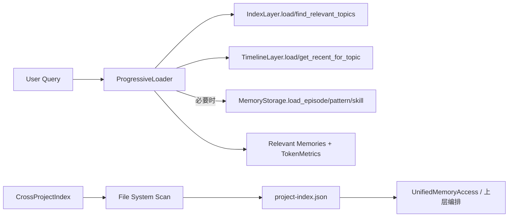
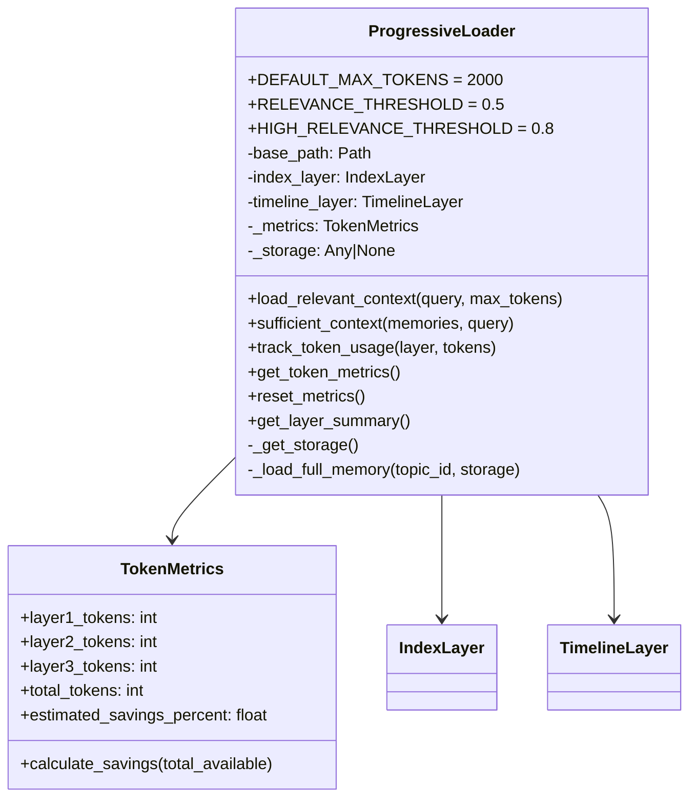
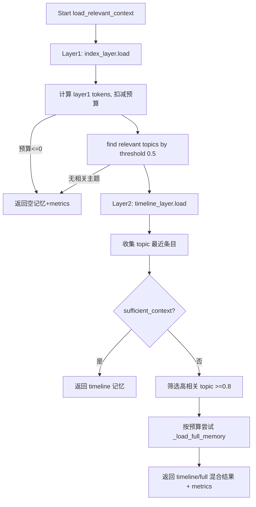
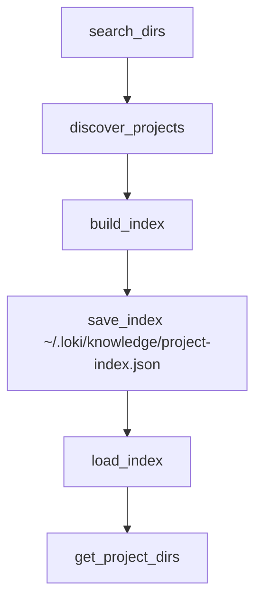
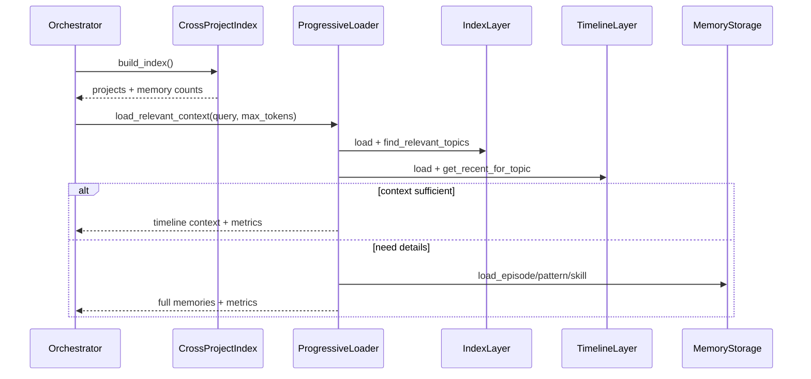

# progressive_loading_and_cross_project_index 模块文档

## 模块概述

`progressive_loading_and_cross_project_index` 是 Memory System 中负责“按需加载”和“跨项目发现”的关键组合模块，由 `memory.layers.loader.ProgressiveLoader` 与 `memory.cross_project.CrossProjectIndex` 两个核心组件构成。它存在的核心原因是：在真实代理系统中，记忆数据规模会随着任务执行不断增长，如果每次检索都直接加载完整记忆，会造成显著的 token 浪费、响应时间增加以及上下文窗口挤占；同时，当团队维护多个项目时，记忆孤岛会导致知识复用效率低。该模块通过分层渐进加载策略降低单次查询成本，并通过跨项目索引机制建立全局“可发现性”。

从设计思想上看，这个模块把“检索效率”拆成两个维度：其一是**单项目内的上下文预算控制**（ProgressiveLoader），其二是**多项目间的记忆资产盘点**（CrossProjectIndex）。前者强调“只在必要时下钻到完整内容”，后者强调“先知道有哪些项目和多少记忆，再决定是否接入检索”。这使系统可以在性能、相关性与可维护性之间取得较均衡的工程结果。

---

## 在整体系统中的定位

在 Memory System 的子域中，本模块位于 `schemas_and_task_context`、`embedding_and_chunking`、`retrieval_and_vector_indexing` 之后，承担“执行时的加载优化”和“多项目记忆源发现”的职责。它不负责 embedding 生成，也不直接负责向量相似度计算，而是消费上游产物（主题索引、时间线、存储目录结构）并做策略编排。

可参考以下相关文档，避免重复阅读：

- 记忆分层与引擎总览：[`Memory System.md`](Memory%20System.md)
- 检索/索引细节：[`retrieval_and_vector_indexing.md`](retrieval_and_vector_indexing.md)
- 分块与向量化基础：[`embedding_and_chunking.md`](embedding_and_chunking.md)
- 统一访问入口：[`unified_access_and_cross_project.md`](unified_access_and_cross_project.md)

### 架构关系图



`ProgressiveLoader` 更偏在线路径（query-time）；`CrossProjectIndex` 更偏离线或半离线路径（discovery/index-time）。两者常在统一访问层或 orchestration 层汇合：先由 `CrossProjectIndex` 发现候选项目，再在单项目内交由 `ProgressiveLoader` 执行低成本上下文加载。

---

## 核心组件一：ProgressiveLoader

## 设计目标

`ProgressiveLoader` 实现三层渐进披露（progressive disclosure）：

1. 第 1 层仅加载主题索引（低 token 成本）；
2. 第 2 层加载相关主题的近期时间线上下文（中等成本）；
3. 第 3 层仅对高相关主题加载完整记忆（高成本，按预算受控）。

这是一种“先粗后细”的检索策略，目的是把大多数问题限制在 Layer1+Layer2 即可回答，仅在确实需要细节时再进入 Layer3。

## 类与内部结构



尽管 `TokenMetrics` 不是单独导出的核心入口，但它是这个加载器可观测性的关键结构，直接影响你在生产中如何调参（例如 `max_tokens` 或 relevance 阈值）。

## 关键方法详解

### `__init__(base_path, index_layer, timeline_layer)`

构造函数接收存储根路径与两个已注入层对象（`IndexLayer`、`TimelineLayer`）。它采用懒加载方式处理 `MemoryStorage`，避免模块初始化时就绑定存储实现，提高可移植性（尤其在测试、裁剪部署、或不启用 full-memory 层时）。

- 参数
  - `base_path: str`：记忆目录根路径。
  - `index_layer: IndexLayer`：主题与摘要入口。
  - `timeline_layer: TimelineLayer`：近期上下文入口。
- 副作用
  - 初始化内部度量 `_metrics`。
  - `_storage` 初始为 `None`，首次需要 Layer3 时才尝试导入与实例化。

### `_get_storage()`

内部方法，延迟创建 `MemoryStorage`。如果 `..storage` 不可导入，会静默回退为 `None`。这意味着 Layer3 可能不可用但流程不崩溃，属于“降级可运行”策略。

### `load_relevant_context(query, max_tokens=DEFAULT_MAX_TOKENS)`

这是模块主流程入口，返回 `(memories, token_metrics)`。

- 输入
  - `query: str`：查询文本。
  - `max_tokens: int`：本次加载总预算。
- 输出
  - `memories: List[Dict[str, Any]]`：检索到的上下文片段或完整记忆。
  - `TokenMetrics`：本次请求的分层 token 使用情况与节省估算。

#### 执行流程图



#### 行为要点

- Layer1 总会先执行，因为它负责 topic 召回。
- 当 `remaining_tokens <= 0` 时会提前返回，不会继续下钻。
- Layer2 当前实现是对 `timeline_layer.load()` 的整体加载，再按 topic 取近期条目。
- Layer3 仅处理 `relevance_score >= 0.8` 的主题，并受每个 topic 的 `token_count` 与剩余预算约束。
- 最终会通过 `index['total_tokens_available']` 估算节省比例。

### `_load_full_memory(topic_id, storage=None)`

按顺序尝试从存储层读取：`episode -> pattern -> skill`。命中即返回统一结构：

```python
{"id": topic_id, "type": "episode|pattern|skill", "content": ...}
```

如果三类都未命中，返回 `None`。

### `sufficient_context(memories, query)`

该方法使用启发式规则判断是否要进入 Layer3：

- 无记忆：不足；
- 若已有 3 条及以上条目：通常认为足够；
- 若 query 包含 detail-seeking 关键词（如 `exactly`, `details`, `full`, `everything`）：倾向认为不足；
- 否则只要有条目就认为可先尝试。

这是一个轻量、可解释、成本低的判断器，但并非语义最优解，适合作为 baseline。

### `track_token_usage(layer, tokens)` / `get_token_metrics()` / `reset_metrics()` / `get_layer_summary()`

这些方法提供运行期可观测性与调试能力。`get_layer_summary()` 会给出分层占比描述，适合接入 dashboard 或日志审计链路。

## 使用示例

```python
from memory.layers.loader import ProgressiveLoader
from memory.layers.index_layer import IndexLayer
from memory.layers.timeline_layer import TimelineLayer

index_layer = IndexLayer(base_path="/workspace/.loki/memory")
timeline_layer = TimelineLayer(base_path="/workspace/.loki/memory")

loader = ProgressiveLoader(
    base_path="/workspace/.loki/memory",
    index_layer=index_layer,
    timeline_layer=timeline_layer,
)

memories, metrics = loader.load_relevant_context(
    query="Give me full details about the deployment rollback decision",
    max_tokens=2500,
)

print(metrics.total_tokens, metrics.estimated_savings_percent)
print(loader.get_layer_summary())
```

## 配置与扩展建议

`ProgressiveLoader` 当前通过类常量提供默认阈值。如果你要扩展为可配置策略，推荐把以下参数外置到配置中心或构造参数：

- `DEFAULT_MAX_TOKENS`
- `RELEVANCE_THRESHOLD`
- `HIGH_RELEVANCE_THRESHOLD`
- detail keyword 列表（当前硬编码在 `sufficient_context`）

你也可以覆写 `sufficient_context` 实现更强策略，例如：基于 query intent 分类器、LLM 判别器、或统计学习模型做“是否需要 Layer3”的决策。

---

## 核心组件二：CrossProjectIndex

## 设计目标

`CrossProjectIndex` 用于扫描多个工作目录，识别包含 `.loki/memory` 的项目，并生成聚合索引（项目列表 + 记忆数量统计）。它解决的是“我有哪些可用记忆库”的发现问题，而不是“哪条记忆最相关”的检索问题。

## 结构与职责



- `discover_projects()`：在每个搜索目录下仅扫描一层子目录，检查 `child/.loki/memory` 是否存在。
- `build_index()`：统计每个项目内 `episodic/*.json`、`semantic/*.json`、`skills/*.json` 数量，并计算总量。
- `save_index()` / `load_index()`：持久化索引，便于后续快速读取。
- `get_project_dirs()`：返回项目目录 `Path` 列表，供上层进一步访问。

## 关键方法说明

### `__init__(search_dirs=None, index_file=None)`

如果未显式传入：

- `search_dirs` 默认为 `~/git`, `~/projects`, `~/src`
- `index_file` 默认为 `~/.loki/knowledge/project-index.json`

这体现了“开箱可用”的本地开发者默认路径策略。

### `discover_projects()`

返回每个项目的基础元数据：`path`, `name`, `memory_dir`, `discovered_at`。它只扫描深度 1，这在大型磁盘结构上能显著控制扫描耗时，但会漏掉更深层嵌套项目。

### `build_index()`

对每个项目统计三类文件数并聚合：

- `episodic_count`
- `semantic_count`
- `skills_count`

同时汇总到：

- `total_episodes`
- `total_patterns`（来源于 semantic）
- `total_skills`

### `save_index()` / `load_index()`

提供最基础的 JSON 序列化持久化。当前未做并发写保护，也未做 schema version 控制，适合单进程或低冲突场景。

## 使用示例

```python
from memory.cross_project import CrossProjectIndex

cpi = CrossProjectIndex(
    search_dirs=["/workspace", "/opt/projects"],
    index_file="/tmp/project-index.json",
)

index = cpi.build_index()
cpi.save_index()

print(index["total_episodes"], index["total_patterns"], index["total_skills"])
print(cpi.get_project_dirs())
```

---

## 组件协作与典型流程

在真实系统里，两者通常按“先发现、后加载”的模式协作：先通过 `CrossProjectIndex` 获取候选项目，再在选定项目上下文中实例化 `ProgressiveLoader` 做分层加载。



该模式可以与 `UnifiedMemoryAccess` 或 API 服务层对接，构建跨项目、分层、预算受控的记忆检索链路。

---

## 错误条件、边界场景与限制

本模块整体偏“容错降级”，不会轻易抛出硬错误，但存在若干需要注意的行为约束。

### ProgressiveLoader 侧

- 当 Layer1 已耗尽预算时，会直接返回空结果；这在超小预算场景很常见。
- `timeline_layer.load()` 的 token 成本按整体计入，即使最终只用了少量 topic 的最近条目。
- `_get_storage()` 导入失败时 Layer3 自动失效，不会异常中断，可能导致“明明 query 要细节却只给摘要”的体验差。
- `high_relevance` 仅选取 `>= 0.8`，可能错过中高相关但重要的主题。
- `topic.token_count` 若估计不准，预算控制会偏离实际。
- `sufficient_context()` 的关键词判定是英文关键词集合，针对中文 query 的细节意图识别能力有限。

### CrossProjectIndex 侧

- 扫描深度固定为 1，嵌套仓库不会被发现。
- 仅按 `*.json` 文件数量计数，不校验内容是否有效或 schema 是否匹配。
- `discovered_at` 与 `built_at` 使用 `isoformat() + 'Z'`，如果 `isoformat()` 已包含时区偏移，字符串可能出现冗余时区表示。
- `save_index()` 无文件锁，多个进程并发写入可能造成覆盖。
- `load_index()` 对损坏 JSON 缺少恢复策略，调用方应自行兜底。

---

## 运维与可观测性建议

建议把 `TokenMetrics` 和 `get_layer_summary()` 输出纳入统一 telemetry：

- 记录每次查询的 layer 分布、总 token、节省率；
- 按 query 类型统计 Layer3 触发率，评估阈值是否过高/过低；
- 将跨项目索引构建结果（项目数、各类记忆总量）作为周期性健康指标。

如需接入全局观测体系，可参考 Observability 模块文档：[`Observability.md`](Observability.md)。

---

## 扩展路线（建议）

如果你准备增强该模块，优先级建议如下：

1. **可配置化**：把阈值、关键词、扫描深度、索引路径外置。
2. **策略升级**：以语义分类器替代 `sufficient_context` 的静态启发式。
3. **并发与增量索引**：CrossProjectIndex 支持增量更新、mtime 追踪与并发安全写入。
4. **质量校验**：索引构建时增加 JSON schema 校验与损坏文件统计。
5. **国际化意图识别**：detail-seeking 关键词扩展为多语言或模型驱动判别。

通过这些改造，可以把当前“轻量可用”的基础实现演进为“生产级、可治理”的记忆加载与跨项目发现基础设施。