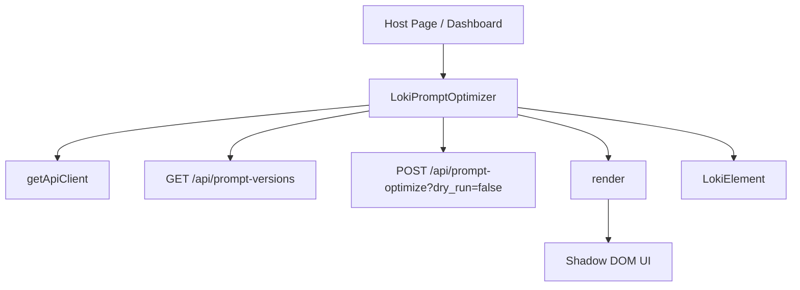

# prompt_optimizer 模块深度解析

`prompt_optimizer`（实现为 `LokiPromptOptimizer`）本质上是一个“控制塔面板”：它不负责做提示词优化算法本身，而是把后端优化系统的状态拉到前台，让人能看到“现在是第几版、最近何时优化、改了什么、为什么改”，并且可以手动按下“立即优化”。如果没有这个模块，优化行为会像在黑箱里发生：后端也许在持续学习，但工程师和运营同学无法快速判断是否真的在收敛、何时退化、以及某次改动是否有依据。

## 为什么这个模块存在：它解决了什么问题

在 Prompt 驱动系统里，优化过程通常是异步、跨服务、低可见性的。一个朴素方案是“只给后端接口，不做前端态可视化”，但这会带来三个实际问题。第一，**不可观测**：你看不到版本与时间线，只能靠日志或数据库排查。第二，**不可解释**：优化变更如果没有展示 rationale，团队无法评估策略是否合理。第三，**不可控**：没有手动触发入口时，调试要靠脚本或运维命令，不利于日常操作。

`LokiPromptOptimizer` 的设计意图是：用一个轻量 Web Component，把“读取状态 + 触发动作 + 展示原因”收敛在同一块 UI 中，降低协作成本。它像一个电梯里的状态面板：你不需要知道电机怎么控制，只需要知道当前楼层、最近运行情况，并在需要时按按钮发起动作。

## 心智模型：把它当成“轮询型状态投影器”

理解这个模块最好的方式，是把它看作一个 **轮询型状态投影器（Polling State Projector）**。

它内部维护一小组状态（`_data`, `_error`, `_loading`, `_optimizing` 等），然后周期性调用后端接口，把远端状态“投影”为本地 UI。用户交互（点击 `Optimize Now`、展开某条 change）不是直接操作 DOM 细节，而是改变这些状态，再由 `render()` 统一重绘。

这种模型的关键优点是简单和稳健：状态源头集中，渲染路径单一；代价是它不是事件流驱动（比如 WebSocket push），实时性上限由轮询周期决定。

## 架构与数据流



组件在架构上是 UI 层的边界适配器：向上对宿主页面暴露 `<loki-prompt-optimizer>`，向下依赖 API 与主题基类。

端到端数据流分两条主路径。**读取路径**是：`connectedCallback()` 调用 `_setupApi()` 初始化客户端，然后 `_loadData()` 发起 `GET /api/prompt-versions`，成功写入 `_data`，失败写入 `_error`，最后统一 `render()`。此外 `_startPolling()` 每 60 秒重复执行 `_loadData()`，维持状态新鲜度。**写入路径**是：用户点击按钮触发 `_triggerOptimize()`，先用 `_optimizing` 做并发闸门，再请求 `POST /api/prompt-optimize?dry_run=false`，成功后调用 `_loadData()` 回读最新状态，最终重绘。

这个模块最“热”的调用路径是 `_loadData() -> render()`，因为首屏加载和每次轮询都走这条链路；其次是 `render()` 内部事件重绑，因为它每次都重建 `shadowRoot.innerHTML`。

## 组件深潜：`LokiPromptOptimizer` 的设计意图与内部机制

`LokiPromptOptimizer` 继承 `LokiElement`，这不是简单复用样式，而是明确把主题能力（例如 `theme` 属性变化时 `_applyTheme()`）委托给统一基类，避免每个组件重复实现主题系统。它声明 `observedAttributes` 为 `['api-url', 'theme']`，意味着运行期可通过属性驱动后端地址切换和主题切换。

构造函数里那组私有状态很值得注意。`_loading` 只在初次加载用于主 loading 态；后续轮询不会再把它置回 `true`，这是一个产品体验选择：避免卡片每分钟闪烁“Loading”。`_optimizing` 则是操作互斥锁，防止连续点击触发并发优化请求。`_expandedChanges` 用 `Set` 存索引，表达“某些行展开”的 UI 局部状态，读写 O(1)，也便于重绘后恢复展开态。

`_loadData()` 和 `_triggerOptimize()` 这两个异步方法构成模块核心协议。前者假设后端提供 `/api/prompt-versions`，并返回包含 `version`, `last_optimized`, `failures_analyzed`, `changes` 的对象（代码里也做了空值兜底）；后者假设后端接受 `POST /api/prompt-optimize?dry_run=false`，且前端不依赖返回体细节，只要请求成功就重新拉取。这个“写后读”的策略牺牲一点请求次数，换取更强的一致性：UI 始终以服务端事实为准，而不是依赖本地猜测。

`render()` 采用全量 innerHTML 重建。设计上它追求可读性和确定性：同一状态必然生成同一 DOM，不用维护复杂的增量 patch。对应地，事件监听器必须在每次渲染末尾重新绑定（按钮点击、change 展开），这是这种模式的隐性成本。

## 依赖分析：它调用谁、谁依赖它、契约是什么

从代码可验证的直接依赖只有两个：`LokiElement` 与 `getApiClient`。前者提供 Web Component 基础能力与主题基底；后者提供 `_get`/`_post` 通信能力，并通过 `baseUrl` 定位后端。

在系统中的上游依赖（谁“调用”它）是宿主 UI 页面/容器，以自定义元素方式挂载：`<loki-prompt-optimizer ...>`. 结合模块树，它属于 [Memory and Learning Components](Memory and Learning Components.md) 下面的 `prompt_optimizer` 子模块，通常和 [memory_browser_component](memory_browser_component.md)、[learning_dashboard_component](learning_dashboard_component.md) 一起构成“观察-学习-优化”闭环视图。

数据契约方面，有几个隐式前提要明确。第一，请求失败对象应有 `message` 字段，因为代码直接读取 `err.message`。第二，`changes` 应是数组，数组项推荐包含 `description` 或 `title`，以及 `rationale` 或 `reasoning`。第三，`last_optimized` 应可被 `new Date(...)` 解析，否则时间展示可能退化。

## 关键设计取舍与原因

这个模块明显偏向“简单可维护”而不是“高抽象高性能”。例如轮询而非事件推送：轮询实现和运维成本低，后端也无需维护长连接；代价是最多 60 秒可见性延迟。又如全量重绘而非虚拟 DOM diff：代码短、排错直接；代价是频繁重建 DOM 与重复绑定监听。再如本地状态内聚而非接入全局 store：组件可独立复用，嵌入成本低；代价是跨组件一致性与共享缓存能力有限。

还有一个微妙取舍是 `api-url` 变化时直接改 `this._api.baseUrl`。这让运行时切环境非常直接，但也意味着组件假设 API 客户端对象可变且这样修改是安全的；如果 `getApiClient` 背后是共享实例，这个动作可能影响其他组件（需结合 `loki-api-client` 实现确认）。

## 使用与实践建议

最小用法：

```html
<loki-prompt-optimizer api-url="http://localhost:57374"></loki-prompt-optimizer>
```

如需主题联动：

```html
<loki-prompt-optimizer theme="dark"></loki-prompt-optimizer>
```

如果在运维页面中并排展示，推荐与 memory/learning 相关组件放在同一上下文区域，避免“看到优化结果但看不到上游信号”的割裂。

## 新贡献者最该注意的坑

第一，`_formatTime()` 使用 `try/catch` 包裹 `new Date(timestamp)`，但 `Invalid Date` 往往不会抛异常；因此非法时间戳可能产生不理想文案。第二，轮询在 `disconnectedCallback()` 会停止，但已发出的请求不会被取消；如果未来加长请求链路，可考虑 `AbortController`。第三，当前错误态在 `_error && !_data` 时展示的是通用“无数据”文案，不显示具体错误，排障信息较少。第四，`render()` 全量替换 DOM 后必须重新绑定监听，新增交互时容易遗漏。第五，`_triggerOptimize()` 把 `dry_run=false` 写死，任何“试运行优化”需求都需要改动接口调用参数。

## 参考链接

- [Memory and Learning Components](Memory and Learning Components.md)
- [Dashboard UI Components](Dashboard UI Components.md)
- [Core Theme](Core Theme.md)
- [memory_browser_component](memory_browser_component.md)
- [learning_dashboard_component](learning_dashboard_component.md)
