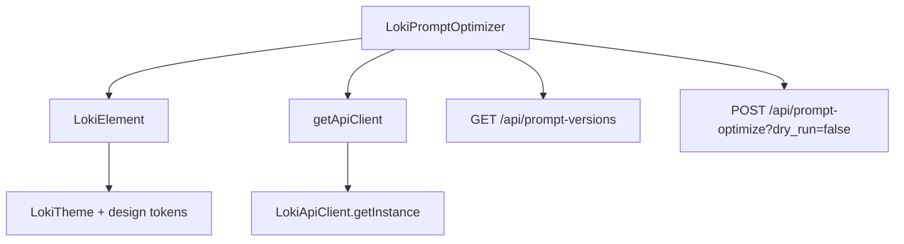
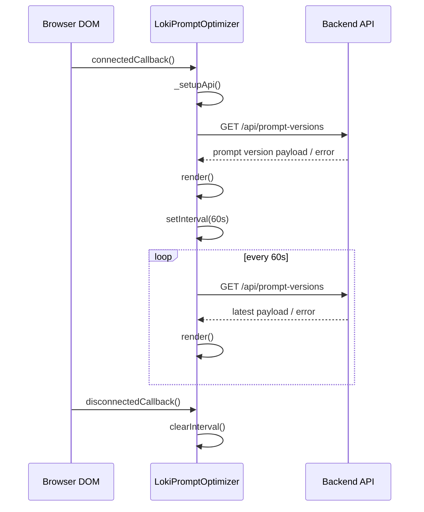
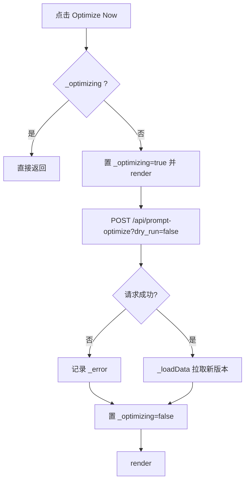

# prompt_optimizer_component 模块文档

## 1. 模块简介与设计目标

`prompt_optimizer_component` 对应的核心实现是 `dashboard-ui/components/loki-prompt-optimizer.js` 中的 `LokiPromptOptimizer` Web Component。它的职责是把“提示词优化（Prompt Optimization）”这件通常发生在后端/策略层的事情，转化成可观察、可触发、可解释的前端卡片式 UI。组件会展示当前 Prompt 版本、最近优化时间、已分析失败次数，以及每次优化产生的变更及其 rationale（原因说明），并支持用户手动触发一次优化。

从产品与工程视角看，这个组件存在的意义是：在“Memory and Learning Components”子域中补齐“学习结果 -> Prompt 改进 -> 可视化反馈”的闭环。`LokiMemoryBrowser` 偏向记忆内容检索与浏览，`LokiLearningDashboard` 偏向学习信号统计与趋势，而 `LokiPromptOptimizer` 更聚焦“最终落地动作”，即 Prompt 是否更新、为什么更新、何时更新。

该组件采用轻量实现：不依赖复杂状态管理库，不维护外部 store，而是通过组件内部状态 + 定时轮询（60s）与后端 `api/prompt-versions`、`api/prompt-optimize` 交互。这样做的好处是可嵌入性强、接入成本低，但代价是数据一致性主要依赖轮询与本地状态，不具备事件流驱动（如 WebSocket）那样的实时性与全局一致性。

---

## 2. 核心组件与职责分解

### 2.1 `LokiPromptOptimizer` 类

`LokiPromptOptimizer` 继承自 `LokiElement`（参考：[Core Theme.md](Core%20Theme.md)），因此天然具备主题切换、基础样式 token 注入、Shadow DOM 封装等能力。它通过 `customElements.define('loki-prompt-optimizer', LokiPromptOptimizer)` 注册为自定义元素，可直接在 HTML 中使用。

组件内部关键状态如下：

- `_data`：后端返回的提示词优化数据对象。
- `_error`：错误信息字符串。
- `_loading`：初次加载标记。
- `_optimizing`：手动优化中的标记，用于禁用按钮与显示 spinner。
- `_api`：由 `getApiClient` 返回的 API 客户端实例。
- `_pollInterval`：轮询定时器句柄。
- `_expandedChanges`：`Set<number>`，记录哪些变更项被展开查看 rationale。

这个状态设计体现了“单组件自闭环”思路：读取、渲染、交互都在本类中完成，没有拆分为 presenter/service 子层。

### 2.2 生命周期方法

#### `static get observedAttributes()`

声明监听属性：`api-url`、`theme`。当属性变化时会触发 `attributeChangedCallback`。

#### `connectedCallback()`

组件挂载后执行三件事：

1. `_setupApi()`：初始化 API 客户端。
2. `_loadData()`：立即拉取一次数据。
3. `_startPolling()`：启动 60 秒轮询。

#### `disconnectedCallback()`

组件卸载时调用 `_stopPolling()` 清理定时器，避免内存泄漏和后台无效请求。

#### `attributeChangedCallback(name, oldValue, newValue)`

- 当 `api-url` 变化且 `_api` 已初始化：更新 `this._api.baseUrl` 并重新加载数据。
- 当 `theme` 变化：调用 `_applyTheme()` 应用主题。

> 注意：`api-url` 在 `_api` 尚未初始化前变化不会触发重新加载，这个行为依赖后续 `connectedCallback()` 的初始化流程。

---

## 3. 内部工作机制详解

### 3.1 API 初始化与通信

#### `_setupApi()`

- 输入：无（读取元素属性）
- 行为：从 `api-url` 属性取 base URL；若未设置，回退到 `window.location.origin`。
- 输出/副作用：设置 `this._api = getApiClient({ baseUrl })`。

`getApiClient` 本身是 `LokiApiClient.getInstance(config)` 的包装，因此可能是单例语义。若全局使用同一实例，动态修改 `baseUrl` 可能影响到共享客户端的其他调用方，这在多组件共存场景中需要特别留意。

#### `_loadData()`

- 请求：`GET /api/prompt-versions`（通过 `_api._get`）
- 成功：写入 `_data`，清空 `_error`
- 失败：写入 `_error = err.message`，清空 `_data`
- 最终：`_loading = false`，调用 `render()`

该方法没有在每次调用前把 `_loading` 重新置为 `true`，所以“加载中”视觉状态只在首轮加载期间显示。轮询刷新和手动刷新时不会显示主 loading，占位体验更平滑，但用户无法直观看到刷新进行中。

#### `_triggerOptimize()`

- 防抖/并发保护：如果 `_optimizing` 为真直接返回。
- 请求：`POST /api/prompt-optimize?dry_run=false`，请求体 `{}`。
- 成功：完成后执行 `_loadData()` 拉新状态。
- 失败：记录 `_error`。
- 最终：重置 `_optimizing=false` 并 `render()`。

这里 `dry_run=false` 被硬编码，意味着组件始终触发“真实优化”，不支持 UI 层面试运行。

### 3.2 轮询策略

#### `_startPolling()` / `_stopPolling()`

- `_startPolling()`：`setInterval(() => this._loadData(), 60000)`
- `_stopPolling()`：存在句柄则 `clearInterval`

这是典型 pull 模式。优点是后端实现简单、前端不需要维护长连接；缺点是状态可能最多延迟 60 秒。

### 3.3 工具函数

#### `_escapeHtml(str)`

对字符串进行 `& < > "` 转义，防止插值到 `innerHTML` 时引入 XSS 风险。

#### `_formatTime(timestamp)`

将时间格式化为相对时间：`Just now` / `Xm ago` / `Xh ago` / `Xd ago`。当为空返回 `--`。

> 行为注意：若传入非法日期字符串，`new Date(timestamp)` 不抛异常，会产生 `Invalid Date`，当前实现可能输出 `NaNd ago`，这属于边界缺陷。

#### `_toggleChange(index)`

基于 `_expandedChanges` 集合切换某一条变更的展开/收起状态，然后触发重新渲染。

---

## 4. 渲染结构与交互流程

组件采用“每次渲染重建整个 `shadowRoot.innerHTML`”策略。优点是实现简单、状态可控；代价是每次都要重新绑定事件监听、重建 DOM。

### 4.1 渲染分支

`render()` 根据状态有三种主分支：

1. `_loading=true`：显示 loading spinner。
2. `_error && !_data`：显示无数据空态。
3. 正常态：显示标题、优化按钮、信息网格、变更列表。

### 4.2 信息网格数据映射

默认读取响应字段：

- `version`
- `last_optimized`
- `failures_analyzed`
- `changes[]`

并设定兜底值（如 `--`、空数组）。

### 4.3 变更项展开

每个变更项头部按钮带有 `data-index`。点击后调用 `_toggleChange(index)`，在列表项下显示 `rationale`（或 `reasoning` 兜底字段）。

---

## 5. 架构与数据流（Mermaid）

### 5.1 组件依赖架构图



该图说明：`LokiPromptOptimizer` 在 UI 层依赖主题基类 `LokiElement`，在数据层依赖 API 客户端，并通过两个后端接口完成“读取状态+触发优化”闭环。

### 5.2 生命周期与轮询流程图



该流程强调了组件是“被动刷新 + 周期轮询”模型，没有订阅式推送链路。

### 5.3 手动优化交互流程图



这里的关键是 `_optimizing` 充当了互斥锁，避免重复点击产生并发请求。

---

## 6. 对外使用方式

### 6.1 基础用法

```html
<loki-prompt-optimizer api-url="http://localhost:57374"></loki-prompt-optimizer>
```

如果不传 `api-url`，组件会使用当前页面源（`window.location.origin`）。

### 6.2 主题切换

组件继承 `LokiElement` 的主题机制，可通过属性或全局事件切换。

```html
<loki-prompt-optimizer theme="dark"></loki-prompt-optimizer>
```

`theme` 变化会触发 `_applyTheme()`，立即更新 CSS token。

### 6.3 推荐嵌入场景

该组件通常与以下模块并列展示：

- [memory_browser_component.md](memory_browser_component.md)
- [learning_dashboard_component.md](learning_dashboard_component.md)

三者合用可以形成“记忆数据 -> 学习信号 -> Prompt 改进”的完整运维视图。

---

## 7. API 数据契约（基于实现推断）

### 7.1 `GET /api/prompt-versions` 返回结构

```json
{
  "version": 12,
  "last_optimized": "2026-02-20T10:00:00Z",
  "failures_analyzed": 37,
  "changes": [
    {
      "description": "Add explicit retry strategy",
      "rationale": "Frequent transient tool failures require guided recovery"
    }
  ]
}
```

组件对字段名存在兜底兼容：

- 变更标题：`description` 或 `title`
- 变更说明：`rationale` 或 `reasoning`

### 7.2 `POST /api/prompt-optimize?dry_run=false`

请求体固定 `{}`。组件不消费返回体，仅以请求是否成功作为状态判断，然后重新拉取版本数据。

---

## 8. 扩展与二次开发建议

如果要扩展该组件，建议优先保持当前“状态集中、渲染单点”模式，避免演进成分散的隐式状态。

常见扩展方向：

1. 增加 `poll-interval` 属性，把 60s 改为可配置。
2. 支持 `dry-run` 属性，允许试运行优化。
3. 在错误态展示具体错误信息（当前只显示“无数据”）。
4. 改造为增量渲染，减少 `innerHTML` 全量重建成本。
5. 将 `_formatTime` 改为健壮实现，处理 `Invalid Date`。

示例：增加轮询间隔属性（伪代码）

```javascript
static get observedAttributes() {
  return ['api-url', 'theme', 'poll-interval'];
}

_startPolling() {
  const ms = Number(this.getAttribute('poll-interval') || 60000);
  const interval = Number.isFinite(ms) && ms >= 5000 ? ms : 60000;
  this._pollInterval = setInterval(() => this._loadData(), interval);
}
```

---

## 9. 方法级行为参考（面向维护者）

为了便于后续维护和重构，这里把 `LokiPromptOptimizer` 的关键方法再用“输入、输出、副作用”视角做一次聚合说明。由于该组件是自渲染 Web Component，绝大多数方法都没有显式返回值，它们真正的输出体现在内部状态变化和 DOM 重新渲染。

`connectedCallback()` 没有参数，也不返回数据，但它会触发组件完整启动过程：创建 API 客户端、拉取首屏数据、启动轮询。它的副作用是注册定时任务并触发一次网络请求。`disconnectedCallback()` 对应地负责撤销这些长期副作用，核心是停止轮询，避免组件脱离页面后继续请求。

`attributeChangedCallback(name, oldValue, newValue)` 的输入是标准 Custom Element 属性变更三元组。该方法只处理 `api-url` 与 `theme`。当 `api-url` 变化时，它会更新客户端 base URL 并立即拉取新数据；当 `theme` 变化时，它只做视觉层更新。这个方法不直接返回值，但会间接触发网络 I/O 与重绘。

`_loadData()` 是读取链路核心。输入为空，输出是对 `_data`、`_error`、`_loading` 的一致性更新。成功时 `_data` 有值且 `_error` 清空；失败时 `_data` 清空且 `_error` 写入。无论成功失败都会结束 loading 并调用 `render()`。其副作用包括向 `/api/prompt-versions` 发起请求和替换 Shadow DOM 内容。

`_triggerOptimize()` 是写入链路核心。它先检查 `_optimizing` 作为并发保护，再调用 `/api/prompt-optimize?dry_run=false`。成功后会串联 `_loadData()` 做状态回读，失败则只更新 `_error`。方法同样没有返回值；其最重要的副作用是触发一次真实优化任务，并在执行期间改变按钮可用性。

`render()` 是最终 UI 汇聚点。它根据 `_loading`、`_error`、`_data`、`_optimizing`、`_expandedChanges` 生成 DOM，并在每次重绘后重新绑定点击事件。由于采用 `innerHTML` 全量替换，旧节点上的监听器会被垃圾回收，这也是为什么监听绑定必须出现在 `render()` 末尾。

---

## 10. 边界条件、错误处理与已知限制

该组件实现非常直接，这有利于可维护性，但也意味着若直接用于复杂生产环境，需要理解它在边界条件下的行为特征。首先，`_formatTime` 的异常处理依赖 `try/catch`，而 `new Date(invalid)` 在 JavaScript 中通常不会抛错，而是返回 `Invalid Date`，这会导致时间差计算出现 `NaN`，最终可能在 UI 上看到类似 `NaNd ago` 的异常文本。其次，组件对大多数字段都使用了 `_escapeHtml`，但 `failuresAnalyzed` 在模板里是直接插值，如果后端契约被破坏并返回字符串型恶意内容，理论上会形成展示风险，因此建议在该字段渲染前也统一做字符串化与转义。

错误可观测性方面，当前逻辑在 `_error && !_data` 时展示的是通用空态文案，而不是具体错误原因。这种设计可以避免暴露过多后端信息，但会显著增加排障成本，尤其是在多租户或跨环境部署时。另一个需要注意的点是 API 客户端实例可能具有单例语义（取决于 `getApiClient` 的实现），组件在 `api-url` 属性变化时会直接改写 `baseUrl`，如果该客户端实例被其他组件共享，就可能造成“一个组件改地址，全局都受影响”的副作用。最后，轮询模型天然存在时效性上限，最坏情况下数据会滞后一个轮询周期（60 秒），并且当前实现没有请求取消机制：组件卸载时只会清理定时器，不能中止已经发出的请求。因此在高实时或高并发场景中，建议配合事件流推送、请求 abort 或集中式数据层做进一步增强。

---

## 11. 与系统其他模块的关系

在 Dashboard UI 体系中，该模块位于 `Memory and Learning Components` 子树，定位是“学习闭环最后一公里”。它与后端的学习采集、记忆系统、策略调整逻辑在职责上解耦，仅通过 API 合同交互，属于典型的“展示与触发控制面板”组件。

若你需要理解更上游的数据来源和学习信号计算过程，建议结合阅读：

- [Memory and Learning Components.md](Memory%20and%20Learning%20Components.md)
- [Memory System.md](Memory%20System.md)
- [API Server & Services.md](API%20Server%20%26%20Services.md)

这些文档分别覆盖前端组件域划分、内存系统实现以及 API 服务运行机制。
