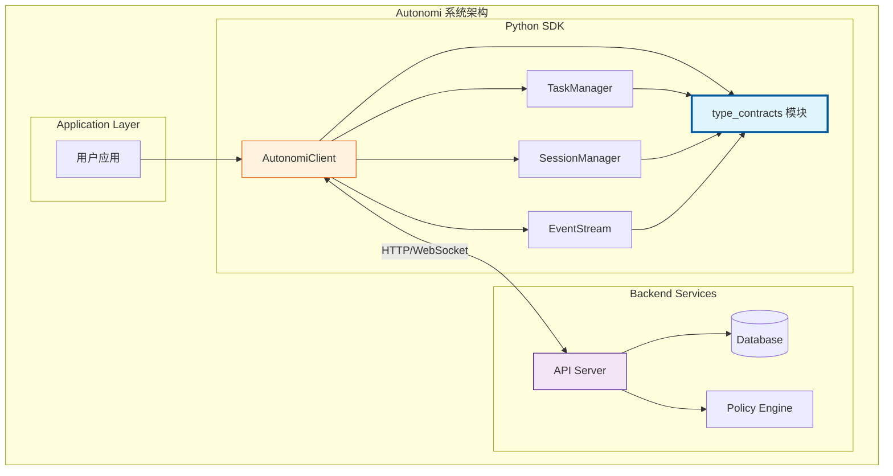
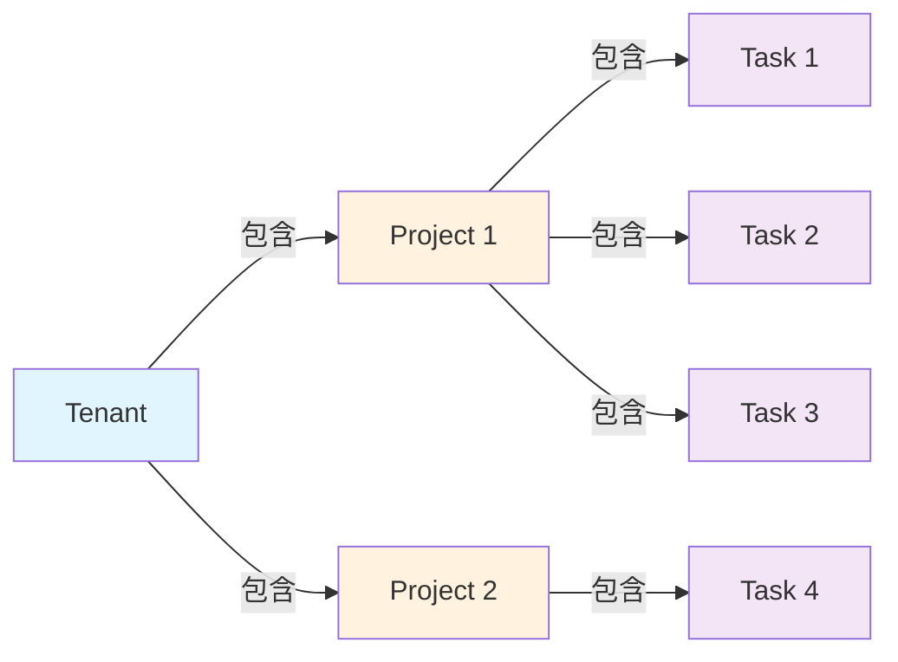
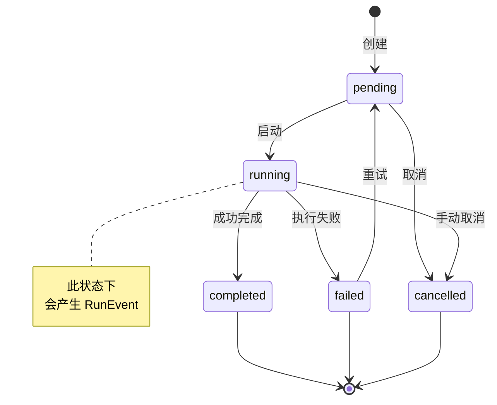
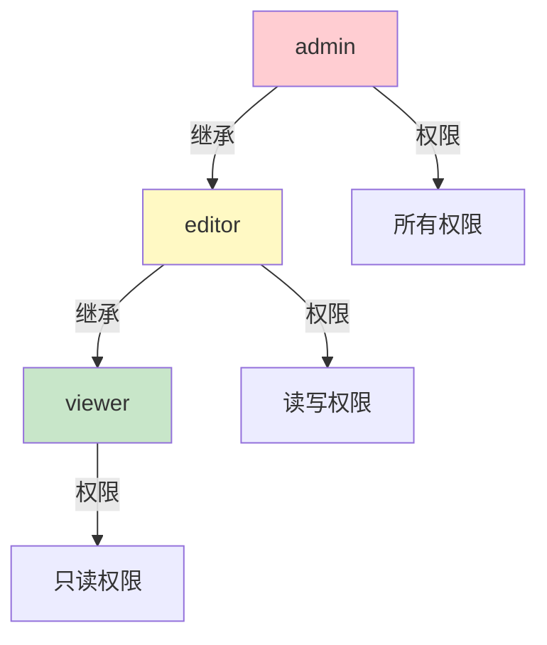

# Python SDK Type Contracts 模块文档

## 1. 模块概述

### 1.1 模块定位与设计目标

`type_contracts` 模块是 Autonomi Python SDK 的核心基础层，定义了 SDK 与后端服务之间所有数据交换的类型契约。该模块位于 `sdk/python/loki_mode_sdk/types.py`，提供了七种核心数据类（dataclass），构成了整个 SDK 类型系统的基石。

该模块存在的根本原因是为了解决分布式系统中客户端与服务端之间的**数据结构一致性**问题。在 Autonomi 的多租户、多项目、多任务架构中，所有 API 请求和响应都需要遵循严格的数据格式规范。`type_contracts` 模块通过 Python 的 `dataclass` 机制，提供了：

1. **类型安全性**：在编译时（通过类型检查工具如 mypy）捕获数据结构错误
2. **序列化标准化**：统一的 `from_dict` 方法确保 JSON 数据到 Python 对象的可靠转换
3. **文档自描述**：每个字段的类型注解和默认值清晰表达了数据模型的语义
4. **向后兼容性**：通过可选字段和默认值设计，支持 API 的渐进式演进

### 1.2 核心设计原则

模块设计遵循以下关键原则：

**不可变语义优先**：所有数据类使用 `dataclass` 定义，虽然 Python 的 dataclass 默认是可变的，但语义上这些对象代表的是从服务端获取的快照数据，不应在客户端被随意修改。任何状态变更都应通过 API 调用完成。

**宽松解析，严格输出**：`from_dict` 方法对输入数据采用宽松策略（使用 `.get()` 提供默认值），但对必填字段（如 `id`、`name`）保持严格要求。这种设计确保客户端能够容忍服务端新增字段或可选字段的缺失。

**时间戳字符串化**：所有时间字段使用 `Optional[str]` 类型而非 `datetime` 对象，这是因为：
- ISO 8601 字符串在 JSON 序列化中无损耗
- 避免时区处理的复杂性（由应用层决定如何解析）
- 与后端 API 保持格式一致性

**嵌套结构扁平化**：除 `Run.config` 和 `RunEvent.details` 使用 `Dict[str, Any]` 存储动态配置外，其他字段均为标量类型。这种设计简化了类型系统，同时保留了扩展性。

### 1.3 模块在系统中的位置



如上图所示，`type_contracts` 模块处于 SDK 的核心位置：
- **向上**：被 `AutonomiClient`、`TaskManager`、`SessionManager`、`EventStream` 等所有高层组件依赖
- **向下**：与后端 API Server 的数据模型保持一一对应
- **横向**：与 TypeScript SDK 的类型定义保持语义一致（参考 [TypeScript SDK Type Contracts](typescript_sdk_type_contracts.md)）

### 1.4 与 Dashboard 后端模型的对应关系

本模块的类型定义与 Dashboard 后端的模型存在直接映射关系：

| Python SDK 类型 | Dashboard 后端模型 | 说明 |
|----------------|-------------------|------|
| `Tenant` | `dashboard.models.Tenant` | 租户/组织实体 |
| `Project` | `dashboard.models.Project` | 项目实体 |
| `Task` | `dashboard.models.Task` | 任务实体 |
| `Run` | `dashboard.models.Run` | 执行运行实体 |
| `RunEvent` | `dashboard.models.RunEvent` | 运行事件实体 |
| `ApiKey` | `dashboard.api_keys.ApiKeyResponse` | API 密钥实体 |
| `AuditEntry` | `sdk.python.loki_mode_sdk.types.AuditEntry` | 审计日志条目 |

这种对应关系确保了 SDK 返回的数据可以直接用于 Dashboard 前端展示，无需额外的数据转换层。

---

## 2. 核心类型详解

### 2.1 Tenant（租户）

#### 2.1.1 类型定义

```python
@dataclass
class Tenant:
    """Represents a tenant (organization)."""

    id: str
    name: str
    slug: Optional[str] = None
    description: Optional[str] = None
    created_at: Optional[str] = None
```

#### 2.1.2 字段说明

| 字段 | 类型 | 必填 | 默认值 | 说明 |
|------|------|------|--------|------|
| `id` | `str` | 是 | - | 租户的唯一标识符，通常为 UUID 格式 |
| `name` | `str` | 是 | - | 租户的显示名称，用于 UI 展示 |
| `slug` | `Optional[str]` | 否 | `None` | URL 友好的标识符，用于路由和 API 路径 |
| `description` | `Optional[str]` | 否 | `None` | 租户的描述信息 |
| `created_at` | `Optional[str]` | 否 | `None` | 创建时间，ISO 8601 格式字符串 |

#### 2.1.3 使用示例

```python
from loki_mode_sdk.types import Tenant

# 从 API 响应创建 Tenant 对象
tenant_data = {
    "id": "tenant-123",
    "name": "Acme Corporation",
    "slug": "acme-corp",
    "description": "Leading provider of widgets",
    "created_at": "2024-01-15T10:30:00Z"
}

tenant = Tenant.from_dict(tenant_data)
print(f"租户：{tenant.name} ({tenant.slug})")

# 访问可选字段（需要空值检查）
if tenant.description:
    print(f"描述：{tenant.description}")
```

#### 2.1.4 设计考量

**Slug 字段的用途**：`slug` 字段是可选的，但在多租户系统中非常重要。它用于：
- 构建租户隔离的 URL 路径（如 `/tenants/{slug}/projects`）
- 在日志和监控中标识租户（比 UUID 更易读）
- 支持租户别名和重命名场景

**时间戳的可选性**：`created_at` 为可选字段，这是为了向后兼容。旧版本的 API 可能不包含此字段，新版本的 SDK 仍能正常解析。

---

### 2.2 Project（项目）

#### 2.2.1 类型定义

```python
@dataclass
class Project:
    """Represents a project in the control plane."""

    id: str
    name: str
    description: Optional[str] = None
    status: str = "active"
    tenant_id: Optional[str] = None
    created_at: Optional[str] = None
    updated_at: Optional[str] = None
```

#### 2.2.2 字段说明

| 字段 | 类型 | 必填 | 默认值 | 说明 |
|------|------|------|--------|------|
| `id` | `str` | 是 | - | 项目的唯一标识符 |
| `name` | `str` | 是 | - | 项目名称 |
| `description` | `Optional[str]` | 否 | `None` | 项目描述 |
| `status` | `str` | 否 | `"active"` | 项目状态，常见值：`active`、`archived`、`suspended` |
| `tenant_id` | `Optional[str]` | 否 | `None` | 所属租户 ID，用于多租户隔离 |
| `created_at` | `Optional[str]` | 否 | `None` | 创建时间 |
| `updated_at` | `Optional[str]` | 否 | `None` | 最后更新时间 |

#### 2.2.3 状态枚举值

虽然 `status` 字段在类型上定义为 `str`，但实际使用中应遵循以下约定值：

| 状态值 | 说明 | 允许的操作 |
|--------|------|-----------|
| `active` | 正常活跃状态 | 所有操作 |
| `archived` | 已归档，只读 | 查看、导出 |
| `suspended` | 已暂停 | 查看、恢复 |
| `deleted` | 软删除状态 | 查看、恢复（限期内） |

#### 2.2.4 使用示例

```python
from loki_mode_sdk.types import Project

# 创建项目对象
project = Project(
    id="proj-456",
    name="Q4 Marketing Campaign",
    description="Automated content generation for Q4",
    status="active",
    tenant_id="tenant-123"
)

# 从字典解析（API 响应）
project_data = {
    "id": "proj-789",
    "name": "Legacy Project",
    "status": "archived"
    # description, tenant_id, timestamps 缺失，使用默认值
}
project_from_api = Project.from_dict(project_data)
print(f"项目状态：{project_from_api.status}")  # 输出：archived
```

#### 2.2.5 与 Task 的关系

`Project` 是 `Task` 的容器，一个项目可以包含多个任务。这种层级关系通过 `Task.project_id` 字段建立：



---

### 2.3 Task（任务）

#### 2.3.1 类型定义

```python
@dataclass
class Task:
    """Represents a task within a project."""

    id: str
    project_id: str
    title: str
    description: Optional[str] = None
    status: str = "pending"
    priority: str = "medium"
    assigned_agent_id: Optional[str] = None
    created_at: Optional[str] = None
```

#### 2.3.2 字段说明

| 字段 | 类型 | 必填 | 默认值 | 说明 |
|------|------|------|--------|------|
| `id` | `str` | 是 | - | 任务的唯一标识符 |
| `project_id` | `str` | 是 | `""` | 所属项目 ID |
| `title` | `str` | 是 | `""` | 任务标题 |
| `description` | `Optional[str]` | 否 | `None` | 任务详细描述 |
| `status` | `str` | 否 | `"pending"` | 任务状态 |
| `priority` | `str` | 否 | `"medium"` | 任务优先级 |
| `assigned_agent_id` | `Optional[str]` | 否 | `None` | 分配的 Agent ID |
| `created_at` | `Optional[str]` | 否 | `None` | 创建时间 |

#### 2.3.3 状态和优先级枚举

**任务状态（status）**：

| 状态值 | 说明 | 转换路径 |
|--------|------|---------|
| `pending` | 待处理，等待分配 | → `in_progress` |
| `in_progress` | 执行中 | → `completed` / `blocked` / `failed` |
| `completed` | 已完成 | 终态 |
| `blocked` | 被阻塞，需要外部干预 | → `in_progress` |
| `failed` | 执行失败 | → `pending`（重试） |
| `cancelled` | 已取消 | 终态 |

**任务优先级（priority）**：

| 优先级 | 数值映射 | 调度权重 |
|--------|---------|---------|
| `critical` | 4 | 最高 |
| `high` | 3 | 高 |
| `medium` | 2 | 中（默认） |
| `low` | 1 | 低 |

#### 2.3.4 使用示例

```python
from loki_mode_sdk.types import Task

# 创建高优先级任务
task = Task(
    id="task-001",
    project_id="proj-456",
    title="Generate Q4 Report",
    description="Automated financial report generation",
    status="pending",
    priority="high",
    assigned_agent_id="agent-789"
)

# 状态转换示例
def transition_task_status(task: Task, new_status: str) -> bool:
    """验证并执行任务状态转换"""
    valid_transitions = {
        "pending": ["in_progress", "cancelled"],
        "in_progress": ["completed", "blocked", "failed"],
        "blocked": ["in_progress", "cancelled"],
        "failed": ["pending", "cancelled"],
    }
    
    if new_status in valid_transitions.get(task.status, []):
        # 实际应用中应通过 API 更新
        print(f"任务 {task.id} 状态从 {task.status} 转换为 {new_status}")
        return True
    return False

transition_task_status(task, "in_progress")  # 有效
transition_task_status(task, "completed")    # 无效（pending 不能直接到 completed）
```

#### 2.3.5 与 Swarm 系统的集成

`assigned_agent_id` 字段用于将任务分配给特定的 Agent。在 Swarm 多 Agent 系统中，这个字段与 [Swarm Multi-Agent](swarm_multi_agent.md) 模块的 `AgentInfo` 关联：

```python
# Task 与 Swarm Agent 的关联
task.assigned_agent_id <--> swarm.registry.AgentInfo.id
```

当任务被分配后，Swarm 系统会跟踪该 Agent 的性能指标，并可能根据表现动态调整任务分配策略。

---

### 2.4 Run（执行运行）

#### 2.4.1 类型定义

```python
@dataclass
class Run:
    """Represents an execution run."""

    id: str
    project_id: str
    status: str = "pending"
    trigger: Optional[str] = None
    config: Optional[Dict[str, Any]] = field(default_factory=dict)
    started_at: Optional[str] = None
    ended_at: Optional[str] = None
```

#### 2.4.2 字段说明

| 字段 | 类型 | 必填 | 默认值 | 说明 |
|------|------|------|--------|------|
| `id` | `str` | 是 | - | 运行的唯一标识符 |
| `project_id` | `str` | 是 | `""` | 所属项目 ID |
| `status` | `str` | 否 | `"pending"` | 运行状态 |
| `trigger` | `Optional[str]` | 否 | `None` | 触发源（如 `manual`、`schedule`、`webhook`） |
| `config` | `Optional[Dict[str, Any]]` | 否 | `{}` | 运行配置参数 |
| `started_at` | `Optional[str]` | 否 | `None` | 开始时间 |
| `ended_at` | `Optional[str]` | 否 | `None` | 结束时间 |

#### 2.4.3 运行状态生命周期



#### 2.4.4 触发源类型

| 触发源 | 说明 | 典型场景 |
|--------|------|---------|
| `manual` | 手动触发 | 用户通过 Dashboard 或 CLI 启动 |
| `schedule` | 定时触发 |  cron 表达式调度的周期性任务 |
| `webhook` | Webhook 触发 | 外部系统事件驱动 |
| `api` | API 触发 | 通过 SDK 或 REST API 调用 |
| `dependency` | 依赖触发 | 前置任务完成后自动触发 |

#### 2.4.5 配置参数示例

`config` 字段是一个灵活的字典，可以包含任意运行参数：

```python
run = Run(
    id="run-001",
    project_id="proj-456",
    status="running",
    trigger="manual",
    config={
        "model": "gpt-4",
        "temperature": 0.7,
        "max_tokens": 4096,
        "agent_count": 3,
        "consensus_threshold": 0.67,
        "memory_enabled": True,
        "audit_level": "full"
    }
)
```

#### 2.4.6 与 RunEvent 的关系

`Run` 和 `RunEvent` 是一对多关系。一个运行过程中会产生多个事件，记录执行的各个阶段：

```python
# Run 与 RunEvent 的关联
run.id <--> RunEvent.run_id
```

---

### 2.5 RunEvent（运行事件）

#### 2.5.1 类型定义

```python
@dataclass
class RunEvent:
    """Represents an event within a run."""

    id: str
    run_id: str
    event_type: str
    phase: Optional[str] = None
    details: Optional[Dict[str, Any]] = field(default_factory=dict)
    timestamp: Optional[str] = None
```

#### 2.5.2 字段说明

| 字段 | 类型 | 必填 | 默认值 | 说明 |
|------|------|------|--------|------|
| `id` | `str` | 是 | - | 事件的唯一标识符 |
| `run_id` | `str` | 是 | `""` | 所属运行 ID |
| `event_type` | `str` | 是 | `""` | 事件类型 |
| `phase` | `Optional[str]` | 否 | `None` | 执行阶段 |
| `details` | `Optional[Dict[str, Any]]` | 否 | `{}` | 事件详细数据 |
| `timestamp` | `Optional[str]` | 否 | `None` | 事件时间戳 |

#### 2.5.3 事件类型分类

**生命周期事件**：

| 事件类型 | 说明 | 典型 details 内容 |
|---------|------|-----------------|
| `run.started` | 运行开始 | `{"trigger": "manual"}` |
| `run.completed` | 运行完成 | `{"duration_seconds": 120}` |
| `run.failed` | 运行失败 | `{"error": "Timeout", "code": 504}` |
| `run.cancelled` | 运行取消 | `{"reason": "user_request"}` |

**任务事件**：

| 事件类型 | 说明 | 典型 details 内容 |
|---------|------|-----------------|
| `task.assigned` | 任务分配 | `{"task_id": "...", "agent_id": "..."}` |
| `task.started` | 任务开始执行 | `{"task_id": "..."}` |
| `task.completed` | 任务完成 | `{"task_id": "...", "result": {...}}` |
| `task.failed` | 任务失败 | `{"task_id": "...", "error": "..."}` |

**Agent 事件**：

| 事件类型 | 说明 | 典型 details 内容 |
|---------|------|-----------------|
| `agent.joined` | Agent 加入 | `{"agent_id": "...", "role": "..."}` |
| `agent.left` | Agent 离开 | `{"agent_id": "..."}` |
| `agent.proposal` | Agent 提出方案 | `{"agent_id": "...", "proposal_id": "..."}` |
| `agent.consensus` | 达成共识 | `{"agreement_score": 0.85}` |

**内存事件**：

| 事件类型 | 说明 | 典型 details 内容 |
|---------|------|-----------------|
| `memory.retrieved` | 内存检索 | `{"query": "...", "results_count": 5}` |
| `memory.stored` | 内存存储 | `{"episode_id": "..."}` |
| `memory.consolidated` | 内存整合 | `{"patterns_found": 3}` |

#### 2.5.4 执行阶段（phase）

`phase` 字段用于标识 RARV（Reason-Act-Reflect-Verify）执行模型的阶段：

| 阶段 | 说明 | 相关事件类型 |
|------|------|-------------|
| `reason` | 推理阶段 | `agent.proposal` |
| `act` | 执行阶段 | `task.started`, `task.completed` |
| `reflect` | 反思阶段 | `agent.reflection` |
| `verify` | 验证阶段 | `quality.gate_passed`, `quality.gate_failed` |

#### 2.5.5 使用示例

```python
from loki_mode_sdk.types import RunEvent

# 解析任务完成事件
event_data = {
    "id": "evt-001",
    "run_id": "run-123",
    "event_type": "task.completed",
    "phase": "act",
    "details": {
        "task_id": "task-456",
        "result": {
            "output": "Generated report content...",
            "tokens_used": 2048
        },
        "duration_ms": 5430
    },
    "timestamp": "2024-01-15T11:45:30Z"
}

event = RunEvent.from_dict(event_data)

# 根据事件类型处理
if event.event_type == "task.completed":
    task_result = event.details.get("result", {})
    print(f"任务输出：{task_result.get('output', '')[:100]}...")
elif event.event_type == "run.failed":
    error = event.details.get("error", "Unknown error")
    print(f"运行失败：{error}")
```

#### 2.5.6 与 EventStream 的集成

`RunEvent` 是 [EventStream](python_sdk.md) 中传输的主要数据类型：

```python
from loki_mode_sdk.events import EventStream
from loki_mode_sdk.types import RunEvent

async def process_events(run_id: str):
    stream = EventStream(run_id)
    async for event_data in stream:
        event = RunEvent.from_dict(event_data)
        await handle_event(event)
```

---

### 2.6 ApiKey（API 密钥）

#### 2.6.1 类型定义

```python
@dataclass
class ApiKey:
    """Represents an API key."""

    id: str
    name: str
    scopes: Optional[List[str]] = field(default_factory=list)
    role: str = "viewer"
    created_at: Optional[str] = None
    expires_at: Optional[str] = None
    last_used: Optional[str] = None
```

#### 2.6.2 字段说明

| 字段 | 类型 | 必填 | 默认值 | 说明 |
|------|------|------|--------|------|
| `id` | `str` | 是 | - | API 密钥的唯一标识符 |
| `name` | `str` | 是 | - | 密钥名称（用于识别用途） |
| `scopes` | `Optional[List[str]]` | 否 | `[]` | 权限范围列表 |
| `role` | `str` | 否 | `"viewer"` | 角色（`viewer`、`editor`、`admin`） |
| `created_at` | `Optional[str]` | 否 | `None` | 创建时间 |
| `expires_at` | `Optional[str]` | 否 | `None` | 过期时间 |
| `last_used` | `Optional[str]` | 否 | `None` | 最后使用时间 |

#### 2.6.3 权限范围（Scopes）

| Scope | 说明 | 适用角色 |
|-------|------|---------|
| `projects:read` | 读取项目 | viewer, editor, admin |
| `projects:write` | 创建/更新项目 | editor, admin |
| `tasks:read` | 读取任务 | viewer, editor, admin |
| `tasks:write` | 创建/更新任务 | editor, admin |
| `runs:read` | 读取运行记录 | viewer, editor, admin |
| `runs:execute` | 执行运行 | editor, admin |
| `memory:read` | 读取内存数据 | viewer, editor, admin |
| `memory:write` | 写入内存数据 | admin |
| `audit:read` | 读取审计日志 | admin |
| `keys:manage` | 管理 API 密钥 | admin |

#### 2.6.4 角色层级



#### 2.6.5 安全最佳实践

```python
from loki_mode_sdk.types import ApiKey
from datetime import datetime, timedelta

# 创建有时效性的 API 密钥
def create_temporary_api_key(name: str, days: int = 7) -> dict:
    """创建临时 API 密钥配置"""
    expires_at = datetime.utcnow() + timedelta(days=days)
    return {
        "id": "key-temp-001",
        "name": name,
        "scopes": ["projects:read", "tasks:read"],  # 最小权限原则
        "role": "viewer",
        "expires_at": expires_at.isoformat() + "Z"
    }

# 检查密钥是否过期
def is_api_key_valid(api_key: ApiKey) -> bool:
    if api_key.expires_at is None:
        return True  # 永不过期
    
    from datetime import datetime
    expires = datetime.fromisoformat(api_key.expires_at.replace("Z", "+00:00"))
    return datetime.utcnow() < expires
```

---

### 2.7 AuditEntry（审计日志条目）

#### 2.7.1 类型定义

```python
@dataclass
class AuditEntry:
    """Represents an audit log entry."""

    timestamp: str
    action: str
    resource_type: str
    resource_id: str
    user_id: Optional[str] = None
    success: bool = True
```

#### 2.7.2 字段说明

| 字段 | 类型 | 必填 | 默认值 | 说明 |
|------|------|------|--------|------|
| `timestamp` | `str` | 是 | - | 事件发生时间（ISO 8601） |
| `action` | `str` | 是 | - | 操作类型 |
| `resource_type` | `str` | 是 | `""` | 资源类型 |
| `resource_id` | `str` | 是 | `""` | 资源 ID |
| `user_id` | `Optional[str]` | 否 | `None` | 执行操作的用户 ID |
| `success` | `bool` | 否 | `True` | 操作是否成功 |

#### 2.7.3 操作类型约定

| 操作 | 说明 | 示例 |
|------|------|------|
| `create` | 创建资源 | `action=create, resource_type=project` |
| `read` | 读取资源 | `action=read, resource_type=task` |
| `update` | 更新资源 | `action=update, resource_type=run` |
| `delete` | 删除资源 | `action=delete, resource_type=api_key` |
| `execute` | 执行操作 | `action=execute, resource_type=run` |
| `login` | 用户登录 | `action=login, resource_type=user` |
| `logout` | 用户登出 | `action=logout, resource_type=user` |
| `rotate` | 轮换密钥 | `action=rotate, resource_type=api_key` |

#### 2.7.4 使用示例

```python
from loki_mode_sdk.types import AuditEntry

# 解析审计日志
audit_data = {
    "timestamp": "2024-01-15T12:00:00Z",
    "action": "update",
    "resource_type": "task",
    "resource_id": "task-789",
    "user_id": "user-123",
    "success": True
}

entry = AuditEntry.from_dict(audit_data)

# 审计日志查询和过滤
def filter_failed_operations(entries: list[AuditEntry]) -> list[AuditEntry]:
    """筛选失败的操作"""
    return [e for e in entries if not e.success]

def filter_by_resource_type(entries: list[AuditEntry], 
                            resource_type: str) -> list[AuditEntry]:
    """按资源类型筛选"""
    return [e for e in entries if e.resource_type == resource_type]
```

#### 2.7.5 与 Audit 模块的集成

`AuditEntry` 与 [Audit](audit.md) 模块紧密集成，用于：
- 安全合规审计
- 操作追溯
- 异常行为检测

---

## 3. 类型转换与序列化

### 3.1 from_dict 方法设计模式

所有类型都实现了 `from_dict` 类方法，用于从字典（通常是 JSON 解析结果）创建对象：

```python
@classmethod
def from_dict(cls, data: Dict[str, Any]) -> Project:
    return cls(
        id=data["id"],                    # 必填字段，直接访问
        name=data["name"],                # 必填字段，直接访问
        description=data.get("description"),  # 可选字段，使用 .get()
        status=data.get("status", "active"),  # 有默认值的可选字段
        tenant_id=data.get("tenant_id"),
        created_at=data.get("created_at"),
        updated_at=data.get("updated_at"),
    )
```

**设计要点**：

1. **必填字段**：使用 `data["field"]` 直接访问，缺失时会抛出 `KeyError`
2. **可选字段**：使用 `data.get("field")`，缺失时返回 `None`
3. **有默认值的字段**：使用 `data.get("field", default_value)`

### 3.2 序列化到字典

虽然模块没有提供 `to_dict` 方法，但可以使用 `dataclasses.asdict`：

```python
from dataclasses import asdict
from loki_mode_sdk.types import Task

task = Task(
    id="task-001",
    project_id="proj-456",
    title="Test Task"
)

# 序列化为字典
task_dict = asdict(task)

# 序列化为 JSON
import json
task_json = json.dumps(task_dict)
```

### 3.3 类型检查与验证

```python
from typing import get_type_hints
from loki_mode_sdk.types import Project

# 获取类型注解
hints = get_type_hints(Project)
print(hints)
# 输出：{'id': <class 'str'>, 'name': <class 'str'>, 
#        'description': typing.Optional[str], ...}

# 运行时类型验证（可选）
def validate_project(project: Project) -> bool:
    if not project.id:
        raise ValueError("Project ID is required")
    if not project.name:
        raise ValueError("Project name is required")
    if project.status not in ["active", "archived", "suspended", "deleted"]:
        raise ValueError(f"Invalid status: {project.status}")
    return True
```

---

## 4. 使用模式与最佳实践

### 4.1 与 AutonomiClient 配合使用

```python
from loki_mode_sdk.client import AutonomiClient
from loki_mode_sdk.types import Project, Task, Run

async def main():
    client = AutonomiClient(api_key="your-api-key")
    
    # 获取项目列表
    projects = await client.projects.list()
    for project in projects:
        print(f"项目：{project.name} ({project.status})")
    
    # 创建任务
    task = await client.tasks.create(
        project_id="proj-123",
        title="New Task",
        priority="high"
    )
    
    # 执行运行
    run = await client.runs.execute(
        project_id="proj-123",
        config={"model": "gpt-4"}
    )
    
    # 监听运行事件
    async for event in client.runs.stream_events(run.id):
        print(f"事件：{event.event_type} - {event.phase}")
```

### 4.2 错误处理模式

```python
from loki_mode_sdk.client import AutonomiClient
from loki_mode_sdk.types import Task
from loki_mode_sdk.exceptions import APIError, NotFoundError

async def safe_task_operation(client: AutonomiClient, task_id: str):
    try:
        task = await client.tasks.get(task_id)
        return task
    except NotFoundError:
        print(f"任务 {task_id} 不存在")
        return None
    except APIError as e:
        print(f"API 错误：{e.status_code} - {e.message}")
        return None
    except KeyError as e:
        print(f"数据格式错误，缺少字段：{e}")
        return None
```

### 4.3 批量操作模式

```python
from loki_mode_sdk.types import Task
from typing import List

def process_tasks_batch(tasks_data: List[dict]) -> List[Task]:
    """批量解析任务数据"""
    tasks = []
    for data in tasks_data:
        try:
            task = Task.from_dict(data)
            tasks.append(task)
        except KeyError as e:
            print(f"跳过无效数据：{e}")
            continue
    return tasks

# 使用示例
tasks = process_tasks_batch(api_response["tasks"])
high_priority_tasks = [t for t in tasks if t.priority == "high"]
```

### 4.4 数据缓存模式

```python
from functools import lru_cache
from loki_mode_sdk.types import Project

class ProjectCache:
    def __init__(self, client):
        self.client = client
        self._cache = {}
    
    async def get_project(self, project_id: str) -> Project:
        if project_id not in self._cache:
            project = await self.client.projects.get(project_id)
            self._cache[project_id] = project
        return self._cache[project_id]
    
    def invalidate(self, project_id: str):
        if project_id in self._cache:
            del self._cache[project_id]
```

---

## 5. 边缘情况与注意事项

### 5.1 空值处理

所有 `Optional` 字段都可能为 `None`，访问前需要检查：

```python
# ❌ 错误：可能抛出 AttributeError
description_length = len(task.description)

# ✅ 正确：空值检查
if task.description:
    description_length = len(task.description)
else:
    description_length = 0

# 或使用默认值
description = task.description or "无描述"
```

### 5.2 时间戳解析

时间戳是 ISO 8601 字符串，需要正确解析：

```python
from datetime import datetime

def parse_timestamp(timestamp_str: Optional[str]) -> Optional[datetime]:
    if not timestamp_str:
        return None
    
    # 处理 Z 后缀（UTC）
    if timestamp_str.endswith("Z"):
        timestamp_str = timestamp_str[:-1] + "+00:00"
    
    return datetime.fromisoformat(timestamp_str)

# 使用
created = parse_timestamp(project.created_at)
if created:
    age = datetime.utcnow() - created
    print(f"项目创建于 {age.days} 天前")
```

### 5.3 状态值验证

状态字段是字符串类型，但应遵循约定值：

```python
VALID_STATUSES = {"pending", "in_progress", "completed", "blocked", "failed", "cancelled"}

def validate_task_status(status: str) -> bool:
    return status in VALID_STATUSES

# 处理未知状态
if task.status not in VALID_STATUSES:
    print(f"警告：未知状态 {task.status}，按 pending 处理")
    task.status = "pending"
```

### 5.4 配置字典的类型安全

`Run.config` 和 `RunEvent.details` 是 `Dict[str, Any]` 类型，访问时需要类型转换：

```python
# ❌ 可能抛出 TypeError
max_tokens = run.config["max_tokens"] + 100

# ✅ 安全访问
max_tokens = int(run.config.get("max_tokens", 4096)) + 100

# 或使用类型辅助函数
def get_config_int(config: dict, key: str, default: int = 0) -> int:
    value = config.get(key)
    if value is None:
        return default
    return int(value)
```

### 5.5 向后兼容性

当 API 新增字段时，旧版本 SDK 仍能工作（因为使用 `.get()` 提供默认值），但新字段不可用：

```python
# 假设 API 新增了 'metadata' 字段
# 旧版本 SDK 的 Project 类没有这个字段

project_data = {
    "id": "proj-123",
    "name": "Test",
    "metadata": {"custom": "value"}  # 新字段
}

project = Project.from_dict(project_data)
# metadata 字段会被忽略，不会报错
# 但无法通过 project.metadata 访问
```

---

## 6. 扩展与自定义

### 6.1 继承扩展现有类型

```python
from loki_mode_sdk.types import Task
from dataclasses import dataclass, field
from typing import List

@dataclass
class ExtendedTask(Task):
    """扩展任务类型，添加自定义字段"""
    
    tags: List[str] = field(default_factory=list)
    custom_fields: dict = field(default_factory=dict)
    
    @classmethod
    def from_dict(cls, data: dict) -> "ExtendedTask":
        # 先调用父类方法解析基础字段
        base = super().from_dict(data)
        # 添加扩展字段
        return cls(
            **{f: getattr(base, f) for f in Task.__dataclass_fields__},
            tags=data.get("tags", []),
            custom_fields=data.get("custom_fields", {})
        )
```

### 6.2 自定义验证器

```python
from dataclasses import dataclass, field, __post_init__
from loki_mode_sdk.types import Task

@dataclass
class ValidatedTask(Task):
    """带验证的任务类型"""
    
    def __post_init__(self):
        if not self.id:
            raise ValueError("Task ID cannot be empty")
        if not self.title:
            raise ValueError("Task title cannot be empty")
        if self.priority not in ["critical", "high", "medium", "low"]:
            raise ValueError(f"Invalid priority: {self.priority}")
```

---

## 7. 相关模块参考

| 模块 | 关系 | 文档链接 |
|------|------|---------|
| [Python SDK Core](python_sdk.md) | 使用本模块类型进行 API 通信 | [python_sdk.md](python_sdk.md) |
| [TypeScript SDK Type Contracts](typescript_sdk_type_contracts.md) | 跨语言类型对应 | [typescript_sdk_type_contracts.md](typescript_sdk_type_contracts.md) |
| [Dashboard Backend Models](dashboard_backend.md) | 后端数据模型对应 | [dashboard_backend.md](dashboard_backend.md) |
| [Swarm Multi-Agent](swarm_multi_agent.md) | Task 与 Agent 关联 | [swarm_multi_agent.md](swarm_multi_agent.md) |
| [Audit](audit.md) | AuditEntry 的使用 | [audit.md](audit.md) |

---

## 8. 版本历史

| 版本 | 日期 | 变更说明 |
|------|------|---------|
| 1.0.0 | 2024-01-01 | 初始版本，包含 7 个核心类型 |
| 1.1.0 | 2024-02-15 | 添加 `Task.priority` 字段默认值 |
| 1.2.0 | 2024-03-01 | `Run.config` 默认值改为 `field(default_factory=dict)` |

---

## 9. 常见问题解答（FAQ）

**Q: 为什么时间戳使用字符串而不是 datetime 对象？**

A: 使用字符串可以避免时区处理的复杂性，保持与 JSON API 的格式一致性。应用层可以根据需要自行解析为 `datetime` 对象。

**Q: 如何区分必填字段和可选字段？**

A: 必填字段在 `from_dict` 中使用 `data["field"]` 直接访问（缺失会抛异常），可选字段使用 `data.get("field")` 或 `data.get("field", default)`。

**Q: 类型定义与后端不一致怎么办？**

A: 首先检查 SDK 版本是否与后端 API 版本匹配。如果后端新增了字段，旧版 SDK 会忽略该字段（不会报错）。如果后端移除了字段，SDK 会将其设为默认值。

**Q: 如何调试类型解析问题？**

A: 启用详细日志，打印原始 API 响应和解析后的对象：
```python
import logging
logging.basicConfig(level=logging.DEBUG)

print(f"原始数据：{response_data}")
obj = Project.from_dict(response_data)
print(f"解析结果：{obj}")
```
