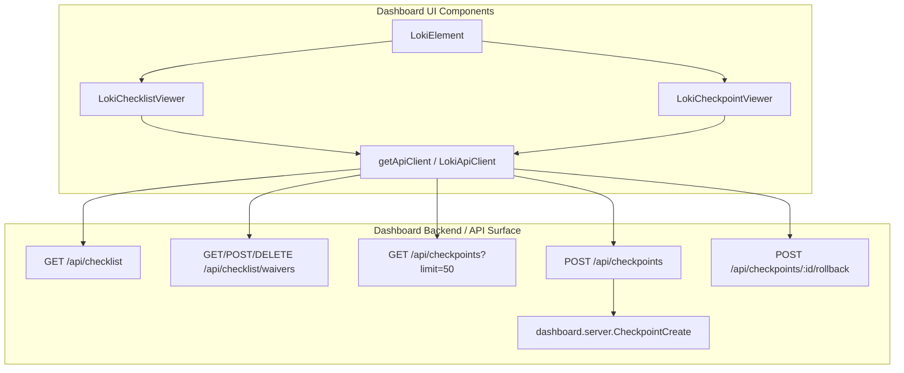
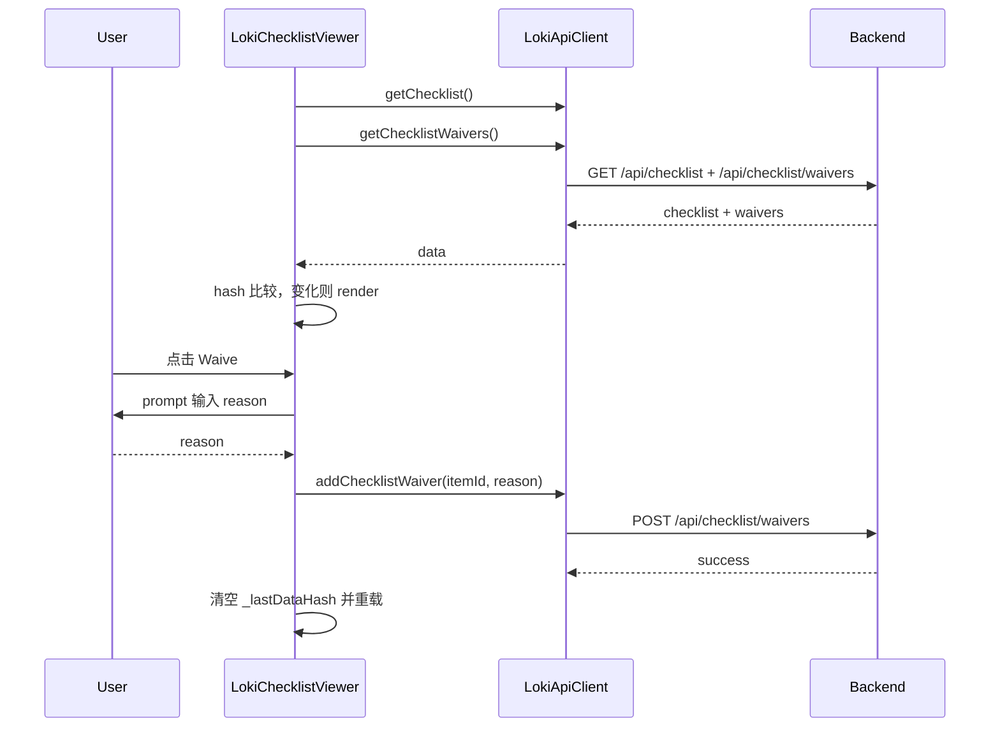
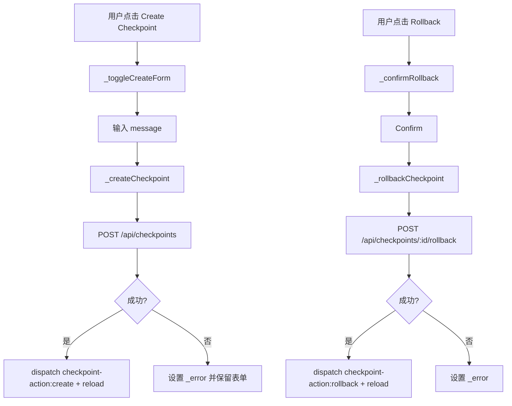
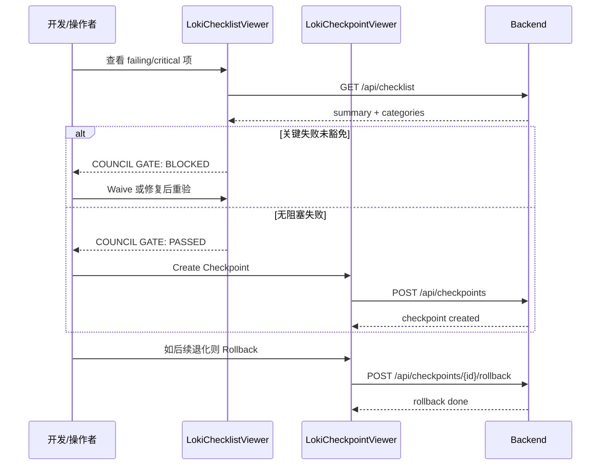
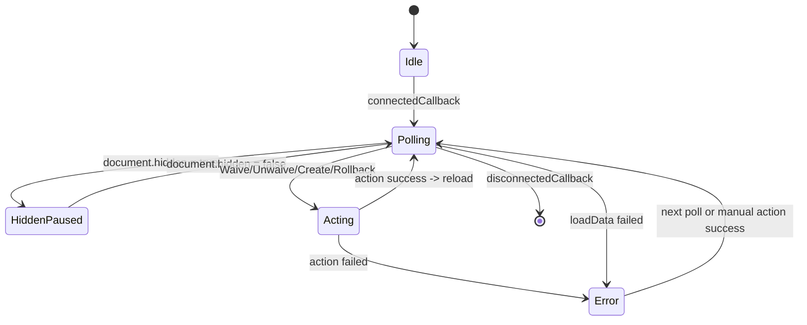
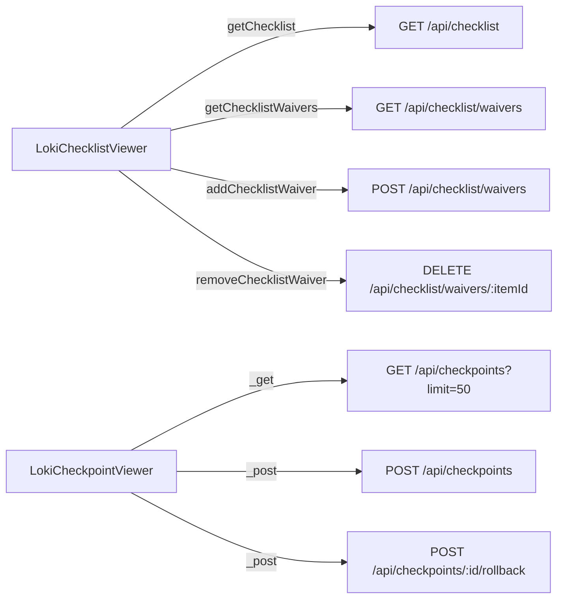

# quality_gate_and_checkpoint_recovery 模块文档

## 模块简介与存在价值

`quality_gate_and_checkpoint_recovery` 是 `Task and Session Management Components` 下一个面向“质量闭环 + 状态恢复”的 UI 子模块，由 `LokiChecklistViewer` 与 `LokiCheckpointViewer` 两个 Web Component 组成。它解决的是两个在长流程自动化中非常关键但常被分离的问题：第一，当前产出是否满足 PRD 质量门禁（quality gate）；第二，当结果退化或策略变更时，如何快速回到一个已知稳定点（checkpoint recovery）。

这两个能力放在同一模块并不是巧合。系统在实践中经常出现“质量判定失败后立即回滚”的连续动作：`LokiChecklistViewer` 让失败项可解释、可豁免、可追踪，`LokiCheckpointViewer` 让状态恢复可执行、可确认、可审计。两者组合后形成了“先判定、再决策、后恢复”的运维/交付路径。

从架构位置看，该模块位于 Dashboard UI 的操作可视层，向下依赖 `dashboard-ui/core/loki-api-client.js` 暴露的 `/api/checklist*` 与 `/api/checkpoints*` 接口，向上为宿主页面抛出统一事件（例如 `checkpoint-action`）供外层流程编排。主题、Shadow DOM 生命周期、可访问性基础能力继承自 `LokiElement`，因此模块本身聚焦业务交互，而不是重复实现基础设施。

---

## 在整体系统中的位置



这个拓扑反映了模块边界：前端组件不直接实现“质量规则引擎”或“存储级恢复策略”，只负责拉取状态、触发动作和表达风险。后端契约（如 `CheckpointCreate.message`）决定了动作参数合法性，而 UI 决定了用户是否能清晰做出正确操作。

为避免重复阅读基础设施细节，你可以配合以下文档一起看：主题与基类能力见 [Core Theme.md](Core%20Theme.md)，API 客户端行为见 [API 客户端.md](API%20客户端.md)，上层场景编排见 [Task and Session Management Components.md](Task%20and%20Session%20Management%20Components.md)。

---

## 核心组件一：LokiChecklistViewer（质量门禁）

### 设计目标与职责

`LokiChecklistViewer` 负责展示 PRD 检查清单、验证状态分布、分类详情和豁免状态。它不是“打分器”，而是“判定可视化器 + 操作入口”。组件每 5 秒轮询一次 checklist，同时结合页面可见性自动暂停，以降低后台标签页资源占用。

### 输入属性、内部状态与输出行为

组件观察属性为 `api-url` 与 `theme`。`api-url` 变化时会更新 API client 的 `baseUrl` 并立即重拉数据；`theme` 变化时调用基类 `_applyTheme()`。

内部关键状态包括 `_checklist`（清单）、`_waivers`（仅保留 active 豁免）、`_expandedCategories`（折叠展开状态）、`_lastDataHash`（用于跳过重复渲染）和 `_error`（错误横幅信息）。该组件本身不对外 `dispatchEvent`，它的输出主要体现在 DOM 状态变化：Gate Banner、分类内容、豁免按钮状态等。

### 关键方法（按执行链路）

`connectedCallback()` 在挂载后依次执行 `_setupApi()`、`_loadData()`、`_startPolling()`；`disconnectedCallback()` 调用 `_stopPolling()` 释放 interval 与 `visibilitychange` 监听器。这是典型的“资源成对申请/释放”模式，避免组件多次挂载造成隐式轮询泄漏。

`_loadData()` 是最核心的数据入口。它并行请求 `getChecklist()` 与 `getChecklistWaivers()`，其中 waivers 请求失败会被局部吞掉并转为 `null`，保证主清单可独立显示。成功后通过 `JSON.stringify(checklist)+JSON.stringify(waivers)` 生成哈希，若与 `_lastDataHash` 一致则直接返回，从而减少无差别重渲染。副作用是会更新 `_checklist`、`_waivers`、`_error` 并触发 `render()`。

`_getUnwaivedCriticalFailures()` 与 `_renderGateBanner()` 共同实现 Council Gate 可视化逻辑：只要存在“`status=failing` 且 `priority=critical` 且未豁免”的项，就显示 `BLOCKED`。该规则体现的是“关键失败不可默认忽略”的产品约束。

`_waiveItem(itemId)` 使用 `window.prompt` 采集原因，调用 `addChecklistWaiver(itemId, reason)` 成功后清空 `_lastDataHash` 强制刷新；`_unwaiveItem(itemId)` 调用 `removeChecklistWaiver(itemId)` 后同样强制刷新。这里的“强制刷新”是为了保证哈希短路不会掩盖刚发生的动作。

`_renderItems(items)` 在渲染时执行三项重要防御逻辑。第一，按 `critical -> major -> minor` 固定优先级排序；第二，对 `priority` 做白名单校验，防止拼接内联样式时出现 style injection；第三，所有用户可见文本都经过 `_escapeHtml()` 转义，降低 XSS 风险。

### 数据流与交互流



### 关键参数、返回值与副作用速查

- `_loadData(): Promise<void>`：无返回值；副作用是更新内部状态并重渲染。
- `_waiveItem(itemId: string): Promise<void>`：无返回值；副作用是创建豁免、刷新 UI、可能写入 `_error`。
- `_unwaiveItem(itemId: string): Promise<void>`：无返回值；副作用是移除豁免、刷新 UI、可能写入 `_error`。
- `_toggleCategory(name: string): void`：无返回值；副作用是切换 `_expandedCategories` 并重渲染。
- `_escapeHtml(str: any): string`：返回安全字符串；无外部副作用。

---

## 核心组件二：LokiCheckpointViewer（检查点恢复）

### 设计目标与职责

`LokiCheckpointViewer` 面向“创建恢复点、查看历史、执行回滚”三个动作。组件每 3 秒轮询 `/api/checkpoints?limit=50`，并在页面隐藏时暂停。相比 Checklist Viewer 更高频，是因为恢复面板通常用于近实时追踪最近操作。

### 输入属性、内部状态与输出事件

组件同样观察 `api-url` 和 `theme`。内部状态除 `_checkpoints`、`_error` 外，还包含 `_showCreateForm`、`_creating`、`_rollingBack`、`_rollbackTarget`，分别用于控制创建表单、创建中禁用、回滚幂等和二次确认目标。

该组件会抛出 `checkpoint-action` 事件，`detail` 结构有两类：`{ action: 'create', message }` 和 `{ action: 'rollback', checkpointId }`，并且 `bubbles: true`，便于父容器在更高层统一处理审计、通知或联动刷新。

### 关键方法（按业务动作）

`_loadData()` 通过 `Promise.allSettled([this._api._get('/api/checkpoints?limit=50')])` 获取列表，并兼容两种返回形态：数组本体或 `{checkpoints: [...]}` 包装对象。随后用 `{c: checkpoints, e: error}` 计算哈希，变化时才渲染。需要注意，它当前使用了 `_api._get`（内部低层方法）而不是公开语义方法，这提升了灵活性，但牺牲了一点封装一致性。

`_createCheckpoint()` 读取输入框 `#checkpoint-message`，为空则直接返回。提交期间设置 `_creating = true` 并即时渲染禁用态，成功后关闭表单、发送事件、强制刷新；失败则保留表单并展示错误。

`_rollbackCheckpoint(checkpointId)` 首先用 `_rollingBack` 做并发保护，避免重复提交；随后调用 `/api/checkpoints/{id}/rollback`，成功后清理确认目标并发送事件，失败则写入 `_error`。无论成功失败，`finally` 都会恢复 `_rollingBack=false` 并重渲染。

`_confirmRollback(checkpointId)` 与 `_cancelRollback()` 实现软确认流程，只有处于 `_rollbackTarget` 的卡片才显示 Confirm/Cancel 按钮。这个设计避免了直接点击即回滚的高风险交互。

`_formatRelativeTime(timestamp)` 将时间戳渲染为 `s/m/h/d ago`，解析失败时回退到转义后的原值，保证 UI 不因脏数据崩溃。

### 处理流程图



### 与后端契约的对应

前端创建请求发送 `{ message }`，后端契约 `dashboard.server.CheckpointCreate` 定义为 `message: Optional[str], max_length=500`。但组件输入框 `maxlength=200`，这意味着 UI 层比后端更严格。该差异不是错误，通常是为了控制卡片可读性；但如果业务希望允许更长描述，需要同时调整前端与文档预期。

---

## 模块级协同：质量门禁与恢复闭环



上图体现该模块的“操作节奏”：`Checklist` 解决“能否继续”，`Checkpoint` 解决“如何回退”。在实际落地时，建议父容器监听 `checkpoint-action` 后同步触发质量视图刷新或审计记录，以形成完整追踪链路。

---

## 配置与使用

### 最小集成示例

```html
<loki-checklist-viewer api-url="http://localhost:57374" theme="dark"></loki-checklist-viewer>
<loki-checkpoint-viewer api-url="http://localhost:57374" theme="dark"></loki-checkpoint-viewer>

<script type="module">
  const cp = document.querySelector('loki-checkpoint-viewer');

  cp.addEventListener('checkpoint-action', (e) => {
    if (e.detail.action === 'create') {
      console.log('checkpoint created:', e.detail.message);
    }
    if (e.detail.action === 'rollback') {
      console.log('rollback target:', e.detail.checkpointId);
    }
  });
</script>
```

### 与宿主编排的推荐模式

在复合页面中，建议把两个组件并列放在同一上下文容器，由容器集中处理三类横切逻辑：审计日志、全局通知、跨组件刷新。例如回滚后可主动通知任务看板或运行管理器刷新，相关上层组件说明可参见 [task_board_and_run_operations.md](task_board_and_run_operations.md)。

---

## 边界条件、错误处理与已知限制

该模块在稳定性上做了多层兜底，但仍有一些值得提前理解的行为约束。

首先，两个组件都实现了“页面隐藏时暂停轮询”，但它们并没有共享同一个全局节流器，而是各自维护 `setInterval`。在同屏实例很多时，请求总量仍会线性增长。其次，去重依赖 `JSON.stringify` 哈希，虽然简单直接，但当返回字段顺序不稳定时可能产生误判重渲染。

其次，`LokiChecklistViewer` 的豁免输入依赖 `window.prompt`，在某些受限 WebView 或自定义浏览器策略中可能被禁用，导致无法弹窗采集 reason。若你面向企业内嵌环境，建议扩展为内联表单。

再者，`LokiCheckpointViewer` 的 `_loading` 初始值是 `false` 且未在 `_loadData()` 前后切换，因此“Loading checkpoints...”分支几乎不会出现。当前体验更偏向“空态即默认态”。如果你希望更明确的首屏加载反馈，需要在代码层补齐加载状态切换。

最后，Checklist 与 Checkpoint 都没有内建指数退避重试策略，失败后会在下一轮询周期继续请求；这在故障时可能造成持续错误日志。若部署在高延迟网络，建议在 API 客户端层统一增加 backoff 或断路策略。

---

## 扩展建议

如果你要扩展该模块，建议优先遵循现有模式而不是引入第二套状态管理。对于 Checklist，可新增“按 category/status 过滤”“批量豁免审批流”“waiver 到期时间展示”；对于 Checkpoint，可新增“按分支/操作者过滤”“差异预览（checkpoint diff）”“回滚前依赖检查”。

扩展时要注意两点一致性：一是所有可见字符串继续走 HTML 转义，避免引入 XSS 回归；二是动作完成后保持“清空 `_lastDataHash` + reload”的刷新语义，避免 UI 与后端状态短暂分叉。

---

## 维护者速查（方法级摘要）

`LokiChecklistViewer` 维护关注点在 `_loadData`、`_renderItems`、`_getUnwaivedCriticalFailures` 三处：它们分别决定数据一致性、安全渲染与门禁判定正确性。`LokiCheckpointViewer` 的关键在 `_loadData`、`_createCheckpoint`、`_rollbackCheckpoint`：分别对应列表稳定刷新、创建流程完整性和回滚幂等保护。

如果出现“UI 不刷新”问题，优先检查 `_lastDataHash` 是否被错误复用；如果出现“轮询泄漏”，优先检查 `connected/disconnected` 是否成对触发；如果出现“动作成功但父层没感知”，优先检查 `checkpoint-action` 监听绑定位置（需监听冒泡链路上的正确节点）。


---

## 补充：状态机视角（便于排查交互问题）



这个状态机可用于解释两个组件共享的运行模式：`Polling` 是常态，`HiddenPaused` 是节流态，`Acting` 是用户动作态，`Error` 是可恢复异常态。它不是一次性请求组件，而是“持续同步 + 局部动作”的 UI，因此排障时应优先判断当前处于哪种状态，再定位是 API 错误、状态短路还是事件未冒泡。

## 补充：可扩展点与兼容性建议

如果你准备在该模块上叠加企业能力（审批、审计、SLO），推荐优先扩展外围容器而不是直接侵入组件内部。`LokiCheckpointViewer` 已经提供 `checkpoint-action` 事件，外层可以将其桥接到审计模块（参考 [Audit.md](Audit.md)）或通知中心（参考 [loki-notification-center.md](loki-notification-center.md)）。对于 `LokiChecklistViewer`，由于当前不抛业务事件，可采用两种方式：在容器层监听按钮代理并封装二次事件，或者在 fork 版本里补充 `waiver-action` 事件并保持 `bubbles: true`。

兼容性方面，需要特别关注 `color-mix` CSS 能力与 `window.prompt` 行为。前者在老旧浏览器中可能降级不一致，后者在受限容器中可能被策略阻止。若你的运行环境包含内嵌 WebView、低版本 Chromium 或 kiosk 模式，建议在集成测试阶段加入“主题降级 + waiver 输入替代（内联 modal/form）”的专项用例。


---

## API 契约补充（基于组件实际调用）

`LokiChecklistViewer` 依赖 `getApiClient` 暴露的语义方法：`getChecklist()`、`getChecklistWaivers()`、`addChecklistWaiver(itemId, reason)`、`removeChecklistWaiver(itemId)`。从组件行为反推，前端期望 checklist 数据包含 `status`、`summary`、`categories[].items[]`，其中 item 至少应有 `id`、`title`、`status`、`priority`、`verification[]`。若后端返回缺失字段，组件会通过默认值和空数组兜底渲染，但门禁语义（例如 critical failing 判定）会受影响。

`LokiCheckpointViewer` 直接使用底层 `_get/_post` 访问：`GET /api/checkpoints?limit=50`、`POST /api/checkpoints`、`POST /api/checkpoints/:id/rollback`。它兼容两种列表响应形态：数组本体或 `{ checkpoints: [] }` 包装对象。创建接口发送体仅包含 `{ message }`，回滚接口无 body。因此若你在网关层做 schema 校验，需放宽列表返回格式并允许回滚空请求体。



上述依赖意味着一个很实用的维护策略：把“接口变更影响”分成语义层和形态层。语义层（字段含义变化）会影响门禁判定；形态层（外层包裹变化）对 Checkpoint 组件已做局部容错，但 Checklist 组件更依赖固定结构。

---

## 使用与扩展示例（工程实践）

在真实页面里，这两个组件通常不是孤立存在。一个常见实践是由父容器统一监听 `checkpoint-action`，并在创建/回滚后触发全局通知和邻近组件刷新。这样可以避免各组件互相直接依赖，保持模块边界清晰。

```html
<loki-checklist-viewer id="qg" api-url="http://localhost:57374"></loki-checklist-viewer>
<loki-checkpoint-viewer id="cp" api-url="http://localhost:57374"></loki-checkpoint-viewer>
<script type="module">
  const qg = document.getElementById('qg');
  const cp = document.getElementById('cp');

  cp.addEventListener('checkpoint-action', async (e) => {
    // 1) 记录审计 / 通知
    console.log('[checkpoint-action]', e.detail);

    // 2) 触发质量视图立即刷新（不等下一轮轮询）
    if (typeof qg._loadData === 'function') {
      qg._lastDataHash = null;
      await qg._loadData();
    }
  });
</script>
```

如果你需要“无 prompt 的豁免输入体验”，建议扩展 `LokiChecklistViewer` 而不是在运行时 patch 原型。扩展类中可把 `_waiveItem` 改为弹出自定义 modal，并保持原有调用序列（提交成功后清空 `_lastDataHash` 再 reload），这样不会破坏现有去重逻辑。

---

## 运维与排障清单（重点场景）

当你遇到“数据明明变了但界面不刷新”时，优先检查 `_lastDataHash` 是否被外部错误复用，或后端是否返回了等价 JSON（例如仅服务端排序变化被吞掉）。当你遇到“页面切后台后回来数据旧”时，先确认 `visibilitychange` 是否正常触发，再检查恢复时是否执行了立即 `_loadData()`（两个组件都实现了该行为）。

对于“回滚按钮可点但无效果”，排障顺序建议是：先看网络请求是否发出、再看返回码、最后看组件 `_rollingBack` 是否卡住（理论上 finally 会复位）。如果 finally 未执行，通常是运行时异常或 Promise 链被外层拦截导致。

在性能监控上，建议重点采集三类指标：轮询请求成功率、渲染频率（可通过 MutationObserver 粗略估计）、动作失败率（create/rollback/waive）。这些指标能快速判断问题是“后端不稳”“前端重渲染过多”还是“交互路径设计导致误操作”。
