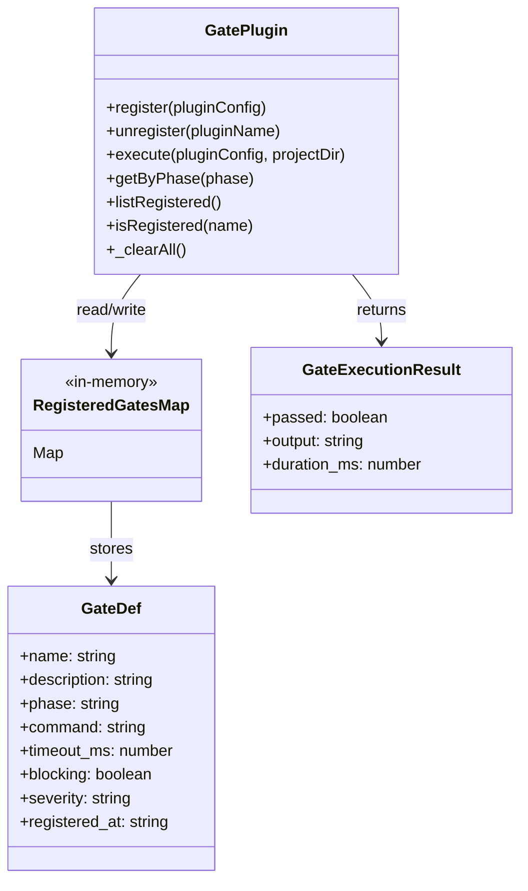
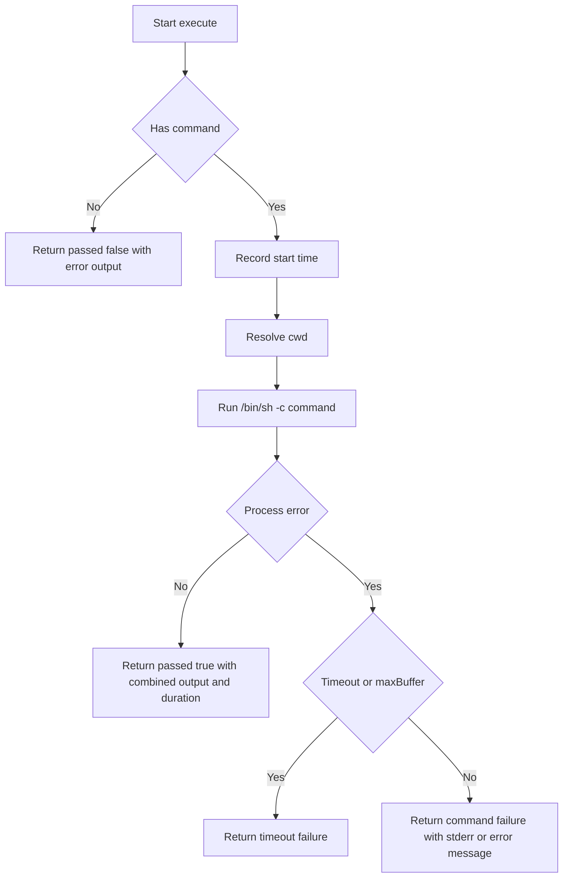
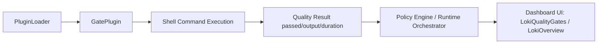

# quality_gate_execution 模块文档

## 模块概述

`quality_gate_execution` 是插件系统中的“质量门禁执行层”，其核心由 `src.plugins.gate-plugin.GatePlugin` 提供。这个模块存在的主要目的，是把“质量检查逻辑”从主流程中解耦出来：主系统不需要内置具体 lint、test、security scan 或自定义脚本，只要把外部命令注册成 gate，就可以在特定 SDLC 阶段（默认 `pre-commit`）执行并返回统一结果。

从设计上看，它是一个轻量、命令驱动的执行器与注册中心组合：一方面提供内存态注册表管理 gate 元数据，另一方面用子进程执行 shell 命令并标准化结果（`passed/output/duration_ms`）。这种设计让系统可以快速扩展不同团队、不同仓库的质量策略，而不必修改核心引擎代码。

在整体架构中，`quality_gate_execution` 并不负责“何时触发门禁”或“策略决策优先级”，它只负责“注册 + 查询 + 执行”。触发时机、阻断逻辑、策略编排通常由上层模块（例如策略引擎、运行时调度或 UI 控制层）承担。换言之，它是“执行原语（execution primitive）”，不是“治理中枢（governance brain）”。

---

## 核心组件：`GatePlugin`

代码位置：`src/plugins/gate-plugin.js`

`GatePlugin` 是一个纯静态类（全部方法均为 `static`），内部依赖一个模块级别的 `_registeredGates: Map<string, GateDef>` 作为注册中心。由于是进程内内存存储，它具备低延迟、零外部依赖的优点，但也天然不持久化、不可跨进程共享。

### 组件结构图



上图展示了该模块的核心事实：它不是复杂的对象系统，而是围绕一个注册表进行操作的执行入口。`register/unregister/get/list/isRegistered` 负责管理 gate 生命周期；`execute` 负责调用 shell 并归一化执行结果。

---

## 设计动机与实现取舍

`GatePlugin` 采用 `execFile('/bin/sh', ['-c', command], ...)` 的方式执行命令，而非将 command 拆分成 binary + args。这一实现最大化了命令表达能力（支持管道、重定向、复合命令、shell 内建），降低了接入门槛；代价则是 shell 注入风险与平台兼容性约束（强依赖 `/bin/sh`，主要面向类 Unix 环境）。

模块把命令执行超时、缓冲区限制、环境变量注入、输出拼接统一封装，避免上层调用方重复写子进程模板逻辑。这是一种“薄抽象”：它只规范最必要的行为，不把业务策略硬编码进去，因此可被策略引擎、CI hook、任务流引擎重复利用。

---

## 方法级深入说明

## `GatePlugin.register(pluginConfig)`

该方法负责将一个质量门禁插件配置写入内存注册表。它首先验证 `pluginConfig.type === 'quality_gate'`，这是一条关键约束，防止其他插件类型误注入 gate 通道。随后它检查同名 gate 是否已存在，避免重复注册。

成功时，会根据输入构造标准化 `gateDef` 并补齐默认值：

- `phase` 默认 `pre-commit`
- `timeout_ms` 默认 `30000`
- `blocking` 默认 `true`
- `severity` 默认 `high`
- `registered_at` 自动填充 ISO 时间戳

返回值：

- 成功：`{ success: true }`
- 失败：`{ success: false, error: string }`

副作用：更新模块级 `_registeredGates`。

### 注册配置示例

```javascript
const { GatePlugin } = require('./src/plugins/gate-plugin');

const result = GatePlugin.register({
  type: 'quality_gate',
  name: 'unit-tests',
  description: 'Run unit tests before commit',
  phase: 'pre-commit',
  command: 'npm test -- --runInBand',
  timeout_ms: 120000,
  blocking: true,
  severity: 'high'
});

if (!result.success) {
  console.error(result.error);
}
```

---

## `GatePlugin.unregister(pluginName)`

该方法按名称删除已注册 gate。若目标不存在则返回失败，避免“静默成功”导致调用方误判状态。

返回值：

- 成功：`{ success: true }`
- 失败：`{ success: false, error: 'Gate plugin "..." is not registered' }`

副作用：删除 `_registeredGates` 中对应项。

---

## `GatePlugin.execute(pluginConfig, projectDir)`

这是模块最关键的方法。它接收一个 gate 配置对象与可选工作目录，然后在该目录执行命令并输出统一结果对象。

### 执行流程图



### 关键行为说明

1. **缺失命令快速失败**：若 `pluginConfig.command` 为空，立即返回失败结果，不启动子进程。
2. **工作目录控制**：`cwd` 优先使用传入的 `projectDir`，否则退回 `process.cwd()`。
3. **环境变量注入**：执行时会附加 `LOKI_GATE=<pluginName|unknown>`，便于脚本侧感知当前 gate 上下文。
4. **超时控制**：默认 30 秒，可由 `timeout_ms` 覆盖。
5. **输出上限**：`maxBuffer = 1MB`，防止子进程输出无限增长导致主进程压力。
6. **结果标准化**：无论成功失败都返回 `{ passed, output, duration_ms }`。

### 返回值契约

```ts
type GateExecutionResult = {
  passed: boolean;
  output: string;
  duration_ms: number;
}
```

### 执行示例

```javascript
const gate = {
  name: 'lint',
  command: 'npm run lint',
  timeout_ms: 45000
};

const result = await GatePlugin.execute(gate, '/path/to/project');

if (!result.passed) {
  console.error(`[GATE FAILED] ${result.output}`);
} else {
  console.log(`[GATE OK] ${result.duration_ms}ms`);
}
```

---

## `GatePlugin.getByPhase(phase)`

该方法返回所有 `gateDef.phase === phase` 的注册项，用于上层按阶段批量触发。例如在 `pre-commit` 阶段一次性获取并执行所有对应 gate。

返回值是数组快照（通过 `Array.from(...).filter(...)`），不会直接暴露 Map 引用。

---

## `GatePlugin.listRegistered()`

返回当前全部已注册 gate 的数组，常用于管理界面展示、调试、健康检查。

---

## `GatePlugin.isRegistered(name)`

返回 gate 名称是否存在，适用于幂等注册前检查或快速断言。

---

## `GatePlugin._clearAll()`

清空全部注册项，主要用于测试场景的状态重置。生产逻辑应谨慎调用，避免意外抹除动态注册配置。

---

## 与系统其他模块的关系

`quality_gate_execution` 在模块树中属于 `Plugin System` 的 `quality_gate_execution` 子模块，主要与以下能力形成协作关系：



这条链路强调一个分层原则：`GatePlugin` 负责执行，不决定治理策略。策略解释、审批门禁、成本约束等能力应在 [Policy Engine.md](./Policy%20Engine.md) 中实现；插件发现和加载机制应参考 [Plugin System.md](./Plugin%20System.md) 与 [PluginLoader.md](./PluginLoader.md)；前端可视化可参考 [LokiQualityGates.md](./LokiQualityGates.md)。

---

## 典型使用模式

最常见的模式是“注册 -> 按阶段查询 -> 顺序执行 -> 汇总决策”。

```javascript
const { GatePlugin } = require('./src/plugins/gate-plugin');

GatePlugin.register({
  type: 'quality_gate',
  name: 'lint',
  command: 'npm run lint',
  phase: 'pre-commit',
  blocking: true,
});

GatePlugin.register({
  type: 'quality_gate',
  name: 'unit-tests',
  command: 'npm test',
  phase: 'pre-commit',
  blocking: true,
});

const gates = GatePlugin.getByPhase('pre-commit');
const results = [];

for (const gate of gates) {
  const r = await GatePlugin.execute(gate, process.cwd());
  results.push({ gate: gate.name, ...r, blocking: gate.blocking });

  // 调用方决定是否中断流程
  if (!r.passed && gate.blocking) break;
}
```

这里需要特别注意：`blocking/severity` 仅作为元数据被存储，并不会由 `GatePlugin.execute` 自动应用。是否“失败即阻断”、是否“按严重级别分流”必须由上层编排器实现。

---

## 配置字段说明与行为语义

可用字段（输入 `register` 时）：

- `type`：必须为 `quality_gate`。
- `name`：gate 唯一标识，注册表键。
- `description`：描述信息，展示或审计用途。
- `phase`：生命周期阶段标签，默认 `pre-commit`。
- `command`：待执行 shell 命令。
- `timeout_ms`：执行超时，默认 30000。
- `blocking`：是否阻断型门禁，默认 `true`（仅元数据）。
- `severity`：严重等级，默认 `high`（仅元数据）。

---

## 边界条件、错误与限制

该模块简单但有若干关键边界行为，实际接入时应重点关注。

首先，注册表是进程内内存态：进程重启后所有 gate 丢失；多实例部署时每个实例注册表互不共享，若希望一致性需要外部配置中心或启动时重放注册。

其次，执行依赖 `/bin/sh`，在 Windows 原生环境或最小化容器中可能不存在该路径，导致执行失败。跨平台场景通常需要在外层增加平台适配或容器基线约束。

第三，超时和缓冲区异常在当前实现中被统一映射为“Timeout: command exceeded ...”，其中 `ERR_CHILD_PROCESS_STDIO_MAXBUFFER` 也被归为同一文案。这意味着“真实超时”与“输出过大”在结果文本上不可区分，若需要精细诊断，建议扩展返回结构（例如增加 `reason: 'timeout' | 'maxbuffer' | 'exit_nonzero'`）。

第四，命令通过 shell 执行，若 `command` 来源不可信会有注入风险。生产环境必须保证 command 来自受信配置，并在注册阶段做白名单或模板化约束。

第五，`execute` 函数只判断 Node 回调 error 是否存在来判定成功失败。对于 shell 命令而言，非零退出码通常会触发 error，这是符合预期的；但某些脚本可能吞错并返回 0，导致“逻辑失败但判定通过”，这类语义问题应由脚本自身约定与测试保障。

---

## 可扩展建议

如果你计划扩展该模块，建议优先考虑以下方向：

- 增加持久化注册后端（文件、数据库或配置服务），解决重启丢失与多实例一致性问题。
- 增加并发执行与依赖编排能力（串行、并行、DAG）以支持大型门禁管线。
- 扩展结果模型，暴露退出码、失败原因分类、stdout/stderr 分离字段。
- 引入执行沙箱或命令白名单机制，提升安全性。
- 将 `blocking/severity` 与策略引擎联动，形成统一治理闭环。

---

## 测试与运维注意事项

在单元测试中，可以使用 `_clearAll()` 清理全局状态，避免测试间相互污染。因为注册表是模块单例级别，未清理时很容易出现“测试顺序相关”问题。

在运维层面，建议记录每次 gate 执行的 `duration_ms` 与失败输出摘要，并与审计、可观测系统联动（可参考 [Observability.md](./Observability.md) 与 [Audit.md](./Audit.md)）。这样可以识别慢门禁、抖动门禁和高失败率门禁，逐步优化质量管线稳定性。

---

## 参考文档

- [Plugin System.md](./Plugin%20System.md)
- [PluginLoader.md](./PluginLoader.md)
- [Policy Engine.md](./Policy%20Engine.md)
- [LokiQualityGates.md](./LokiQualityGates.md)
- [Dashboard UI Components.md](./Dashboard%20UI%20Components.md)
