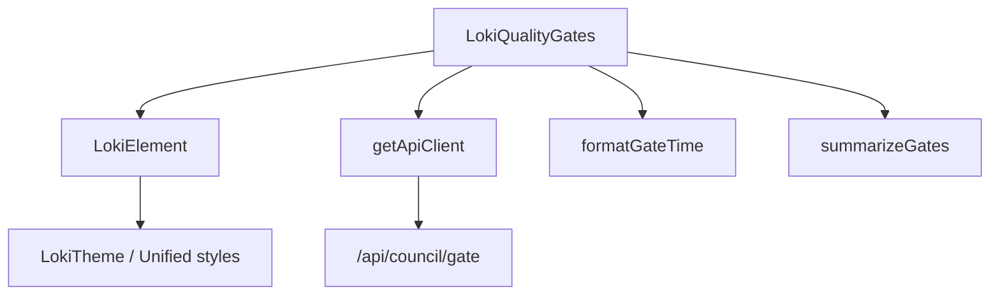
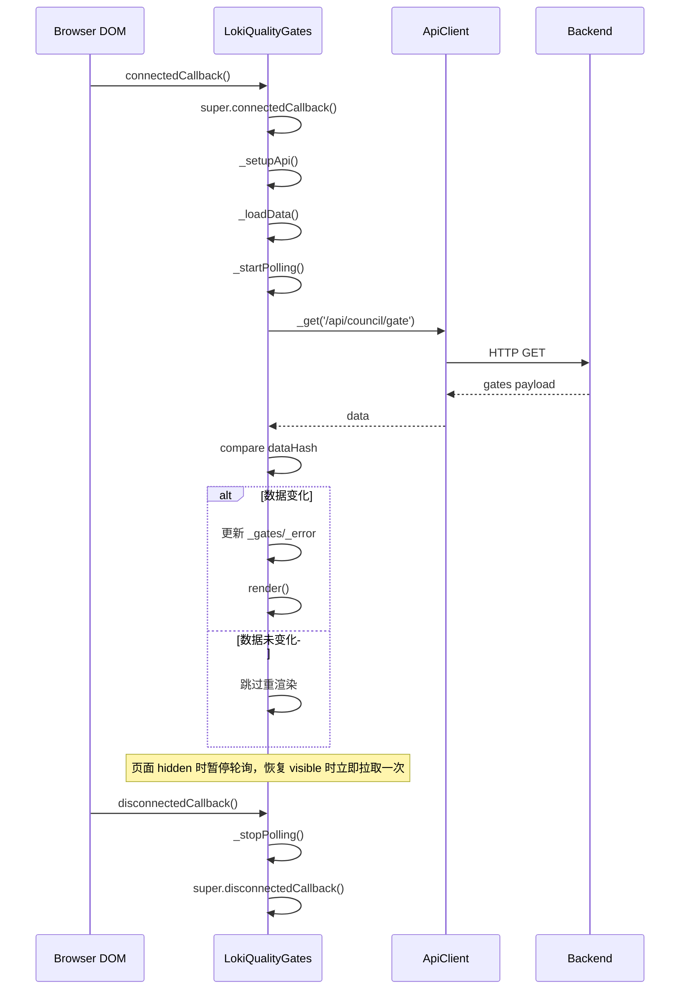
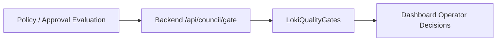

# quality_gates 模块文档

## 引言：模块职责、设计动机与系统位置

`quality_gates` 模块是 Dashboard UI 中“Cost and Quality Components”子域的一部分，当前核心实现是 `dashboard-ui/components/loki-quality-gates.js` 中的 Web Component：`LokiQualityGates`（标签名 `<loki-quality-gates>`）。这个模块存在的核心原因，是把后端质量门（Quality Gate）的判定结果，稳定、可读、低认知负担地呈现在前端控制面板中，帮助操作者快速回答两个问题：**当前是否满足放行条件**，以及**哪个门禁正在阻塞流程**。

从架构边界看，`quality_gates` 不是质量策略计算引擎，也不做审批决策。它属于“可视化与状态聚合层”：负责拉取 `/api/council/gate`，将离散门禁状态映射为统一视觉语义（PASS/FAIL/PENDING），并通过自动刷新维持数据时效。策略定义、执行与裁决应参考 [Policy Engine.md](Policy Engine.md) 与 [Policy Engine - Approval Gate.md](Policy Engine - Approval Gate.md)；本模块仅消费其结果。

在系统整体中，`quality_gates` 常与 [quality_score_component.md](quality_score_component.md) 与 [cost_dashboard_component.md](cost_dashboard_component.md) 联合使用，形成“成本-质量”并行观测视图：质量门回答“能否过”，质量分回答“质量水平如何”，成本面板回答“代价是否可接受”。

---

## 模块结构与组件关系

### 核心组件

本模块仅包含一个核心类组件和两个辅助纯函数：

- `LokiQualityGates`：组件主体，负责生命周期、拉取数据、轮询控制与渲染。
- `formatGateTime(timestamp)`：把时间戳转换成短格式可读时间。
- `summarizeGates(gates)`：统计 pass/fail/pending 数量并输出汇总。

### 继承与依赖关系图



`LokiQualityGates` 通过继承 `LokiElement` 获得主题应用、Shadow DOM 与基类生命周期能力（详见 [Core Theme.md](Core Theme.md)、[Unified Styles.md](Unified Styles.md)）。网络访问通过 `getApiClient` 完成；这意味着该模块不关心底层 fetch/认证细节，只依赖 API client 对外合同。

---

## 生命周期与运行流程



该流程的设计重点是“有状态但轻量”：组件挂载即拉首包，避免用户等待下一次轮询；之后每 30 秒刷新一次，并在页面不可见时暂停，减少后台资源浪费。数据哈希相同则跳过重绘，避免无效 DOM 更新。

---

## 核心实现详解

## `GATE_STATUS_CONFIG`：状态到视觉语义映射

模块内部定义了 `pass/fail/pending` 到 `{ color, bg, label }` 的映射，并提供 CSS 变量默认值。这个配置将后端状态文本标准化为前端一致视觉表现。对未知状态，渲染逻辑回退到 `pending`，确保组件在后端扩展状态值时不会崩溃。

## `formatGateTime(timestamp)`

函数签名：`formatGateTime(timestamp: string | null): string`

其职责是把 ISO 时间转成人可读短格式（月/日/时/分）。当输入为空时返回 `Never`；当出现异常返回 `Unknown`。需要注意的是，`new Date(invalid)` 不一定抛异常，可能生成 `Invalid Date`，因此该函数对“语义无效日期”的防护并非绝对。

## `summarizeGates(gates)`

函数签名：`summarizeGates(gates: Array): { pass, fail, pending, total }`

该函数执行线性遍历统计。它把状态值统一小写后比较，仅识别 `pass` 和 `fail`，其余值都进入 `pending`。这种策略保证向前兼容，但会损失新状态细粒度语义。

## `LokiQualityGates` 类

### 构造与状态字段

构造函数初始化以下运行状态：`_loading`（加载中）、`_error`（错误消息）、`_api`（客户端实例）、`_gates`（门禁数据）、`_pollInterval`（轮询句柄）、`_lastDataHash`（去重哈希）。这组字段覆盖了组件的最小必要状态机。

### `connectedCallback()`

组件挂载后依次执行 API 初始化、首次加载、轮询启动。由于先调用 `super.connectedCallback()`，主题与基础样式会先应用，随后数据渲染更新。

### `disconnectedCallback()`

组件卸载时调用 `_stopPolling()`，清理 interval 与 `visibilitychange` 监听，防止内存泄漏和重复请求。

### `attributeChangedCallback(name, oldValue, newValue)`

监听 `api-url` 与 `theme`：

- `api-url` 变化后更新 `this._api.baseUrl` 并立即重新拉取。
- `theme` 变化时调用 `_applyTheme()`，不触发数据请求。

### `_setupApi()`

读取 `api-url` 属性，未配置则回退 `window.location.origin`，再调用 `getApiClient({ baseUrl })`。

### `_startPolling()` / `_stopPolling()`

`_startPolling()` 每 30 秒触发 `_loadData()`；并注册 `document.visibilitychange`：页面隐藏时暂停轮询，恢复可见时先拉一次最新数据再恢复 interval。`_stopPolling()` 对称清理，确保生命周期闭环。

### `_loadData()`

这是模块的主数据通路：

1. 设置 `_loading = true`。
2. 调用 `this._api._get('/api/council/gate')`。
3. 兼容两种响应：`{ gates: [...] }` 或直接数组 `[...]`。
4. 使用 `JSON.stringify(gates)` 与 `_lastDataHash` 对比，未变化则跳过渲染。
5. 变化时更新 `_gates` 并清空 `_error`。
6. 出错时仅在 `_error` 为空时写入错误文本（首次错误锁定策略）。
7. `finally` 中复位 `_loading`。

该函数有一个细节：数据未变化时在 `try` 中 `return`，但 `finally` 仍会执行，因此不会卡在 loading 状态。

### `_escapeHtml(str)`

对 `& < > "` 做实体转义，保护 `name`、`description`、错误文本插入 `innerHTML` 的安全性，是组件 XSS 防护关键点。

### `_getStyles()` 与 `render()`

`render()` 将 `getBaseStyles()` 与本地样式拼接注入 `shadowRoot`。渲染分支包括：

- 首次加载且无数据：展示 loading。
- 非加载且无数据：展示 empty state。
- 有数据：渲染卡片网格 + 顶部汇总。
- 有错误：底部 error banner。

每张卡片显示 `name`、状态 badge、可选 `description`、`last_checked|lastChecked` 时间。

---

## 数据契约与后端接口假设

模块调用固定端点：`GET /api/council/gate`。兼容数据形态如下。

```json
{
  "gates": [
    {
      "name": "Security Review",
      "status": "pass",
      "description": "Static scan and dependency audit passed",
      "last_checked": "2026-01-07T12:34:56Z"
    }
  ]
}
```

或：

```json
[
  {
    "name": "Cost Guard",
    "status": "fail",
    "lastChecked": "2026-01-07T12:34:56Z"
  }
]
```

该模块对时间字段做了 `snake_case/camelCase` 双兼容，但不提供更广泛字段映射。若后端字段漂移，前端会退化为默认值展示（如 `Unnamed Gate`、`pending`、`Never`）。

---

## 使用与配置

### 基础嵌入

```html
<loki-quality-gates></loki-quality-gates>
```

### 指定 API 与主题

```html
<loki-quality-gates
  api-url="http://localhost:57374"
  theme="dark">
</loki-quality-gates>
```

### 运行时动态调整

```javascript
const el = document.querySelector('loki-quality-gates');
el.setAttribute('api-url', 'https://staging.example.com');
el.setAttribute('theme', 'light');
```

### 样式 token 覆盖

```css
loki-quality-gates {
  --loki-green: #22c55e;
  --loki-red: #ef4444;
  --loki-yellow: #eab308;
  --loki-bg-card: #ffffff;
  --loki-text-primary: #201515;
}
```

---

## 模块与系统的交互位置



这条链路表明 `quality_gates` 位于策略执行下游、运维决策上游。它不是“决策源”，而是“决策信号放大器”。因此当显示异常时，应优先排查上游 API 数据正确性，再排查组件渲染逻辑。

---

## 扩展策略与二次开发建议

如果需要扩展模块，建议遵循现有结构演进而非重写。

- 需要新增状态（例如 `skipped`）时，先扩展 `GATE_STATUS_CONFIG`，再决定 summary 是否新增统计维度。
- 若门禁数量很大，`JSON.stringify` 哈希比较可能成为热路径开销，可改为后端版本号（etag/revision）驱动刷新。
- 如需不同刷新频率，可引入 `poll-interval` 属性，并设置最小阈值防止请求风暴。
- 若要增加交互（点击卡片看详情），应继续保持 `escapeHtml` 或使用安全模板渲染，避免引入 XSS 回归。
- 若想更强诊断能力，可将错误策略由“首次错误锁定”升级为“最近一次错误 + 次数 + 首次发生时间”。

---

## 边界条件、错误场景与已知限制

`quality_gates` 在鲁棒性上做了不少防护，但仍有工程边界需要明确。

- 当 API client 不存在 `_get` 方法时，请求会失败并显示错误横幅。
- 日期解析对“无效但不抛错”的字符串处理有限，可能出现浏览器本地化 `Invalid Date` 文案。
- 数据去重依赖 `JSON.stringify`，对数组顺序敏感；同语义不同排序会触发重渲染。
- 错误消息采用“首次错误保留”策略，后续不同错误不会立即覆盖，可能影响故障定位粒度。
- 组件没有主动取消进行中的网络请求；在网络抖动下，响应乱序可能导致短暂显示旧数据。
- 页面隐藏时会暂停轮询，这优化了资源使用，但也意味着恢复可见前不会持续跟进后台变化。

---

## 测试与运维建议

建议在模块维护中覆盖三类测试：

1. 纯函数测试：`summarizeGates` 与 `formatGateTime` 的输入边界。
2. 生命周期测试：挂载/卸载后轮询与监听器是否正确创建和释放。
3. 安全与渲染测试：HTML 注入内容是否被转义；同数据重复拉取是否避免重渲染。

运维排障时，建议先验证 `/api/council/gate` 的响应结构，再检查组件属性 `api-url`、浏览器可见性状态、以及 CSS token 覆盖是否破坏状态颜色。

---

## 参考文档

- [Cost and Quality Components.md](Cost and Quality Components.md)
- [quality_score_component.md](quality_score_component.md)
- [cost_dashboard_component.md](cost_dashboard_component.md)
- [Core Theme.md](Core Theme.md)
- [Unified Styles.md](Unified Styles.md)
- [Dashboard Backend.md](Dashboard Backend.md)
- [Policy Engine.md](Policy Engine.md)
- [Policy Engine - Approval Gate.md](Policy Engine - Approval Gate.md)
