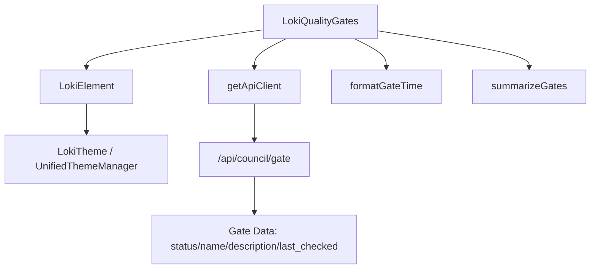
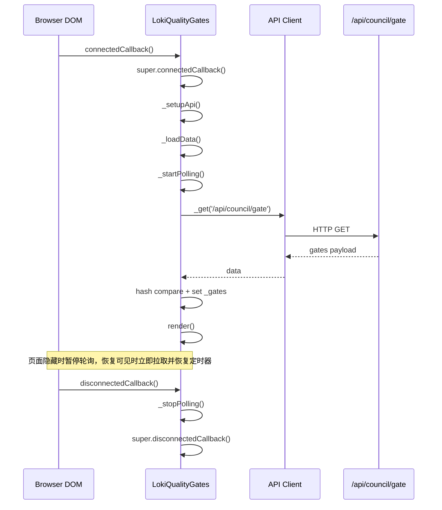
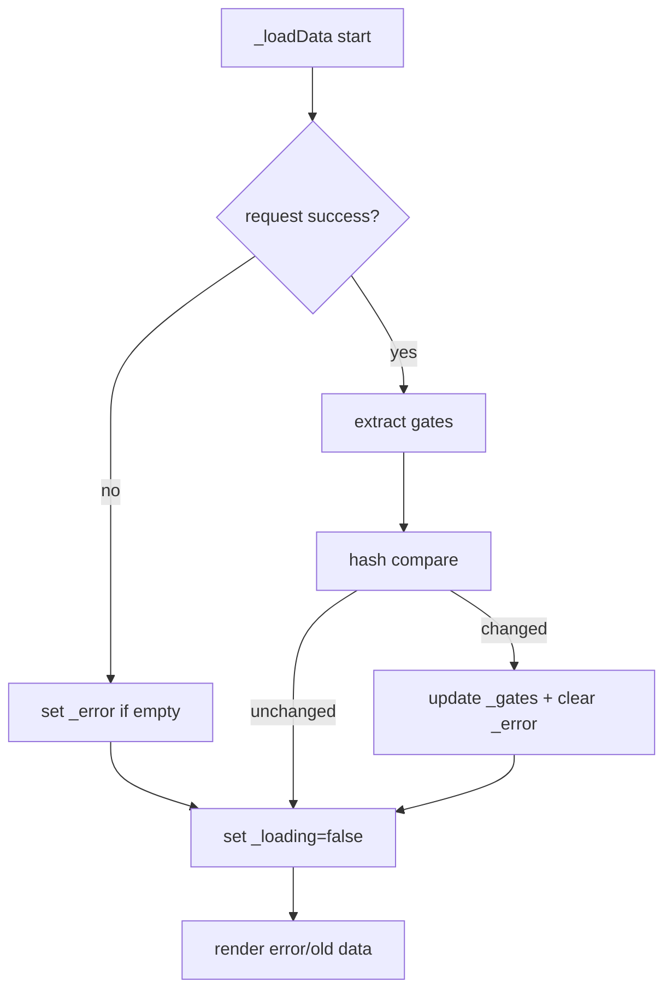
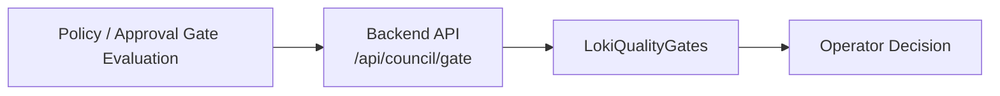

# quality_gates_component

## 模块概述

`quality_gates_component` 对应的核心实现是 Web Component `dashboard-ui.components.loki-quality-gates.LokiQualityGates`（标签名：`<loki-quality-gates>`）。它的职责是把“质量门（Quality Gates）”的当前状态可视化为卡片网格，并以低成本的轮询机制持续刷新数据，让操作者在 Dashboard 中快速判断当前运行或会话是否满足质量约束。

从产品定位看，这个组件是 **“质量信号的可视层”**，而不是策略计算层。真正的 gate 判定逻辑通常来自后端治理能力（可参考 [Policy Engine.md](Policy Engine.md) 与 [Policy Engine - Approval Gate.md](Policy Engine - Approval Gate.md)），本组件只负责拉取 `/api/council/gate` 数据并完成展示、状态聚合和基础容错。

该组件被归类在 Dashboard UI 的 Cost and Quality 分组中，可与 [cost_dashboard_component.md](cost_dashboard_component.md)、[quality_score_component.md](quality_score_component.md) 一起构成“成本-质量联合观察”界面：成本告诉你“花了多少”，质量门告诉你“是否可放行”。

---

## 设计目标与存在原因

`LokiQualityGates` 的设计重点不是复杂交互，而是稳定、清晰和可持续刷新。它通过三种颜色（green/red/yellow）映射 pass/fail/pending，降低用户理解门槛；通过顶部 summary 聚合避免逐卡片统计；通过页面可见性（`document.hidden`）暂停轮询减少后台标签页资源消耗。

组件同时继承 `LokiElement`，复用统一主题系统、Shadow DOM 隔离和基础键盘机制。这样它不用重复实现主题切换与 token 注入逻辑，并与整个 Dashboard UI 的视觉一致性保持对齐（参考 [Core Theme.md](Core Theme.md) 与 [Unified Styles.md](Unified Styles.md)）。

---

## 组件与依赖关系



上图展示了组件的最小依赖面。`LokiQualityGates` 仅依赖一个 API 客户端入口（`getApiClient`）和两个本地纯函数（时间格式化、状态汇总），主逻辑集中在生命周期与渲染流程，因此可维护性较高、迁移成本较低。

---

## 对外使用方式

### 基础用法

```html
<loki-quality-gates api-url="http://localhost:57374" theme="dark"></loki-quality-gates>
```

当 `api-url` 未设置时，会默认使用 `window.location.origin` 作为 API 基地址。

### 属性说明

1. `api-url`：后端 API 基地址。组件会调用 `GET /api/council/gate`。
2. `theme`：主题覆盖值，可传 `light`、`dark`，并继承 `LokiElement` 支持的其他主题语义（如 high-contrast / vscode-*）。

`observedAttributes` 监听了 `api-url` 和 `theme`。其中：
- 修改 `api-url` 会立即更新 `this._api.baseUrl` 并触发一次重新拉取。
- 修改 `theme` 会触发 `_applyTheme()`，由父类统一注入 CSS 变量。

---

## 内部状态模型

`LokiQualityGates` 在构造函数初始化以下状态：

- `_loading: boolean`：当前是否处于请求中。
- `_error: string | null`：错误横幅信息。
- `_api: object | null`：`getApiClient` 返回的客户端实例。
- `_gates: Array`：当前 gate 列表。
- `_pollInterval: number | null`：轮询定时器句柄。
- `_lastDataHash: string | null`：上次数据快照哈希（实际是 `JSON.stringify` 文本）。

这个状态集覆盖了该组件的最小运行需求：加载、数据、错误、刷新控制、去重渲染。

---

## 生命周期与运行流程



这个流程有两个关键点。第一，组件在挂载后立即拉取一次数据，不依赖 30 秒轮询首轮触发。第二，它在 `visibilitychange` 事件中主动暂停后台轮询，避免无效请求，恢复前台时先拉一次最新数据再重启 interval。

---

## 核心函数与方法详解

## 常量：`GATE_STATUS_CONFIG`

该配置把 `pass/fail/pending` 映射为 `{ color, bg, label }`，并使用 CSS 变量兜底值。这样主题 token 缺失时仍可显示默认颜色。

状态未知时渲染逻辑会回退到 `pending` 配置，保证 UI 可用性。

## 函数：`formatGateTime(timestamp)`

```js
formatGateTime(timestamp: string | null) => string
```

该函数负责将 ISO 时间转换成紧凑的本地化可读字符串（`month/day/hour/minute`）。

- 入参为空：返回 `Never`。
- 日期构造异常：返回 `Unknown`。
- 正常：返回 `toLocaleString` 结果。

注意：`new Date(invalidString)` 通常不会抛异常，而是 `Invalid Date`，这意味着当前 `try/catch` 并不能覆盖所有非法时间格式。最终输出可能出现平台相关的“Invalid Date”文案，这属于已知行为边界。

## 函数：`summarizeGates(gates)`

```js
summarizeGates(gates: Array) => { pass, fail, pending, total }
```

该函数是纯统计函数，遍历 gate 数组并按 `status`（忽略大小写）计数。

- 空数组或空值：返回全 0。
- 非 `pass/fail` 的状态：统一归为 `pending`。

此设计确保后端新增状态不会导致前端崩溃，但会被折叠为 pending，属于“前向兼容但语义降级”。

## 类：`LokiQualityGates`

### `connectedCallback()`

先执行父类逻辑（主题、键盘、首次 render），再初始化 API、加载数据、启动轮询。父类先渲染意味着组件可能短暂显示空状态/加载态，随后由 `_loadData` 更新真实内容。

### `disconnectedCallback()`

调用 `_stopPolling()` 清理 interval 与 `visibilitychange` 监听，避免内存泄漏和重复拉取。

### `attributeChangedCallback(name, oldValue, newValue)`

用于响应运行时配置变更。`api-url` 改变后会立即触发重拉；`theme` 改变后只做主题应用，不发请求。

### `_setupApi()`

根据 `api-url` 属性创建 API 客户端实例。默认回退到当前页面 origin，适合同域部署。

### `_startPolling()` / `_stopPolling()`

`_startPolling()` 设置 `30s` 定时刷新，并注册可见性监听；`_stopPolling()` 对称地清理所有运行时资源。

该对称设计非常关键：如果组件被频繁挂载/卸载（例如 tab 切换、条件渲染），没有这层清理会快速导致重复轮询。

### `_loadData()`

这是核心数据路径：

1. 标记 `_loading=true`。
2. 调用 `this._api._get('/api/council/gate')`。
3. 兼容两种返回：`{ gates: [...] }` 或直接 `[...]`。
4. 用 `JSON.stringify(gates)` 与 `_lastDataHash` 比较，若未变化直接 `return`。
5. 更新 `_gates` 与 `_error`，最终 `render()`。

错误处理策略是“首次报错保留”：只有 `_error` 为空时才写入错误信息。这会减少每次轮询都刷新错误文本带来的抖动，但副作用是后续错误原因变化不会覆盖旧错误，直到下一次成功请求清空 `_error`。

### `_escapeHtml(str)`

对 `& < > "` 做实体转义，保护名称、描述和错误消息插入 `innerHTML` 时的安全性。这是组件避免 XSS 的关键防线之一。

### `_getStyles()` 与 `render()`

`render()` 采用“基类样式 + 本地样式”拼接注入 Shadow DOM。渲染分支如下：

- 初次加载且无数据：`Loading quality gates...`
- 非加载且无数据：`No quality gates configured.`
- 有数据：按卡片网格渲染

每张卡片展示：
- `name`（缺失显示 `Unnamed Gate`）
- `status badge`
- 可选 `description`
- `last_checked` 或 `lastChecked`

顶部 summary 仅在 `total > 0` 时显示，避免空数据时出现误导统计。

---

## 注册机制与模块导出

组件文件在末尾包含显式注册保护：

```js
if (!customElements.get('loki-quality-gates')) {
  customElements.define('loki-quality-gates', LokiQualityGates);
}

export default LokiQualityGates;
```

这段逻辑有两个工程价值。第一，`customElements.get(...)` 防止在 HMR、测试重复加载或多 bundle 场景下二次定义同名元素导致 `DOMException`。第二，既保留命名导出（`export class LokiQualityGates`），又保留默认导出（`export default`），方便不同构建体系与导入风格统一接入。

---


## 数据契约（前端视角）

组件对后端 payload 的假设较宽松，最小可工作结构如下：

```json
{
  "gates": [
    {
      "name": "Security Review",
      "status": "pass",
      "description": "Static scan and dependency audit passed",
      "last_checked": "2026-01-07T12:34:56Z"
    }
  ]
}
```

也支持直接返回数组：

```json
[
  { "name": "Cost Guard", "status": "fail", "lastChecked": "2026-01-07T12:34:56Z" }
]
```

因此它对 snake_case / camelCase 时间字段做了兼容读取，但其它字段命名没有广泛兼容层。若后端字段漂移，UI 可能降级为默认值展示。

---

## 渲染与状态流



这里有一个经常被忽视的行为：当数据未变化时，`_loadData` 会在 `try` 中提前 `return`，但 `finally` 依旧执行，因此 `_loading` 一定会正确复位；同时函数末尾的 `this.render()` 不会执行。也就是说，不变数据不会触发重渲染，这正是该组件的轻量优化点。

---

## 与系统其他模块的关系

在系统级上，`quality_gates_component` 处于“展示末端”：



可结合以下文档理解完整链路：

- 策略与审批门管理：[`Policy Engine.md`](Policy Engine.md)、[`Policy Engine - Approval Gate.md`](Policy Engine - Approval Gate.md)
- 同分组 UI 组件：[`Cost and Quality Components.md`](Cost and Quality Components.md)
- 主题与基类机制：[`Core Theme.md`](Core Theme.md)、[`Unified Styles.md`](Unified Styles.md)
- Dashboard 端 API 面：[`Dashboard Backend.md`](Dashboard Backend.md)

本文件不重复这些模块内部细节，只描述 `LokiQualityGates` 的职责边界与调用方式。

---

## 可扩展点与二次开发建议

如果你要扩展该组件，建议沿现有结构做增量演进：

1. **新增状态类型**：先扩展 `GATE_STATUS_CONFIG`，再决定 summary 是否新增分组。若不改 summary，未知状态会继续落入 pending。
2. **更高效的数据比较**：当前用 `JSON.stringify`，在 gate 数量较大时成本上升；可替换为稳定键排序 + hash，或后端返回版本号/etag。
3. **轮询策略调整**：可将 30 秒提取为属性（如 `poll-interval`）并加最小值保护。
4. **交互增强**：卡片可增加点击事件（跳转详情、展开失败原因），但需继续使用 `_escapeHtml` 或 template 安全渲染。
5. **错误策略升级**：把“首次错误锁定”改为“记录最近一次错误 + 计数”，便于故障诊断。

---

## 边界条件、错误处理与已知限制

该组件整体容错较好，但有以下注意点：

- 当 `getApiClient` 返回对象不含 `_get` 方法时，`_loadData` 会抛错并进入错误横幅。
- `formatGateTime` 的 `try/catch` 无法覆盖全部非法日期输入，可能出现 `Invalid Date` 文案。
- 使用 `JSON.stringify` 做变更检测依赖数组顺序与字段顺序稳定；同语义不同排序会被视为“变化”。
- `_error` 仅在首次错误设置，连续不同错误不会实时更新错误消息。
- 组件没有主动取消“进行中的请求”；若短时间多次触发 `_loadData`，返回顺序可能导致后到先渲染（通常问题较小，但在慢网环境需注意）。
- 空数据与请求失败的视觉区分依赖错误横幅：若失败发生在已有数据场景，会继续展示旧数据并附错误提示，这是一种“可用优先”的选择。

---

## 测试建议（维护者视角）

建议至少覆盖以下测试面：

- `summarizeGates`：大小写状态、未知状态、空输入。
- `formatGateTime`：`null`、合法 ISO、非法字符串。
- 生命周期：挂载后启动轮询、卸载后清理监听器。
- `visibilitychange`：隐藏暂停、显示恢复并立即请求。
- 数据去重：同 payload 不重复 render（可通过 spy 验证）。
- 安全：`name/description/error` 中含 HTML 时被正确转义。

---

## 最小集成示例

```js
import 'dashboard-ui/components/loki-quality-gates.js';

const el = document.createElement('loki-quality-gates');
el.setAttribute('api-url', 'https://your-backend.example.com');
el.setAttribute('theme', 'light');
document.body.appendChild(el);

// 运行时切换 API
setTimeout(() => {
  el.setAttribute('api-url', 'https://staging-backend.example.com');
}, 5000);
```

该示例演示了组件的典型嵌入方式与动态重配置行为，适合在微前端容器、管理后台页面或调试面板中快速接入。
